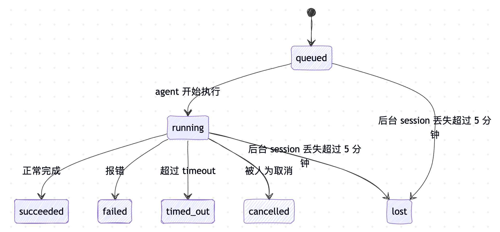
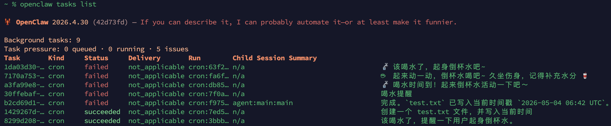
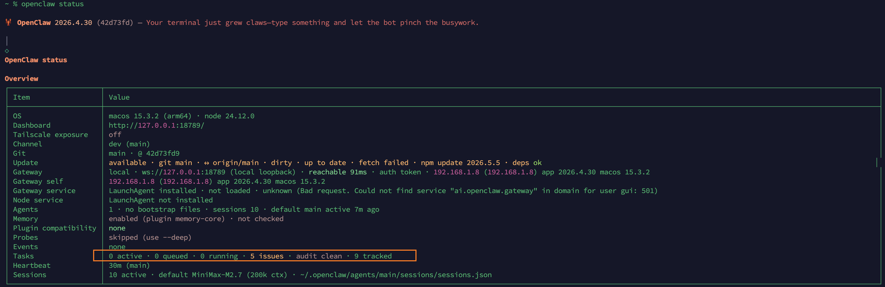
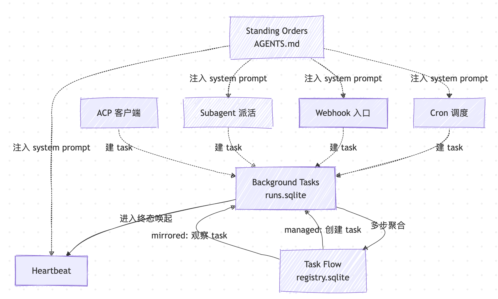

# 给小龙虾配本活动账本：Background Tasks 与 Task Flow

前面两篇我们给小龙虾装上了发条（Cron 和 Heartbeat）和外部入口（Webhook 和 Standing Orders）。到这里它已经能按表干活、被外部事件唤起、每次开会话都记得 `AGENTS.md` 里的边界。但只要这种脱离主会话的入口越多，一个问题就越迫切：那些跑在主会话之外的 agent 轮次，包括隔离的定时任务、调用 `/hooks/agent` 发起的一次性任务、还有后面将会学到的 subagent 任务，它们到底跑得怎么样了？是顺利完成、还是超时、还是在某个角落死循环了却无人问津？

OpenClaw 使用 **Background Tasks** 来回答这个问题。它不调度任何东西，只忠实地记下每一次后台工作的来龙去脉，是这套自动化体系的 **活动账本**。账本之上还有一层 **Task Flow**，把多步流程组织起来，在 Gateway 重启时也不会丢失进度。今天我们就来学习这两个新概念。

## Tasks 不是调度器

前面两篇里出现过一堆带 task 字眼的术语：*cron task*、*scheduled task*、*background task*。它们指的不是同一个东西：

| 名字                | 在 OpenClaw 里指的是                              |
| ------------------- | ------------------------------------------- |
| Scheduled task / Cron job | `~/.openclaw/cron/jobs.json` 里的 **调度定义**，由 Gateway 内置调度器按表触发 |
| Background task     | 每一次后台 agent 轮次的 **活动记录**，存在 `~/.openclaw/tasks/runs.sqlite` |
| Task Flow           | 多个 background task 串起来的 **流程编排状态**，存在 `~/.openclaw/flows/registry.sqlite` |

根据 OpenClaw 文档里的定义：

> Tasks do **not** replace sessions, cron jobs, or heartbeats — they are the **activity ledger** that records what detached work happened, when, and whether it succeeded.

翻译过来就是：Tasks 不是用来取代会话、cron job 或 heartbeat 的，它们是一份 **活动账本**，专门记录发生过哪些后台工作、什么时候发生、有没有跑成功。

也就是说，**Cron 决定什么时候跑，Tasks 记录跑了什么、跑得怎么样**，两者互不替代。

## 哪些动作会建一条 task 记录

不是每次 agent 轮次都会建 task，OpenClaw 把建 task 的来源分成四种 runtime：

| Runtime    | 触发场景                                                 | 默认 notify 策略  |
| ---------- | ---------------------------------------------------- | ------------- |
| `acp`      | ACP 子会话被起一次（外部 ACP 客户端跑 agent）                    | `done_only`   |
| `subagent` | 主 agent 通过 `sessions_spawn` 派活给 subagent           | `done_only`   |
| `cron`     | 任何 cron 触发的执行（主会话的也算，isolated 的也算）              | `silent`      |
| `cli`      | `openclaw agent` 这类命令通过 Gateway 起的轮次，包括异步媒体生成 | `silent`      |

而下面这些场景 **不会** 建 task 记录：

* **Heartbeat 轮次**：主会话里隔 30 分钟自己醒一次，太频繁，建账本没意义
* **正常的交互聊天**：用户发消息 → agent 回复，本来就在会话里有完整对话记录
* **`/<command>` 这类直接命令响应**：是 CLI 直返的，没有跑在主会话之外的 agent 轮次

总结来说：**任何会脱离主会话独立跑的 agent 轮次，都会留下一条 task 记录**。包括前几篇里反复出现的 isolated cron、`/hooks/agent` 触发的隔离轮次，它们其实都是在 cron / cli 这两个 runtime 下创建 task。

> 其中 notify 策略决定 task 跑完之后要不要主动推消息：`done_only` 只在终态时推一条，是 `acp` 和 `subagent` 的默认值；`silent` 并不是不记账，只是不主动发通知，是 `cron` 和 `cli` 的默认值，因为这两种 runtime 已经有 `--announce` 这类投递参数，再走一道默认通知就重复了。OpenClaw 还有第三种策略 `state_changes`，每次状态变化都推，太吵所以默认不挂在任何 runtime 上，需要密切关注某条 task 时再用 `openclaw tasks notify` 临时切过去。

## Task 的生命周期

每条 task 都从 `queued` 进入，最终落到一个终态。生命周期源码定义在 `src/tasks/task-registry.types.ts`：

```ts
export type TaskStatus =
  | "queued"
  | "running"
  | "succeeded"
  | "failed"
  | "timed_out"
  | "cancelled"
  | "lost";
```

七种状态的转换如下图所示：



每种状态含义如下：

| 状态        | 含义                                                    |
| --------- | ----------------------------------------------------- |
| `queued`  | task 已创建，等待 agent 起跑                                  |
| `running` | agent 轮次正在执行                                       |
| `succeeded` | 正常完成                                                  |
| `failed`  | 跑出了非超时类的错                                    |
| `timed_out` | 超过了配置的超时时间                                       |
| `cancelled` | 被 `openclaw tasks cancel` 显式打断                       |
| `lost`    | 后台运行时失去了对它的所有权，且超过 5 分钟宽限期   |

其中 `lost` 这个状态比较特殊，它不是 agent 主动报告的，而是 sweeper 检测出来的。这里的 sweeper 是一个定时的后台清扫器，专门负责把 task 的实际状态跟后台运行时对齐，并清掉过期的旧记录。它每隔 60 秒（源码里的 `TASK_SWEEP_INTERVAL_MS = 60_000`）扫一遍所有活跃的 task，看后台会话是不是还在。如果某个 ACP 子会话已经从注册表里消失、cron job 已经从活跃集合里移除、subagent 的子会话已经被销毁，OpenClaw 会先给 5 分钟（`TASK_RECONCILE_GRACE_MS = 5 * 60_000`）的宽限期，过了还没回来就标记为 `lost`。

## 上手 `openclaw tasks` 系列命令

这一节我们实际跑一下 Tasks 相关的命令，它们全部挂在 `openclaw tasks` 子命令下，不带任何子命令时等价于 `openclaw tasks list`。我们一个一个看。

### list：账本一览

最常用的就是 list，按时间倒序列出所有 task：

```
$ openclaw tasks list
```

运行结果如下：



输出列分别是 Task ID、Kind（runtime 类型）、Status、Delivery、Run ID、Child Session、Summary。如果想只看 isolated cron 跑出来的活，加 `--runtime cron`；只看在跑的，加 `--status running`：

```
$ openclaw tasks list --runtime cron --status running
```

加 `--json` 可以把整张表导出成结构化输出，方便接到其他工具或脚本里。

### show：单条详情

list 的输出列是浓缩版。要看完整字段就用 show：

```
$ openclaw tasks show <task-id>
```

show 会把 `createdAt` / `startedAt` / `endedAt`、投递状态、错误信息、终态摘要全部打出来。排查后台任务跑出问题时基本上靠它。

### cancel：踩刹车

如果某条 task 跑死循环、或者 prompt 写错了想取消，可以用 cancel 把它停掉：

```
$ openclaw tasks cancel <task-id>
```

不同 runtime 的处理方式不一样：ACP 和 subagent task 会去终止后台子会话，CLI 跟踪的 task 因为没有可终止的后台句柄（轮次本身可能早就跑完了），cancel 只在账本里走一次状态变更。最后无论哪种情况，task 状态都会切到 `cancelled`，并按当前 notify 策略发一次投递通知。

### notify：调投递粒度

每条 task 默认按所属 runtime 的 notify 策略推消息（`done_only` 或 `silent`）。如果想临时密切关注某条 task 的进展，可以临时切到 `state_changes`：

```
$ openclaw tasks notify <task-id> state_changes
```

切完之后，这条 task 每次状态变（包括进度更新）都会推一条出来。task 走到终态之后这个开关也就跟着结束了。

### audit：发现账本异常

audit 是 task 体系里我个人觉得最有价值的一个命令。它会扫一遍所有 task，按一组健康规则挑出有问题的记录：

```
$ openclaw tasks audit
```

规则在源码里定义在 `src/tasks/task-registry.audit.ts`，对应的告警规则有下面这几条：

| Finding                   | 触发条件                                                       | 严重度       |
| ------------------------- | ---------------------------------------------------------- | --------- |
| `stale_queued`            | task 在 `queued` 状态待了超过 10 分钟（`DEFAULT_STALE_QUEUED_MS`）     | warn      |
| `stale_running`           | task 在 `running` 状态跑了超过 30 分钟（`DEFAULT_STALE_RUNNING_MS`）  | error     |
| `lost`                    | 后台运行时已经没了，留着等回收           | warn / error |
| `delivery_failed`         | 投递失败且 notify 策略不是 `silent`                                 | warn      |
| `missing_cleanup`         | task 已经进入终态但没有 `cleanupAfter` 时间戳                    | warn      |
| `inconsistent_timestamps` | 时间线打架（比如 endedAt 比 startedAt 早）                            | warn      |

audit 的输出还会跟 `openclaw status` 联动：



命令输出中 Tasks 那一行 `audit clean` 状态，就是从 audit 这里来的。

### maintenance：清账与回收

audit 只报告问题不修问题，要真的修就得用 maintenance：

```
$ openclaw tasks maintenance
$ openclaw tasks maintenance --apply
```

不带 `--apply` 是 dry-run，只预览要做哪些动作；带上 `--apply` 才真正执行。maintenance 干的活分四类，都在 `src/tasks/task-registry.maintenance.ts` 里：

1. **状态核对**：核对每条活跃 task 的后台状态。ACP / subagent task 看子会话还在不在；cron task 看是不是还被 cron 运行时持有；聊天会话挂的 CLI task 看对应的运行上下文。后台状态丢了超过 5 分钟，就标 `lost`
2. **ACP 会话修复**：关掉孤儿的或已经进入终态的一次性 ACP 会话
3. **打 cleanup 时间戳**：给所有进入终态的 task 打上 `cleanupAfter = endedAt + 7 天` 的时间戳
4. **回收**：删掉超过 `cleanupAfter` 的记录

整个 sweeper 会每 60 秒自动跑一遍这套流程，所以正常情况下不需要手动跑。手动跑主要用在两个场景：CI 里跑 audit 拿不到干净结果，需要手动核对一遍；或者排查长时间堆积的 lost 记录。

> 进入终态的 task 默认保留 7 天（`TASK_RETENTION_MS = 7 * 24 * 60 * 60_000`），过期之后被 sweeper 自动清掉。如果你想长期归档某些 task，得在 7 天内手动导出。常见的做法有两种：用 `openclaw tasks list --json > tasks.json` 把整张账本（或者带 `--runtime` / `--status` 过滤后的子集）一次性写成 JSON 文件；或者直接把 `~/.openclaw/tasks/runs.sqlite` 拷出来，用 `sqlite3` 客户端跑 SQL 查。

## 投递路径与 notify 策略

讲完命令再回头看一个容易踩的点：task 跑完之后，结果到底是怎么推到你身上的？官方文档讲了两条路径：

* **直接投递（Direct delivery）**：task 创建时如果带了 `requesterOrigin`（也就是触发方所在的渠道，比如 Telegram 私聊），终态通知直接 POST 回那个渠道。subagent 的话还会保留 thread/topic 路由，从请求方会话的 `lastChannel` / `lastTo` / `lastAccountId` 兜底缺失字段
* **会话排队投递（Session-queued delivery）**：直接投递失败、或者根本就没绑外部渠道，更新会被塞进请求方会话的系统事件队列，等下一次 heartbeat 时连带冒出来

至于具体推多少，看的则是 notify 策略：

| 策略              | 推什么                                          |
| --------------- | -------------------------------------------- |
| `done_only`     | 只推终态（succeeded、failed 等），**默认值**  |
| `state_changes` | 每次状态变化和进度更新都推                        |
| `silent`        | 啥都不推                                         |

cron 和 cli 默认是 `silent` 策略，原因前面提过：cron 自己有 `--announce` 参数，再来一次默认通知就重复了。如果你想让某条默认静默的 task 也开始推通知，可以用前面讲过的 `openclaw tasks notify <task-id> done_only` 把它的策略临时改掉。

## Task Flow：把多个 task 串起来

讲完单条 task，再来看上一层的 Task Flow。

理论上一条 background task 就够你应付绝大多数后台任务了。但如果这件事需要拆分成好几个步骤执行，task 这一层就开始捉襟见肘了。比如周报流程：先收集数据、再生成报告、再投递。这三步如果都用 cron 各自定，一是没法保证按顺序、二是任何一步挂掉之后就只剩前面那几条 succeeded、看不出整体流程跑到哪。

为此 OpenClaw 提出了 **Task Flow** 的概念。从源码里看（`src/tasks/task-flow-registry.types.ts`），它其实是 task 之上的一层流程编排。Task Flow 保存在独立的 `~/.openclaw/flows/registry.sqlite` 文件中，跟 task 那边的 `runs.sqlite` 完全解耦，两者通过 `parentFlowId` 字段联系。一个 Task Flow 具有如下几种状态：

```ts
export type TaskFlowStatus =
  | "queued"
  | "running"
  | "waiting"
  | "blocked"
  | "succeeded"
  | "failed"
  | "cancelled"
  | "lost";
```

可以看到，跟 task 比，flow 多了 `waiting`（等下一步触发）和 `blocked`（被审批门槛卡住）两个状态。

> 另外，flow 还多了一个 `revision` 字段，自带版本号控制，每次更新都要带上预期的版本号，碰到并发冲突就直接拒绝。

另一个和 task 的区别在于，flow 还具备两种不同的同步模式：

```ts
export type TaskFlowSyncMode = "task_mirrored" | "managed";
```

这两种同步模式覆盖了两种使用场景：

| 模式            | 谁拥有生命周期             | 适合场景                                         |
| ------------- | ------------------ | -------------------------------------------- |
| `managed`     | Task Flow 全权负责        | 一段流水线：A 完成 → B 自动起 → C 自动起 → 整体成功 |
| `task_mirrored` | task 由外部创建，flow 只观察 | 三个独立 cron job 合起来组成一次早间简报       |

### managed 模式：流水线模式

managed 模式下，Task Flow 就是这条流水线的总指挥。它按步骤创建 task、等 task 完成、再推进到下一步。整体长这样：

```
Flow: weekly-report
  Step 1: gather-data     → task 创建 → succeeded
  Step 2: generate-report → task 创建 → succeeded
  Step 3: deliver         → task 创建 → running
```

Step 1 跑完之前 Step 2 不会启动；Step 2 还没完成时整个 flow 卡在 `running`。如果 Step 2 翻车了，flow 进 `failed`，Step 3 不会启动，前面那条 succeeded 的 task 也不会被回滚。

### mirrored 模式：观察者模式

mirrored 模式不一样，flow 不创建 task，它只是 **观察** 已经存在的 task，把它们当成一个整体来看。比如你现在已经有三个 cron job：

* `morning-news`：8:30 拉新闻
* `morning-meeting`：8:35 拉日历
* `morning-pr`：8:40 拉 PR 状态

各自独立运行，谁跑完都不需要等谁。但你想要一个统一视角看今天上午这套早间简报跑得怎么样，就可以用 mirrored flow 把这三条 task 关联起来，flow 状态就是这三条的聚合。

mirrored 模式最大的好处是 **不侵入现有 cron 配置**。三个 cron job 啥都不用改，flow 是从外部观察它们。

### Flow 的 CLI

flow 这一层的 CLI 挂在 `openclaw tasks flow` 下，只有三个子命令，全是 **观察和干预**，没有 create：

```
$ openclaw tasks flow list   [--status <name>] [--json]
$ openclaw tasks flow show   <lookup> [--json]
$ openclaw tasks flow cancel <lookup>
```

之所以没有 create，是因为 flow **并不是由用户直接通过 CLI 创建的**，而是由上层编排自动建出来的：比如通过 Lobster 流水线跑起来时，会建一条 managed flow，流水线的每个步骤落成带 `parentFlowId` 的 task；另外通过 `sessions_spawn` 创建的 subagent 或 ACP 子会话也会被自动包成一条 1:1 的 mirrored flow。

`tasks flow cancel` 跟 `tasks cancel` 最大的不同是它 **持久**：取消意图会写到 `~/.openclaw/flows/registry.sqlite`，即使 Gateway 重启，flow 也会保持 `cancelled`、不会再起新的步骤。已经在跑的子 task 会被一起拉下来，没起的 step 直接放弃。

> 关于这个话题比较复杂，这一节就讲到这里。Task Flow 真正发挥价值的场景是 **cron 触发 + Lobster 流水线 + Task Flow 追踪** 的三明治结构：cron 负责调度时机、Lobster 负责流水线 DSL 和审批门槛、Task Flow 负责跨 task 跨重启的状态。完整的端到端例子（怎么写一条 Lobster pipeline、flow 长什么样、出问题怎么排查）涉及 Lobster 这个工作流引擎本身的细节，篇幅放不下，我们后面单开一篇讲 Lobster 时再一起拆开讲。

## 把它跟前面几篇拼起来

到这里我们把 OpenClaw 自动化体系里的所有积木都见过一遍了：Cron 调度时间、Heartbeat 周期觉察、Webhook 接外部事件、Standing Orders 圈定边界、Background Tasks 记账、Task Flow 编排。整个图大概是这样：



这张图中有几个点值得记一下：

1. 调度入口（Cron / Webhook / Subagent / ACP）触发的所有后台轮次 **都会在 Tasks 里留一笔**；只有 Heartbeat 不建 task
2. Tasks 进入终态时反过来戳一下 Heartbeat，让结果在主会话里冒泡
3. Standing Orders 跨所有入口生效，是横切于上面这套图的一层 system prompt 注入
4. Task Flow 是可选的，简单单步活动用 task 就够，多步流程才升级到 flow

## 小结

通过这一篇，我们把 OpenClaw 自动化体系剩下的两块讲完了：

1. **Background Tasks**：后台 agent 轮次的活动账本，存在 `~/.openclaw/tasks/runs.sqlite`，由 ACP / subagent / cron / cli 四种 runtime 各自创建。Heartbeat 和正常聊天不建账
2. **CLI 工具集**：`openclaw tasks list/show/cancel/notify/audit/maintenance`。日常用 list 看一眼，audit 在 CI 或者排障时定期扫一下，maintenance 在需要立刻收紧账本时手动跑
3. **投递机制**：进入终态时优先直接投到 `requesterOrigin`，失败则塞进请求方会话的系统事件队列，下一轮 heartbeat 冒泡
4. **Task Flow**：task 之上的一层流程编排，存在 `~/.openclaw/flows/registry.sqlite`。`managed` 模式自己驱动多步流水线，`mirrored` 模式只观察外部创建的 task

现在小龙虾的整套自动化体系已经全部跑通：它会按时间表干活、能被外部事件唤起、每个会话都遵守 standing orders 的边界、所有后台工作都在账本里有据可查、多步流程能跨重启续上。但它依然只是一只 **单 agent** 的小龙虾。一个真正的工作助手往往需要把不同职责拆给不同的 agent，比如写代码归 work、处理生活琐事归 personal，还要让它们之间能互相派活。这就引出了 OpenClaw 的多 agent 体系，包括 `agent-send`、`subagents` 这两套机制。我们下一篇就来看看怎么给小龙虾分身。

## 参考

* [OpenClaw 官方文档](https://docs.openclaw.ai/)
* [OpenClaw GitHub 仓库](https://github.com/openclaw/openclaw)
* [Automation & Tasks 总索引](https://docs.openclaw.ai/automation)
* [Background Tasks 官方文档](https://docs.openclaw.ai/automation/tasks)
* [Task Flow 官方文档](https://docs.openclaw.ai/automation/taskflow)
* [openclaw tasks CLI 参考](https://docs.openclaw.ai/cli/tasks)
* [Heartbeat 官方文档](https://docs.openclaw.ai/gateway/heartbeat)
* [Scheduled Tasks（cron-jobs）官方文档](https://docs.openclaw.ai/automation/cron-jobs)
* [Standing Orders 官方文档](https://docs.openclaw.ai/automation/standing-orders)
* [Subagents 官方文档](https://docs.openclaw.ai/tools/subagents)
* [Lobster 工具文档](https://docs.openclaw.ai/tools/lobster)
