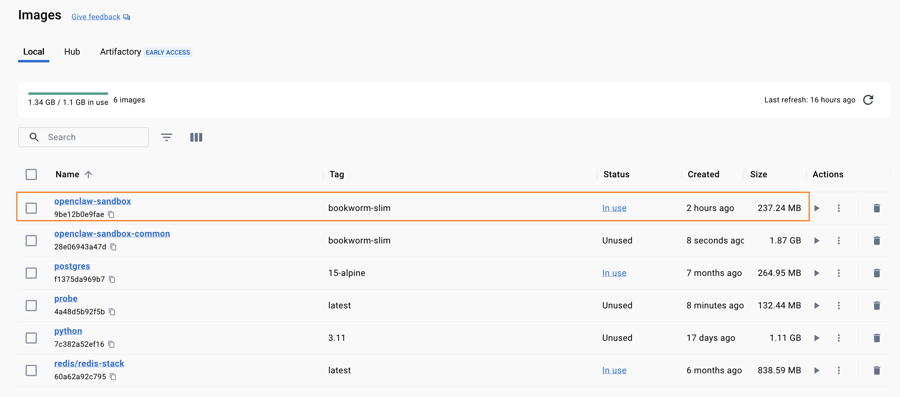
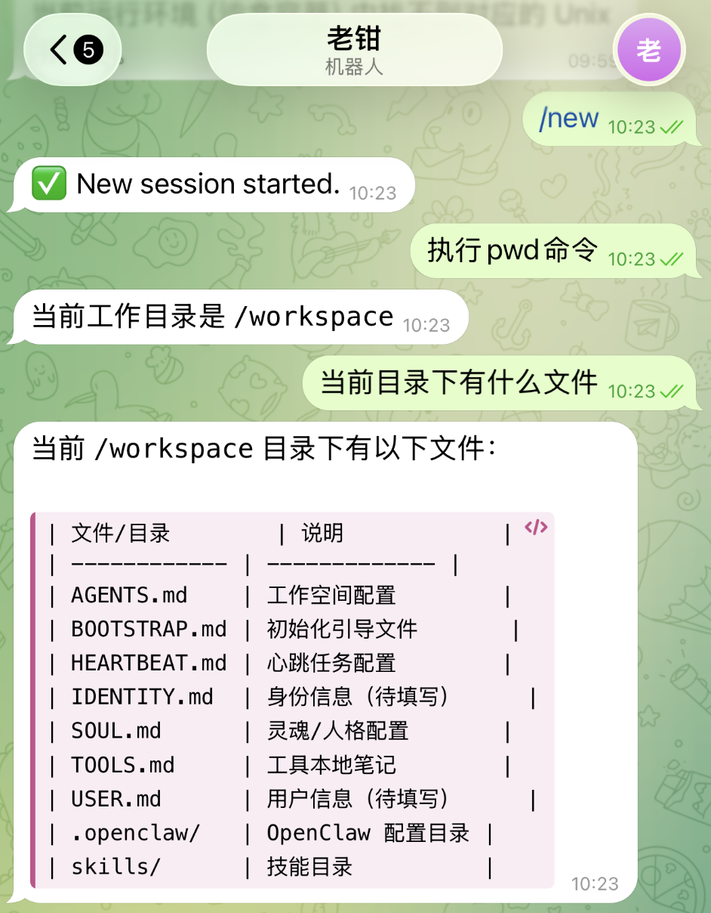
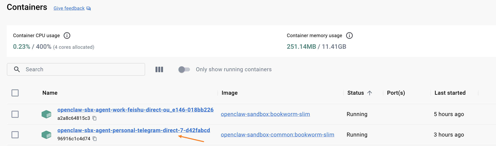
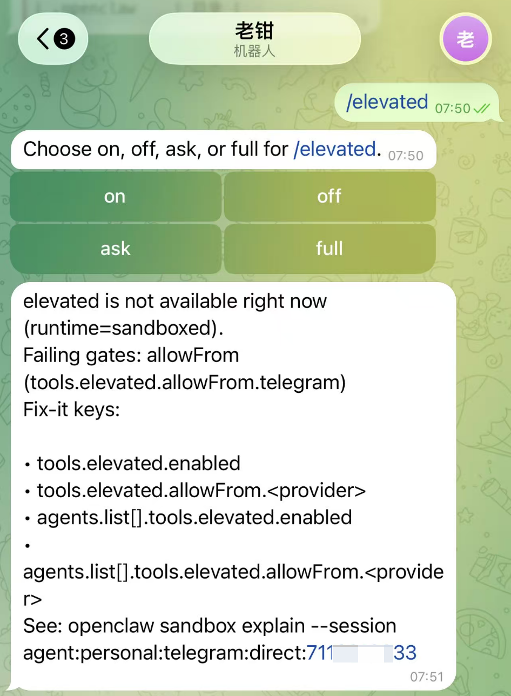
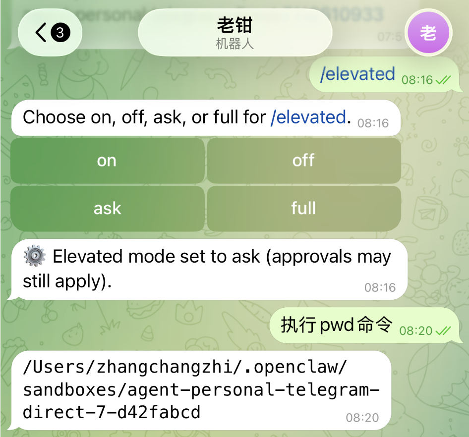
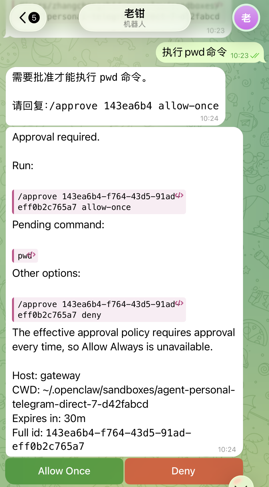
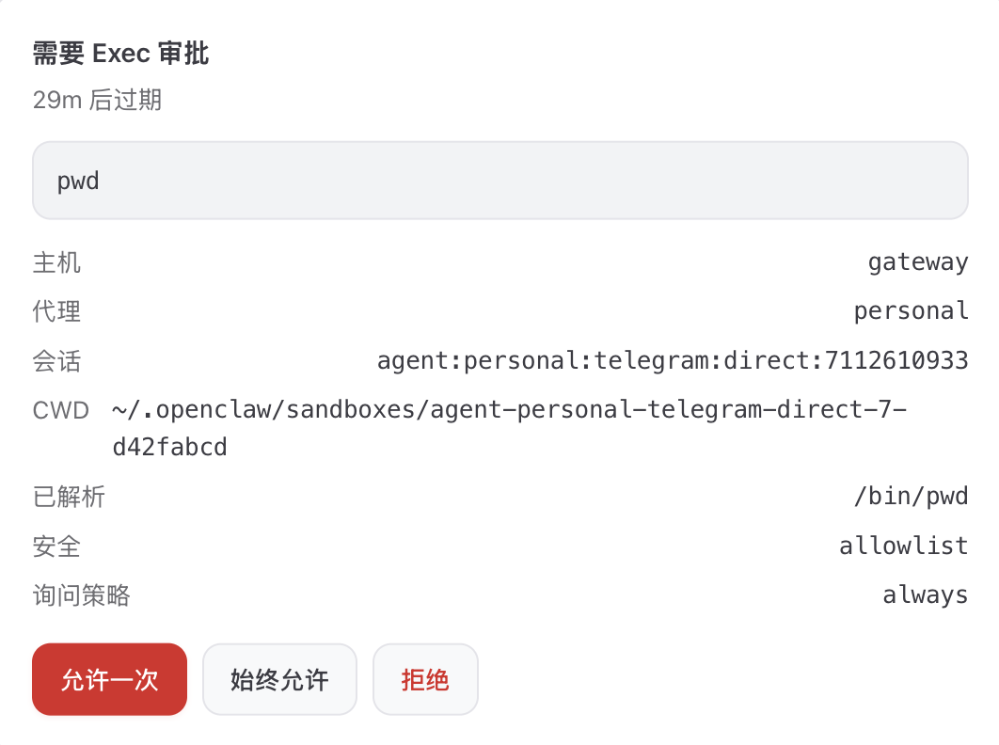

# 给小龙虾上把锁：Sandbox 沙箱机制

上一篇讲多 agent 的时候，我曾提到过：workspace 工作目录只是软隔离，工具拿到绝对路径仍然能访问主机其它位置，**要做硬隔离得开 sandbox 沙箱**。这句话当时只是顺嘴一提，但只要你把 OpenClaw 接到群里、给朋友试用、甚至挂到对外的客户群上，就会发现沙箱这道墙才是整个安全模型的关键。

群里随便一个人发一句 `帮我 ls 一下 ~/.ssh`，如果 agent 的 `exec` 直接打到宿主机上，那么 OpenClaw 就跟木马没什么区别。OpenClaw 给出的标准答案是 **Sandbox**：自己用的 main 会话保持原生权限，群聊、频道这些非 main 会话进 Docker、SSH 或 OpenShell 后端执行工具。今天我们就来学习下这套沙箱机制。

## 为什么需要沙箱

OpenClaw 出厂的设计哲学是 **装它的人就是用它的人**，用户在 main 会话中对话，就相当于在使用本地终端，工具必须直接打到宿主机上才好用。比如让 `exec` 运行在 `~/Codes` 目录下面、让 `read` 能看到真实的 `.env` 文件内容、让 `process` 能运行或操作本地的程序，这套模型在单人单机场景下顺手得不得了。main 会话直接跑在宿主机上，本质上等于给了 agent 你这个用户的权限，agent 能做的事就是你能做的事。

但一旦这只小龙虾不只是你自己在用，故事就变了。客户群里偷偷塞进来的一段 prompt injection、朋友试用时不小心引导出来的 `rm -rf`，只要被 agent 当真去执行，损失就会真真切切打到你的机器上。这就是为什么需要把这类会话关进沙箱里：模型抽风也好、有人故意下套也好，破坏都被框在容器里出不来。

OpenClaw 对会话边界的判定其实很简单，不是按 agent id 走的，而是按 `session.mainKey`，默认的主会话是 main，群组和频道的会话用的是它们各自的 key，所以会被算作非 main 会话。

也就是说，**只要消息是从一个不是你独占的入口进来的，OpenClaw 就应该把它关进沙箱里跑**。那么剩下的问题就是：怎么把这条原则落到配置里，告诉 OpenClaw 哪些会话该进沙箱、用什么后端跑、隔离要做到什么程度。

> 要注意的是，沙箱不是一道密不透风的墙，OpenClaw 文档自己也承认：「这不是一道完美的安全边界，但在模型抽风的时候，它能实打实地限制对文件系统和进程的访问」。能把模型抽风造成的破坏面框在容器里，已经比裸跑安全得多。

## 三种 sandbox 模式

最先要讲的是 `agents.defaults.sandbox.mode` 参数，它决定 **哪些会话需要进沙箱**，一共三种取值：

| 模式          | 含义                                | 适用场景                               |
| ----------- | --------------------------------- | ---------------------------------- |
| `off`（默认）   | 不开沙箱，所有会话都在宿主机跑                 | 自己一个人单机用，对工具完全信任             |
| `non-main`  | 只有非 main 会话进沙箱，main 会话保持原生权限 | 推荐起步配置，单人 + 群组场景的平衡点          |
| `all`       | 所有会话都进沙箱，连 main 也不例外            | 多人协作、对外服务、把 Gateway 公开到 tailnet |

最小启用配置长这样：

```json5
{
  "agents": {
    "defaults": {
      "sandbox": {
        "mode": "non-main",
        "scope": "session",
        "workspaceAccess": "none"
      },
    },
  },
}
```

这里还出现了另两个参数：

* **`scope`**：决定容器粒度。`agent`（默认）一个 agent 一个容器；`session` 一个会话一个容器，隔离最强但容器开销最大；`shared` 所有沙箱会话共享一个容器，资源占用最低。群聊场景推荐 `session`，每个群一个容器，彼此访问不到对方的文件。
* **`workspaceAccess`**：控制沙箱能看到多少宿主 workspace。`none`（默认）只能看到 `~/.openclaw/sandboxes` 里它自己那块临时空间；`ro` 把 agent workspace 只读挂载到 `/agent`；`rw` 读写挂载到 `/workspace`。

> 生产场景下不建议直接开 `rw` 把整个 workspace 全部挂给沙箱，更稳妥的做法是保持 `ro` 或 `none`，再通过 Docker 后端的额外挂载机制把真正需要的少数目录单独开口子（具体怎么挂下面 Docker 后端那一节会讲）。

## 三种 sandbox 后端

另一个要讲的是 `agents.defaults.sandbox.backend` 参数，它控制 **沙箱用什么 runtime**，OpenClaw 当前支持三种：

| 维度       | Docker（默认）         | SSH                | OpenShell           |
| -------- | ----------------- | ------------------ | ------------------- |
| 跑在哪      | 本机 Docker 容器        | 任意可 SSH 的远程机器       | OpenShell 托管的远程沙箱     |
| 启动开销     | 低（容器复用，毫秒级）        | 中（首次需 seed 远程 workspace） | 中（取决于 OpenShell provision） |
| 隔离强度     | Docker namespace 级 | 取决于远程主机本身的隔离        | OpenShell 平台保证        |
| 配置复杂度    | 低（一行 setup 脚本）     | 中（SSH key + target host） | 中（启 OpenShell 插件 + 账号） |
| Workspace | bind-mount 或 copy | remote-canonical（首次 seed） | `mirror` 或 `remote` 两种模式 |
| 浏览器沙箱    | 支持                | 不支持                | 暂不支持                 |
| 适合场景     | 本地开发，完整隔离          | 把工具调用扔到一台远程机器执行    | 托管型远程沙箱 + 双向同步        |

绝大多数读者用 Docker 就够了：本地装好 Docker Desktop，Gateway 通过 `/var/run/docker.sock` 跟 daemon 通讯，沙箱拉起一次几百毫秒，调试体验跟本地几乎一致。

SSH 后端适合两类人：一是宿主机不愿意装 Docker，又有一台闲置的小服务器；二是希望工具调用产生的副作用全部隔离在一台与本机完全分开的机器上，本机只跑 Gateway 这个控制面。SSH 后端是 **remote-canonical**（以远端为准）模式，第一次创建沙箱时把本地工作区 seed 到远端，之后所有读写都直接打远端，本地不会再同步回来；如果本地修改了文件，要 `openclaw sandbox recreate` 重新 seed。

> 这里的 seed 是「播种 / 注入初始数据」的意思，表示**单向的一次性初始化复制**：把本地 workspace 的文件作为种子内容铺到远端那台空机器上，铺完之后就以远端为事实源，本地后续的改动不会再自动同步过去。和下面 OpenShell `mirror` 模式的双向同步不是一回事。

[OpenShell](https://github.com/NVIDIA/OpenShell) 是 NVIDIA 出品的 agent 安全运行时，OpenClaw 通过 `extensions/openshell` 这个扩展接入它。它底层走的还是 SSH 后端那条通道，但所有的操作交给 `openshell` CLI 接管，并且多了一个 `mirror` 模式可以把本地 workspace 双向同步到远端，在你需要本地编辑文件 + 远端执行的混合工作流时很有用。

## 启用 Docker 沙箱

前面讲了那么多，下面这一节我们就来走一遍 Docker 沙箱的最小启用流程。

### 第 1 步：构建沙箱镜像

OpenClaw 默认沙箱镜像叫 `openclaw-sandbox:bookworm-slim`，源码 checkout 下来之后运行下面的命令构建该镜像：

```bash
$ scripts/sandbox-setup.sh
```

如果镜像缺失但你又把 sandbox mode 打开了，OpenClaw 在对话时不会静默忽略，而是直接失败，并打印一条提示告诉你如何构建镜像：

```
Embedded agent failed before reply: Sandbox image not found: openclaw-sandbox:bookworm-slim. Build it with scripts/sandbox-setup.sh before enabling Docker sandboxing. The default image includes python3 for sandbox write/edit helpers; OpenClaw will not substitute plain debian:bookworm-slim.
```

这个镜像不大，只有 237M：



它的内容很克制，我们打开 `scripts/docker/sandbox/Dockerfile` 看一眼：

```dockerfile
FROM debian:bookworm-slim@sha256:...

RUN apt-get update \
  && apt-get install -y --no-install-recommends \
    bash \
    ca-certificates \
    curl \
    git \
    jq \
    python3 \
    ripgrep

RUN useradd --create-home --shell /bin/bash sandbox
USER sandbox
WORKDIR /home/sandbox

CMD ["sleep", "infinity"]
```

可以看到默认镜像只装了 `bash`、`curl`、`git`、`jq`、`python3`、`ripgrep` 这几样基础工具，不带 `nodejs`。如果想要功能更全的沙箱，OpenClaw 也提供了一个 `openclaw-sandbox-common` 的扩展镜像，自带 `nodejs`、`python3`、`golang`、`pnpm`、`bun`、`brew` 这些常用工具：

```bash
$ scripts/sandbox-common-setup.sh
```

然后把 `agents.defaults.sandbox.docker.image` 改成 `openclaw-sandbox-common:bookworm-slim` 就好。

### 第 2 步：写配置 + 重启

最小启用就是上面那一段 `mode: "non-main"` 的配置，写到 `~/.openclaw/openclaw.json` 里，然后重启 Gateway：

```bash
$ openclaw gateway restart
```

### 第 3 步：观察沙箱效果

到 Telegram 里和 agent 对话，让它执行一条 `pwd` 命令：



可以看到回复的是 `/workspace` 这种容器内路径，而不是宿主机上的 workspace 目录。在宿主机上 `docker ps` 命令：



可以看到名字以 `openclaw-sbx-` 开头的容器被拉起来了，每个非 main 会话对应一个。容器默认 `CMD` 是 `sleep infinity`，agent 真正跑工具时是通过 `docker exec` 进去执行的。

容器默认网络是 `none`，意味着沙箱里既不能访问外网也不能访问宿主机局域网。如果业务上确实需要联网（比如要执行 `npm install`、`pip install` 命令），可以修改 `agents.defaults.sandbox.docker.network: "bridge"` 配置。

> 注意 `network: "host"` 是 OpenClaw 强烈不推荐的，因为它绕过了所有网络隔离。

回头补一下前面 `workspaceAccess` 那里说过的一个问题，生产场景不建议把整个 workspace 用 `rw` 挂进沙箱，更稳妥的做法是用额外挂载单独开口子，可以通过 `agents.defaults.sandbox.docker.binds` 参数来实现。比如让沙箱看到一份只读的字典数据、再给 agent 一个干净的可写 scratch 目录：

```json5
{
  "agents": {
    "defaults": {
      "sandbox": {
        "docker": {
          "binds": [
            "/Users/foo/dict:/dict:ro",
            "/Users/foo/scratch:/scratch:rw"
          ]
        }
      }
    }
  }
}
```

格式是 Docker 风格的 `host:container:mode`，`mode` 取 `ro`（只读）或 `rw`（读写）。注意上面的 defaults 里配置的是全局 `binds`，每个 agent 也可以配置自己的 `binds`，它们两是**合并**关系而不是覆盖，所以一般将共用数据挂载在 defaults 里，特定数据挂载到特定的 agent 里。

## 沙箱工具策略

在讲沙箱里这套策略之前，先简单介绍一下 OpenClaw 的**工具策略**。OpenClaw 的 agent 默认能调用一大堆工具：`exec` 跑命令、`read` / `write` / `edit` 读写文件、`browser` 控制浏览器、`cron` 创建定时任务、`gateway` 调 Gateway 自身的控制 API，这些工具默认都开启着。但实际场景里你未必希望每个 agent 都拿到全套权限：客服 agent 不该有删文件的本事，写日报的 agent 也用不上浏览器自动化。OpenClaw 因此提供了一套工具策略机制：用 `tools.allow` 和 `tools.deny` 两个白/黑名单字段决定每个工具能不能被调用，同一个工具如果同时出现在两边，**`deny` 永远赢**。这套策略写在 `tools.*` 下面是全局规则，写到 `agents.list[].tools.*` 下面就是针对某个 agent 的个性化配置。

回到沙箱。沙箱解决的是**工具在哪儿跑**的问题，但也要考虑**哪些工具允许被调用**。OpenClaw 在工具策略之上又叠了一层专门给沙箱用的策略，定义在 `tools.sandbox.tools.allow` 和 `tools.sandbox.tools.deny`，**只对沙箱会话生效**，跟全局工具策略是叠加关系，两边都放行的工具才能在沙箱里调用。

默认允许列表和默认拒绝列表写在 `src/agents/sandbox/constants.ts` 里：

```typescript
export const DEFAULT_TOOL_ALLOW = [
  "exec",
  "process",
  "read",
  "write",
  "edit",
  "apply_patch",
  "image",
  "sessions_list",
  "sessions_history",
  "sessions_send",
  "sessions_spawn",
  "sessions_yield",
  "subagents",
  "session_status",
] as const;

export const DEFAULT_TOOL_DENY = [
  "browser",
  "canvas",
  "nodes",
  "cron",
  "gateway",
  ...CHANNEL_IDS,
] as const;
```

沙箱默认放开 `exec`、`process`、`read`、`write`、`edit`、`apply_patch` 这套基础执行工具，加上 `sessions_*` 这套会话管理工具，足够应付绝大多数群聊里的代码问答、文件读写、子会话编排需求。

默认拒绝里值得特别留意几个：

* `browser`：浏览器自动化工具，沙箱里默认不允许，避免群聊用户让 agent 去刷你浏览器里的登录态
* `canvas`：Live Canvas 工具，沙箱里不允许直接画
* `nodes`：跨设备节点 RPC，沙箱里不能直接调你的 iOS/Android 节点
* `cron`：定时任务工具，沙箱里不能创建 cron 任务
* `gateway`：调用 Gateway 自身控制 API 的工具，沙箱里不能借它提权逃出沙箱
* `...CHANNEL_IDS`：所有频道 ID（discord、telegram、slack、feishu 等），不能在沙箱里直接操作频道

如果业务上确实需要群里的 agent 调某个被默认拒绝的工具，可以按需放开。但这里有一个**容易踩坑**的地方：`allow` 和 `deny` 这两个字段一旦你显式写了，就是**完全替换**默认值，不是合并。换句话说，如果你为了放开 `cron` 而写了 `"deny": ["browser", "canvas", "nodes", "gateway"]`，看似只是去掉了 `cron`，实际上**默认 deny 里的 `CHANNEL_IDS` 也跟着没了**，沙箱里的 agent 就可能调这些频道工具了。

正确的做法是用 `alsoAllow` 这个字段。它跟 `allow` 不一样，**不会替换默认值，而是在默认值之上做加法**：当你只写 `alsoAllow` 而不动 `allow` / `deny` 时，OpenClaw 会保留默认 allow + 默认 deny 不变，然后把 `alsoAllow` 里出现的工具**追加进最终生效的允许列表**，同时**自动从默认 deny 里扣掉**这些工具，其他没动到的拒绝项原封不动地继续拦着。比如要放开 `cron` 让群聊会话也能创建定时任务：

```json5
{
  "tools": {
    "sandbox": {
      "tools": {
        // 只追加 cron，默认拒绝里的 browser / canvas / nodes / gateway / CHANNEL_IDS 全部保留
        "alsoAllow": ["cron"]
      }
    }
  }
}
```

如果同时还想放开几组工具，OpenClaw 提供了 `group:*` 快捷写法，比如 `group:fs` 一次性放开 `read`/`write`/`edit`/`apply_patch`，`group:runtime` 放开 `exec`/`process`/`code_execution`，`group:web` 放开 `web_search`/`web_fetch`：

```json5
{
  "tools": {
    "sandbox": {
      "tools": {
        "alsoAllow": ["cron", "group:web"]
      }
    }
  }
}
```

## 用 elevated 给 exec 留一条应急通道

开启沙箱之后，偶尔会遇到一类场景：群聊会话里跑了半天，agent 突然需要做一件危险动作，比如把生成的报告写到宿主机的某个目录，或者跑一条只能在宿主机上执行的命令。每次都改全局配置太重，OpenClaw 提供了 `elevated` 流程作为临时应急通道。

要注意的是，elevated **不是给沙箱开后门**，它只影响 `exec`，作用是让 `exec` 跑出沙箱、回到宿主机执行：

* elevated 只针对 `exec`，不放开整个工具集。被 `tools.sandbox.tools.deny` 拦掉的工具仍然进不来
* elevated 不会绕过全局 `tools.deny`。如果一个工具在全局策略里就被禁了，elevated 也救不回来
* 在已经直接跑在宿主机上的会话里（main 会话且 `mode: off`），elevated 不起任何作用
* elevated 触发 exec 时仍然走正常的审批流程：群里有人发起调用，OpenClaw 会把这次 exec 拦下来，你点同意它才真正执行

elevated 的开关都直接在聊天里发命令切换（就是那种以 `/` 开头的斜杠命令）：

| 命令              | 行为                                |
| --------------- | --------------------------------- |
| `/elevated on`  | 跑出沙箱，但每次 exec 仍要审批             |
| `/elevated ask` | 同上（`on` 的别名）                     |
| `/elevated full`| 跑出沙箱并跳过 exec 审批（仅当前会话）         |
| `/elevated off` | 回到沙箱内执行                          |
| `/elevated`     | 不带参数，查看当前级别                       |

不过，第一次使用该功能时你大概率会遇到 `elevated is not available right now (runtime=sandboxed)` 这条报错：



这是 OpenClaw **有意为之**的安全设计，不能让任何一个能 @ agent 的人都有权限把 exec 跑出沙箱。`tools.elevated` 默认虽然开着，但发送者白名单 `allowFrom` 必须**显式列出谁能触发**，没在名单里就一律拒绝。

要让某个用户能用 elevated 功能，在 `~/.openclaw/openclaw.json` 加这段：

```json5
{
  "tools": {
    "elevated": {
      "enabled": true,
      "allowFrom": {
        // 只允许 telegram 里数字 ID 是 7112345678 的人触发 elevated
        "telegram": ["7112345678"]
      }
    }
  }
}
```

`allowFrom.<provider>` 数组里的每一项支持四种写法，**强烈建议用数字 user ID**，避免别人换名字之后白名单失效：

| 写法 | 匹配 | 备注 |
| --- | --- | --- |
| `"7112345678"` | 数字 user ID | 推荐，最稳 |
| `"id:7112345678"` | 同上，显式声明 | |
| `"username:yourhandle"` | Telegram 用户名 | 本人能改掉 |
| `"name:张三"` | 显示名 | 最不稳 |

改完配置记得 `openclaw gateway restart` 重启 Gateway。如果还跑不通，用下面这条命令打印当前 session 的有效策略和状态：

```bash
$ openclaw sandbox explain --session agent:personal:telegram:direct:<your-user-id>
```

### 还有一个坑：YOLO 默认模式

配好 `allowFrom` 之后再发 `/elevated on`，agent 这次终于跑出沙箱了：



但很快你会发现一件事跟前面那张表格对不上：表格里写着「`/elevated on` 跑出沙箱，但每次 exec 仍要审批」，可现实是 agent 直接就执行了命令，**审批根本没弹出来**。

翻了一下源码 `src/infra/exec-approvals.ts`：

```typescript
const DEFAULT_ASK: ExecAsk = "off";
```

加上 `tools.exec.security` 默认值是 `"full"`，因此 OpenClaw 出厂就是 **YOLO 模式**：所有命令直接执行，不弹审批。

所以前面那张表格更精确的说法是：

- `/elevated on`：跑出沙箱，**按当前 `tools.exec.ask` 配置走审批**，默认 `"off"` 等于不弹
- `/elevated full`：跑出沙箱，**强制**跳过审批，即使你配了 `ask: "always"` 也无视

也就是说默认配置下 `on` 和 `full` 表现完全一样。要让 elevated 真的把审批弹出来，得显式把 `tools.exec.ask` 调成 `"always"`（每次都弹）或 `"on-miss"`（命令不在预批准列表里时才弹）：

```json5
{
  "tools": {
    "exec": {
      "ask": "always"
    },
    "elevated": {
      "enabled": true,
      "allowFrom": {
        "telegram": ["7112345678"]
      }
    }
  }
}
```

`tools.exec.ask` 的三档取值：

| 取值 | 含义 |
| --- | --- |
| `"off"`（默认） | 永远不弹审批，命令直接执行（YOLO） |
| `"on-miss"` | 命令不在 `~/.openclaw/exec-approvals.json` 预批准列表里时才弹 |
| `"always"` | 每次都弹审批 |

到这一步 `/elevated on` 才真正像表格里说的那样，跑出沙箱 + 每次 exec 都要你点同意：



我们不仅可以在 Telegram 中审批，Control UI 中也会弹窗：



## 小结

通过这一篇，我们把 OpenClaw 的沙箱机制整体过了一遍：

1. **为什么要沙箱** —— main 会话直接跑等于给 agent 你的本机权限，群聊和频道这些非 main 会话天然算高风险，应该进沙箱
2. **三种沙箱模式** —— `off` / `non-main`（推荐起步）/ `all`，配合 `scope` 和 `workspaceAccess` 调整隔离粒度
3. **三种沙箱后端** —— Docker（默认且最常用）、SSH（把工具调用扔到远程机器）、OpenShell（托管沙箱 + 双向同步）
4. **沙箱工具策略** —— 默认放开 `exec`、`process`、`read`、`write`、`edit`、`apply_patch`、`sessions_*`，拒绝 `browser`、`canvas`、`nodes`、`cron`、`gateway` 和所有频道 ID
5. **使用 elevated 临时提权** —— 只对 `exec` 生效，不放开整个工具集，可以配 `allowFrom` 限制哪些用户能触发

到这里，小龙虾在自己机器上的安全边界算是画清楚了。但前面这一路一直有个没怎么挑明的事实：你这些天敲的那些 `openclaw` 命令、浏览器里打开的 Control UI 网页，其实都是通过 WebSocket 连进 Gateway 这个有状态的中枢进程的，它们都算 OpenClaw 的**官方客户端**。除此之外还有 macOS app、以及手机上的 OpenClaw Node app，也都是同一类客户端。本机客户端连起来很顺，直接访问 `ws://127.0.0.1:18789` 就行；可一旦你想让手机上的 OpenClaw Node app 也能连上家里的 Gateway，这就是个问题了。

所以接下来两篇是连着的一对：下一篇先讲 **Gateway 的远程访问**，看 OpenClaw 怎么在不破坏安全底线的前提下把本机限制放开，让外网的客户端也能找到 Gateway；再下一篇讲 **iOS / Android Node 配对**，把手机上的 OpenClaw Node app 和家里的 Gateway 配上对，手机就能当远程麦克风、摄像头和位置传感器，配合 voice wake 出门也能用。

## 参考

* [OpenClaw 官方文档](https://docs.openclaw.ai/)
* [OpenClaw GitHub 仓库](https://github.com/openclaw/openclaw)
* [Sandboxing 官方文档](https://docs.openclaw.ai/gateway/sandboxing)
* [Sandbox vs Tool Policy vs Elevated](https://docs.openclaw.ai/gateway/sandbox-vs-tool-policy-vs-elevated)
* [Elevated Mode 官方文档](https://docs.openclaw.ai/tools/elevated)
* [OpenShell 沙箱后端文档](https://docs.openclaw.ai/gateway/openshell)
* [Multi-Agent Sandbox & Tools](https://docs.openclaw.ai/tools/multi-agent-sandbox-tools)
* [Network model 官方文档](https://docs.openclaw.ai/gateway/network-model)
