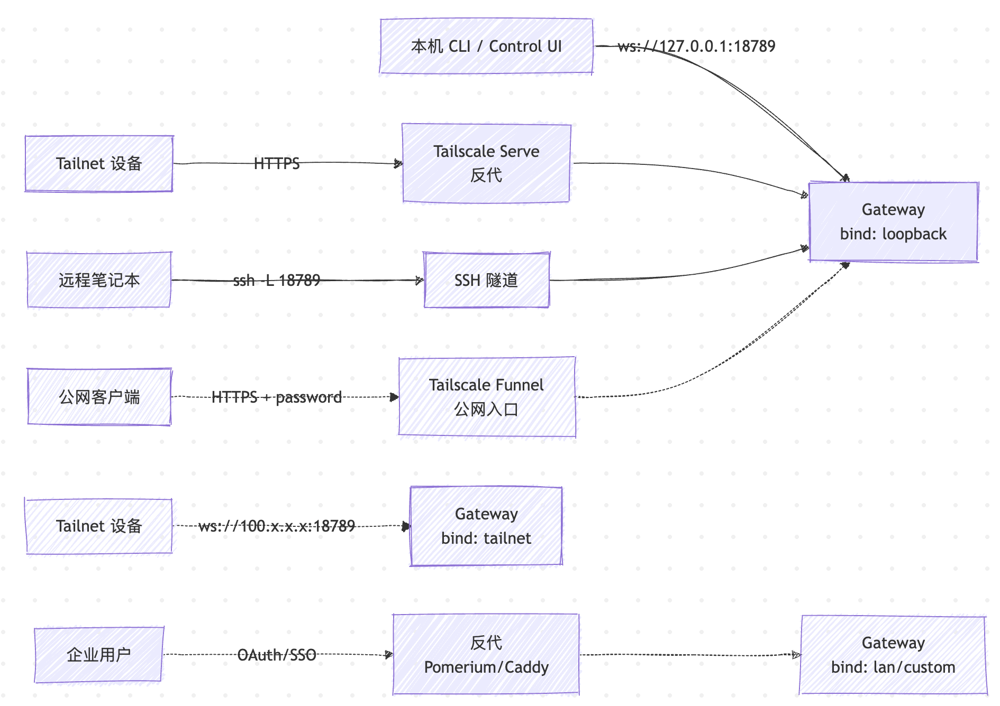
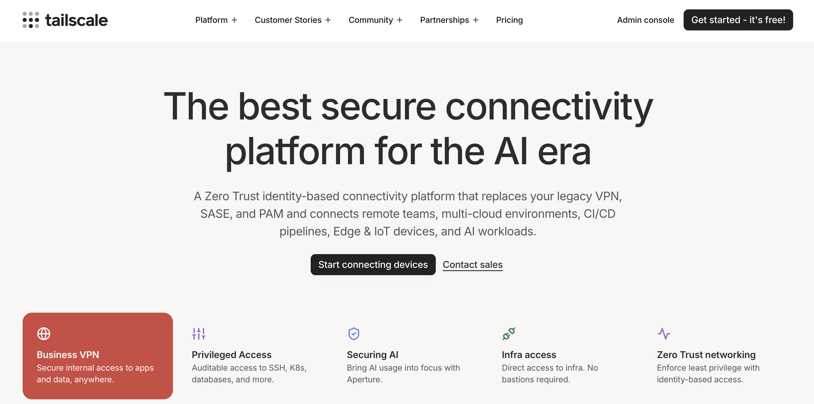
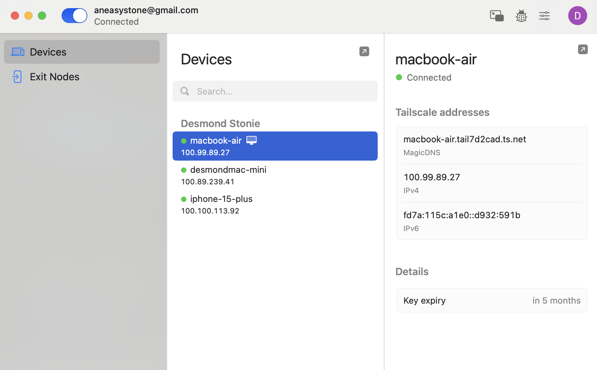
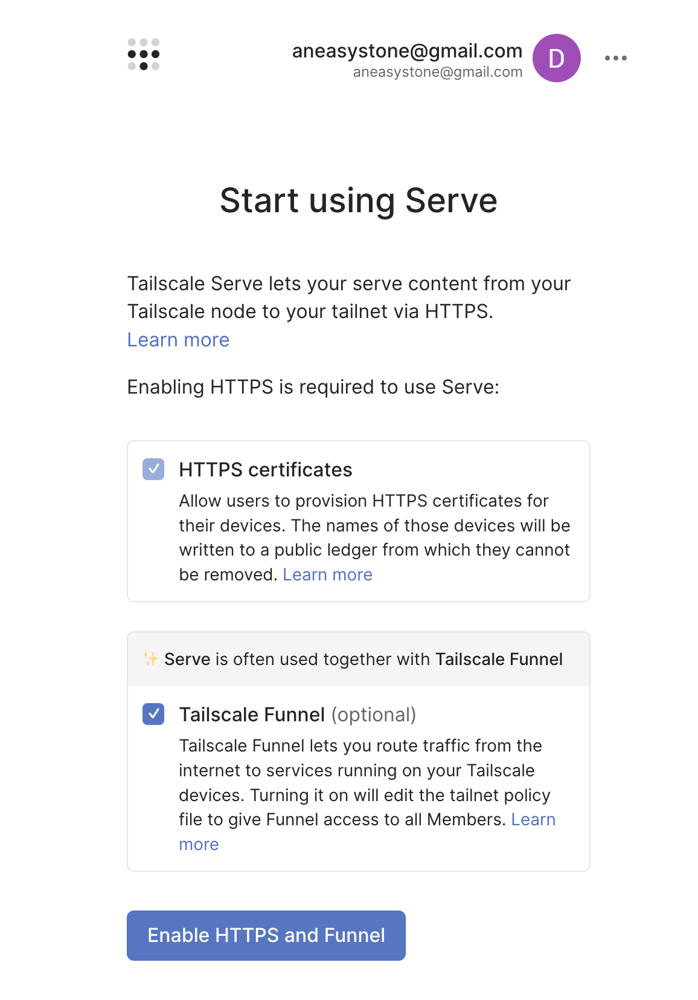
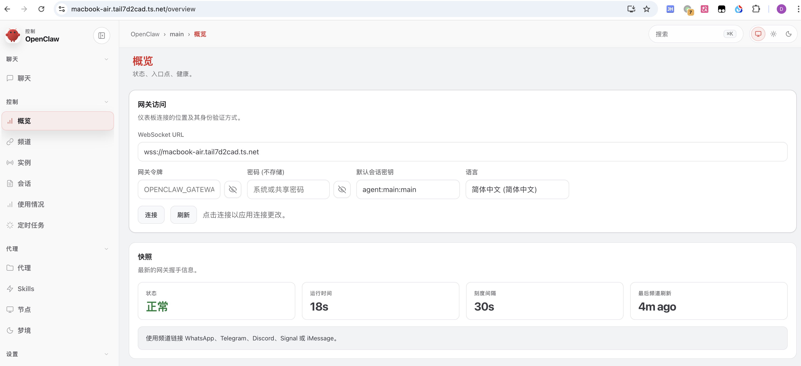
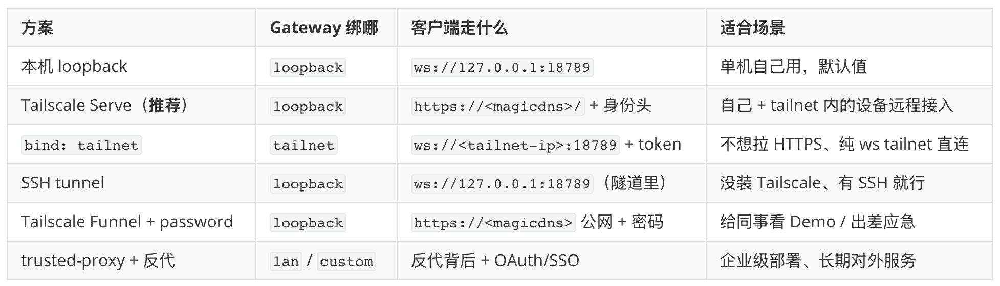

# 把小龙虾搬到外网：Gateway 远程访问

上一篇结尾我们提到，无论是 `openclaw` 命令，浏览器里打开的 Control UI 页面，还是 macOS app，本质上都是通过 WebSocket 连进 Gateway 的客户端。本机运行的话没什么问题，因为它们直接连的就是 `ws://127.0.0.1:18789`；可一旦客户端和 Gateway 不在同一台机器上，事情就没那么简单了。

不过讲到这里有个绕不开的疑问：前面几篇花了不少篇幅讲 Telegram、飞书这类 channel，出门在外发条消息就能让家里的 agent 干活，channel 这条路看起来已经够用了，那为什么还要费劲让客户端从外面连回 Gateway 呢？

其实，从 Gateway 视角看，外面要连进来的客户端其实分**三类**，它们的分工各有不同：

| 角色 | 谁在用 | 干什么 |
| --- | --- | --- |
| **channel** | Telegram、飞书、Slack、WhatsApp | 通过聊天工具发文字消息让 agent 干活 |
| **operator** | CLI、macOS app、浏览器 Control UI | 直接对话 + 配置管理 + 看健康状态 |
| **node** | iOS / Android Node、macOS 节点模式 | 把摄像头、麦克风、GPS、屏幕、Live Canvas 暴露给 agent 调用 |

channel 是你**通过聊天工具**指挥 agent；operator 是你**直接坐在控制台**指挥；node 则是反过来，agent 主动调用你身边设备的硬件能力。所以这三类并不是互相替代的关系，而是应该一起用，谁也少不了谁。

所以 Gateway 的远程访问实际上是在解决两类场景：

* **operator 远程**：家里 Mac mini 一直跑着 Gateway，但你出差带的是公司笔记本，想用本地 macOS app 开 WebChat、改改 agent 的 system prompt、跑 `openclaw status` 看一下健康状态，CLI / app 都得能连回家里的 Gateway。
* **node 远程**：手机上的 OpenClaw Node 走 4G 或外面的 WiFi 反向连回家里的 Gateway。配上 voicewake 这套全局唤醒词，你在外面说一句 "Hey Claw 看看我现在在哪，帮我查附近最近的咖啡馆"，手机录到语音 → WebSocket 推给家里的 agent → agent 调用 `location.get` 拿 GPS → 查询位置信息 → 通过 `talk.speak` 把答案语音播回手机。这套近场体验是 channel 完全替代不了的。

这两类场景的共同前提，都是 Gateway 不能继续躲在 `127.0.0.1` 后面。这一篇我们就来学习下 **Gateway 远程访问**，看 OpenClaw 怎么在不破坏安全底线的前提下，把默认绑死 loopback 的口子按场景一点点放开，让外网的 operator 和 node 都能访问家里的 Gateway。

## Gateway 绑定方式一览

OpenClaw 的默认设计非常保守，除非你明确告诉它要绑别的网卡，否则只监听 loopback 本机回环。我们可以通过 `gateway.bind` 参数修改绑定方式，一共 5 种取值：

| `bind`        | 监听到哪儿                                | 备注                            |
| ------------- | ------------------------------------ | ----------------------------- |
| `loopback`    | `127.0.0.1`（默认）                       | 外面够不着，最安全                     |
| `auto`        | 优先 loopback，loopback 不可用时退到 lan      | 兜底用                           |
| `tailnet`     | Tailscale 网卡的 100.x.x.x 地址            | tailnet 内可见，loopback 不通       |
| `lan`         | `0.0.0.0`，整个局域网都能访问                  | 必须配 auth                      |
| `custom`      | 用 `host` 字段显式指定 IP / interface       | 高阶用法                          |

从外面接 Gateway 的方案也大致有 5 种，按使用频率从高到低排：

1. **loopback + Tailscale Serve**（推荐）—— Gateway 守在 loopback，Serve 在前面做 HTTPS 反代
2. **loopback + SSH tunnel** —— 没装 Tailscale 的通用回退方案
3. **loopback + Tailscale Funnel + password** —— 公网兜底，适合 Demo 演示和 应急
4. **`bind: tailnet` 直连** —— 不要前置代理，Gateway 直接绑 Tailscale 网卡，纯 ws 走 tailnet
5. **`bind: lan` / `custom` + trusted-proxy 反代** —— 企业级部署，把鉴权委托给前面的 Pomerium / Caddy + OAuth

后面我们重点展开前三种，后两种作为补充会在对应章节里顺带提一下。



注意看这张图里 Gateway 那一侧的三种绑定：

* **`bind: loopback`** —— 三种主流方式（Serve / SSH tunnel / Funnel）都让 Gateway 老老实实绑在 loopback 上不动，差别只在前面挂了什么前置代理
* **`bind: tailnet`** —— 跳过前置代理，Gateway 直接绑 Tailscale 网卡，loopback 反而连不通了
* **`bind: lan` / `custom`** —— 企业部署常用，Gateway 直接对内网开口，但前面必须挂一层带 OAuth/SSO 的反代，由反代注入 `x-forwarded-user` 头

## Tailscale 介绍

这里先花点篇幅介绍下 [Tailscale](https://tailscale.com)，没用过的同学可能会比较陌生。简单说，它是一套基于 WireGuard 的零配置 VPN：装上客户端登录账号之后，你名下所有设备（Mac、iPhone、家里的 NAS、云上的 VPS）会自动加入同一个虚拟内网，这个内网叫 **tailnet**。每台设备会被分到一个 `100.x.x.x` 的固定 IP，互相之间端到端加密，NAT 穿透由 Tailscale 帮你搞定，体验上就跟在同一个局域网里没什么区别。**Tailscale Serve** 则是 Tailscale 提供的一个附加功能，能把本机某个端口以 HTTPS 形式发布给 tailnet 里的其他设备访问，相当于自带一个内部反代。



安装也很省事，每台需要互联的设备都装一下客户端就行。装完第一次跑 `tailscale up`（macOS 是点菜单栏图标 → Log in），它会弹一个浏览器让你用 Google / GitHub / Microsoft 等账号登录，登完这台设备就自动加入你的 tailnet 了。

可以通过下面两条命令验证一下：

```bash
$ tailscale status        # 看 tailnet 里有哪些设备、各自的 100.x IP 和在线状态
$ tailscale ip -4         # 看本机的 tailnet IP
```

每台设备还会自动拿到一个形如 `mac-mini.tailnet-xxxx.ts.net` 的 MagicDNS 域名，后面 OpenClaw 把 Gateway 通过 Tailscale Serve 发出来后，tailnet 里的其他设备直接用这个域名就能访问，不用记 IP。



## 方式一：Tailscale Serve（推荐）

回到正题。如果你已经在用 Tailscale，这是最舒服的远程访问方式：Gateway 仍然只绑 loopback，Tailscale Serve 在前面做 HTTPS 终结、把 tailnet 内的流量代理过来，并把 Tailscale 的身份头注入请求。换句话说，**控制面继续留在 loopback 上，外网视角下 Gateway 根本不存在，但 tailnet 视角下你又能从任何设备打开 Control UI**。

修改 `~/.openclaw/openclaw.json` 配置如下：

```json5
{
  "gateway": {
    "bind": "loopback",
    "tailscale": { "mode": "serve" },
    "auth": {
      "mode": "token",
      "token": "your-token",
      "allowTailscale": true,
    },
    "controlUi": {
      "allowedOrigins": ["https://macbook-air.tail7d2cad.ts.net"],
    },
  },
}
```

其中几个参数解释一下：

* **`tailscale.mode`**：取值 `off | serve | funnel` 三选一，控制 OpenClaw 要不要主动配置 Tailscale Serve / Funnel
* **`auth.mode`**：取值 `none | token | password | trusted-proxy` 四选一，跟 Tailscale 没关系，是 Gateway HTTP/WS 自身的认证模式
* **`auth.allowTailscale`**：是个旁路开关。打开之后，**当请求来自 Tailscale Serve 通道**时，Control UI 和 WebSocket 可以走 Tailscale 注入的身份头直接放行，不再要求 token
* **`controlUi.allowedOrigins`**：浏览器 origin 白名单，把你的 MagicDNS 域名填进去，否则从另一台 tailnet 设备打开 Control UI 时，WebSocket 握手会被服务端以 `origin not allowed` 拒掉

值得一提的是，OpenClaw 在 server 侧不是简单地相信 Tailscale 注入的 `tailscale-user-login` 头，它会反查一次。在 `src/gateway/auth.ts` 源码里可以看到这么一段逻辑：

```typescript
async function resolveVerifiedTailscaleUser(params: {
  req?: IncomingMessage;
  tailscaleWhois: TailscaleWhoisLookup;
}) {
  const { req, tailscaleWhois } = params;
  const tailscaleUser = getTailscaleUser(req);
  if (!tailscaleUser) return { ok: false, reason: "tailscale_user_missing" };
  if (!isTailscaleProxyRequest(req)) return { ok: false, reason: "tailscale_proxy_missing" };
  const clientIp = resolveTailscaleClientIp(req);
  if (!clientIp) return { ok: false, reason: "tailscale_whois_failed" };
  const whois = await tailscaleWhois(clientIp);
  if (!whois?.login) return { ok: false, reason: "tailscale_whois_failed" };
  if (normalizeLogin(whois.login) !== normalizeLogin(tailscaleUser.login)) {
    return { ok: false, reason: "tailscale_user_mismatch" };
  }
  return { ok: true, user: { login: whois.login, name: whois.name ?? tailscaleUser.name } };
}
```

整体逻辑大致四步：

1. 请求里得有 `tailscale-user-login` 头
2. 请求得真的是从 Tailscale 代理过来的（带 `x-forwarded-*` 头，且来源 IP 在受信任代理列表里）
3. 用 `tailscale whois` 反查一次客户端 IP，能拿到 `login`
4. `whois.login` 和请求头里的 `login` 必须一致

四关都过才算认证通过。这套机制让人没办法在本地伪造一个 `tailscale-user-login: nick@example.com` 来骗过 Gateway。也正因为这层校验是 **本机调用 `tailscale whois` 完成的**，整个 tokenless 流隐含一条信任假设：**Gateway 所在主机本身是可信的**，不会有别的本地恶意进程能直接扔伪造头进 loopback。如果同主机上有不可信代码，建议还是把 `allowTailscale` 关回 `false`，老老实实走 token 认证。

> 顺带提一句 Tailscale 的另一种用法：`gateway.bind: "tailnet"`。这是直接把 Gateway 绑到 Tailscale 网卡上，不走 Serve 也不走 HTTPS，端口直接对 tailnet 暴露。这种模式下 loopback `127.0.0.1:18789` 反而不通，必须用 tailnet IP 访问。它适合你不想拉 HTTPS、就想要纯 ws 直连 tailnet 的场景，但 auth 必须配 token 或 password，否则启动直接失败。

启动时 OpenClaw 会自动调用 `tailscale serve` 把 18789 暴露到 tailnet，配置好之后 tailnet 内的设备直接通过 `https://<magicdns>/` 就能访问 Control UI。不过第一次启动可能没那么顺利，大概率会遇到下面的启动报错：

```
[tailscale] serve failed: Command failed: /usr/local/bin/tailscale serve --bg --yes 18789
```

通常是因为你之前从来没在这台设备上用过 `tailscale serve`，所以 tailnet 里 serve 功能还没开。手动执行以下报错里的命令，显示如下：

```
Serve is not enabled on your tailnet.
To enable, visit:

  https://login.tailscale.com/f/serve?node=nmxRvhzEEk11ABCDE
```

根据提示，使用浏览器打开链接：



点击 Enable 后，就能看到下面的提示：

```
Success.
Available within your tailnet:

https://macbook-air.tail7d2cad.ts.net/
|-- proxy http://127.0.0.1:18789

Serve started and running in the background.
To disable the proxy, run: tailscale serve --https=443 off
```

再次重启 Gateway 后，就能看到下面的成功提示了：

```
[tailscale] serve enabled: https://macbook-air.tail7d2cad.ts.net/ (WS via wss://macbook-air.tail7d2cad.ts.net)
```

至此，到另一台 tailnet 设备浏览器访问 MagicDNS 域名就能看到 OpenClaw 的 Control UI 了：



## 方式二：SSH tunnel

不用 Tailscale 的话，SSH tunnel 是最通用的回退方案。但是得有一个前提：**你必须能 SSH 到那台机器**。如果 Gateway 所在的 server 运行在家里，它藏在 NAT 后面，也没有公网 IP，最省心的办法是租一台有公网 IP 的小 VPS 当跳板：家里用 `autossh -R` 把端口反向常驻映射到 VPS 服务器，然后无论你在哪里，都可以先 SSH 到 VPS 再跳到家里。

如果可达性问题解决了，建立 SSH tunnel 的命令如下：

```bash
$ ssh -N -L 18789:127.0.0.1:18789 -p 22 user@home-server
```

其中 `user` 是你在跑 Gateway 那台机器上的登录账号，`home-server` 是那台机器的主机名或 IP（或上面提到的 VPS 跳板）。隧道起来之后，本地 `ws://127.0.0.1:18789` 这个地址就接到了远程 Gateway。它的好处是 **Gateway 那边什么都不用动**，仍然只绑 loopback、auth 仍然走老 token，是最不需要重新设计架构的接入方式。

使用浏览器打开 `http://127.0.0.1:18789` 页面，输入家里那台 Gateway 的 token，然后就可以用浏览器来管理家里的 OpenClaw 了。

如果还想用 CLI（`openclaw status`、`openclaw health` 这些）连过去，得先改一下**本机**的配置。因为装了 OpenClaw 的机器默认 `gateway.mode` 是 `local`，CLI 会以为自己就是 Gateway 宿主，去探本机的 gateway 并用本地的 `gateway.auth.token` 认证，结果就是即使隧道通了也会报 `unauthorized: gateway token mismatch`。正确做法是把本机配成家里 Gateway 的**远程客户端**，修改 `~/.openclaw/openclaw.json` 如下：

```json5
{
  "gateway": {
    "mode": "remote",
    "remote": {
      "url": "ws://127.0.0.1:18789",
      "token": "<家里 Gateway 的 gateway.auth.token>",
    },
  },
}
```

改成 `mode: "remote"` 之后，CLI 就会通过隧道连远程 Gateway 了。此时运行 `openclaw health` 显示的就是家里那台 Gateway 的信息。

> 要注意 `gateway.remote.token` 跟 `gateway.auth.token` 不是一回事，一个是 **客户端拿来连服务端** 的凭证，一个是 **服务端要求客户端出示** 的凭证。

## 方式三：Tailscale Funnel + password（公网兜底）

在动手之前先把 Funnel 和上一节的 Serve 拎出来对比一下，两者的差别就一个：流量从哪儿进来。

| 维度 | Tailscale Serve | Tailscale Funnel |
| -- | --- | --- |
| 谁能访问 | 只有你 tailnet 里的设备 | 整个公网，任何人凭 URL 都能打开 |
| 入口域名 | `https://<machine>.<tailnet>.ts.net`（tailnet 内可解析） | 同样的 `*.ts.net` 域名，但走 Tailscale 的公网入口节点 |
| 端口限制 | 任意端口 | 只能用 `443 / 8443 / 10000` 三个 |
| 流量路径 | tailnet 内部 WireGuard 加密直连 | 经 Tailscale 的 ingress 节点转发到你的机器 |

一句话总结：**Serve 是给自己人用的内部反代，Funnel 则是 Serve 的对外公开版**。所以选哪个的判断标准也简单，所有要访问 Gateway 的设备都能装 Tailscale 客户端吗？能就选方式一 Serve，搞不定（比如要分享给朋友试一下、或者某个客户端环境装不了 Tailscale）才退到 Funnel。

直接把 Gateway 暴露到公网在技术上是允许的，但是不推荐。如果一定要走公网，OpenClaw 给的官方方案是 **Tailscale Funnel + 共享密码**：

```json5
{
  "gateway": {
    "bind": "loopback",
    "tailscale": { "mode": "funnel" },
    "auth": { "mode": "password", "password": "replace-me" },
  },
}
```

`tailscale funnel` 在 OpenClaw 里被强制要求 `auth.mode: "password"`，启动时直接校验，没有密码不让 Funnel 起来。这里有个让人疑惑的地方：为什么 funnel 偏偏要 password 认证呢？按理 token 通常是 64-byte 的随机串，强度应该比人类设的密码更高才对。翻了一遍源码也没找到注释说明具体原因，大概是因为 funnel 是把 Gateway 开放到公网、通常还要分享给别人用的，这种场景下应该单独设一个一次性的密码发出去，而不是把 Gateway 自己的 token 直接暴露出去，毕竟那个 token 是其他客户端也在用的主凭证。强制走 password，相当于在配置层面就把对外公开用的凭证和内部用的 token 隔开了。

这套方案适合临时给同事看个 Demo 或者自己出差时手机能直接连进来这类场景。**长期对外服务**还是建议走 trusted-proxy 模式（下一节展开），把鉴权委托给一层带 OAuth/SSO 的反向代理。

## 鉴权模式速览

前面三种接入方式里 `gateway.auth.mode` 参数反复出现，这一节我们稍微整理一下。一共四种取值：

| 模式               | 适用场景                                  | 凭证类型                         |
| ---------------- | ------------------------------------- | ---------------------------- |
| `none`           | 严格的 loopback only 部署                  | 无                            |
| `token`          | 默认推荐                                  | 一次性长 token                   |
| `password`       | Tailscale Funnel / 浏览器手输             | 共享密码                         |
| `trusted-proxy`  | 反代 + 身份感知（Pomerium、Caddy + OAuth、nginx + oauth2-proxy） | 反代注入的 `x-forwarded-user`     |

日常用得最多的是 `token`。你跑 onboard 向导的时候它就顺手帮你生成好了，写在 `gateway.auth.token` 里，客户端连的时候可以带上 `--token` 或者塞进 `OPENCLAW_GATEWAY_TOKEN` 环境变量，这是最省心，也最不容易出岔子的认证方式。

`password` 跟 `token` 其实干的是同一件事（服务端都是拿你给的字符串去和配置文件中的值进行比对），区别只在「给谁用」：token 通常是 64 字节的随机串，让人对着浏览器手敲一遍不太现实；password 是你自己设的、记得住的字符串，所以 Funnel 这种需要在浏览器里手输凭证、甚至要发给别人用的场景就指定它。

`trusted-proxy` 常用于企业部署。OpenClaw 自己不碰 OAuth/SSO 这摊事，直接甩给前面的 Pomerium 或者 Caddy 代理，反代那边把身份验完，往请求里塞一个 `x-forwarded-user: nick@example.com`，OpenClaw 只做两件事：先确认这请求确实是从 `gateway.trustedProxies` 名单里的 IP 转发过来的，再把 user 头读出来。配置长这样：

```json5
{
  "gateway": {
    "bind": "lan",
    "trustedProxies": ["10.0.0.1"],
    "auth": {
      "mode": "trusted-proxy",
      "trustedProxy": {
        "userHeader": "x-forwarded-user",
        "allowUsers": ["nick@example.com"],
      },
    },
  },
}
```

> trusted-proxy 模式默认会拒绝 loopback 来源的请求，避免本地恶意进程伪造身份头。如果你的反代和 Gateway 在同一台机器上走 loopback，要显式打开 `gateway.auth.trustedProxy.allowLoopback: true`。`gateway.trustedProxies` 列表只列你反代的真实 IP，不要写整个网段。

至于 `mode: "none"`，基本只在纯私网的部署里才用得上。你要是既不绑 loopback 又把 auth 关成 `none`，OpenClaw 直接拒绝启动，但这只是兜底的最后一道闸，真上了公网可千万别指望它。说句更保守的：哪怕是家里 NAS 那种内网，只要这台机器跟你其它设备不在一个你敢完全担保的网段里，至少也挂个 token 吧。

## 小结

今天我们把 OpenClaw Gateway 的远程访问方案过了个遍。下面用一张表格做个总结：



到这里，Gateway 就能让外网的客户端接进来了。接下来几篇我们就来看看 OpenClaw 自带的那几个原生客户端：下一篇先从 macOS 菜单栏 app 开始，再往后是 iOS / Android Node，把手机上的 OpenClaw Node 和家里的 Gateway 配上对，让它当远程麦克风、摄像头和位置传感器，配合 voice wake，出门在外也能随时唤起 agent。

## 参考

* [OpenClaw 官方文档](https://docs.openclaw.ai/)
* [OpenClaw GitHub 仓库](https://github.com/openclaw/openclaw)
* [Remote access 官方文档](https://docs.openclaw.ai/gateway/remote)
* [Tailscale 集成文档](https://docs.openclaw.ai/gateway/tailscale)
* [Authentication 文档](https://docs.openclaw.ai/gateway/authentication)
* [Trusted Proxy Auth 文档](https://docs.openclaw.ai/gateway/trusted-proxy-auth)
* [Network 总览](https://docs.openclaw.ai/network)
* [macOS Remote over SSH 运行手册](https://docs.openclaw.ai/platforms/mac/remote)
* [Tailscale Serve 官方文档](https://tailscale.com/kb/1312/serve)
* [Tailscale Funnel 官方文档](https://tailscale.com/kb/1223/tailscale-funnel)
