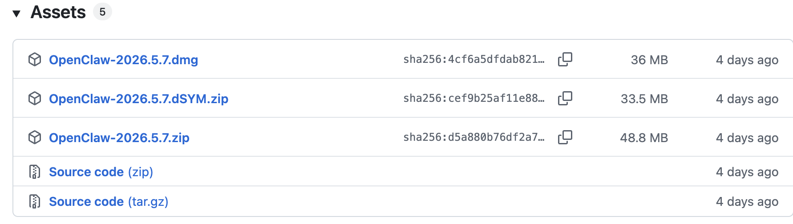
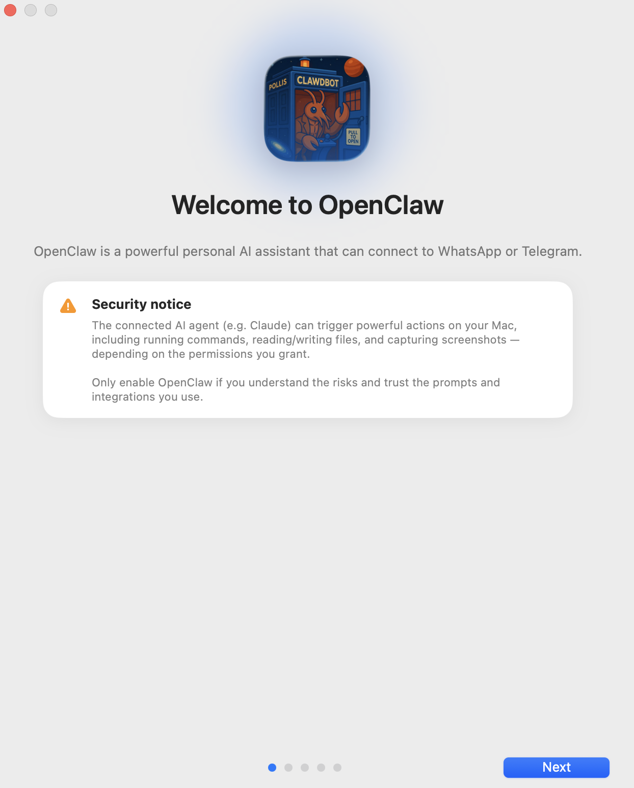
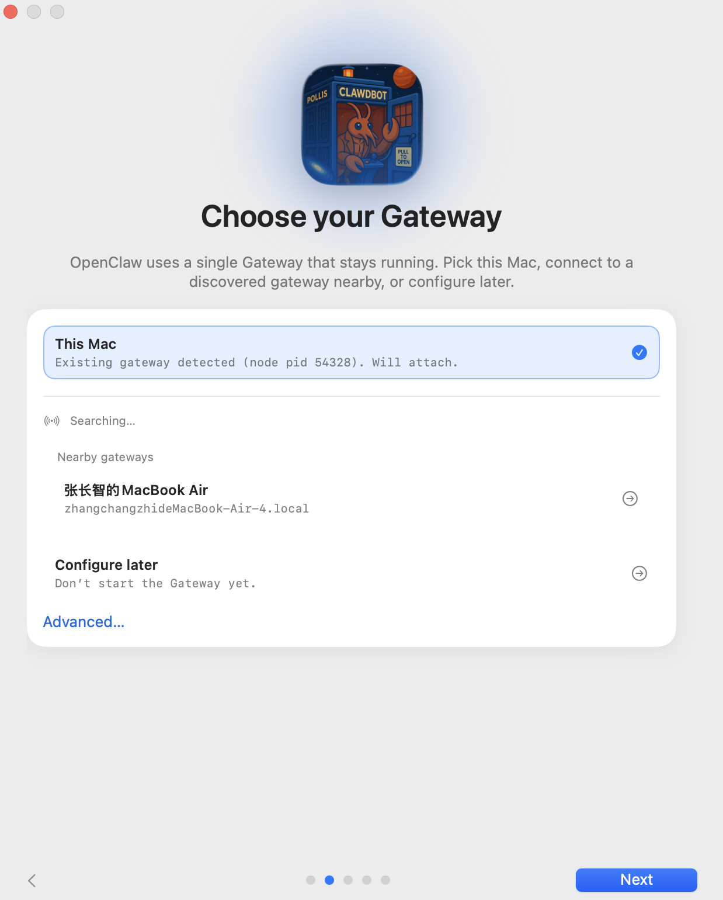
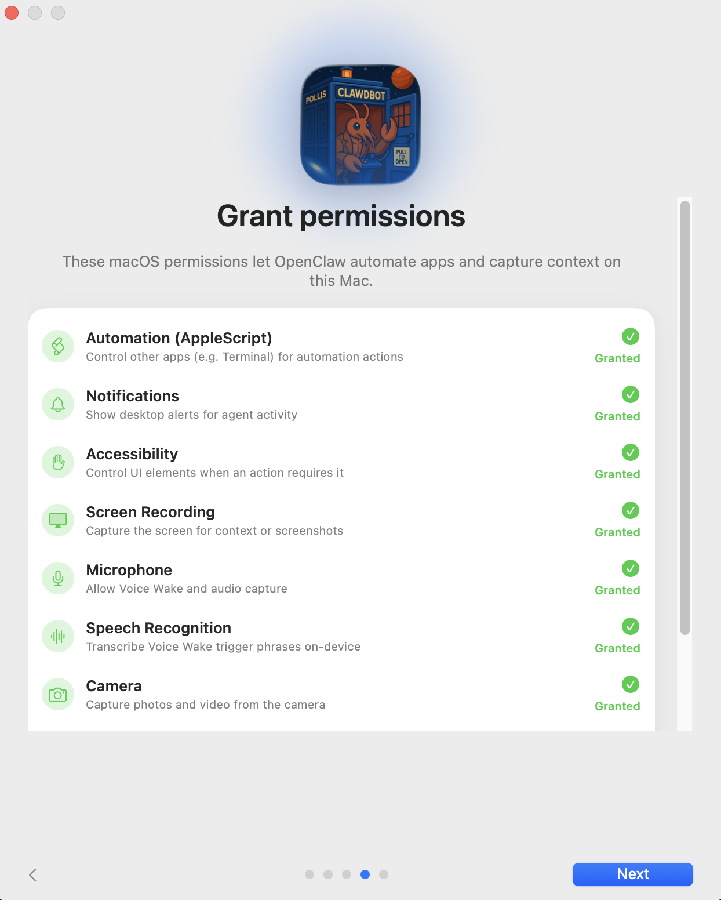
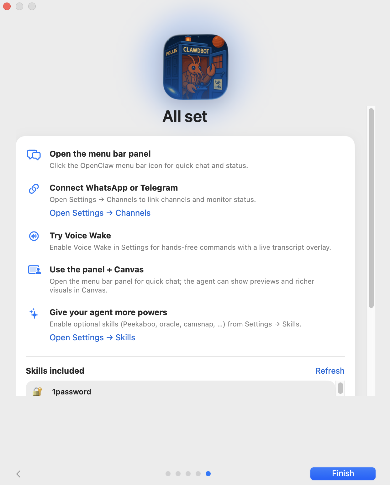
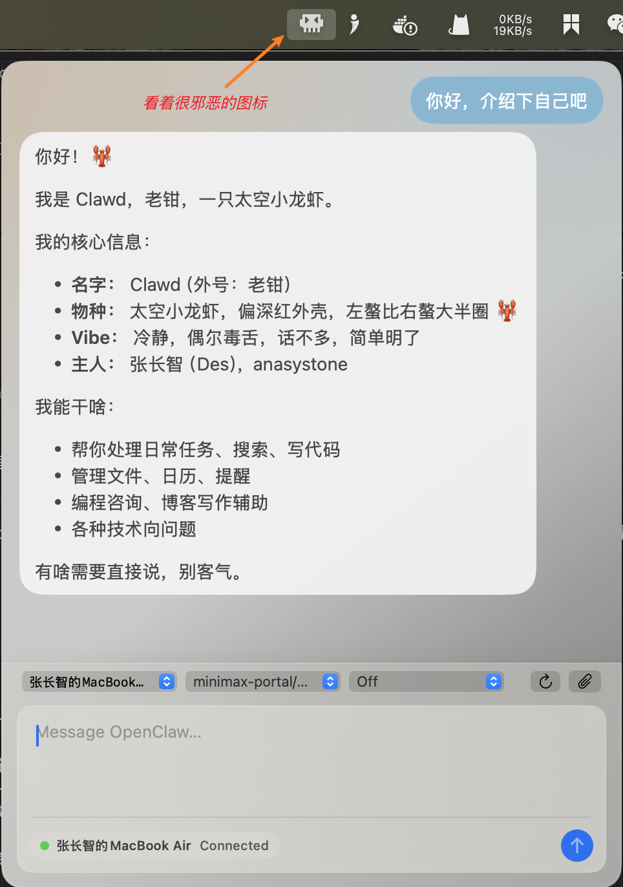
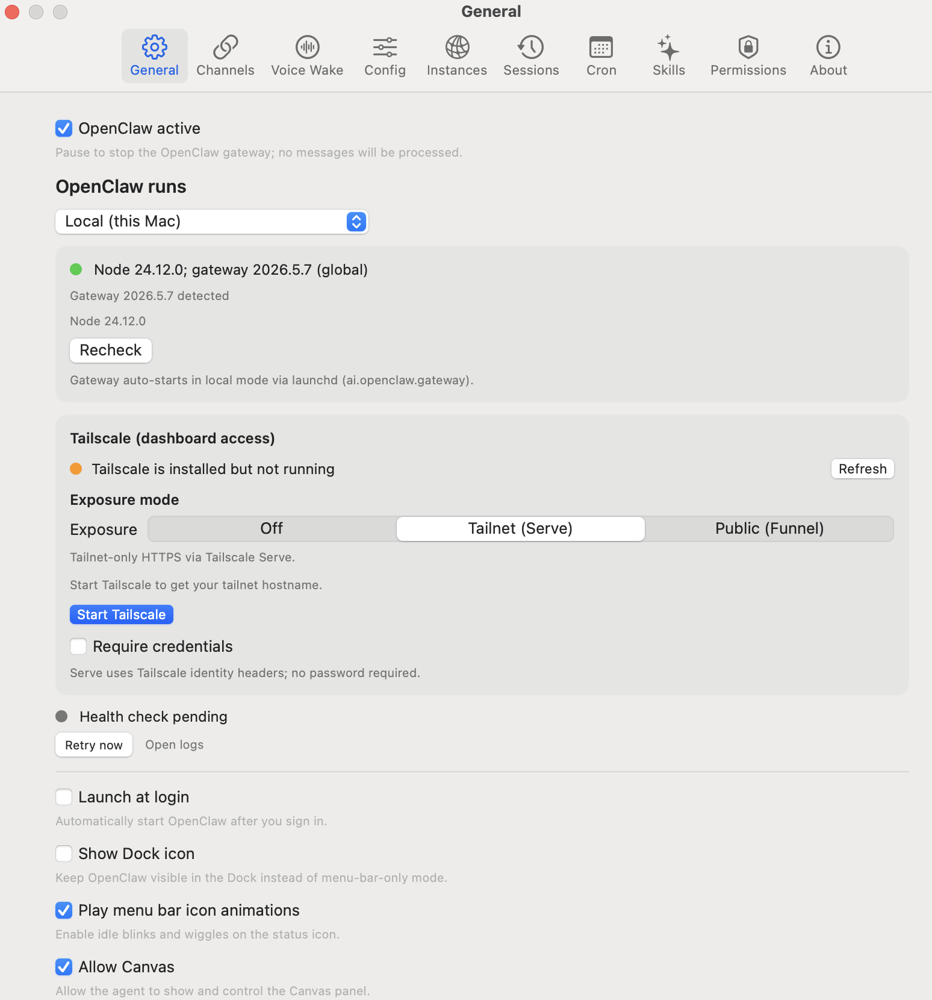

# 把小龙虾钉在菜单栏：OpenClaw 的 macOS app

上一篇我们把 Gateway 从 `127.0.0.1` 搬了出来，让外网的客户端也能访问。当时我们把连进 Gateway 的客户端分成了三类：

* **channel**：Telegram、飞书、Slack、WhatsApp 这类聊天工具，你通过它们发文字消息让 agent 干活
* **operator**：CLI、macOS app、浏览器 Control UI，你直接坐在控制台跟 agent 对话、改配置、看健康状态
* **node**：iOS / Android Node、macOS 节点模式，把摄像头、麦克风、GPS、屏幕、Live Canvas 暴露给 agent 调用

在之前的系列文章里，channel（Telegram、飞书）和 operator（Control UI、`openclaw` CLI）这两类客户端我们都用得不少，唯独 node 还没怎么介绍过。今天就把这块补上。说到 operator，还有一个客户端前面只是顺嘴提过、一直没真正装来用过 —— **macOS 菜单栏 app**。它的身份比较特殊：既是 operator，又是 node，刚好横跨两类。所以这一篇先把 macOS app 装来用一遍，体验下它的各项能力；下一篇再讲纯 node 的两个移动端 iOS / Android Node。它们解决的是 channel 解决不了的另一件事：channel 让小龙虾出现在你聊天的地方，原生客户端让小龙虾调用你设备上的能力。

## 三个原生客户端一览

动手之前先看下这三个客户端的现状：

* **macOS app**（macOS 15+，operator + node）：GitHub Release 有打包好的 `.dmg`（外加给 Sparkle 自动更新用的 `.zip`），也可从源码编译。能力上是菜单栏常驻、拥有所有 TCC 权限、托管本地 Gateway，再加上 Canvas / 摄像头 / 录屏 / `system.run` / Voice Wake / push-to-talk 等功能
* **iOS Node**（iOS 18+，纯 node）：还处在内部预览阶段，没上架 App Store，只能走 TestFlight 内测或自己用 Xcode 编译。能提供 Canvas、摄像头、屏幕快照、Location、Talk Mode、Voice Wake 等能力
* **Android Node**（Android 12+，纯 node）：未公开发布，得用 Android SDK + Java 17 自己编 APK。除了 Canvas、摄像头、Talk Mode，还多一批通知转发、通讯录 / 日历 / 短信 / 通话记录 / 运动传感器命令

可以看到现状是：**只有 macOS app 有现成的二进制可下**，iOS 还在很早期的 alpha 阶段（仓库里 `apps/ios/README.md` 第一行就写了 internal-use only），Android 也是只给了源码。所以在 App Store / Google Play 暂时还搜不到，得靠我们自己动手。这一篇专门讲 macOS app，iOS / Android 留到下一篇。

## 安装 macOS app

macOS app 的官方说法是 **menu-bar companion**（菜单栏伴侣）。它跟前面一直在用的 `openclaw` CLI 是配套关系，不是替代关系：CLI 负责跑 Gateway 和敲命令，app 负责那些 CLI 干不了的事，弹 macOS 系统权限弹窗、在菜单栏挂个图标、把这台 Mac 当成一个 node 暴露摄像头和录屏。

### 第一步：装上 app

去 [GitHub Release 页面](https://github.com/openclaw/openclaw/releases) 找最新版本，macOS 这块一次会放三个文件：

* **`OpenClaw-<版本>.dmg`** —— 给人用的标准安装包，一般用户直接下载这个。双击挂载，把 `OpenClaw.app` 拖进 `/Applications`，弹出磁盘，启动。dmg 是签名 + 公证过的，Gatekeeper 不会拦。
* **`OpenClaw-<版本>.zip`** —— 同一个 `OpenClaw.app`，只是换成 zip 打包。它真正的用途是提供给 app 自带的 [Sparkle](https://sparkle-project.org/) 自动更新：装完之后，以后的小版本 app 会自己提示升级，后台拉的就是这个 zip，不用你每次手动下。当然你想跳过 dmg、直接解压这个 zip 拖进 `/Applications` 也行，结果一样。
* **`OpenClaw-<版本>.dSYM.zip`** —— 调试符号（debug symbols），给崩溃日志做符号化（symbolication）用的，普通用户用不到，下载列表里直接略过。

> 注一：[Sparkle](https://sparkle-project.org/) 是 macOS 上用得最广的开源应用自动更新框架，专门解决一个问题：不走 Mac App Store 分发的 app，怎么让用户自动收到新版本。Transmission、IINA、Bartender 这些老牌 Mac app 用的都是它，算是这个领域 20 多年的事实标准。

> 注二：为什么同一个版本要发 `.dmg` 和 `.zip` 两个包呢？因为 `.dmg` 带 Finder 拖拽界面，对第一次装的人友好；而 Sparkle 使用 zip/tar.bz2 这种能直接解压替换的格式，`.dmg` 它反而不好处理，所以自动升级走的是 `.zip`。至于为什么 OpenClaw 不干脆上 Mac App Store 省掉这一步呢？因为它要弹一堆 TCC 权限、要跑本地 launchd 服务、要 `system.run` 在你机器上运行命令，过不了 App Store 的沙箱审核，只能自分发；自分发就得自己解决更新，所以 Sparkle 就成了最优选择。

### 第二步：首次启动向导

第一次启动 app，会弹出一个分页的引导向导。

首先是 **欢迎页。** 一句话介绍 OpenClaw，下面跟着一个橙色的安全提示，大意是：连进来的 AI agent（比如 Claude）能在你这台 Mac 上跑命令、读写文件、截屏，能干多少取决于你给它多少权限。仅当你了解这些风险再使用。

然后是 **选择 Gateway。** 让你挑这台 Mac 上的 OpenClaw 连哪个 Gateway：

- **This Mac**（在本机起 Gateway，会自动装那个 launchd 服务）
- **Nearby Gateways**（发现附近的 Gateway，同局域网或 tailnet 里 Bonjour 扫到的）
- **Configure later**（先不起 Gateway）

点 Advanced 还能填远程 Gateway 的 SSH 目标或直连的 `wss://` 地址。这一页其实就是 Local 和 Remote 之分。选了 This Mac 之后，本地模式还会接着跑一遍 Gateway 端的配置向导（配模型 API key 那些），跟前面几篇讲过的 `openclaw onboard` 是一样的，这里不重复。

接着 **开启 TCC 权限。** 这一页才是重头戏，我们根据需要逐项申请 macOS 的系统权限。大致分为下面这八类，每一类对应 app 的一组能力：

* **通知（Notifications）**：菜单栏 app 弹原生系统通知（`system.notify`）
* **辅助功能（Accessibility）**：UI 自动化、监听全局快捷键（push-to-talk 的右 Option 快捷键就靠它）
* **屏幕录制（Screen Recording）**：`screen.snapshot` 截屏、`screen.record` 录屏
* **摄像头（Camera）**：`camera.snap` 拍照、`camera.clip` 录短视频（注意 macOS 上摄像头默认是关的，见后文）
* **麦克风（Microphone）**：Voice Wake / Talk Mode / push-to-talk 录音，以及 `camera.clip` 带音频
* **语音识别（Speech Recognition）**：把麦克风进来的语音在本地转成文字（Voice Wake、Talk）
* **自动化（Automation）**：通过 AppleScript 控制别的 app（比如 PeekabooBridge 那套 UI 自动化）
* **地理位置（Location）**：`location.get` 把这台 Mac 的位置交给 agent

> TCC 全称 **Transparency, Consent and Control**（透明、知情同意与控制），是 macOS 的隐私授权机制：摄像头、麦克风、屏幕录制、辅助功能、输入监控、定位、通讯录这些敏感资源都被它挡在一道系统弹窗后面，app 第一次访问时会弹窗问你「允许吗」，确认后的结果记在 `TCC.db` 文件中，之后能在「系统设置 → 隐私与安全」里逐项开关。

这里有个关键点：**这些权限是 macOS app 申请的，不是 Gateway 申请的**。Gateway 是个无 UI 的后台进程，申请不了 macOS 的 TCC 弹窗流程，所以但凡涉及麦克风、录屏、辅助功能这些，都必须由有 GUI 的 app 来代申请。你不想用的能力这页可以先空着，后面要用了再回这页补。

最后向导走完，一切准备就绪：

此时菜单栏右上角会出现一只小龙虾图标，本地模式的 Gateway 也起来了，点一下图标就能开始跟 agent 聊天：

### 第三步：装 CLI（如果还没装）

如果你是从前面几篇一路跟下来的，`openclaw` CLI 早就装好了，这步可以跳过。如果是直接从 app 入坑的，打开 app → General 设置页 → 点 **Install CLI**，它会用 npm / pnpm / bun 帮你装一个全局的 `openclaw` 命令。app 内部的一些后台操作（管理定时任务之类）依赖这个 CLI。

### 第四步：选 Local 还是 Remote 模式

app 有两种工作模式，对应上一篇讲的两类部署：

* **Local（默认）**：Gateway 就在这台 Mac 上。app 会自动 attach 到正在跑的本地 Gateway；如果还没起，它会通过 `openclaw gateway install` 装一个 launchd 用户级服务（label 是 `ai.openclaw.gateway`，用 `--profile` 时是 `ai.openclaw.<profile>`）让它常驻。注意 app 自己不会把 Gateway 当子进程拉起来，它只负责装好 launchd 服务、然后 attach 上去。
* **Remote**：Gateway 在别的机器上（比如家里那台 Mac mini）。app 通过 SSH 或 Tailscale 连过去，**不会**在本机起 Gateway 进程，但会在本机起一个 headless 的 **node host 服务**（也是 launchd），这样远程的 Gateway 反过来也能调用这台 Mac 的能力。Remote 模式下 app 的 Gateway 发现机制现在优先用 Tailscale 的 MagicDNS 名而不是裸 tailnet IP，所以 tailnet IP 变了也能自愈。

出差带的笔记本就选 Remote，家里那台主力机就选 Local。Remote 模式的 SSH / Tailscale 怎么配，上一篇「Gateway 远程访问」已经讲过，这里也就不再重复了。

## macOS app 作为 operator

正如上文所述，macOS app 不仅可以跟 agent 对话，还可以作为 operator 来使用。我们在菜单栏图标上右键，点击 ”Settings“ 进入设置页：

这里的功能很多之前都学习过，和 CLI 和 Control UI 是等价的，比如渠道管理、配置管理、实例管理、会话管理、定时任务、SKILLS 技能；也能看最近的会话和 token 用量、Gateway 健康状态、已配对的 node 设备等。其中 Voice Wake 和 Permissions 是 macOS app 特有的。Permissions 就是我们上面讲的八大 TCC 权限，以及 Exec 审核策略配置，Voice Wake 我们后面再讲。

> 这里还有一个小彩蛋：app 注册了 `openclaw://` URL scheme。运行 `open 'openclaw://agent?message=Hello'` 就能从命令行 / 脚本 / 快捷指令里直接调一次 agent 对话。不带 `key` 参数时 app 会弹确认框防误触，而且会无视 `deliver` / `to` / `channel` 这几个参数；带上配置好的 `key` 可以静默执行，适合做个人自动化。

## macOS app 作为 node

macOS app 启动后会以 `role: node` 的身份也连进同一个 Gateway，握手时声明自己的 `caps`（canvas、camera、screen、system ...）和 `commands`（命令白名单），Gateway 把它登记进运行时的 node 注册表，别的客户端（CLI、Control UI、agent 本身）就能用 `node.invoke` 把命令转给它跑。常见命令是这几组：

| 组别 | 命令 | 干什么 |
| ---- | ---- | ---- |
| Canvas | `canvas.present` / `canvas.navigate` / `canvas.eval` / `canvas.snapshot` / `canvas.a2ui.*` | agent 驱动的可视化画板 |
| Camera | `camera.snap` / `camera.clip` | 拍照、录短视频 |
| Screen | `screen.snapshot` / `screen.record` | 截屏、录屏 |
| System | `system.run` / `system.notify` | 在这台 Mac 上跑命令、发系统通知 |

## 未完待续

这一篇我们把 OpenClaw 的 macOS app 安装体验了一把，了解了：

1. **它是「菜单栏伴侣」**：跟 `openclaw` CLI 是配套不是替代 —— CLI 跑 Gateway、敲命令，app 干 CLI 干不了的事，比如弹 TCC 弹窗、菜单栏挂图标、把这台 Mac 当 node 等
2. **安装 macOS app**：GitHub Release 里的三个文件，分别是给人用的 `.dmg`、给 Sparkle 自动更新用的 `.zip`、给开发者排崩溃的 `.dSYM.zip`
3. **首次启动向导**：欢迎页 → 选 Gateway → 开 TCC 权限 → 完成配置
4. **Local / Remote 两种模式**：Local 托管本地 Gateway（自动装 launchd 服务 `ai.openclaw.gateway`），Remote 连远程 Gateway、不在本机起 Gateway 但起一个 headless 的 node host 服务，让远程 Gateway 反过来也能调用这台 Mac
5. **作为 operator**：菜单栏图标右键 → Settings，渠道 / 配置 / 实例 / 会话 / 定时任务 / SKILLS 这些跟 CLI、Control UI 等价，外加 macOS 特有的 Permissions（八大 TCC 权限 + Exec 审核策略）和 Voice Wake
6. **作为 node**：以 `role: node` 也连进同一个 Gateway，握手时报上自己的 `caps` 和 `commands`，被登记进 node 注册表，别的客户端就能用 `node.invoke` 把命令转过来

其中，作为 node 刚刚开了个头，Canvas 画板、摄像头、录屏、`system.run` 和 Exec approvals、Voice Wake 与 push-to-talk，这些内容值得一样样掰开了看，我们下一篇再见。
