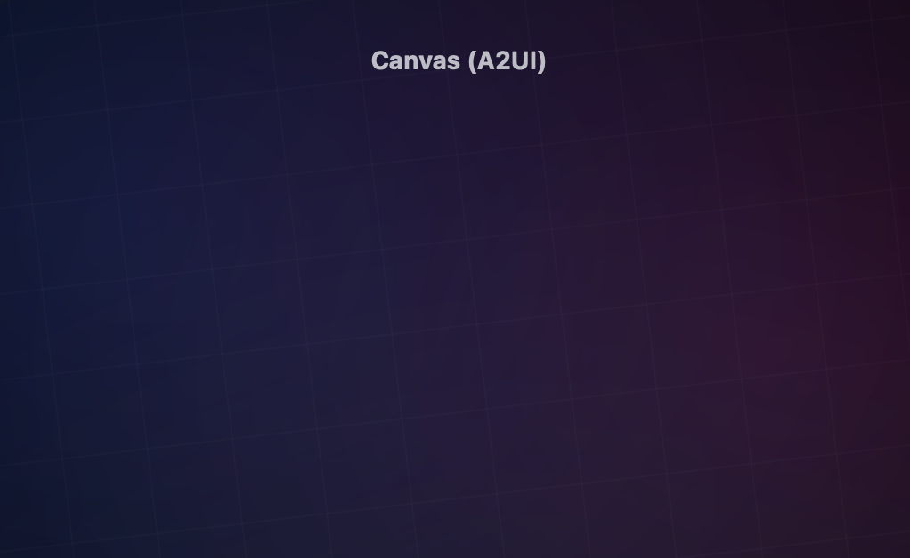
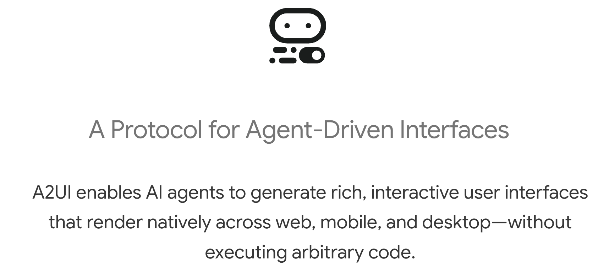
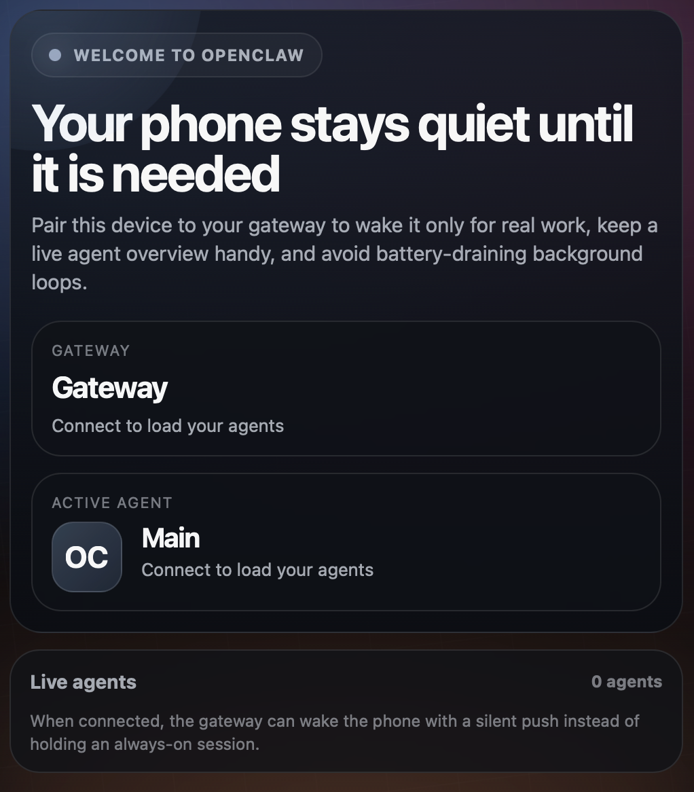
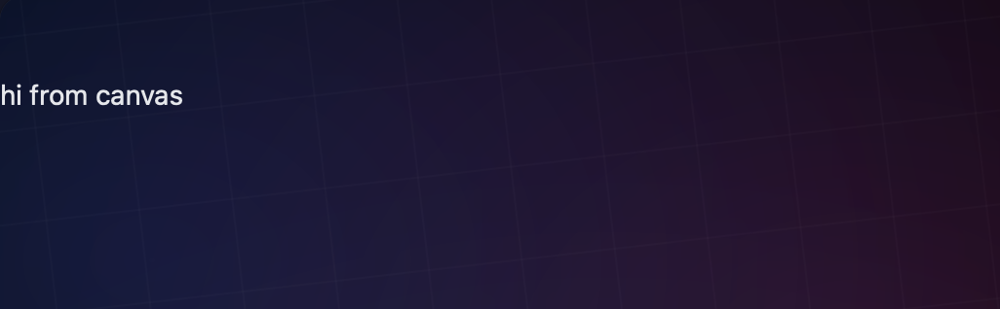
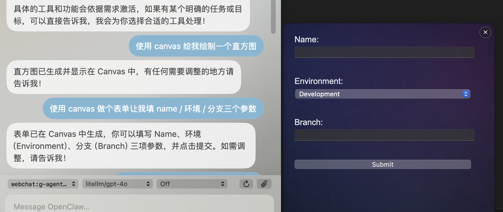
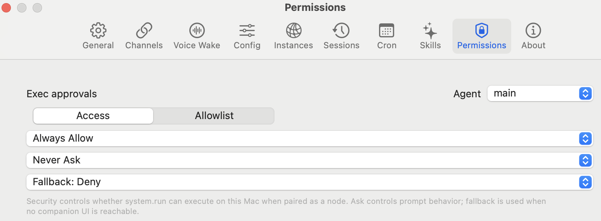
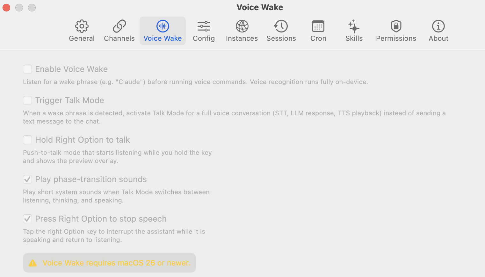
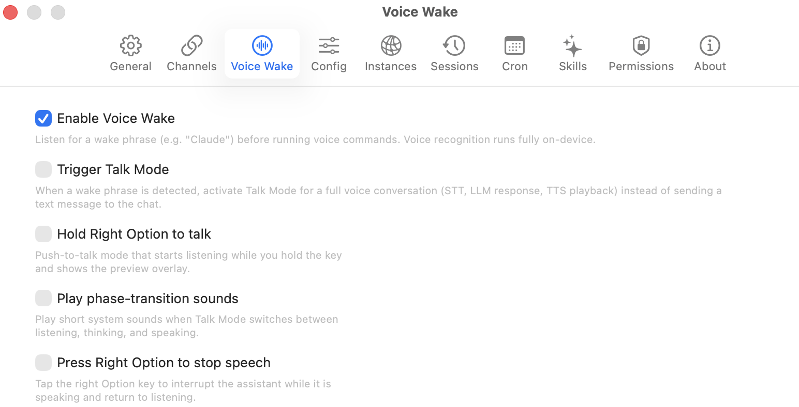
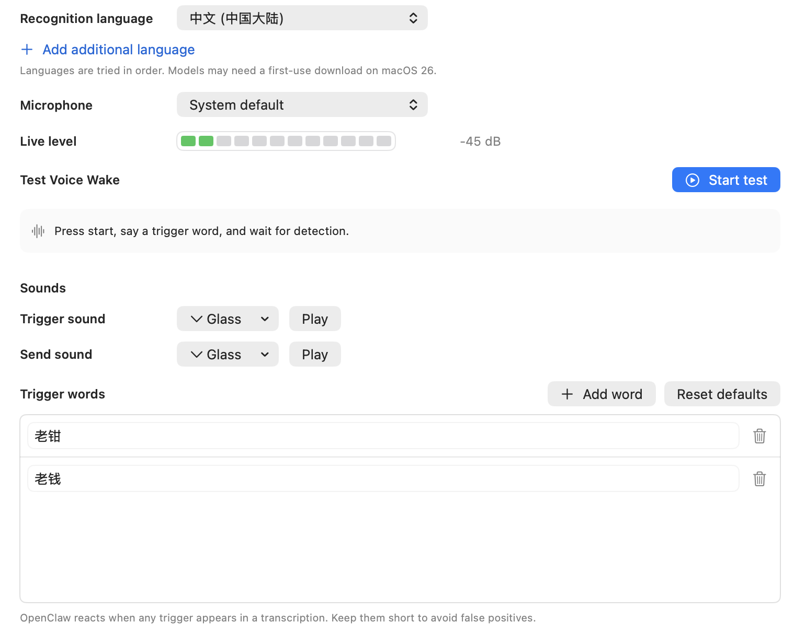
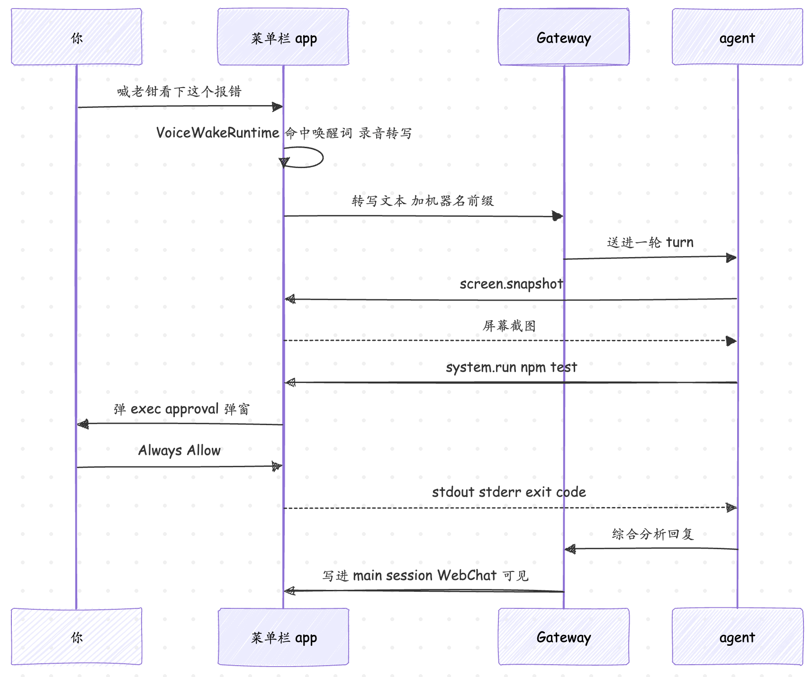

# 把小龙虾钉在菜单栏：OpenClaw 的 macOS app（二）

上一篇我们把 OpenClaw 的 macOS app 装上了，弄清了它「菜单栏伴侣」的定位，看了它作为 operator 那半边的功能，结尾停在了它的另一重身份上：它启动后还会以 `role: node` 连进同一个 Gateway，把自己的一组 `caps` 和 `commands` 报上去、登记进 node 注册表，别的客户端就能用 `node.invoke` 把命令转过来。

这一篇就接着上一篇的结尾，详细学习下 macOS app 作为 node 的几个能力 —— Canvas 画板、摄像头与录屏、`system.run` 和 Exec approvals、Voice Wake 与 Push-to-talk，最后再把它们串起来，跑一个实战的例子。

## Canvas

Canvas 是 macOS app 内嵌的一块 `WKWebView` 面板，专门给 agent 当轻量可视化工作区用，渲染 HTML/CSS/JS、A2UI、小的交互 UI。它的状态存在 `~/Library/Application Support/OpenClaw/canvas/<session>/` 下，面板通过一个自定义 URL scheme `openclaw-canvas://<session>/<path>` 来读这些文件（这样不用起 loopback server，也天生挡掉了目录穿越）。如果某个 session 根目录下没有 `index.html`，app 会显示一个内置的脚手架页。

面板本身是无边框、可缩放的，吸在菜单栏附近（或鼠标位置），按 session 记住大小和位置，本地 canvas 文件一改它自动重载，同一时刻只显示一个 Canvas 面板。可以在 Settings 配置页面的 Allow Canvas 选项来整个关掉，关掉之后所有 canvas 命令返回 `CANVAS_DISABLED`。

平时是 agent 在对话里通过 Gateway WebSocket 驱动 Canvas，但 CLI 也能手动操作来验证。最直接的就是让它弹出来：

```bash
$ openclaw nodes canvas present --node <node-id>
```

跑完之后，菜单栏附近会弹出一块画板，但里面几乎是空白的：



这个空白页是正常现象，`canvas.present` 只管「把面板显示出来」，不管往里塞内容。macOS 第一次打开 Canvas 会跳到 Gateway 托管的 **A2UI host 页**，这个页面本身就是个空壳：它只是 A2UI 的渲染运行时，在 agent 真正推内容之前页面上当然什么都没有。

> 注意：画板里有时会显示一行 `Unauthorized` 错误。这不是 macOS 的 TCC 权限问题，而是 WebView 去拉 A2UI host 页时 token 失效了（token 有 10 分钟 TTL，Gateway 重启过、连接断过、或长时间没动过画板都会让它过期）。可以从菜单栏退出 app 再重开，让它重新握手拿到新鲜的 token 就好了；要么在 Gateway 配置里把 `canvasHost.enabled` 设成 `false` 彻底关掉这个托管页（直接的 `canvas.*` 命令和本地脚手架页照常用）。

这里顺便介绍下 [A2UI](https://a2ui.org/)。**A2UI（Agent-to-UI）** 是一套声明式的 UI 协议，agent 不用手写 HTML，而是发一串 JSONL 消息来描述「界面长什么样」：用 `Column`、`Text` 这类组件搭出一棵界面树，配上 `usageHint`（标题 / 正文之类）这种语义提示，由客户端的 A2UI 渲染器统一把它画成真正的控件；用户在界面上的点击、输入再作为事件反向回传给 agent，是双向的。OpenClaw 把这个渲染器（A2UI host）做成了 Canvas 面板里的内嵌页，上面的 `canvas.present` 默认跳过去的就是它。目前 Canvas 只认 **A2UI v0.8** 的 server→client 消息（`beginRendering` / `surfaceUpdate` / `dataModelUpdate` / `deleteSurface`），v0.9 的 `createSurface` 还不支持。



除了 `canvas.present` 命令，也可以用 `canvas.navigate` 打开一个本地 canvas 路径，或者 `http(s)` 或 `file://` URL，或者直接传 `"/"` 返回本地脚手架页：
 
```bash
$ openclaw nodes canvas navigate "/" --node <node-id>
```

显示如下：



如果想看到自定义内容，可以用 `canvas.a2ui push` 推一段 A2UI 协议：

```bash
$ openclaw nodes canvas a2ui push --text "hi from canvas" --node <node-id>
```

面板中就会显示出这段文本：



还可以用 `canvas.eval` 直接在 WebView 里跑 JS：

```bash
$ openclaw nodes canvas eval --node <node-id> --js "document.body.innerHTML='<h1>hi</h1>'"
```

然后用 `canvas.snapshot` 把当前画面截成图：

```bash
$ openclaw nodes canvas snapshot --node <node-id>
```

### 在 agent 对话里怎么用

上面这一串 `openclaw nodes canvas ...` 是给你手动验证用的，平时你不会这么敲。Gateway 给 agent 装了一个 `canvas` 工具，动作就是 `present` / `hide` / `navigate` / `eval` / `snapshot` / `a2ui_push` / `a2ui_reset` 这几个，跟上面的命令一一对应。你在对话里用自然语言提需求，agent 自己决定调它，往菜单栏这块面板里渲染东西。比如：

* 「把这周的 commit 按作者画个柱状图给我看」→ agent 写段 HTML/JS、`navigate` 到一个本地 canvas 文件，或直接 `a2ui_push` 推一段 A2UI
* 「做个表单让我填 name / 环境 / 分支三个参数」→ agent 推一段带输入框和按钮的 A2UI，你在面板上填完点提交，A2UI 把事件回传给 agent，它接着往下走 —— 这就是前面说的「双向」
* 「这份 JSON 太长，渲染得好看点」→ agent `eval` 往面板里塞渲染好的 HTML
* agent 渲染完想确认效果，会自己 `snapshot` 把面板截成图喂回自己，再决定要不要改



调哪个 node 一般不用你指定，这个工具默认优先挑本机的 macOS node，没有再挑第一个连着的、有 canvas 能力的 node。所以只要 macOS app 开着、`Allow Canvas` 没关，跟 agent 说「画个 xxx」它就会渲染到这儿。另外，如果你用的是 Control UI / WebChat 这种带聊天气泡的客户端，agent 还会把 HTML 写成 Gateway 托管的 canvas 文档，在回复里用 `[embed ...]` 标签直接嵌进聊天气泡。

## 摄像头与录屏

摄像头这边，macOS app 暴露 `camera.snap`（拍一张 jpg 照片）和 `camera.clip`（录一段 mp4 视频，可带音频，时长上限 60 秒）。和 iOS / Android 不一样的是，**macOS 上摄像头默认是关的**（Settings → General → Allow Camera）。打开之后 `camera.snap` 在拍之前会等一个 `delayMs`（默认 2000 毫秒）让曝光稳定，照片会被重新压缩保证 base64 在 5 MB 以下。

可以通过下面两个 CLI 命令进行测试：

```bash
$ openclaw nodes camera snap --node <node-id>
$ openclaw nodes camera clip --node <node-id> --duration 10s --no-audio
```

录屏走 `screen.snapshot`（截当前屏）和 `screen.record`（录一段 mp4 视频，同样 60 秒上限），需要 macOS 的 Screen Recording TCC 权限。这也是为什么这类操作必须由 app 来做，无头进程拿不到这个权限。

测试命令如下：

```bash
$ openclaw nodes screen record --node <node-id> --duration 10s --fps 15
```

值得注意的是，`openclaw nodes screen` 下面没有 `snapshot` 子命令，可以使用 `openclaw nodes invoke` 来调用：

```
$ openclaw nodes invoke \
  --node <node-id> \
  --command screen.snapshot \
  --params '{"screenIndex":0}'
```

> 这里还有一个 Gateway 的配置需要注意：由于 `camera.snap`、`camera.clip`、`screen.record` 这几个命令的隐私分量很重，需要在 `gateway.nodes.allowCommands` 里显式开启。

## system.run 与 Exec approvals

`system.run` 是 macOS app 最有分量的一项 node 能力，它可以让 agent 在你这台 Mac 上运行命令。它跟 agent 自带的 `exec` 工具是两个很容易混淆的概念，其实，它们两不在一个层面上：`exec` 是模型在对话里直接调的工具，跟 `read_file` 平级，它内部有三种后端 —— `sandbox`（丢进沙箱隔离环境跑）、`gateway`（在 Gateway 进程里直接 spawn）、`node`（转交给一台远端 node）；`system.run` 则是 macOS app 作为 node 暴露出来的一项能力，跟 `screen.snapshot`、`canvas.present` 平级。当 agent 的 `exec` 选了 `host=node` 这个后端时，请求会被序列化成 `node.invoke system.run` 走 Gateway 转过来，也就是说，`system.run` 可以理解成 `exec(host=node)` 在你这台 Mac 上的远端实现。

分为两种情况：

* **Local 模式**：Gateway 把 `system.run` 请求直接交给 macOS app，app 在自己的 UI / TCC context 里执行
* **Remote 模式**：远程 Gateway 先把请求发给本机那个 headless **node host 服务**（它以 node 身份连进远程 Gateway），node host 再通过一个本地 Unix socket（带 token + HMAC + TTL）把请求转给 macOS app 去跑，弹窗和输出都留在 app 里

不论哪种情况，最后都会被 macOS app 里的 **Exec approvals** 拦下（Settings → Permissions → Exec approvals）：



这些配置全部存储在这台 Mac 本地的 `~/.openclaw/exec-approvals.json` 文件里，默认大致长这样：

```json
{
  "version": 1,
  "defaults": {
    "security": "deny",
    "ask": "on-miss"
  },
  "agents": {
    "main": {
      "security": "allowlist",
      "ask": "on-miss",
      "allowlist": [{ "pattern": "/opt/homebrew/bin/rg" }]
    }
  }
}
```

需要注意的几点：

* `security` 三选一：`deny`（全挡，默认）、`allowlist`（只放行白名单里的）、`full`（全放，等于 YOLO 模式）
* `ask` 三选一：`off`（不弹）、`on-miss`（只在不命中白名单时弹）、`always`（每条都弹）
* `allowlist` 里要么写解析后的二进制路径 glob（`/opt/homebrew/bin/rg`、`~/.local/bin/*`），要么写裸命令名（`rg`，只匹配走 PATH 调起来的，不匹配 `./rg` 或 `/tmp/rg`）
* 命令文本里只要带 shell 控制或展开语法（`&&`、`||`、`;`、`|`、`` ` ``、`$`、`<`、`>`、`(`、`)`），一律算 allowlist miss，得单独批，或者把那个 shell 二进制本身 allowlist 掉
* 弹窗里点 Always Allow，那条命令就被加进 allowlist
* allowlist 是**按 agent 分的**：多个 agent 的话，在 app 里切换你正在编辑哪个 agent，一个 agent 的批准不会泄漏到别的 agent
* 如果 macOS app 没在跑（比如你只起了 CLI 和 Gateway），任何本来该弹窗的请求会走 ask fallback，默认就是 `deny`

## Voice Wake 与 Push-to-talk

macOS app 还能监听全局麦克风，把语音变成 agent 的输入。不过有一个前提条件，该功能依赖 macOS 26 才引入的新接口，macOS 26 以下整块 Voice Wake 配置都是灰色的，用不了：



满足版本之后，设置页里有三个触发模式和两个 Talk Mode 行为开关：



先说三个触发模式：

* **Voice Wake（唤醒词 → 文字，默认）**：一直挂着 macOS 的 Speech recognizer（即系统自带的 `SFSpeechRecognizer`，跟 Siri / 听写共用一套引擎，支持完全离线），听到唤醒词才开始录音，识别到的文本作为一条普通消息发给 agent。唤醒词是一份由 Gateway 统一管的全局列表（没有按 node 定制的唤醒词），存在 Gateway 主机的 `~/.openclaw/settings/voicewake.json` 里，默认是 `["openclaw", "claude", "computer"]`，任何客户端 UI 改了它都会广播给所有 node 同步。
* **Talk Mode（唤醒词 → Talk Mode）**：勾上这个选项后，唤醒词命中后不再是录音 + 转写 + 发文字，而是直接把 app 切到 **Talk Mode**，这是一个 STT → LLM → TTS 的连续语音对话循环，屏幕上一直挂着一个小面板，在「聆听（listening）→ 思考（thinking）→ 回复（speaking）」三个阶段之间循环切换，各自播一段对应的动画，回复也是直接念出来而不是只写进 WebChat。
* **Push-to-Talk（按住右 Option）**：按住右 Option 键立刻开始录音，松开就停，不用喊唤醒词，松开后会留一小段延迟让你改文字再发。Push-to-talk 一启动会暂停 Voice Wake 的麦克风，松开后自动恢复；如果 Talk Mode 正开着，Push-to-talk 会被自动让位，等 Talk Mode 关掉再回来。

再两个是 Talk Mode 用的辅助开关，仅在用 Talk Mode 时才有意义：

* **播放阶段切换音效（Play phase-transition sounds）**：Talk Mode 在 listening / thinking / speaking 之间切换时放一小段系统提示音，方便你在不看屏幕时也能听出现在 agent 处在哪个阶段。
* **打断 agent 说话（Press Right Option to stop speech）**：agent 正在说话时，轻点一下右 Option 键就能打断 TTS，立刻回到 listening 状态。

使用 Voice Wake 模式时，唤醒词命中后会等一个约 0.55 秒的停顿（确认这是唤醒词，不是某个长词的一部分），然后在屏幕右上角飘出一个浮在所有窗口最上层的小面板，把你正在说的话实时转成文字显示在里面。

说话有内容时静默窗口是 2 秒，只听到唤醒词没听到后续是 5 秒；最外面还有个 120 秒的硬上限兜底，万一前面的静默检测失灵（比如背景一直有人声、或者识别卡住没吐结果），到点也会强制截断，不让它无限录下去。识别到的文本会被转发给当前 agent，回复送到上次用的那个主 channel（WhatsApp / Telegram / Discord / WebChat）；如果投递失败，错误记下来，这一轮运行仍然能在 WebChat / 会话日志里看到。

设置页这几个开关下面还有一组语音相关的细项可以调：



* **Recognition language（识别语言）**：识别用的语言，我这里选的是 “中文”，这样它就能听懂我说的话了。可以点 "Add additional language" 加几个备选，按列表顺序往下试。
* **Microphone（麦克风）**：选哪个麦克风去监听，默认是 System default，app 会记着你选的那个设备的唯一编号，万一拔了，会贴个 "Disconnected" 的小提示，临时回退到系统默认，等它接回来会自动切回去。
* **Live level（实时电平）**：实时电平条加 dB 数值，告诉你 app 现在到底听到了多少声音，选完麦克风后看一眼这个，就能立刻知道选对了没有。
* **Test Voice Wake（测试语音唤醒）**：本地测一下唤醒词识别能不能通，点 Start 后说一个唤醒词，如果能检测到，会显示 Detected。
* **Sounds（提示音）**：唤醒词命中（Trigger sound）和文本发出去（Send sound）两个时刻分别可以挂一段提示音，默认都是 macOS 的 "Glass" 系统音。
* **Trigger words（唤醒词列表）**：前面提到的那份 Gateway 全局共享的列表，可以在这里增删，改完会通过 `voicewake.set` 广播给其他客户端 / node。截图里我自己加了 "老钳"、"老钱" 两个中文唤醒词（有时候识别不准，多加几个），配合上面把识别语言切到 "中文"，就能用中文喊它了。唤醒词越短越容易识别出来，但太短也更容易在日常聊天里被误触发，要权衡下。

## 实战 macOS app

把 macOS app 的几样能力串起来，我让 cc 帮我设计了一个场景：你正在 VS Code 里调一个跑不起来的脚本，懒得复制粘贴报错，直接对着电脑喊一句 "老钳，看看我屏幕上这个报错是怎么回事，运行 npm test 帮我排查下"，菜单栏的小龙虾接收消息 → 调 `screen.snapshot` 拿屏幕截图 → 多模态识别 → 调 `system.run` 跑 `npm test` → app 弹 exec approval → 你点 Always Allow → agent 把分析回到菜单栏面板的 WebChat 里。这条链路把 Voice Wake、screen 截图、`system.run`、Exec approvals 全串起来了，分六步。



**第一步：开 Voice Wake，把麦克风 / 语音识别 / 录屏三个权限给上。** Voice Wake 开关在 Settings → Voice Wake，第一次开它会要 Microphone 和 Speech Recognition；`screen.snapshot` 需要 Screen Recording。到「系统设置 → 隐私与安全」确认这三项都给了 OpenClaw。然后在 Voice Wake 设置页配上你自己的唤醒词。

**第二步：给 Exec approvals 加 allowlist。** agent 待会儿要跑 `npm test`，但 `system.run` 默认是 `deny`。到 Settings → Exec approvals，给 `main` agent 把 `npm`（或解析后的 `/opt/homebrew/bin/npm`）加进 allowlist，也可以等弹窗时点 Always Allow，效果一样，都会写进 `~/.openclaw/exec-approvals.json`：

```json
{
  "version": 1,
  "defaults": { "security": "deny", "ask": "on-miss" },
  "agents": {
    "main": {
      "security": "allowlist",
      "ask": "on-miss",
      "allowlist": [{ "pattern": "/opt/homebrew/bin/npm" }]
    }
  }
}
```

**第三步：喊唤醒词。** 对着 Mac 说 "老钳，看下我屏幕上这个报错"。由于 `VoiceWakeRuntime` 一直挂着，听到 `老钳` 之后等那 0.55 秒停顿确认，然后开始录音，菜单栏弹出带转写文本的浮框；说完停 2 秒它自动截断，把转写文本发送给 agent。

**第四步：agent 看屏幕。** agent 判断要看屏幕，调 `screen.snapshot`。Local 模式下这一步直接由 macOS app 执行（它有 Screen Recording 权限）；Remote 模式下远程 Gateway 先发给本机的 node host 服务，node host 再通过本地 Unix socket 把请求转给 macOS app 去截，截完图回传给 agent。

**第五步：agent 跑命令。** agent 看完图，觉得还得看测试结果，调 `system.run` 跑 `npm test`。如果第二步没提前 allowlist，macOS app 这时弹出 exec approval 弹窗，列出要跑的命令、cwd、哪个 agent 发起的。你点 Always Allow，命令在 app 的 UI context 里跑（不是在 Gateway 进程里），stdout / stderr / 退出码回传，同时 allowlist 里多了一条 `npm`。

**第六步：看结果。** agent 把屏幕报错加测试输出综合分析，回一段话到 `main` session。点菜单栏的小龙虾，控制面板的 WebChat 里就能看到这段回复，跟你在键盘上敲进去的消息一样。agent 干活的那几秒，菜单栏图标会从小龙虾换成忙碌态的小图示。

> 这个场景整条链路比较长，中间可能会遇到各种问题，我也没有完全跑通，有兴趣的朋友可以试试看。

## 小结

这一篇我们深入学习了 macOS app 作为 node 的几样能力：

1. **Canvas**：内嵌的 `WKWebView` 面板，给 agent 当轻量可视化工作区；
2. **摄像头与录屏**：使用 `camera.snap` / `camera.clip` 调用你的摄像头拍照或录视频，使用 `screen.snapshot` / `screen.record` 对你的电脑屏幕进行截屏或录屏；
3. **`system.run` 与 Exec approvals**：让 agent 直接在你的 Mac 上执行命令，最后通过 Exec approvals 经过人工审批；
4. **Voice Wake 与 Push-to-talk**：让 app 监听全局麦克风，把语音变成 agent 的输入；

最后通过一个实战的例子，把上面这些串起来。至此 macOS app 这只横跨 operator 和 node 的小龙虾就搞定了。下一篇我们接着这条线往下走，把视线挪到揣在兜里的那台手机，学习 iOS / Android Node 配对，把手机上的 OpenClaw Node 和家里的 Gateway 配上对，让它当远程麦克风、摄像头和位置传感器，出门在外也能随时唤起 agent。

## 参考

* [OpenClaw 官方文档](https://docs.openclaw.ai/)
* [OpenClaw GitHub 仓库](https://github.com/openclaw/openclaw)
* [OpenClaw GitHub Release 页面](https://github.com/openclaw/openclaw/releases)
* [macOS app 文档](https://docs.openclaw.ai/platforms/macos)
* [macOS dev setup](https://docs.openclaw.ai/platforms/mac/dev-setup)
* [macOS 权限文档](https://docs.openclaw.ai/platforms/mac/permissions)
* [macOS Canvas 文档](https://docs.openclaw.ai/platforms/mac/canvas)
* [Voice wake（macOS）文档](https://docs.openclaw.ai/platforms/mac/voicewake)
* [Voice wake（全局唤醒词）文档](https://docs.openclaw.ai/nodes/voicewake)
* [Exec approvals 文档](https://docs.openclaw.ai/tools/exec-approvals)
* [Camera capture 文档](https://docs.openclaw.ai/nodes/camera)
* [Nodes 索引](https://docs.openclaw.ai/nodes)
* [Remote access 文档](https://docs.openclaw.ai/gateway/remote)
* [Sparkle 自动更新框架](https://sparkle-project.org/)
