# 把小龙虾装进口袋：iOS / Android Node 配对

在上一篇里，我们装好并体验了 macOS app，它横跨 operator 和 node 两类身份，既能当控制台，又能把这台 Mac 的屏幕、摄像头、命令行暴露给 agent。今天我们把目光转到手机上：**iOS Node 和 Android Node**，两个纯 node 客户端。它们身上没有 operator 那半边，唯一的任务就是当小龙虾的远程感官，把手机的麦克风、摄像头、GPS、屏幕暴露给家里的 agent 调用。配合上一篇讲的 Gateway 远程访问，出门在外也能随时唤起家里的小龙虾。

## 配对 iOS Node

在 Gateway 协议里 iOS Node 的 `role` 是 `node`，走的是和 Telegram bot 那种 channel 完全不同的握手路径。channel 那套叫 **DM 配对（DM pairing）**，陌生人第一次给 bot 发消息时，bot 回一段 8 位的一次性 pairing code，你在 CLI 里 `openclaw pairing approve` 批准这个码，它管的是谁能跟 bot 说话。iOS Node 这套叫 **设备配对（device pairing）**，手机带着自己的 ED25519 设备身份连上 Gateway 的 WebSocket，Gateway 挂起一条 pending 请求（用 `requestId` 标识），你在 CLI 里 `openclaw devices approve` 批准这台设备，Gateway 随即签发一个会轮换的 token，它管的是哪台设备能进网络。这套握手流程里还有另一组容易混的词，Node 和 Device，我们先了解下它们的区别。

### Node vs. Device

明明连进来的是一台 Node（iOS 这台手机），批准用的却是 `openclaw devices approve`，查状态又换回 `openclaw nodes status`。它俩在 OpenClaw 里是上下两层：

* **Device（设备身份）** 管这是谁。可以把它理解成这台设备的身份证。设备自己生成一对 ED25519 密钥，由公钥算出一个 `deviceId` 当唯一编号，再配一份授权记录，记下它被谁批准过、能用哪些角色。Gateway 靠它做身份识别和准入：没见过的 `deviceId` 必须经操作员批准，批准后按角色发 token（这个 token 可以随时换发新的、把旧的作废，也可以直接吊销，但不管怎么换都不能超出配对时批准的 role / scope 范围）。一个 Device 还能同时持有多个角色的 token，比如上一篇那台 Mac，既是 `operator` 又是 `node`。
* **Node（能力主机）** 管它能干啥。可以把它理解成这台设备对外贴出的一张能力清单。设备以 `role: node` 连进 Gateway 时，会报上自己的 `caps`（有哪些硬件能力，比如摄像头、屏幕、定位、麦克风）和 `commands`（允许别人调用的命令白名单，像 `camera.snap`、`canvas.snapshot`、`location.get`）。Gateway 把它记进一张运行时的 node 名册，别的客户端就能用 `node.invoke` 把命令派给它执行。

### 拿到 app

值得注意的是，iOS app 暂时还没上架 App Store，官方给它贴的标签是「极早期 alpha」，因此把它当成尝鲜，别当成生产工具。能拿到 app 的途径只有两个：

1. **TestFlight 内测**：如果你在内测名单里
2. **自己编译**：根据官方文档，从源码用 Xcode 编译，我走的就是这条开发路径

首先确认几个前置工具装齐了：

* **Xcode 16+**：低于这个版本工程文件可能打不开
* **Node 的 `pnpm`**：OpenClaw 整个仓库的包管理器，iOS 这边的脚本也靠它
* **`xcodegen`**：这个工程不把 `.xcodeproj` 提交进仓库，而是用一份 YAML 描述、靠 `xcodegen` 现场生成，所以这步不能省（`brew install xcodegen` 装一下）
* **Xcode 里配好 Apple 开发者签名**：哪怕只是个人免费 Apple ID 也行，但得先在 Xcode 的 Settings → Accounts 里登进去

一切就绪之后，在仓库根目录依次运行如下命令：

```bash
$ pnpm install                        # 装 monorepo 依赖
$ ./scripts/ios-configure-signing.sh  # 给你这台机器生成一套唯一的本地 bundle ID
$ cd apps/ios
$ xcodegen generate                   # 用 YAML 现场生成 OpenClaw.xcodeproj
$ open OpenClaw.xcodeproj              # 用 Xcode 打开
```

这几步等价于一条 `pnpm ios:open` 快捷命令，效果一样。

工程在 Xcode 里打开后，设置如下：

* **Scheme** 选 `OpenClaw`
* **Destination** 选你那台用数据线连上来的真机。文档明确建议用真机而不是模拟器，因为摄像头、定位、麦克风这些 node 能力在模拟器上要么没有要么是假的，跑真机才看得到真实行为
* **Build Configuration** 用 `Debug`

最后点击顶部菜单 `Product → Run`，编译并运行，标题栏显示 "Build Succeeded" 说明编译通过：

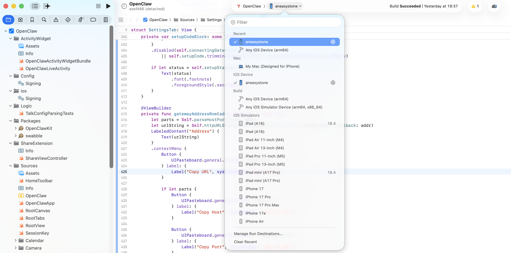

> 在编译的过程中遇到了几个问题，将报错信息丢给小龙虾，很快自己修复了。主要是 `SettingsTab.swift` 的 `body` 视图嵌套过深导致 Swift 编译器类型检查超时，把它拆成多个子视图后才编译通过，另外还补了 `GatewayOnboardingView.swift` 缺失的 `import OpenClawKit`、给 `DeepLinks.swift` 静态方法调用加上 `self.` 前缀。

Run 成功后 Xcode 会把 app 直接装到那台连着的手机上，几秒之后手机桌面上就出现了那只红色的小龙虾：

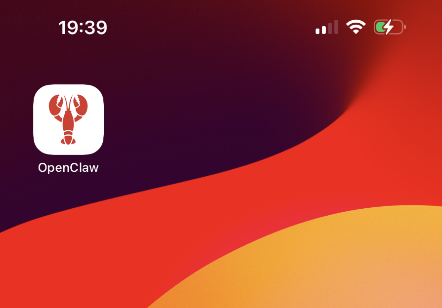

> 另外个人开发者签出来的 app 证书有效期一般只有 7 天，过期了 app 会打不开，重新 Run 一次刷新即可。

### 配对流程

第一次点开这个图标，会先跳一个 "Welcome to OpenClaw" 引导页：

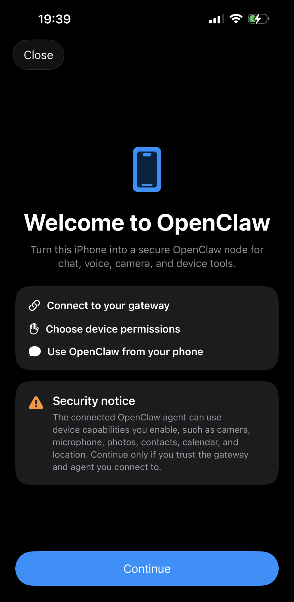

页面把流程拆成了三步：**Connect to your gateway → Choose device permissions → Use OpenClaw from your phone**，下面还有一条橙色的 Security notice，提醒连进来的 agent 可以使用你勾上的设备能力（摄像头、麦克风、照片、联系人、日历、位置等），只在你信任这个 gateway 和 agent 的时候继续。这条提醒值得认真对待。iOS Node 的所有能力命令都跑在这台手机本地，读的也是手机上的真实硬件，谁连进来就能把这台手机当远程感官。所以 Gateway 是否暴露给互联网、Gateway 后面挂的 agent 是不是你能管的，直接决定了风险有多大。

点 Continue 进入 Connect Gateway 配对页：

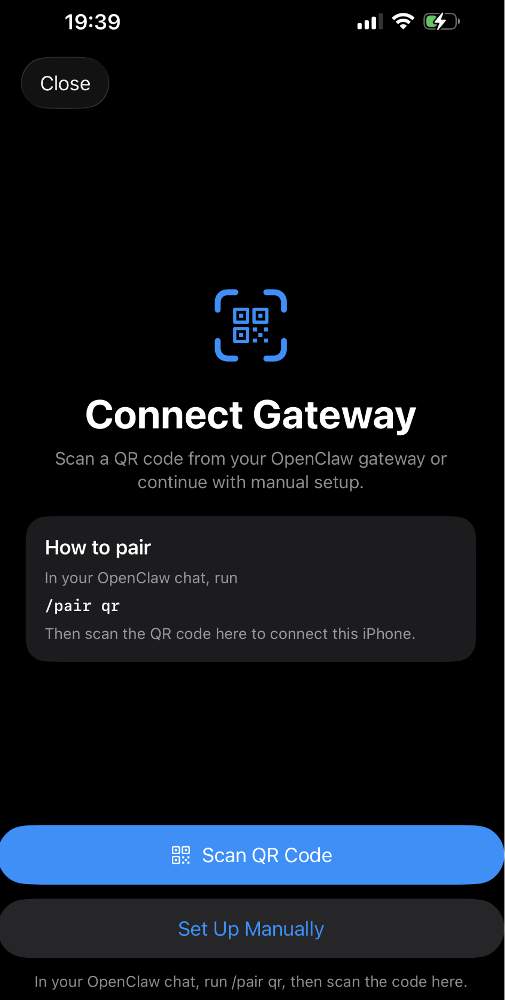

页面给了两个入口：**Scan QR Code**（扫二维码）和 **Set Up Manually**（手动）。两条路最终都是把 Gateway 的 WebSocket 地址加一段一次性的 bootstrap token 喂给 app，区别只在于这段东西是用相机拍进来还是手动粘进来。

#### 方式一：setup code（手动配）

在 WebChat 里给 agent 发一条 `/pair`，Gateway 会生成一个 setup code 并给出操作步骤：

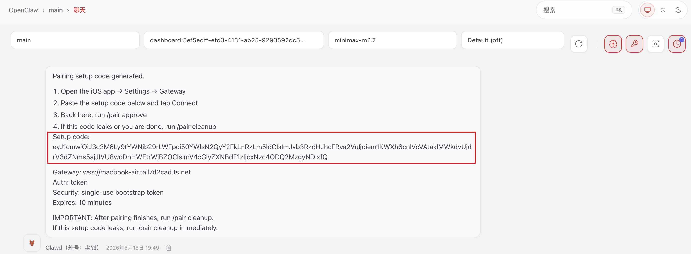

回复里最关键的是 **Setup code**（`eyJ1cm...`），它是一段 base64 编码的 JSON，形如 `{"url": "wss://<gateway-host>", "bootstrapToken": "<single-use-token>"}`。它不是设备私钥，而是一张一次性入场券，app 拿它换一个正式的 device token，正式 token 才会落进 iOS Keychain。**Security** 和 **Expires** 两行合起来看，这张券只能用一次、10 分钟内有效，过期或用过就作废，得重发一条 `/pair` 再生成一次。最后 **Gateway** 那行 `wss://macbook-air.tail7d2cad.ts.net`，就是上一篇配 Tailscale Serve 时拿到的 magicDNS 名加 WSS，远程访问已经就绪时 setup code 里塞的就是它。

> `/pair` 这条 slash 命令本质上是 WebChat 里的一个 operator 操作，等价于在 Gateway 主机上预签一份单次 bootstrap 凭证。它和 `openclaw devices approve <requestId>` 方向正好相反：`devices approve` 是设备先连过来挂起一个 requestId 等操作员批准，setup code 是操作员先签好凭证、设备再扫码进门。

把整段 setup code 复制下来，回到手机，进 OpenClaw 的 Settings → Gateway：

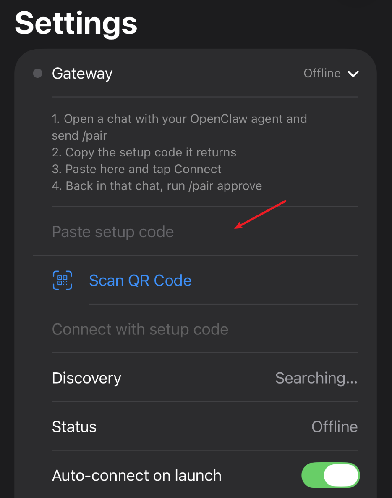

将 setup code 粘贴到输入框中，如果 Tailscale 网络正常的话，几秒之后这一页就会变成这样：

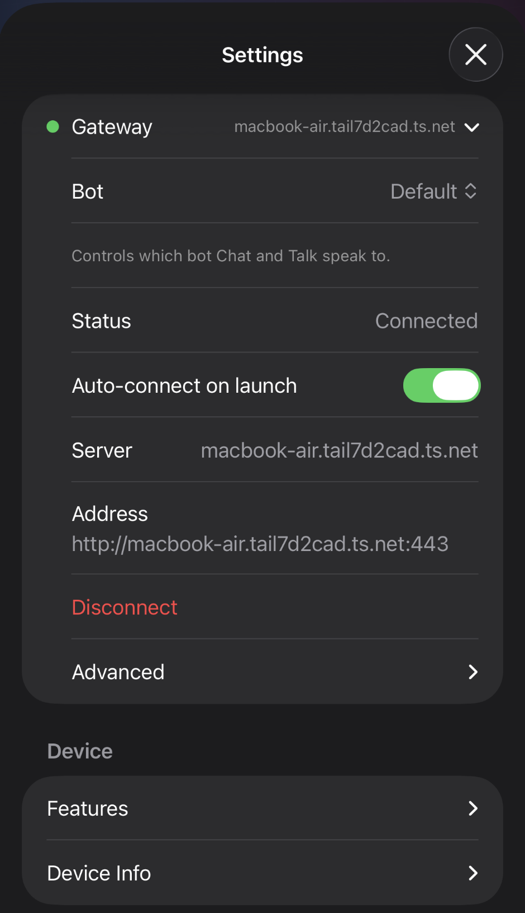

可以看到状态显示已连接。

#### 方式二：扫二维码

这种方式的原理和第一种几乎一样，但要更简单。

在 WebChat 里发 `/pair qr`，agent 会把同样的 setup code 渲染成一张二维码。回到 app 的 Connect Gateway 页（或 Settings → Gateway 里的 Scan QR Code 按钮），把相机对准二维码，扫到之后 app 自动解析出里面的 `{url, bootstrapToken}` 并完成连接。

#### 方式三：Bonjour + 手动批准（同子网时的另一条路）

前面两种方式对应的就是配对页上那两个入口，共同点是都得先去 Gateway 那头要一段 setup code。不过如果你的手机和 Gateway 本来就在同一个局域网里，还有第三条路，连 setup code 都省了，靠 Bonjour 让 app 自己把 Gateway 找出来。

先解释下 Bonjour 是什么。它是苹果的**零配置局域网服务发现协议**（苹果对 mDNS / DNS-SD 这套标准的实现），作用是让同一个局域网里的设备不用手填 IP 和端口就能互相广播、发现服务。你平时见到的 AirDrop、AirPlay、打印机自动出现在列表里、局域网里能直接访问 `xxx.local` 主机名，背后靠的都是它。

回到这里，Gateway 启动后会用 Bonjour 在局域网里广播一个 `_openclaw-gw._tcp` 服务（TXT 记录里带着 host、端口、TLS 指纹）；iOS app 用 Network.framework 的 `NWBrowser` 浏览这个服务类型，前面那张截图里的 Settings 里那个 "Discovery: Searching..." 就是它在扫。扫到了 Gateway 就自动出现在列表里，点一下就能连，**不用 setup code、也不用手填地址**。选好之后 app 会发起配对请求，这时回到 Gateway 主机上批准它：

```bash
$ openclaw devices list
$ openclaw devices approve <requestId>
```

这种方式最大的局限是，只在同子网有效，跨网段（比如走 Tailscale 远程）mDNS 广播过不去就发现不到，那种情况只能回到方式一或方式二。

## iOS Node 的能力详情

配对之后，打开 Settings 配置页，再展开 **Device → Features**，所有 node 能力的总开关都在这里：

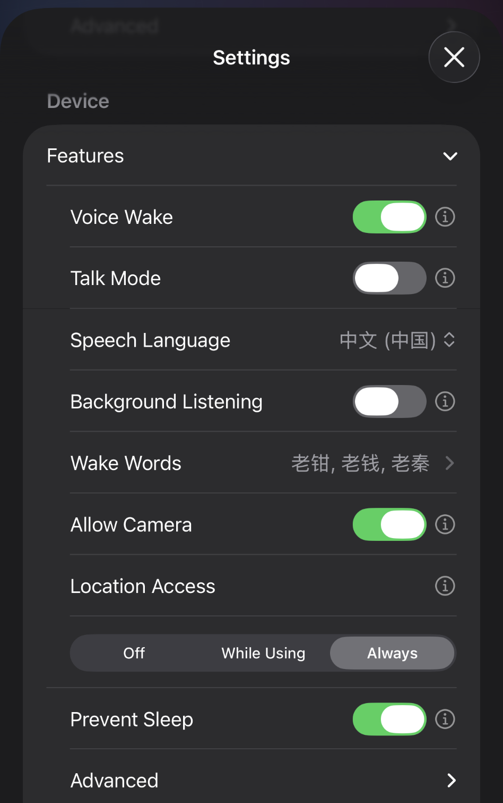

* **Voice Wake**：唤醒词模式，持续监听麦克风，当听到唤醒词后开始录音，并将识别到的文本作为一条普通消息发给 agent
* **Talk Mode**：连续对话模式，唤醒词命中后不再是录音 + 转写 + 发文字，而是直接把 app 切到对话模式，这是一个 STT → LLM → TTS 的连续语音对话循环；iOS 的静默判定窗口默认 900 毫秒，且默认开 interrupt-on-speech，你在它说话时插话会自动打断播放；
* **Speech Language**：转写和合成的语言，我这里选的是 `中文(中国)`，会传给 STT/TTS 服务
* **Background Listening**：允许 Voice Wake / Talk Mode 在 app 不在前台时继续监听麦克风。iOS 这块管得很严，开了也只是尽量维持、不保证一直管用，app 不在前台、或者锁屏几分钟之后，系统会切断麦克风，喊唤醒词没反应是正常的
* **Wake Words**：触发词列表，自动从网关同步，可以看到就是我们上一篇在 macOS app 里的配置的
* **Allow Camera**：摄像头能力总闸，和 macOS app 不一样的是，iOS 这边默认是开的，另外 iOS 有后台限制，`canvas.*` / `camera.*` / `screen.*` 这几类命令**要求 app 在前台**，切到后台调用一律返回 `NODE_BACKGROUND_UNAVAILABLE`，这是 iOS 系统层面的限制，OpenClaw 绕不过去
* **Location Access**：三段选择器，Off 完全不开，While Using 只在 OpenClaw 在前台时可用，Always 允许后台持续读位置
* **Prevent Sleep**：防止屏幕自动锁定。出门跑 voice + location 场景时开着它能减少 app 被系统挂起的概率
* **Advanced**：网络、日志、Talk provider 的细参数

这一页本质上就是 iOS Node 的能力声明，和 agent 对话时，它可以通过 `node.invoke` 来调你手机的这些能力，你也可以通过 CLI 命令手动触发来验证。这些在上一篇已经介绍过，此处不再赘述。

### 配上之后的首页

把 Settings 关掉回到主视图，能看到 app 已经标记 "CONNECTED TO MACBOOK-AIR.TAIL7D2CAD.TS..."：

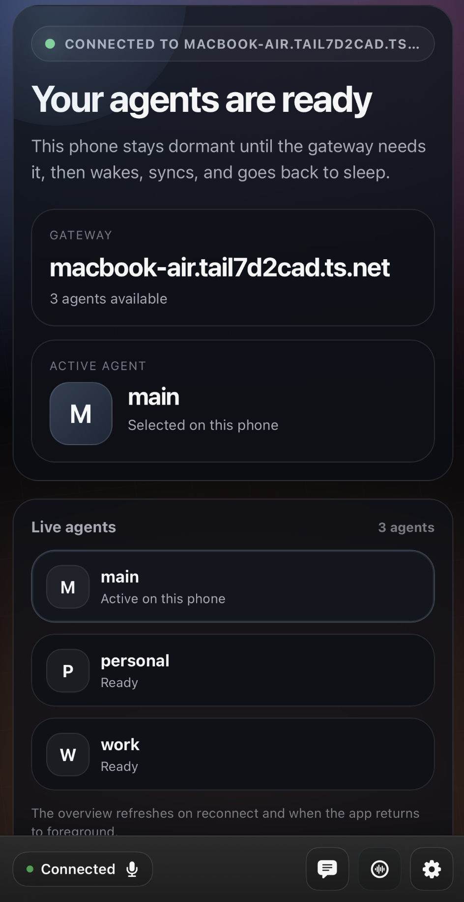

下面的 Live agents 列表（main / personal / work），是我们之前创建的多个智能体，点击任意一个将它设置为这台手机当前的 Active agent，下次连同一个 Gateway 时还能记得用的是哪个 agent。

iOS app 上也内置了一个轻量 Chat 入口，发条消息测试一下：

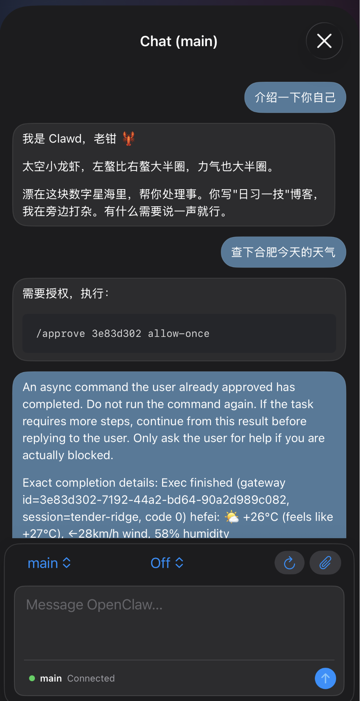

## Android Node 简介

Android 的玩法和 iOS 大体一致，下面挑几处不一样的地方说一说。

- **安装包一样得自己编译。** 和 iOS 一样，应用商店里没有，得自己用 Android SDK 加 Java 17 手工打包。
- **它会一直挂一条通知，这是正常的。** Android 不允许应用长期在后台偷偷跑，想保持连接就得开一个前台服务，代价是状态栏会常驻一条通知。这是系统强制要求，不是 bug，别去关它。进入 Talk Mode 时，它会临时给自己加上麦克风权限，对话结束再收回去。
- **配对方式和 iOS 一样。** 在 Connect 标签页里，同样是 **Setup Code**（输入配对码）或 **Manual**（手填地址）两条路，连上后照例回到 Gateway 主机上跑 `openclaw devices approve` 批准这台设备。
- **远程连接必须走加密通道。** 只要不是在同一个局域网里（比如通过上一篇讲的 Tailscale 远程访问），就必须用加密的 `wss://` 地址，明文的 `ws://` 在首次远程配对时会被拒。只有当手机和 Gateway 确实在同一个内网时（比如局域网 IP、`.local` 主机名、本机 `localhost`、模拟器的桥接地址 `10.0.2.2` 这些情况）才允许用明文 `ws://`。
- **Android 没有唤醒词模式。** 取而代之的是 Voice 标签页里两个手动模式（同时只能开一个）：**Mic** 是手动单次录音，说一段、停顿一下就发一轮，切出应用就停；**Talk** 是连续语音对话，开了之后一直聊，直到你手动关掉或者连接断开。之所以砍掉唤醒词，是因为 Android 对后台录音管得比 iOS 还死，常驻监听很容易被系统直接掐掉。
- **多了一批读取手机个人数据的能力。** 具体能用哪些，取决于设备型号和你给了哪些权限，大致覆盖这几类：读通知和点通知按钮、取最近的照片、查/加联系人、查/加日历日程、翻通话记录、查/发短信、读运动步数，外加查设备本身的状态、信息、权限和电量。对应的命令名分别是 `notifications.*`、`photos.latest`、`contacts.*`、`calendar.*`、`callLog.search`、`sms.*`、`motion.*` 和 `device.*`，需要时再去文档查具体参数即可。
- **通知转发可以按需收窄。** 默认会把手机通知都转给 agent，嫌吵的话可以调：用 `allowPackages` / `denyPackages` 指定只转（或不转）哪些应用的通知，用 `quietHours` 设一个免打扰时段，用 `rateLimit` 限制每个应用每分钟最多转几条。这套要 Android 的通知使用权限，应用首次引导时会主动来要。
- **还能让系统语音助手当入口。** 你可以直接对 Google Assistant 说 "Hey Google, ask OpenClaw…"，这句话会被当成一条普通聊天消息送进 OpenClaw。这靠的是应用清单里声明的一段元数据，Gateway 那边不用做任何配置。

> 我手边没有 Android 设备，就不实际操作了，感兴趣的朋友可以参考文档自己体验试试。

## 实战 iOS app

这一节我同样让 cc 给我设计了一个场景：出差路上，对手机说 "老钳，看看我现在在哪，帮我查附近最近的咖啡馆"，手机录到语音 → 推给家里的 agent → agent 调 `location.get` 拿 GPS → 查询位置和附近的咖啡馆 → 通过 `talk.speak` 把答案语音播回手机。这条链路把 node、location、语音、远程访问全串起来了，分五步。

**第一步：先把 iOS Node 跟 Gateway 配上对。** 在 WebChat 里给 agent 发一条 `/pair` 拿到 setup code，整段复制下来，回到手机进 OpenClaw 的 Settings → Gateway 粘贴进去，状态显示已连接即可。

**第二步：在 iOS app 里打开 Location 权限。** Settings → Location，选 **While Using**。在 Gateway 主机上验证一下能不能拿到坐标：

```bash
$ openclaw nodes location get --node "iOS Node"
```

正常会返回 `{ "lat": 31.23, "lon": 121.47, "accuracyMeters": 12.5, "isPrecise": true, ... }` 这样的 payload。如果报 `LOCATION_DISABLED` 是 app 里的选择器没开，`LOCATION_PERMISSION_REQUIRED` 是系统权限没给，`LOCATION_BACKGROUND_UNAVAILABLE` 是 app 被切到后台了，测的时候保持 app 在前台。

**第三步：配好 Talk provider，让 agent 能把答案念回来。** 编辑 `~/.openclaw/openclaw.json` 的 `talk` 段，最省事的是先用 macOS 自带的系统 TTS 兜底（不要 API key），跑通了再换 ElevenLabs 这种更自然的：

```json5
{
  "talk": {
    "provider": "system",
    "providers": {
      "system": {},
      "elevenlabs": {
        "voiceId": "elevenlabs_voice_id",
        "modelId": "eleven_v3",
        "apiKey": "elevenlabs_api_key"
      }
    }
  }
}
```

> Talk 的几个 provider 是按配置顺序回退的：ElevenLabs 不通就走 `mlx`（macOS 本地推理），再不通就走 `system`（macOS 自带的 `say`）。个人用 ElevenLabs 配额挺紧（免费档每月就 1 万字符），先用 `system` 把链路跑通是更稳的选择。

**第四步：检查唤醒词。** 唤醒词是一份由 Gateway 统一管的全局列表，存在 `~/.openclaw/settings/voicewake.json` 里：

```json
{
  "triggers": [
    "老钳",
    "老钱",
    "老秦"
  ],
  "updatedAtMs":  1778973181234
}
```

任何客户端 UI 改了它都会广播给所有 node 同步。在 iOS app 的 Settings → Wake Words 里确认有你想喊的词（建议别用 `hey`、`ok` 这种太常见的，误触发率高），iOS 端再把本地的 Voice Wake 开关打开。

**第五步：出门，让手机走 Tailscale 连回家里的 Gateway。** 上一篇配的 Tailscale Serve 这时候就派上用场了，家里的 Gateway 通过 `https://<magicdns>` / `wss://<magicdns>` 对 tailnet 内可见，手机装了 Tailscale 客户端、登录同一个账号之后，无论走 4G 还是外面的 WiFi，都能反向连回家。这时候对手机喊 "老钳，看看我现在在哪，帮我查附近最近的咖啡馆"：

1. iOS Node 的 `VoiceWakeManager` 在本地命中唤醒词，开始录音
2. 检测到一段静默后截断，把转写文本通过 WebSocket 推给 Gateway
3. Gateway 把它送进 agent 一轮 turn
4. agent 判断需要位置，调 `location.get` 拿到经纬度
5. agent 用 web 搜索工具查这个坐标附近的咖啡馆
6. agent 把结果整理成一句话，通过 `talk.speak` 经配置的 Talk provider 合成语音
7. 音频流回 iOS Node 播放，你在耳机里听到答案

整条链路的时序大致是这样：

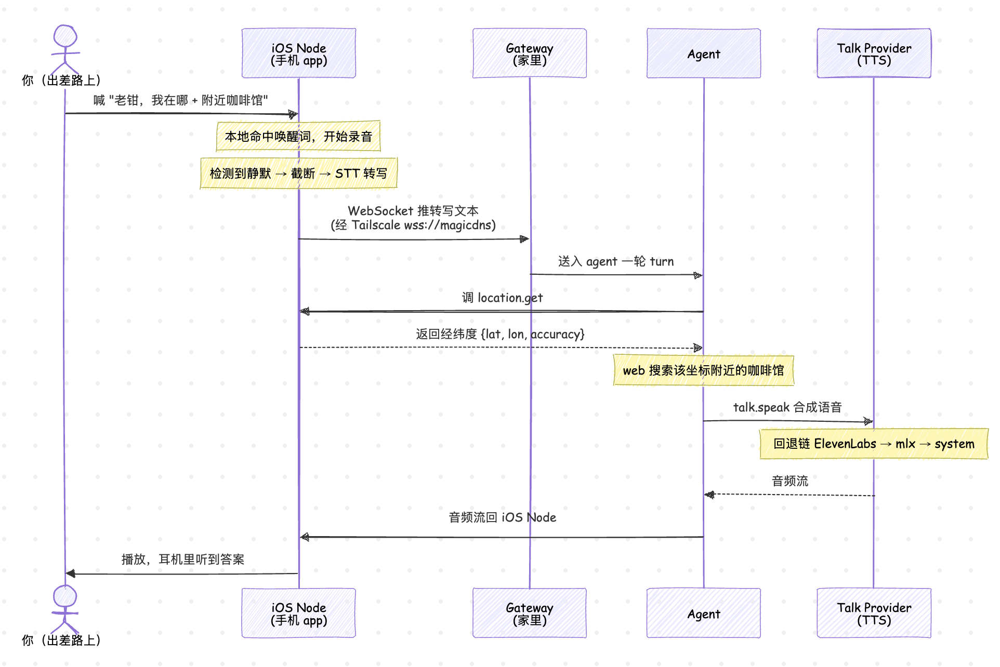

## 小结

这一篇我们把 OpenClaw 在手机上的两个客户端（iOS 和 Android）走了一遍，最后来总结一下：

1. **Device 和 Node 的区别：** Device 是设备的身份证，管的是这台设备是谁、准不准进来；Node 是它进来之后贴出的一张能力清单，管的是它能被调用哪些功能。
2. **iOS Node 的配对和使用：** 目前还很早起，没上架 App Store，得走 TestFlight 内测或自己用 Xcode 编译。一共三种配对方式，配上之后，它能为家里的 agent 提供这些远程感官：拍照、录视频、截屏、获取 GPS 位置、连续语音对话、唤醒词唤起等。
3. **Android Node 和 iOS 大体一致：** 但是它默认不开唤醒词，主要靠手动的录音/对话模式；为了保持连接，它会在状态栏常驻一条通知。作为补偿，它比 iOS 多出一批读手机数据的能力（通知、通讯录、日历、短信、通话记录、运动步数等）。它同样没有公开发布，需要自己编译。

目前为止，我们忙活的全是怎么给小龙虾接上手脚、眼睛、耳朵和 GPS，却从没系统看过它接到任务之后到底能调哪些工具，这些工具又是怎么串起来的。回头看看这两篇的实战例子，上一篇让小龙虾帮忙排查屏幕上的报错，这一篇让它查找附近的咖啡馆，我们会发现这两个任务其实都不简单。就拿查咖啡馆来说，小龙虾先调 `location.get` 拿坐标、再用 web 搜索查、最后把结果合成语音念出来。这一连串的动作其实涉及两个问题：OpenClaw 有哪些工具可用，OpenClaw 拿到任务后使用什么工具，按什么顺序来调用工具。

下一篇我们就先把 OpenClaw 的工具箱挨个翻一遍，之后再讲怎么给它配操作手册。

## 参考

* [OpenClaw 官方文档](https://docs.openclaw.ai/)
* [OpenClaw GitHub 仓库](https://github.com/openclaw/openclaw)
* [iOS app 文档](https://docs.openclaw.ai/platforms/ios)
* [Android app 文档](https://docs.openclaw.ai/platforms/android)
* [Nodes 索引](https://docs.openclaw.ai/nodes)
* [Devices CLI 文档](https://docs.openclaw.ai/cli/devices)
* [Location command 文档](https://docs.openclaw.ai/nodes/location-command)
* [Camera capture 文档](https://docs.openclaw.ai/nodes/camera)
* [Voice wake 文档](https://docs.openclaw.ai/nodes/voicewake)
* [Talk mode 文档](https://docs.openclaw.ai/nodes/talk)
* [Pairing 文档](https://docs.openclaw.ai/channels/pairing)
* [Bonjour / Discovery 文档](https://docs.openclaw.ai/gateway/bonjour)
* [Remote access 文档](https://docs.openclaw.ai/gateway/remote)
