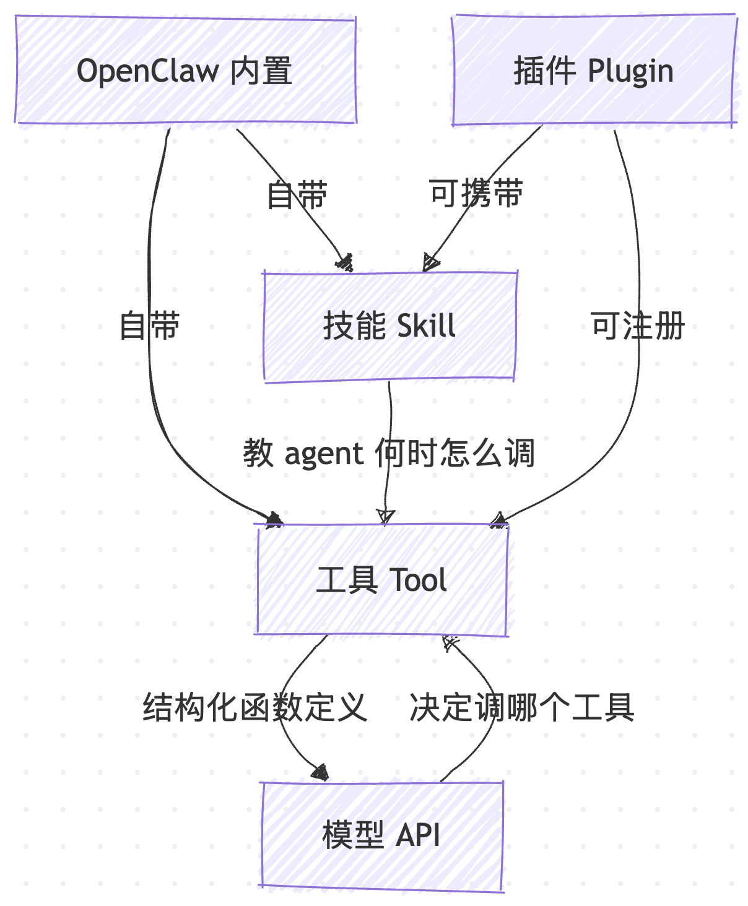
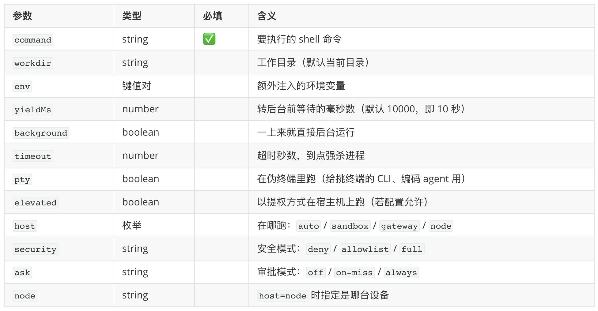
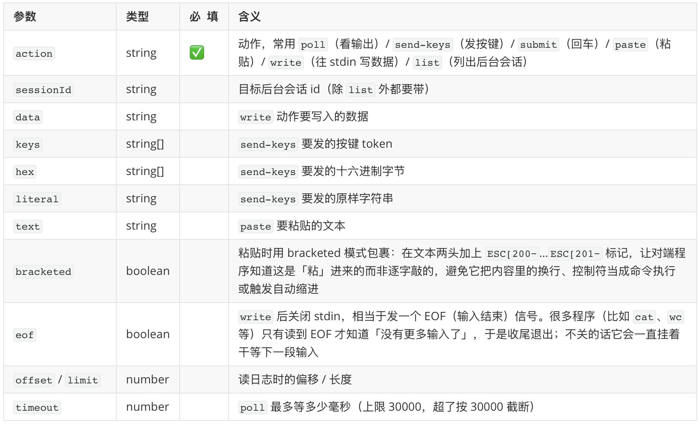
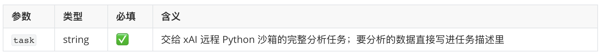
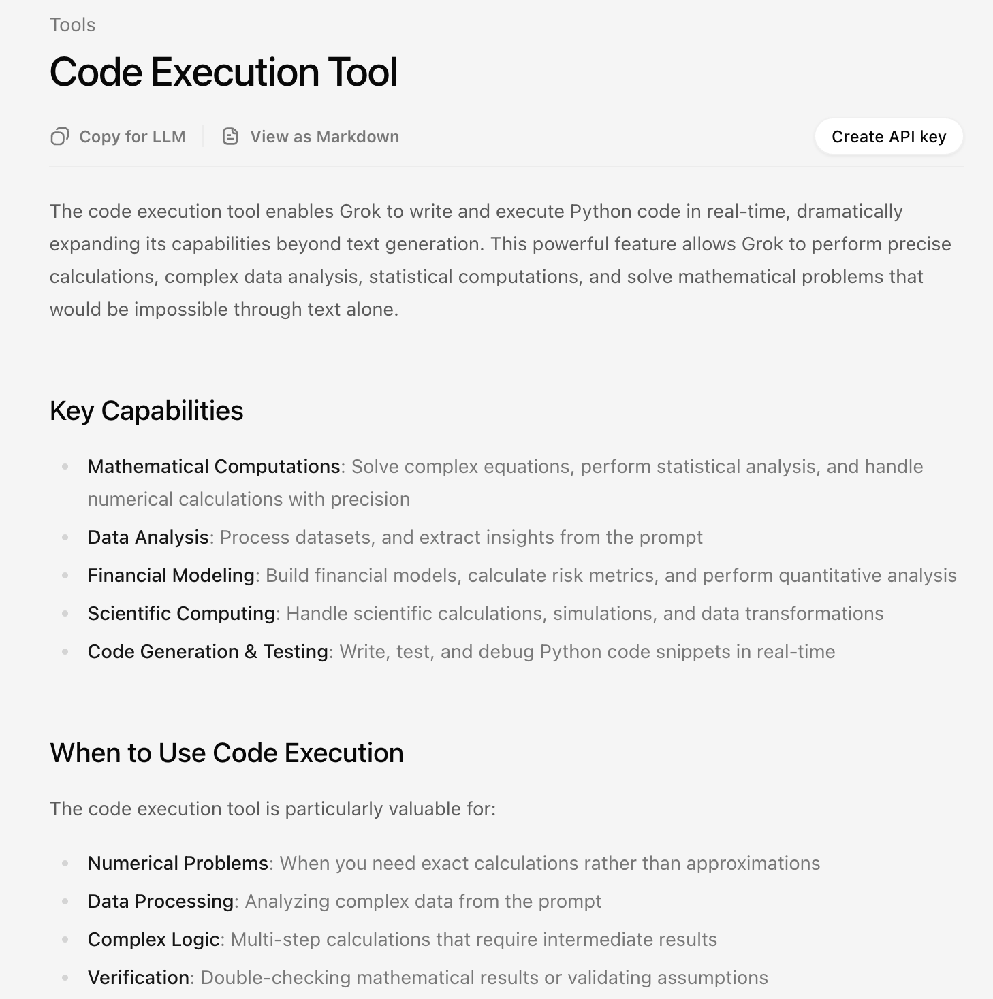
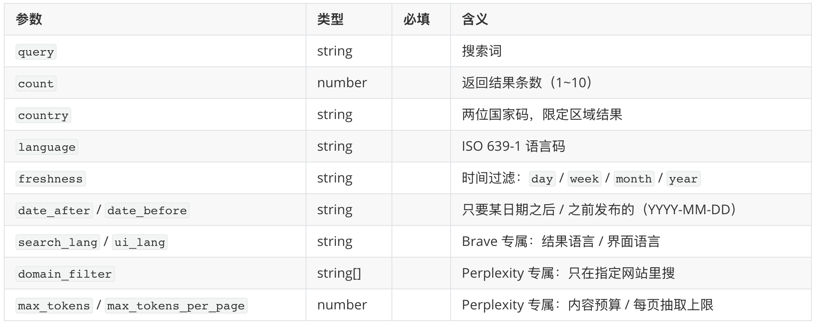
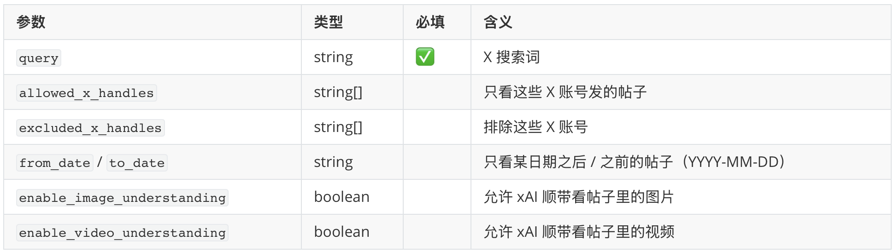
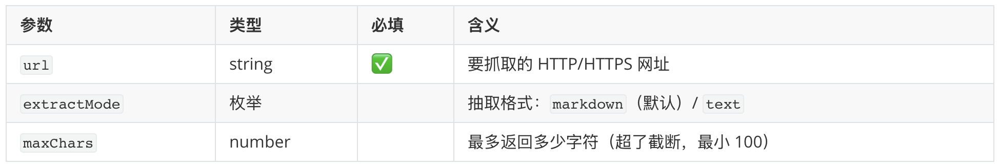
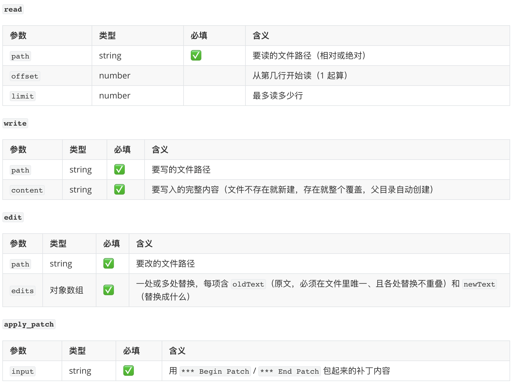
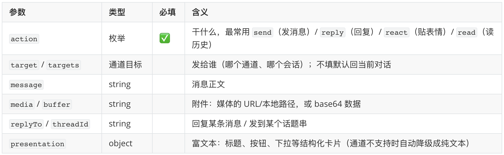

# 给小龙虾配齐工具箱：OpenClaw 的工具体系

在上一篇的最后，我们举了一个场景，对着手机喊一句让小龙虾查附近的咖啡馆，它先调 `location.get` 拿坐标、再用 web 搜索查咖啡馆、最后把结果合成语音念回来。这一连串动作里，`location.get`、web 搜索、语音合成，其实都是 OpenClaw 里的工具。除此之外，小龙虾的工具箱里还有很多内置工具，我们今天就来系统的学习一遍。

## 工具 vs. 技能 vs. 插件

在正式学习之前，我们先看下 OpenClaw 里三个容易混淆的概念：

* **工具（Tool）是 agent 实际调用的东西**。一个工具就是一个带类型签名的函数，比如 `exec`、`browser`、`web_search`、`message`。OpenClaw 自带一批内置工具，还能通过插件注册新工具。对模型来说，工具是以结构化函数定义的形式发给模型 API 的。
* **技能（Skill）教 agent 什么时候、怎么用工具**。它是一份注入到 system prompt 的 `SKILL.md`，给 agent 提供上下文、约束和分步指引。
* **插件（Plugin）把这些打包到一起**。一个插件可以同时注册通道、模型 provider、工具、技能等任意组合。

三者的关系大致是这样：



简单说，**工具是手脚，技能是手册，插件是打包**。今天这篇只讲最底下那层手脚，手册和打包留到后面再讲。

## 内置工具清单

按官方文档，下面这个表格列出了 OpenClaw 所有的内置工具：

| 工具 | 干什么 |
| ---- | ------ |
| `exec` | 跑 shell 命令 |
| `process` | 管后台进程 |
| `code_execution` | 跑沙箱化的远程 Python 分析 |
| `browser` | 控制 Chromium 浏览器（导航、点击、截图） |
| `web_search` | 搜网页 |
| `x_search` | 搜 X 帖子 |
| `web_fetch` | 抓页面内容 |
| `read` | 读工作区内的文件 |
| `write` | 写工作区内的文件 |
| `edit` | 编辑工作区内的文件 |
| `apply_patch` | 多块（multi-hunk）文件补丁 |
| `message` | 把消息发到各个通道 |
| `canvas` | 驱动 node 上的 Canvas（演示、求值、截屏） |
| `nodes` | 发现并指定已配对的设备 |
| `cron` | 管定时任务 |
| `gateway` | 查看、改配置、重启或自更新网关 |
| `image` | 分析图片 |
| `image_generate` | 生成或编辑图片 |
| `music_generate` | 生成音乐 |
| `video_generate` | 生成视频 |
| `tts` | 一次性文本转语音 |
| `memory_search` | 按语义/关键词检索记忆笔记 |
| `memory_get` | 读取指定记忆文件或行区间 |
| `sessions_*` | 列出会话、读会话历史、给别的会话发消息、派生子会话 |
| `subagents` | 子 agent 编排 |
| `agents_list` | 列出可用 agent |
| `session_status` | 轻量的 `/status` 式回读，可临时切换会话模型 |

这张表看着很多，其实可以分为八类：命令执行、网络访问、文件读写、消息收发、设备控制、运行时管理、媒体生成、子 agent 编排。下面我们一类一类来看，重点挑前面几篇文章里反复出现过的工具展开讲。每个工具我都先附一张参数表，直接从 OpenClaw 源码里的 schema 定义整理出来的，列清楚它收哪些参数、每个参数什么意思、哪些必填。看懂一个工具的参数表，基本就摸清了它能干什么、边界在哪。你会发现，决定一个工具好不好用、安不安全的，往往不是它能干什么，而是那些藏在参数里的细节。第一次接触的话，不用每个参数都背下来，先扫一眼有个印象，建立「哪类活找哪个工具」的直觉就够了。

## 命令执行

这一类管的是「让小龙虾运行命令或代码」，一共三个工具：`exec` 在你的机器上跑 shell 命令，几乎是整个工具箱里用得最多的一个：装依赖、跑测试、提交代码，几乎都靠它；`process` 和 `exec` 配对，专管那些转入后台还没退出的命令；`code_execution` 则只需你说清「要算什么」，由 xAI 的 Grok 自己写 Python 并在远程沙箱里跑，全程不碰你的机器。下面一个个看它们的参数。

先看 `exec` 的参数定义：



一眼看过去，必填的只有 `command` 一个，丢一条命令进去就能跑。不过剩下那一长串可选参数，才是这个工具真正的门道所在：

* **跑在前台还是后台？** 默认前台跑，命令执行完结果就回来了。但有些命令（比如启动一个开发服务器）会一直挂着不退出，总不能让小龙虾干等着。所以 OpenClaw 设了个超时：默认跑超过 10 秒（参数 `yieldMs`）就自动转后台，先把控制权交还给对话，命令继续在后台跑。你也可以一上来就 `background: true` 直接丢后台。命令转后台之后，再想看它输出了什么、给它敲个回车或粘点东西进去，就得换用配套的 `process` 工具，它的 `action` 有 `poll`（看最新输出）、`send-keys`（发按键）、`submit`（回车）、`paste`（粘贴）四种。可以把这一对工具想象成：`exec` 开一个会话，`process` 是事后回头去操作这个还开着的会话。这些后台会话还按 agent 各管各的，A 这个 agent 看不见 B 的后台进程，互不打扰。
* **要不要一个伪终端？** 有些命令行程序很挑剔，只肯在真正的终端里跑，检测到自己不是终端就罢工或者输出乱掉（典型的是带交互界面的 TUI 工具或者编码类 agent）。这时给 `exec` 加上 `pty: true`，OpenClaw 会造一个 **伪终端（pty，pseudo-terminal）**，让它以为自己跑在真终端里。一般命令是用不到的。
* **命令在哪台机器上跑？** 这是 `host` 参数，它决定了命令的执行环境，共四个取值：`sandbox`（隔离沙箱）、`gateway`（OpenClaw 主程序所在的机器）、`node`（某台配对的设备，比如你的手机或另一台 Mac）、`auto`（有沙箱就进沙箱，没有就落到网关）。
* **要不要先问过你？** 这由 `security` 和 `ask` 两个参数控制。`security` 管「允许跑哪些命令」：`deny`（基本不让跑）、`allowlist`（只放行白名单里的）、`full`（不限制）。`ask` 管「跑之前要不要确认」：`off`（不确认）、`on-miss`（不在白名单里才确认）、`always`（每次都确认）。沙箱里跑的代码本就被当作不可信，所以在隔离之外再叠一层最严的 `deny`；而网关和 node 是机主自己的机器，OpenClaw 默认假设你想在自己机器上丝滑运行，于是给了 `full` + `ask=off`，也就是所谓的 **YOLO 模式**，它是明知有风险仍为了顺手而放开，所以放到真实机器上跑时尤其要留神这组配置。

配套的 `process` 工具参数定义如下：



> 这里比较有意思的是，`send-keys` 动作有 `keys` / `literal` / `hex` 三个参数，OpenClaw 将「往终端里送一段输入」抽象为三个层次，由高到低分别是：
>
> - **`keys`（按键 token）**：用一个符号名字代表一次按键，而不是字面文本。像「回车」「Ctrl-C」「方向键上」这些按键根本不是可打印字符，回车是字节 `\r`、Ctrl-C 是字节 `0x03`、方向上键是转义序列 `ESC [ A`，没法直接当文本传给终端，所以 `keys` 接受 token，由 OpenClaw 翻译成终端真正认的字节。支持的写法大致三类：具名键（`enter`、`tab`、`escape`、`up`、`backspace`、`f1` 等）、Ctrl 组合（`^c` 即 Ctrl-C）、修饰键前缀（`c-` Ctrl / `m-` Alt / `s-` Shift，如 `c-c`、`m-x`、`s-tab`）。
> - **`literal`（原样字符串）**：直接发、不翻译，你写什么就送什么字符。适合往程序里「打字」，比如填一句 `hello world`、回答一个文件名。注意它不会自动帮你按回车，要回车得再配 `keys: ["enter"]`。
> - **`hex`（十六进制字节）**：最底层，自己一个字节一个字节地拼，比如 `["1b","5b","41"]` 就是 `ESC [ A`（方向上键）。token 表达不了的冷门控制序列才用得到，平时基本碰不上。
>
> 三者可以在**同一次 `send-keys` 调用里一起传**，OpenClaw 按 `literal` → `hex` → `keys` 的固定顺序拼成最终要写入的字节流。常见组合就是「先 `literal` 打一段文本，再 `keys: ["enter"]` 敲回车」。

这个工具和 `exec` 是天生一对：`exec` 起一个会话，`process` 用 `sessionId` 认准那个还开着的后台会话，再用 `action` 去操作它。

第三个工具是 `code_execution`，它的名字和 `exec` 长得很像，但是它干的却是完全不同的活。它的参数定义简单到只有一个：



`exec` 跑的是你机器上的 shell，要你自己给出确切命令；`code_execution` 则不用你写代码，你只给一句话描述「要算什么」，由 **xAI 的 Grok 自己写出 Python 并在它的远程沙箱里跑**，再把结果回给你，全程不碰你的电脑、文件和代码仓库。使用这个工具的典型场景包括，精确数值计算、复杂数据分析、金融建模、科学计算、生成并实测一段代码等。

值得注意的是，这里的沙箱并不是 OpenClaw 自己的沙箱，而是直接套用了 [xAI 官方的 Code Execution 工具](https://docs.x.ai/developers/tools/code-execution)：



按官方的说法，Code Execution 工具让 Grok 能实时编写并执行 Python 代码，代码跑在一个沙箱化的 Python 环境里，预装了 NumPy、Pandas、Matplotlib、SciPy 这些常用库。`code_execution` 工具本质上就是对这个接口的封装，它注册在 `xai` 插件里，默认用 `grok-4-1-fast` 模型。

## 网络访问

这一类是小龙虾「上网查东西」的本事，一共四个工具：`web_search` 搜网页、`x_search` 搜 X 帖子、`web_fetch` 抓某个具体网页、`browser` 真的开一个浏览器像人一样操作。前三个是轻量级工具，本质是「发送 HTTP 请求获取结果」，速度快、省资源、不调用浏览器，绝大多数查资料的活，使用这三件套就够了；只有遇到要登录、要点按钮、内容靠 JS 渲染的网站，才需要动用 `browser` 工具。

我们先看 `web_search` 的参数定义：



`web_search` 能传的参数也比想象中多，比如 `freshness`（只要最近一天/周/月/年的结果）、`country/language`（限定国家语言）、`date_after/before`（限定日期范围），还有 Perplexity 专属的 `domain_filter`（只在指定网站里搜）等等。

另外，使用 `web_search` 必须提前配置好至少一个搜索引擎的 provider，支持的 provider 如下：

* **[Brave](https://brave.com/search/api/)** —— 结构化结果带摘要，支持国家/语言/时间过滤，有免费额度；环境变量 `BRAVE_API_KEY`。
* **[Perplexity](https://www.perplexity.ai)** —— 有两条路：直连 `PERPLEXITY_API_KEY` 走原生 Search API，返回结构化结果、支持域名/时间/语言等过滤；或用 `OPENROUTER_API_KEY`（`sk-or-` 开头）经 OpenRouter 调 Perplexity 的联网模型 Sonar，拿到带引用的合成答案，但那些结构化过滤用不了。
* **[Exa](https://exa.ai)** —— 关键词+语义 搜索，带内容抽取（highlights 相关摘录 / text 正文全文 / summary AI 摘要）；环境变量 `EXA_API_KEY`。
* **[Tavily](https://tavily.com)** —— 结构化结果，带搜索深度、主题过滤，还配套一个 `tavily_extract`（相当于 Tavily 版的批量抓正文工具，一次能抽 1~20 个 URL，比 `web_fetch` 一次一个更省事，常用来把搜到的一批链接一口气捞回正文）；环境变量 `TAVILY_API_KEY`。
* **[Firecrawl](https://firecrawl.dev)** —— 结构化结果，擅长配合 `firecrawl_search` / `firecrawl_scrape` 做深度抽取；环境变量 `FIRECRAWL_API_KEY`。
* **[Gemini](https://ai.google.dev)** —— 对接 Google 搜索接口，返回带引用的 AI 合成答案；环境变量 `GEMINI_API_KEY`。
* **[Grok](https://x.ai)** —— 对接 xAI 的 web 搜索接口，返回带引用的 AI 合成答案；环境变量 `XAI_API_KEY`。
* **[Kimi](https://kimi.com)** —— 走 Moonshot 网络搜索，返回带引用的合成答案（注意：若退化成无搜索的纯聊天会显式报错）；环境变量 `KIMI_API_KEY` / `MOONSHOT_API_KEY`。
* **[MiniMax](https://www.minimax.io)** —— 走 MiniMax Token Plan 搜索 API，结构化结果；环境变量 `MINIMAX_CODE_PLAN_KEY` / `MINIMAX_CODING_API_KEY` / `MINIMAX_OAUTH_TOKEN`。
* **[DuckDuckGo](https://duckduckgo.com)** —— 无需账号和 key，非官方 HTML 集成（没有官方 API，靠抓取并解析 DuckDuckGo 网页拿结果，脆且易被限流，仅作保底），最常用的兜底。
* **[Ollama Web Search](https://ollama.com)** —— 走你本地登录的 Ollama 主机，或配 `OLLAMA_API_KEY` 调托管的 `ollama.com`。
* **[SearXNG](https://searxng.org)** —— 自建的元搜索，聚合 Google/Bing/DuckDuckGo 等，需配 `SEARXNG_BASE_URL`。

三种配置方式：

1. **命令行向导**（最省事）：跑 `openclaw configure --section web`，它会引导你选 provider 并存好凭证。
2. **环境变量**：直接设上面列的那个变量（如 `export BRAVE_API_KEY=...`），API 类 provider 就能用了，连配置文件都不用动。
3. **配置文件**（最可控）：在 `tools.web.search` 里指定用哪家，key 放在对应插件的 `plugins.entries.<plugin>.config.webSearch.apiKey` 下：

```json5
{
  "tools": {
    "web": {
      "search": {
        "enabled": true,        // 默认就是 true
        "provider": "brave",    // 钉死用哪家；省略这行就走自动探测
        "cacheTtlMinutes": 15,  // 同一搜索词的缓存时长（分钟）
      },
    },
  },
  "plugins": {
    "entries": {
      "brave": { "config": { "webSearch": { "apiKey": "YOUR_KEY" } } },
    },
  },
}
```

如果你不写 `provider`（即自动探测），OpenClaw 会按一个固定优先级自己挨个试：先试配了 key 的，顺序是 Brave → MiniMax → Gemini → Grok → Kimi → Perplexity → Firecrawl → Exa → Tavily；一个能用的都没有，才退回到免 key 的 DuckDuckGo → Ollama → SearXNG。

同样的搜索词 15 分钟内再搜会直接给缓存结果（这个时长就是上面的 `cacheTtlMinutes`），省得重复花钱。

再来看下 `x_search` 的参数定义：



`x_search` 专门搜 X（推特）上的帖子，它和前面的 `code_execution` 类似：同样由 `xai` 插件注册，同样通过 xAI 的 Responses API（`https://api.x.ai/v1/responses`）调用，由 Grok 在 xAI 那边执行。区别只在带的服务端工具不同，`code_execution` 带的是 `code_interpreter`，`x_search` 带的是 [xAI 官方的 X Search 工具](https://docs.x.ai/developers/tools/x-search)，默认模型 `grok-4-1-fast-non-reasoning`。

`x_search` 返回的是一段带引用出处的合成答案（不是一堆原始链接）。如果你想要某条帖子精确的转发数、点赞数这类细粒度数据，最好分两步走，先用关键词搜，搜到那条帖子，拿到它的链接，再用这条确切的帖子 URL 跑第二次 `x_search`。因为一次宽泛的关键词搜索通常能帮你「找到」帖子，却给不全单条帖子的精确数据。

接下来是 `web_fetch` 的参数定义：



`web_fetch` 是给定一个具体网址，然后把那一页的内容抓回来。它**默认不依赖任何 provider，开箱即用**，自己发一个普通 HTTP GET，再用 Readability（网页主内容抽取）把正文扒出来，转成 markdown 或纯文本。

> [Readability](https://github.com/mozilla/readability) 是 Mozilla 开源的一个网页正文提取库（Firefox「阅读模式」用的就是它）：丢一个 HTML 页面进去，它会按一套启发式规则把导航栏、广告、侧边栏、页脚这些噪音剥掉，只留下文章主体（标题 + 正文）。`web_fetch` 用它把抓回来的原始 HTML 清洗成干净的 markdown/纯文本，省得把整页杂七杂八的标签都塞给模型。

当 Readability 抽取失败了（页面被反爬、结构太怪），你也可以配置 provider 再抓一次，当前内置的 provider 只有 [Firecrawl](https://github.com/firecrawl/firecrawl) 一个（可通过插件扩展）。它的配置如下：

```json5
{
  "tools": {
    "web": {
      "fetch": {
        "provider": "firecrawl",  // 可省略，省略则按凭证自动探测
      },
    },
  },
  "plugins": {
    "entries": {
      "firecrawl": {
        "enabled": true,
        "config": { "webFetch": { "apiKey": "fc-..." } },  // 或设 FIRECRAWL_API_KEY
      },
    },
  },
}
```

关于 `web_fetch`，它还有一道独立的安全防护，叫 **SSRF 防护**。SSRF 全称服务端请求伪造，它的问题根源在于 `web_fetch` 要抓的那个 URL 是**不可信的外部输入**，它可能来自搜索结果、模型读到的某段网页内容、用户的一句话，甚至是别人通过提示注入诱导模型去填的 URL。攻击者只要能影响这个 URL，就能让小龙虾以服务器自己的身份去访问本不该碰的地址，比如公司内网的机器、本机回环地址（`127.0.0.1`）、或者云服务器上那个一访问就能读到密钥的「元数据接口」（`169.254.169.254`）。更阴的一招是用一个看着人畜无害的公网链接，靠 30x 跳转把请求重定向到内网地址。`web_fetch` 默认就把这些私网、环回、元数据地址全挡掉，并且**对重定向也逐跳重新校验**，除非你明确放行。

> `169.254.169.254` 是一个特殊的保留 IPv4 **链路本地地址（Link-local address）**，几乎所有的云计算平台（如 AWS EC2、Azure、阿里云等）都将其作为 **实例元数据服务（Instance Metadata Service, IMDS）**。它允许虚拟机从其主机获取配置信息、安全凭证等，且该地址仅在局域网内有效，不可路由到外网。正因为它的特殊性，所以它往往是 SSRF 攻击的头号目标，攻击者只要能让服务器替自己请求这个地址，往往就能直接拿到云凭证、进而接管你的云上资源。

除了这三个轻量级工具，我们还可以使用 `browser` 进行网络访问，它会真的开一个 Chromium 浏览器，像人一样去操作网页。这个工具能力最强，风险也最高，比较复杂，我们放到下一篇专门学习。

## 文件读写

这一类管的是小龙虾在工作区里读写文件，一共四个工具：`read` 读文件、`write` 整篇覆盖写、`edit` 按原文精确替换地改、`apply_patch` 把多文件多处改动打成一个补丁一次性提交。

我们先来看下这四个工具的定义：



前三个比较好理解，它们能力递进，参数从少到多：`read` 只要个路径；`write` 多一个 `content`，是「整篇覆盖」；`edit` 的 `edits` 是一组 `{oldText → newText}`，并要求 `oldText` 在文件里唯一，并且各处替换互不重叠，所以它比 `write` 安全，因此日常编辑文件或修改代码，几乎清一色用 `edit`，`write` 一般只在新建文件时才上场。

另外 `read` 还有一个细节，它默认最多读 2000 行或 50KB，先到为准，如果拿来读长日志可能会被截断，这时候得搭配 `offset` / `limit` 分段读。

最后的 `apply_patch` 参数也很简单，只有一个 `input`，但它是这一组里功能最强、也最复杂的一个，门道全在这段字符串的格式里。先解释一个词：**hunk（块）**。我们改一个文件，往往不是只动一处，而是东一段西一段，好几处不相邻的改动。程序员之间习惯用一种叫 **diff** 的文本格式来记录这个文件改了什么；这份文本拿去给工具自动应用，就叫 **补丁（patch）**。在这种格式里，**每一段连续的改动**就被叫作一个 hunk。`edit` 一次只能改一处，要改五处就得调五次，文件一大很容易对不上行，改错地方。`apply_patch` 的思路是：把「这个文件第几段删什么加什么、那个文件又改哪里、再删掉某个文件」全写进**一段补丁文本**里，一次性提交。它接受的 `input` 参数长这样：

```
*** Begin Patch
*** Add File: 新文件路径         # 新建文件
*** Update File: 已有文件路径    # 改已有文件，下面可跟多个 @@ 块
*** Move to: 新文件路径          # 可选：顺带给这个文件改名
@@
-旧的一行
+新的一行
*** Delete File: 要删的文件      # 删文件
*** End Patch
```

可以看到，一个补丁里能同时 Add / Update / Delete 多个文件，每个文件里还能有多个 hunk，Update 时跟一行 `Move to:` 还能顺带对文件进行改名。

这套格式初看和 git diff 很像，但要注意的是，它并不是标准的 git diff 格式，它是 [OpenAI 自己定的一套语法](https://developers.openai.com/api/docs/guides/tools-apply-patch)，外面套着 `*** Begin Patch` 和 `*** End Patch`，`@@` 后面也不带行号（标准 diff 是 `@@ -10,7 +10,7 @@`，模型容易数错），改用上下文行来定位。也正因为它是 OpenAI 阵营的格式，所以只有 OpenAI 家的模型被专门训练成会输出这种补丁，所以 `apply_patch` 在 OpenClaw 里**默认只对 OpenAI / OpenAI Codex 模型开启**，换成其他模型效果可能会不太理想。

## 消息收发

这一类只有 `message` 一个工具，它是小龙虾跟各个通道（Telegram、飞书等各种 IM）打交道的总接口，也是整个工具箱里**参数最多**的一个。它的 schema 是按「动作」动态拼出来的，光 `action` 一个枚举就有五十多个值：`send`（发消息）、`reply`（回复）、`react`（贴表情）、`poll`（发起投票）、`pin`（置顶消息）、`thread-create`（建话题）、`kick`（踢人）、`ban`（封禁）……几乎一个 IM 机器人能干的事都归它：


这里只挑最常用的几个参数看下：



还剩下几十个参数都是某个具体 `action` 才用得到的（比如建话题、改群名、踢人），运行时还会按当前通道的能力过滤。我们暂时只要知道 `message` 是个按 `action` 分派的大工具就够了，具体动作用到时再查。

## 未完待续

这一篇我们先把 OpenClaw 工具体系的地基和前半批工具过了一遍：

1. **三层关系**：工具是 agent 实际调用的带类型函数，技能是教它何时怎么用工具的手册，插件是把这些打包到一起的箱子
2. **内置工具分八类**：命令执行、网络访问、文件读写、消息收发、设备控制、运行时管理、媒体生成、子 agent 编排，这一篇讲完了前四类
3. **命令执行**：`exec` 靠 `host`（在哪跑）+ `security`（让不让跑）+ `ask`（要不要问你）三个旋钮划定边界，配套的 `process` 用来操作转后台的会话，`code_execution` 则是套了 xAI 官方的 Code Execution 工具、让 Grok 远程编写并运行 Python 脚本
4. **网络访问**：轻量三件套 `web_search`（认 provider，要先配）、`x_search`（走 xAI）、`web_fetch`（自带 SSRF 防护），重型的 `browser` 留到后面单独讲
5. **文件读写**：`read` / `write` / `edit` / `apply_patch` 能力递进，日常改代码最常用 `edit`，`apply_patch` 用的是 OpenAI 那套补丁格式、默认只对 OpenAI / Codex 模型开启
6. **消息收发**：`message` 一个工具按 `action` 分派，五十多个动作几乎涵盖一个 IM 机器人能干的所有事

剩下的设备控制（`nodes` / `canvas`）、运行时管理（`cron` / `gateway`）、媒体生成和子 agent 编排这四类工具，内容还不少，我们下一篇继续学习。
