# 给小龙虾配齐工具箱：OpenClaw 的工具体系（二）

上一篇我们把 OpenClaw 的内置工具分成了八大类，并且把前四类一一看了一遍，这一篇书接上文，继续后面四类的学习。

## 设备控制

这一类管的是小龙虾对配对进来的设备 / node 的操控，两个工具配合着用：`nodes` 负责发现、配对、指定要遥控哪个 node，以及对它干什么（拍照、录屏、取定位、推送通知等），`canvas` 负责在某个 node 的屏幕上画东西（显示页面、跑 JS 脚本、截屏画面）。

我们先来看 `nodes` 的参数，它和昨天学习的 `message` 类似，也是个按 `action` 分派的工具：

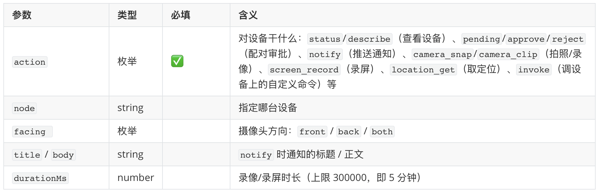

完整的 `action` 一共 19 个，每个 `action` 还各带一批专属的细分参数（定位精度、通知优先级、录屏的 screen 选择等等），一张表列不下，用到时再查文档即可。这 19 个动作按功能分组大致如下：

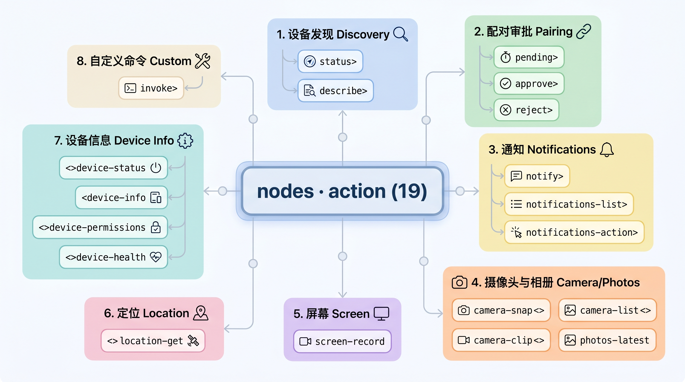

图里的分组命名，正好牵出我们之前曾学习过的一组概念：**设备（Device）** 和 **节点（Node）**。一台 Mac、一部手机这样的物理设备，在 OpenClaw 里其实分两层看：**Device** 是它的「身份证」，管它是谁、准不准进来；**Node** 是它以 `role: node` 连进来之后对外贴出的「能力清单」，管它能被调用哪些功能。

`nodes` 这个工具名字虽叫 nodes，实际上横跨了这两层：图里的「配对审批」和「设备信息」管的是 Device（这台设备是谁、批不批），「摄像头 / 屏幕 / 定位 / 通知 / 自定义命令」几组才是真正在调 Node 的能力。说白了它就是一台「设备遥控器」，`node` 参数选遥控哪一台，`action` 选按哪个键。

接下来，我们再来看下 `canvas` 工具的核心参数：

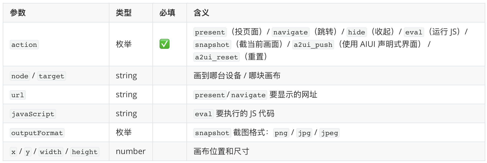

这个工具其实我们之前在 macOS app 篇里已经见过了，那块吸在菜单栏边、给小龙虾当可视化工作区的面板，就是它的画布；它和 `nodes` 一样，每个 `action` 底层都对应一条 `canvas.*` 节点命令，发给目标 node 上的画布去执行。

## 运行时管理

这一类是小龙虾用来管理自身运行时的两个工具：`cron` 管定时任务（比如每天早上八点提醒我打卡），对应前面 cron / heartbeat 那篇；而 `gateway` 则能查看和修改自己的运行时配置，甚至重启和自我升级。

我们先看 `cron`，它的参数也是按 `action` 分派，外加一个嵌套的 `job` 对象，核心部分如下：

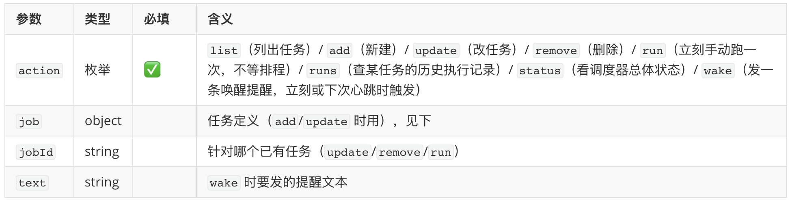

`job` 对象里最关键的是 `schedule`（什么时候跑）和 `payload`（跑的时候干什么）：

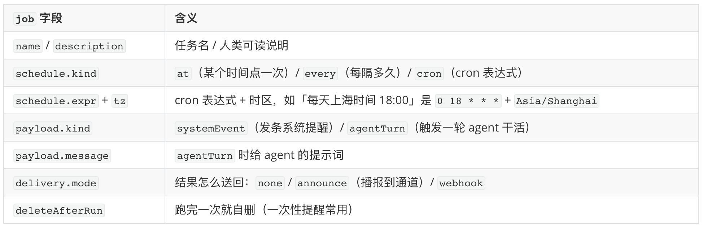

光看参数还是有点抽象，举个具体例子：开头说的「每天早上八点提醒打卡」，用 `add` 建出来就是这么一个 job：

```json5
{
  action: "add",
  job: {
    name: "打卡提醒",
    schedule: { kind: "cron", expr: "0 8 * * *", tz: "Asia/Shanghai" }, // 何时跑：每天上海时间 8:00
    payload: { kind: "systemEvent", text: "提醒主人：该打卡了" },          // 跑时干啥：推一条提醒
    delivery: { mode: "announce" },                                      // 结果去哪：播报到当前通道
  },
}
```

这个 job 拆开看其实就三块：

先是 `schedule`，它指的是任务什么时候跑，有三种写法：`at` 是「某个时间点只跑一次」，给一个具体时刻就行（比如下周一上午十点），适合一次性的提醒；`every` 是「每隔多久跑一次」，给一个毫秒间隔（比如每两小时一次）；`cron` 最灵活，用一条 cron 表达式配上时区来描述周期，上面例子里的 `0 8 * * *` 加 `Asia/Shanghai`，意思就是「每天上海时间早上八点」。

再是 `payload`，它说的是到点之后具体干什么，分两种。一种是 `systemEvent`，只往通道里推一条提醒文本，内容写在 `text` 字段里，上面打卡那个例子就是它，跑起来无非是按时吼你一嗓子。另一种是 `agentTurn`，到点会触发一整轮完整的 agent 任务，要它干的事写在 `message` 字段里。比如把上面的 payload 换成：

```json5
payload: { kind: "agentTurn", message: "拉一下我今天的日程，挑出最重要的三件发我" }
```

到了八点，小龙虾就不只是提醒你，而是真的去翻日程、筛选、再把结果发过来。注意这两种类型的字段不一样：`systemEvent` 用 `text`，`agentTurn` 用 `message`。

最后是 `delivery`，它管干完之后结果往哪儿送，有三档：`none` 是不往外送，任务在后台默默跑完就算（常配那些不需要回话的任务）；`announce` 是把结果播报到当前通道，你在 Telegram、飞书里就能直接收到，也是最常用的一档；`webhook` 则是把结果 POST 到你指定的一个回调地址，方便接进自己的系统或别的自动化流程里。

对照着这个例子回头看，就能明白前面 cron / heartbeat 篇里那些定时任务是怎么配出来的了。

第二个工具是 `gateway`，下面是它的参数定义：

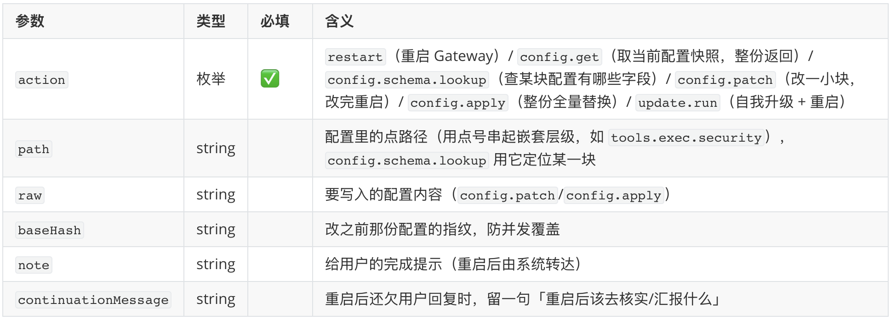

这个工具比较特殊，它是 **仅限 owner（也就是你本人）** 才能调用的，OpenClaw 根据这轮消息是谁发来的判定：本机 CLI、菜单栏 app、Control UI 这些本地操作天然算 owner；远程 IM 通道则需要把自己的账号加到 `commands.ownerAllowFrom` 配置里：

```json5
{
  commands: {
    ownerAllowFrom: [
      "telegram:123456789",  // 通道名 + 该通道里的用户 id，只在这个通道生效
      "feishu:ou_xxxxxxxx",  // 别的通道照此再写一条
      "+8613800138000",      // 不带通道前缀：按账号本身匹配，不限通道（手机号会规范成 E.164）
      "*",                   // 所有人都是 owner，强烈不建议使用，等于把门彻底敞开
    ],
  },
}
```

它的六个 `action` 按用途可分为三组：

先是「看」的两个。`config.schema.lookup` 用来查某一块配置长什么样、有哪些字段、各是什么类型，相当于动手之前先翻一遍说明书；`config.get` 则是把当前生效的配置整个拉出来看一眼，并附带一个 hash，这个 hash 是这份配置算出来的指纹，记住它，等下改的时候用得上。

再是「改」的两个。`config.patch` 只动其中一小块，日常最常用，注意它并不靠某个 `path` 参数来定位，而是把要改的内容写成一个 **只包含目标项的嵌套对象** 塞进 `raw` 里，OpenClaw 再把它 **深合并** 进当前配置：你写到的字段被改掉，没提到的一律原样保留，嵌套的层级本身就等于一条路径（这个看下面的例子就明白了）。`config.apply` 则相反，`raw` 给的是 **一整份** 新配置、直接把旧的全量覆盖，你漏写哪项哪项就没了，动静大、容易误伤，非必要不用。两者都可以带上刚才那个指纹（参数叫 `baseHash`），OpenClaw 会拿它跟当前配置比一比，要是中途配置被别处改过、对不上号，就拒绝这次改动，免得两边并发把对方的修改覆盖掉。

最后是「重启 / 升级」的两个。`restart` 直接重启 Gateway；`update.run` 触发一次自我升级再重启。这俩重启完，如果还有没回完的话，可以靠 `note`（重启后由系统替它转达的一句完成提示）和 `continuationMessage`（提醒它重启后该回头去核实、汇报什么）把上下文接回来。

对于一次局部配置的修改，官方推荐的做法是，先用 `config.schema.lookup` 看清楚配置的格式，然后再用 `config.patch` 小改，别动不动就整份 `config.apply`。比如想把子 agent 的默认思考强度从 `medium` 提到 `high`，一次 patch 就够了：

```json5
{
  action: "config.patch",
  baseHash: "<config.get 拿到的那个指纹>",
  raw: `{ "agents": { "defaults": { "subagents": { "thinking": "high" } } } }`,
}
```

这里还藏着一道挺关键的安全设计：`config.patch` / `config.apply` 并不是想改什么就能改什么，它们背后有一道安全守卫，专门拦那些会削弱小龙虾自身安全的改动。比如关掉沙箱、放开插件加载、改写 Gateway 的鉴权 token、去掉 `web_fetch` 的 SSRF 防护，当然也包括前面 `exec` 那节讲的 `tools.exec.ask` 和 `tools.exec.security` 那两个开关。换句话说，小龙虾可以借 `gateway` 给自己做点微创手术，但没办法通过改配置悄悄突破自己的安全防线，这道兜底写死在代码里，谁也绕不过去。

## 媒体生成

这一类让小龙虾造出图片、视频、音乐和语音，一共五个工具：`image` 是看图（分析理解一张已有的图），`image_generate` 生成或修改图，`video_generate` 生成视频，`music_generate` 生成音乐，`tts` 把文字读成语音。

这一组工具参数都不少，但骨架高度一致，我们不妨对照着看。先看「看图」和「文字转语音」这两个最简单的：

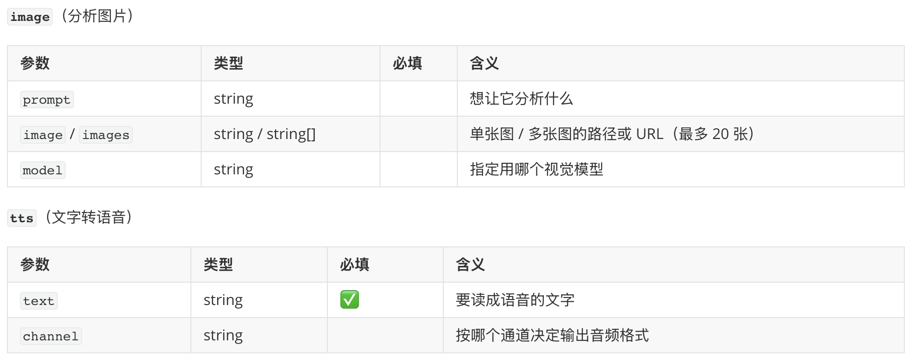

`image` 是这五个工具里唯一读而不写的，其余四个都在产出新东西，它却反过来，输入一张已有的图，让小龙虾看懂里面有什么。参数 `prompt` 表示你想知道什么（比如：这张图里有几个人，把发票上的金额读出来），参数 `image` 或 `images` 表示图的本地路径或 URL（一次最多塞 20 张，方便让它对比着看几张），参数 `model` 只在你想指定某个视觉模型时才填，不填就用自动探测到的那个。

`tts`（text to speech，文字转语音）则是把一段文字读成语音。必填的只有 `text`，也就是要念的那段话；另一个 `channel` 表示发到哪个通道，OpenClaw 根据这个自动匹配输出格式，必要时还用 `ffmpeg` 转码一道，因为各家 IM 认的格式不一样，大致分三档：支持语音条的通道（Telegram、飞书、WhatsApp、Matrix 等）优先用 **Opus**（48kHz，裹在 Ogg/WebM 里，听感好、体积小），普通通道发 **MP3**（约 44.1kHz / 128kbps），Talk、电话这类实时语音通道则要原始 **PCM**（或 Gradium 那种 `ulaw` 8kHz），此外本地 CLI、Gemini、xAI 等还能产出 **WAV**，这些你基本不用操心，填对 `channel` 它自己会挑。最后还有一点值得留意：`tts` 是明示意图才触发的，平时聊天默认还是回文字，只有你明确说「读出来」、或者用了 `/tts` 斜杠命令、或者开了 Auto-TTS 模式，它才会输出语音，不会动不动就给你来段朗读。

再看三个「生成」类工具，它们骨架相通：都用 `action` 切换模式，`prompt` 给提示词，`model` 指定模型，`timeoutMs` 设置超时。但生成的东西不一样，各自的专属参数也不一样。

先是 `image_generate`（生成或编辑图片），关键在尺寸、张数和图片专属的质量、格式、背景等参数：

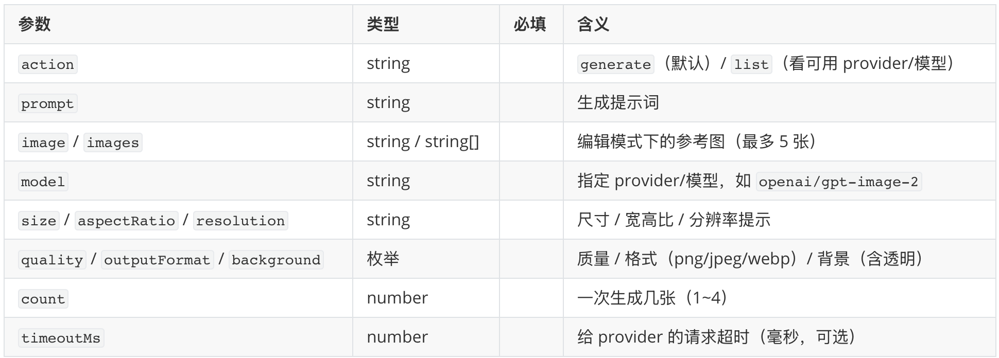

`video_generate`（生成视频）的重头是参考素材和视频特有的时长、宽高比等参数，它支持文生视频、图生视频、视频生视频三种玩法：

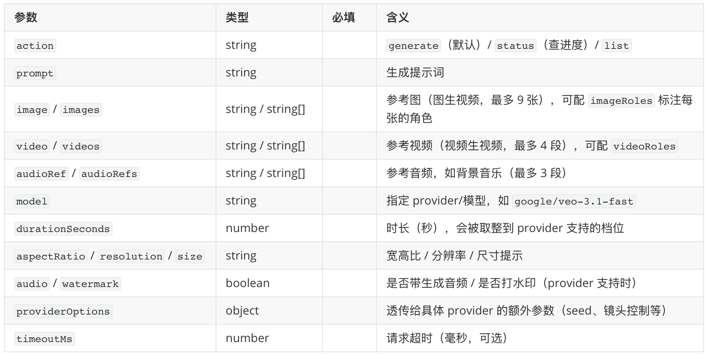

`music_generate`（生成音乐）则换成歌词、纯伴奏这类音乐专属的参数：

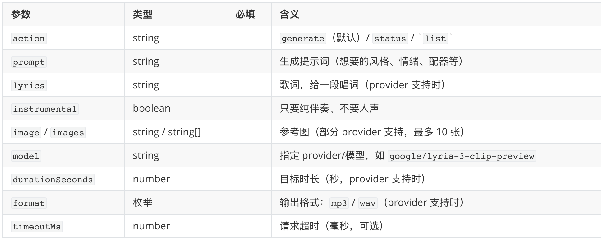

这几个工具在使用之前，都得先配好至少一个对应的 provider 才行。四个生成型工具的 provider 可选如下：

- **`image_generate`**：OpenAI（`gpt-image` 系列）、Google（Gemini 图像）、xAI（Grok Imagine）、fal、DeepInfra（FLUX）、MiniMax、OpenRouter、ComfyUI、Vydra 等。
- **`video_generate`**：OpenAI（Sora）、Google（Veo）、Runway、MiniMax（Hailuo）、阿里（Wan）、字节 BytePlus（Seedance）、Qwen、fal、xAI、Vydra 等十几家。
- **`music_generate`**：就 Google（Lyria）、MiniMax、ComfyUI 三家。
- **`tts`**：OpenAI、ElevenLabs、Google、Azure Speech、MiniMax、火山引擎、Inworld、小米 MiMo，外加免 key 的微软 Edge 神经语音和本地 CLI 等。

前三个工具的配置相似，都在 `agents.defaults.<X>GenerationModel` 下写 `primary`（首选）和 `fallbacks`（依次兜底），取值用 `provider/model` 的形式：

```json5
{
  agents: {
    defaults: {
      imageGenerationModel: {
        primary: "openai/gpt-image-2",
        fallbacks: ["google/gemini-3.1-flash-image-preview", "fal/fal-ai/flux/dev"],
      },
      // videoGenerationModel、musicGenerationModel 同理
    },
  },
}
```

`tts` 略有不同，配在 `messages.tts` 下，可以挂好几个 provider，再用 `provider` 指定默认那家：

```json5
{
  messages: {
    tts: {
      provider: "openai", // 默认用哪家；没配则按已配好的挨个兜底
      providers: {
        openai: { apiKey: "${OPENAI_API_KEY}", model: "gpt-4o-mini-tts", voice: "alloy" },
        elevenlabs: { apiKey: "${ELEVENLABS_API_KEY}", voiceId: "EXAVITQu4vr4xnSDxMaL" },
      },
    },
  },
}
```

到底用哪家 provider，OpenClaw 有一套自己的优先级规则：调用时 `model` 参数写死的最优先，且不再往下兜底；其次是配置里的 `primary` → `fallbacks`；如果两样都没指定，还会走一遍 **自动探测**，把配了 API key 的 provider 按固定顺序挨个试，第一个能用的就用它（这个自动兜底可以用 `agents.defaults.mediaGenerationAutoProviderFallback: false` 关掉）。想知道当前手头到底有哪些可用，可以通过 `action: "list"` 列出 provider 清单。

最后说回第五个 `image`（看图）工具。前面说过它不算生成而是理解，配置也和上面四个不一样：不在 `agents.defaults` 下，而是在 `tools.media` 里按能力（`image` / `audio` / `video`）各列一组 `models`，每个条目指明用哪个 provider/模型来「读」媒体，列多条就是按序兜底（一条失败、或媒体太大超限，就换下一条）：

```json5
{
  tools: {
    media: {
      image: {
        models: [
          {
            type: "provider",     // 也可以是 "cli"，跑一条本地命令来看图
            provider: "openai",
            model: "gpt-5.5",
            prompt: "用不超过 500 字描述这张图",
            maxChars: 500,        // 摘要最多多少字
            timeoutSeconds: 60,
          },
          // 再列一条，就是下一顺位的兜底
        ],
      },
    },
  },
}
```

要是你压根没配 `tools.media` 参数，OpenClaw 也有一个自动探测机制，如果当前回复用的模型本身带视觉能力，就直接拿它来看图。

这里你可能会犯嘀咕：`tools.media` 支持配置 `image` / `audio` / `video` 三种能力，为什么内置工具里却只有 `image` 一个，没有 `audio`、`video` 呢？这是因为 `tools.media` 配的其实是「媒体理解管线」，而不是工具。用户发进来的附件，会在 agent 开始干活之前先被它自动消化一道：图片转成描述、音频转写成文字、视频生成摘要，三种能力都覆盖，模型直接读到消化好的文字即可，不用主动调工具。而模型能主动调的「读媒体」工具，目前只给了 `image` 一个，我猜是因为主动看图这种需求最独立、最常见（比如分析一个刚抓到的图片 URL、或带个具体问题把某张图重看一遍）；音频、视频的理解基本都发生在「用户发来语音或视频」这条入站通道上，直接处理即可，也就不必再单列成可调用的工具了，当然也不排除后面 OpenClaw 将这些能力也变成内置工具。

provider 和配置说完了，最后再补两条容易被忽略的注意事项：

1. 这些工具的调用会自动区分同步还是异步，这关系到结果什么时候回来。同步的（图片生成、TTS）当场就出，跟着这一轮回复一起给你；异步的（视频和音乐）因为生成慢，会先告诉你「在做了」，等后台跑完再把成品单独推回来；
2. 这些工具只有在你至少配了一个对应的 provider 时，才会出现在小龙虾能看到的工具清单里。如果没配图片 provider，模型压根看不到 `image_generate` 这个工具的存在，自然也就不会、也没法去调它。所以如果你发现「让它画图它说不会」，那么多半是 provider 没配。

## 子 agent 编排

这一类就是小龙虾把任务拆分后交给「分身」并行干，我们在前面「多 agent 与子 agent」那篇已经学习过。它包含一组 `sessions_*` 开头的工具（派生、列会话、读历史、发消息、收结果）、管理已派出去分身的 `subagents`、以及列出可用 agent 的 `agents_list`。其中派活儿的主力是 `sessions_spawn`，先看它的核心参数：

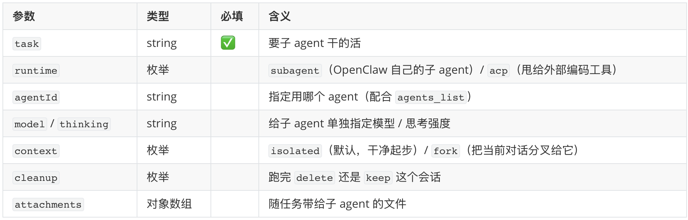

配套的 `subagents` 工具用来管理已派出去的子 agent：

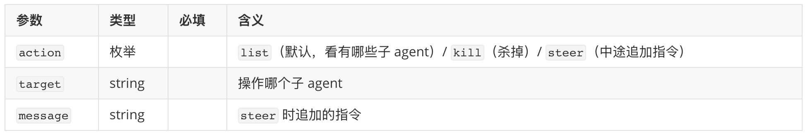

剩下几个都比较简单：

- `sessions_list`：列出自己派生的那些子会话，默认谁派生的归谁看，也可按 `agentId`、标签（`label`）、关键词（`search`）筛选，还能用 `limit`、`activeMinutes` 限定条数和最近多久活跃过。
- `sessions_history`：读某个会话的历史。`sessionKey` 指定读哪个会话，`limit` 控制取最近几条，`includeTools` 决定要不要把工具调用消息也带上。
- `sessions_send`：往某个会话发条消息。用 `sessionKey` / `label` / `agentId` 任选一种方式指定目标，`message` 是要发的内容，`timeoutSeconds` 设定回复的超时时间。
- `sessions_yield`：主动结束当前这一轮、把发言权让出去，自己先歇着，等某个子 agent 的结果作为下一条消息推回来时再被唤醒接着处理。
- `agents_list`：列出有哪些 agent 可用。
- `session_status`：轻量回读一个会话的状态，相当于 `/status` 命令，看它当前用的什么模型、用量、时间、可用时还有花费，以及挂在它名下的后台任务。两个参数都可选：`sessionKey` 指定看哪个会话（传 `current` 表示当前），`model` 还能临时修改这个会话的模型（传 `default` 恢复默认）。

我们挑最核心的 `sessions_spawn` 工具，详细看看它的几个设计点，这些我们在之前的文章中也学习过，这里复习一下。

最要紧的是**隔离**。每个子 agent 默认都在一个全新的会话里起步，有自己独立的上下文，有自己的记忆和对话历史，它不知道你和主 agent 之前聊过什么。可以将 `context` 设置成 `fork`，这样 OpenClaw 才会把当前这条对话分叉，复制一份给它当起点，不过要注意这样 token 消耗会明显增大，只有那种必须依赖当前对话才说得清的任务才建议开这个参数。

然后任务派出去之后，结果是**推送式**送回来的，不会阻塞主会话。调一次 `sessions_spawn` 会立刻返回一个 run id（这次任务的编号），子 agent 随后在后台慢慢干，干完会主动把结果推送回发起方所在的通道。所以派完任务就可以去忙别的，不用反复查 `sessions_list` 轮询结果。

还有一点，**默认情况下，子 agent 不能再派生自己的子 agent**，防止无限繁殖。`maxSpawnDepth` 默认是 1，只允许「主 → 子」这一层。把它调到 2，才解锁所谓的**编排者（orchestrator）模式**：主 agent 先派一个编排者子 agent，编排者再把活儿拆给一批 worker 并行干，最后结果逐层往上汇总（worker 报给编排者、编排者汇总后报给主 agent，每一层只看得见自己直接下级）。再往上调到 3、4、5 会逐层加深嵌套（上限是 5），只是层数越深越烧 token、链路越难排查，实际很少用得着。另外，OpenClaw 会按照深度分配工具权限，只有编排者那层才拿得到 `sessions_spawn` 这类调度工具，最底层的 worker 一律不给，从机制上就堵死了它继续往下套娃的可能。配额上也有几道兜底：单个 agent 同时最多挂 5 个活跃子 agent（`maxChildrenPerAgent`）、全局并发上限 8 条（`maxConcurrent`）、每个 spawn 默认 900 秒超时（`runTimeoutSeconds`），这些都集中在配置文件的 `agents.defaults.subagents` 这块下面：

```json5
{
  agents: {
    defaults: {
      subagents: {
        maxSpawnDepth: 2,        // 允许的嵌套层数，默认 1（不嵌套），上限 5
        maxChildrenPerAgent: 5,  // 单个 agent 同时最多挂几个活跃子 agent，默认 5
        maxConcurrent: 8,        // 全局并发上限，默认 8
        runTimeoutSeconds: 900,  // 每个 spawn 的默认超时（秒），0 表示不超时
        model: "openai/gpt-4.1-mini", // 子 agent 默认用的模型，不写就继承主 agent
        thinking: "low",         // 子 agent 默认思考强度，同样不写就继承
      },
    },
  },
}
```

> 这些是默认值，写在 `agents.defaults` 下对所有 agent 生效；想给某个 agent 单独设，挪到 `agents.list[].subagents` 下即可。

最后留意一下 `cleanup` 的语义，它表示子 agent 运行结束后这个会话留不留：默认 `keep` 留着，`delete` 则是在推送完结果后清理，这个清理其实是归档而非物理删除，会话记录会被改名留存，事后照样能翻出来看。另外，子 agent 干活期间开的浏览器标签和进程，在它跑完时也会被尽力关掉，不至于留一堆孤儿进程在后台。

> 所谓改名留存，就是给会话记录那个 `.jsonl` 文件名末尾加一个「原因 + 时间戳」后缀。归档原因一共三种：`.deleted.` 是被主动清理掉的（对应这里的 `cleanup: "delete"`）、`.reset.` 是会话被重置（对应用户手动执行 `/clear` 命令）、`.bak.` 是备份。

最后的最后，我们再看看 `runtime` 参数，小龙虾在派任务时不只能派给自己的子 agent，通过 `runtime: "acp"` 模式，小龙虾还能将任务丢给 **外部的编码工具**，比如 Claude Code、Gemini CLI、Codex、OpenCode 这些。不过严格说这已经不算内置工具了（得额外装官方插件 `@openclaw/acpx`），细节也自成体系，后面有机会再单开一篇吧。

## 工具治理

讲了这么多工具，接下来看看怎么管它们。道理很简单：不是每个 agent 都需要全量工具，一个只在群里闲聊的客服 agent，没必要能 `exec` 跑命令，更没必要能 `gateway` 改配置。OpenClaw 为此提供了几层控制，我们从最熟悉的说起。

最直接的两个配置是 `tools.allow` 和 `tools.deny`，前面几篇配 agent 时已经反复用过：`allow` 是白名单、`deny` 是黑名单，黑名单永远压过白名单，同一个工具两边都写了，最终结果就是禁用：

```json5
{
  tools: {
    allow: ["group:fs", "browser", "web_search"],
    deny: ["exec"],
  },
}
```

正如之前学过的，`allow` / `deny` 里不必一个个工具地列，可以用 `group:*` 简写批量指定。常用的组有：

| 组 | 包含的工具 |
| ---- | ------ |
| `group:runtime` | exec, process, code_execution |
| `group:fs` | read, write, edit, apply_patch |
| `group:web` | web_search, x_search, web_fetch |
| `group:ui` | browser, canvas |
| `group:sessions` | sessions_list, sessions_history, sessions_send, sessions_spawn, sessions_yield, subagents, session_status |
| `group:memory` | memory_search, memory_get |
| `group:automation` | cron, gateway |
| `group:messaging` | message |
| `group:nodes` | nodes |
| `group:agents` | agents_list |
| `group:media` | image, image_generate, music_generate, video_generate, tts |
| `group:openclaw` | 所有内置工具（不含插件工具） |

另外，光用 `allow` 从零开始一个个往上加，配起来还是有点累。所以 OpenClaw 还有一个 `tools.profile` 参数：它先按用途给你预设一套工具集合当起点，加工具用 `tools.alsoAllow`，砍工具用 `tools.deny`。内置的 profile 有四档：

- **`full`**：所有核心和插件工具，最宽的基线。
- **`coding`**：文件、运行时、web、会话、记忆等组，外加 `cron` 和 `image`/`image_generate`/`music_generate`/`video_generate`（注意：不含 `tts`，也不含 `browser`）。
- **`messaging`**：消息组加几个会话工具，通道 agent 专用。
- **`minimal`**：只有 `session_status`。

> 这四档是写死的，`profile` 是个固定枚举，暂时没法自己新增一个 profile，也改不了某档里到底含哪些工具。想要一套专属工具集就挑个最接近的 profile 当基线，再用 `alsoAllow` / `deny` 做加减。

## 小结

上一篇我们学习了前四类工具，命令执行、网络访问、文件读写、消息收发。这一篇接着把剩下的四类工具和工具治理讲完了，简单回顾一下：

1. **设备控制**：`nodes` 是台「设备遥控器」，一个工具横跨 Device（身份、准入）和 Node（能力清单）两层；`canvas` 配合它在某台设备的屏幕上「画东西」，两者底层都转成 `camera.snap`、`location.get`、`canvas.snapshot` 这类节点命令派给目标 node 执行。
2. **运行时管理**：`cron` 用 `schedule`（何时跑）+ `payload`（干什么）+ `delivery`（结果送哪）三块拼出定时任务；`gateway` 仅 owner 可用，能查看 / 修改 / 重启 / 自升级自己的运行时配置。
3. **媒体生成**：`image` 看图、`image_generate` 生成或修改图、`video_generate` 生成视频、`music_generate` 生成音乐、`tts` 把文字读成语音；用之前记得先配 provider，没配 provider 工具压根不出现，慢活儿（视频、音乐）还会丢后台异步跑。
4. **子 agent 编排**：`sessions_spawn` 把任务拆给隔离的分身并行干，完成后推送式把结果送回。
5. **工具治理**：用 `tools.allow` / `tools.deny` 圈定某个 agent 能用哪些工具，工具名还能用 `group:*` 简写批量指定；嫌从零配麻烦，就用 `tools.profile` 选一套预设基线，再拿 `alsoAllow` 往上加、`deny` 往下减。

现在小龙虾手里有哪些工具，哪个工具能用，哪个工具不能用，我们都清楚了。其中有两个工具细节多，坑也深，因此后面准备花两篇分别学习下：下一篇专讲 browser 浏览器工具，再下一篇讲 ACP 工具。敬请期待~

## 参考

* [OpenClaw 官方文档](https://docs.openclaw.ai/)
* [OpenClaw GitHub 仓库](https://github.com/openclaw/openclaw)
* [Tools and plugins 总览](https://docs.openclaw.ai/tools)
* [Exec 工具文档](https://docs.openclaw.ai/tools/exec)
* [Web search 文档](https://docs.openclaw.ai/tools/web)
* [Web Fetch 文档](https://docs.openclaw.ai/tools/web-fetch)
* [Browser 工具文档](https://docs.openclaw.ai/tools/browser)
* [Code Execution 文档](https://docs.openclaw.ai/tools/code-execution)
* [Apply Patch 文档](https://docs.openclaw.ai/tools/apply-patch)
* [Exec Approvals 文档](https://docs.openclaw.ai/tools/exec-approvals)
* [Agent Send 文档](https://docs.openclaw.ai/tools/agent-send)
* [Media 总览](https://docs.openclaw.ai/tools/media-overview)
* [Sub-agents 文档](https://docs.openclaw.ai/tools/subagents)
* [Skills 系统文档](https://docs.openclaw.ai/tools/skills)
