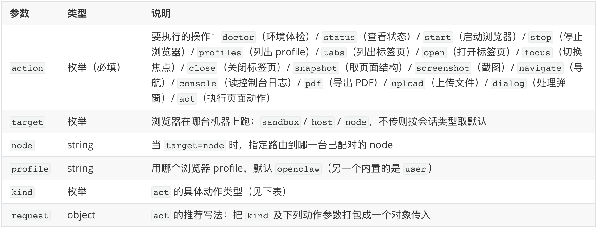
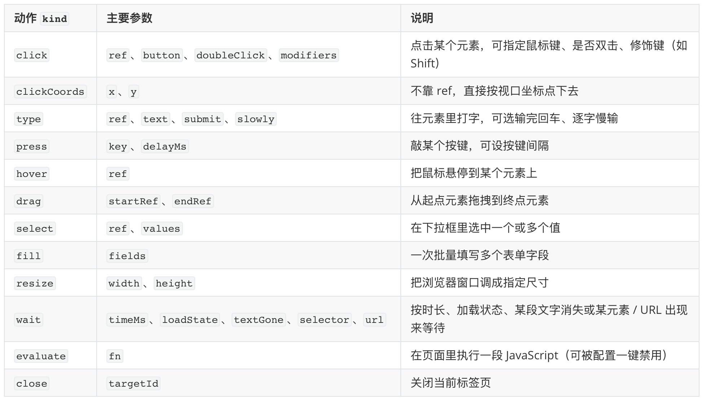
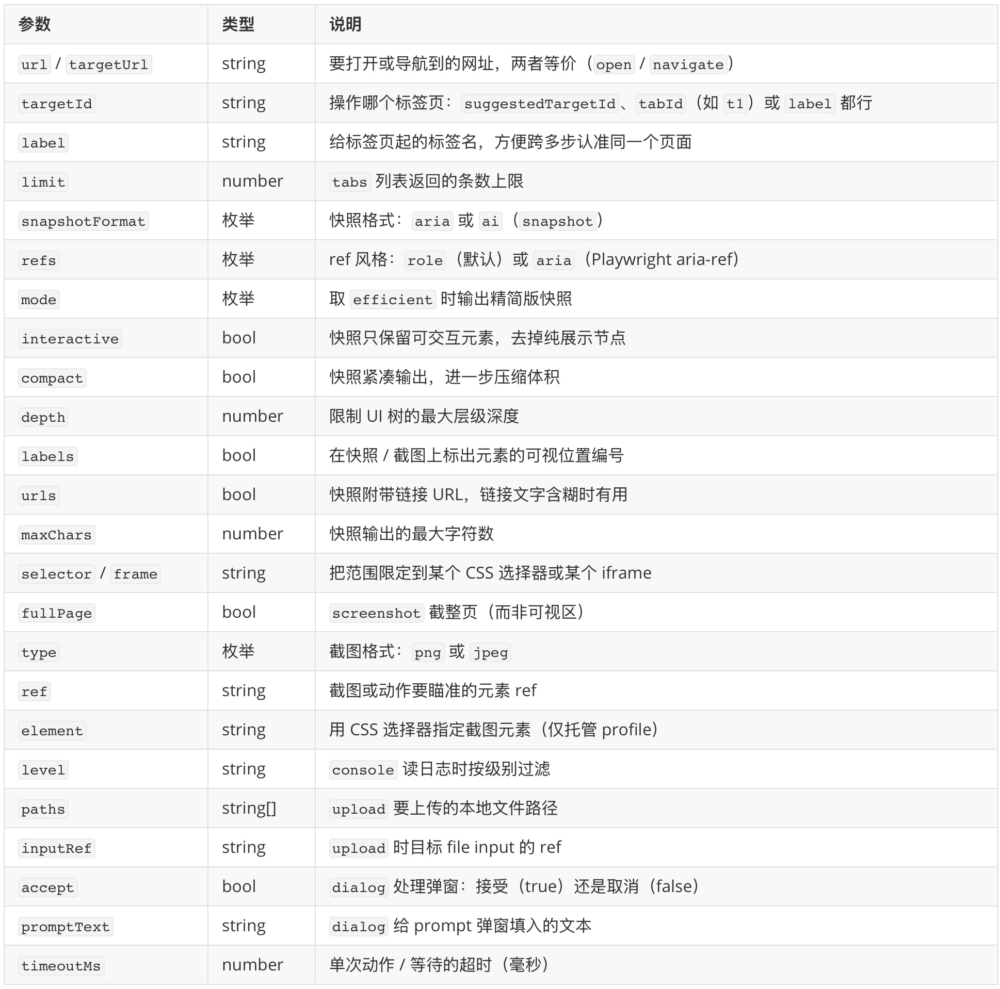

# 给小龙虾配个浏览器：学习 browser 工具

前两篇我们把 OpenClaw 的内置工具箱挨个过了一遍，末了还留了个尾巴：其中有两个工具细节比较多，打算各开一篇单独讲，一个是浏览器工具 `browser`，一个是 ACP。这一篇就先来学习 OpenClaw 的 `browser` 工具。

`browser` 会真的开起一个 Chromium 浏览器，像人一样去操作网页，解决的是前面 `web_search`、`x_search`、`web_fetch` 那套轻量工具搞不定的场景：要登录、要点按钮、内容得靠 JS 才渲染得出来的页面。它功能最强，配置也最讲究，光「浏览器跑在哪」就有 host、sandbox、node 三种情况，「用哪个浏览器」又分好几种 profile，内容实在不少，于是我们把这一个工具拆成上下两篇：这一篇先把环境铺好；下一篇再讲环境就绪之后，怎么真正驱动浏览器在页面上干活。

铺垫完了，先从它那张复杂的参数表看起。

## 工具参数定义

和前面的 `message`、`nodes` 一样，浏览器在 agent 侧也只暴露 `browser` 一个工具，靠不同的 `action` 分派不同的操作：



它的 `action` 覆盖了一整套浏览器生命周期，粗看可以分成三组：一组管「进程和环境」，比如体检环境的 `doctor`、起停浏览器的 `start` 和 `stop`；一组管「标签页」，列、开、切、关四件套；剩下一组才是真正在页面上干活的，导航、取结构、截图、执行动作，外加读日志、导出 PDF、传文件、处理弹窗。整理成一张图大致如下：


其中 `act` 本身又是个小分派器，要执行的动作由 `kind` 指定，对应参数（推荐打包进 `request` 对象）随 `kind` 不同而不同：



除这几个核心参数外，还有不少参数，基本都是配合某个具体动作用的，这里先扫一眼，后面遇到时再展开：



## 运行位置

和 `exec` 的 `host` 参数类似，`browser` 也有一个 `target` 参数，取值是 `host` / `sandbox` / `node` 三种。不传 `target` 时，OpenClaw 按会话类型挑默认值：沙箱会话默认 `sandbox`，非沙箱会话默认 `host`；要是有一台带可控浏览器的 node 连了进来，工具还可能自动路由到那台 node 上。三个取值里 `host` 最直白、也最常用，非沙箱会话默认就走它，你不用做任何配置，所以下面先从 `host` 讲起，再回头看 `sandbox` 和 `node`。

### 在 host 上运行浏览器

当 `target="host"` 时，就是在网关那台机器上启动或接管一个本地浏览器。但是启动哪个浏览器呢？这就要靠 `profile` 来确定了。OpenClaw 在 host 上内置了两个 profile：

* **`openclaw`（默认）**：一个专用的、隔离的 Chromium 实例；风险低，和你个人浏览器完全隔离。
* **`user`**：经 Chrome DevTools MCP 接管你真实的、已登录的 Chrome；风险高，在你的登录身份里操作。

先说 **`openclaw` profile**，它是专门给 agent 自动化用的隔离 profile，用的是一份独立的用户数据目录，不会碰你个人浏览器的 profile；另外，它会走独立的 CDP 端口，从 `18800–18899` 这个区间里分配，特意避开了常见的 `9222`，免得和你本地开发调试时起的浏览器冲突；窗口默认还带了一圈橙色外框（`#FF4500`），方便用户一眼就能分辨「这是 agent 在用的浏览器，不是我自己那个」；如果本机上找不到指定的浏览器时，OpenClaw 会按 Chrome → Brave → Edge → Chromium → Chrome Canary 的顺序自动挑一个能用的。

> 这里的 CDP 指的是 **Chrome DevTools Protocol（Chrome 开发者工具协议）**，是 Chromium 内核对外暴露的一套远程控制接口。你平时按 F12 打开的开发者工具，背后走的就是它。各种浏览器自动化框架（像 [Playwright](https://playwright.dev)）之所以能在外部进程里驱动浏览器导航、点击、截图，靠的都是连上这个协议端口。

另一个 **`user` profile** 的思路则不同：它不自己另起一个隔离实例，而是走官方 [Chrome DevTools MCP](https://github.com/ChromeDevTools/chrome-devtools-mcp) 的 attach 流程，直接接管你当下正开着的那个 Chrome，复用里面现成的标签页和登录态。它要解决的是「我已经在浏览器里登录好了某个网站，想让 agent 直接在我这个会话里接着操作」这类需求。方便归方便，代价是 agent 是货真价实地在你本人的身份下点点点。所以文档把它明确标为**更高风险**的路径，并且要求只在你本人就坐在电脑前、能亲手点掉那个 attach 授权弹窗的时候才用；它也只负责 attach，绝不会替你去启动浏览器。

> 有一个容易被忽略的限制：`user` 这类接管现有会话的 profile，能力其实比托管的 `openclaw` 要窄一截。它的动作只能基于 snapshot 的 ref 来（不支持 CSS selector），`click` 只认左键，`type` 也不支持 `slowly` 慢速输入；而批量动作、PDF 导出、下载拦截、读取 `responsebody` 这些进阶能力，都只有 `openclaw` 才有。

### 配置更多 profile

除了这两个内置的，你还能往配置里塞 `work`、`remote`、`brave` 等任意多个 profile，每个都能单独设端口、外框颜色、可执行文件路径、headless 与否。具体怎么加，有两种办法。

最直接的是往配置文件的 `browser.profiles` 底下加一段：

```json5
{
  browser: {
    profiles: {
      // 本地托管：指定用某个 Chrome、跑 headless、占一个自定义端口和外框色
      work: {
        cdpPort: 18801,
        color: "#0066CC",
        headless: true,
        executablePath: "/Applications/Google Chrome.app/Contents/MacOS/Google Chrome",
      },
      // 接管现有会话：attach 到本机已开着的 Brave
      brave: {
        driver: "existing-session",
        attachOnly: true,
        userDataDir: "~/Library/Application Support/BraveSoftware/Brave-Browser",
        color: "#FB542B",
      },
    },
  },
}
```

这里的几个字段稍微解释一下：

- `cdpPort` 给这个 profile 单占一个 CDP 端口（不指定会从 `18800–18899` 自动分配）；
- `color` 是窗口外框色，方便一眼区分用的是哪个 profile；
- `headless` 决定要不要无头跑，也就是不弹出可见窗口，在后台渲染，省资源，也适合没有图形界面的服务器，代价是你没法直接盯着页面看；
- `executablePath` 指到具体某个浏览器的可执行文件；
- `driver` 不写默认就是 `openclaw`，也就是由 OpenClaw 自己启动一个隔离的本地浏览器；写成 `existing-session` 则反过来，去 attach 一个你已经开着的浏览器，只接管、不启动。

> 你可能在旧资料或命令帮助里见过 `openclaw browser create-profile` / `delete-profile` / `reset-profile` 这几个命令，出于安全考虑，在新版本里它们已经用不了了，跑起来会直接报 `browser.request cannot mutate persistent browser profiles`。

配好之后，agent 调用时用 `profile="work"` 显式选它，命令行里则是 `--browser-profile work` 参数指定。

### 用 cdpUrl 接管远程浏览器

除了上面介绍的本地 profile 其实还有另一种 profile，它指向的不是本机要启动的浏览器，而是一个**已经在别处跑着的** Chromium，靠的是 `cdpUrl` 这个字段：

```json5
{
  browser: {
    profiles: {
      remote: { cdpUrl: "http://10.0.0.42:9222" },                  // 另一台机器上的 Chrome
      cloud:  { cdpUrl: "wss://xxx.browserless.io?token=YOUR_KEY" }, // 云端托管服务
    },
  },
}
```

`cdpUrl` 填的是一个 CDP 端点地址，也就是前面讲过的 Chrome DevTools Protocol。一旦配了它，OpenClaw 就不再自己启动浏览器，而是连过去接管那个现成的。地址有两种写法：`http(s)://host:port` 会先走标准的 `/json/version` 发现流程，找到真正的 WebSocket 调试地址再连；`ws(s)://...` 则是直连 CDP WebSocket。URL 里还能带认证（query token 或 HTTP Basic），OpenClaw 调 `/json/*` 接口和 WebSocket 握手时都会带上。

最省事的远程浏览器是托管服务，比如 [Browserless](https://browserless.io)、[Browserbase](https://www.browserbase.com)，它们在云端跑 headless Chromium、还自带验证码处理，感兴趣的同学可以尝试一下。

### 登录态怎么准备

host 上的这些 profile，多半都要和登录态打交道。既然 `browser` 能像真人一样操作网页，一个很自然的念头是：让它自己登录不就完事了？官方的建议恰恰相反：**碰到要登录的网站，最好你自己在浏览器里手动登一次，千万别把账号密码丢给模型让它替你填**。原因有两条，一是自动化的登录流程极容易触发网站的反爬风控，轻则弹验证码，重则直接把账号给锁了；二是凭据本就不该在对话里来回流转。你手动登一次之后，登录态就留在了那个 profile 的数据目录里，之后 agent 在这个已登录的会话里接着干活，不用每次都重来，这也正是 `openclaw` 这类独立 profile 的价值所在。

### 在沙箱运行浏览器

我们在之前讲沙箱那篇里说过，沙箱本质上是个 Docker 容器，`exec` 跑命令、读写文件都在里头。当时还提到过两个镜像：默认的 `openclaw-sandbox:bookworm-slim`（只装了 `bash`、`git`、`python3`、`ripgrep` 这几样基础工具）和功能更全的扩展镜像 `openclaw-sandbox-common:bookworm-slim`（额外带上 `nodejs`、`golang` 等）。

不过，这两个镜像里都没装浏览器，所以想在沙箱里运行浏览器，OpenClaw 专门提供了第三个镜像 `openclaw-sandbox-browser:bookworm-slim`，把 Chromium 内置了进去。

这个镜像本身不复杂，打开 `scripts/docker/sandbox/Dockerfile.browser` 看一眼，去掉缓存挂载、镜像摘要这些细节，骨架就这么几行：

```dockerfile
FROM debian:bookworm-slim

RUN apt-get install -y --no-install-recommends \
    chromium \
    xvfb x11vnc novnc websockify socat \
    fonts-liberation fonts-noto-cjk fonts-noto-color-emoji \
    bash ca-certificates curl git jq python3

COPY scripts/sandbox-browser-entrypoint.sh /usr/local/bin/openclaw-sandbox-browser
RUN useradd --create-home --shell /bin/bash sandbox
USER sandbox
EXPOSE 9222 5900 6080
CMD ["openclaw-sandbox-browser"]
```

除了浏览器本体 `chromium`，剩下这堆包大致分三块：

* **虚拟显示栈**：`xvfb`（X Virtual Framebuffer）凭空造一块没有真实显示器的虚拟屏幕，让 Chromium 以为自己有屏可画；`x11vnc` 把这块屏幕通过 VNC 协议暴露出来；`novnc` 配上 `websockify`，再把 VNC 画面转成网页能直接看的形式（noVNC 是个纯网页的 VNC 客户端，websockify 负责把 VNC 的 TCP 流桥接成 WebSocket）。这三层叠起来，你就能直接用浏览器实时看到沙箱里这个 Chromium 的画面。
* **字体**：`fonts-noto-cjk`、`fonts-noto-color-emoji` 这些，保证中文页面和 emoji 不至于渲染成一片方块。
* **`端口转发`**：使用 `socat` 把容器里的 CDP 端口转发出去，并按 CIDR 白名单限制访问来源（具体怎么转发，下面讲 entrypoint 时再细说）。

镜像最后建了个非 root 的 `sandbox` 用户来跑浏览器，对外开放 `9222`（CDP）、`5900`（VNC）、`6080`（noVNC）三个端口，容器启动时执行 entrypoint 脚本，核心代码如下：

```bash
# 行为全由环境变量驱动，端口、超时等先校验合法性
CDP_PORT="${OPENCLAW_BROWSER_CDP_PORT:-9222}"
HEADLESS="${OPENCLAW_BROWSER_HEADLESS:-0}"
# ...VNC_PORT / CDP_SOURCE_RANGE / AUTO_START_TIMEOUT_MS 等同理
validate_uint "CDP_PORT" "$CDP_PORT" 1 65535

# 容器退出（含被 kill）时统一回收所有子进程，不留孤儿
trap 'cleanup "$?"' EXIT
trap 'cleanup 130' INT
trap 'cleanup 143' TERM

# 1. 起一块 1280x800 的虚拟屏幕
Xvfb :1 -screen 0 1280x800x24 &

# 2. 拉起 Chromium，CDP 只监听 127.0.0.1（CHROME_CDP_PORT 取 CDP_PORT + 1）
chromium --remote-debugging-address=127.0.0.1 \
         --remote-debugging-port="$CHROME_CDP_PORT" \
         --disable-dev-shm-usage --disable-gpu --no-zygote ... about:blank &

# 3. 轮询 /json/version 等 CDP 就绪（最多 AUTO_START_TIMEOUT_MS，默认 12 秒；超时或 Chromium 退出就报错）
while ...; do curl -fsS "http://127.0.0.1:$CHROME_CDP_PORT/json/version" && break; sleep 0.2; done

# 4. 只有设了 CDP_SOURCE_RANGE 才起 socat：把边缘端口转发进去、并按 CIDR 放行来源
[ -n "$CDP_SOURCE_RANGE" ] && \
  socat "TCP-LISTEN:$CDP_PORT,fork,range=$CDP_SOURCE_RANGE" "TCP:127.0.0.1:$CHROME_CDP_PORT" &

# 5. 非 headless 时，起带随机密码、只绑 localhost 的 VNC + noVNC
x11vnc -display :1 -rfbport "$VNC_PORT" -rfbauth "$PASSWD" -localhost ... &
websockify --web /usr/share/novnc/ "$NOVNC_PORT" "localhost:$VNC_PORT" &

# 任一子进程退出就触发上面的 cleanup
wait -n
```

别看就这么几行，里头有不少细节值得注意：

* **行为全由环境变量驱动**：`OPENCLAW_BROWSER_CDP_PORT`、`...HEADLESS`、`...CDP_SOURCE_RANGE`、`...AUTO_START_TIMEOUT_MS` 这些，正好和后面 `agents.defaults.sandbox.browser` 里那几个配置项一一对应；脚本开头还用 `validate_uint` 把端口、超时挨个校验，非法值直接报错退出。
* **容器专用启动参数**：第 2 步为了让 Chromium 在容器里正常启动，加了不少适配的参数，比如 `--disable-dev-shm-usage` 避开容器里只有 64MB 一满就崩的 /dev/shm 目录、`--disable-gpu` 关掉容器里不存在的 GPU 加速、`--no-zygote` 关掉靠 fork 预热进程的 zygote 模型，免得撞上容器的 syscall 限制等。
* **CDP 并没有直接对外**：Chromium 的调试端口只绑在 `127.0.0.1` 上（实际端口是配置值 +1），真正暴露到容器边缘的那个端口由 `socat` 转发，而且只放行 `CDP_SOURCE_RANGE`（就是配置里的 `cdpSourceRange`）指定的网段；这个网段要是没设，`socat` 索性不启动，外面根本连不进来。
* **CDP 就绪轮询**：第 3 步死等 `/json/version`，默认最多 `autoStartTimeoutMs`（12 秒），超时或 Chromium 中途退出就直接报错。
* **noVNC 带随机密码**：只有 `enableNoVnc` 开着、且非 headless 时才起 VNC 加 noVNC，而且每次启动都现生成一个随机密码、VNC 只绑 localhost，不至于裸奔。
* **退出时清理干净**：开头挂的那几个 `trap`，会在容器退出（或被 `kill`）时把 Xvfb、Chromium、socat、x11vnc 一并清掉，不留孤儿；结尾的 `wait -n` 则盯着所有子进程，任一个挂了就触发清理。

讲完了原理，我们再看下这个镜像怎么使用。OpenClaw 内置了一个构建脚本，下载源码后运行它：

```
$ ./scripts/sandbox-browser-setup.sh
```

就能得到上面那个 `openclaw-sandbox-browser:bookworm-slim` 镜像。然后在配置文件里将沙箱浏览器打开（默认是关的），并配上这个镜像，相关配置都集中在 `agents.defaults.sandbox.browser` 下面：

```json5
{
  agents: {
    defaults: {
      sandbox: {
        browser: {
          enabled: false,        // 默认关，要在沙箱里用浏览器得先打开
          image: "openclaw-sandbox-browser:bookworm-slim", // 内置 Chromium 的专用镜像
          network: "openclaw-sandbox-browser",             // 专用 Docker 网络
          cdpPort: 9222,
          cdpSourceRange: "172.21.0.1/32", // 只放行这个网段访问 CDP 的 CIDR 白名单
          autoStart: true,           // 工具要用时自动把这个容器拉起来
          autoStartTimeoutMs: 12000, // 等 CDP 就绪的超时（毫秒）
          allowHostControl: false,   // 沙箱里默认不许去碰宿主机的浏览器
          enableNoVnc: true,         // 开 noVNC，可以在浏览器里围观沙箱里这个浏览器
          vncPort: 5900,
          noVncPort: 6080,
        },
      },
    },
  },
}
```

这里也有几处值得留意：它和宿主机的 `browser.enabled` 互不相干，是沙箱自己那一套独立开关，开沙箱浏览器并不需要你把 host 上的浏览器插件也打开；另外浏览器运行在这个镜像起的专用容器里，挂在专用的 `openclaw-sandbox-browser` Docker 网络上，和那个跑命令的沙箱容器是完全隔离的。如果把参数 `enableNoVnc` 打开，OpenClaw 还会生成一个 noVNC 网页地址注入到 agent 的 system prompt。这个地址带一个一次性、短时效的 token（默认 60 秒过期），每次都不一样、没法提前收藏，所以才需要 agent 在你想看时把当前有效的那个递给你；用浏览器打开它，就能实时看到沙箱里这个 Chromium 正在点什么，调试起来很直观。

还有一个和风控有关的问题值得一提。**沙箱会话比直接在宿主机上跑更容易被判定成机器人**，所以像 X（推特）这种风控严的站点，官方反而建议用宿主机上的 host 浏览器去操作，而不是图隔离把它硬塞进沙箱。如果你的 agent 默认在沙箱里，又确实想让它操作 host 浏览器，就得回到上面那个 `allowHostControl=true` 开关，再在调用时显式带上 `--target host`。说到底，浏览器自动化里最像人的那部分动作（登录、过验证），目前还是交给真人最稳妥。

### 在 node 上运行浏览器

当 `target="node"` 时，OpenClaw 将把活儿派到一台连进来的设备上，它的关键在于：node 自己也跑着一套和网关一模一样的浏览器控制服务。网关并不直接去连那台机器的 CDP，而是通过 node 链路，把 `browser` 的每个动作代理过去，交给 node 本地的控制服务执行。所以能用哪些 profile、浏览器具体装在哪、怎么启动，全看那台 node 自己的 `browser.profiles` 配置，跟网关无关。

node 上的浏览器代理默认就开着，也是远程网关最常走的路：网关那台机器上没装浏览器不要紧，让有浏览器的 node（比如你那台日常用的 Mac、或者一部手机）替它跑就行，基本零配置。要调它的话，得分两头来配。node 那台机器用 `nodeHost.browserProxy` 决定自己对外暴露什么：

```json5
{
  nodeHost: {
    browserProxy: {
      enabled: true,               // 默认 true；设 false 就不再对外暴露这台 node 的浏览器
      allowProfiles: ["openclaw"], // 可选：只放行这几个 profile，留空则它全部 profile 都可被远程指定
    },
  },
}
```

网关那台机器则用 `gateway.nodes.browser` 决定要不要路由、路由到谁：

```json5
{
  gateway: {
    nodes: {
      browser: {
        mode: "auto",   // 路由策略：auto 自动选唯一一台浏览器 node（默认）/ manual 要求显式传 node / off 彻底关掉
        node: "my-mac", // 可选：钉死只用某一台 node，不写就按 mode 自动挑
      },
    },
  },
}
```

## 小结

浏览器是 OpenClaw 工具箱里能力最强、配置也最讲究的一个。这一篇我们先把它的运行环境从头铺了一遍：

1. **一个工具一套参数**：`browser` 只暴露一个工具，靠 `action` 分派出一整套动作，按进程环境、标签页、页面操作分成三拨，`act` 底下又用 `kind` 二次分派，剩下那些参数都是配合具体动作用的。
2. **先定运行位置**：`target` 的 `host` / `sandbox` / `node` 决定浏览器在哪台机器上跑，`host` 直接在网关本机起浏览器；`sandbox` 用内置 Chromium 的专用镜像；`node` 则把活儿代理给连进来的设备。
3. **host 上再挑 profile**：当你在 host 上运行浏览器时，还可以通过 `profile` 选择用哪个浏览器；`openclaw` 是隔离专用的 profile，独立数据目录和端口，`user` 则是接管你真实已登录的 Chrome 实例；除这两个内置的，还能往配置里塞更多 profile，甚至用 `cdpUrl` 接管远程或云端浏览器。
4. **登录态自己准备**：碰到要登录的网站，宁可自己在浏览器里手动登一次、把登录态留在 profile 的数据目录里，也别把账号密码交给模型去填；风控严的站点更推荐用 host 浏览器，而不是图隔离硬塞进沙箱。

至此，浏览器环境已经准备好了，下一篇我们就让浏览器真正动起来，看看 agent 是怎么像人一样在页面上点点点的。敬请期待~

## 参考

* [OpenClaw 官方文档](https://docs.openclaw.ai/)
* [OpenClaw GitHub 仓库](https://github.com/openclaw/openclaw)
* [Browser 工具文档](https://docs.openclaw.ai/tools/browser)
* [Browser 控制 API 文档](https://docs.openclaw.ai/tools/browser-control)
* [Browser 登录场景文档](https://docs.openclaw.ai/tools/browser-login)
* [Tools and plugins 总览](https://docs.openclaw.ai/tools)
* [Chrome DevTools MCP](https://github.com/ChromeDevTools/chrome-devtools-mcp)
* [Playwright](https://playwright.dev)
* [Browserless](https://browserless.io)
* [Browserbase](https://www.browserbase.com)
