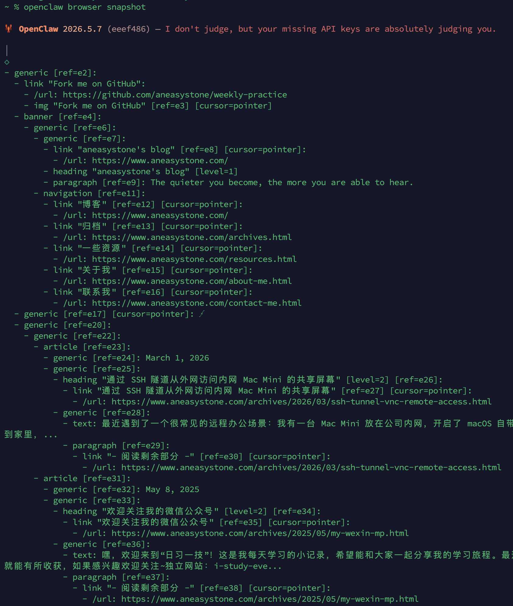
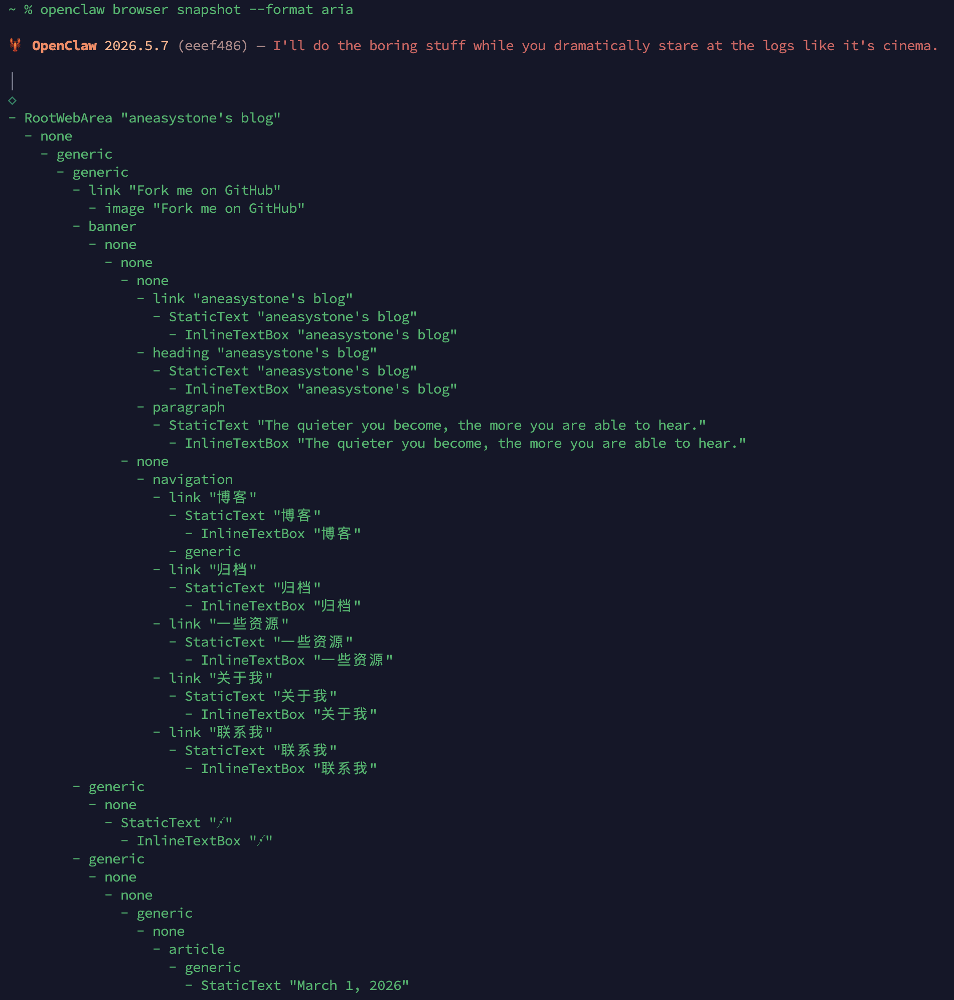
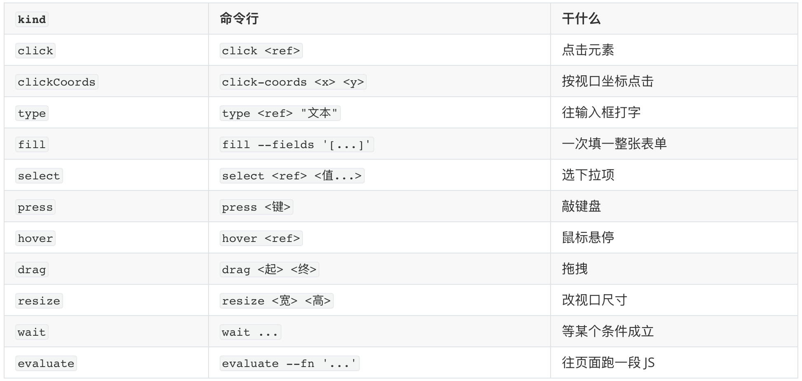
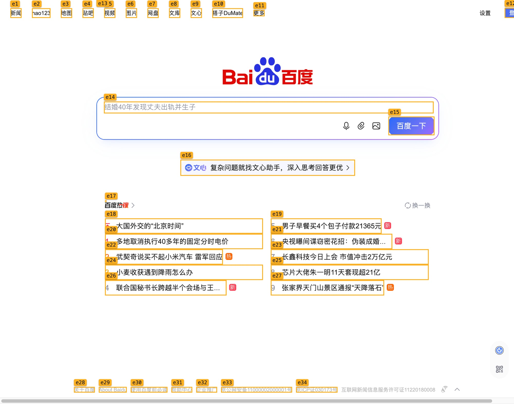

# 给小龙虾配个浏览器：学习 browser 工具（二）

上一篇我们把 `browser` 工具的运行环境从头捋了一遍：首先学习了它的参数定义，然后使用 host / sandbox / node 确定浏览器运行在哪里，以及使用 profile 确定运行哪个浏览器。环境备齐，这一篇书接上文，来看 agent 怎么驱动浏览器在页面上点点点，以及这套动作背后的原理。

## 标签页管理

`browser` 一次只在一个标签页上干活，所以为了保证后续的动作没问题，我们首先要认准操作哪个标签页。我们可以使用 `openclaw browser <动作>` 命令行来管理它，开新标签页用 `open`，网址作参数，再用 `--label` 顺手贴个标签：

```
$ openclaw browser open https://www.aneasystone.com --label blog

opened: https://www.aneasystone.com/
tab: t1
label: blog
id: 7E73979D64CBF48058818D78D50FB94B
```

该命令返回了几个参数：`tab` 是形如 `t1` 的稳定 `tabId`，`label` 是我们自己起的 `blog` 标签，`id` 则是 CDP 协议的原始 `targetId`。这几个参数都可以作为后续操作这个标签页时的标识。比如之后想再操作它，用 `focus` 把它切到前台就行，`tabId`、`label`、`targetId` 这三种都认，下面三条指向的都是同一个页面：

```
$ openclaw browser focus t1          # 用 tabId
$ openclaw browser focus blog        # 用 label
$ openclaw browser focus 7E73979D    # 用 targetId（前缀也认）
```

顺带分清一个常被搞混的点：`open` 每次都新开一个标签页，而 `navigate` 是让当前标签页原地跳到另一个网址，所以常见用法是先 `focus` 选中、再 `navigate` 到某个网址；也可以加上可选的 `--target-id` 直接跳转：

```
$ openclaw browser navigate https://www.aneasystone.com/about-me.html --target-id blog
```

再开一个不带 label 的，然后用 `tabs` 列出所有的标签页：

```
$ openclaw browser open https://www.baidu.com

opened: https://www.baidu.com/
tab: t2
id: 9B0D7E3F1A2C4856E7F0A1B2C3D4E5F6

$ openclaw browser tabs

1. aneasystone's blog [t1 label:blog]
   https://www.aneasystone.com/
   id: 7E73979D64CBF48058818D78D50FB94B
2. 百度一下，你就知道 [t2]
   https://www.baidu.com/
   id: 9B0D7E3F1A2C4856E7F0A1B2C3D4E5F6
```

我们还可以加一个 `--json` 参数，看到完整的数据结构：

```
$ openclaw browser --json tabs

{
  "tabs": [
    {
      "targetId": "7E73979D64CBF48058818D78D50FB94B",
      "title": "aneasystone's blog",
      "url": "https://www.aneasystone.com/",
      "wsUrl": "ws://127.0.0.1:18800/devtools/page/7E73979D64CBF48058818D78D50FB94B",
      "type": "page",
      "suggestedTargetId": "blog",
      "tabId": "t1",
      "label": "blog"
    }
  ]
}
```

收尾要关掉标签页就用 `close` 参数：

```
$ openclaw browser close blog

closed tab
```

如果忘记关也没有关系，OpenClaw 给主 agent 的浏览器会话配了一套自动清理机制：空闲超过一定时间（默认 120 分钟）的标签页会被回收，每个会话还有个标签页数量上限（默认 8 个），后台每隔几分钟扫一遍；子 agent、cron、ACP 这类任务跑完时，也会顺手把自己开的标签页关掉，不至于在后台留一堆的孤儿窗口。

## SSRF 防护

刚才用 `open` 和 `navigate` 打开网址，看着什么链接都能打开，其实不然。之前学习工具箱时就提到过，`web_fetch` 自带一套 SSRF 防护：凡是能由外部输入决定去访问哪个地址的工具，都得防着被人诱导去访问内网。浏览器更是如此，它能被导航到任意 URL，风险敞口只大不小，所以 OpenClaw 也给它单配了一套**独立的、默认 fail-closed 的 SSRF 防护**，下面就稍微展开看看。

OpenClaw 会在导航和新开标签页之前先过一道 SSRF 检查，等浏览器真正解析出最终那个 `http(s)` 地址之后，再复查一遍。这一前一后是有讲究的，专门防 30x 重定向绕过：链接乍看是个干净的公网地址，轻松过了第一关，跳转之后才露出内网地址，正好被第二道复查逮住。默认拦在门外的，包括私网地址、本机环回、link-local，以及云厂商的元数据地址。

那真要放行某个内网地址呢？最稳妥的做法是只给信得过的那几个域名开放，把它们加进 `browser.ssrfPolicy` 的白名单。比如想让 agent 访问内网的 `grafana.corp.example`，配置写在 `~/.openclaw/openclaw.json` 里：

```json5
{
  browser: {
    ssrfPolicy: {
      // 精确匹配：列出的域名原样放行
      allowedHostnames: ["grafana.corp.example"],
      // 通配匹配：* 能匹配子域，一条顶一片
      hostnameAllowlist: ["*.corp.example"],
    },
  },
}
```

这两个参数的差别只在匹配方式：`allowedHostnames` 按完整域名精确比对，`hostnameAllowlist` 支持 `*` 通配符。命中白名单的域名，即便最终解析到私网地址，也照样放行。

要是内网地址比较多、一个个域名往白名单里加嫌麻烦，也可以用一个开关把私网整个放开：

```json5
{
  browser: {
    ssrfPolicy: {
      dangerouslyAllowPrivateNetwork: true,
    },
  },
}
```

不过光看名字里那个 `dangerously` 就该警觉：它会让浏览器对所有私网地址都不再拦截，所以默认是关着的，只有在你确实信任、也评审过的私网环境里才建议打开。

## 页面操作

标签页开好了，接下来就是在这个页面上干活。`browser` 在页面这一层的动作不少，但总体来说无非是看、做、核对三件事：先用 `snapshot` 看清页面上有什么，再用 `act` 系列动手操作，需要时用 `screenshot` 截图核对；除此之外还有几个偏辅助的动作。下面一类一类来看。

### 看清页面：snapshot

OpenClaw 在看清页面这块做得比较巧妙，它不会把页面的原始 HTML/DOM 一股脑塞给模型。原因很简单，网页源码又长又乱，满屏 `<div>` 套 `<div>`、一堆样式类名，模型读起来既理不清结构，又白白烧掉一大把 token。

那它给模型看什么呢？是浏览器的**无障碍树（accessibility tree）**。这名字听着陌生，其实天天都有人在用：盲人靠屏幕阅读器读网页，背后就是这棵树。它不管页面长什么样，只按语义把内容归成按钮、输入框、链接、标题这些角色，每个角色再配一个看得懂的名字（被称为 accessible name，一般就是按钮上的文字、输入框旁边的 label 等），父子层级用缩进表示。说白了，它把一个给人看的花哨页面，压缩成了一份给机器读的、干净的结构清单。

OpenClaw 又在这棵树上加了道工序：给每个能点、能填的节点编一个稳定的编号，也就是 `ref`。这么一来，模型根本不用管某个元素长什么样、藏在第几层，认准要操作哪个 `ref` 就行。快照的结果大致长这样：

```yaml
- button "Save" [ref=e1]
- link "Docs" [ref=e2]:
  - /url: https://docs.openclaw.ai/
- generic "Clickable Card" [ref=e3] [cursor=pointer]
- textbox "Email" [ref=e4]
```

每一行就是「角色 + 名称 + `[ref=eN]`」：链接底下会挂一个 `/url:` 标出它的目标地址，可点击的非标准元素则注明 `[cursor=pointer]`（表示它虽然不是标准的按钮或链接，但点得动）。碰到 iframe，则嵌套着往里展开：

```yaml
- Iframe "Child" [ref=e1]
  - button "Inside" [ref=e2]
```

模型拿到这棵树，想点「Save」，只回一句 `act` 带上 `ref=e1` 就行，完全不用关心它在 DOM 里到底是第几个 `<button>`、外面套了几层 `div`。这背后是 OpenClaw 的一个刻意设计：点击、输入这类操作只认 `ref`，不收 CSS selector。原因是 selector 出了名的脆，页面结构稍微一改，像 `.btn-primary > span:nth-child(2)` 这种立马失效；换成语义稳定的 `ref`，多步操作才不容易因为页面的一点微调就整条链路崩掉。

> 你可能注意到 `browser` 工具里有个 `selector` 参数，但它管的不是「点哪个元素」，而是另外几件事：给快照划定范围（`snapshot` 时只取某个子树或某个 iframe）、截取单个元素（`screenshot --element`）、或者等某个元素出现（`wait`）。

知道快照长什么样，命令行里 `snapshot` 一下就能看到真东西。还是上一节那个博客标签页，输出就是上面那种带 `ref` 的缩进树：



上面这份输出走的是 `snapshot` 默认的 `ai` 格式。其实 `snapshot` 支持两种格式，用 `format` 参数切换：

* **`ai`（默认）**：给模型优化过的形态，就是上面那种缩进表示层级、每个可交互节点都带 `ref` 的文本树。简洁好读，模型能直接挑出 `ref` 来操作，日常驱动页面用它就够了。
* **`aria`**：用 `--format aria` 切过去，吐出的是更原始的无障碍树节点，结构上更贴近浏览器内部，主要拿来排查页面结构，refs 不一定能直接拿去点。



说到底，`aria` 就是那棵原始的无障碍树，`ai` 则是 OpenClaw 在它基础上加工出来的好读版本（编上 `ref`、补上链接和可点击提示）。

默认情况下 `ai` 快照不会主动精简，复杂页面拉出来的树有时相当庞大，所以 `snapshot` 还留了几个参数专门给它瘦身。最基础的是 `maxChars`（默认 4 万）这个字符上限兜底，超出就自动截断；如果还是嫌它啰嗦的话，可以加 `compact` 拉一份精简版，把没名字的纯容器节点、以及底下不含任何可操作元素的空枝条都剪掉，只留有内容的骨架，或者用 `interactive=true` 只留按钮、链接、输入框这类能交互的节点，把纯展示用的文字一股脑滤掉；页面层级套得太深时，还能用 `depth` 限制往下钻几层。

那 `ref` 又是怎么映射回真实元素的呢？这取决于 `refs` 参数选的风格。OpenClaw 支持两种 `ref` 风格：默认的 `role` 风格里，`e1`、`e2` 这些编号背后其实存着「角色 + 名称 + 第几个」这组信息，OpenClaw 收到 `ref=e1`，就把它翻译成 Playwright 的 `getByRole("button", { name: "Save" })` 去重新定位；另一种 `aria` 风格走的是 Playwright 原生的 aria-ref，编号形如 `ax1`，OpenClaw 会通过 CDP 给对应的 DOM 节点打上一个 `data-openclaw-browser-ref` 标记属性，靠这个属性精确命中。

不管哪种风格，都要注意的是，`ref` 只对最近一次快照有效。每取一次新快照，旧的那张 `ref` 表就被整张覆盖。所以页面一旦变了，如果没有重新 `snapshot` 就拿着老 `ref` 去操作，多半会遇到 `Unknown ref "e1". Run a new snapshot and use a ref from that snapshot` 这样的报错，这时就得老老实实重拍一张了。

### 操作页面：act

看清了页面结构，接下来就能用 `act` 动手操作页面了。它本身是个分派器，要执行哪种动作由 `kind` 参数决定；命令行里把这些 `kind` 拆成了一个个独立的子命令，对应关系大致如下：



我们挑几个重点的看下。

#### **`click`**

最常见的就是拿 `ref` 点一下，比如点击上面快照里那个「归档」链接：

```
$ openclaw browser click e13

clicked ref e13
```

这个命令默认是左键单击，除此之外，还可以实现 `--double` 双击、`--button right` 唤出右键菜单、`--modifiers Meta`（或 `Control`）按住某个键再点击，能在新标签页打开链接。另外，如果某个要点击的元素快照不出来或点不到（比如被遮挡、藏在 shadow DOM 里、和其他元素的 z-index 冲突），我们还可以使用 `clickCoords` 这个参数，它不按 `ref` 来点击，而是直接按视口坐标 `click-coords 120 340` 点击。

这里还有一个挺关键的细节：`click` 点击后不会立刻返回，而是检查一下页面有没有因为这次点击发生跳转，一旦跳了，就把新地址带回结果里，并对这个新地址补一道 SSRF 复查。

#### **`type` / `fill`**

`type` 往输入框里打字，最常见就是 `type <ref> "文本"`。它还有两个开关：`--slowly` 让它放慢、一个字一个字地敲，装得像真人在打字，可以绕过那些根据输入速度判人机的站点；`--submit` 则在打完之后顺手回车，省得再单独按一下 Enter：

```
$ openclaw browser type e4 "openclaw" --submit --slowly
```

有时候要一次填一整张表单，一个个 `type` 就太慢了，可以用 `fill` 把多个字段打包进一次调用：

```
$ openclaw browser fill --fields '[{"ref":"e4","value":"Ada"},{"ref":"e5","value":"ada@example.com"},{"ref":"e6","type":"checkbox","value":true}]'
```

`fill` 一次能填一整批字段，每个字段可以带个 `type` 说明控件类型：默认 `text` 直接填值，标成 `checkbox` 或 `radio` 就改成勾选（值传 `true` 勾上、`false` 取消）。

顺带说说 `type` 和 `fill` 底下的实现，它们其实默认调的都是 Playwright 的 `fill()` 方法，把值一次性整体填到输入框里；而 `type --slowly` 使用的是 Playwright 真正逐字符的 `type()` 方法（每个字停 75ms）；`fill` 碰到 checkbox、radio 则走的是 `setChecked` 方法。

#### **`select`**

这个命令用于选择下拉框里的选项，一次选一个或多个都行：

```
$ openclaw browser select e7 cn

selected cn
```

它底层走 Playwright 的 `selectOption` 方法，多选下拉一次能选好几项（`select e7 a b c` 就是把 a、b、c 一起选上）。传进去的字符串会同时匹配 `<option>` 的 `value` 和显示文字，填哪个都行。

那怎么知道一个下拉里有哪些选项可选？`snapshot` 里下拉通常会把 `option` 一项项列出来，名字就是它的显示文字，照着填即可：

```
$ openclaw browser snapshot

- search [ref=e45]:
  - textbox "请输入关键字" [ref=e46]
  - combobox [ref=e47]:
    - option "所有" [selected]
    - option "中国"
    - option "美国"
    - option "日本"
  - button "筛选" [ref=e48] [cursor=pointer]
```

要是想拿到确切的 `value` 值（比如显示的文字有重复时），可以用 `evaluate` 针对 DOM 执行一段 JS 即可：

```
$ openclaw browser evaluate --ref e47 --fn '(el) => [...el.options].map(o => ({ value: o.value, label: o.text }))'

[
  {
    "value":"cn",
    "label":"中国"
  },
  {
    "value":"us",
    "label":"美国"
  }
]
```

#### **`press`**

直接敲键盘，比如回车、Tab、方向键、Esc 这些都行，常用来在没有明确按钮时触发提交或翻页：

```
$ openclaw browser press Enter

pressed Enter
```

它直接调 Playwright 的 `keyboard.press` 方法，除了单个键，也能按组合键，比如 `press Control+A` 全选、`press Shift+Tab` 反着跳焦点。另外 `press` 和 `click` 一样会做导航检测：按 Enter 很可能提交表单、触发跳转，OpenClaw 会盯着这次跳转，照样走一遍前面那套 SSRF 复查。

#### **`hover`**

把鼠标悬到某个元素上，常用来触发那种鼠标悬停才显示的下拉菜单、提示气泡：

```
$ openclaw browser hover e5

hovered ref e5
```

底层是 Playwright 的 `locator.hover`，只改 UI 状态、不触发导航。它最常见的搭配是先 `hover` 再 `snapshot`：很多菜单是悬停才渲染出来的，先让它冒出来、再拍一张快照，才能拿到菜单项的 `ref` 去点。

#### **`drag`**

从一个 `ref` 拖到另一个 `ref`，做拖拽排序、移动滑块这类操作：

```
$ openclaw browser drag e3 e8

dragged e3 → e8
```

它接收起止两个 `ref`，首先自动算好坐标，底层调 Playwright 的 `dragTo` 方法，然后模拟按下、移动、松开这一整套动作。拖拽排序、移动滑块、把文件拖到上传区这类交互都可以靠它来实现。

#### **`resize`**

改视口尺寸，用于测试页面在不同屏幕宽度下的响应式表现：

```
$ openclaw browser resize 1280 720

resized to 1280x720
```

底层是 Playwright 的 `setViewportSize` 方法，改完视口浏览器会重新布局，并触发 CSS 媒体查询，所以拿它配合多次 `snapshot` / `screenshot`，就能看页面在手机、平板、桌面不同宽度下分别长什么样。

#### **`wait`**

多步操作里最容易翻车的，就是上一步点完、页面还没加载好，就急着点下一步，结果扑空。`browser` 的 `wait` 命令就是用来避免这种情况的，它能等到某个**具体状态**再往下走：等某段文字出现（或用 `--text-gone` 等它消失）、等 URL 匹配某个 glob、等加载状态（`load` / `domcontentloaded` / `networkidle`）、等某个 CSS 元素可见、甚至等一段 JS 谓词为真。每个条件对应一个参数，可以单用，也能叠着用：

```
$ openclaw browser wait --text "上传完成"              # 等某段文字出现
$ openclaw browser wait --text-gone "上传中"           # 等某段文字消失
$ openclaw browser wait --url "**/dashboard"           # 等 URL 匹配某个 glob
$ openclaw browser wait --load networkidle             # 等加载状态（load/domcontentloaded/networkidle）
$ openclaw browser wait "#main"                         # 等某个 CSS 元素可见
$ openclaw browser wait --fn "window.ready === true"   # 等一段 JS 谓词为真

# 叠着用：下面几个条件全部满足才往下走
$ openclaw browser wait "#main" --url "**/dashboard" --load networkidle
```

比起等一个固定的时长，这样等到确切状态再继续，要可靠得多。

> 注意这里的 `"#main"` 是个 CSS selector，不是 `ref`。前面说过点击、输入这些操作只认 `ref`，但是 `wait` 则是少数几个例外之一。道理也好理解：你要等的元素往往还没出现在页面上，自然没进快照，也就没有 `ref` 可用，只能拿 selector 去等。

#### **`evaluate`**

它能往页面里注入一段 JS 脚本并运行，再把结果回传给你。它有两种用法：不带 `ref` 时，函数跑在整个页面的上下文里；带上 `ref` 时，OpenClaw 会把那个元素当参数喂进你的函数。

比如不带 `ref`，取一下当前页面的标题：

```
$ openclaw browser evaluate --fn '() => document.title'

aneasystone's blog
```

带上 `ref`，就能针对某个元素读数据，比如把一个链接喂进去，读出它的真实地址（前面 `select` 那节列出下拉有哪些选项，用的也是这招）：

```
$ openclaw browser evaluate --ref e2 --fn '(el) => el.href'

https://www.aneasystone.com/archives.html
```

这等于在页面里开了个口子，能跑任意 JS、做的事几乎没有限制，威力大、风险也大。所以 OpenClaw 允许把它一键关停，在 `~/.openclaw/openclaw.json` 里把 `evaluateEnabled` 设成 `false`：

```json5
{
  browser: {
    evaluateEnabled: false,
  },
}
```

关掉之后再调 `evaluate`，会返回一个 `ACT_EVALUATE_DISABLED` 错误。要留意的是，这开关一关，连 `wait` 里那条 JS 谓词（`--fn`）也一并禁了，因为它俩底层都是在页面里执行你给的代码。

### 截图核对：screenshot

想把当前页面存成一张图片，或者让人眼或视觉模型核对一下前面那些操作的结果，就用 `screenshot` 命令。它截的是真实像素，返回截图文件的本地路径。最常用的是 `--full-page`，把整页连同滚动区域一起截下来：

```
$ openclaw browser screenshot --full-page

MEDIA:~/.openclaw/media/browser/6a8827a2-e75e-4c9a-b3de-3949d4b12683.jpg
```

除了整页，也能只截某一个元素，有两种指定方式：`--ref` 指定快照里的 `ref`，`--element` 指定 CSS selector：

```
$ openclaw browser screenshot --ref e13          # 截快照里的某个 ref
$ openclaw browser screenshot --element "#main"  # 截某个 CSS 元素
```

另外，截图存成什么文件格式，可以用 `--type` 指定，支持 `png`（默认）和 `jpeg` 两种。

不过你可能注意到了，上面截全屏时我们并没有指定 `--type`，按说该存成 `png` 的，但是最终生成的却是 `.jpg` 文件。这是因为 OpenClaw 存图前会先做一道归一化：截图最长边超过 2000 像素、或者体积超过 5MB 时，就自动缩放并转成 JPEG，按先压边长、再降画质的顺序依次尝试，直到压到 5MB 以内。整页截一张长页面很容易超，于是被转成了 JPEG 格式。这道工序是为了不让一张超大图占掉模型一大截上下文，顺带也减轻传输和存储的负担。

还有个给视觉模型量身定制的参数 `--labels`，它会在截图上把每个 `ref` 的位置用橙色方框圈出来、标上编号，这样视觉模型不光看得到画面，还能照着编号说出要操作哪个 `ref`：



它只标当前视口里看得见的元素，滚动条以外的会跳过，而且最多标 150 个，免得整张图被标签填满。

### 辅助动作

除了上面这些主力动作，`browser` 还有几个偏辅助的 action，平时用得不算频繁，但偶尔可以用来救急：

* `console` 把页面控制台的日志读出来，配上 `level` 还能按级别（`error`、`warning` 等）过滤，调试页面脚本时有用；
* `pdf` 把当前页导出成 PDF，适合存档或者把长报告整页留底，注意这是托管 profile 才有的能力，也依赖 Playwright；
* `upload` 处理文件上传，要传的本地文件写进 `paths`，再用 `inputRef` 指准页面上那个文件选择框；
* `dialog` 应付 `alert` / `confirm` / `prompt` 这类原生弹窗，`accept` 决定点「确定」还是「取消」，`prompt` 弹窗要填的内容则写在 `promptText` 里。

## 小结

讲了这么多，`browser` 其实还有不少细节值得你接着挖。比如它是个能伪装的环境：地理位置、时区、语言、设备类型都能改，还能切到离线模式、直接读写 cookie 和 localStorage，拿来测网站在不同环境下的表现正合适；比如它带熔断，某个 profile 的 Chromium 反复起不来时，OpenClaw 会按 profile 暂停一阵子启动尝试，免得一个配置损坏的浏览器把网关反复拖垮；又比如浏览器插件除了 `browser` 工具，还顺手捎了一份 `browser-automation` 技能，把前面那套先看、再动、变了重看的循环写成给 agent 看的操作手册，而且按需加载、平时不占 system prompt 的篇幅。这些就留给你自己去探索了。

最后，我们再来总结下今天的学习内容：

1. **认准标签页**：browser 一次只盯着一个标签页干活，所以动手之前得先认准目标。open 开新页、focus 切到前台、navigate 原地跳转、tabs 列清单、close 收尾，这几条命令都认 tabId、label、targetId 三种标识；就算忘了关，后台也有一套自动清理在兜底。
2. **SSRF 防护**：不是什么 URL 都能打开。browser 单配了一套默认 fail-closed 的 SSRF 防护，导航前后各查一遍以防重定向绕过，私网、本机环回、云厂商元数据这些地址一律拦在门外；真要放行内网，优先用 allowedHostnames、hostnameAllowlist 开个窄口子，而不是把整片私网敞开。
3. **看清页面（snapshot）**：它不把原始 DOM 丢给模型，而是走无障碍树，把页面压成一棵带 ref 的语义树。默认的 ai 格式好读、能直接挑出 ref 来操作，aria 格式更原始、适合排查结构；遇上复杂页面，还能用 compact、interactive、depth 几个参数瘦身省 token。
4. **操作页面（act）**：动手的活儿都收在一个 act 里，靠 kind 分派成 click 点击、type / fill 输入填表、select 选择、wait 等待、evaluate 跑 JS 等一整套动作，底层大多落到 Playwright 的对应方法上。
5. **核对与救急**：screenshot 截的是真实像素，存图前会自动归一化，把尺寸和体积压进 2000 像素、5MB 以内；另外还有 console、pdf、upload、dialog 几个辅助动作，平时用得不多，调试、存档、传文件、应付弹窗时拿来救急。

至此，OpenClaw 工具箱里最复杂的 `browser` 就算彻底过完了。下一篇我们换个方向，看另一类「派活儿」的本事：通过 ACP，把整个任务直接甩给 Claude Code、Gemini CLI、Codex 这些外部编码 agent 去跑，敬请期待~

## 参考

* [OpenClaw 官方文档](https://docs.openclaw.ai/)
* [OpenClaw GitHub 仓库](https://github.com/openclaw/openclaw)
* [Browser 工具文档](https://docs.openclaw.ai/tools/browser)
* [Browser 控制 API 文档](https://docs.openclaw.ai/tools/browser-control)
* [Browser Linux 排障](https://docs.openclaw.ai/tools/browser-linux-troubleshooting)
* [Browser WSL2 + Windows 远程 CDP 排障](https://docs.openclaw.ai/tools/browser-wsl2-windows-remote-cdp-troubleshooting)
* [Tools and plugins 总览](https://docs.openclaw.ai/tools)
* [Chrome DevTools MCP](https://github.com/ChromeDevTools/chrome-devtools-mcp)
* [Playwright](https://playwright.dev)
