# 让小龙虾给 Claude Code 派活：学习 OpenClaw 的 ACP 工具

用了好几篇把 OpenClaw 的内置工具箱挨个过完，又花了两篇专门讲浏览器，小龙虾「自己能干哪些活」到这里基本就讲齐了。今天换个方向，看它的另一项能力：收到任务后，它不亲自处理，而是把整个任务交给一个真正的外部编码 agent 去完成。

这事其实和之前「让小龙虾分身」那篇里讲的 sub-agents 有点像。当时我们看过，主 agent 跑到一半可以用 `sessions_spawn` 把子任务派给后台的子 agent。但那些子 agent 都是 **OpenClaw 自己的** agent，同一套运行时、同一批工具、同一份 system prompt，本质上还是小龙虾在跟自己的分身协作。

ACP 要解决的是另一种诉求：派出去的不是 OpenClaw 子 agent，而是 Claude Code、Gemini CLI、Cursor、Codex 这些**外部编码 harness**。你在飞书上给小龙虾发一句「把这个仓库里的调试日志清理一下」，它接到之后并不自己写代码，而是在网关那台机器上拉起一个真正的 Claude Code 进程，让 Claude Code 去改文件、跑命令，干完再把结果播报回飞书。

> OpenClaw 的文档和命令里把这些外部 agent 统称为 **harness**，本文后面也沿用这个叫法。

## 标准的 ACP 协议

动手之前，先花点篇幅认识一下 ACP 这套协议本身，它并不是 OpenClaw 自创的东西。

ACP 是 **Agent Client Protocol（Agent 客户端协议）** 的缩写，由开发 [Zed](https://zed.dev/) 编辑器的团队提出并开源（Apache 许可），项目主页在 [agentclientprotocol.com](https://agentclientprotocol.com/)。它要解决的是一个典型的 **N×M 问题**：一边是越来越多的编辑器（Zed、JetBrains 系、各种 CLI），另一边是越来越多的 AI 编码 agent（Claude Code、Gemini CLI、Codex 等）。如果每个编辑器都要为每个 agent 单独写一套对接，每个 agent 又得反过来适配每个编辑器的私有接口，组合数量很快就会失控，用户也被绑死在某个特定的「编辑器 + agent」组合上。

熟悉 [LSP（Language Server Protocol，语言服务器协议）](https://microsoft.github.io/language-server-protocol/) 的同学对这个套路应该不陌生。当年 LSP 用一套标准协议把「编辑器」和「语言能力」解耦，任何编辑器配任何语言服务器都能用；ACP 想做的是同一件事，只是解耦的两端换成了「编辑器」和「编码 agent」。

协议本身定义了两个角色：

* **Client**：通常是编辑器，或者任何想接入 agent 的宿主程序，它掌握着工作区、权限和界面。
* **Agent**：真正干编码活的 AI 工具，比如 Claude Code。

技术实现上，ACP 走的是 **JSON-RPC 2.0 over stdio**：Client 把 Agent 作为一个子进程拉起来，双方通过标准输入输出收发 JSON-RPC 消息。一次典型的交互大致是：Client 先 `initialize` 握手，再用 `session/new` 开一个会话，然后把用户的指令通过 `session/prompt` 发过去；Agent 干活的过程中，靠 JSON-RPC 的**通知**把进展实时流式推回 Client，需要读写文件或执行命令时，则用**反向请求**回头向 Client 申请权限。整个过程中，掌权的始终是 Client：权限给不给、界面怎么渲染、能碰工作区里的哪些东西，都由 Client 说了算，Agent 只能请求、不能擅自越界。

把上面这条交互链画成时序图，大致是这样：

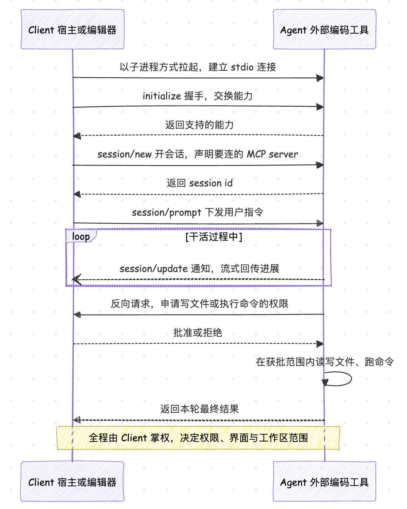

如果你了解 [MCP（Model Context Protocol，模型上下文协议）](https://modelcontextprotocol.io/)，会觉得上面这套流程很眼熟：同样是 JSON-RPC 2.0、同样把对方作为子进程通过 stdio 拉起来、同样有 `initialize` 握手和流式通知。这并不是巧合，ACP 在设计上就刻意向 MCP 看齐、复用它的传输模型。两者的区别在于解决的问题不同：MCP 标准化的是「agent 如何连上工具和数据源」，这时 agent 是 client，MCP server 提供工具；ACP 标准化的是「编辑器或宿主如何连上一个 agent」，这时编辑器是 client，agent 负责编码。它们还能叠在一起用：使用 `session/new` 开新会话时，可以顺带把要连的 MCP server 一起声明掉，让被拉起来的 ACP Agent 自己再去当一回 MCP Client，连上它需要的工具。

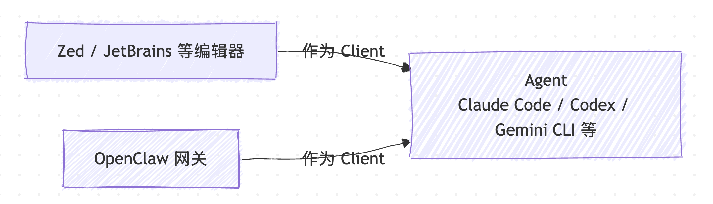

讲清楚标准协议，再看 OpenClaw 的位置就顺理成章了：在 ACP 这套协议里，**OpenClaw 扮演的是 Client 角色**。平时 Zed、JetBrains 是用 ACP 在编辑器里接入 Claude Code，OpenClaw 则是在一个聊天网关里做同样的事。它通过官方的 `@openclaw/acpx` 后端插件，把 Claude Code、Codex、Cursor、Copilot、Droid、Gemini CLI、OpenCode、Qwen 等一长串 agent 当成子进程拉起来，让你可以通过小龙虾去跟它们对话。

> 值得注意的是，OpenClaw 反过来也能充当 server：`openclaw mcp serve` 把它暴露成 MCP server、`openclaw acp` 把它暴露成 ACP server 供外部客户端或 IDE 连进来，方向和本文讲的正好相反，感兴趣的同学可以尝试一下。

## 安装 acpx 插件

ACP 的后端是个独立插件，先把它装上并启用：

```bash
$ openclaw plugins install @openclaw/acpx
$ openclaw config set plugins.entries.acpx.enabled true
```

如果你是从源码 checkout 跑的 OpenClaw，仓库里的 `extensions/acpx` 就是 acpx 的工作区版本，`pnpm install` 装完依赖后这个插件直接可用，前面那条 `openclaw plugins install` 去 npm 拉发布版的步骤就不用跑了。

还有一步建议顺手做掉：ACP 默认拿 codex 当就绪探针，而本篇以 Claude Code 为主，所以把探针 agent 换成 `claude`：

```bash
$ openclaw config set plugins.entries.acpx.config.probeAgent claude
```

配好之后，跑一下就绪检查：

```
$ /acp doctor
```

如果一切顺利，会显示 `healthy: yes`：

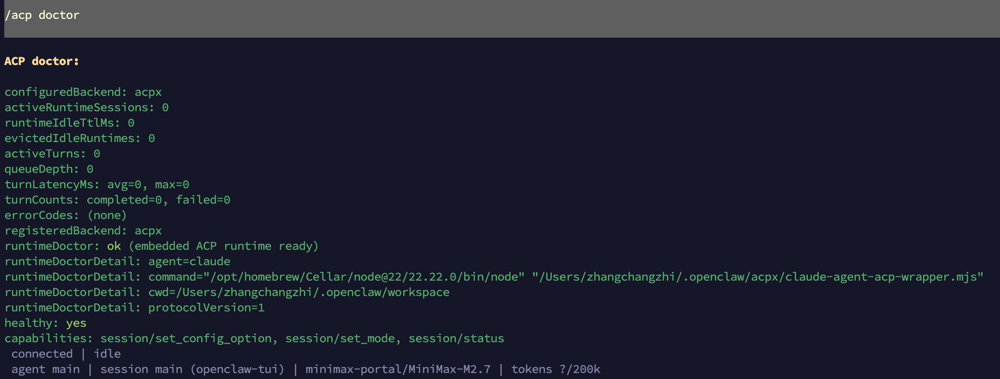

开始派活之前，还有一点要注意，各个编码 harness 得在宿主机上提前登录好。OpenClaw 只负责把 harness 进程拉起来，碰不到 harness 进程内部，所以这一步必须自己完成：要派 `claude`，宿主机上得先有 Claude Code 的登录态；要派 `gemini`，得配好 Gemini CLI 的认证；其它 harness 同理。

## 第一次派活

环境就绪后，我们走一遍最典型的流程：在飞书或 Telegram 这种真实 IM 频道里拉起一个 Claude Code，让它去改一个真实的仓库。

第一步，在飞书或 Telegram 里找一个 OpenClaw 已经接入的会话，发 spawn 命令：

```
$ /acp spawn claude --bind here --cwd /Users/zhangchangzhi/Codes/demo/sudoku
```

`--bind here` 是这条命令的关键，它把当前这个对话直接绑到新起的 ACP 会话上；`--cwd` 指定 Claude Code 干活的目录，要写完整的绝对路径。绑定一旦建立，这个会话里之后发的每一句话，都会被直接路由给 Claude Code，它的输出也回到同一个会话里。绑定之后，这个对话就成了你和那台机器上 Claude Code 的一条直连通道。

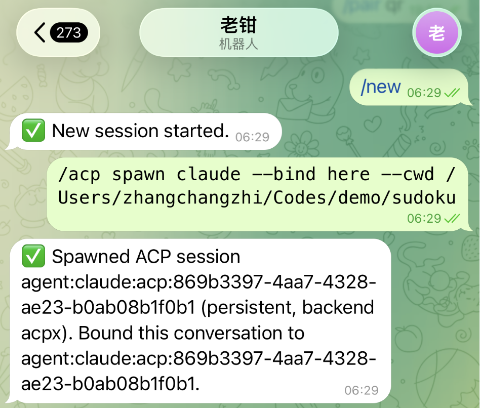

> `--bind here` 要求所在频道支持「当前对话绑定」能力。飞书、Telegram、Discord、Slack 这类 IM 频道都支持；本地的 webchat / TUI 没有这个抽象，跑这条命令会直接报 `Conversation bindings are unavailable for webchat`。这种情况要么改到 IM 频道里演示，要么去掉 `--bind here`、让 agent 自己用 `sessions_spawn` 把活派到后台跑。

接着就可以在这个对话里直接给它派活，跟平时用 Claude Code 没两样：

```
介绍下这个项目
```

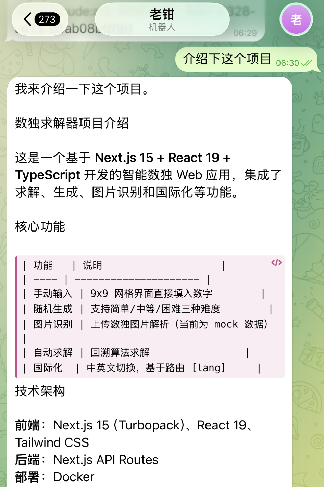

可以看到，Claude Code 真的在那台机器上跑起来了：它读取文件，总结代码，过程和你在终端里亲自敲 `claude` 一模一样，只不过这一切是被小龙虾代理着，发生在聊天频道里。中途想看看它现在是个什么状态，随时一条 `/acp status`：

```
$ /acp status
```

`status` 会把这个会话的后端、绑定的 harness、当前模式（persistent 还是 oneshot）、运行状态、各项运行时选项和能力都列出来；要是上一轮出过错，`lastError` 里也会留着。

任务做完后，收尾有两条命令：

```
$ /acp cancel   # 只中止当前这一轮，会话还留着，能接着发指令
$ /acp close    # 从 OpenClaw 视角结束会话并解绑当前对话
```

`cancel` 只在 harness 支持取消时中止当前会话轮次，它并不会删除绑定和会话元数据，停下来之后你还能继续给它发新指令。`close` 才是真正的结束，它从 OpenClaw 这边结束会话，解除当前对话的绑定。

### 非交互权限

在真正使用过程中，你会很快撞上 ACP 实战里最常见的一个坑。

接着上面那个例子，假设你在飞书里给绑定好的 Claude Code 派一句「帮我加一个计时器功能」，期待它直接动手改文件。结果会发现飞书这一头迟迟没有动静，过了一会儿就超时报错了。回到网关那台机器的终端一看，原来是 Claude Code 想写文件时弹了一条权限请求，一直在那等你按 y/n 确认：

```
[permission] Allow Edit src/i18n/locales/zh.ts [edit]?  (y/N)
```

Claude Code 要写文件的时候，按 ACP 协议会向 OpenClaw 这边的 Client 反向发出权限请求；OpenClaw 默认配置下需要询问用户，也不知道是不是 OpenClaw 的 bug，ACP 反向权限请求目前不会被转发到飞书 / Telegram 这些聊天频道，只会将弹窗渲染到了网关进程的本地 TTY 上，因此你在飞书里不会收到任何通知。也就是说，只要批准这一动作的人不在网关那台机器的 TTY 前，权限请求就没人能批。如果网关是以 daemon / systemd 这种无 TTY 方式启动，甚至会直接以 `AcpRuntimeError: Permission prompt unavailable in non-interactive mode` 报错中止。

下面是我以 TTY 方式启动网关后弹出的权限请求：

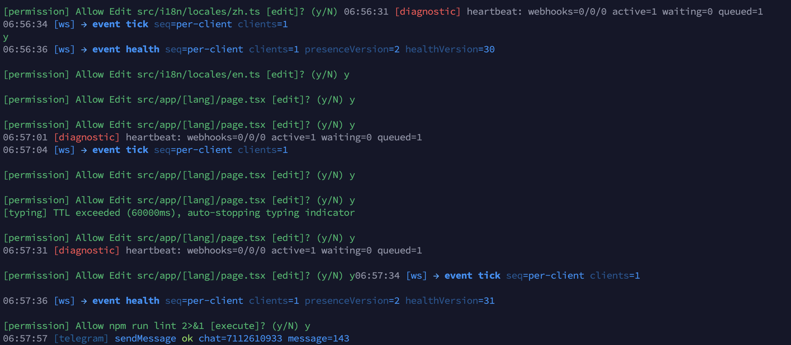

你需要一个个的按 y 确认，可以看到权限弹框和日志混在一起，既不直观，也不方便。为此，OpenClaw 提供了两个配置项管这件事：

* `permissionMode`：粗粒度总开关，三种取值。`approve-all` 全部放行；`approve-reads`（**默认**）只放行读，写操作和命令执行仍走审批；`deny-all` 把所有请求全部拒掉，实际上等于把 Claude Code 锁死，一般是用不到的。
* `nonInteractivePermissions`：该开关只在 `permissionMode=approve-reads` 当前没有 TTY 时才生效。`fail`（**默认**）直接以 `AcpRuntimeError` 中止会话；`deny` 把这次操作静默拒掉，会话仍然继续跑。

所以实际可用的组合其实就两种：

* `permissionMode=approve-all`：让 harness 全自动改文件或跑命令，这也是最常见的设置；
* `permissionMode=approve-reads` + `nonInteractivePermissions=deny`：不放权写操作但会话会正常进行；

对应的两条命令如下：

```bash
# 选项一：让 harness 全自动放行读写和 shell（破窗开关，请确认 cwd 和权限范围可控）
$ openclaw config set plugins.entries.acpx.config.permissionMode approve-all

# 选项二：不放权，但让它静默拒绝后继续，而不是让整个会话中止
$ openclaw config set plugins.entries.acpx.config.nonInteractivePermissions deny
```

选项一是把 `permissionMode` 调成 `approve-all`，让 harness 写文件、跑命令都不再过问。它是 ACP 会话的**破窗（break-glass）开关**，效果最直接，但也意味着这个会话能在 `cwd` 范围内不受限制地操作，开之前务必确认目录和权限范围是你能接受的。选项二保守得多，权限照旧不放，只是把 `nonInteractivePermissions` 从 `fail` 改成 `deny`，让那些过不了审批的操作被静默拒掉、会话继续往下走，至少不会因为一次写文件就让整个会话中止。

我这里选择选项一，就可以在聊天窗口里愉快的写代码了：

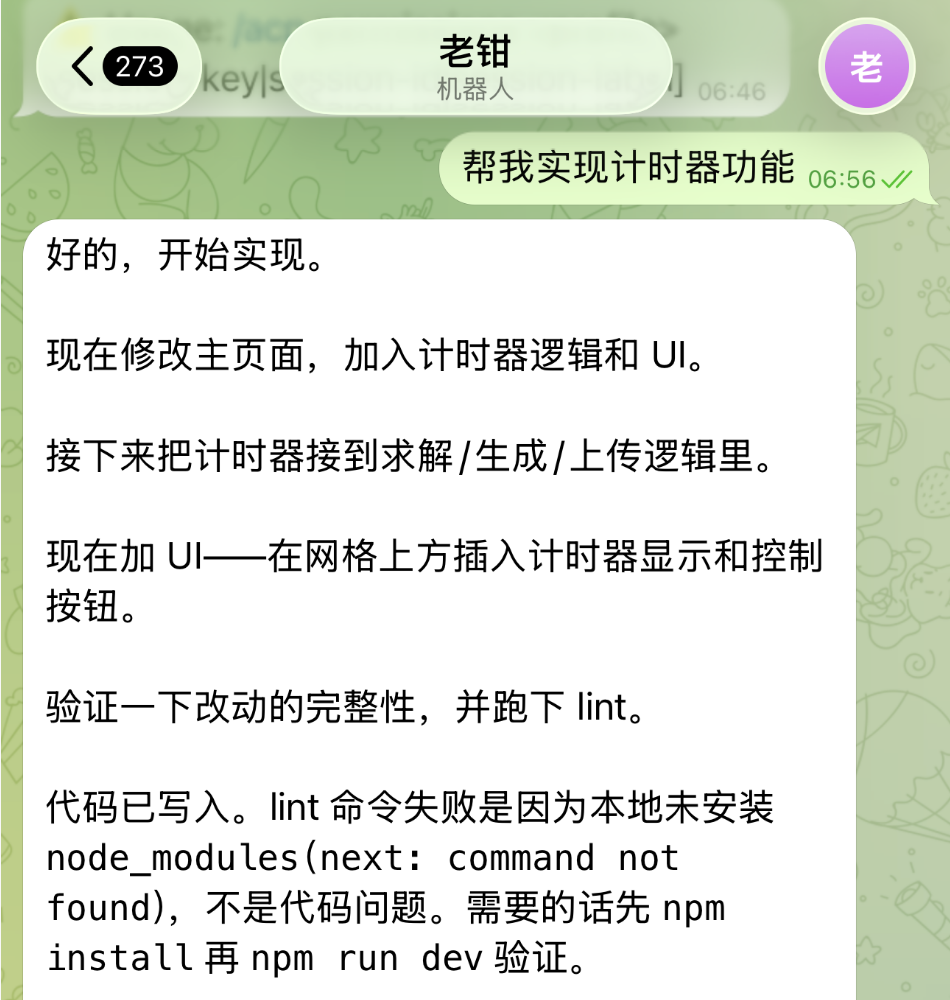

要注意的是，关于 acpx 这套 harness 权限，和我们在工具篇讲过的 `tools.exec.security` 审批配置，是两套完全独立的东西。前者管 ACP harness 在它自己进程里的行为，后者管 OpenClaw 内置 `exec` 工具的审批，互不影响。另一个差异是：`tools.exec.security` 已经支持把审批弹窗推到飞书 / Telegram 让你点卡片，ACP 目前还没看到这样的实现。

### 命令速查

前面用到的 `spawn`、`status`、`cancel`、`close` 只是 `/acp` 的一部分。这里将全部子命令列出来供参考：

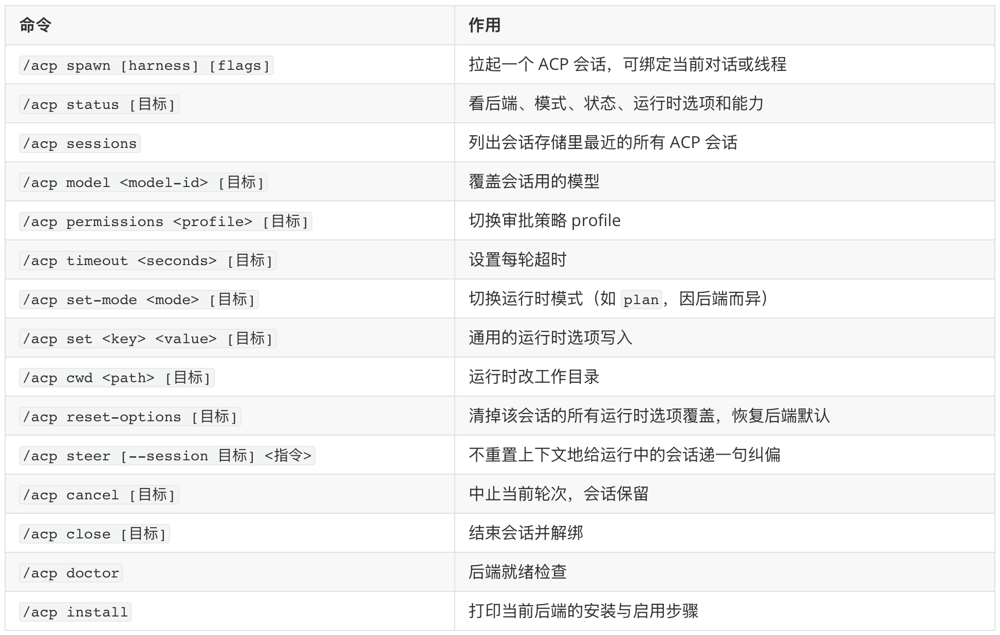

这里有几点值得展开说说。

其一，几乎每条命令后面都能跟一个**目标**参数，可以是会话 key、会话 id 或会话 label 三种写法。不带目标时，作用在当前绑定的会话上；想操作另一个会话，先 `/acp sessions` 把它的 key 或 label 列出来，再贴到命令后面。

其二，`/acp spawn` 有几个常用的参数：

* `--mode persistent|oneshot` 决定会话生命周期
* `--bind here|off` 决定要不要绑当前对话
* `--thread auto|here|off` 决定要不要绑到「线程」
* `--cwd <path>` 指工作目录
* `--label <name>` 给会话起个好记的名字

会话生命周期有两种：`persistent` 开的是**持久会话**，spawn 完之后 ACP 会话一直留着，绑定的对话里之后发的消息都接着走它，直到你显式 `/acp close`；`oneshot` 开的是**一次性会话**，跑完当前轮次会话就自动收尾、元数据清掉，再发消息得重新 spawn；手动在对话里敲 `/acp spawn` 默认走 `persistent`，因为你这时通常想持续跟 harness 对话。

另外上面的「线程」指的是聊天频道**对话内部的子会话面**，每个频道叫法不同：Discord、Slack 里都叫 Thread（针对一条父消息开出的回复线索），Telegram 群里叫 Topic（开了 Topic 模式的群里那一栏栏话题），飞书群里也叫话题。三个取值的含义是：`--thread off` 不绑任何线程；`--thread here` 要求你**当前就在某个线程里**敲这条命令，会把那个线程绑到新 ACP 会话上，否则报错；`--thread auto` 自动判断，在线程里就绑当前线程，不在线程里则在频道支持的前提下**新开一个子线程**来承载这个 ACP 会话，原对话不受打扰。

要注意 `--bind here` 和 `--thread ...` 不能各自独立生效：前者把整条对话（DM/群/频道本体）原地钉住、不另开任何线程，所有消息都直接走 ACP；后者只钉住一个子线程，原对话里其它消息照常进 agent。两者同时传时 `--bind here` 优先级更高，`--thread` 会被忽略。

其三，调参那几条命令背后其实是写运行时的配置项：比如 `/acp model` 写 `model`、`/acp permissions` 写 `approval_policy`、`/acp timeout` 写 `timeout`，剩下叫不上名的就用通用的 `/acp set <key> <value>` 兜底，想一键还原就 `/acp reset-options`。

## 两种派活方式

前面 `/acp spawn` 那个例子是人在对话里手动绑定，属于 ACP 的第一种派活方式：**交互式绑定会话**，它将当前对话钉到一个 ACP 会话上，之后这个对话里的消息直接转给 harness，输出回到同一通道。其实还有第二种派活方式，直接用自然语言的方式，让 agent 用 `sessions_spawn` 工具把活派给 Claude Code 去跑：

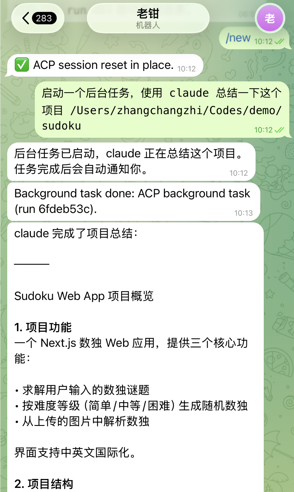

我们可以打开 OpenClaw 的 Control UI 页面，找到这次对话：

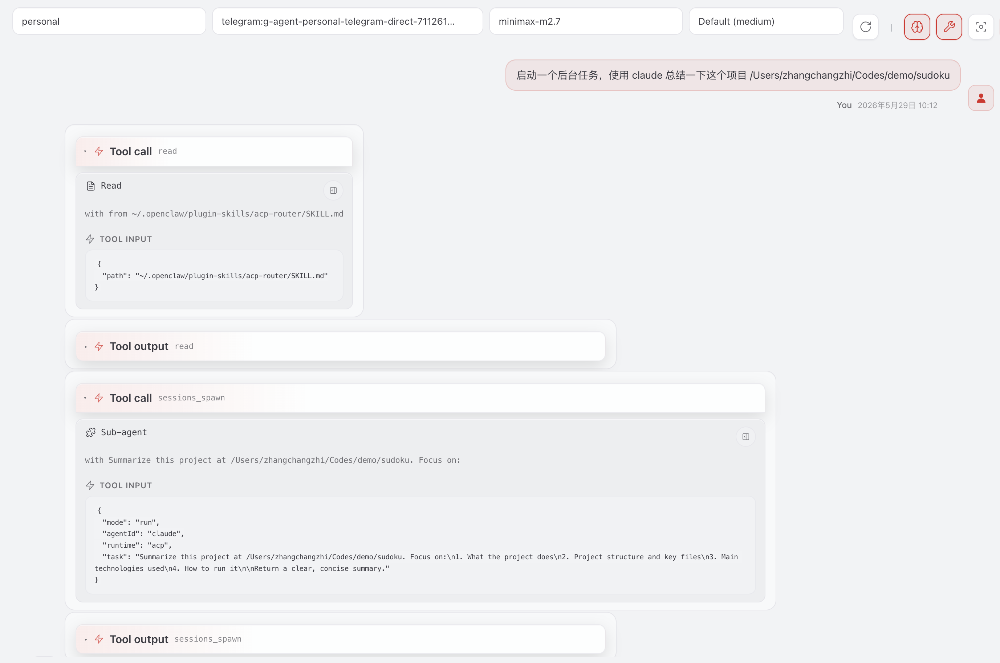

这里可以看到 agent 调用了两次工具：

第一次是 `Read`，读的是 `~/.openclaw/plugin-skills/acp-router/SKILL.md`，这是 OpenClaw 内置的「ACP 派活路由」skill 文件，agent 在动手 spawn 之前先翻了下手册看该怎么派（skill 体系下一篇会专门讲）。

第二次才是真正干活的 `sessions_spawn`，传入的参数如下：

```json
{
  "mode": "run",
  "agentId": "claude",
  "runtime": "acp",
  "task": "..."
}
```

这本质上是个后台子任务，每次运行会生成一条 background task 记录，和前面讲的子 agent 用的是同一个工具、同一套机制，只是将参数 `runtime` 换成了 `acp`（默认值是 `subagent`）。和子 agent 一样，后端的 harness 运行时不会卡住主会话，运行结束后会自动通知到当前会话。可以将它和子 agent 放一起对照一下：

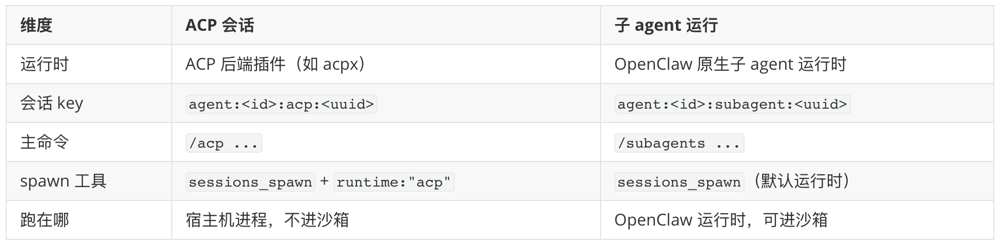

参数 `agentId` 用于指定派给哪个 harness，省略时会用配置里的 `acp.defaultAgent`（如果设了的话）。常用的几个如下：

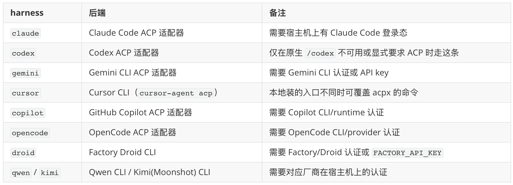

除这些之外，清单里还有 `iflow`、`kilocode`、`kiro`、`pi`，以及一个比较特别的 `openclaw`，它走的是 `openclaw acp` 桥接，让一个支持 ACP 的 harness 反过来连回 OpenClaw 的会话。它们都可以作为 `/acp spawn <id>` 或 `sessions_spawn({ runtime: "acp", agentId: "<id>" })` 的目标。

参数 `mode` 和前面 `/acp spawn` 的 `--mode` 是同一件事换了个名字，`run` 对应 oneshot、`session` 对应 persistent，后者还得配合 `thread: true` 才能真的留住绑定。

参数 `task` 值得注意，我们原话只是「总结一下这个项目」这种口语化指令，agent 派给子任务时却自己把它扩成了一段结构化的英文 prompt：

```
Summarize this project at /Users/zhangchangzhi/Codes/demo/sudoku. Focus on:
1. What the project does
2. Project structure and key files
3. Main technologies used
4. How to run it

Return a clear, concise summary.
```

这正是 `sessions_spawn` 设计上鼓励的做法：父 agent 拿到模糊指令后自己先把它翻译成清晰、可执行的任务描述，再用 `task` 字段独立派出去，子会话拿到的是一份完整自洽的任务说明，不需要把整段聊天上下文一起 fork 过去。

## 进阶用法

通过上面的学习，我们已经将 OpenClaw 的 ACP 工具基本流程跑通了，除了上面介绍的内容，ACP 还有一些进阶玩法，感兴趣的同学可以尝试一下。

### MCP 桥接

默认情况下，OpenClaw 的内置工具和插件工具**并不会暴露**给 ACP harness。Claude Code 在 ACP 会话里用的还是它自己那套原生工具，碰不到小龙虾的 `cron`、`message` 这些。如果你确实想把 OpenClaw 的某些能力透出去给 harness 用，acpx 提供了两个默认关闭的 MCP 桥接开关：

```bash
# 把已启用的「插件工具」透给 harness
$ openclaw config set plugins.entries.acpx.config.pluginToolsMcpBridge true
# 把选定的「内置核心工具」（目前是 cron）透给 harness
$ openclaw config set plugins.entries.acpx.config.openClawToolsMcpBridge true
```

打开后，acpx 会在 ACP 会话启动时分别注入一个名为 `openclaw-plugin-tools` 和 `openclaw-tools` 的内置 MCP server，harness 就能通过 MCP 调到这些工具了。要注意，这等于**扩大了外部 harness 的能力面**，开之前最好先盘一遍当前装了哪些插件。把插件工具透给 harness，相当于让 harness 拥有了和这些插件在 OpenClaw 内部执行同等的信任级别。

### 常驻绑定

前面 `/acp spawn --bind here` 是临时绑定，对话一关、会话一 close 就没了。如果你想要的是**长期效果**，比如 Discord 上那个 `#codex` 频道，以后所有消息都直接进一个常驻的 Codex ACP 会话，可以直接在配置里声明一条 `type: "acp"` 的绑定：

```json5
{
  agents: {
    list: [
      {
        id: "codex",
        runtime: {
          type: "acp",
          acp: { agent: "codex", backend: "acpx", mode: "persistent", cwd: "/workspace/repo" },
        },
      },
    ],
  },
  bindings: [
    {
      type: "acp",
      agentId: "codex",
      match: { channel: "discord", accountId: "default", peer: { kind: "channel", id: "222222222222222222" } },
      acp: { label: "codex-main" },
    },
  ],
}
```

这样配好之后，那个频道就成了一个常驻的 Codex 工作台，不用每次手动 spawn。它和我们在「让小龙虾分身」那篇讲的普通 `type: "route"` 路由规则差不多，只是把目标换成了一个 ACP 运行时。

## 小结

最后，我们来总结下今天学习的内容：

1. **ACP 是把活派给外部编码 agent 的标准协议**。它由 Zed 团队提出并开源，用来解决编辑器和编码 agent 之间 N×M 对接的麻烦。OpenClaw 在这套协议里扮演 Client 的角色，通过 acpx 后端插件把 Claude Code、Gemini CLI、Codex 这些 harness 当成子进程拉起来，让你在飞书 / Telegram 这种聊天频道里就能调度它们。
2. **环境准备并不复杂**。把 acpx 装上、启用，把就绪探针指到你常用的 harness，跑一次 `/acp doctor` 看是否正常即可。harness 自己的厂商登录得在网关那台机器上提前准备好，OpenClaw 只管把进程拉起来，碰不到它们内部。
3. **派活有两种姿势**。你本人想在某个聊天频道里持续盯着 harness 干活，就 `/acp spawn --bind here` 把整个对话接到它上面；让另一个 agent 在自己轮次里甩一个后台任务出去，则用 `sessions_spawn` 把 runtime 换成 acp，按后台 task 跑完播报回来。
4. **非交互权限是头号坑**。ACP 的反向权限弹窗目前不会被转发到聊天频道，所以远程操作时几乎都得把 acpx 的 `permissionMode` 调成 `approve-all`，让 harness 在你给的工作目录里自由读写。
5. **两个进阶用法**：MCP 桥接能把 OpenClaw 的工具透给 harness 调用；常驻绑定能把一个聊天频道钉到某个 ACP 会话上当工作台用。

到这儿，小龙虾的工具体系算是彻底讲完了：内置工具让它能直接动手处理各种操作，浏览器是其中能力最强的一种，ACP 则是把整个任务交给外部 agent 来完成的方式。不过，工具和外部 agent 终究只是一个个单独的能力，agent 接到一个稍复杂的任务，该按什么顺序调用、中间出错怎么回退、什么场景触发哪套流程，光靠模型临场发挥并不稳定，它还需要一份事先写好的操作手册，这就是 OpenClaw 的 Skills 系统。我们下一篇继续~

## 参考

* [OpenClaw 官方文档](https://docs.openclaw.ai/)
* [OpenClaw GitHub 仓库](https://github.com/openclaw/openclaw)
* [ACP agents 文档](https://docs.openclaw.ai/tools/acp-agents)
* [ACP agents 配置文档](https://docs.openclaw.ai/tools/acp-agents-setup)
* [Sub-agents 文档](https://docs.openclaw.ai/tools/subagents)
* [Background Tasks 文档](https://docs.openclaw.ai/automation/tasks)
* [Agent Client Protocol 规范](https://agentclientprotocol.com/)
* [Agent Client Protocol 架构文档](https://agentclientprotocol.com/overview/architecture)
* [Zed 编辑器](https://zed.dev/)
* [Language Server Protocol（LSP）](https://microsoft.github.io/language-server-protocol/)
* [Model Context Protocol（MCP）](https://modelcontextprotocol.io/)
* [openclaw acp CLI 文档](https://docs.openclaw.ai/cli/acp)
* [openclaw mcp serve 文档](https://docs.openclaw.ai/cli/mcp)
