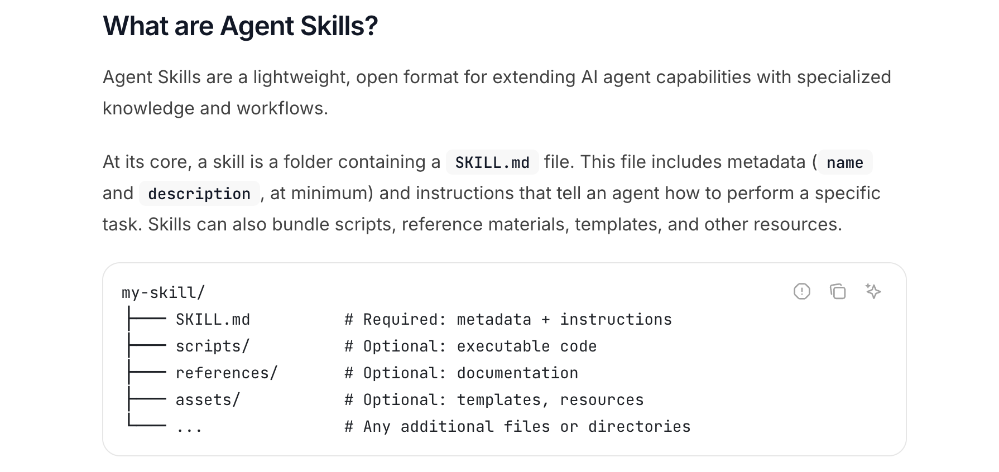
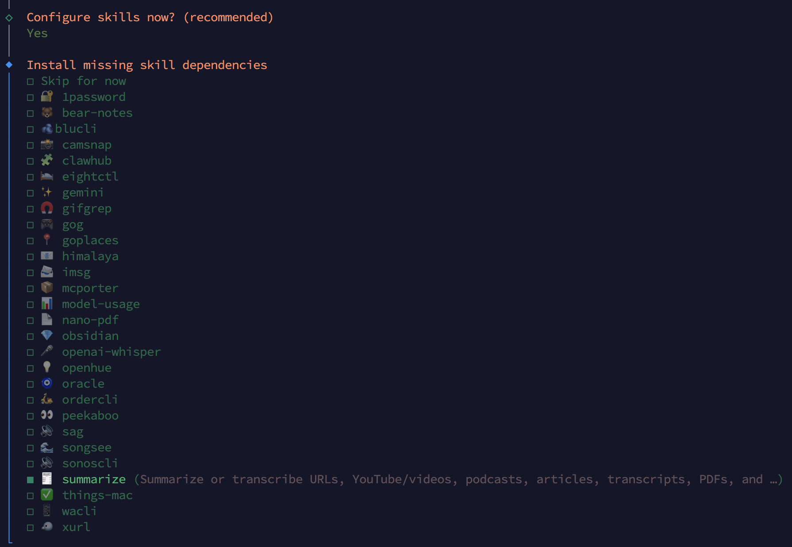
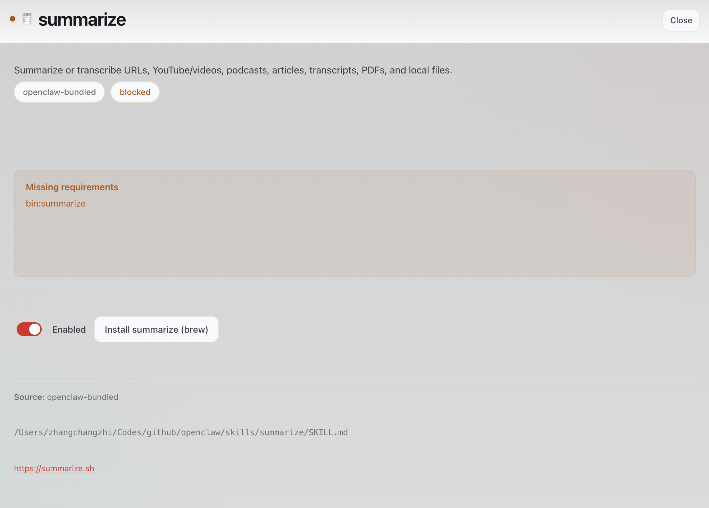
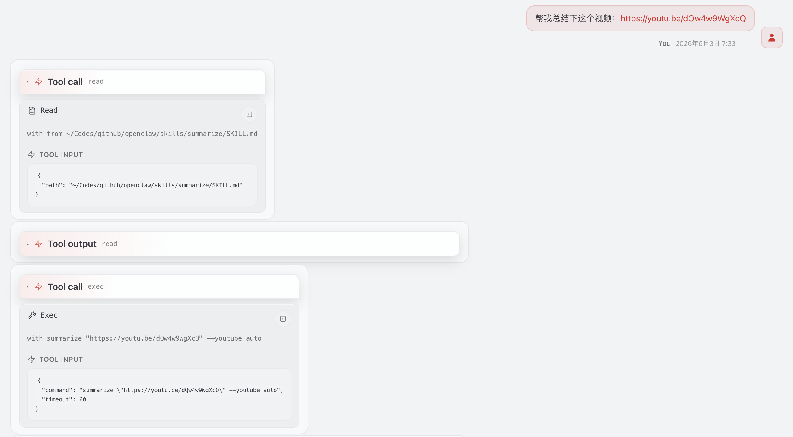
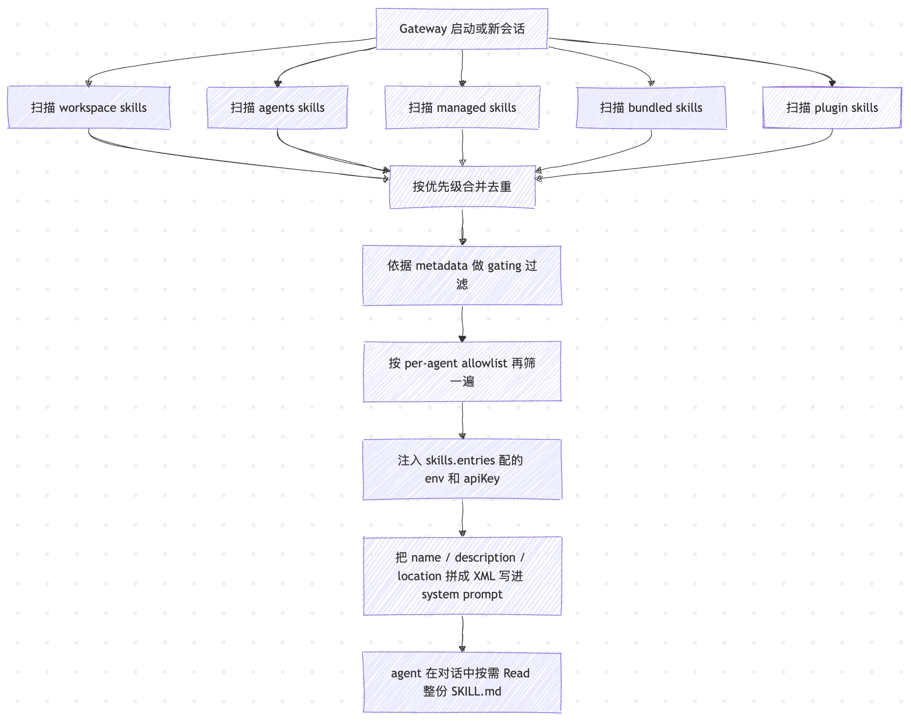

# 给小龙虾写本操作手册：Skills 系统

前面几篇我们把 OpenClaw 的工具挨个过了一遍，但工具终究只是零件。想象一下你跟小龙虾说一句「把 openclaw 仓库里带 bug 标签的 issue 都过一遍，能修的就开个 PR 修掉」，它得先用 `exec` 跑 `gh issue list` 拉 issue 列表，按 label 筛出要动的几个，再用 `sessions_spawn` 分头派子 agent 去改代码，修完再用 `gh pr create` 开 PR，最后还得盯着 review 评论看要不要再改一轮。这一串环节该按什么顺序走、被 rate-limit 怎么回退、PR 评审打回来怎么继续，光靠模型每次临场发挥并不稳。它需要一份写好的操作手册。这正是 Skill 这套机制要解决的问题。

围绕 Skills 系统我们打算分三篇讲完：今天这一篇先把基本盘讲清楚，什么是 skill、从哪儿加载、如何参与对话；下一篇带大家逛一逛 ClawHub 市场，再动手写一个自己的 skill 并发布上去；第三篇看一个实验性玩法 Skill Workshop，让 agent 把自己干活时学到的流程**自动写成 workspace skill**。今天先从最基础的开始。

## 什么是 Skill

根据官方文档，OpenClaw 的 skill 用的是 **[Agent Skills](https://agentskills.io) 规范**：每个 skill 就是磁盘上的一个目录，目录里至少有一份 `SKILL.md`，文件头是一段 YAML frontmatter，正文是 Markdown 写的操作说明。说白了，Skill 就是给 agent 备的一份操作手册：什么时候该触发、要调哪些底层工具、按什么步骤走、出错了怎么办。它和直接把这些步骤塞进系统提示词最大的区别是**按需加载**。OpenClaw 只在 agent 真有可能用到时才把它的存在告诉模型，平时不占用上下文；模型觉得用户问题和哪个 skill 相关了，再去把手册正文读出来。



最小可用的 `SKILL.md` 长这样：

```markdown
---
name: hello-world
description: A simple skill that says hello.
---

# Hello World Skill

When the user asks for a greeting, use the `echo` tool to say
"Hello from your custom skill!".
```

frontmatter 里 `name` 和 `description` 是必填的，如果缺一个，这份 skill 直接被丢掉。其中 `description` 是给模型看的一句话说明，模型靠它判断当前对话要不要使用这个 skill；正文则是给 agent 看的执行手册。

> 除了 name 和 description 这两个必填字段，OpenClaw 还在 frontmatter 里加了不少自家扩展：声明依赖二进制 / 环境变量 / 配置项的 `requires.bins / env / config`、控制触发方式的 `user-invocable` / `disable-model-invocation` / `command-dispatch`、限定平台的 `os`、给桌面端 UI 用的 `install` 安装提示，以及配合密钥注入的 `primaryEnv` 等等。具体含义留到后面再细看。

## 三类来源

OpenClaw 把 skill 按来源分了好几类，信任级别和生命周期各不相同。优先级从高到低依次是：

| 优先级 | 来源 | 路径 |
| ---- | ------- | ------ |
| 1 | Workspace skills | `<workspace>/skills` |
| 2 | Project agent skills | `<workspace>/.agents/skills` |
| 3 | Personal agent skills | `~/.agents/skills` |
| 4 | Managed / 本地 skills | `~/.openclaw/skills` |
| 5 | Bundled skills | 随安装包发出 |
| 6 | 额外目录 | `skills.load.extraDirs`（配置里指定） |

如果几个来源里有同名 skill，**高优先级覆盖低优先级**。这套规则保证了用户工作区里自己定制的版本永远盖得住官方版本，方便做覆写和打补丁。中间那两层 `.agents/skills` 是给项目级或个人级的 agent profile 用的，平时不太会动，一般我们只关心三类：

* **bundled**：仓库自带，随安装包发出
* **managed**：`~/.openclaw/skills`，从 ClawHub 装下来的或本地打的补丁
* **workspace**：`<workspace>/skills`，用户自己写的定制版本

除此之外，插件也可以自带 skill：在 `openclaw.plugin.json` 里声明一个 `skills` 目录，插件启用时这些 skill 就会按和 `extraDirs` 同等的最低优先级合并进来。前面 browser 那篇提过的 `browser-automation` 手册，就是浏览器插件顺带捎进来的 skill。

> 多 agent 模式下每个 agent 有自己的工作区，所以 workspace 类的 skill 是 per-agent 的，互相看不到。这一点在企业部署里很关键：同一台机器上同时跑客服 agent 和开发 agent，让他们看不到对方的私有 skill 就能做到权限隔离。另外要提醒一句，第三方 skill 等同于**未经审查的代码**，启用前一定先读一遍，不放心就丢进沙箱里跑。

## 仓库自带 skill 一览

先看 bundled 这一类，也就是仓库自带的 `skills/` 目录，它会直接被打包进发行版，截至本系列动笔时一共 53 个，覆盖面相当广。下面按主题分组挨个过一遍：

**笔记、任务与项目管理**：

| skill | 用途 |
| --- | --- |
| `apple-notes` | 在 macOS 上通过 memo CLI 创建、查看、编辑、搜索、移动、导出 Apple 笔记 |
| `apple-reminders` | 通过 remindctl 增删改查 Apple 提醒事项和列表 |
| `bear-notes` | 通过 grizzly CLI 创建、搜索、管理 Bear 笔记 |
| `obsidian` | 通过 obsidian-cli 操作 Obsidian vault（纯 Markdown 笔记） |
| `notion` | 用 Notion API 创建、管理 page、database、block |
| `things-mac` | 在 macOS 的 Things 3 里增删改查 todo、inbox、today、project、area、tag |
| `trello` | 通过 Trello REST API 管理 board、list、card |
| `taskflow` | 把多步骤分离任务编排成一份持久的 TaskFlow 作业，带 owner 上下文、状态、等待和子任务 |
| `taskflow-inbox-triage` | TaskFlow 的示例：邮件收件箱分流、意图路由、等回复、回头总结 |

**IM 与社交**：

| skill | 用途 |
| --- | --- |
| `imsg` | 通过 Messages.app 读写 iMessage / SMS：列会话、看历史、发消息 |
| `bluebubbles` | 通过 BlueBubbles 收发 iMessage，支持附件、tapback、编辑、回复、群聊 |
| `slack` | 通过 Slack 工具发消息、贴 reaction、pin/unpin、改/删消息、查成员 |
| `discord` | 通过 `message` 工具（channel=discord）做 Discord 日常操作 |
| `wacli` | 通过 wacli 给第三方 WhatsApp 发消息或同步/搜历史（不接管你的活跃聊天） |
| `xurl` | 通过 xurl 认证后做 X 发帖、回复、搜索、DM、上传媒体、查粉丝等 v2 API 调用 |
| `voice-call` | 通过 OpenClaw 的 voice-call 插件发起语音通话 |

**邮件与办公**：

| skill | 用途 |
| --- | --- |
| `himalaya` | 用 himalaya 收发、搜、组织 IMAP / SMTP 邮件 |
| `gog` | Google Workspace 全家桶 CLI：Gmail、Calendar、Drive、Contacts、Sheets、Docs |

**编码、GitHub 与 OpenClaw 生态**：

| skill | 用途 |
| --- | --- |
| `github` | 用 gh CLI 处理 GitHub issue、PR 状态、CI/日志、评论、review、release 和 API 查询 |
| `gh-issues` | 自动从 GitHub 拉 issue，派给子 agent 去修，开 PR，跟踪 review |
| `coding-agent` | 把编码任务派给 Codex、Claude Code、OpenCode、Pi，跑在后台进程里 |
| `skill-creator` | 创建、编辑、改进、整理、审核、重构 AgentSkills 和 SKILL.md |
| `clawhub` | 和 ClawHub 注册中心交互，搜索、安装、更新、同步、发布 skill |
| `mcporter` | 通过 mcporter 列出、配置、认证、调用、查看 MCP server / 工具（HTTP 或 stdio） |
| `oracle` | 用 oracle CLI 打包 prompt 和文件喂给第二个模型做 debug、refactor、设计或审查 |
| `model-usage` | 汇总 CodexBar 的本地成本日志，按模型拆 Codex 或 Claude 的当前/全部花销 |
| `session-logs` | 用 jq 搜索分析自己的会话日志（更早或父级会话） |

**音频、视频与媒体**：

| skill | 用途 |
| --- | --- |
| `spotify-player` | 在终端里走 spogo（首选）或 spotify_player 控制 Spotify 播放和搜索 |
| `sonoscli` | 控制 Sonos 音箱：发现 / 状态 / 播放 / 音量 / 分组 |
| `blucli` | BluOS CLI（blu），发现、播放、分组、调音量 |
| `songsee` | 用 songsee CLI 给音频生成频谱图和特征面板 |
| `sherpa-onnx-tts` | sherpa-onnx 本地 TTS（离线、不走云） |
| `sag` | 用 ElevenLabs TTS，仿 macOS `say` 的 UX |
| `openai-whisper` | 本地 Whisper CLI 做语音转文字（无 API key） |
| `openai-whisper-api` | OpenAI Whisper API 转写音频 |
| `summarize` | 用 summarize.sh 总结或转写 URL、YouTube 视频、播客、文章、转录稿、PDF 和本地文件 |
| `video-frames` | 用 ffmpeg 从视频里抽帧或剪短片段 |
| `gifgrep` | 在 GIF 提供方搜索（CLI/TUI），下载并提取静帧 / 拼图 |
| `camsnap` | 从 RTSP / ONVIF 摄像头抓帧或录短片 |
| `nano-pdf` | 用 nano-pdf CLI 通过自然语言指令编辑 PDF |
| `blogwatcher` | 用 blogwatcher CLI 监控博客和 RSS/Atom feed 的更新 |

**搜索、信息与查询**：

| skill | 用途 |
| --- | --- |
| `weather` | 查天气、降水、温度、未来几天预报（出行用） |
| `goplaces` | 通过 goplaces 查 Google Places：文本搜索、地点详情、评论、脚本化 JSON |
| `gemini` | 用 Gemini CLI 做 one-shot 问答、总结、生成 |

**系统、家居与杂项**：

| skill | 用途 |
| --- | --- |
| `1password` | 配置 1Password CLI：登录、桌面端集成、读取/注入 secret |
| `healthcheck` | 审计加固跑 OpenClaw 的主机：SSH、防火墙、更新、暴露面、cron、风险姿态 |
| `node-connect` | 排查 Android / iOS / macOS Node 的配对、二维码、路由、认证、连接故障 |
| `tmux` | 远程控制 tmux 会话，靠发按键和抓 pane 输出来驱动交互式 CLI |
| `peekaboo` | 用 Peekaboo CLI 抓屏和自动化 macOS UI |
| `canvas` | 在已连接的 OpenClaw Node（Mac/iOS/Android）上展示 HTML 内容，用来跑游戏、可视化、仪表盘 |
| `openhue` | 通过 OpenHue CLI 控制 Philips Hue 灯和场景 |
| `eightctl` | 控制 Eight Sleep 床垫：状态、温度、闹钟、日程 |
| `ordercli` | Foodora 订单 CLI：查历史订单、看活跃订单状态（Deliveroo 在开发中） |

## 插件自带 skill 一览

除了 `skills/` 目录下的内置技能，`extensions/` 目录下的**内置插件**也会顺带捎上自己的 skill，截至本系列动笔时，共有 8 个内置插件贡献了 14 个 skill：

| 插件 | skill | 用途 |
| --- | --- | --- |
| `acpx` | `acp-router` | 把用户的自然语言请求路由到合适的 ACP harness（Claude Code、Codex、Cursor、Gemini CLI、Kimi、Qwen 等），相当于 ACP 的路由器 |
| `browser` | `browser-automation` | 用 `browser` 工具控制网页时的操作手册：多步流程、登录检查、tab 管理、stale ref 恢复 |
| `diffs` | `diffs` | 用 `diffs` 工具生成真正可分享的 diff（viewer URL 或文件 artifact），而不是让 agent 手写「我改了哪些行」的总结 |
| `feishu` | `feishu-doc` | 飞书云文档读写、docx 表格创建 |
| `feishu` | `feishu-drive` | 飞书云空间的文件夹和文件管理 |
| `feishu` | `feishu-perm` | 飞书文档和文件的权限、协作者管理 |
| `feishu` | `feishu-wiki` | 飞书知识库导航 |
| `memory-wiki` | `obsidian-vault-maintainer` | 把记忆 wiki 维护成 Obsidian 友好格式：wikilink、frontmatter、obsidian-cli 配合 |
| `memory-wiki` | `wiki-maintainer` | 维护 OpenClaw memory wiki：确定性页面、托管块、源回溯更新 |
| `open-prose` | `prose` | OpenProse VM 的 skill pack，处理 `prose` 命令和 .prose 文件，编排多 agent 工作流 |
| `qqbot` | `qqbot-channel` | QQ 频道管理：列频道、子频道、成员、发帖、公告、日程 |
| `qqbot` | `qqbot-media` | QQ 富媒体收发：图片、语音、视频、文件，靠扩展名自动识别 |
| `qqbot` | `qqbot-remind` | QQ 定时提醒：一次性 + 周期性的创建、查询、取消 |
| `tavily` | `tavily` | Tavily 网页搜索、内容抽取和研究类工具的入口 |

这里有两点值得留意。一是每个插件支持挂多个 skill，`feishu`、`qqbot`、`memory-wiki` 都拆成了好几份，触发能更精准，用户问飞书权限只会激活 `feishu-perm`，不会把发文档的步骤一起喂进来，代价是 skill 列表涨得快，得靠 description 写得准来避免互相误触。二是这些 skill 都跟着所属插件走，不需要单独配置，如果插件没有启用，对应的 skill 也就不会启用。

## Skill 实战

这一节我们以 `summarize` 技能为例，实战一下 skill 的用法。先看下它的 `SKILL.md` 头部声明了哪些东西：

```markdown
---
name: summarize
description: Summarize or transcribe URLs, YouTube/videos, podcasts, articles, transcripts, PDFs, and local files.
homepage: https://summarize.sh
metadata:
  {
    "openclaw":
      {
        "emoji": "🧾",
        "requires": { "bins": ["summarize"] },
        "install":
          [
            {
              "id": "brew",
              "kind": "brew",
              "formula": "steipete/tap/summarize",
              "bins": ["summarize"],
              "label": "Install summarize (brew)",
            },
          ],
      },
  }
---
```

这块信息量浓缩了几条：

* **`description`**：列了它能处理的输入类型（URL、YouTube、播客、文章、转录稿、PDF、本地文件），模型靠这一行决定是否进入；
* **`homepage`**：给 UI 用，显示成「Website」链接；
* **`emoji: 🧾`**：纯粹是给 Skills 列表前面挂个图标，不影响功能；
* **`requires.bins: ["summarize"]`**：这份 skill 的启用条件只有一条，PATH 上必须有 `summarize` 这个二进制，否则 OpenClaw 加载时就把它过滤掉；
* **`install`**：装这条二进制的官方建议，当你使用 `openclaw configure` 走 onboarding 流程时就会读这一段自动安装；

bundled skill 默认是启用的，只要上面的依赖满足了，该 skill 就能用。我们可以运行 `openclaw configure` 命令，自动安装依赖：



或者在 Control UI 的 Skills 列表中找到该 skill，点击安装：



也可以照着 `install` 那段，手动安装依赖：

```
$ brew install steipete/tap/summarize
```

安装完成后，检查 `summarize` 是否可用：

```
$ summarize --version
0.16.3
```

虽然该 skill 的 `requires` 里没讲，但实际上该 CLI 工具还需要配置一个模型的 API key，比如：

```
$ openclaw config set skills.entries.summarize.env.GEMINI_API_KEY "your-key-here"
```

改完配置要让 OpenClaw 起一个新会话才生效，skill 快照是按会话锁定的，老会话不会自动刷新。在聊天窗口里输 `/new` 起个新会话，或者直接重启网关：

```
$ openclaw gateway restart
```

接着到 Telegram 或飞书里跟小龙虾说一句：

```
帮我总结下这个视频：https://youtu.be/dQw4w9WgXcQ
```

agent 看到 URL 加上一个总结意图，于是命中 `summarize` 的触发条件，它会先使用 `read` 阅读该技能的 `SKILL.md` 文件，然后按照说明运行 `summarize "<url>" --youtube auto` 命令，再把结果整理一下回给我们。

我们可以在 Control UI 中看到执行流程：



聊天界面大致是这样：


## Skill 加载原理

实战完了之后，我们回过头看看 Skills 的工作原理。从 Gateway 启动到 skill 出现在对话里，整条链路画成图大概是这样：



整条链路其实就两件事：**先把 skill 集齐**（扫描 → 去重 → 过滤 → 注入），**再把它装进对话**（拼 XML → 进 system prompt → 按需 Read 正文）。我们一步步看：

* **扫描**：从前面讲过的 6 个来源各扫一遍，每个目录读 `SKILL.md`、解析 frontmatter，缺 `name` 或 `description` 直接丢弃；
* **合并去重**：同名 skill 按优先级表保留高优先级的那一份；
* **gating 过滤**：对每份 skill 核对 `metadata.openclaw.requires.bins / env / config / os` 等条件，不满足就当做不可用，直接踢出列表，这一步保证模型只看到当前真正跑的 skill，不会去尝试一个根本调不起来的命令；
* **per-agent allowlist 过滤**：再按 `agents.list[*].skills` 或 `agents.defaults.skills` 把当前 agent 不让看的那些过滤掉；
* **env / apiKey 注入**：对剩下的 skill，把 `skills.entries.<name>.env` 和 `apiKey` 临时塞进 `process.env`，每轮 agent 会话结束再还原。

到这里，当前会话能用的 skill 集合就锁定了。接下来是它怎么进对话，OpenClaw 并不会把每份 `SKILL.md` 的正文都拼进 system prompt，而是拼成一段 **索引型 XML** 格式：

```xml
<available_skills>
  <skill>
    <name>summarize</name>
    <description>Summarize or transcribe URLs, YouTube/videos, ...</description>
    <location>/Users/.../skills/summarize/SKILL.md</location>
  </skill>
  ...
</available_skills>
```

每条只有三个字段：**name 是身份**、**description 是触发说明**、**location 是 SKILL.md 的绝对路径**。XML 前面还附了一段说明告诉模型：

```
When the task matches a skill's description, **use the read tool to load** the skill's file.
```

翻译过来就是：若某个 skill 的描述贴合当前任务，便循着它的 location，用 Read 工具取来正文细读。这本质上是和 Anthropic 那套渐进式披露同源的设计：只把摘要放进上下文，正文按需加载。

为了防止 description 太长把这层索引撑爆，OpenClaw 还留了个 compact 降级：如果整段 XML 超过 `maxSkillsPromptChars` 上限，就自动把 description 去掉、只留 name 和 location，模型仍然知道有这么一份 skill 存在，只是判断要不要打开时少了点上下文。降级时 prompt 顶端会附一行 `⚠️ Skills catalog using compact format`，方便排查。

## 和 Anthropic 官方 Agent Skills 的区别

OpenClaw 的 skill 格式不是自己另发明的。`SKILL.md` 加 YAML frontmatter 这套，源头是 Anthropic 在 2025 年 10 月推出的 **Agent Skills** 规范，现在已经发展成一个被 Claude Code、Codex、Cursor 等一批工具共同采用的开放标准，OpenClaw 也完全兼容 Agent Skills 格式：一个目录、一份 `SKILL.md`、frontmatter 里必填 `name` 和 `description`、正文是给模型看的操作说明，加载策略也都是**渐进式披露**，先只让模型看到 name + description，匹配上了再读完整正文。

但是两者在运行时机制上还是有些差别的：

* **Anthropic 官方走的是软门控**：能不能用某个 skill 几乎完全看 description 写得准不准、模型自己怎么判断。它默认假设 agent 自带文件系统和代码执行环境，能自己决定什么时候去读更多、什么时候跑脚本，所以官方仓库里的 skill 常常做成「一份 SKILL.md + 一整套配套脚本和模板」的形态（`references/`、`scripts/` 这些子目录），运行时让模型把脚本通过 code execution 去执行。
* **OpenClaw 在它前面再叠了一层硬门控**：`metadata.openclaw.requires.bins / env / config / os` 在加载期就把跑不了的 skill 直接筛出去，根本不进 system prompt 给模型添乱；再叠一层 per-agent allowlist，让同一个网关上多个 agent 看到的 skill 列表完全不同；再叠一层中心化的密钥注入，把 `skills.entries.<name>.apiKey` 在一轮会话开始时塞进环境变量、结束再还原。

将两者的差异对比总结成表格如下：

| 维度 | Anthropic 官方 Agent Skills | OpenClaw |
| ---- | ------- | ------ |
| 进上下文方式 | 渐进式披露：description → 正文 → 附件 | 渐进式披露之外多一层 compact 降级，预算紧时去掉 description 只留 name + location |
| 触发门控 | 主要靠 description 让模型判断 | description 之外还有 requires.bins/env/config、os 硬门控 |
| 来源与优先级 | personal / project / plugin 几个位置 | 6 级 precedence 加 per-agent allowlist |
| 密钥注入 | 靠环境或容器自带 | 中心化 skills.entries.env/apiKey，按 run 注入再还原 |
| 默认重心 | 偏 bundled 脚本，使用 code execution 跑脚本 | 偏纯 SKILL.md，指挥 agent 调 OpenClaw 自己的工具 |
| 额外入口 | 以模型调用为主 | 可同时是 slash command，还能 bypass 模型直派工具 |

这里也能看出 OpenClaw 的定位，它面向的不是「一个独立的 IDE 用户」，而是「一个常驻、多账户、多 agent 的网关」。

## 小结

回顾今天的学习内容，Skills 系统其实就一件事：给 agent 备一份操作手册，一个目录，一份 `SKILL.md`，文件头声明元数据，正文写操作步骤。

从加载到出现在对话里，一共六步：扫描所有来源目录、按优先级合并去重、按声明的依赖条件过滤掉跑不了的、注入配置里写好的环境变量、把每个 skill 的「名字 + 描述 + 路径」拼成一段索引塞进系统提示，最后由模型按需把对应的 `SKILL.md` 正文读进来。

这套设计和 Anthropic 官方的 Agent Skills 同源，核心都是按需加载，差别在于 OpenClaw 在模型自行判断之前，先按二进制、环境变量、配置项、平台是否满足做了一道硬筛，把跑不了的 skill 提前挡掉；又把所有密钥注入收到一处统一管理，既兼容开放标准，又留住了网关侧的治理。

到这里，我们对 OpenClaw 的 Skills 系统也学习的差不多了。不过内置的 53 个 skill 和插件捎进来的 14 个 skill 终究是官方给的，真正让 OpenClaw 生态长起来的，是一个公开的第三方 skill 注册中心，那就是 ClawHub。我们下一篇继续。

## 参考

* [OpenClaw 官方文档](https://docs.openclaw.ai/)
* [OpenClaw GitHub 仓库](https://github.com/openclaw/openclaw)
* [Skills 系统文档](https://docs.openclaw.ai/tools/skills)
* [Skills config 配置文档](https://docs.openclaw.ai/tools/skills-config)
* [Creating skills 文档](https://docs.openclaw.ai/tools/creating-skills)
* [openclaw skills CLI 文档](https://docs.openclaw.ai/cli/skills)
* [ClawHub 公共 skill 注册中心](https://clawhub.ai)
* [AgentSkills 规范](https://agentskills.io)
* [Anthropic：Equipping agents for the real world with Agent Skills](https://www.anthropic.com/engineering/equipping-agents-for-the-real-world-with-agent-skills)
* [Claude 官方文档：Agent Skills 总览](https://platform.claude.com/docs/en/agents-and-tools/agent-skills/overview)
* [anthropics/skills 官方 skill 仓库](https://github.com/anthropics/skills)
* [summarize.sh CLI](https://summarize.sh)
* [obsidian-cli](https://github.com/Yakitrak/obsidian-cli)
* [chokidar 文件监听库](https://github.com/paulmillr/chokidar)
