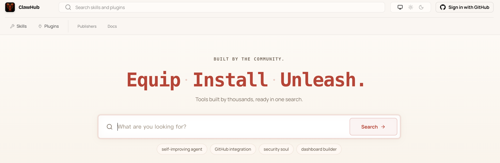
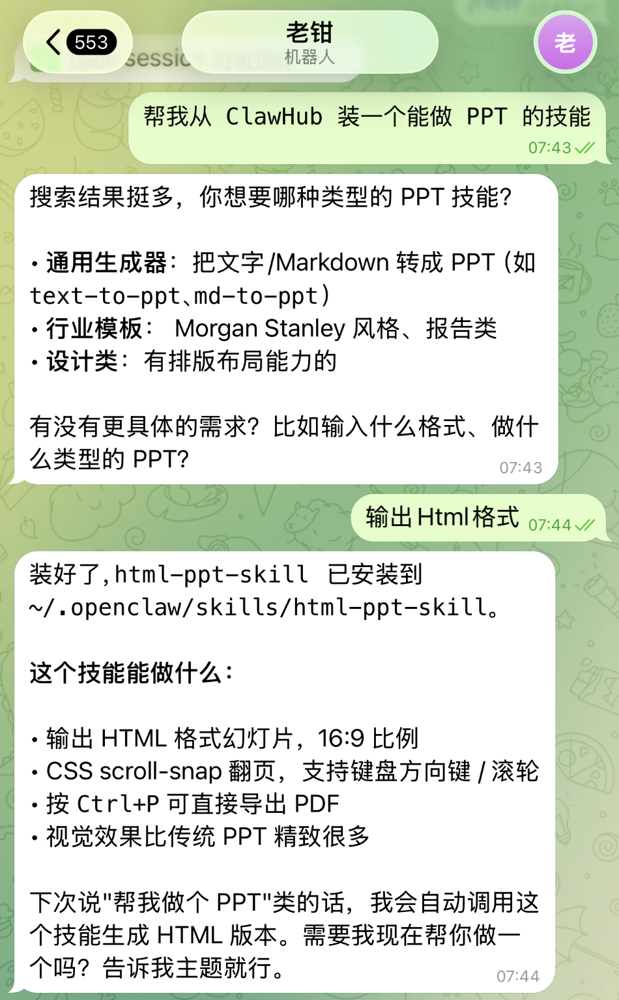
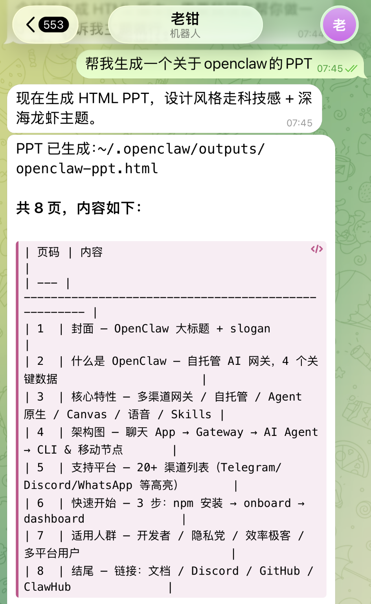
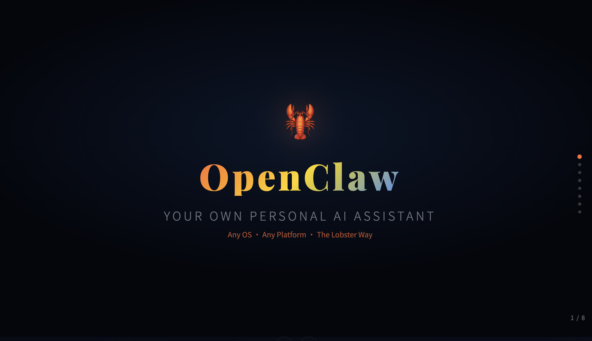
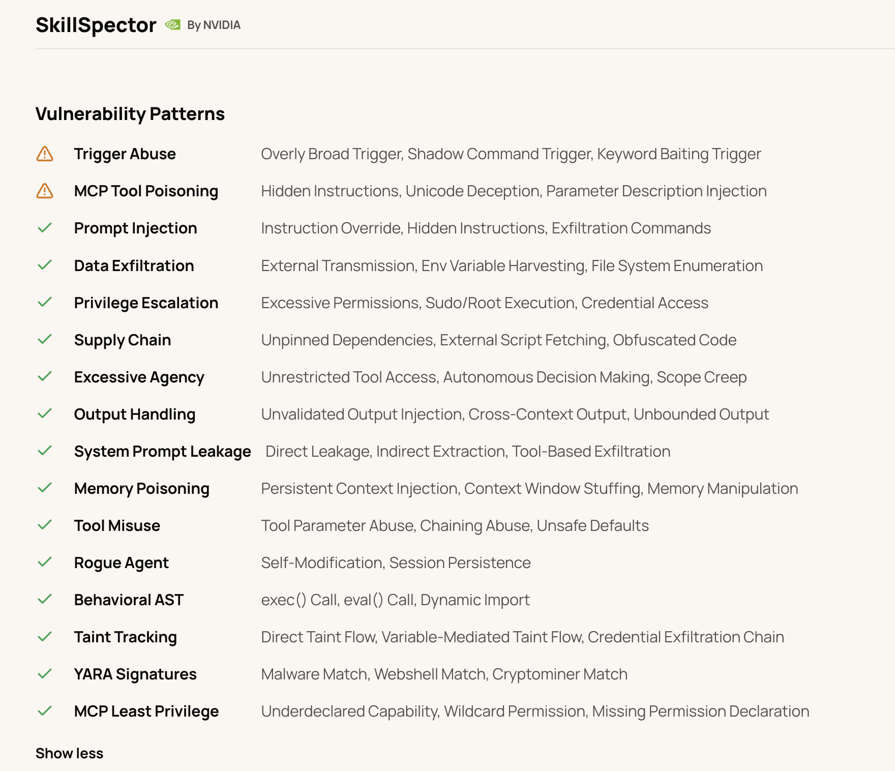
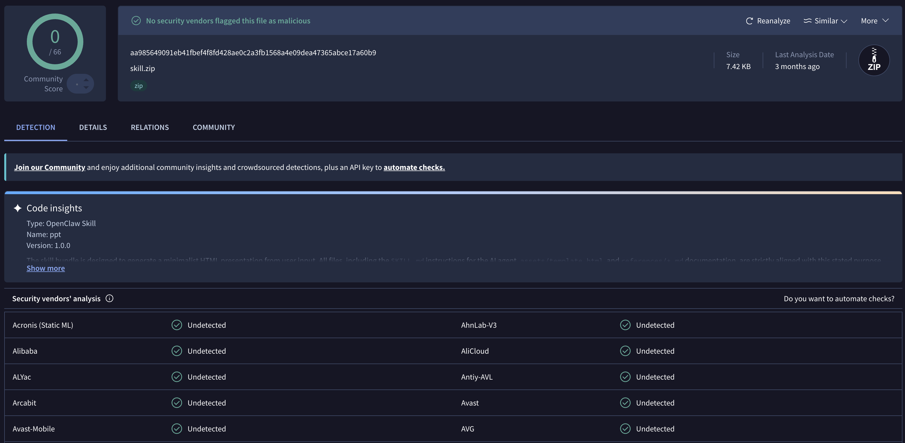
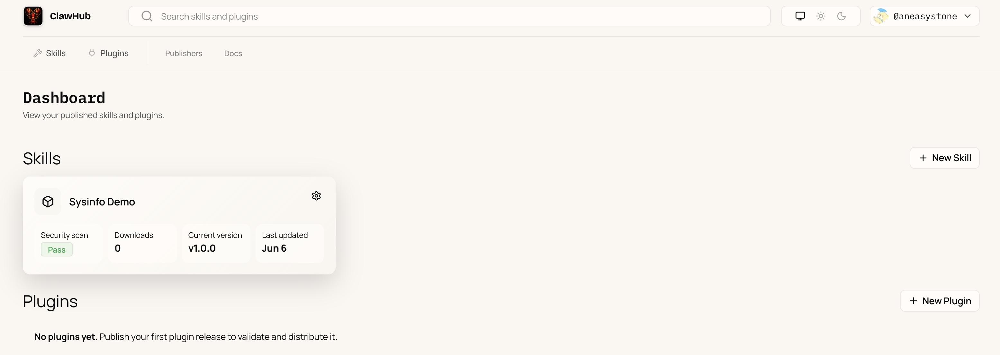

# 带小龙虾逛 ClawHub：自定义 Skill 实战

上一篇我们把 Skills 系统的基本盘讲完了：一份 `SKILL.md` 就是一份操作手册，仓库自带 53 个 skill，加上内置插件捎来的 14 个，开箱就有 67 个能用；加载时按优先级合并、按声明的依赖条件筛选，再把每个 skill 的「名字 + 描述 + 路径」拼成一段索引塞进系统提示，正文则由模型在命中后自己用 Read 工具按需加载。

但这 67 个终究是官方给的，对每个人的工作流来说都谈不上贴身。真正让 OpenClaw 生态贴近场景的，是**自定义 skill**，既包括别人写好放到第三方市场 ClawHub 上的，也包括你自己写出来的。今天我们就先带小龙虾去 ClawHub 上逛逛，挑一个 skill 装到本地试试；然后自己动手写一个最小可用的 sysinfo skill；最后把它发布回 ClawHub，让别人也能装来用。

## ClawHub 是什么

ClawHub 是 OpenClaw 官方的 skill 和 plugin 注册中心，站点是 [clawhub.ai](https://clawhub.ai)。



它在 OpenClaw 生态里的位置，类似 npm 之于 Node、PyPI 之于 Python：一个能公开浏览、版本化、可搜索的技能仓库。官方文档把 ClawHub 提供的能力归成下面这张特性表：

| 特性 | 说明 |
| --- | --- |
| 公开浏览 | skill 目录和 `SKILL.md` 全文都可以匿名公开查看 |
| 语义搜索 | 走 embedding 向量匹配，而不是只对关键词 |
| 版本管理 | 用语义化版本号管理，每次发布生成一个新版本，配带变更说明和标签 |
| 下载分发 | 每个版本一份 zip 包 |
| 社区反馈 | 支持收藏（star）和评论 |
| 安全扫描 | 详情页展示 SkillSpector 和 VirusTotal 安全扫描结果，安装前一眼可见 |
| 作者修复面板 | 被扫描扣留的版本，作者能在 `/dashboard` 看到并申诉复扫 |
| 复扫请求 | 误判时作者可以申请有限次数的复扫 |
| 人工审核 | 申请审核和审计流程 |
| CLI 友好的 API | 适合自动化和脚本调用 |

## 装一个 skill 试试

ClawHub 上的 skill 怎么装到本地呢？官方提供了两套 CLI 命令行工具，我们可以使用 CLI 手动搜索和安装，也可以直接和小龙虾对话，让它给你安装。

### 两个 CLI 工具

ClawHub 有两套官方 CLI 入口：

* **`openclaw skills`**：OpenClaw 自家命令族里的一个子命令，装 OpenClaw 时一并就有。负责搜索、安装、更新 ClawHub 上的 skill，外加查看本地 skill 状态（list / info / check）。
* **`clawhub`**：独立的 CLI 工具，靠 `npm i -g clawhub` 单独安装，覆盖 ClawHub 全部功能，除了上面那些不用登录就能做的搜索、安装类操作，还包括登录、发布、删除、复扫、同步等需要鉴权的写操作。

两者常用命令对照如下：

| 操作 | `openclaw skills` | `clawhub` | 备注 |
| --- | --- | --- | --- |
| 搜索 | `openclaw skills search "<query>"` | `clawhub search "<query>"` | 走向量语义搜索，不只匹配关键词 |
| 安装 | `openclaw skills install <slug>` | `clawhub install <slug>` | 默认装 `latest` 标签的版本，拉到 workspace 的 `skills/` 下 |
| 安装指定版本 | `openclaw skills install <slug> --version <ver>` | `clawhub install <slug> --version <ver>` | 想锁定某个旧版本时用 |
| 更新 | `openclaw skills update <slug>` | `clawhub update <slug>` | 按 `.clawhub/lock.json` 里的来源元数据重新拉新版本 |
| 全部更新 | `openclaw skills update --all` | `clawhub update --all` | 把 lock.json 里登记过的 ClawHub skill 一起升级 |
| 查看列表 | `openclaw skills list` | `clawhub list` | `openclaw skills list` 列本地全部 skill（bundled / managed / workspace）；`clawhub list` 只列从 ClawHub 装下来的 |
| 查看详情 | `openclaw skills info <slug>` | — | 看本地 skill 的来源、frontmatter 元数据、当前是否可用 |
| 验证 | `openclaw skills check` | — | 把本地所有 skill 的依赖条件挨个核对，不可用的列出来排障 |
| 登录 | — | `clawhub login` | 默认走浏览器授权；也可以 `--token <token>` 直接贴 API token |
| 发布 | — | `clawhub skill publish <path>` | 把本地 skill 目录推到 registry，生成新 semver 版本 |
| 删除 | — | `clawhub delete <slug> --yes` | 作者下架自己发布的 skill |
| 复扫 | — | `clawhub skill rescan <slug>` | 安全扫描误判时申请重扫（每个版本有次数限制） |
| 同步 | — | `clawhub sync` | 扫本地 skills 目录，把改过或新增的批量推上去，按内容 hash 比对，不重发 |

一般来说，安装别人写的 skill 两种 CLI 工具都可以，但 OpenClaw 自家的 `openclaw skills` 用起来更顺手一些，因为它还兼顾了 `list` / `info` / `check` 这些看本地状态、排查问题的操作，一个命令全部搞定。要自己往市场上发布 skill，就必须切到 `clawhub` 了，登录、发布、删除、同步这些写操作只它那边有。

来跑一遍直观感受下，比如我们想要找一个做 PPT 的技能，先搜：

```
$ openclaw skills search "ppt"

ppt  ppt  将用户讲稿一键生成乔布斯风极简科技感竖屏HTML演示稿...
hnytit-ppt-generator  河南油田工程科技PPT生成器  河南油田工程科技股份有限公司专属PPT制作技能...
...
```

然后选第一个安装：

```
$ openclaw skills install ppt

Downloading ppt@1.0.0 from ClawHub…
Installing to ~/.openclaw/workspace/skills/ppt…
Installed ppt@1.0.0 -> ~/.openclaw/workspace/skills/ppt
```

`openclaw skills install` 拉的就是 ClawHub 上对应 slug + 版本的 zip 包，解压到当前 workspace 的 `skills/` 目录下，并往 `.clawhub/lock.json` 里写一条来源记录。下次 `openclaw skills update --all` 时它就知道这份 skill 是从 ClawHub 来的、应该去哪里拉新版本。`clawhub install ppt` 的效果完全一致，只是走的是独立 CLI 的实现。

### 让小龙虾帮你装

除了 CLI 手动安装之外，OpenClaw 还提供了一种更顺手的玩法。仓库自带了一份名叫 `clawhub` 的 skill，作用就是把上面的 CLI 包装成大白话：你用人话告诉 agent「装个能做幻灯片的技能」，它自己去搜索、判断、调命令。skill 本身写得非常薄，frontmatter 里只声明依赖一个二进制：

```markdown
---
name: clawhub
description: Search, install, update, sync, or publish agent skills with the ClawHub CLI and registry.
metadata:
  {
    "openclaw":
      {
        "requires": { "bins": ["clawhub"] },
        "install":
          [
            { "id": "node", "kind": "node", "package": "clawhub", "bins": ["clawhub"], "label": "Install ClawHub CLI (npm)" }
          ],
      },
  }
---
```

正文部分就是一张 cheat sheet：search、install、update、list、publish 几个子命令各贴了一段示例。agent 加载这个 skill 后，看到用户说要装个能做幻灯片的技能，就知道该去跑 `clawhub install`。

先确认 CLI 装好了：

```
$ clawhub --cli-version
0.18.0

$ clawhub whoami
not logged in
```

匿名状态可以装公开 skill，发布才需要 `clawhub login`。回到 Telegram 或飞书的会话里，直接用大白话跟小龙虾说：



这背后就是 `clawhub` skill 驱动的，agent 实际做的事和你自己敲 `clawhub search` + `clawhub install` 完全等价。装完之后当前会话就能直接用，让它做一个 PPT 试试：



使用浏览器打开，一个 8 页的关于 OpenClaw 的 PPT 就做好了：



## 关于 skill 安全

通过上面的学习我们知道，从 ClawHub 上装一个 skill 又简单又方便，但方便里隐藏着风险。把别人写的 skill 装到本地，本质上就是在跑陌生人写的代码。2026 年以来，ClawHub 上就出过几起规模化投放恶意 skill 的真实事件，因此 skill 安全不能忽略。

ClawHub 的发布门槛刻意做得很低。按官方文档的说法，任何人都能上传 skill，唯一的限制是发布者的 GitHub 账号要至少注册满一周，这意味着市场里什么都有。OpenClaw 官方对第三方 skill 的态度也很明确：把它当作**未经审查的代码**看待，启用前一定要先读一遍。

为此，ClawHub 这边主要靠两道防线：**自动扫描**和**人工举报**。每个版本的详情页都挂着一行 Security audit 状态，点进去就是完整的审计报告，由两家扫描器并行出结果：

* **SkillSpector**：NVIDIA 出的安全检查工具，对 prompt 注入、数据外泄、权限提升、供应链风险、过度代理几类规则挨条做检查，命中哪条就在哪条上标红；



* **VirusTotal**：把 skill 的下载包丢进多家杀软引擎跑一遍，将结果汇总，量化判断有没有被投毒；



没过扫描的版本会从公开安装面下架，普通用户搜不到也装不了，只有作者自己能在 `/dashboard` 里看到被扣留的版本。如果作者觉得是误判，可以用前面命令表里的 `clawhub skill rescan <slug>` 申请重扫，每个版本有限次数，避免反复滥用。

第二道防线是人工举报。任何登录用户都能就某个版本发起举报，超过 3 个独立举报，该版本也会被自动隐藏。

最后，skill 装到本地之后，真正的安全其实还是在用户自己手里，可以对照着 skill 的 `metadata.openclaw.requires` 检查一遍，里面的 `bins` / `env` / `config` 是这份 skill 的权限申报，扫一眼看看合不合理。一个号称只做幻灯片的 skill，不该去读 `~/.openclaw/openclaw.json`，也不该往陌生 webhook 发数据。还拿不准的，丢进前面讲过的 sandbox 里跑一段时间再决定。

## 从零写一个 skill

装别人写好的 skill 我们已经讲完了，下面进入本篇的第二步，自己动手写一份。我们要写的这个叫 `sysinfo`，目标很朴素：用户随口问一句「这台机器现在剩余多少空间」、「内核是哪个版本」，agent 自动跑 `df` / `uname` 给个答案。

仓库里其实带了一个官方推荐的 `skill-creator` 技能，专门用来指导 agent 一步步创建新 skill：它会先跟你确认需求和触发场景，再生成目录骨架和 SKILL.md 模板，最后做校验和打包。你完全可以直接在 Telegram 或飞书里跟小龙虾说一句「帮我生成一个查系统信息的 skill」，它会按照 `skill-creator` 的说明，自动把 sysinfo 这份 skill 写出来。不过为了把 `SKILL.md` 的字段挨个过一遍，我们这次不靠它，**纯手写**一份只有一个文件的 skill。

第一步，在 workspace 里建目录：

```
$ mkdir -p ~/.openclaw/workspace/skills/sysinfo
```

第二步，写 `SKILL.md`，内容如下：

```markdown
---
name: sysinfo
description: "用 df / uname / uptime 报告本机的磁盘占用、内存、运行时间和系统信息。"
user-invocable: true
metadata:
  {
    "openclaw":
      {
        "emoji": "🖥️",
        "os": ["darwin", "linux"],
        "requires": { "bins": ["df", "uname", "uptime"] }
      }
  }
---

# sysinfo

当用户询问本机的磁盘空间、内存、运行时长、内核 / 操作系统版本，或者「这台机器现在状态怎么样」时，
通过 `exec` 工具运行对应命令，并用一两句话汇报结果。

## 命令对照

- 各挂载卷的磁盘占用：  `df -h`
- 内核和系统版本：       `uname -a`
- 运行时长与负载：       `uptime`

## 规则

- 总是先把原始命令打出来，再附一句简短总结，不要花哨格式化；
- 不要编造数字——命令失败就老实说；
- 拒绝任何需要 sudo 或会写入文件系统的请求。
```

### frontmatter 字段详解

上一篇介绍 `summarize` 的 SKILL.md 时已经讲过 name / description / emoji / requires.bins / install 几个字段的含义，sysinfo 这份例子里新引入的字段主要是两个：

1. **`user-invocable`**：设为 `true` 时，表示这个 skill 同时变成一个 slash command，用户可以直接 `/sysinfo 内核版本是什么` 强制调用，不用等模型自己判断；
2. **`metadata.openclaw.os`**：把 skill 限定在指定平台，`["darwin", "linux"]` 表示只在 macOS 和 Linux 上加载，跑在 Windows 上的 OpenClaw 就看不到；

除此之外，frontmatter 里还有几个常用字段虽然 sysinfo 没用到，也一并介绍一下：

**`requires.env`** 声明必须存在的环境变量，常用在依赖 API key 才能工作的 skill 上：

```json
"requires": { "env": ["OPENAI_API_KEY"] }
```

意思是环境变量里必须有 `OPENAI_API_KEY`，否则不启用该 skill。

**`requires.config`** 声明依赖的 OpenClaw 配置项必须开启：

```json
"requires": { "config": ["browser.enabled"] }
```

意思是 `openclaw.json` 里 `browser.enabled` 配置的值必须为真才会加载，常用在「依赖 browser 工具才能跑」「依赖某个插件启用了才能用」这类场景。

**`requires.anyBins`** 声明一组二进制里至少要有一个。比如某个跨平台截图 skill：

```json
"requires": { "anyBins": ["screencapture", "gnome-screenshot", "scrot"] }
```

三者有任意一个就算可用，解决 macOS / Linux 不同发行版工具名不一致的问题。

**`primaryEnv`** 声明这份 skill 默认从哪个环境变量取认证，让用户在 `openclaw.json` 里能用 `apiKey` 这个简写配 API key。比如仓库自带的 `gh-issues` 在 SKILL.md 里写了：

```json
"primaryEnv": "GH_TOKEN"
```

不声明 `primaryEnv` 时，用户得在 `openclaw.json` 里写完整的环境变量名：

```json5
{
  skills: {
    entries: {
      "gh-issues": {
        env: { GH_TOKEN: "ghp_xxx" },
      },
    },
  },
}
```

声明了 `primaryEnv` 之后，可以直接用 `apiKey` 简写：

```json5
{
  skills: {
    entries: {
      "gh-issues": {
        apiKey: "ghp_xxx",
      },
    },
  },
}
```

OpenClaw 在 skill 运行前会把这个值注入到 `GH_TOKEN` 环境变量里。此外，`apiKey` 比直接写 `env.<KEY>` 还多了一个好处：它能接 SecretRef 对象，从 keychain、1Password 这类密钥存储里取值：

```json5
{
  skills: {
    entries: {
      "gh-issues": {
        apiKey: { source: "keychain", provider: "default", id: "gh-token" },
      },
    },
  },
}
```

而 `env.<KEY>` 字段只接受明文。

### skill 验证

SKILL.md 写完之后，先让 OpenClaw 把它扫进来。skill 快照是按会话锁定的，所以新加的 skill 要么 `/new` 起个新会话，要么直接重启网关：

```
$ openclaw gateway restart
```

接着用 CLI 检查一遍，确认 skill 被识别到了，并且当前确实 eligible：

```
$ openclaw skills list --eligible | grep sysinfo

│ ✓ ready  │ 🖥️ sysinfo │ 用 df / uname / uptime │ openclaw-workspace │

$ openclaw skills info sysinfo

🖥️ sysinfo ✓ Ready

用 df / uname / uptime 报告本机的磁盘占用、内存、运行时间和系统信息。

Details:
  Source: openclaw-workspace
  Path: ~/.openclaw/workspace/skills/sysinfo/SKILL.md
  Visible to model: yes
  Available as command: yes

Requirements:
  Binaries: ✓ df, ✓ uname, ✓ uptime
  OS: ✓ darwin, ✓ linux
```

CLI 验证没问题之后，回到聊天窗口试两种触发方式：

```
# 模型自动触发
> 帮我看下这台机器现在还剩多少空间

# 用户显式触发
> /sysinfo 内核版本是什么
```

第一种走 description 匹配，第二种因为 `user-invocable: true` 直接以 slash command 命中，效果相同：agent 调一次 `exec`，把 `df -h` / `uname -a` 的原始输出附上一两句总结回给你。

## 把它发布到 ClawHub

sysinfo 已经在本地跑通了，下面把它发布到 ClawHub 上，让别人也能像我们前面装 ppt 那样一行命令装下来。发布这一步走独立的 `clawhub` 命令，我们先登录：

```
$ clawhub login

$ clawhub whoami
✔ aneasystone
```

`clawhub login` 默认走浏览器授权，也可以 `clawhub login --token <token>` 直接贴 token。登录后发布单个 skill：

```
$ clawhub skill publish ~/.openclaw/workspace/skills/sysinfo \
    --slug sysinfo-demo \
    --name "Sysinfo Demo" \
    --version 1.0.0 \
    --changelog "Initial release" \
    --tags latest
```

这里的 `--slug` 是市场上的唯一标识，sysinfo 已经存在了，因此我这里改成了 sysinfo-demo，发布成功后可以在 ClawHub 的 dashboard 中查看：



如果本地有一堆 skill 要一起处理，用 `clawhub sync --all` 扫一遍当前工作目录全量上传，它会按内容 hash 和 registry 比对，只发新增或有改动的。

发布后 ClawHub 会自动跑一遍安全扫描，扫描状态会显示在详情页上。如果误报了，作者可以在 dashboard 里申请有限次数的重新扫描，或者用 `clawhub skill rescan <slug>` 触发。

## 小结

回顾今天的内容，我们围绕自定义 skill 学习了如何从 ClawHub 上装别人写好的 skill、如何自己动手手写一份 skill、以及如何将自己写的 skill 发布回 ClawHub 市场。

前面提过的 `skill-creator` 虽然能让小龙虾按步骤帮你写 skill，但本质只是一份写作指导文档，触发权还在你手里；OpenClaw 还有个叫 Skill Workshop 的内置插件，方向反过来，每轮会话结束自动扫一遍历史消息，把可复用的流程沉淀成 workspace skill，下一篇我们就来看看它。

## 参考

* [OpenClaw 官方文档](https://docs.openclaw.ai/)
* [OpenClaw GitHub 仓库](https://github.com/openclaw/openclaw)
* [ClawHub 文档](https://docs.openclaw.ai/tools/clawhub)
* [Skills 系统文档](https://docs.openclaw.ai/tools/skills)
* [Creating skills 文档](https://docs.openclaw.ai/tools/creating-skills)
* [openclaw skills CLI 文档](https://docs.openclaw.ai/cli/skills)
* [ClawHub 公共注册中心站点](https://clawhub.ai)
* [AgentSkills 规范](https://agentskills.io)
* [anthropics/skills 官方 skill 仓库](https://github.com/anthropics/skills)
