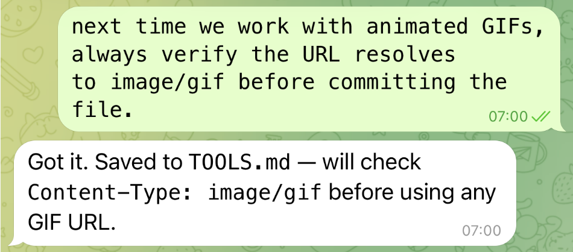
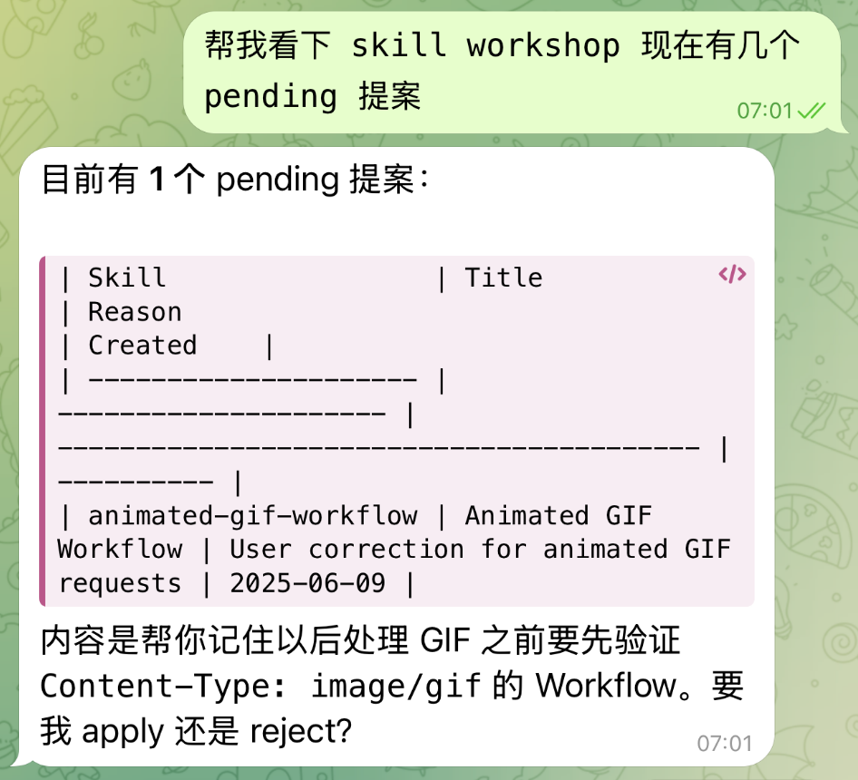
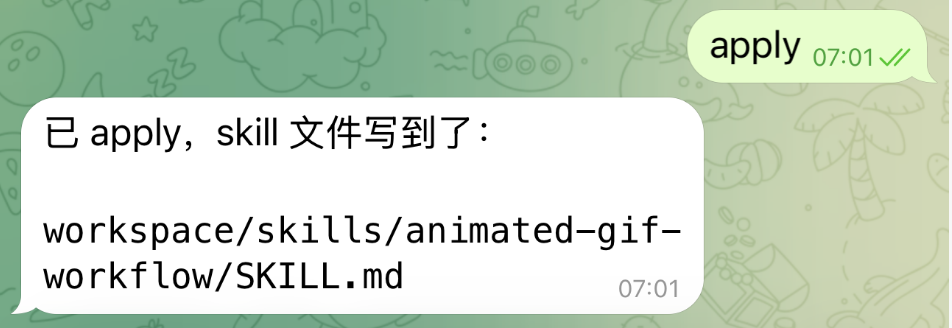
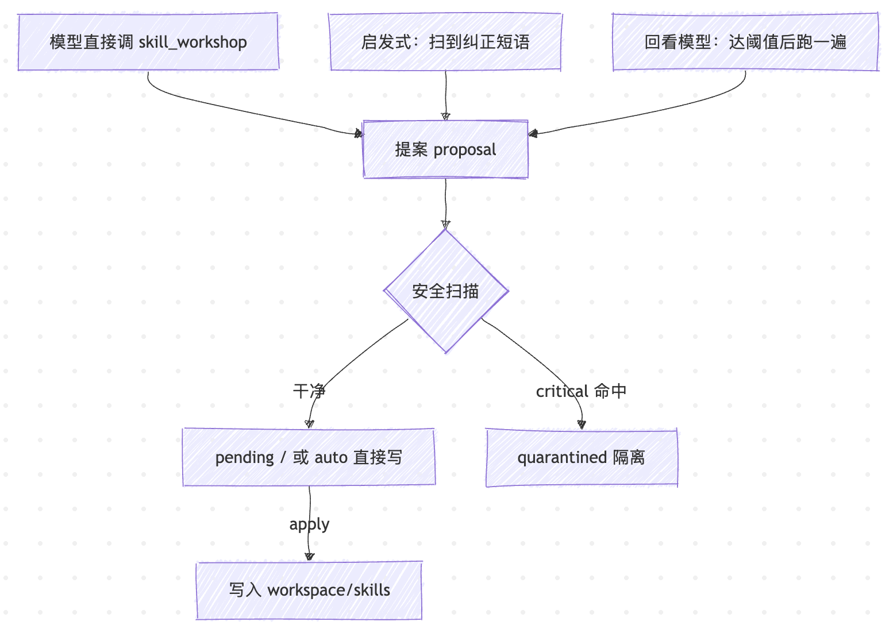

# 让小龙虾自己写手册：Skill Workshop

上一篇我们围绕自定义 skill 做了三件事：从 ClawHub 上搜索并安装别人的 skill、从零开始自己手写一份 skill、再把它发布回 ClawHub 让别人也能安装。三件事做下来你应该感觉到了，手写 skill 终究是个体力活，触发短语得自己琢磨、正文得自己组织、哪些步骤值得沉淀也得自己判断。前面提过的 `skill-creator` 能稍微帮你减负，但本质还是一份「按步骤填空」的写作指导，触发权和判断权都在你手里。

OpenClaw 有个实验性的内置插件叫 **Skill Workshop**，方向反过来：每轮成功的会话结束之后，它会自动扫一遍历史消息，把里面值得沉淀的可复用流程提议成一份 workspace skill，如果安全扫描通过就能直接写盘，让小龙虾把这一轮里学到的流程顺手写进**下一轮自己能用的手册**。

## 开启与配置

这是个**实验性**插件，默认关闭，需要你在配置文件里显式打开才会加载。打开 OpenClaw 的配置文件，在 `plugins.entries` 下加上这么一段：

```json5
{
  plugins: {
    entries: {
      "skill-workshop": {
        "enabled": true,
        "config": {
          "autoCapture": true,
          "approvalPolicy": "pending",
          "reviewMode": "hybrid"
        }
      }
    }
  }
}
```

改完保存后，再运行 `openclaw gateway restart` 重启网关让它生效。

这几个配置参数逐个看一下：

* `autoCapture: true` —— 让它在每轮成功对话结束后，自动扫一遍历史消息找可沉淀的东西；关掉的话它就不主动扫了，只有你开口让小龙虾「把这个存成 skill」时才会存。
* `approvalPolicy: "pending"` —— 它扫到觉得该存的东西时，不会直接写成文件，而是先攒成一条「提议」排进待办队列，等你审批通过后才真正落到磁盘上。建议先使用该配置，等你确认它提议得靠谱了，再换成 `auto` 让它跳过审批、自己直接写。
* `reviewMode: "hybrid"` —— 用哪种方式去发现可沉淀的内容，一共四挡：`off` 完全不自动找，`heuristic` 只靠关键词扫描，`llm` 让模型回看一遍整段对话，`hybrid` 则是前两者一起上。新手用 `hybrid` 就行，几挡的差别后面讲。

因为还在实验阶段，它的内部行为各版本之间可能会变，所以**第一次用务必先 pending 模式，亲眼看几轮它都想存些什么**，别一上来就让它自动写文件。

这几个参数取不同的值，能搭出好几种不同的组合，对应不同的使用场景：

```json5
// 保守：只接受模型显式调工具，关闭一切自动捕获
{ autoCapture: false, approvalPolicy: "pending", reviewMode: "off" }

// 评审优先（推荐）：自动捕获，但都先排队等审批
{ autoCapture: true,  approvalPolicy: "pending", reviewMode: "hybrid" }

// 受信自动化：本地工作区里安全提案自动写盘
{ autoCapture: true,  approvalPolicy: "auto",    reviewMode: "hybrid" }

// 省钱：不跑回看模型，只认显式纠正短语
{ autoCapture: true,  approvalPolicy: "pending", reviewMode: "heuristic" }
```

除了上面这四个，还有几个调阈值、限大小的配置项，第一次上手用不到，附在这里备查：

| 键 | 默认 | 范围 | 作用 |
| ---- | ---- | ---- | ---- |
| `reviewInterval` | `15` | 1..200 | 累计多少轮成功对话后跑一次回看模型 |
| `reviewMinToolCalls` | `8` | 1..500 | 累计多少次工具调用后跑回看模型 |
| `reviewTimeoutMs` | `45000` | 5000..180000 | 回看模型单次运行的超时 |
| `maxPending` | `50` | 1..200 | 每工作区最多保留多少提案 |
| `maxSkillBytes` | `40000` | 1024..200000 | 生成的 skill / 支持文件单文件大小上限 |

## 实战 Skill Workshop

插件启用之后，这一节我们手动走一遍完整流程，亲眼看它怎么把一句话变成一份 skill。整个过程就三件事：在对话里说一句带「纠正口吻」的话、看看提案有没有进队列、再把它 apply 落地。

### 说一句带「纠正口吻」的话

第一步，造一段能被插件捕到的对话。插件会盯着你消息里有没有 `next time` / `always` / `from now on` 这类纠正口吻（完整短语列表后面会讲），命中了就尝试把它沉淀成 skill。注意这些短语得出现在**用户消息**里，小龙虾回复里出现不算。比如：

```
next time we work with animated GIFs, always verify the URL resolves
to image/gif before committing the file.
```

小龙虾会正常回复：



但是在回复之后自动触发 skill workshop 插件，对当前会话进行沉淀。

### 查看提案队列

第二步，看队列里进东西没有。在同一会话或新会话里跟小龙虾说一句：

```
> 帮我看下 skill workshop 现在有几个 pending 提案
```

小龙虾会调 `skill_workshop` 工具，参数是 `{ "action": "list_pending" }`，把待审队列列出来，大致这样：



如果查看 Control UI 中的对话详情，可以看到工具调用结果如下：

```json
[
  {
    "id": "1548054d-4aa2-493d-a1f5-96409a4e56be",
    "createdAt": 1780959647860,
    "updatedAt": 1780959647860,
    "workspaceDir": "~/.openclaw/workspace",
    "agentId": "main",
    "sessionId": "161be786-5ac8-439c-ab61-245fa0bdbb56",
    "skillName": "animated-gif-workflow",
    "title": "Animated GIF Workflow",
    "reason": "User correction for animated GIF requests",
    "source": "agent_end",
    "status": "pending",
    "change": {
      "kind": "create",
      "description": "Reusable workflow notes for animated GIF requests.",
      "body": "# Animated GIF Workflow\n\n## Workflow\n\n- next time we work with animated GIFs, always verify the URL resolves to image/gif before committing the file.\n- Verify the result before final reply.\n- Record durable pitfalls as short bullets; avoid copying transcript noise."
    },
    "scanFindings": []
  }
]
```

这条记录里有几个字段值得注意。

先看 `status`：它是 `pending`，说明此刻**还没创建任何 skill 文件**，这只是一条排在待审队列里的**提议**，真正写盘要等下一步 `apply`。

再看 `skillName`：插件从你那句话里识别出 `animated GIFs`，给这条提议起了个现成的名字 `animated-gif-workflow`。OpenClaw 内置了一张话题映射表，把几类常见话题各对到一个固定的 skill 名：

| 用户话里出现 | 落到的默认 skill 名 |
| --- | --- |
| `animated` / `gif` | `animated-gif-workflow` |
| `screenshot` / `screen capture` / `asset` / `imageoptim` | `screenshot-asset-workflow` |
| `qa` / `scenario` / `test plan` | `qa-scenario-workflow` |
| `pr` / `pull request` / `github` | `github-pr-workflow` |
| 其它都进兜底名称 | `learned-workflows` |

你这句话里有 `animated GIFs`，命中第一行，自然就归到 `animated-gif-workflow`；要是一句话谁都不沾，就统一落到 `learned-workflows` 这个兜底名称。注意这只是**这份 skill 将来 apply 后会用的目录名**，现在还只是提议里的一个建议值。

另外还有个 `source` 字段，表示这个提案是从哪冒出来的，它的取值有：`tool`（你或模型显式调工具生成）、`agent_end`（自动扫到纠正口吻）、`reviewer`（回看模型产出），正好对应插件捕获提案的三条路径，后面「三条捕获路径」一节会拆开讲。

### 应用 skill 提案

第三步，把它应用：



OpenClaw 会调用下面的工具：

```json
// skill_workshop({ "action": "apply", "id": "1548..." })
```

应用成功后，自动生成 `<workspace>/skills/animated-gif-workflow/SKILL.md` 文件。关键的一点是：所有写入都会**立刻刷新内存里的 skills 快照**，新 skill 不用 `/new` 也不用重启网关就能在当前会话被看到。

如果觉得这个提案不够好，就拒绝：

```json
// skill_workshop({ "action": "reject", "id": "1548..." })
```

被拒的提案状态变成 `rejected`，留在状态文件里供审计。

## 工具用法速查

跑通之后你会发现，整个生命周期其实都是围绕 `skill_workshop` 这个工具撑起来的。它的 action 一共八个：

| action | 用途 |
| --- | --- |
| `status` | 统计当前工作区里各个状态（pending / applied / rejected / quarantined）的提案各有多少条 |
| `list_pending` | 列出待审队列里的提案，默认只看 pending，也可以传 `status` 换成查看其它状态 |
| `list_quarantine` | 列出被安全扫描拦下、隔离起来的提案 |
| `inspect` | 按 `id` 查看某一条提案的完整详情 |
| `suggest` | 由模型主动提交一条新提案，pending 策略下默认入队等审批 |
| `apply` | 把某一条 pending 提案应用掉，真正把 skill 文件写到磁盘上 |
| `reject` | 拒掉某一条提案，状态改为 rejected 但保留在记录里 |
| `write_support_file` | 往 skill 目录下的支持目录写一份支持文件（如 `references/`、`scripts/`） |

其中大部分都比较简单，只有 `suggest` 和 `write_support_file` 值得单独讲下。

`suggest` 是模型主动建议的入口，比自动捕获更精确。一个完整的 `suggest` 长这样：

```json
{
  "action": "suggest",
  "skillName": "animated-gif-workflow",
  "title": "Animated GIF Workflow",
  "reason": "User established reusable GIF validation rules.",
  "description": "Validate animated GIF assets before using them.",
  "body": "## Workflow\n\n- Verify the URL resolves to image/gif.\n- Confirm it has multiple frames.\n- Record attribution and license.\n- Avoid hotlinking when a local asset is needed."
}
```

上面例子用的是基础参数，默认走 `create` 模式新建一份 skill 文件。除此之外 `suggest` 还有几个额外参数，用来切换写入方式或绕开审批策略：

* `apply` —— 强制指定写不写盘，绕开当前的 `approvalPolicy`。`apply: true` 在 pending 策略下也**强行立即写**（仍然要过安全扫描）；反过来 `apply: false` 在 auto 策略下也**强行只入队**。
* `section` —— 传了它就切到 `append` 模式，把 `body` 追加到已有 skill 的指定 section 下，而不是新建。
* `oldText` + `newText` —— 这俩一起传就切到 `replace` 模式，把 skill 正文里的 `oldText` 精确替换成 `newText`（要求 `oldText` 在文件里**唯一存在**，否则会拒绝）。

`write_support_file` 用于往 skill 目录下的支持目录写一份支持文件，要知道，skill 不止是 `SKILL.md` 一份文件，它可以带 `references/`、`templates/`、`scripts/`、`assets/` 这四种支持目录，支持目录里的内容不会自动进 prompt，只在 `SKILL.md` 正文显式引用时被小龙虾 Read 进来。这条命令就是让 Workshop 把 skill 写到一个比 `SKILL.md` 更深的位置：

```json
{
  "action": "write_support_file",
  "skillName": "release-workflow",
  "relativePath": "references/checklist.md",
  "body": "# Release Checklist\n\n- Run release docs.\n- Verify changelog.\n"
}
```

和写 `SKILL.md` 一样，这条命令也守着同一套安全约束：写入位置被严格限定在 workspace 目录内、不许越界，文件大小受 `maxSkillBytes` 限制，内容同样要过一遍安全扫描，最后再原子落盘，不会写到一半留下半截文件。

## 三条捕获路径

前面讲 `source` 字段时提到，一条提案可能从三条不同的路径冒出来（`tool` / `agent_end` / `reviewer`）。这一节就把这三条路径拆开：



**1. 工具显式建议**：模型看到一段可复用流程、或用户明说「把这个存成 skill」时，直接调 `skill_workshop` 工具。这是最显式的一条，`autoCapture: false` 也能用，是关掉自动捕获时唯一的入口。

**2. 启发式捕获**：`autoCapture` 开 + `reviewMode` 含 `heuristic` 时，插件会扫成功那一轮对话里用户消息中的明确纠正短语（也就是上面实战里说的那句话能被捕到的原因）。这套短语列表是写死在 `extensions/skill-workshop/src/signals.ts` 里的：

```js
const CORRECTION_PATTERNS = [
  /\bnext time\b/i,
  /\bfrom now on\b/i,
  /\bremember to\b/i,
  /\bmake sure to\b/i,
  /\balways\b.{0,80}\b(use|check|verify|record|save|prefer)\b/i,
  /\bprefer\b.{0,120}\b(when|for|instead|use)\b/i,
  /\bwhen asked\b/i,
];
```

命中之后，会根据内置的那张话题映射表给提案起名，就是前面实战里见过的（`animated`/`gif` → `animated-gif-workflow`，其它一律进 `learned-workflows` 兜底），这里不再重复。

**3. 回看模型（LLM reviewer）**：`reviewMode` 含 `llm` 时，攒够阈值（默认 15 轮成功对话或 8 次工具调用）后，起一次紧凑的内嵌回看。这里的「回看模型」其实就是**当前对话用的那个模型**，起一次独立子调用，重新审一遍对话。这次调用有几个限制：

* 输入只喂最近 12,000 字对话记录、最多 12 个已有 skill（每个截到 2,000 字）；
* 不给它任何工具；
* 只允许输出 JSON 格式；

模型返回结果只能是 `{"action":"none"}` 或一个提案对象：

```json
{
  "action": "create",
  "skillName": "media-asset-qa",
  "title": "Media Asset QA",
  "reason": "Reusable animated media acceptance workflow",
  "description": "Validate externally sourced animated media before product use.",
  "body": "## Workflow\n\n- Verify true animation.\n- Record attribution.\n- Store a local approved copy.\n- Verify in product UI before final reply."
}
```

其中 `action` 可以是：`create` 建新 skill、`append` 往现有 skill 加 section、`replace` 替换段落里的精确字符串。

## 安全扫描兜底

在实战里，我们已经见过提案的三种状态：`pending`（在队列里排队待批）、`applied`（应用后已写入磁盘）、`rejected`（被你手动拒掉）。其实还有第四种 `quarantined`（被安全扫描拦下隔离），这一节我们就来看下它。

生成 `SKILL.md` 和支持文件落盘前会先经过安全扫描，这个扫描器**不是模型，而是一组写死的正则规则**。规则分两档：命中 critical 的提案直接隔离；命中 warn 的只记录，不拦截。

五条 critical 规则（命中即隔离）：

* **`prompt-injection-ignore-instructions`** —— 匹配「ignore all/previous instructions」这类经典的越权开场白。skill 正文里如果出现「忽略上面/之前的所有指令」，摆明了是想覆盖更高优先级的系统指令。
* **`prompt-injection-system`** —— 匹配「system prompt」「developer message」「hidden instructions」这些字眼。正经的流程 skill 没理由去提隐藏 prompt 指令，如果提了八成是想撬动或套出上层指令。
* **`prompt-injection-tool`** —— 匹配「调用某工具……无需……许可/审批」这种句式，也就是怂恿小龙虾绕过工具审批关。
* **`shell-pipe-to-shell`** —— 匹配 `curl https://... | sh` 这种命令，把远程脚本直接输入 shell 运行，等于让小龙虾执行陌生代码。
* **`secret-exfiltration`** —— 匹配同一句里既出现 `env` / `process.env`、又出现网络动作（`fetch` / `curl` / `http` 等）的情况，大概率是想把环境变量里的密钥往外发。

两条 warn 规则（只记录、不拦截）：

* **`destructive-delete`** —— 匹配 `rm -rf /`、`rm -rf ~` 这种冲着根目录 / 家目录 / 当前目录去的大范围删除。不直接拦，是因为正常的清理脚本也可能这么写，留给人工判断。
* **`unsafe-permissions`** —— 匹配 `chmod 777` / `chmod -R 777` 这种把权限全部放开的危险操作，同样只记录、不拦截。

这里 OpenClaw 为什么用死正则、不用模型呢？我想可能有三方面原因：一是**确定性**，同样的内容每次扫结果一样，使用模型的话不够稳定；二是**零成本零延迟**，每次写盘都过一遍也不占 token、速度也很快；三是**不会被反将一军**，它本来就是防 prompt injection 自我投毒的最后一道闸，要是它自己也是个模型，反倒有可能被同一波注入策反。

> 注意：这里的三条 prompt-injection 规则全是英文关键词（`ignore ... instructions` / `system prompt` / `... tool ... without approval`），用中文写的注入话术，比如「忽略以上所有指令」「调用工具无需审批」，它就失效了。

## 小结

今天我们学习了 skill 系列的第三篇，通过 Skill Workshop 让小龙虾在每轮对话后，把可复用流程沉淀成 workspace skill。这也是整个系列的最后一篇，回头看这一路，我们其实是按一个由浅入深的顺序，把一只小龙虾从「只会说话」一点点养成了「能干活、可扩展」的个人 AI 助手。

最开始是**接入**，我们把它装起来，接上 Telegram 和飞书，让它能在你天天用的聊天软件里收发消息；接着是**自动化**，靠 cron、heartbeat、webhook、standing orders 这些机制，让它不用你每次戳一下才动，而是能按时间按事件自己运行起来。再往后是**协作与隔离**，我们给它配齐了后台任务、多 agent 与子 agent、沙箱、远程网关，还有 macOS 和手机上的 Node，让它既能分身同时干好几件事，又能被安排到该跑的机器上、关进该关的沙箱里。

接着，我们学习它的**手脚**，从内置工具体系，到浏览器 `browser` 工具，再到能把活转派给外部编码 agent 的 ACP，学习了它能调动的各种能力。最后这几篇则落在**手册**上，先学习了 skill 的基本原理，然后是通过 ClawHub 安装别人的 skill 以及怎么把自己的 skill 发布出去，再到今天这篇 Skill Workshop，教它怎么在干活的过程中给自己写手册。

走到这里，小龙虾已经不是一个只会回消息的 bot，而是一个有手有脚、有手册、还能在干活中自我升级的 agent。

这个系列就到这里。感谢一路读到最后，现在，去给你自己的小龙虾配齐工具箱吧。

## 参考

* [OpenClaw 官方文档](https://docs.openclaw.ai/)
* [OpenClaw GitHub 仓库](https://github.com/openclaw/openclaw)
* [Skill Workshop 插件文档](https://docs.openclaw.ai/plugins/skill-workshop)
* [Skills 系统文档](https://docs.openclaw.ai/tools/skills)
* [Creating skills 文档](https://docs.openclaw.ai/tools/creating-skills)
* [Plugins 总览](https://docs.openclaw.ai/tools/plugin)
* [Skill Workshop 插件源码](https://github.com/openclaw/openclaw/tree/main/extensions/skill-workshop)
