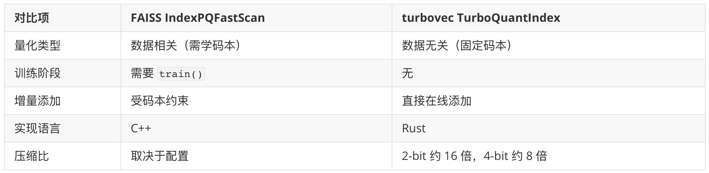
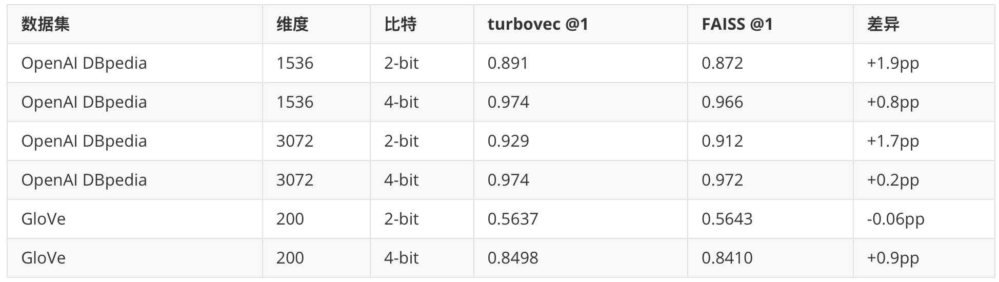
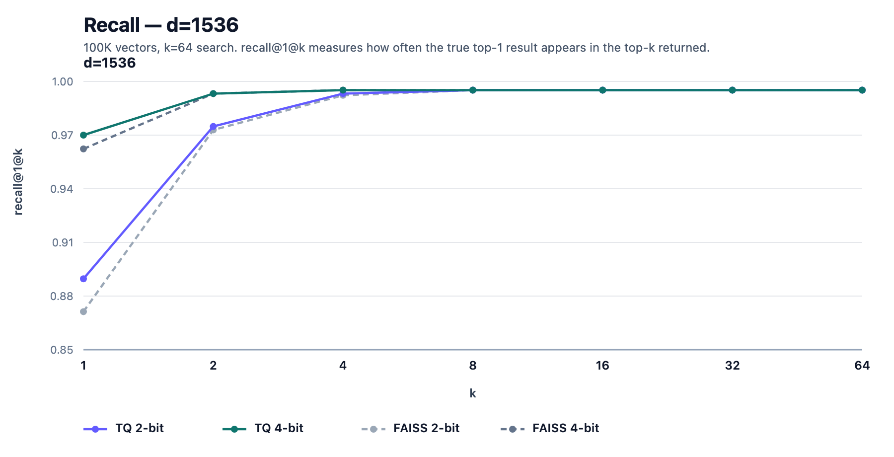
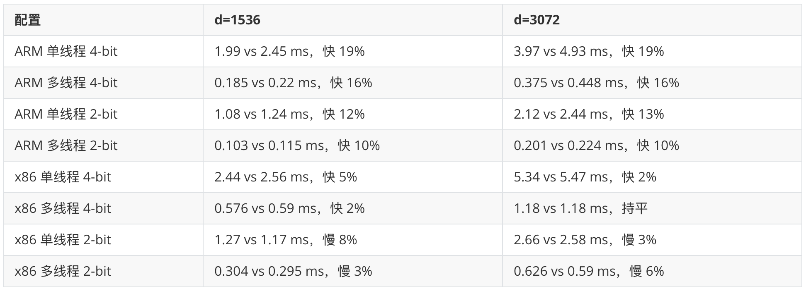
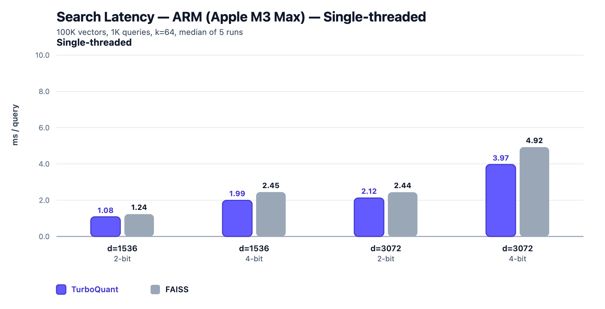
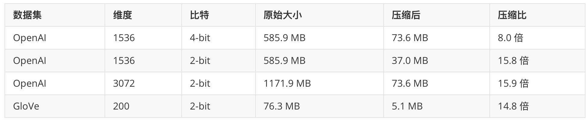

# turbovec 快速入门

做 RAG 的朋友多半都算过这样一笔账：一条 768 维的 embedding 向量，用 float32 存就是 `768 × 4 = 3072` 字节，正好 3 KB；语料攒到 1000 万条，光向量就要占 31 GB 内存。768 维是开源模型很常见的维度，BGE 的 `bge-base-zh-v1.5`、Sentence Transformers 的 `all-mpnet-base-v2` 都是这个规格。换更高维的模型，这笔账还要成倍往上涨：BGE-M3 是 1024 维（41 GB），OpenAI 的 `text-embedding-3-small` 是 1536 维（61 GB），`text-embedding-3-large` 到了 3072 维，直接奔 123 GB 去了。对于做 RAG 的团队来说，光是把向量塞进内存就是一笔不小的开销，更别提还要留余量给检索本身。

常见的解法是**向量量化（vector quantization）**，用更少的比特近似表示每个向量，FAISS 的 **Product Quantization（PQ）**就是这条路线的代表。不过 PQ 是有代价的：建索引前要先用一批代表性数据训练码本，语料分布变化大了还可能要重训。今天我们要介绍的主角 —— [turbovec](https://github.com/RyanCodrai/turbovec)，走了一条不一样的路。它是一个用 Rust 实现、带 Python 绑定的向量索引库，核心算法来自 Google Research 的 **TurboQuant** 论文（[arXiv:2504.19874](https://arxiv.org/abs/2504.19874)，已被 ICLR 2026 接收），不需要训练，也不需要重建，向量加进去就能搜。


它的项目首页放了一句颇有冲击力的话：

> A 10 million document corpus takes 31 GB of RAM as float32. turbovec fits it in 4 GB - and searches it faster than FAISS.

这里的 31 GB 正是我们开头算的那笔账：1000 万条 768 维向量，用 float32 存要占 31 GB 内存，turbovec 能把它压到 4 GB，而且检索速度比 FAISS 还快。4 GB 是这么来的：TurboQuant 算法把每个坐标从 float32 的 32 bit 量化到 2~4 bit，压缩 8~16 倍，31 GB 的数据 4-bit 量化后约 3.9 GB；如果用 2-bit 还能再减半，只剩 2 GB 不到。正是由于它内存占用小、速度又快，最近几个月接连被几家海外科技媒体报道。


它的几个核心特性是：

* **在线量化（online quantization）**：添加向量即建索引，没有单独的训练阶段，也不需要随语料增长重建索引
* **比 FAISS 更快**：手写 NEON（ARM）、AVX2 / AVX-512BW（x86）三路 SIMD 内核，运行时自动选择，ARM 上所有配置比 FAISS 的 `IndexPQFastScan` 快 10%~19%
* **搜索时过滤**：`search()` 支持传入 id allowlist 或 bitmask，量化内核直接在块级别处理过滤，做混合检索时不用先取后筛
* **纯本地运行**：不依赖托管服务，数据不出本机或 VPC，配合任意开源 embedding 模型就能搭一套完全离线的 RAG 栈

## 与 FAISS 的对比定位

[FAISS](https://github.com/facebookresearch/faiss) 是向量检索领域的老牌选手，由 Meta 开源，功能非常全。turbovec 没有想做一个大而全的库去取代 FAISS，它的对标对象很明确，就是 FAISS 里走量化快速扫描路线的 `IndexPQFastScan`。

两者最核心的差别在于**有没有训练阶段**。

FAISS 的 PQ 是**数据相关（data-dependent）**的量化。它需要先用一批代表性数据跑 `train()`，学出一套码本（codebook），之后才能 `add()` 向量、`search()` 查询。码本学得好不好，直接影响召回质量；语料分布变化大了，码本还可能要重学。

turbovec 用的 TurboQuant 是**数据无关（data-oblivious）**的量化。它的思路是：先对输入向量做一次随机正交旋转，旋转之后每个坐标会服从一个集中的 Beta 分布；在高维空间里不同坐标近似独立，于是可以对每个坐标独立套用一个最优标量量化器。整个过程不依赖具体数据，所以**不需要训练、不需要学码本**，向量加进去就直接建好了索引。

它们两在使用上的主要差别如下表所示：



> 数据无关并不意味着 turbovec 完全不看数据。它在第一次 `add()` 时会做一次 TQ+ 校准，从首批向量里学一组 per-coord 的微调参数，但只学这一次，之后不再变。这部分细节我们留到后面讲量化算法的文章里展开。

## 安装

turbovec 同时面向 Python 和 Rust 用户。Python 这边直接 pip 安装：

```bash
$ pip install turbovec
```

它通过 [maturin](https://github.com/PyO3/maturin) 把 Rust 核心编译成原生扩展，再用 [PyO3](https://pyo3.rs/) 做绑定，所以装好之后就是一个普通的 Python 包，不需要额外的运行时。

> PyO3 是 Rust 生态里最主流的 Python 绑定库，它处理了两种语言之间的类型转换、内存管理和 GIL 交互，让你可以用 Rust 编写原生的 Python 扩展模块，也可以反过来在 Rust 程序里调用 Python 代码。maturin 则是与之配套的构建工具，能把基于 PyO3 的 Rust crate 打包成标准的 wheel 并发布到 PyPI，本地开发时一条 `maturin develop` 就能编译并装进当前虚拟环境。这套 Rust + PyO3 + maturin 的工具链如今在 Python 生态里相当流行，[pydantic-core](https://github.com/pydantic/pydantic-core)、[polars](https://github.com/pola-rs/polars) 等明星项目用的都是它。

如果你是 Rust 用户，想直接在自己的工程里用核心库，则用 cargo 添加依赖：

```bash
$ cargo add turbovec
```

下面的体验主要以 Python 为例。

## 基础用法体验

我们从最简单的场景开始：建索引、添加向量、查询。这里用 numpy 生成一批随机向量来演示，实际项目里把它换成 OpenAI、BGE 之类模型产出的 embedding 即可。

### 建索引与添加向量

```python
import numpy as np
from turbovec import TurboQuantIndex

# 维度 1536（对齐 OpenAI text-embedding-3-small），4-bit 量化
index = TurboQuantIndex(dim=1536, bit_width=4)

# 假设这是一批文档向量，实际中来自 embedding 模型
vectors = np.random.randn(10000, 1536).astype(np.float32)
index.add(vectors)

# 还能继续增量添加，不需要重建
more_vectors = np.random.randn(5000, 1536).astype(np.float32)
index.add(more_vectors)

print(len(index))   # 15000
```

可以看到，整个流程没有 `train()` 这一步，`add()` 完就能用。两次 `add()` 之间也不需要做任何额外处理，这就是在线量化带来的便利。

构造函数有两个关键参数：

* **dim**：向量维度。也可以传 `None` 做惰性构造，等第一次 `add()` 时再根据数据确定维度
* **bit_width**：每个坐标量化用的比特数，可选 `2`、`3`、`4`，默认 `4`。这是使用 turbovec 时最需要权衡的参数：比特数越低，索引越小，但量化损失越大、检索的召回率也越低。一般 4-bit 是多数场景的默认选择；内存极度敏感、可以接受召回率略降时用 2-bit；3-bit 则是介于两者之间的折中。两者在召回率和压缩比上的具体差距，后面性能一节有实测数据

### 查询

添加完向量后，用一个查询向量做检索：

```python
# 查询也要是二维的，1 条查询就是形状 (1, 1536)
query = np.random.randn(1, 1536).astype(np.float32)

# 返回 top-10 的分数和下标
scores, indices = index.search(query, k=10)

print(indices[0])   # 命中的向量下标
print(scores[0])    # 对应的相似度分数
```

要注意的是，`search()` 是批量接口，接收形状为 `(n_queries, dim)` 的二维数组，单条查询也要写成 `(1, dim)` 的形式，直接传一维向量会报 `TypeError`。返回的 `scores` 和 `indices` 同样是二维的，形状为 `(n_queries, k)`，`scores` 是相似度分数，`indices` 是命中向量在索引中的下标，单条查询取第 0 行即可。

### 持久化

索引可以写到磁盘，之后再加载回来，省去重新建索引的开销：

```python
index.write("my_index.tv")

loaded = TurboQuantIndex.load("my_index.tv")
scores, indices = loaded.search(query, k=10)
```

`.tv` 是 turbovec 的索引文件格式，当前为 v3 版本，带 magic 头和版本号。

### IdMapIndex：稳定 ID

`TurboQuantIndex` 返回的是内部下标，删除向量后下标会变。如果你需要给每个向量挂一个稳定的外部 ID（比如数据库主键），用 `IdMapIndex`：

```python
import numpy as np
from turbovec import IdMapIndex

index = IdMapIndex(dim=1536, bit_width=4)

# 3 条向量，配上 3 个业务侧的 uint64 ID
docs = np.random.randn(3, 1536).astype(np.float32)
index.add_with_ids(docs, np.array([1001, 1002, 1003], dtype=np.uint64))

scores, ids = index.search(query, k=10)   # 返回的是你的 uint64 外部 ID
index.remove(1002)                         # 按 ID 删除，O(1)
print(1002 in index)                       # False，支持成员判断

index.write("my_index.tvim")
loaded = IdMapIndex.load("my_index.tvim")
```

`IdMapIndex` 的 `search()` 返回的 `ids` 就是你传入的外部 ID，`remove()` 按 ID 删除且是 O(1) 操作。它还支持 `id in index` 这样的成员判断。持久化用的是单独的文件格式 `.tvim`，和 `TurboQuantIndex` 的 `.tv` 互相区分。`IdMapIndex` 也是后面做混合检索过滤的基础，相关内容我们下一篇再细看。

## 性能数字

下面我们来看仓库给出的几组基准数据。速度基准的对比对象是 FAISS 的 `IndexPQFastScan`，召回率基准的对比对象是 FAISS 的 `IndexPQ`，并且把 PQ 的参数调到让两边压缩后的索引大小完全相同，保证是在同等存储预算下比召回率。数据集用了 ann-benchmarks 的 GloVe d=200，以及 DBpedia 子集的 OpenAI embeddings d=1536 / 3072，各 10 万向量。下面引用的数字均取自仓库 `benchmarks/results/` 目录下的 JSON 文件。

> [ann-benchmarks](https://github.com/erikbern/ann-benchmarks) 是近似最近邻搜索领域最常用的基准测试套件，收录了 GloVe、SIFT 等一批标准数据集，并对主流 ANN 库做统一评测，论文和开源项目做性能对比时基本都会引用它。[DBpedia](https://www.dbpedia.org/) 是一个从维基百科抽取结构化信息构建的开放知识库，这里用的是它的文本条目经 OpenAI embedding 模型向量化后得到的数据集，向量维度高、语义真实，常用来评测接近生产场景的检索效果。

### 召回率

召回率（recall）衡量的是量化后检索结果跟精确检索的吻合程度。下表是 Recall@1 的对比（10 万向量）：



> 表头的 @1 是 Recall@k 记号在 k=1 时的写法：只看第 1 个返回结果，统计它命中真实最近邻的查询占比。之所以用 @1 对比，是因为它对量化误差最敏感，k 放宽之后差距会迅速消失，`benchmarks/results/` 里的 JSON 记录了 @1 到 @64 的完整曲线，在 OpenAI 数据集上到 @4 两边就都收敛到 1.0 了。

> 另外，差异列的 pp 是 percentage point（百分点）的缩写，指两个比例直接相减的绝对差。比如 0.891 对 0.872，差异就是 1.9pp。不写成 1.9% 是为了避免歧义，百分号容易被理解成相对提升。

可以看到，在高维的 OpenAI 向量上，turbovec 的召回率全面略优于 FAISS，2-bit 时领先 1.7~1.9pp，4-bit 时领先 0.2~0.8pp。要注意的是，在低维的 GloVe d=200 上优势就不明显了：4-bit 领先 0.9pp，2-bit 则与 FAISS 基本打平（0.5637 vs 0.5643）。这跟 TurboQuant 的原理有关：它依赖高维下旋转后坐标分布趋于规整的渐近假设，维度低时这个假设没那么成立。

仓库的 docs 目录里附了三张召回率对比图，分别对应 GloVe d=200、OpenAI d=1536 和 d=3072 三个数据集，下面是其中 OpenAI d=1536 这张：



### 速度

速度测的是单次查询的中位数耗时（10 万向量、1000 次查询、k=64，取 5 轮中位数），ARM 平台是 Apple M3 Max，x86 平台是 Intel Sapphire Rapids（8 vCPU）。下表汇总了全部 16 组配置，每格是 turbovec 和 FAISS 的毫秒数对比：



可以看到，ARM 上 turbovec 的手写 NEON 内核全面领先，所有配置快 10%~19%，4-bit 的优势比 2-bit 更明显。x86 上则分化：4-bit 配置小幅领先 2%~5%（d=3072 多线程持平），2-bit 配置全面落后 3%~8%。也就是说 turbovec 并非处处更快，如果你的场景是 x86 加 2-bit，FAISS 反而略占优。

仓库的 docs 目录里附了四张速度对比图，按 ARM / x86、单线程 / 多线程分成四组，下面是其中 ARM 单线程这张：



上面这些速度差异，主要来自检索最内层那段循环的实现：一次查询要给索引里的每条压缩向量算一个相似度分数，10 万向量就是 10 万次计算，检索耗时几乎全花在这里。turbovec 用 SIMD 指令手写了这段循环，ARM 上是 NEON 版本，x86 上是 AVX-512 版本外加 AVX2 回退，运行时根据 CPU 自动选择。这部分实现细节我们留到系列后面的文章专门拆解。

### 压缩比

最后看不同 bit_width 下的压缩比（10 万向量）：



项目首页那句宣传词，本质上就是 8 倍压缩（31 GB → 4 GB）加上速度领先的组合。从这组数据看，4-bit 大约 8 倍、2-bit 大约 16 倍的压缩比是站得住的。

> 值得注意的是，官方文档里 always faster than FAISS 的说法并不在所有场景都成立（比如前面 x86 2-bit 的四组配置和 GloVe 2-bit 召回率就没有优势），基准数据跟硬件、数据集、参数都强相关，用到自己的场景前最好亲自测一遍。

## 小结

通过这篇文章，我们对 turbovec 有了一个整体认识：

1. **项目定位**：Rust 实现、带 Python 绑定的向量搜索引擎，核心是 Google Research 的 TurboQuant 算法（ICLR 2026），专注于用 2~4 bit 量化把向量内存压下来，同时保持检索速度
2. **与 FAISS 的核心差异**：TurboQuant 是数据无关量化，没有训练阶段、不需要学码本，向量加进去即建索引，对标 FAISS 的 `IndexPQFastScan`
3. **基础用法**：`TurboQuantIndex` 的 `add` / `search` / `write` / `load` 四个方法，`bit_width` 在 2/3/4 之间权衡压缩比和召回率，需要稳定 ID 时用 `IdMapIndex`
4. **性能表现**：高维向量上召回率略优于 FAISS，速度 ARM 上全面领先、x86 上互有胜负，压缩比与宣传相符；低维数据和 x86 2-bit 是它的弱项，用之前最好在自己的场景实测

到这里我们只用到了 turbovec 最基础的稠密检索。实际做 RAG 时，往往还需要按租户、按权限、按时间窗口先把候选集圈出来，再在候选集里做向量重排，也就是混合检索。明天我们就来体验 turbovec 的混合检索能力，以及它跟 LangChain、LlamaIndex 等框架的集成。

## 参考

* [turbovec GitHub 仓库](https://github.com/RyanCodrai/turbovec)
* [turbovec PyPI 页面](https://pypi.org/project/turbovec/)
* [FAISS GitHub 仓库](https://github.com/facebookresearch/faiss)
* [ann-benchmarks 数据集](https://github.com/erikbern/ann-benchmarks)
* [DBpedia 官网](https://www.dbpedia.org/)
* [PyO3 官网](https://pyo3.rs/)
* [maturin GitHub 仓库](https://github.com/PyO3/maturin)
* [pydantic-core GitHub 仓库](https://github.com/pydantic/pydantic-core)
* [polars GitHub 仓库](https://github.com/pola-rs/polars)
* [TurboQuant 论文（arXiv）](https://arxiv.org/abs/2504.19874)
* [MarkTechPost 对 turbovec 的报道](https://www.marktechpost.com/2026/05/20/meet-turbovec-a-rust-vector-index-with-python-bindings-and-built-on-googles-turboquant-algorithm/)
* [Tech Startups 对 turbovec 的报道](https://techstartups.com/2026/06/06/google-shrinks-ai-memory-from-31gb-to-4gb-with-turbovec-beating-faiss-on-speed/)
* [Pebblous：turbovec 第三方分析报告](https://blog.pebblous.ai/report/turbovec-2026/en/)
