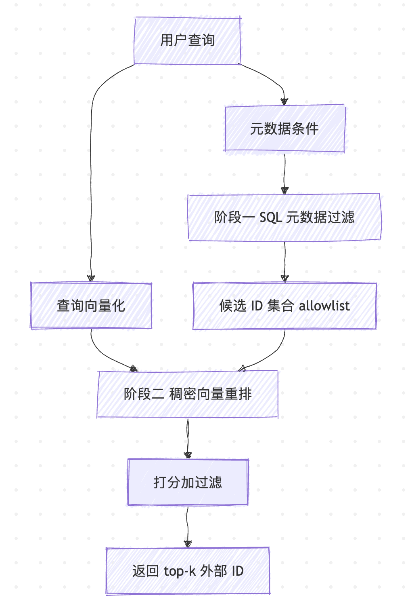
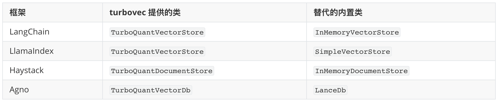

# 学习 turbovec 的混合检索与框架集成

昨天我们快速入门了 turbovec，体验了 `TurboQuantIndex` 的 `add` / `search` / `write` / `load` 等基本接口，也简单认识了带稳定 ID 的 `IdMapIndex`，当时提过一句，它是后面做混合检索过滤的基础。不过当时只是照着接口跑了一遍，没有解释为什么 `TurboQuantIndex` 的下标不能当业务主键用，也没讲这层 ID 映射是怎么实现的，更没涉及按租户、按权限过滤这样的真实检索场景。

今天我们就把这些坑填上：先从 `TurboQuantIndex` 删除时的下标移动说起，弄清楚 `IdMapIndex` 的实现，再体验过滤搜索和两阶段混合检索，最后是四大框架的开箱集成。

## TurboQuantIndex 的下标移动问题

先看 `TurboQuantIndex` 的删除方法 `swap_remove`。它的命名直接对标 Rust 标准库的 `Vec::swap_remove`：把最后一个向量挪进被删的槽位，再把长度减一。这样删除是 O(1) 的，代价是顺序不保证。

之所以这么设计，是因为所有向量的压缩编码紧挨着存在一个连续数组里，槽位号就是存储位置。从中间删一条，要么把后面的数据整体前移，复杂度 O(n)，删得越靠前越慢；要么留下空洞，破坏检索时批量打分依赖的致密布局。而把最后一条搬过来补位，只需要拷贝一条向量的数据，数组始终致密。

举个例子，假设索引里有 6 个向量，槽位编号 0 到 5。当我们 `swap_remove(2)` 之后，原来在槽位 5 的向量会被搬到槽位 2：

```python
idx = TurboQuantIndex(dim=1536, bit_width=4)
idx.add(vectors)                # 灌入 6 个向量，槽位 0 到 5

moved_from = idx.swap_remove(2) # 槽位 5 的向量补到槽位 2
# moved_from == 5
```

问题来了。如果你的业务库里用槽位号当外键，比如数据库某行记了 `vector_slot = 5`，删除后这一行指向的就不再是原来的向量了。`search` 返回的也是槽位下标，下一次查询拿到的 `indices` 跟你之前缓存的对应关系全乱套。

简单来说，`TurboQuantIndex` 的下标是位置性的，适合纯追加、不删除的场景，不适合拿来当业务主键。要在删除频繁的系统里稳定地标识一个向量，得换一个工具。

## 用 IdMapIndex 解决下标移动

`IdMapIndex` 就是为这个场景设计的。它在 `TurboQuantIndex` 外面包了一层双向映射：一边是你自己定的业务 ID（64 位无符号整数），一边是向量实际所在的槽位，两边可以互查。调用方始终用业务 ID 来标识向量，其他向量的增删不会改变这个 ID。官方文档把它类比成 FAISS 的 `IndexIDMap2`，哈希表支撑、按 ID O(1) 删除，熟悉 FAISS 的话可以直接对应过来。

它的设计思路在 `id_map.rs` 的模块注释里说得很清楚：

```rust
//! `IdMapIndex` wraps the positional index
//! with a bidirectional `id ↔ slot` mapping so callers can identify
//! vectors by a stable `u64` ID that doesn't change when other vectors
//! are inserted or removed.
```

结构体本身只持有两张表，向量存储、旋转、打分、序列化全部委托给内层的 `TurboQuantIndex`：

```rust
pub struct IdMapIndex {
    inner: TurboQuantIndex,
    /// slot → external id
    slot_to_id: Vec<u64>,
    /// external id → slot
    id_to_slot: HashMap<u64, usize>,
}
```

Python 侧的基本用法上一篇已经见过，这里快速过一眼：

```python
import numpy as np
from turbovec import IdMapIndex

index = IdMapIndex(dim=1536, bit_width=4)
index.add_with_ids(vectors, np.array([1001, 1002, 1003], dtype=np.uint64))

scores, ids = index.search(query, k=10)   # 返回的是你的 uint64 外部 ID
index.remove(1002)                         # 按 ID 删除，O(1)

assert 1002 not in index                   # 被删的 ID 已经不在
assert 1003 in index                       # 其余 ID 照旧，__contains__ 语法糖
scores, ids = index.search(query, k=10)    # 仍可正常检索，结果里不会再出现 1002
```

删完之后查一下，被删的 ID 已经不在，其余 ID 照旧可查。

这里有几个点值得展开。

`add_with_ids` 接收一批向量和等长的 `uint64` ID 数组。turbovec 会在真正写入前先做一遍校验，既拒绝索引里已存在的 ID，也拒绝这一批内部重复的 ID，避免写了一半才发现 ID 冲突。

`remove(id)` 是 O(1) 的，这是 `IdMapIndex` 相比裸 `TurboQuantIndex` 真正解决问题的地方。它内部仍然走 `swap_remove`，但会同步修正映射表：被删 ID 从两张表里抹掉，原来最后一个向量搬到空出的槽位后，它对应的 ID 也跟着更新指向新槽位。底层那次 `swap_remove` 照样会挪动槽位，但这次挪动被映射表吸收了，对外暴露的 ID 始终不变。所有框架集成内部用的都是 `IdMapIndex`，原因正是它。

## 使用 mask 与 allowlist 实现过滤搜索

光有稳定 ID 还不够。真实查询往往要先把候选集缩小到一个子集，再在子集里找最近邻。比如多租户系统只能返回当前租户的文档，访问控制场景只能返回有权限看到的内容，时间窗口检索只看最近 7 天的数据。

turbovec 的两个索引类型 `TurboQuantIndex` 和 `IdMapIndex` 各提供了一种过滤入口。

`TurboQuantIndex.search` 接收一个 `mask` 参数，它是一个长度等于 `len(idx)` 的布尔数组，只有 `mask[i] == True` 的槽位才参与打分：

```python
mask = np.ones(len(idx), dtype=bool)
mask[disabled_slots] = False
scores, slots = idx.search(query, k=10, mask=mask)
```

`IdMapIndex.search` 则接收一个 `allowlist`，它是一组外部 `uint64` ID，结果被限制在这些 ID 内：

```python
allowed = np.array([1003, 1010, 1042], dtype=np.uint64)
scores, ids = idx.search(queries, k=10, allowlist=allowed)
```

`allowlist` 在内部会先把每个 ID 翻译成对应的槽位、拼成一个布尔 mask，也就是说，两种方式背后是同一个机制，区别只是 `mask` 按槽位寻址，`allowlist` 按外部 ID 寻址。

这里有个容易被忽略的细节。turbovec 的过滤是**前过滤**而不是后过滤。后过滤是先搜出 top-k 再丢掉不合规的，结果常常不足 k 个。turbovec 在打分阶段就将禁止的向量过滤掉，所以你拿到的是过滤集合里完整的 top-k。

## 两阶段混合检索实战

把稳定 ID 和过滤搜索拼起来，就是一套实用的两阶段混合检索。第一阶段用外部系统（SQL、BM25、标签库等）筛出候选 ID 集合，第二阶段在候选集内做稠密向量重排。

整个流程如下图所示：



我们用一个多租户的例子来体验。每个租户只能检索属于自己的文档，租户隔离由 SQL 元数据保证，语义相关性由向量打分保证：

```python
import numpy as np
from turbovec import IdMapIndex

idx = IdMapIndex(dim=1536, bit_width=4)
idx.add_with_ids(vectors, ids)

# 阶段一：外部系统把候选缩小到当前租户的文档 id
allowed = np.array(
    db.execute("SELECT id FROM docs WHERE tenant=?", (t,)).fetchall(),
    dtype=np.uint64,
)

# 阶段二：在候选集内做稠密重排
scores, ids = idx.search(query, k=10, allowlist=allowed)
```

可以看到，租户边界完全由那条 SQL 决定，向量索引不需要知道租户的概念。SQL 擅长结构化条件过滤，向量索引擅长语义相似度排序，两者各做各擅长的事。前过滤的设计保证了一点：哪怕某个租户只有几十篇文档，只要这几十篇里有相关的，你照样能拿满 `k=10` 个结果，不会因为全局 top-k 里挤满了别的租户的文档而被挤空。

## 开源框架集成

自己调 `IdMapIndex` 固然灵活，但如果你的项目已经跑在某个 RAG 框架上，更省事的是直接换掉它的内置向量库。turbovec 为四大框架提供了 drop-in 集成，每个集成内部都用 `IdMapIndex` 存储，对外保持原框架的接口不变。

> drop-in 全称 drop-in replacement（直接替换），意思是新组件和原组件的接口、行为完全兼容，接入时只需要换掉 import，其余代码一行不用改。turbovec 的四个集成正是这样：换个向量库的导入，你的检索管道照旧工作，换来的是内存占用降一个量级。

它们各自替代的类如下：



下面以 LangChain 为例看一段最简示例。安装时在方括号里带上框架名，pip 会把对应的依赖一并装好：

```bash
$ pip install turbovec[langchain]
```

`turbovec.langchain.TurboQuantVectorStore` 实现了 LangChain `VectorStore` 接口，维度从嵌入模型推断，不用提前指定：

```python
from langchain_huggingface import HuggingFaceEmbeddings
from turbovec.langchain import TurboQuantVectorStore

# 一批待检索的文档，实际项目里通常来自知识库或文档切片
texts = [
    "TurboQuant is a data-oblivious vector quantizer that needs no training phase.",
    "Product Quantization must train a codebook on representative data before adding vectors.",
    "FAISS is Meta's open-source library for efficient vector similarity search.",
    "HNSW is a graph-based algorithm for approximate nearest neighbor search.",
    "An inverted index is the core data structure of traditional full-text search.",
    "BM25 is a classic keyword-based ranking function used for first-stage retrieval.",
    "Hybrid retrieval combines keyword filtering with dense vector reranking.",
    "RAG augments large language models with knowledge retrieved from external sources.",
    "A vector database stores and searches high-dimensional embedding vectors.",
    "Cosine similarity measures how close the directions of two vectors are.",
]

embeddings = HuggingFaceEmbeddings(model_name="BAAI/bge-base-en-v1.5")
store = TurboQuantVectorStore.from_texts(
    texts=texts,
    embedding=embeddings,
    bit_width=4,
)
retriever = store.as_retriever(search_kwargs={"k": 3})

# 检索与查询语义最相关的前 3 条文档
docs = retriever.invoke("a quantization method that compresses vectors without training")
for i, doc in enumerate(docs, 1):
    print(f"{i}. {doc.page_content}")
```

运行后会按语义相关性返回前 3 条，第一条正是讲 TurboQuant 免训练量化的那句：

```
1. TurboQuant is a data-oblivious vector quantizer that needs no training phase.
2. A vector database stores and searches high-dimensional embedding vectors.
3. Product Quantization must train a codebook on representative data before adding vectors.
```

可以看到，`from_texts` 建库、`as_retriever` 拿检索器，这套写法和 LangChain 原生的 `InMemoryVectorStore` 一模一样，把导入换成 turbovec 即可，拿到检索器之后怎么用都不变。底层换成了 4-bit 量化存储，内存占用直接降下来，这正是 drop-in 的意义。

另外三个集成的用法大同小异，都是按同样的方式装好对应的包（`turbovec[llama-index]`、`turbovec[haystack]`、`turbovec[agno]`），再把框架内置的向量库换成 turbovec 提供的类，其余管道代码不动。各家在过滤算子、去重策略等方面有一些贴合自身生态的细节差异，具体接口以各自的官方文档为准，这里不再逐一展开。

## 小结

今天我们体验了 turbovec 面向真实业务的几项功能：

1. **稳定 ID**：`TurboQuantIndex` 的槽位会因 `swap_remove` 移动，不适合当业务主键；`IdMapIndex` 用一层业务 ID 和槽位的双向映射提供稳定外部 ID
2. **过滤搜索**：`TurboQuantIndex` 用布尔 `mask`，`IdMapIndex` 用 `allowlist`，两者翻译成同一套前过滤内核，能在过滤集合里凑满 top-k，而不像后过滤那样常常返回不足 k 个
3. **两阶段混合检索**：第一阶段 SQL 等外部系统筛候选 ID，第二阶段稠密重排，结构化过滤与语义排序各司其职，多租户隔离天然落在 SQL 一侧
4. **框架集成**：LangChain、LlamaIndex、Haystack、Agno 四大框架 drop-in，内部统一用 `IdMapIndex`，换个 import 就能接入

功能层面我们基本都体验完了，从压缩、检索到过滤、集成。不过到现在为止，免训练量化对我们还是个黑盒：为什么不需要 train 就能把向量压到 2-4 bit，还能在召回上追平甚至超过 FAISS 的 PQ？明天我们就深入 TurboQuant 算法本身，看看随机旋转、Beta 分布和 Lloyd-Max 码本背后的数学原理。

## 参考

* [turbovec GitHub 仓库](https://github.com/RyanCodrai/turbovec)
* [turbovec PyPI 页面](https://pypi.org/project/turbovec/)
* [FAISS GitHub 仓库](https://github.com/facebookresearch/faiss)
* [TurboQuant 论文（arXiv）](https://arxiv.org/abs/2504.19874)
* [LangChain 向量库文档](https://python.langchain.com/docs/integrations/vectorstores/)
* [LlamaIndex 向量库文档](https://docs.llamaindex.ai/en/stable/module_guides/storing/vector_stores/)
* [Haystack DocumentStore 文档](https://docs.haystack.deepset.ai/docs/document-store)
* [Agno GitHub 仓库](https://github.com/agno-agi/agno)
