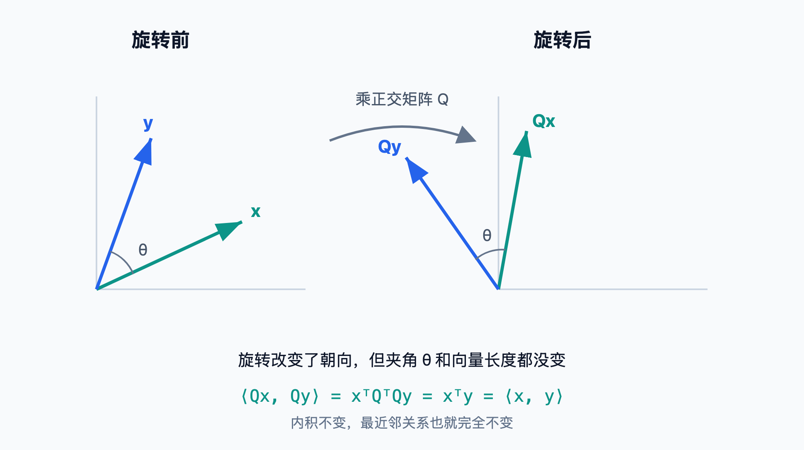
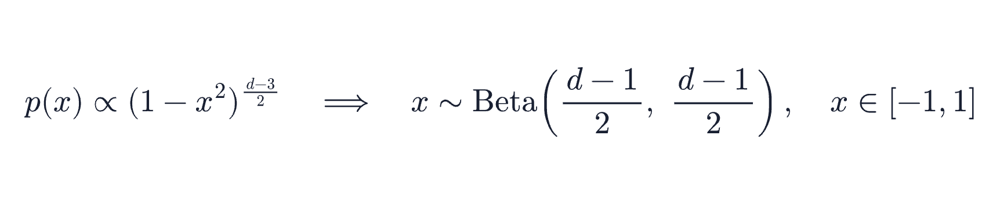
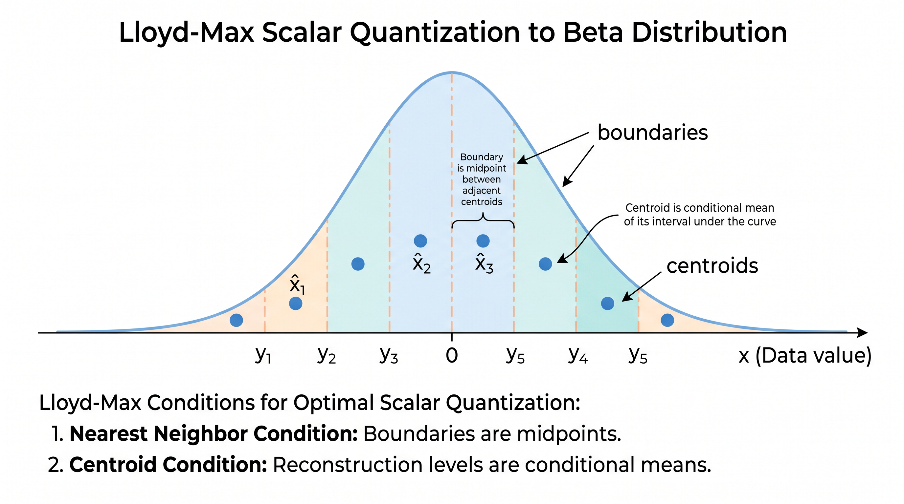

# 学习 turbovec 的量化算法

前两篇我们把 turbovec 的 API 过了一遍：第 1 篇跑通了 `add` 和 `search`，第 2 篇学了混合检索和框架集成。它们都停在接口层面，但有一个核心问题一直没回答：为什么 turbovec 不需要训练就能把向量压到 2-4 bit，还能在召回上追平甚至超过 FAISS 的 PQ？

答案在它背后那套免训练量化算法 TurboQuant。这个算法来自 Google Research 的论文，今年初刚被机器学习顶会 ICLR 接收，turbovec 是它第一个公开的工程实现。今天我们就从传统量化的负担讲起，再读论文的核心思想，最后对照 `rotation.rs`、`codebook.rs`、`encode.rs` 三个文件，把整条编码管道从头到尾理清楚。

## 传统量化的训练负担

第 1 篇我们算过那笔内存账：1536 维 float32 一条向量约 6 KB，千万级语料就是 31 GB。量化（Quantization）做的就是用更少的比特去近似表示原本的浮点数，把每个坐标从 32 bit 压到 2-4 bit，体积掉到 1/8 到 1/16，单机就能装下，代价是牺牲一点精度。问题在于，怎么压才能让精度损失尽量小。

向量量化最经典的方案是**乘积量化（Product Quantization，简称 PQ）**，[2011 年由 Jégou 等人提出](https://inria.hal.science/inria-00514462v2/document)，FAISS 里的 `IndexPQ`、`IndexPQFastScan` 都是它的实现。

PQ 的思路是分段查表。把一条 1536 维向量切成若干个子段，比如 8 段，每段 192 维；对每一段，用 k-means 在训练数据上聚出 256 个聚类中心，存成一张**码本（codebook）**。编码时，每段只记录它最近的那个中心的下标，一个 8 bit 的整数就够了。原本 192 个 float32 的子段，压成了 1 个字节。整个分段查表的过程如下图所示：


这套方案压缩率很高，但有一个绕不开的前提：**码本要从数据里学出来**。这就带来两个负担：

1. **训练阶段不可省**：用 FAISS 的 PQ，必须先准备一批有代表性的向量，调用 `index.train(xs)` 跑 k-means 训练码本，之后才能调用 `add` 添加向量。数据量不足时训练不出高质量的码本。
2. **数据漂移要重训**：码本是对当前数据分布的拟合。如果后续加进来的向量分布发生变化，比如更换了 embedding 模型、业务语料迁移，旧码本就不再贴合，召回率随之下降，需要重新训练并重新编码整个索引库。

对于一个需要支持在线增量写入的向量库来说，这个训练环节是个明显的负担。我们希望第一条向量进来就能直接编码、直接检索，不必经历积累数据、训练、回填这一整套流程。

这就引出了另一条路线：**数据无关量化（data-oblivious quantization）**。它的目标是设计一个不依赖具体数据分布的量化器，码本可以提前算好、写死在代码里，任何数据进来都用同一套。TurboQuant 走的正是这条路。

## TurboQuant 的核心思想

TurboQuant 论文的全名是《TurboQuant: Online Vector Quantization with Near-optimal Distortion Rate》，arXiv 编号 [2504.19874](https://arxiv.org/abs/2504.19874)，去年 4 月提交，今年初被 ICLR 接收。它要解决的问题是：在不看数据分布的前提下，怎么设计一个接近最优的标量量化器。

它的关键观察分三步。

第一步，**随机正交旋转**。对每一条归一化后的单位向量，乘上一个随机生成的正交矩阵。正交变换不改变向量长度，也不改变向量之间的内积，所以旋转之后做的所有检索运算，结果和旋转前等价。旋转只是换了一组坐标基。

第二步，**旋转后坐标服从已知分布**。这是整个算法的支点。一个 `d` 维单位向量随机旋转之后，它的每个坐标不再是任意的，而是服从一个确定的 Beta 分布。坐标的取值被摊平到了一个集中、对称、与数据无关的形状上。原始数据可能在某些维度上特别集中、某些维度上特别分散，但随机旋转把这种各向异性打散了，每个坐标看起来都像是从同一个分布里采出来的。

第三步，**高维下坐标近似独立，可以逐坐标独立量化**。维度越高，不同坐标之间的相关性越弱，近似相互独立。既然每个坐标都同分布、又近似独立，那就不需要像 PQ 那样为不同子段学不同的码本了。我们只要针对这一个 Beta 分布，求出一个最优的标量量化器，然后**对所有坐标用同一套量化器**即可。

这套量化器是离线就能算好的，因为 Beta 分布的形状只由维度 `d` 决定，和数据没有半点关系。论文给出的理论保证是：这样做的失真率（distortion rate）落在信息论下限，也就是香农下界的约 2.7 倍以内。一个完全不看数据、提前写死的量化器，做到了接近理论最优的精度。

下面我们把随机正交旋转、Beta 分布、求最优量化器用的 Lloyd-Max 算法这三个可能陌生的概念逐一讲清楚，再回到源码。

### 正交矩阵为什么不改变内积

第一步具体做的，是把每条向量先归一化成长度为 1 的单位向量，再统一乘上同一个随机生成的正交矩阵 `Q`。归一化的用意要到下一节才说得清，这里先解决一个更要紧的疑问：凭什么乘了 `Q` 之后，检索结果还和原来一样？

答案是旋转「不改变向量之间的内积」，这是后面所有推理的前提，先把它讲透。

> 正交矩阵是一个方阵 `Q`，它的各列都是两两垂直的单位向量。这等价于 `Qᵀ·Q = I`，也就是它的转置恰好等于它的逆。几何上，乘一个正交矩阵就是对整个空间做一次刚性的旋转（或翻转），只改变朝向，不做任何拉伸或压缩。

为什么旋转后内积不变？两个向量 `x`、`y` 旋转后变成 `Qx`、`Qy`，把它们的内积按定义展开：

```text
<Qx, Qy> = (Qx)ᵀ(Qy) = xᵀ·QᵀQ·y = xᵀ·I·y = xᵀy = <x, y>
```

中间这一步用到的正是 `QᵀQ = I`。内积不变，向量长度（`||x||² = <x, x>`）自然也跟着不变。

几何上更直观，如下图所示：旋转把整个空间当成一个刚体一起转，任意两点之间的夹角和距离都原封不动。



而向量检索靠的就是内积或距离来判断谁离查询更近，这些量旋转后完全不变，所以最近邻关系一个都不会错。这正是 turbovec 在编码时先对所有向量做一次旋转的依据：旋到新坐标系里做检索，和在原始坐标系里做，结果完全等价。也就是说，旋转换来了一个数据无关的规整分布，却没有付出任何检索精度的代价。

### 旋转后为什么是 Beta 分布

要讲清楚旋转的作用，得先弄明白一件事：一个**均匀随机**落在球面上的单位向量，它的单个坐标长什么样。我们从低维往高维看。

二维时，单位向量是圆上一点，横坐标 `x₁ = cos θ`。θ 是均匀的，但 `x₁` 并不均匀。`cos` 在 ±1 附近平缓、在 0 附近陡峭，把均匀的角度压成了两端堆积的横坐标。可以想象一颗珠子在圆上匀速转，看它投在横轴上的影子：转到左右两侧时它几乎在竖直运动，影子在 ±1 附近停留很久；转到上下时它几乎在水平运动，影子飞快划过 0。停留得久的地方点就密，所以二维时坐标反而堆在 ±1。

维度一高，情况彻底反过来，坐标转而向 0 集中。最直接的理由是长度预算：单位向量满足 `x₁² + … + x_d² = 1`，这个总量要分给 `d` 个坐标。二维时一个坐标可以占掉大部分，比如 `(1, 0)`，但 1536 维下平摊到每个坐标只剩 `1/√1536 ≈ 0.025`，紧贴着 0。要让某个坐标取到 ±1 附近，它必须占掉几乎全部预算、其余 1535 个一齐趋零，这在随机方向上微乎其微。于是高维坐标被压在 0 附近，呈一个尖钟形，如下图所示：


这个尖钟形有个名字，叫 Beta 分布。

> Beta 分布是定义在 `[0, 1]` 区间上的一族连续概率分布，由两个形状参数 `α` 和 `β` 控制。当 `α = β` 时分布对称，集中在中间的 0.5 附近；两个参数越大，分布越往中间挤、越尖。

数学上，单位球面上一个坐标的密度有个统一的表达式，归一化后正是映射到 `[-1, 1]` 的 Beta 分布：



这个表达式把三个维度串成一条线：`d = 2` 时退化成 `1/√(1 - x²)`，就是上面两端堆积的形状；`d = 3` 时恰好均匀；`d ≥ 4` 起变成中间高、两端低的钟形，维度越高越尖。对 1536 维，`α = β = 767.5`，钟形尖到坐标几乎全落在 0 附近一条窄缝里。

但要注意，上面这套结论有一个前提：向量是**均匀随机**地落在球面上的。真实 embedding 并不满足这个前提，它们抱团、偏向某些方向，也就是各向异性（anisotropy）：某些维度的方差特别大，另一些几乎是常数。所以不旋转时，真实数据每个坐标的分布由数据自身决定，对不齐那个统一的 Beta：方差大的坐标超出码本的覆盖范围，方差小的坐标又用不满码本的精度，一张共享码本顾此失彼。

这正是必须旋转的原因。随机正交旋转把每条向量的坐标重新组合成所有原坐标的均匀混合，原本被少数维度占据的能量被摊回到全部坐标上。各向异性由此被抹平成各向同性（isotropy）：所有坐标的方差都收敛到相同的 `1/d`，分布形状也都收敛到同一个 Beta。这一步并不创造 Beta 形状（那是高维球面本身的几何性质），而是把真实数据搬到能享用这个形状的位置上，从而让一张离线算好的码本精准地覆盖每一个坐标。

### Lloyd-Max 最优标量量化器

知道了坐标的分布，下一步是为它找最优的量化方案。这里用的是 Lloyd-Max 算法。

标量量化器可以理解成一个逐坐标的「四舍五入器」：在数轴上预先定好若干个档位（重建中心点）和档位之间的分界线（边界），编码时把每个坐标值归到最近的档位，只存这一档的编号，用的时候再用档位的中心值近似还原。4-bit 就是 16 个档位，编号占 4 bit，原来一个 float32 坐标从 32 bit 压到了 4 bit。所谓「最优」，就是这些档位和分界线不能随便摆，要放在让平均误差（均方误差）最小的位置上。

> Lloyd-Max 是一种求解最优标量量化器的经典迭代算法，1957 年由 Stuart Lloyd 提出、1960 年由 Joel Max 独立给出。给定一个连续分布和量化级数（比如 4 bit 就是 16 级），它求出一组**区间边界（boundaries）**和一组**重建中心点（centroids）**，使得量化的均方误差最小。

它的迭代逻辑是两条最优性条件交替满足：

1. **给定中心点，最优边界是相邻两个中心点的中点**：一个值该归到哪个量化级，取决于它离哪个中心点更近，分界线自然落在中点上。
2. **给定边界，最优中心点是该区间在分布下的条件期望**：一个量化级的重建值，应该取落在这个区间内所有数据的加权平均，权重就是概率密度。

这两步切出的边界和中心点如下图所示：



反复迭代这两步直到收敛，就得到了针对该 Beta 分布的最优 boundaries 和 centroids。注意整个过程只用到分布本身，不碰任何真实数据，所以离线算好就行。这正是 turbovec 不需要训练阶段的根本原因。

## 源码剖析

理论讲完，我们回到代码，看 turbovec 是怎么一步步把这些思想落地的。一条向量从输入到存储，要经过归一化、旋转、校准、量化、打包这几道工序，实现分散在 `rotation.rs`、`codebook.rs`、`encode.rs` 三个文件里。整条管道是一条直线：

```
输入向量（float32）
  → 输入验证（检测 NaN / Inf）
  → 归一化（提取范数，得到单位向量）
  → 正交旋转（乘随机旋转矩阵）
  → TQ+ 校准（逐坐标平移缩放）
  → Lloyd-Max 量化（边界扫描得码字）
  → 比特平面打包
  → 长度归一化修正（为每条向量算一个 scale）
  → 存储（packed_codes 与 scales）
```

### 旋转矩阵的确定性生成

第一道核心工序是旋转，实现在 `rotation.rs`，整个文件只有 50 行出头。核心函数 `make_rotation_matrix` 做了三件事：

```rust
pub fn make_rotation_matrix(dim: usize) -> Vec<f32> {
    let mut rng = ChaCha8Rng::seed_from_u64(ROTATION_SEED);

    // 1. 生成 dim x dim 的高斯随机矩阵
    let mut g = faer::Mat::<f64>::zeros(dim, dim);
    for j in 0..dim {
        for i in 0..dim {
            g.write(i, j, rng.sample(StandardNormal));
        }
    }

    // 2. QR 分解，Q 就是一个正交矩阵
    let qr = g.qr();
    let q_full = qr.compute_thin_q();
    let r = qr.compute_thin_r();

    // 3. 符号修正：Q = Q * diag(sign(diag(R)))
    let mut q = q_full;
    for j in 0..dim {
        let sign = if r.read(j, j) >= 0.0 { 1.0 } else { -1.0 };
        // ... 把对应列乘上 sign
    }
    // ... 转成行主序 f32 返回
}
```

这段代码我做了简化，省略了符号修正的内层循环和最后转 f32 的部分。它的逻辑分三步：

1. **生成高斯随机矩阵**：用 ChaCha8 这个伪随机数生成器，配合标准正态分布，填出一个 `dim × dim` 的随机矩阵。
2. **QR 分解取正交矩阵**：对随机矩阵做 QR 分解，得到的 `Q` 是一个正交矩阵。这里用的是 [faer](https://github.com/sarah-quinones/faer-rs) 这个纯 Rust 的线性代数库做非主元 QR 分解。一个高斯随机矩阵的 QR 分解，`Q` 的分布是均匀的，正好满足我们要的随机正交旋转。
3. **符号修正**：QR 分解的结果不唯一，不同实现可能给出符号相反的列。这里强制把 `Q` 的每一列乘上 `R` 对角元的符号，让结果唯一、可复现。

> QR 分解是线性代数里的一个经典操作：把任意一个矩阵 `A` 拆成两个矩阵的乘积 `A = Q·R`，其中 `Q` 是正交矩阵（各列两两垂直、长度为 1），`R` 是上三角矩阵。我们这里只取 `Q`，看中的就是它的正交性。对一个元素独立来自标准正态分布的随机矩阵做 QR 分解，得到的 `Q` 在所有正交矩阵里是均匀分布的，正好是我们想要的随机正交旋转。

这里最值得说的是开头那个 `ChaCha8Rng::seed_from_u64(ROTATION_SEED)`。`ROTATION_SEED` 定义在 `lib.rs` 里，是一个固定常量：

```rust
const ROTATION_SEED: u64 = 42;
```

种子写死成 42，意味着同样维度下生成的旋转矩阵**每次都完全一样**。这是一个有意为之的工程设计，好处有两点：

- **索引文件里不用存旋转矩阵**。一个 1536 维的旋转矩阵是 `1536 × 1536` 个 float32，约 9 MB，要是每个索引文件都带一份就太浪费了。既然种子固定、生成过程确定，加载索引时按维度现场重算即可，磁盘上一个字节都不用存。
- **写入端和搜索端天然一致**。`add` 时用什么旋转，`search` 时查询走的就是同一个旋转，不会因为读写分属两次进程而错位。

回到 `lib.rs` 的 `TurboQuantIndex` 结构体，旋转矩阵正是用 `OnceLock` 缓存的：

```rust
pub struct TurboQuantIndex {
    // ...
    rotation: OnceLock<Vec<f32>>,
    boundaries: OnceLock<Vec<f32>>,
    centroids: OnceLock<Vec<f32>>,
    blocked: OnceLock<BlockedCache>,
}
```

`rotation`、`boundaries`、`centroids` 这几个缓存都只依赖 `(dim, bit_width)` 和那个固定种子，不依赖任何向量内容。它们在第一次 `add` 时按需算出，之后无锁读取；如果是加载后直接检索、没有经过 `add` 的索引，则在第一次 `search` 时补算。结构体里还有第四个缓存 `blocked`，是 SIMD 内核用的分块布局，只在第一次 `search` 时才构建。这部分缓存的并发设计，我们留到第 4 篇细讲。

### 码本的 Lloyd-Max 迭代

旋转之后，每个坐标独立同分布于 `Beta((d-1)/2, (d-1)/2)`。`codebook.rs` 就在这个分布上跑 Lloyd-Max，求出量化用的 boundaries 和 centroids。对外的入口很简洁：

```rust
pub fn codebook(bits: usize, dim: usize) -> (Vec<f32>, Vec<f32>) {
    lloyd_max(bits, dim, 200, 1e-12)
}
```

最多迭代 200 次，收敛阈值 `1e-12`。`lloyd_max` 内部的主循环就是前面讲的两条最优性条件交替：

```rust
fn lloyd_max(bits: usize, dim: usize, max_iter: usize, tol: f64) -> (Vec<f32>, Vec<f32>) {
    let a = (dim as f64 - 1.0) / 2.0;
    let beta = Beta::new(a, a).unwrap();
    let n_levels = 1usize << bits;

    // 初始化中心点：在 ±3 个标准差内均匀铺开
    // ...

    for _ in 0..max_iter {
        // 条件一：边界 = 相邻中心点的中点
        let boundaries: Vec<f64> = (0..n_levels - 1)
            .map(|i| (centroids[i] + centroids[i + 1]) / 2.0)
            .collect();
        // ...
        for i in 0..n_levels {
            // 条件二：新中心点 = 区间 [lo, hi] 上的条件期望
            // mean = ∫ x·pdf(x) dx / prob，用 adaptive Simpson 数值积分
            let mean = adaptive_simpson(
                |x| {
                    let t = (x + 1.0) / 2.0;
                    x * beta.pdf(t) / 2.0
                },
                lo, hi, 1e-14, 50,
            );
            new_centroids[i] = mean / prob;
        }
        // 收敛判断：最大变化量小于 tol 就停
        // ...
    }
    // ...
}
```

这里有几个点比较有意思，我们逐一看下：

1. **初始中心点在 ±3σ 内均匀铺开**。这里的 σ 是这个 Beta 分布在 `[-1, 1]` 上的标准差，迭代从一组均匀铺开的初始猜测出发，逐步收敛到最优位置。
2. **边界取中点**：`(centroids[i] + centroids[i + 1]) / 2.0`，对应最优性条件一。
3. **中心点取条件期望**：在每个区间 `[lo, hi]` 上算 `∫ x·pdf(x) dx / prob`，对应条件二。其中 `pdf(x)` 是 **概率密度函数（probability density function）**，也就是前面那条 Beta 钟形曲线在 `x` 处的高度；`∫ x·pdf(x) dx` 把区间内每个 `x` 按密度加权累加，再除以区间总概率 `prob`，得到的就是落在这个区间里的值的平均，即条件期望。这个积分没有闭式解，代码用 `adaptive_simpson` 做自适应辛普森数值积分。

辛普森数值积分这块也单开一小段说一下。

> 辛普森法则（Simpson's rule）用抛物线去逼近曲线下的面积，比矩形法、梯形法精度高得多。自适应（adaptive）的意思是：先对整个区间估一次，再二分细算一次，如果两次结果差得超过容差，就继续递归二分，直到精度达标。这样曲线平缓处少算几次、陡峭处多算几次，既准又省。

`codebook.rs` 里的 `adaptive_simpson_rec` 就是这个递归过程，靠 `(refined - whole).abs() < 15.0 * tol` 判断是否需要继续细分。整个 Lloyd-Max 跑完，得到的 boundaries 和 centroids 就是这个维度、这个比特宽度下的最优标量量化器。它只和 `(dim, bits)` 有关，因此和旋转矩阵一样，只在内存里用 `OnceLock` 缓存、按需重算，无需写入索引文件。

### 完整编码管道

旋转矩阵和码本都备好了，`encode.rs` 里的 `encode` 函数把它们串起来，完成一条向量从浮点到比特的完整旅程。从函数签名就能看清它的输入和输出：

```rust
pub fn encode(
    vectors: &[f32], n: usize, dim: usize,
    rotation: &[f32],
    boundaries: &[f32], centroids: &[f32],
    bit_width: usize,
    existing_calibration: Option<(&[f32], &[f32])>,
) -> (Vec<u8>, Vec<f32>, Vec<f32>, Vec<f32>) {
    // 1. 归一化：逐行提取范数，得到单位向量
    norms.par_iter_mut()
        .zip(unit_flat.par_chunks_mut(dim))
        .enumerate()
        .for_each(|(i, (norm, unit_row))| {
            let row = &vectors[i * dim..(i + 1) * dim];
            let n_val = simd_norm(row);
            *norm = n_val;
            let inv = if n_val > 1e-10 { 1.0 / n_val } else { 0.0 };
            simd_scale(row, inv, unit_row);
        });

    // 2. 旋转：单位向量矩阵乘旋转矩阵的转置
    let rotated_mat = unit_mat.dot(&rot_mat.t());

    // 3. TQ+ 校准：拟合或复用逐坐标的 (shift, scale)
    let (shift, scale_tq) = match existing_calibration {
        Some((s, sc)) => (s.to_vec(), sc.to_vec()),
        None => compute_tqplus_calibration(rotated, n, dim),
    };

    // 4. 量化 + 打包 + 长度修正（融合在一个逐行处理的函数里）
    // ...
}
```

这段也做了简化，省去了校准值物化和并行打包的细节。整条管道是：

1. **归一化**：每行除以自己的范数，得到单位向量；范数 `||v||` 单独存下来，后面做长度修正要用。这里用 [Rayon](https://github.com/rayon-rs/rayon) 把各行拆到多核上并行处理，因为行与行之间完全独立。
2. **旋转**：单位向量矩阵和旋转矩阵的转置做矩阵乘法，把每条向量旋到新坐标系。
3. **TQ+ 校准**：逐坐标做一次平移和缩放，下一节细说。
4. **量化 + 打包 + 长度修正**：用 boundaries 做边界扫描得到每个坐标的码字，按比特平面打包成字节，同时算出长度修正的 scale。

第 4 步里的边界扫描量化方式有点意思。代码不是去比较坐标离哪个 centroid 最近，而是数它**越过了几条边界**。`fused_quantize_scale_pack` 里的核心循环就是这么干的：

```rust
for j in 0..dim {
    // 数第 j 个坐标越过了几条边界，越过几条码字就是几
    let mut code = 0u8;
    for &b in boundaries {
        if rot_calib[j] > b { code += 1; }
    }
    // code 即这个坐标的量化码字，随后按比特平面打包进 packed_row
    // ...
}
```

因为 boundaries 是单调递增的，越过的边界数恰好等于该坐标落在第几个量化级，和找最近中心点等价，但用 SIMD 实现起来更顺手。

## TQ+ 动态校准

到这里，纯理论版的 TurboQuant 已经能跑了。但 turbovec 在此基础上做了一个改进：TQ+ 校准。

它要解决的问题是理论和现实的偏差。论文说旋转后每个坐标服从规范的 Beta 分布，这是在数据各向同性的理想假设下推出来的。真实的 embedding 数据往往是各向异性的，旋转之后每个坐标的经验分布，和那个理论 Beta 分布之间还有残差。码本是按理论 Beta 拟合的，坐标分布一旦偏掉，码本就会失配，精度打折扣。

TQ+ 的修正办法很轻量：给每个坐标配两个自由参数，一个平移 `shift`、一个缩放 `scale`，把这个坐标的经验分布拉回到理论 Beta 上。具体做法是对齐 5% 和 95% 分位数：

```rust
fn compute_tqplus_calibration(rotated: &[f32], n: usize, dim: usize)
    -> (Vec<f32>, Vec<f32>)
{
    // 批量过小 → 返回恒等校准 (shift=0, scale=1)
    if n < TQPLUS_MIN_SAMPLES { return (shift, scale); }

    // 目标分布 Beta((d-1)/2, (d-1)/2) 的 5/95% 分位点
    let qc_lo = (2.0 * beta.inverse_cdf(0.05) - 1.0) as f32;
    let qc_hi = (2.0 * beta.inverse_cdf(0.95) - 1.0) as f32;
    let qc_span = qc_hi - qc_lo;

    // 逐坐标拟合 (shift, scale)，Rayon 并行
    shift.par_iter_mut().zip(scale.par_iter_mut()).enumerate().for_each(
        |(d, (sh, sc))| {
            let mut coord: Vec<f32> = (0..n).map(|i| rotated[i * dim + d]).collect();
            coord.sort_unstable_by(/* ... */);
            let qe_lo = coord[lo_idx];   // 该坐标经验 5% 分位
            let qe_hi = coord[hi_idx];   // 该坐标经验 95% 分位
            let qe_span = qe_hi - qe_lo;
            if qe_span > 1e-6 {
                *sc = qc_span / qe_span;
                *sh = qc_lo / *sc - qe_lo;
            }
        },
    );
    (shift, scale)
}
```

逻辑分三步：先算出目标 Beta 分布的 5% 和 95% 分位点 `qc_lo`、`qc_hi`，这是理论目标；再对每个坐标，把它在这批数据里的所有取值排序，取出经验的 5% 和 95% 分位 `qe_lo`、`qe_hi`；最后解一个线性映射，让经验分位对齐到理论分位，得到这个坐标的 `scale` 和 `shift`。每个坐标互相独立，用 Rayon 并行铺开。

这里有两个工程细节要注意：

- **样本太少就不校准**。`TQPLUS_MIN_SAMPLES` 是 1000，批量小于这个数时直接返回恒等校准（shift=0、scale=1）。`encode.rs` 的注释解释了原因：样本不足时分位数估计本身噪声太大，校准带来的精度反而被噪声吃掉，所以索引照常能用，只是这一批拿不到 TQ+ 的召回增益。
- **只学一次，之后冻结**。校准参数在第一次 `add` 时拟合出来，存进 `TurboQuantIndex` 的 `tqplus_shift` 和 `tqplus_scale` 字段，后续 `add` 全部复用同一套，靠的就是 `encode` 那个 `existing_calibration` 参数。这样索引里所有向量都活在同一个校准坐标系里，增量写入也不会前后不一致。搜索时，校准的逆操作被施加到查询侧，整个 SIMD 内核一行都不用改。

效果上，TQ+ 在不同数据集上给 Recall@1 带来 0.3 到 1.8 个百分点的提升。比如 OpenAI 1536 维 2-bit 上 +1.5pp，3072 维 2-bit 上 +1.8pp。

## 长度归一化修正

最后还有一个修正，借鉴了 RaBitQ 论文的思路。

> RaBitQ 是 2024 年提出的高维向量量化方法，论文《RaBitQ: Quantizing High-Dimensional Vectors with a Theoretical Error Bound for Approximate Nearest Neighbor Search》，arXiv 编号 2405.12497。它的贡献是给量化误差给出了可证明的理论上界，并用一个逐向量的标量修正（每条向量配一个）去消除内积估计的系统性偏差。Elastic 在他们的 search-labs 博客里写过一篇通俗易懂的科普。

要修正的问题是：标量量化会**系统性地低估内积**。我们归一化时把向量变成了单位向量，但量化重建出来的那个向量，长度通常比 1 短一点，因为重建中心点是区间的条件期望，会向分布中心收缩。重建向量偏短，算出来的内积就整体偏小。

turbovec 的修正是给每条向量存一个标量 `scale`，定义为：

```text
scale = ||v|| / <u_rot, x_hat>
```

其中 `||v||` 是原始向量的范数，`u_rot` 是旋转后的单位向量，`x_hat` 是 Lloyd-Max 重建出来的向量。这个 scale 同时干了两件事：用 `||v||` 把单位向量还原回原始长度，再用 `1 / <u_rot, x_hat>` 抵消掉重建变短带来的低估。`encode.rs` 文件头的注释把这层意思说得很清楚：

> Applying this scale at the final score-multiplication site in the SIMD kernel gives an unbiased estimator of `<v, q>`.

这里的 `<v, q>` 是库向量 `v` 和查询 `q` 的内积，也就是检索真正要算的那个相似度分数。所谓 unbiased estimator（无偏估计），是说内核在压缩码上算出来的近似分数乘上这个 scale 之后，平均而言正好落在真实的 `<v, q>` 上，把前面那个系统性低估抵消掉了。也就是说，这个修正放在 SIMD 内核打分的最后一步，乘一下 scale 就行，搜索延迟零增加。

回到源码，这个 scale 是在 `fused_quantize_scale_pack` 里算出来的：

```rust
fn fused_quantize_scale_pack(/* ... */ norm: f32, /* ... */) -> f32 {
    // 参数 `norm` 就是 `||v||`
    let mut inner = 0.0f64;
    for j in 0..dim {
        // 边界扫描得到 code（见前文），再把中心点还原回原始空间
        let centroid_in_orig = centroids[code] * inv_scale_tq[j] - shift[j];
        // 逐坐标累加，凑出原始空间的内积 <u_rot, x_hat>
        inner += rot_orig[j] * centroid_in_orig;
        // ... 比特平面打包 ...
    }
    norm / inner   // 返回 ||v|| / <u_rot, x_hat>，正是上面那个 scale
}
```

效果很可观：GloVe 200 维 2-bit 上，Recall@1 提升了 4.7 个百分点，而搜索延迟没有任何变化。一个只在编码期多存一个 float、搜索期多乘一次的小修正，换来近 5 个点的召回，性价比很高。

## 小结

今天我们把 turbovec 量化算法的来龙去脉走了一遍：

1. **量化的动机**：1536 维 float32 一条 6 KB，千万级语料就是 31 GB，压到 2-4 bit 能把内存砍到 1/8 到 1/16，单机就能装下。
2. **数据无关量化**：传统 PQ 要用 k-means 学码本，数据漂移还得重训。TurboQuant 走数据无关路线，码本提前算好、写死在代码里。
3. **TurboQuant 三步**：随机正交旋转让每个坐标服从 Beta 分布，高维下坐标近似独立，于是对所有坐标用同一个 Lloyd-Max 最优标量量化器，失真在香农下界的约 2.7 倍以内。
4. **三个核心源码文件**：`rotation.rs` 用 ChaCha8 加固定种子 42 加 faer QR 分解确定性地生成旋转矩阵，索引文件因此不用存它；`codebook.rs` 在 Beta 分布上跑 Lloyd-Max，边界取中点、中心点取条件期望、用自适应辛普森积分；`encode.rs` 把归一化、旋转、校准、量化、打包串成完整管道。
5. **两个工程修正**：TQ+ 校准为每个坐标拟合一组 5/95% 分位映射，把经验分布拉回理论 Beta，只在第一批数据上学一次后冻结，Recall@1 提升 0.3 到 1.8pp；长度归一化修正为每条向量存一个 `||v|| / <u_rot, x_hat>`，抵消标量量化对内积的系统性低估，GloVe 2-bit 上 +4.7pp，搜索零开销。

算法解决了精度的问题，那速度又是从哪来的？turbovec 敢说比 FAISS 快，靠的是手写的三路 SIMD 内核。明天我们就来读 `search.rs`，看它怎么用 NEON、AVX2、AVX-512BW 在 32 向量块上做查表打分、提前退出，在压缩后的比特码上实现高效检索。

## 参考

* [turbovec GitHub 仓库](https://github.com/RyanCodrai/turbovec)
* [TurboQuant 论文（arXiv）](https://arxiv.org/abs/2504.19874)
* [TurboQuant OpenReview 页面](https://openreview.net/forum?id=tO3ASKZlok)
* [RaBitQ 论文（arXiv）](https://arxiv.org/abs/2405.12497)
* [Elastic：RaBitQ 量化入门](https://www.elastic.co/search-labs/blog/rabitq-explainer-101)
* [Milvus 博客：TurboQuant 与 RaBitQ 之争](https://milvus.io/blog/turboquant-rabitq-vector-database-cost.md)
* [FAISS GitHub 仓库](https://github.com/facebookresearch/faiss)
* [faer：纯 Rust 线性代数库](https://github.com/sarah-quinones/faer-rs)
* [Rayon：Rust 数据并行库](https://github.com/rayon-rs/rayon)
