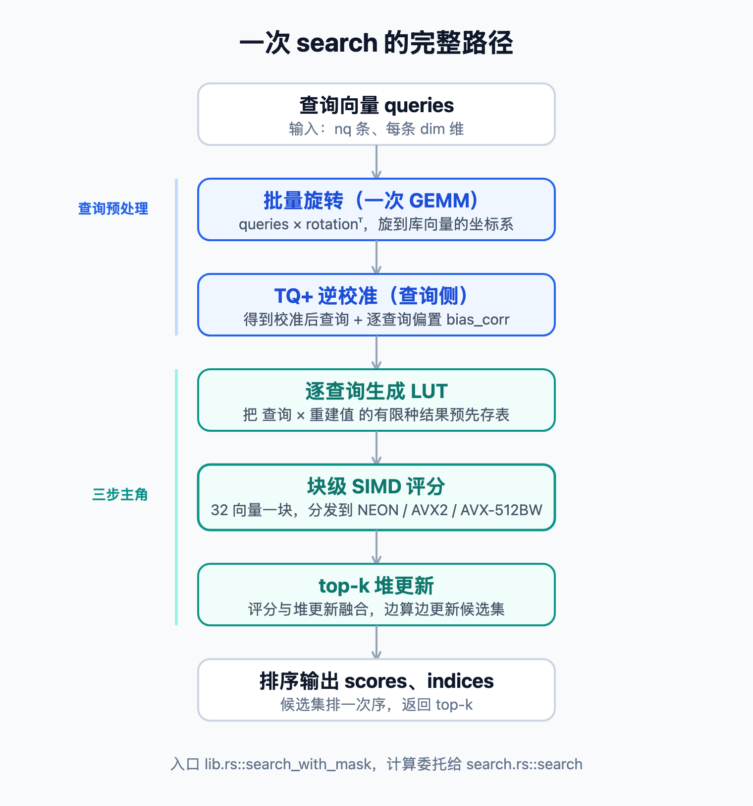

# 学习 turbovec 的 SIMD 搜索内核

在上一篇中，我们沿着 encode.rs 把量化算法走了一遍：随机旋转把每个坐标压到 Beta 分布上，Lloyd-Max 码本求出最优的标量量化器，TQ+ 校准做 5/95% 分位对齐，长度归一化修正补回内积的系统性偏差。这一整套流程解决的是精度和内存的问题，一个 1536 维的 float32 向量被压成 4-bit 编码，体积缩小到原来的八分之一，Recall@1 还能稳住甚至反超 FAISS。

不过压缩只是故事的一半。向量被压成了一串 4-bit 编码以后，搜索的时候这些编码到底是怎么被高速扫描的？10 万条向量、每条 1536 维、4-bit，落到内存里是 73.6 MB 的紧凑字节流，一次查询要在这上面算出 top-k。turbovec 之所以能在 Apple M3 Max 上单线程跑到约 2.0 ms、比 FAISS IndexPQFastScan 快 19%，靠的就是 search.rs 里那套手写 SIMD 内核。今天我们就来读这部分代码，把整个搜索内核拆开看。

## 搜索路径全景

先看一次 `search` 调用都发生了什么。代码入口在 lib.rs 的 `search_with_mask`，真正的计算委托给 search.rs 的 `search` 函数。整条路径如下：



这几步都对应 search.rs 里的一段代码，我们顺着往下走。

### 第一步：批量旋转

上一篇讲过，库向量在编码时都乘过一个随机正交矩阵 `Q`，它是数据无关的常量，放在 `OnceLock` 缓存里，整个索引共用一份。库向量活在旋转后的坐标系里，查询自然也得旋转到同一个坐标系，内积才算得对。所以这里把查询也乘上同一个 `Q`，就是 `search` 函数开头的一次 GEMM：

```rust
// q_ref：把输入 queries 按行包成查询矩阵（nq 条、每条 dim 维）
let q_ref = faer::mat::from_row_major_slice::<f32, _, _>(queries, nq, dim);
// r_ref：同样包好的旋转矩阵 rotation
let r_ref = faer::mat::from_row_major_slice::<f32, _, _>(rotation, dim, dim);
// out_mut 是输出 q_rot；matmul 把 q_ref 乘上 r_ref.transpose()（即 rotation^T）写进去
// 整句就是 q_rot = queries @ rotation^T
faer::linalg::matmul::matmul(
    out_mut, q_ref, r_ref.transpose(), None, 1.0_f32,
    faer::Parallelism::Rayon(0),
);
```

关键在于这里是把所有查询堆成一个矩阵、和旋转矩阵做**一次** GEMM，而不是逐查询做矩阵向量乘。这样能把 FMA 吞吐喂满，缓存里那一份旋转矩阵也在多条查询间复用。

> GEMM（General Matrix Multiply，通用矩阵乘）是线性代数库里最核心的操作，算的就是两个矩阵相乘 `C = A × B`。把多条查询堆成一个矩阵、和旋转矩阵一次乘完，比逐条做矩阵向量乘更能榨干 CPU 的缓存和向量单元，是 BLAS 这类库重点优化的对象。FMA（Fused Multiply-Add，融合乘加）则是把一次乘法和一次加法合并成单条 CPU 指令，一次算出 `a × b + c`，既省一条指令又少一次中间舍入；矩阵乘的内层全是乘加，所以 FMA 的吞吐基本就决定了 GEMM 的速度。

### 第二步：TQ+ 逆校准

这一步同样是上一篇的对偶操作。编码时 TQ+ 对每个坐标做过一次仿射 `(shift, scale)`，把库向量的经验分布拉回理论 Beta；库向量既然被这样变换过，查询侧就要施加配套的逆变换，才能让两边在校准后的空间里算出和原来一致的内积。

干这件事的是 `calibrate_queries`，它对每条查询走下面这个循环：

```rust
// q_row：这条旋转后的查询；calib_row：要写出去的校准后查询；bc：正在累加的偏置
for d in 0..dim {
    // tqplus_scale[d] 是编码时给该坐标乘过的缩放，逆过来就是除以它
    calib_row[d] = q_row[d] / tqplus_scale[d];
    // tqplus_shift[d] 是编码时加过的平移，在内积里只贡献一个与库向量无关的常数项，
    // 不必逐坐标改查询，把这些常数全累加进 bc 即可
    bc -= (q_row[d] as f64) * (tqplus_shift[d] as f64);
}
// 循环结束，bc 就是这条查询的偏置修正 bias_corr
*bias = bc as f32;
```

两样合起来，SIMD 内核拿到的就是一条普通的校准后查询 `calib_row` 和一个偏置 `bias_corr`，对 TQ+ 的存在毫无感知，照常算内积即可。

### 后面三步

剩下的三步是这篇的主角，留到后面几节展开：

1. **生成 LUT**：每条查询独立构建一张查找表，是整个内核的核心。
2. **块级 SIMD 评分**：按 32 向量一块、按平台分发到 NEON / AVX2 / AVX-512BW 内核。
3. **top-k 堆更新**：评分和堆更新融合在一起，不必先把全库的分数都算出来存成一个大数组。

我们从 LUT 开始。

## LUT 查表

向量搜索的内积，本质是把查询和库向量的每一维相乘再求和。库向量已经被量化成了码字（code），每个坐标只有 2^bits 种可能的取值。以 4-bit 为例，一个坐标的码字只有 16 种。那么 `查询[d] * 重建值[code]` 这个乘积，对固定的查询和固定的坐标 d，也只有 16 种结果。

既然只有 16 种结果，就没必要在搜索时反复做乘法，提前把这 16 个结果算好存成一张表就行。搜索时拿库向量的码字当下标去查表、累加，乘法被彻底消掉了。这张表就是 **查找表（Look-Up Table，简称 LUT）**。

建表的逻辑在 `build_query_neon_lut_from_slice`。在供 SIMD 扫描的块布局里，一个字节装两个 4-bit 码字（也就是半字节，英文叫做 nibble），低 nibble、高 nibble 正好各对应一个坐标。我们把「一个字节、两个坐标」这一小撮叫一个**字节组**，1536 维就拆成 768 个字节组。函数为每条查询、每个字节组建两张 16 项子表，低 nibble、高 nibble 各一张，每个表项就是前面说的那个预计算乘积（`查询[d] * 重建值[code]`）：

```rust
// dim_start 是第 g 个字节组的起始坐标（低 nibble 对应的那一维）
// 低 nibble 子表，16 个表项（这里按 4-bit 简化）
for nibble_val in 0u16..16 {
    // 表项 = 查询在该坐标的值 × 该码字对应的重建中心点 centroid
    let s = q_rot_row[dim_start] * centroids[nibble_val as usize];
    float_vals[g * 32 + nibble_val as usize] = s;
}
```

算出来的表项是 float，但后面 SIMD 查表要的是 u8，所以还得量化一遍。turbovec 借鉴了 FAISS 的 per-sub-table 量化：每张 16 项子表先减掉自己的最小值再做 u8 取整，所有表共享一个 `scale = max_span / max_lut`，这样可以避免用全局最小值时不同子表值域不一致带来的系统性舍入偏差。函数注释里也提到了这点：

```rust
/// Uses FAISS-style per-sub-table quantization: each 16-entry nibble
/// LUT subtracts its own min before u8 rounding, with a single
/// shared `scale = max_span / max_lut`.
```

这里 `max_lut` 固定为 127，是个关键数字。为什么是 127 而不是 128 呢？因为搜索时，一个字节里低 nibble、高 nibble 这两张子表会各查一次，两个结果要先在 u8 里相加，而 u8 最大只能装 255。两个表项各自最大都是 `max_lut`，相加不能溢出，`2 * 127 = 254` 刚好不超，换成 128 就是 `2 * 128 = 256`，把 u8 撑爆了。所以表项的上限只能取到 127。

表建好了，接下来就是怎么用一条指令把它查出来。SIMD 的字节洗牌指令恰好能用一条指令完成 16 路甚至 32 路的并行查表，这正是 FAISS FastScan 的核心技巧，turbovec 把它原样搬了过来。

> **SIMD（Single Instruction Multiple Data，单指令多数据）** 是一类 CPU 指令，一条指令同时对一批数据做相同的运算。普通指令一次加一对数，SIMD 指令一次加 8 对、16 对甚至 32 对。

> **字节洗牌指令（byte shuffle）** 也是一条 SIMD 指令，只不过它每个通道做的不是加减乘，而是"按下标取数"：给一张 16 字节的小表和一组下标，每个通道各自拿本通道的下标去表里取出对应的那个字节。当这张小表正好是 LUT、下标正好是库向量的码字时，一条指令就让所有通道同时各查各的。

具体到这条字节洗牌指令，调用它的内建函数在 ARM 上叫 `vqtbl1q_u8`，x86 上叫 `_mm256_shuffle_epi8`（对应 PSHUFB 这条机器指令）。

> **内建函数（intrinsics）** 是和单条 SIMD 指令一一对应的函数。在代码里写一个内建函数调用，编译器就把它翻译成对应的那条机器指令，不用手写汇编就能发出 SIMD 指令。这套名字不是某门语言专有的，而是 ARM、Intel 随指令集一起发布的标准命名（ARM 的以 `v` 开头、x86 的以 `_mm` 开头）。

这两个内建函数做的事情是一样的：拿一个 16 字节的表当查找表，拿另一个寄存器的每个字节当下标，一条指令把所有通道的查表结果同时取出来。这里的通道（lane）就是 SIMD 寄存器里切分出来的一个个数据槽，一个 128 位寄存器装 16 个字节就是 16 个通道，后面说的 16/32 路并行，路数就是通道数。

把库向量的 nibble 码字塞进下标寄存器，一条指令就完成了 16 路 LUT 查表。查出来的每一路，就是对应那条库向量在这个坐标上的一项内积贡献。把同一条库向量在所有字节组上查到的贡献累加起来，就凑成了它和查询的完整内积，也就是搜索要的相似度得分。这个"累加成得分"的步骤，就由下面各平台的内核来完成。

## NEON 内核

上一节讲的字节洗牌只是一次查表这个最小动作，真正的搜索要把库里成千上万个向量、每个向量几十上百个字节组都扫一遍，再把查到的贡献累加起来。把这套扫描加累加的流程在某个具体指令集上跑起来的，就是内核函数，也就是搜索路径里的第二步「块级 SIMD 评分」。这一步按平台分成三套内核：ARM 走 NEON，x86 走 AVX2 / AVX-512BW，本节先看 NEON，下一节看 AVX。

NEON 内核的主路径其实会把 4 条查询融合成一批来算（`score_4query_block_neon`，后面 x86 内核也是同样的思路）；为了讲清楚单块的机制，下面看的是单查询版本 `score_4bit_block_neon`，4 查询版只是在它的基础上同时推进 4 条查询。这个函数一次处理一个 32 向量的块，把上一节那条洗牌指令放进循环里，沿字节组一组组扫过去，边查表边累加，块内的 32 个向量则靠 SIMD 通道一次并行算完，不用单独再开一层循环。

> **NEON** 是 ARM 处理器的 SIMD 指令集，寄存器宽 128 位，能一次对 16 个字节（或 4 个 float32）做相同运算。苹果 M 系列、几乎所有手机 SoC 以及服务器端的 ARM 芯片都带它，aarch64 平台上的向量加速基本都靠它。下面用到的 `vqtbl1q_u8`、`vaddw_u8` 这些内建函数，都是 NEON 指令。

我把这个函数的非核心部分精简掉，只保留主干：

```rust
let mask = vdupq_n_u8(0x0F);
let v_scale = vdupq_n_f32(scale);
let n_batches = (n_byte_groups + FLUSH_EVERY - 1) / FLUSH_EVERY;
let mut fa = [vdupq_n_f32(bias); 8];   // 8 个 float32x4 累加器，初值为 bias

for batch in 0..n_batches {
    let mut accum = [vdupq_n_u16(0); 4];   // uint16x8 累加器
    // 4 组展开的内循环，交错查表以隐藏 vqtbl1q_u8 的延迟
    while g + 3 < g_end {
        for (lp, cp) in [(lp0, cp0), (lp1, cp1), (lp2, cp2), (lp3, cp3)] {
            let lut_hi = vld1q_u8(lp);
            let lut_lo = vld1q_u8(lp.add(16));
            let c0 = vld1q_u8(cp);
            // 低 nibble 查 lut_lo，高 nibble 查 lut_hi，两次查表相加
            let s0 = vaddq_u8(vqtbl1q_u8(lut_lo, vandq_u8(c0, mask)),
                              vqtbl1q_u8(lut_hi, vshrq_n_u8(c0, 4)));
            accum[0] = vaddw_u8(accum[0], vget_low_u8(s0));   // 8→16 bit 加宽累加
            // ...
        }
        g += 4;
    }
    // 每批结束：uint16 → float，融合乘加进 fa
    for i in 0..4 {
        let lo = vcvtq_f32_u32(vmovl_u16(vget_low_u16(accum[i])));
        fa[i * 2] = vfmaq_f32(fa[i * 2], v_scale, lo);
    }
}
```

代码里 `float32x4`、`uint16x8` 这类名字是 NEON 的向量类型，命名规则是「元素类型 + 通道数」：`uint16x8` 就是 8 个并排的 16 位无符号整数，`float32x4` 是 4 个并排的 float32，正好都占满一个 128 位寄存器。所谓"累加到 `uint16x8` 上"，就是把查表结果累加进这样一个装着 8 个 16 位整数的寄存器，8 个通道各自独立累加。

这段代码里有两处工程细节值得展开。

第一处是**FLUSH_EVERY 分批**。内循环里每次查表的结果是 u8，NEON 用 `vaddw_u8` 把这些 u8 不断加宽累加到一个 `uint16x8` 累加器上。但 u16 最多装 65535，成百上千个字节组一路累下去会溢出，所以累加得分两层来做：内层先在 u16 累加器里快速攒，每攒满 `FLUSH_EVERY` 个字节组（lib.rs 里定为 256），就把 u16 累加器转成 float、乘以 scale、加进外层的 float 累加器 `fa`，再清零、接着攒下一批。这样 u16 累加器始终在安全范围内，整个块扫完，所有批的贡献都汇进了 `fa`。

第二处是**4 组展开隐藏延迟**：`vqtbl1q_u8` 这条查表指令有几个周期的延迟，如果一条接一条地依赖执行，流水线就会空等。内循环一次展开 4 个字节组、交错发射查表指令，让 CPU 在等前一条结果时就能去算后面几条，把延迟藏起来。处理完整的 4 组之后还有一段尾巴循环收拾剩下的 0~3 组。

最后把 8 个 float 累加器乘上逐向量的 `vec_scales`（就是上一篇讲的长度归一化修正），写出 32 个分数。整个块算完，乘法只在建表时做过一次，扫描阶段全是查表加累加。

## AVX 内核

x86_64 平台要复杂一些，因为 x86 上的 SIMD 指令集分了好几代，不同年代的 CPU 支持到哪一代各不相同。所以这边不是一条内核走到底，而是在运行时用 `is_x86_feature_detected!` 探测 CPU 特性，按从快到慢的顺序挑一条路径，挑不到就一路回退，回退链是 AVX-512BW → AVX2 → 标量：

> **AVX（Advanced Vector Extensions）** 是 Intel、AMD 在 x86 上的 SIMD 指令集，turbovec 用到两代：AVX2 寄存器宽 256 位，一次能处理 32 个字节；AVX-512BW 把寄存器加宽到 512 位，一次 64 个字节。它对应的查表指令是 `_mm256_shuffle_epi8`（AVX-512BW 则是 `_mm512_shuffle_epi8`），作用和 NEON 的 `vqtbl1q_u8` 一样，只是一次能处理的字节更多。

```rust
unsafe {
    if is_x86_feature_detected!("avx512bw") && is_x86_feature_detected!("avx512f") {
        search_multi_query_avx512bw(/* ... */);
    } else if is_x86_feature_detected!("avx2") {
        search_multi_query_avx2(/* ... */);
    } else {
        // 既没有 AVX-512BW 也没有 AVX2：逐查询标量评分
        for qo in 0..batch_nq {
            score_query_into_heap(/* ... */);
        }
    }
}
```

三条路径里，两条 SIMD 是性能主力，标量是兜底。

**AVX2 路径**：核心函数 `search_multi_query_avx2` 一次处理 4 条查询，用一个 4×4 的累加器 tile：4 条查询，每条查询 4 个 256 位累加器，4×4=16 个累加器全程待在寄存器里排成一个方阵，这个方阵就是 tile（高性能矩阵乘里「寄存器分块」的常用手法）。这么做是为了让库向量的码字只加载一次、nibble 只拆分一次，然后喂给 4 张不同的 LUT、更新到整个 tile 上，把加载和拆分的成本摊薄到 4 条查询头上。它的查表指令是 `_mm256_shuffle_epi8`，一次处理 32 个通道。和 ARM 不同的是，x86 这边的累加遇到了一个麻烦：`_mm256_shuffle_epi8` 的结果是 u8，但 AVX2 没有方便的 8→16 位加宽累加指令，只能在 16 位通道里累加，而相邻的两个 u8 会挤在同一个 u16 里互相干扰。turbovec 用了一个 SUB 技巧绕过去：

```rust
// 把高字节移到低位再相减，靠符号扩展恢复原值，避免 u16 溢出污染
lo_a0 = _mm256_sub_epi16(lo_a0, _mm256_slli_epi16(lo_a1, 8));
```

简单来说，就是把两个挤在一起的字节通过移位和减法重新分开。这套 SUB 技巧同样来自 FAISS FastScan。

**AVX-512BW 路径**：`search_multi_query_avx512bw` 思路和 AVX2 一致，只是把寄存器换成 512 位：用 `_mm512_inserti64x4` 把两个块的 32 字节码区分别拼进一个 512 位寄存器的低、高 256 位，`_mm512_shuffle_epi8` 一条指令同时查两个块，LUT 则用 `_mm512_broadcast_i64x4` 广播到两个 256 位半区。

**标量兜底**：最后那个 `else` 分支处理两个 `if` 都不命中的情况，也就是一台既无 AVX-512 也无 AVX2 的老 x86 CPU。这时没有 SIMD 可用，就退回到 `score_query_into_heap` 逐条查询、逐个向量地标量评分。现代 CPU 基本都有 AVX2，这个分支很少走到，但留着它，能保证在任何 x86 机器上 `search` 都算得出正确结果，只是慢一些。

## top-k 堆更新

这是搜索路径的第三步。内核每算完一个 32 向量的块，手里就有 32 个分数。一个直白的做法是把全库 N 个向量的分数都算出来、存进一个长数组，再排序取前 k 个。但那样要为 N 个分数分配内存、再扫一遍排序，纯属浪费。turbovec 的做法是边评分边维护一个 top-k 候选集，块一算完就地更新。

这个候选集代码里叫「堆」，但实现得很轻：一个大小为 k 的定长数组，外加一个变量记着当前数组里最小的那个分数（也就是「第 k 大」的门槛）。更新逻辑就两条：候选集还没装满 k 个时，分数直接塞进去；装满之后，只有当新分数比门槛还大，才替换掉最小的那一项，再重新扫一遍数组找出新的门槛。

这里还藏着一个 SIMD 小优化。候选集装满之后，对每一组分数先做一次阈值剪枝：把 8 个分数和门槛一起比一比，只要一个都没超过，整组直接跳过，连逐个比较都省了。

```rust
let v_hmin = _mm256_set1_ps(*hmin);                     // 当前门槛，广播成向量
let cmp = _mm256_cmp_ps(scores_v, v_hmin, _CMP_GT_OQ);  // 8 个分数各自和门槛比大小
if _mm256_movemask_ps(cmp) == 0 { continue; }           // 一个都没超过，整组跳过
```

库里绝大多数向量本来就进不了 top-k，靠这条剪枝，它们几乎不花什么力气就被刷掉了。所有块扫完，候选集里剩下的就是 top-k，最后排一次序，输出 `scores` 和 `indices`，整条搜索路径就走完了。

## 块级提前退出

上面走完的是一次普通搜索。如果查询还带上了 allowlist / mask，也就是第 2 篇讲的混合检索，内核里就多出一道优化，叫块级提前退出。它能在只有少量向量被放行时大幅省去无用功，函数是 `block_has_allowed`：

```rust
pub(crate) fn block_has_allowed(mask: Option<&[u64]>, base_vec: usize) -> bool {
    match mask {
        None => true,
        Some(m) => {
            let word = m[base_vec >> 6];
            let bit_offset = base_vec & 63;
            // 这一块对应的半个 u64 字里只要有一位是 1，就说明块内有放行的槽位
            ((word >> bit_offset) & 0xFFFF_FFFF) != 0
        }
    }
}
```

逻辑很直接：每个 32 向量块开始评分前，先看这一块里有没有任何一个被 allowlist 放行的槽位。allowlist 被打包成 u64 位图，一个块对应位图里的半个 u64 字，一次整数加载加一次判断就能决定整块跳不跳。没有放行槽位就直接 `continue`，这一块的查表、累加、解码全部省掉。

AVX-512BW 内核更进一步，因为它一次处理 64 向量的块对、刚好对齐一整个 u64 字，所以用 `block_pair_has_allowed` 一次跳过两个块。在 1% 选择率下，这套提前退出在 ARM 上带来 6.4 倍、x86 上带来 12.7 倍加速。不带 mask 的普通搜索完全不受影响，这个逻辑只在传了 mask 时才触发。

## 小结

今天我们读完了 turbovec 搜索内核这块最硬的代码：

1. **搜索路径**：查询旋转用一次 GEMM 批量完成，TQ+ 逆校准合并成逐查询偏置，逐查询建 LUT，再分发到平台内核做块级评分和 top-k 堆更新。
2. **LUT 查表**：把 `查询 * 重建值` 的有限种结果预先存表，用 `vqtbl1q_u8` / `_mm256_shuffle_epi8` 一条指令完成 16/32 路并行查表，这是 FAISS FastScan 的核心技巧。
3. **三路内核**：NEON 顺序扫描、4 组展开隐藏延迟、uint16 加宽累加不溢出；x86 用 4×4 tile 和 SUB 技巧；运行时按 AVX-512BW → AVX2 → 标量的顺序分派，标量分支兜底。
4. **块级提前退出**：带 mask 的混合检索下，用 u64 位图判断整块是否被放行，没放行就跳过整块的查表与累加，1% 选择率下能快 6–13 倍。

回头看这四篇，从快速入门、混合检索，到量化算法、SIMD 内核，从 Python API 一路读到 NEON 内建函数，由表及里算是走了一遍。

说句实话，最后这两篇钻进源码的解读相当晦涩，到现在我对这块的不少逻辑还是似懂非懂，学习和成文的过程很大程度上是借助 Claude 一点点啃下来的。但即便只是似懂非懂，把代码摊开读一遍，心里也比只会调 API 时踏实了一些。希望这个系列能给你一个大致的轮廓，下次在自己的检索系统里遇到内存或速度的瓶颈时，知道有 turbovec 这样一个选择，也对它内部的大致原理有个印象。

## 参考

* [turbovec GitHub 仓库](https://github.com/RyanCodrai/turbovec)
* [turbovec PyPI 页面](https://pypi.org/project/turbovec/)
* [FAISS GitHub 仓库](https://github.com/facebookresearch/faiss)
* [TurboQuant 论文（arXiv）](https://arxiv.org/abs/2504.19874)
* [Arm NEON Intrinsics 参考](https://developer.arm.com/architectures/instruction-sets/intrinsics/)
* [Intel Intrinsics Guide](https://www.intel.com/content/www/us/en/docs/intrinsics-guide/index.html)
* [Rust std::sync::OnceLock 文档](https://doc.rust-lang.org/std/sync/struct.OnceLock.html)
* [faer 线性代数库](https://github.com/sarah-quinones/faer-rs)
* [MarkTechPost 对 turbovec 的报道](https://www.marktechpost.com/2026/05/20/meet-turbovec-a-rust-vector-index-with-python-bindings-and-built-on-googles-turboquant-algorithm/)
