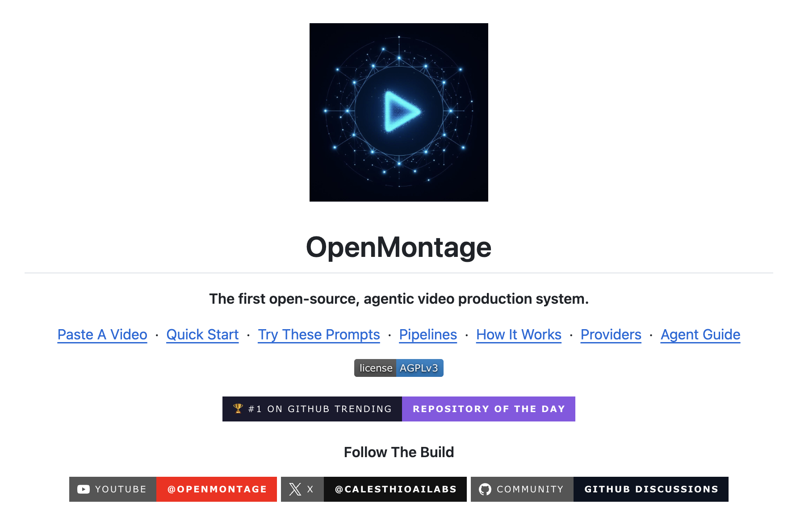
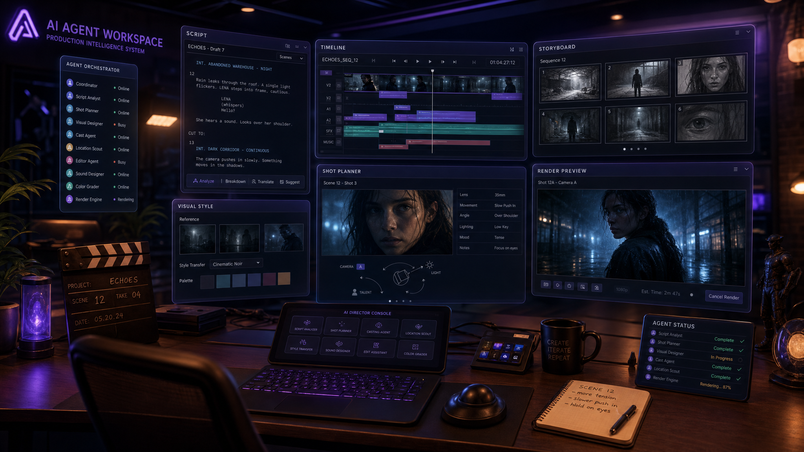
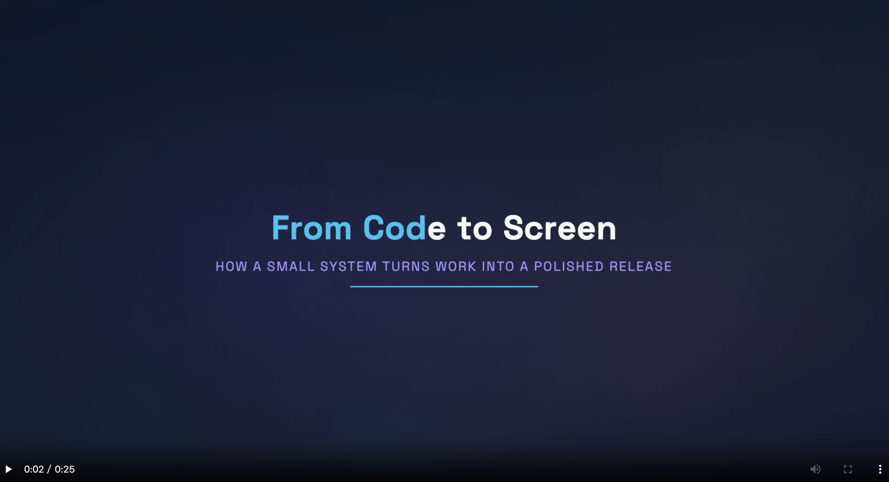

# OpenMontage 快速入门

最近在 GitHub 上看到一个挺有意思的开源项目 [OpenMontage](https://github.com/calesthio/OpenMontage)。它的自我介绍很有野心：**世界上第一个开源的、agentic 的视频制作系统（the first open-source, agentic video production system）**。这个项目低调发育了一阵，最近一举冲上了 GitHub Trending 日榜第一，仓库首页特意挂上了一枚「#1 on GitHub Trending」的徽章，海外的 AI 媒体也跟着报道了一波，目前 star 数已经超过 1.4 万。



它的定位不是又一个「输入提示词、吐出一段 4 秒小视频」的生成模型，而是把你手里的 AI 编程助手（Claude Code、Cursor、Copilot、Windsurf、Codex 这些）直接变成一间视频制作工作室。你用大白话描述想要什么，Agent 会把它拆成一条完整的生产流水线，自动完成调研、写脚本、生成素材、剪辑和合成。

> Montage（蒙太奇）是个法语词，词根 monter 意为「组装、拼接」，在电影里指把一组分散的镜头按顺序剪辑、拼接成一个连贯整体的手法，这套理论由爱森斯坦等苏联电影人在 1920 年代系统化。OpenMontage 的名字就是 Open（开源）加 Montage（剪辑组接）：它干的核心不是文生图、文生视频那种单点生成，而是把素材剪辑、组接成成片，项目里甚至有一条流水线就叫 Documentary Montage。

它最让我觉得有意思的一句话是这样的：

> OpenMontage can make image-based videos, but it can also make a real **video video** for free/open-source workflows.

意思是说，市面上大多数号称「免费 AI 视频」的方案，本质上都是把几张静态图片做点 Ken Burns 推拉摇移，再配个旁白凑成视频。OpenMontage 也能做这种，但它还支持一种更实在的做法：Agent 从 Archive.org、NASA、Wikimedia Commons 这些免费开放档案里检索**真实的动态素材**，按语义排序后剪进时间轴，渲染成一条真正的成片。而且全程一分钱 API 费用都不用花。

> Ken Burns 是一位美国纪录片导演，代表作有《内战》《国家公园》等。他特别擅长用一种手法让静态的老照片动起来：镜头在一张照片上缓慢地推近、拉远或平移，配合旁白引导观众的视线。这种「在静止画面上做缓慢推拉摇移」的效果后来就被叫做 **Ken Burns 效果（Ken Burns effect）**，几乎成了图片转视频的标配，很多视频软件里都内置了同名的一键功能。

免费就能剪出一条真实素材的成片，这话光看项目介绍还不太敢信，得自己上手跑一遍才知道靠不靠谱。这个系列就从这里开始。

## OpenMontage 是什么

先看几个数字，官方给出的规模是 **12 条生产流水线（pipeline）、52 个工具（tool）、500+ 个 Agent 技能（skill）**。这三个数字分别对应它的三个层次，后面讲架构时会展开。

它支持的视频类型相当全，每一条流水线就是一种完整的制作工作流：

* **Animated Explainer**：AI 生成的科普解说视频，自带调研、旁白、配图、配乐
* **Documentary Montage**：从免费素材库和开放档案里检索真实镜头，剪成纪录片式蒙太奇
* **Cinematic**：电影感的预告片、teaser
* **Clip Factory**：把一条长视频批量切成多个排好序的短视频
* **Talking Head / Avatar Spokesperson**：真人或数字人出镜的讲述类视频
* **Podcast Repurpose**：把播客转成视频
* **Localization & Dub**：给已有视频做字幕、翻译和配音
* **Screen Demo**、**Animation**、**Hybrid**、**Character Animation** 等

前面说的零 key 路线是完全免费的。如果你愿意接上付费模型（比如 Kling、OpenAI、FLUX），效果更好，花的钱也不多。官方仓库首页放了好几条用 OpenMontage 完整制作出来的样片，每条都标了成本：一条 60 秒的皮克斯风格动画短片《THE LAST BANANA》，用了 6 段 Kling v3 生成的动态镜头、Google Chirp3-HD 旁白、免版税钢琴曲和 TikTok 式逐词字幕，总成本 **1.33 美元**；一条只用了一个 OpenAI key 的产品广告《VOID》，4 张 gpt-image-1 图片加 TTS 旁白，总成本 **0.69 美元**；几条吉卜力风格的动画，纯用 FLUX 生成的图片加 Remotion 动画引擎，没用任何视频生成 API，单条成本只要 **0.15 美元**。



它的几个核心特性是：

* **Agent 优先（agent-first）**：没有 Python 写的编排器，你的 AI 编程助手本身就是编排器，所有创作决策、流程流转、质量审查都写在指令文件里
* **参考视频驱动**：可以直接丢一个 YouTube、Short、Reel、TikTok 或本地视频给它，Agent 分析转录文本、节奏、分镜、关键帧和风格，再给你 2~3 个差异化的方案
* **联网调研是一等公民**：写脚本之前，Agent 会先跑 15~25 次以上的网络搜索，覆盖 YouTube、Reddit、新闻和学术来源，把视频建立在真实、当下的信息上，而不是凭空捏造
* **本地与云端并存**：每一种能力都同时支持开源本地方案和付费 API，有什么用什么，零 key 也能出片
* **质量门禁与预算治理**：渲染前估算成本、设花费上限，渲染后强制自检（ffprobe 校验、抽帧、音频电平分析），不合格不交付

它用的开源协议是 [AGPLv3](https://github.com/calesthio/OpenMontage/blob/main/LICENSE)。

## 对比其他 AI 视频工具

大多数 AI 视频工具是「一个提示词换一个片段」，OpenMontage 给你的是一条**端到端的生产流水线**，和真实制作团队走的流程是一样的，只不过执行者换成了你的 AI 编程助手。

理解 OpenMontage 的关键，是它的 **agent-first 架构**。官方文档 `PROJECT_CONTEXT.md` 里是这样描述它的设计理念的：

> The AI agent IS the intelligence. Python exists only for tools and persistence.

也就是说，Python 在这里只负责两件事：提供工具、保存状态。真正的智能在 Agent 那里。整个流程没有 Python 编排器，没有 Python 审查器，没有 Python 流转逻辑，全部由 Agent 读取指令文件来驱动。它的运行流程大致如下：

```
你用大白话描述需求
  ↓
Agent 读取流水线清单（YAML，含阶段、工具、审查标准、成功门禁）
  ↓
Agent 读取阶段导演技能（Markdown，教它每个阶段怎么做）
  ↓
Agent 调用 Python 工具，按 7 个维度打分选择最优供应商
  ↓
Agent 用审查技能自检（Schema 校验、质量检查）
  ↓
Agent 保存检查点（JSON，可恢复，带决策日志和成本快照）
  ↓
呈现给你审批（每个创作决策点你都掌控）
  ↓
渲染前校验门禁（交付承诺、幻灯片风险、渲染器治理）
  ↓
渲染（Remotion 或 FFmpeg）
  ↓
渲染后自检（ffprobe、抽帧、音频分析、承诺核对）
  ↓
输出最终视频（仅当自检通过）
```

这套机制带来一个直接的好处：所有的编排逻辑、审查标准、质量红线都写在可读的指令文件里（YAML 清单加 Markdown 技能），你可以直接打开看、随手改。每个决策还会记录下它考虑过哪些备选项、置信度多少、为什么这么选，全程留痕。

## 安装与初体验

说了这么多，不如直接跑一遍。OpenMontage 的安装很轻量，核心依赖只有 `pyyaml`、`pydantic`、`Pillow`、`requests` 这几个 Python 包。

### 环境准备

动手之前，先确认本机具备以下环境：

* **Python 3.10+**
* **FFmpeg**：`brew install ffmpeg`（macOS）或 `sudo apt install ffmpeg`（Linux）
* **Node.js 18+**：渲染引擎 Remotion 是基于 React 的，需要 Node 环境
* **一个 AI 编程助手**：Claude Code、Cursor、Copilot、Windsurf 或 Codex 都行

可以先验证一下：

```bash
$ python --version
Python 3.11.15

$ ffmpeg -version
ffmpeg version 8.1.1 Copyright (c) 2000-2026 the FFmpeg developers
built with Apple clang version 17.0.0 (clang-1700.6.4.2)

$ node --version
v24.12.0
```

### 克隆与安装

把仓库克隆下来，然后一条 `make setup` 搞定安装：

```bash
$ git clone https://github.com/calesthio/OpenMontage.git
$ cd OpenMontage
$ make setup
```

该命令的运行结果如下：

```
==> Installing Python dependencies...
pip install -r requirements.txt
...

==> Installing Remotion composer...
cd remotion-composer && npm install
...

==> Installing free offline TTS (Piper)...
pip install piper-tts || echo "  [skip] piper-tts install failed — TTS will use cloud providers instead"
...

==> Installing HyperFrames runtime (cache-warm via npx)...
    Pulls the 'hyperframes' npm package into the local npx cache so the
    first render doesn't pay a 30-60s cold-fetch penalty. ~20MB of disk.
    HyperFrames CLI cached (npx)
    HyperFrames runtime_available=True, npm=0.7.4

==> Created .env from .env.example — add your API keys there.

Done! Open this project in your AI coding assistant and start creating.
  Optional: add API keys to .env to unlock cloud providers.
  Optional: run 'make install-gpu' if you have an NVIDIA GPU.
  Optional: run 'make hyperframes-doctor' to fully validate the HyperFrames runtime.
  Optional: run 'make hyperframes-warm' anytime to refresh the npx cache to the latest hyperframes version.
```

可以看到，`make setup` 一条命令就把整套运行环境依次准备好了，每个 `==>` 对应一步：

1. **安装 Python 依赖**：`pip install -r requirements.txt`，装上 pyyaml、pydantic、Pillow 等核心库，这是工具层运行的基础
2. **安装 Remotion 合成器**：进到 `remotion-composer` 目录跑 `npm install`，Remotion 是默认的 React 渲染引擎，靠它把分镜合成最终视频
3. **装免费离线 TTS（Piper）**：这一步是零 key 也能出片的关键，旁白合成不依赖云端；这里用了 `|| echo`，意味着即便装失败也不会中断，后面会自动改用云端 TTS
4. **预热 HyperFrames 运行时**：通过 `npx` 把 `hyperframes` 包提前拉进本地缓存，省掉首次渲染时 30~60 秒的冷启动等待；输出里的 `runtime_available=True, npm=0.7.4` 说明 HyperFrames 这条渲染线路也已就绪
5. **生成 `.env` 配置文件**：从 `.env.example` 拷一份 `.env`，以后要接付费供应商就往这里填 key

最后那几行 `Optional` 是可选动作：有 NVIDIA GPU 的话可以跑 `make install-gpu` 解锁本地视频生成，`make hyperframes-doctor` 能完整体检 HyperFrames 运行时。看到 `Done!` 这一行，就说明零 key 的免费工具链已经齐活，可以开始做视频了。

> [**Remotion**](https://www.remotion.dev/) 是一个用 React 写视频的开源框架，把 React 组件和动画渲染成一帧帧画面，再用 FFmpeg 编码成视频；同一套组件传入不同的参数就能生成不同内容，OpenMontage 默认用它合成文字卡片、数据图表这类程序化画面。

> [**HyperFrames**](https://github.com/heygen-com/hyperframes) 是另一条渲染线路，由 HeyGen 开源，思路和 Remotion 类似（底层都用无头 Chrome 加 FFmpeg 渲染），区别在于它不依赖 React，直接用 HTML / CSS / [GSAP](https://gsap.com/)（一个主流的 JavaScript 动画库）来做动态排版和动效，更适合 motion graphics 风格、产品宣传片那类画面。

> [**Piper**](https://github.com/rhasspy/piper) 是一个完全离线的开源 TTS（文本转语音）引擎，由 Rhasspy 项目维护，发音自然、不联网也不花钱，正是零 key 出片时的默认旁白来源。

### 零 key 也能出片

OpenMontage **不配任何付费 API key，开箱即用就能做出真视频**。`make setup` 之后，你已经拥有这样一套免费工具链：

| 能力 | 免费工具 | 做什么 |
| ---- | ------- | ------ |
| 旁白 | Piper TTS | 离线免费的文本转语音，发音接近真人 |
| 开放素材 | Archive.org + NASA + Wikimedia Commons | 免费开放的档案影像、教育媒体、纪录片素材 |
| 额外图库 | Pexels + Unsplash + Pixabay | 免费图库视频和图片，开发者 key 免费申请 |
| 合成（React） | Remotion | 基于 React 渲染，弹簧动画图片场景、文字卡、数据卡、图表、抖音式逐词字幕、数字人 |
| 合成（HTML/GSAP） | HyperFrames | 基于 HTML/CSS/GSAP 渲染，动感排版、产品宣传、发布预告、网页转视频、SVG 角色动画 |
| 后期 | FFmpeg | 编码、字幕烧录、音频混音、调色 |
| 字幕 | 内置 | 自动生成带逐词时间轴的字幕 |

需要说明的是，Pexels、Unsplash、Pixabay 这三个虽然要 key，但都是开发者免费申请的，不涉及任何付费，所以也算在零成本范围内。

想立刻看到效果，可以跑一下零 key 的 demo，它只用 Remotion 组件渲染动画图表、文字和数据可视化，不碰任何需要联网或付费的生成模型：

```bash
$ make demo
==> Rendering zero-key demo videos (no API keys needed)...
    These use only Remotion components — animated charts, text, data viz.

Rendering: code-to-screen
Props:     remotion-composer/public/demo-props/code-to-screen.json
Output:    projects/demos/renders/code-to-screen.mp4

Downloading Chrome Headless Shell https://www.remotion.dev/chrome-headless-shell
Got Headless Shell   ━━━━━━━━━━━━━━━━━━ 132472ms
Bundled code         ━━━━━━━━━━━━━━━━━━ 2187ms
⚡️ Cached bundle. Subsequent renders will be faster.
Composition          Explainer
Codec                h264
Concurrency          4x
Rendered frames      ━━━━━━━━━━━━━━━━━━ 79491ms
Encoded video        ━━━━━━━━━━━━━━━━━━ 3666ms
Done: projects/demos/renders/code-to-screen.mp4 (3.6 MB)

Rendering: focusflow-pitch
...
Rendered frames      ━━━━━━━━━━━━━━━━━━ 72604ms
Done: projects/demos/renders/focusflow-pitch.mp4 (4.0 MB)

Rendering: world-in-numbers
...
Rendered frames      ━━━━━━━━━━━━━━━━━━ 75020ms
Done: projects/demos/renders/world-in-numbers.mp4 (4.1 MB)
```

可以看到，这条命令一口气渲染了三条 demo 视频：`code-to-screen`、`focusflow-pitch` 和 `world-in-numbers`，分别对应代码上屏、产品路演和数据可视化三种风格。每条视频的数据都来自 `demo-props/` 下的一个 JSON 文件，套用的是同一个名为 `Explainer` 的 Remotion 合成（composition），用 h264 编码、4 路并发渲染。

有几个点值得留意：

* **首次渲染会先下载无头 Chrome**：Remotion 底层是用无头 Chrome 把页面一帧帧截下来，所以第一次跑会先拉一个 `chrome-headless-shell`，这是一次性的，之后走缓存。同理 `Bundled code`（打包）第一次要完整构建，后两条直接命中缓存（`⚡️ Cached bundle`）
* **纯本地、纯 CPU**：整个过程没有调用任何付费 API，产物是 3.6~4.1 MB 的 mp4，落在 `projects/demos/renders/` 目录下

这一步其实就把「零 key 出片」这条链路完整验证了一遍：**Remotion + 无头 Chrome + FFmpeg**，不花一分钱也能渲出真视频。

打开渲染出来的 mp4，效果如下：



### 零 key 视频的本质

我们顺便看一眼源码，看看一支零 key 视频在落地时到底长什么样。上面截图里这条 `code-to-screen`，数据就来自 `remotion-composer/public/demo-props/code-to-screen.json`，我们打开看看结构（只截了前两个镜头）：

```json
{
  "theme": "flat-motion-graphics",
  "cuts": [
    {
      "id": "code-hook",
      "type": "hero_title",
      "in_seconds": 0,
      "out_seconds": 3.5,
      "text": "From Code to Screen",
      "subtitle": "How a small system turns work into a polished release"
    },
    {
      "id": "code-tip",
      "type": "callout",
      "in_seconds": 3.5,
      "out_seconds": 7.5,
      "title": "Shipping Rule",
      "text": "Start with one visible win, then automate the repeatable path."
    }
  ]
}
```

这份 props 的结构一目了然：

1. **theme**：整体风格，这里用的是 `flat-motion-graphics` 风格手册
2. **cuts**：一个数组，每一项是一个镜头，按时间轴排开
3. **type**：镜头类型，`hero_title` 是大标题，`callout` 是提示卡，这条片子后面还用了 `comparison`（对比卡）、`progress_bar`（进度条）、`kpi_grid`（KPI 网格）等
4. **in_seconds / out_seconds**：这个镜头在时间轴上的起止秒数

除了 `cuts`，这份 props 里还有 `overlays`（叠加层，比如分节标题、数字浮现）、`captions`（字幕）和 `audio`（音频）几个字段。

说穿了，一支零 key 视频的本质，就是一个 Remotion React 组件接收这么一份 JSON props，再把它渲染成 MP4。刚才 `make demo` 渲出来的那几条，背后就是这么一回事。

### 跑你的第一条视频

真正的玩法是在 AI 编程助手里跑。用你的编程助手打开 OpenMontage 项目目录，然后像聊天一样把需求说给它听：

```
Make a 45-second animated explainer about why the sky is blue
```

Agent 会先选定流水线（这里是 Animated Explainer），读取清单和阶段技能，联网调研「天空为什么是蓝色」，写脚本、配旁白、生成配图、自动找免版税背景音乐、烧录逐词字幕，最后渲染成片。在你看到成片之前，它还会跑一轮多点自检。整个过程中的每个创作决策点，它都会停下来问你是否同意。

如果你想做的是真实素材的纪录片式视频，记得在提示词里明确说 **use real footage only**：

```
Make a 90-second documentary montage about what a city feels like at 4am.
Use real footage only, no narration, elegiac tone.
```

想解锁更多工具，就往 `.env` 里加 key，每个 key 都是可选的，加得越多能用的供应商越多：

```bash
# .env —— 每个 key 都是可选的，有什么填什么

# --- 图片 + 视频网关 ---
FAL_KEY=your-key               # FLUX 图片，Google Veo、Kling、MiniMax 视频，Recraft 图片

# --- Google（一个 key 同时解锁图片生成和 TTS）---
GOOGLE_API_KEY=your-key        # Google Imagen 图片，Google Cloud TTS（700+ 音色、50+ 语言）

# --- 配音 ---
ELEVENLABS_API_KEY=your-key    # TTS 旁白、AI 音乐、音效
OPENAI_API_KEY=your-key        # OpenAI TTS、DALL-E 图片
XAI_API_KEY=your-key           # Grok 图片生成/编辑、Grok 视频生成
DOUBAO_SPEECH_API_KEY=your-key # 火山引擎豆包语音 TTS
# Piper 本地音色无需 key，pip 装上 piper-tts 即可

# --- 音乐 ---
SUNO_API_KEY=your-key          # Suno AI 音乐生成（整曲、伴奏、各种曲风）

# --- 视频生成 ---
HEYGEN_API_KEY=your-key        # HeyGen（一个 key 调 VEO、Sora、Runway、Kling、Seedance）
RUNWAY_API_KEY=your-key        # Runway Gen-4 直连 API
VIDEO_GEN_LOCAL_ENABLED=true   # 设为 true 启用本地视频生成（需 GPU + diffusers）
VIDEO_GEN_LOCAL_MODEL=wan2.1-1.3b  # 本地模型：wan2.1-1.3b / wan2.1-14b / hunyuan-1.5 / ltx2-local / cogvideo-5b

# --- 库存素材 ---
PEXELS_API_KEY=your-key        # Pexels 免费库存视频/图片
PIXABAY_API_KEY=your-key       # Pixabay 免费库存视频/图片
UNSPLASH_ACCESS_KEY=your-key   # Unsplash 免费库存图片（开发者 key 免费申请）

# --- 分析 ---
HF_TOKEN=your-key              # HuggingFace token，开启转写时的说话人分离
```

## 小结

今天我们认识了 OpenMontage 这个近期冲上 GitHub Trending 第一的开源项目。简单回顾一下要点：

1. **定位**：世界上第一个开源的 agentic 视频制作系统，把 AI 编程助手变成一间端到端的视频工作室，覆盖 12 条流水线、52 个工具、500+ 个技能
2. **agent-first 架构**：没有 Python 编排器，Agent 读取 YAML 清单和 Markdown 技能来驱动整条流水线，所有决策留痕
3. **零 key 出片**：靠 Piper、Archive.org、Remotion、HyperFrames、FFmpeg 这套免费工具链，不花一分钱也能做出真视频

不过今天我们只是把它装好、用零 key 渲出了几条 demo。OpenMontage 真正有意思的地方在于它那套流水线和三层知识架构，以及 Agent 是如何一步步读懂清单、调用工具、自我审查的。这些细节我们留到后面的文章里慢慢展开。上面「跑你的第一条视频」里，我们已经分别用一句提示词试了图片视频和真实素材纪录片两种做法。下一篇，我们就把这两种做法摊开来细讲，看看不花一分钱、不配任何付费 API key，OpenMontage 到底能做出什么样的视频。

## 参考

* [OpenMontage GitHub 仓库](https://github.com/calesthio/OpenMontage)
* [OpenMontage LICENSE（AGPLv3）](https://github.com/calesthio/OpenMontage/blob/main/LICENSE)
* [AIToolly：OpenMontage 开源报道](https://aitoolly.com/ai-news/article/2026-06-22-openmontage-the-worlds-first-open-source-agentic-video-production-system-debuts-on-github)
* [Remotion 官网](https://www.remotion.dev/)
* [HyperFrames GitHub 仓库](https://github.com/heygen-com/hyperframes)
* [Piper TTS 项目](https://github.com/rhasspy/piper)
* [GSAP 动画库官网](https://gsap.com/)
* [FFmpeg 官网](https://ffmpeg.org/)
