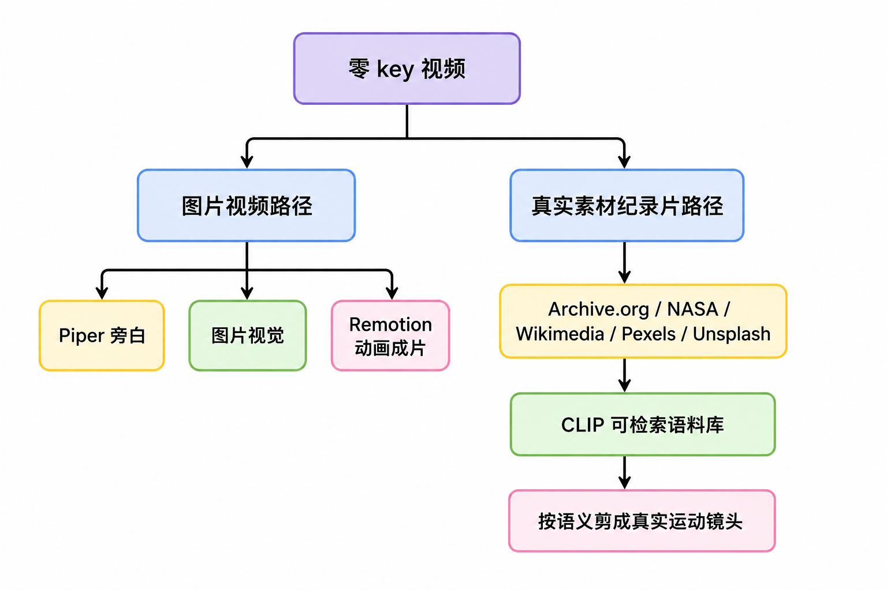
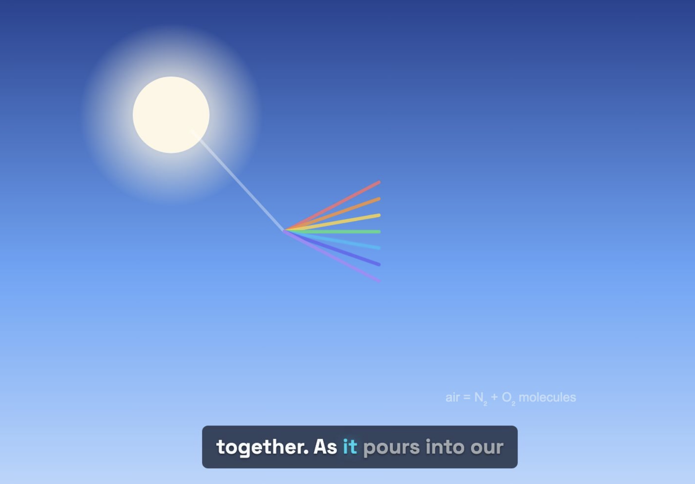
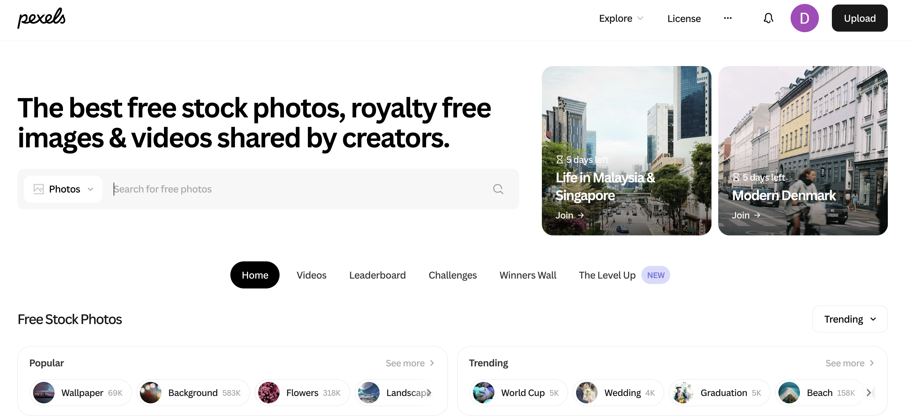
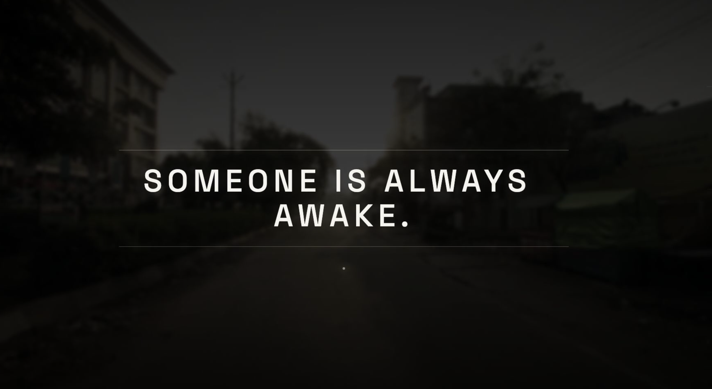

# 学习 OpenMontage 的零成本视频制作

在上一篇的最后，我们在 AI 编程助手里各试了一句提示词：一句做「天空为什么是蓝色」的动画解说，一句做「凌晨四点的城市」的真实素材纪录片。当时只是让它们跑了起来，没展开讲背后发生了什么。这一篇我们就把这两个例子摊开，看看不花一分钱、不配任何付费 API key，OpenMontage 到底是怎么做出这两类视频的。

零 key 这件事值得单独拿出来讲，是因为市面上很多打着免费旗号的 AI 视频工具，本质上都是把几张静态图做成动画，也就是所谓的 animate still images。OpenMontage 的零 key 路径不止于此，既能用 Piper 配音加图片做出动起来的成片，也能从开放素材库里检索真实运动镜头，剪成一支纪录片式的片子。下面我们就来实战这两条路径。

## 零 key 的两条路径

上一篇里我们已经把零 key 的免费工具链盘过一遍：旁白有 Piper，素材有 Archive.org / NASA / Wikimedia 加免费图库，合成有 Remotion 和 HyperFrames，后期有 FFmpeg，字幕内置，一条完整的视频生产链路每个环节都有免费工具兜底。OpenMontage 把这些能力归纳成两条可以直接上手的路径：一条是图片视频路径，一条是真实素材纪录片路径。



两条路径的取舍，可以用下面这张表对比：

| 维度 | 图片视频路径 | 真实素材纪录片路径 |
| ---- | ----------- | ---------------- |
| 视觉来源 | 静态图片 | 真实运动镜头 |
| 运动来源 | Remotion 弹簧动画、镜头运动 | 素材本身的真实运动 |
| 典型成片 | 解说类、数据驱动的科普视频 | 纪录片蒙太奇、情绪短片 |
| 对应 pipeline | animated-explainer 等 | documentary-montage |
| 旁白 | Piper 配音常用 | 可有可无，常用纯音乐 |

## 图片视频路径

第一条路径最接近大家印象里的免费 AI 视频，但 OpenMontage 把它做得更完整：Piper 给脚本配音，Remotion 把画面做成有弹簧动画、镜头运动、字幕的成片。这里的画面既可以是生成或检索来的图片，也可以是 Remotion 纯合成的矢量动画，下面的实测里它干脆一张图都没用。

直接复制下面这句提示词到你的 AI 编程助手里：

```text
Make a 45-second animated explainer about why the sky is blue
# 做一个 45 秒的动画解说视频，讲讲天空为什么是蓝色
```

这句提示词不带任何素材生成的诉求，agent 会自己走完调研、写脚本、配音、做画面、渲染这条链路，每个创作节点都会停下来等你确认。整条链路不需要付费视频生成模型。

这里的关键是 Remotion 的合成能力。它不是简单地把图片轮播，而是提供了一整套 React 场景组件：弹簧动画的图片场景、文字卡（`text_card`）、数据卡（`stat_card`）、各类图表、分节标题、大标题卡，以及抖音式的逐词字幕和场景转场。所以这条路径特别适合数据驱动的科普视频，讲一个知识点、配几张图、再用图表把数字立起来。

我用 Claude Code 把上面这句提示词实测跑了一遍。agent 先选定 animated-explainer 流水线，做了一轮联网调研，给出四个创意方向供选择：

* **一条规律，两种天空**（叙事向，agent 推荐）：用同一个机制串起正午的蓝天和黄昏的红日，画面从白昼自然过渡到日落，45 秒里有个收得住的结尾
* **天空本该是紫色**（破除迷思向）：用「按物理推算天空该是紫色」这个反直觉的钩子开场，再揭开它实际是蓝色的原因
* **5.5 倍的竞赛**（数据驱动向）：围绕波长展开，短蓝波被空气分子弹开的概率约是红波的 5.5 倍，以数据卡为主
* **光的障碍赛**（类比向）：把阳光比作穿过分子场的赛跑者，小个子的蓝波被撞得四处偏折，大块头的红波径直穿过

我选了「一条规律，两种天空」，它再据此写出一份 45 秒、115 词的脚本并通过 schema 校验。下面是这份脚本的主体（为方便阅读，略去了每段的配音指导、分镜提示等字段，只保留旁白文本和时间轴）：

```json
{
  "version": "1.0",
  "title": "Why Is the Sky Blue?",
  "total_duration_seconds": 45,
  "sections": [
    {
      "id": "s1", "label": "Hook",
      "text": "Sunlight looks white. So why is the sky above you blue, and not green, or pink?",
      "start_seconds": 0, "end_seconds": 6
    },
    {
      "id": "s2", "label": "Setup",
      "text": "That white light is really every color mixed together. As it pours into our air, it strikes countless tiny molecules of gas.",
      "start_seconds": 6, "end_seconds": 14.5
    },
    {
      "id": "s3", "label": "The Rule",
      "text": "Here's the one rule behind it all: the shorter the wave, the more it scatters. Blue scatters about five times more than red, so it ricochets across the whole sky and into your eyes.",
      "start_seconds": 14.5, "end_seconds": 27.5,
      "source_ref": "Rayleigh scattering intensity scales as 1/lambda^4; blue ~450nm scatters ~5.5x more than red ~700nm"
    },
    {
      "id": "s4", "label": "Why Not Violet",
      "text": "Violet scatters even more. But the sun sends less of it, and your eyes simply prefer blue.",
      "start_seconds": 27.5, "end_seconds": 34.5
    },
    {
      "id": "s5", "label": "The Sunset Payoff",
      "text": "Now drop the sun to the horizon. Its light cuts through far more air, the blue scatters away, and only red survives.",
      "start_seconds": 34.5, "end_seconds": 43
    },
    {
      "id": "s6", "label": "Landing",
      "text": "One rule. Two skies.",
      "start_seconds": 43, "end_seconds": 45
    }
  ],
  "metadata": {
    "concept": "One Rule, Two Skies",
    "playbook": "flat-motion-graphics",
    "word_count": 115,
    "pace_wpm_target": 153,
    "render_runtime": "remotion",
    "music": "none"
  }
}
```

到画面环节，它没有去生成或检索图片，而是现写了一个自定义的 Remotion 组件，用纯 SVG 动画演示瑞利散射，再配上数据卡把「蓝光散射强度约为红光的 5.5 倍」这个数字立起来。配音环节出了点岔子：agent 以为机器上配好了 ElevenLabs、OpenAI、Google、豆包几家云端 TTS，挨个尝试却全部失败（ElevenLabs 直接返回 401），于是自动回退到本地的 Piper 完成旁白。最后本地渲染出 1920×1080 的成片，并自动抽帧逐场质检、用 ffprobe 核对音画。整条链路真实花费 0.00 美元。

> ffprobe 是 FFmpeg 自带的一个命令行工具，专门用来探测媒体文件的内部信息：时长、分辨率、帧率、编码格式、有没有音轨、码率多少等等，只读不改、也不重新编码。OpenMontage 在渲染后的自检里就用它来核对成片是否符合预期，比如时长对不对、音轨在不在。

这里其实藏着一个坑。我根本没配过任何付费 key，只是把 `.env.example` 原样拷成了 `.env`，可问题就出在这里。这个 `.env` 文件里 `ELEVENLABS_API_KEY=` 这些配置的等号后面虽然是空值，但是却跟着一句行内注释：

```bash
# --- Voice ---
ELEVENLABS_API_KEY=          # TTS narration, music generation, sound effects
OPENAI_API_KEY=              # OpenAI TTS fallback and DALL-E image generation
DOUBAO_SPEECH_API_KEY=       # Volcengine Doubao Speech TTS (new console API Key)
# Piper local voices do not require env vars; install `piper-tts` via pip
```

解析器会把这句注释错当成 key 的值读进去，OpenMontage 以为 key 配好了，于是挨个去试这些 provider，自然就 401 了。所以**拷贝 `.env` 时，记得把每行后面的注释删掉**（或者填上真实 key），否则就会像我这样平白触发一堆失败的云端调用。

抛开这个坑不谈，这次实测也说明了零 key 兜底的价值：云端 TTS 一个都用不上时，本地的 Piper 成了唯一跑得通的选择。所以哪怕你打算用付费模型，也值得先把零 key 的兜底链路配好。

成片效果如下：



这条片子的画面是纯手写的 SVG 动画，说实话谈不上精致，单看有点简陋。但配上旁白和逐词字幕一路讲下来，整体看着也有模有样，拿来做个知识点的科普短片完全够用。

如果想让画面更精致一点，就该让生成模型上场了。上一篇提到的那几支只花 0.15 美元的吉卜力风动画，本质上走的就是这条路径的升级版：把免费图片换成 FLUX 生成的图，再让 Remotion 加上多图交叉淡入、镜头推拉、粒子叠加。零 key 时把图换成免费图库或开放素材即可。

## 真实素材纪录片路径

第二条路径才是 OpenMontage 区别于普通免费工具的地方。它对应的是 documentary-montage 这条 pipeline，做的事情是：从 Archive.org、NASA、Wikimedia Commons，以及 Pexels、Unsplash 这些免费来源，建一个 CLIP 可检索的语料库，再按语义把真实运动镜头检索出来，按叙事节拍剪成成片。

> [CLIP](https://github.com/openai/CLIP) 是 OpenAI 在 2021 年开源的图文模型，它的本事是把图片和文字映射到同一个向量空间，于是一帧海浪起伏的画面，和「ocean waves at dusk」这句文字描述，会落在相近的位置。普通的文本 embedding 只能算文字和文字有多像，而 CLIP 能直接算「文字和画面」有多匹配。有了它，就能用一句话去一堆素材里检索出语义最接近的画面，这正是这条路径「按语义检索真实镜头」背后的技术。

要走这条路径，提示词里必须明确写上 use real footage only，告诉 agent 不要去生成画面，而是检索真实素材。比如：

```text
Make a 90-second documentary montage about what a city feels like at 4am. Use real footage only, no narration, elegiac tone.
# 做一个 90 秒的纪录片式蒙太奇，表现凌晨四点城市的感觉。只用真实素材，不要旁白，挽歌般的基调。
```

这句提示词里有三个关键信号：`documentary montage` 指定了 pipeline，`use real footage only` 锁定真实素材，`no narration, elegiac tone` 定下了情绪基调。官方的提示词画廊里还给了另外几个变体，比如 Adam Curtis 风格的档案拼贴、雨中归家的梦境蒙太奇，套路都一样。

这条路径的素材全部来自开放素材库，而这些素材库分两种类型：

* **真正零 key、连注册都不用**：Archive.org、NASA、Wikimedia Commons、美国国家档案馆（NARA）、国会图书馆（LoC），直接调 API 就能搜；
* **免费、但需要注册一个 key**：Pexels、Unsplash、Pixabay，key 不要钱，但得去官网申请。

以 Pexels 为例，它是这条路径里**现代实拍**的主力来源：登录 [pexels.com/api](https://www.pexels.com/api/) 点一下就能拿到免费 key，额度也宽松（每月两万次）。



这两类素材库的差别，在我实测「凌晨四点的城市」这个现代题材时体现得很明显：真正零 key 的那几个源其实相当吃力，Archive.org 偏老胶片，Wikimedia 是按松散标签匹配、返回的画面经常跑题（我搜到过苏格兰民谣乐队、算盘特写这种完全不相干的镜头）。这些源更适合做档案、复古风的纪录片；如果你要做的是现代题材，建议顺手去 Pexels 注册一个账号、申请一个免费 key，它在当代实拍上的素材量和质感都更靠谱。

和别的 pipeline 一样，documentary-montage 也是分几个阶段一路跑下来的：`idea`（定方向）→ `scene_plan`（拆成一个个镜位）→ `assets`（给每个镜位备素材）→ `edit`（排成时间线）→ `compose`（渲染成片）。流水线的机制我们后面会单开一篇细讲，这里只看它最有特点的素材（`assets`）阶段。`pipeline_defs/documentary-montage.yaml` 里为这一阶段提供了 `direct_clip_search`、`corpus_builder`、`clip_search` 三个工具，对应两条**选片逻辑截然不同**的子路径：

* **标准路径**：先用 `corpus_builder` 把候选下载下来、算好 CLIP 向量建成语料库，再用 `clip_search` 对每个镜位的描述算相似度、由机器打分选片。适合 50+ 镜位的大批量、无人值守；代价是 `corpus_builder` 依赖 torch、transformers 这些机器学习库。
* **快捷路径**：用 `direct_clip_search` 直接搜片下载，**不算 CLIP 向量**，再把每个候选抽成缩略图，让 agent（或并行的子 agent）逐张「看图」挑最贴的那个。依赖最轻，适合分幕产片、人工逐幕过审。

我这台机器没装 torch、transformers 这些库，`corpus_builder` 跑不起来，标准路径走不通，所以我实际走的是快捷路径：给 18 个镜位各下 6 个候选，再开 3 个并行子 agent 分头看缩略图，对照分镜描述和「凌晨 / 空旷 / 挽歌」的基调选片，还顺手标出了哪些候选不太贴（比如有个鸽子镜头偏白天、有个便利店镜头里有顾客）。快捷路径其实完全没用到 CLIP 模型，选片靠的是 agent 直接看缩略图。所以在没装 torch、transformers 的机器上，反而是这条不依赖 CLIP 的快捷路径更实用。

那么被检索、被选片的「镜位」到底长什么样？它就是 scene_plan 阶段产出的一个 slot：

```json
{
  "id": "slot_09",
  "description": "interior of a night bus, a single passenger by the window, city lights smeared in the glass",
  "hero": true,
  "queries": ["night bus passenger window", "lone commuter bus night"],
  "preferred_sources": ["pexels", "archive_org"],
  "target_hold_seconds": 5.0
}
```

一个 slot，就是一句给检索用的画面描述 + 2-3 个搜索词 + 来源偏好 + 期望时长 + 是否 hero（关键镜头）。agent 拿着 `description` 去打分或检索，拿着 `queries` 去各个站点搜片。检索完，manifest 里对选片的要求写得很明确（以标准路径为例）：

```yaml
review_focus:
  - Every slot has exactly one picked clip       # 每个镜位恰好选一个片段
  - No clip_id is picked for two slots           # 同一片段不能用在两个镜位
  - Provenance (provider, original_url, license) present on every asset  # 每个素材都要有出处和授权
  - "Standard path: corpus size >= 8x slot count, scores >= 0.22"       # 标准路径语料库要够大、相似度达标
```

可以看到，它对每个镜位只选一个片段、不重复用片、每个素材都要登记来源和授权，要求得相当细。这也是它能剪出像样纪录片、而不是素材大杂烩的原因。

这条 pipeline 还有一个很有辨识度的**签名动作**：片尾强制以一句哲思短句收尾，官方管它叫 end-tag。它是 pipeline 的硬性要求：默认必须有，不想要的话得在配置里显式声明放弃。渲染上默认走 `overlay` 模式，这句话叠在最后的实拍画面上缓缓淡入。我这条「凌晨四点的城市」就收在 `SOMEONE IS ALWAYS AWAKE.`（总有人醒着）这句上，暖象牙白配一条动画下划线，浮现在破晓的空街上：



## Remotion 还是 HyperFrames

还记得前面那份脚本 metadata 里的 `render_runtime: remotion` 吗？这个字段指定了一支视频最终交给哪个引擎来渲染。在动画解说那条里，它是 agent 自己定的；而到了纪录片这条 pipeline，它在 `documentary-montage.yaml` 的 compose 阶段被直接锁定为 `remotion`、不让 agent 改，原因是片尾 end-tag「叠在实拍上淡入」的渲染依赖 Remotion 的 CinematicRenderer 组件。这就引出一个问题：OpenMontage 的合成引擎该怎么选？

OpenMontage 的合成引擎有两个：Remotion 和 HyperFrames。前者基于 React，后者基于 HTML/CSS/GSAP。`skills/core/hyperframes.md` 给了一张很清楚的决策表，我们挑几条关键的：

| 场景 | 选谁 | 原因 |
| ---- | ---- | ---- |
| 已有 React 场景组件栈、数据驱动的科普视频 | Remotion | 这些组件已经在 `remotion-composer/` 里，复用是免费的 |
| 逐词字幕烧录、卡拉 OK 字幕 | Remotion | `remotion_caption_burn` 是 Remotion 专属，HyperFrames 暂未对齐 |
| 数字人、对口型 | Remotion | `TalkingHead` 合成只在 Remotion 里 |
| 动感排版、重文字动效、GSAP 原生动画 | HyperFrames | HTML/GSAP 是天然介质，用 Remotion 的 `interpolate()` 表达又慢又脆 |
| 产品宣传、发布预告、营销标题卡 | HyperFrames | CSS/GSAP 的合成语法贴合设计师思路 |
| 网页转视频 | HyperFrames | 有专门的 website-to-hyperframes 工作流 |

> 「字幕烧录」（burn-in）是把字幕直接渲染进视频的每一帧画面里、成为像素的一部分，之后既关不掉也改不了，所以也叫硬字幕；与之相对的软字幕是单独一条轨道附在视频旁边，播放器可以随时开关。这个叫法源自早年影视制作，字幕像被「烧」进画面一样。OpenMontage 走的是烧录，逐词高亮、卡拉 OK 这些字幕花样才能完全由 Remotion 控制。

简单来说，数据驱动的科普视频、需要复用已有 React 场景、要烧逐词字幕的，选 Remotion；动效密集的动态图形、动感排版、网页转视频，选 HyperFrames。

## 小结

今天我们把 OpenMontage 的零 key 视频制作走了一遍，要点如下：

1. **零 key 也能做出真视频**：`make setup` 之后，旁白有 Piper，素材有 Archive.org / NASA / Wikimedia 加免费图库，合成有 Remotion 和 HyperFrames，后期有 FFmpeg，字幕内置，形成了一条完整的视频制作工具链
2. **两条免费路径**：图片视频路径用 Piper 配音加图片加 Remotion 动画，适合数据驱动的科普视频；真实素材纪录片路径走 documentary-montage，从开放素材建 CLIP 语料库检索真实运动镜头，提示词记得加 use real footage only 这句话
3. **两个合成引擎**：Remotion（基于 React）适合数据驱动的科普视频、复用已有 React 场景、烧逐词字幕；HyperFrames（基于 HTML/CSS/GSAP）适合动效密集的动态图形、动感排版、网页转视频

本篇用的都是免费素材和现成的合成组件。在这之外，如果你的机器有 GPU，还能更进一步，本地免费跑 wan2.1 这类视频生成模型、自己生成真正的视频片段。在下一篇里，我们换一种玩法：很多时候从一段你喜欢的参考视频出发，比从一句空白提示词起步要快得多，我们就来看看 OpenMontage 是怎么从一段 YouTube、Reel 或 TikTok 出发，反推出一份可落地的制作方案的。

## 参考

* [OpenMontage GitHub 仓库](https://github.com/calesthio/OpenMontage)
* [OpenMontage 提示词画廊](https://github.com/calesthio/OpenMontage/blob/main/PROMPT_GALLERY.md)
* [OpenMontage Provider 配置文档](https://github.com/calesthio/OpenMontage/blob/main/docs/PROVIDERS.md)
* [Piper TTS 开源项目](https://github.com/rhasspy/piper)
* [Remotion 官网](https://www.remotion.dev/)
* [HyperFrames 项目](https://www.npmjs.com/package/hyperframes)
* [OpenAI CLIP 开源项目](https://github.com/openai/CLIP)
* [Archive.org 开放档案](https://archive.org/)
* [NASA 图像与视频库](https://images.nasa.gov/)
* [Wikimedia Commons](https://commons.wikimedia.org/)
* [Pexels 免费图库](https://www.pexels.com/)
* [Unsplash 免费图库](https://unsplash.com/)
* [Pixabay 免费图库](https://pixabay.com/)
