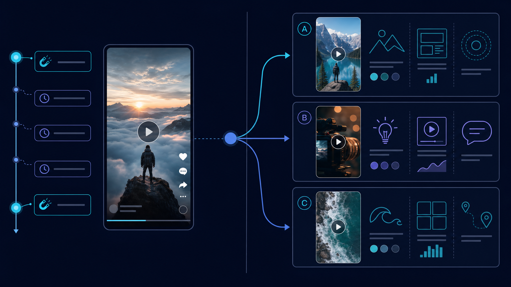
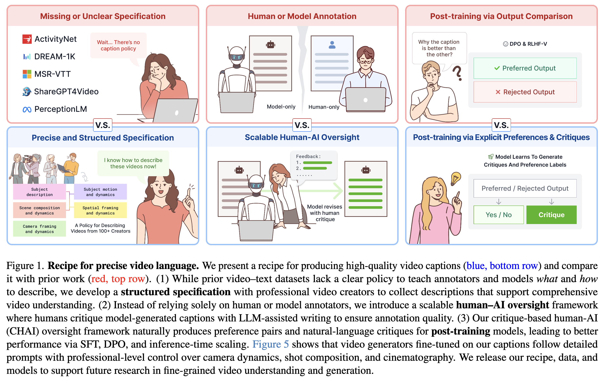
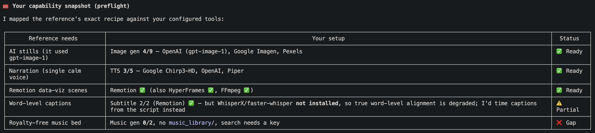
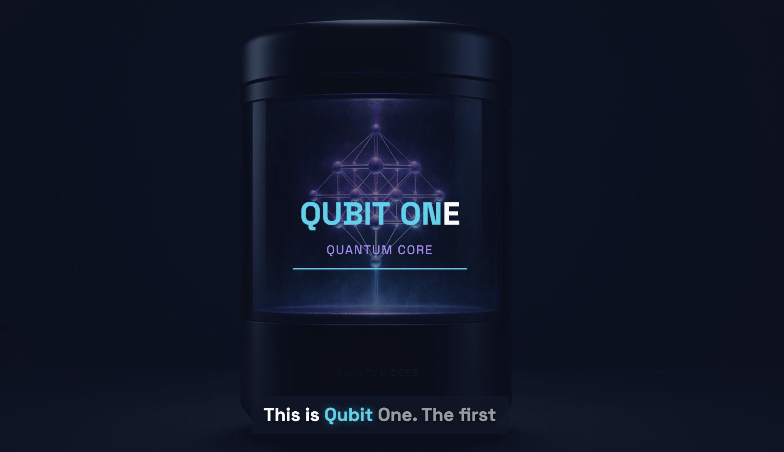

# 学习 OpenMontage 的参考视频玩法

前两天我们把 OpenMontage 装好、跑通了零成本的 demo，也分别走了图片视频和真实素材两条免费路线。这些玩法有个共同点：你得先想好选题，再去描述你要什么。

但很多时候，做视频最难的不是执行，而是我到底要做成什么样。你刷到一条特别带感的短视频，心里想我也想要这种感觉，可真要你把那种节奏、那种钩子、那种风格用文字描述清楚，反而写不出来。OpenMontage 提供了一个更省心的起点：直接把那条视频丢给它。

今天我们就来看这个从参考视频出发的玩法。

## 比从空白提示词更快

从一段参考视频出发，往往比从一个空白提示词出发更快。与其逼自己硬拼出一段完美的提示词，不如让 agent 去看一段真实存在的好视频，从里面提炼出可复用的东西。OpenMontage 支持多种参考来源：YouTube 视频、YouTube Shorts、Instagram Reels、TikTok 这些长短视频，甚至本地的一段片段都行。

> 这种把主题、风格、镜头、语气、各种限定一股脑堆在一起的提示词，社区里有个形象的叫法 **prompt spaghetti**（提示词面条）。它借自程序员熟悉的「spaghetti code（意大利面条式代码）」，指那种逻辑缠成一团、没有结构、读起来像一盘搅在一起的面条的烂代码。prompt spaghetti 就是提示词版的它：又长又乱、彼此缠绕，难写难调还未必管用。

你要做的只是粘贴一段视频，再加一句你想要什么：

```text
Here's a YouTube Short I love. Make me something like this, but about quantum computing.
# 我很喜欢这条 YouTube Short，照着它的感觉给我做一个，但主题换成量子计算
```

agent 拿到后不会给你一份原视频的拙劣复刻，而是会明确告诉你它**保留什么、改变什么**：保留参考视频的节奏、钩子形式、整体结构和基调，改掉主题、视觉处理、切入角度和叙述方式。除此之外，它还会在动手生成素材之前，先告诉你这条片子大概要花多少钱、以你手上现有的工具实际能做成什么样，而不是承诺一个做不到的效果。最后你拿回的是 2 到 3 个差异化的概念方案，外加一段样片，再决定要不要全量制作。

这套机制在 Claude Code、Cursor、Copilot、Windsurf、Codex 上都能用，任何能读文件、能跑代码的 AI 编程助手都行。换个需求、换个说法也一样：

```text
Analyze this Reel and give me 3 original variants I could make for my own product launch.
# 分析这条 Reel，给我 3 个能用在自己产品发布上的原创变体
```

```text
I like the pacing and hook in this video. Keep that energy, but turn it into a 45-second explainer about black holes.
# 我喜欢这条视频的节奏和钩子，保留这种感觉，但做成一个 45 秒、讲黑洞的解说视频
```

第一个偏向找灵感变体，第二个偏向抽取节奏后换主题，是两种很常见的需求。



## 实测：把 VOID 仿成量子计算版

OpenMontage 官方样片里有一条叫 VOID 的广告片，它是一款虚构脑机接口产品的发布预告，画面像苹果发布会一样克制、留白，一帧一个卖点，配一段沉稳的旁白，整条片子花了 0.69 美元。我挺喜欢这种有质感的风格，于是我在 Claude Code 里直接将视频链接丢给它，然后让它仿照着做一条量子计算主题的：

```text
https://github.com/user-attachments/assets/8a6d2cc3-7ad2-46f5-922f-a8e3e5848d9f
Here's a video I love. Make me something like this, but about quantum computing.
# 我很喜欢这条视频，照着它的感觉给我做一个，但主题换成量子计算
```

CC 一上来先读了 `AGENT_GUIDE.md`，认出这是「make me something like this」式的 **参考驱动（reference-driven）** 请求。这个入口不是什么隐藏功能，而是写进了 OpenMontage 给 agent 的工作契约里：`AGENT_GUIDE.md` 有专门的一节 Reference Video Entry Point，规定 agent 一旦收到参考视频，必须先读 `skills/meta/video-reference-analyst.md` 这个 meta skill（元技能，专门驱动 agent 的指令文件），照着它规定的一整套分析流程走完，再给差异化的概念，而不能直接复制。下面就是 CC 这一遍实际走过的几步。

### 第一步：拆解参考视频

CC 先把 VOID 下载下来分析。这一步要用到哪些工具，可以在 pipeline 清单里看到。以 `pipeline_defs/animated-explainer.yaml` 为例，它有一个 `reference_input` 块：

```yaml
reference_input:
  supported: true
  analysis_depth: standard
  analysis_tools:
    - video_analyzer
    - transcript_fetcher
    - video_downloader
    - scene_detect
    - frame_sampler
```

这里的 `video_analyzer` 是「总指挥」，列表里其余几个是它内部调用的组件：它依次用 `video_downloader` 下视频、`transcript_fetcher` 拉字幕、`scene_detect` 切场景、`frame_sampler` 抽关键帧，自己再补一遍音频能量分析，最后汇总成一份结构化的概要。值得注意的是，这一整套流程不含 AI，全是机械处理：下视频用 yt-dlp，取字幕走 youtube-transcript-api 或 faster-whisper，切场景靠 PySceneDetect / FFmpeg 比较帧间差异找镜头切换，抽关键帧用 FFmpeg 在场景边界和中点导出，产出的都是可量的结构信息。真正「看懂」画面内容的，是 agent 自己的视觉模型。所以除了跑这些工具，CC 还会自己逐张看关键帧、从烧录字幕里读出旁白。

> 上面那个 `analysis_depth` 字段控制分析的深浅，由浅到深分三档：`transcript_only`（只拉字幕）、`standard`（默认，含分镜、关键帧、节奏分析）、`deep`（更细，电影感这类 pipeline 才用）。参考分析走的是居中的 `standard`，最多抽 20 张关键帧。

这份最终汇总出的概要，并不是一堆原始数据：它已经把视频分好了场景、量好了节奏、抽好了关键帧，是整理过的结构信息。

这份概要在源码里对应的工件叫 `video_analysis_brief`（直译即「视频分析概要」），完整长这样：

```json
{
  "version": "1.0",
  "source": { "duration_seconds": 48.57, "title": "void_ref" },
  "structure_analysis": {
    "total_scenes": 3,
    "scenes": [
      { "scene_index": 0, "start_time": 0.0, "end_time": 27.57, "energy_level": "medium", "motion_type": "unknown" },
      "...另外 2 个场景，motion_type 同样是 unknown..."
    ],
    "pacing_profile": { "cuts_per_minute": 3.71, "pacing_style": "slow_contemplative" }
  },
  "keyframes": [
    { "timestamp": 0.1, "scene_index": 0, "path": ".../keyframes/frame_0000.jpg", "description": "" },
    "...另外 5 张，最后一张在 40.6s，description 字段同样是空的..."
  ],
  "replication_guidance": {
    "suggested_pipeline": "cinematic",
    "suggested_playbook": "flat-motion-graphics",
    "estimated_complexity": "simple",
    "motion_required": false
  }
}
```

对照上面的 JSON 一个字段一个字段地看：

- `source` 记了源视频的时长（48.57 秒）和标题；
- `structure_analysis` 是结构主体，`total_scenes` 说全片切成 3 个场景，`scenes` 列出每段的起止时间和 `energy_level`（能量档位，这里都是 `medium`），每段还挂一个 `motion_type`，这个字段最为重要，因为它直接决定后面走哪条工具路径。它标的是每个镜头到底是真实运动还是静图，取值为 `motion_clip`（真实运动镜头）、`animated_still`（静图加 Ken Burns，即在静止画面上做缓慢推拉摇移）或 `static_image`（纯静图）：判成 `motion_clip` 就得围绕视频生成工具来规划，判成 `animated_still` 则生图加 Remotion 合成就够了，如果判错就会用错 pipeline、走错工具路径；
- `pacing_profile` 记节奏，`cuts_per_minute` 是每分钟剪切次数，`pacing_style` 是归好类的节奏档位，这里的 `slow_contemplative` 是最慢的节奏，它按「平均一个镜头多少秒」由慢到快分四档：超过 10 秒是 `slow_contemplative`（最慢，留白多、画面舒缓），5 到 10 秒是 `steady_educational`（沉稳的讲解节奏），2 到 5 秒是 `dynamic_social`（社媒短视频那种偏快的节奏），2 秒以内是 `rapid_fire`（快切轰炸）；一个场景都切不出来、时长拿不到时则记为 `variable`。VOID 全片 48.57 秒只切出 3 个场景，平均一镜约 16 秒，于是落在最慢的 `slow_contemplative` 节奏；
- `keyframes` 是抽出来的 6 张关键帧，每张带时间戳、所属场景和文件路径，外加一个 `description`，但全是空的，脚本只管把帧抽出来，还不知道画面里是什么；
- 最后 `replication_guidance` 是几条复刻建议：推荐的 pipeline、playbook、复杂度，外加一个 `motion_required` 字段，它表示复刻这条片子需不需要真实运动（即动用视频生成或大量动画），超过三成镜头是 `motion_clip` 就记 `true`，否则回退看节奏，快节奏（`dynamic_social` / `rapid_fire`）才记 `true`。VOID 的 `motion_type` 全是 `unknown`、无从计数，于是只能看节奏，`slow_contemplative` 不算快，便记成了 `false`，意思是复刻它不需要真实运动，静图加 Ken Burns / Remotion 就够。

把这些字段连起来看，这份概要全停在结构层：能数、能量的它都给了，可画面里到底是什么（谁、在干什么、什么风格），它几乎没有，`motion_type` 留空成 `unknown`，关键帧的 `description` 也是空的。这些更细的语义判断，包括每个镜头是真运动还是静图，都得靠 CC 自己逐张看关键帧补上。

> 其实 OpenMontage 也有一套判断 `motion_type` 的规则：用 OpenCV 的稠密光流（Farneback 算法）在每个场景取 2~3 对相邻帧，算两个量，一是画面整体动了多少（光流幅度），二是动得均不均匀（幅度方差）。几乎不动判 `static_image`，动得均匀判 `animated_still`（整幅画面一起平移缩放，正是 Ken Burns），动得不均匀、各处独立运动判 `motion_clip`。如果这套光流没能跑起来，比如没装 OpenCV、视频打不开、或某个场景的帧取不出来，它就退回 `unknown`，把判断交给 agent。我这台机器恰好没装 OpenCV，三段于是全判成了 `unknown`，最后是 CC 逐张看关键帧补出来的。

正如上文所说，对视频的分析光有结构还不够，要真正看懂这段视频，CC 会在它之上再补一份按**五个维度（5-aspect）**组织的解读。这套结构来自 CMU 和哈佛的一篇论文 [《Building a Precise Video Language with Human–AI Oversight》](https://arxiv.org/abs/2604.21718)，是 CVPR 2026 的 Highlight 论文。论文发现：视觉语言模型描述「主体」和「场景」很准，却常在「运动、空间构图、镜头」上出错，所以把这五个维度都强制填满，是提升描述精度最关键的一步。

为此，论文提出了一套叫 **CHAI（Critique-based Human-AI Oversight，基于批改的人机协同监督）** 的方法：让专业影视创作者去批改、订正模型生成的视频描述，再拿这些高质量标注训练出一个能精确描述视频的模型。



在 OpenMontage 里，这套五维就是描述视频的一套**通用词汇**，读和写两头都用它：读（`skills/meta/video-reference-analyst.md`），是把一段视频拆成这五维（本节 CC 做的就是这件事）；写（`skills/creative/video-gen-prompting.md`），是给视频生成模型写提示词时也按这五维来组织，保证主体、运动、场景、构图、镜头都交代清楚：

| 维度 | 看什么 |
| ---- | ---- |
| **Subject（主体）** | 主体类型、数量、属性，以及跨镜头的出现/消失/切换 |
| **Subject Motion（主体运动）** | 按时间顺序的动作、交互，是位移还是手势还是表情 |
| **Scene（场景）** | 叠加层（文字/字幕条/水印单独列）、视角、环境、时间、动态 |
| **Spatial Framing（空间构图）** | 景别、主体位置、景深、机位高低及其变化 |
| **Camera（镜头）** | 播放速度、镜头畸变、机位高度、角度、对焦、稳定度、运动方式 |

CC 就是按这五个维度，把参考视频总结成一份「解读报告」。这份报告不只是给你看，更是一份交接件：后面的提案、脚本、分镜阶段会**直接按这五个维度去设计新视频**，而不用再从一段散文里重新理解。这也是 skill 为什么强制要按五维来写、不许退回成一段散文：散文每个阶段都得重新解析一遍、容易走样，结构化字段才能精确一致地往下传。

回到 VOID 这个视频，CC 的判断是：它根本不是 AI 视频生成，而是 4 张 AI 静图加 Remotion 数据可视化场景、再配逐词字幕拼出来的，镜头的 `motion_type` 基本都是 `animated_still` / `static_image`。这意味着仿它**不需要视频生成工具**，省掉了最贵的一块，这也正是原片只要 0.69 美元的原因。

### 第二步：盘点能力

看懂参考视频之后，CC 跑了一遍启动前的能力自检（又被称为 **preflight**），把 VOID 的配方和我机器上的工具一一对照：



上图里，原片需要的 AI 静图（gpt-image-1）、单人旁白、Remotion 数据可视化场景，我这边都齐了：图片生成有 4 个 provider 可用、TTS 有 3 个（含本地的 Piper）、Remotion 也装好了；唯独免版税背景音乐是缺的，音乐生成一个 provider 都没配、本地也没有曲库，它如实标出了个缺口。

这一步的关键是不糊弄。如果参考视频需要的是生成的科幻镜头，而你一个视频生成的 key 都没配，它会直接说这条路卡住了，并给你两个选项（配一个 provider key，或者退用 stock 素材加 Remotion 动画，质感不同但能跑），而不会假装能做到、最后给你货不对板的东西。

盘出缺口之后，CC 没有自己拍板。它说在正式构思概念方案之前，有三个决定会影响后面的一切，于是回过头一条一条问我。参考视频能告诉它「原片长什么样」，但这几件事它读不出来，只能问我：

1. **片子做成哪种形式？** 题材已经定了是量子计算，这里问的是用哪种形式去表现它。它没有默认照搬原片，而是给了三个方向：虚构的量子产品广告（主角是「QUBIT ONE — 量子核心」）、量子知识讲解（keynote 风格，打「一万年 → 200 秒」这种对比）、或者纯炒作的预告剪辑（落在「Quantum, for everyone. 2027.」）。我选了第一个，虚构量子产品广告，最贴近 VOID 原片。

2. **多长、怎么配音？** 三个选项：约 45 秒、单人旁白（最忠实原片），约 30 秒、单人旁白，或者纯画面加音乐、不要旁白。我选了约 45 秒、单人旁白。skill 在这里特别强调，旁白这套「音频架构」必须在出方案之前就定死，不能拖到写脚本或合成阶段，因为它直接决定脚本怎么写、要几路配音、花多少钱。

3. **音乐这个缺口怎么办？** 这是唯一的能力缺口，它没含糊带过，而是摆出了三条路：往 `music_library/` 里丢一首本地曲子、配一个音乐生成的 API key，或者先不要背景音乐、之后再补。我选了最后一个，先放一边，等成片出来再说。

三条答完，方向就定死了：一个虚构的量子产品广告、约 45 秒、单人旁白、暂不配乐。

### 第三步：调研，给出方案

关键决定敲定后，CC 还是没急着动手，而是又做了两件事，才把方案定下来。

**先做一轮强制的联网调研。** 这一步在 skill 里写明是必做的，哪怕参考视频和需求都很清楚，也不许跳过、不许只凭参考分析加自己的知识就开干。范围限定在 2~3 分钟的轻量搜索：看几条同类视频找差异化角度、查制作技法，主题有事实内容的话再搜几个具体数据点把内容做扎实。CC 这次搜的是量子计算的真材料：Google Willow 的基准成绩（同一道计算，Willow 量子芯片 5 分钟就跑完，换成经典超级计算机却要算 10²⁵ 年）、超导量子比特约 15 毫开尔文的工作温度、99.9% 的门保真度。有了这些真实数据，虚构产品的参数才显得可信，而不是瞎编。

**再给 2~3 个差异化方案。** skill 在这里还有条硬规矩：**绝不能给原片的复刻**，参考只是灵感不是模板，每个方案都得有明确的创意差异。每个方案还必须带齐：保留什么、改什么、视觉与音频计划、时长，以及一张按 provider 分项列出的成本表（图片、视频、TTS、音乐各花多少、用哪家），并诚实说明这笔预算买得到什么、买不到什么。最后还得推荐其中一个，别让用户在几个等价选项里犯选择困难。CC 给我的三个概念是：QUBIT ONE（桌面量子核，最贴参考）、ABSOLUTE ZERO（量子即服务，偏 B 端）、SUPERPOSITION（氛围向，重情绪轻参数），整套成本估在 0.5~0.7 美元，推荐 QUBIT ONE。我选了它。

> 这里的 QUBIT ONE 并不是真实存在的产品，而是 CC 为这支视频现编的一个虚构概念，就像广告里那种「概念机」：一台能摆上桌的个人量子计算机，把一整个数据中心缩到桌面，主打「让量子计算走进每个人」。它的卖点也照着 VOID 的「参数轰炸」来铺。要紧的是，产品是假的，参数背后的物理却是真的：上一步搜来的那些真实数据（Google Willow 的基准、超导量子比特的工作温度、99.9% 这个关键阈值）正垫在这些卖点底下，让一个虚构产品听起来也跟真的一样。

### 第四步：先出样片，再渲全片

方案敲定后，CC 没有一上来就渲整片，而是先做了一段约 12 秒的样片（主角镜头加一个参数场景）让我确认风格和声音，这一步只花了约 0.17 美元。确认没问题，它才把整套分析成果当作输入，转入正常的制作流程，把完整的片子渲出来。

最后产出一条 42 秒、1920×1080 的成片，6 个场景：主角镜头、1024 量子比特 @ −273°C、99.9% 保真度、一万年 vs 200 秒、收束语、「Quantum, for everyone. 2027.」。3 张 gpt-image-1 静图加 OpenAI Onyx 旁白、Remotion 合成，全程本地渲染，总成本约 0.6~0.7 美元，和原版 VOID 一个量级。



从一句话到一条成片，CC 全程自己走完上面这套流程，只在几个创作决策点停下来等我拍板。另外值得一提的是，参考视频玩法并不是一条专门为它新建的流水线，它走的还是平时那条制作流程（研究、脚本、分镜、合成），和上一篇用到的流程没有区别。只是这些流程本就留了一个可选的「参考输入」插槽，也就是第一步那个 `reference_input` 块：你给了参考视频，分析结果就从这里接进去，给后面的研究、脚本、分镜当一份有依据的起点；你不给，同一条流程照样跑，只是没有这份参考垫底。

## 小结

今天我们学习了 OpenMontage 一个很实用的技巧：从参考视频出发生成你想要的视频。你只要丢一段喜欢的 YouTube / Short / Reel / TikTok 或本地视频，再加一句想要什么，这比从一个空白提示词把需求描述清楚更省力。收到参考后，CC 在 `video-reference-analyst` 这个 meta skill 的驱动下自己走完四步，只在几个创作决策点停下来等你拍板：

1. **拆解参考视频**：`video_analyzer` 工具先机械地抽出场景、节奏、关键帧这些结构信息；至于每个镜头是真运动还是静图，画面里到底是什么，还得靠 CC 自己看关键帧补上；
2. **盘点能力**：跑一遍启动前的能力自检，把参考视频的配方和你机器上的工具一一对照，如实标出缺口，再把关键决定（做成什么形式、多长、怎么配音、缺口怎么处理）回过头问你，而不是自己拍板；
3. **调研并给出方案**：先做一轮强制的联网调研把内容做扎实，再给 2~3 个有创意差异的方案（绝不照搬原片），每个都带一张按 provider 分项的成本表，并推荐其中一个；
4. **先出样片，再渲全片**：先花几毛钱出一段样片让你确认风格和声音，确认后才开始完整的制作流程渲出全片。

通过这四步，我们将官方的 VOID 视频仿成了一个名为「QUBIT ONE」的量子产品的宣传片，这个产品是虚构的，但是物理参数却是真实的，因此看上去有模有样，整体约 0.7 美元，和原片一个量级。

到这里，我们对 OpenMontage 怎么生成视频已经有了一定的认识：从第一篇的官方 demo 视频，到第二篇的图片视频和真实素材两条零成本路线，再到今天这一篇从参考视频生成视频。但不管哪种玩法，背后真正干活的都是一个个 provider：生成图片的、配旁白的、出音乐的。你能做出什么样的视频、做到多好，恰恰由这层 provider 决定，手里的 key 越多，能用的工具越多，能挑的 provider 也越多。明天我们就来看怎么接入 provider，以及 OpenMontage 是怎么在一堆 provider 里挑出最合适那个的。

## 参考

* [OpenMontage 项目首页：Start From A Video You Already Love 一节](https://github.com/calesthio/OpenMontage/blob/main/README.md)
* [OpenMontage Agent Guide（AGENT_GUIDE.md）](https://github.com/calesthio/OpenMontage/blob/main/AGENT_GUIDE.md)
* [OpenMontage GitHub 仓库](https://github.com/calesthio/OpenMontage)
* [Google Willow 量子芯片官方介绍](https://blog.google/innovation-and-ai/technology/research/google-willow-quantum-chip/)
* [论文：Building a Precise Video Language with Human–AI Oversight](https://arxiv.org/abs/2604.21718)
