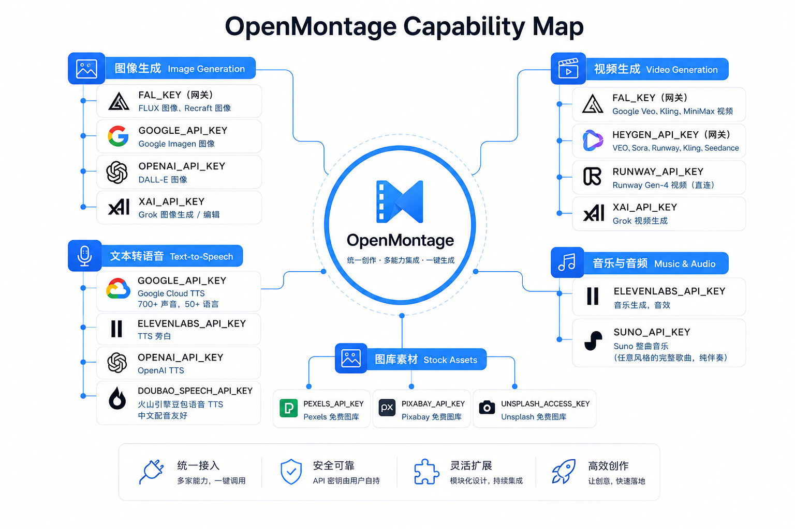

# 学习 OpenMontage 的工具发现与打分选择器

在前面的几篇文章里，我们已经体验了 OpenMontage 的零成本玩法：用 Piper 配音、用免费素材剪纪录片、用 Remotion 把图片做成动画，全程不花一分钱 API 费用。我们也试过贴一个参考视频，让 agent 帮我们拆解出差异化的制作方案。

不过零成本路径终究有上限。想要 FLUX 的图、Veo 或 Kling 的真实运动镜头、ElevenLabs 的高质量配音，就得接入对应的 provider。OpenMontage 支持的 provider 有几十个，同一个能力往往有好几个、多的有十几个候选。今天我们就来看两件事：怎么加 key 解锁更多工具，以及 OpenMontage 是怎么在一堆 provider 里自动挑出最合适的那一个。

## 解锁更多工具

OpenMontage 的所有 API key 都写在项目根目录的 `.env` 文件里。`make setup` 会从 `.env.example` 生成一份空的 `.env`，你按需填就行。**每个 key 都是可选的，加得越多，能用的工具越多。**

> 这里有个坑。`make setup` 拷出来的 `.env`，每个 key 后面都跟着一段行内注释，形如 `FAL_KEY=        # FLUX images...`。而 OpenMontage 自带的解析器（`_load_dotenv`）很朴素：它把等号后面的内容整段取出，只去掉首尾空格和引号，并不会剥掉 `#` 注释，于是注释会被当成 key 的值，密钥直接失效。填的时候，把这一行的行内注释删掉、只留 `KEY=你的值`，最稳妥。

打开 `.env.example`，可以看到 key 是按能力分组的。下面是主要的几个：

| 环境变量 | 解锁的能力 |
| ---- | ---- |
| `FAL_KEY` | FLUX 图像、Google Veo 视频、Kling 视频、MiniMax 视频、Recraft 图像（一个网关覆盖多家） |
| `GOOGLE_API_KEY` | Google Imagen 图像、Google Cloud TTS（700+ 声音、50+ 语言） |
| `ELEVENLABS_API_KEY` | TTS 旁白、音乐生成、音效 |
| `OPENAI_API_KEY` | OpenAI TTS、DALL-E 图像 |
| `XAI_API_KEY` | Grok 图像生成/编辑、Grok 视频生成 |
| `DOUBAO_SPEECH_API_KEY` | 火山引擎豆包语音 TTS（中文配音友好） |
| `SUNO_API_KEY` | Suno 整曲音乐（任意风格的完整歌曲、纯伴奏） |
| `HEYGEN_API_KEY` | HeyGen 网关（一个 key 调 VEO、Sora、Runway、Kling、Seedance） |
| `RUNWAY_API_KEY` | Runway Gen-4 视频（直连 API） |
| `PEXELS_API_KEY` / `PIXABAY_API_KEY` / `UNSPLASH_ACCESS_KEY` | 免费图库素材（开发者 key 免费申请） |

> Piper 本地语音不需要任何环境变量，`pip install piper-tts` 装上就能用。

把这些 provider 和它们解锁的能力放在一起看，OpenMontage 的能力版图大致是这样一张图：



## 先做一次预检

加完 key，怎么知道到底解锁了哪些工具？这就要做一次 **Preflight（预检）**，让 OpenMontage 汇总一下当前机器有哪些能力可用。上一篇里 CC 在「盘点能力」时跑的就是它；`AGENT_GUIDE.md` 把预检列为开工前的必做项，agent 每次动手前都会先跑一遍。

最简单的方式是运行下面的命令：

```
$ make preflight
```

它底层就是一行 Python 代码，先调用 `registry.discover()` 扫描 `tools/` 包，把所有工具类发现并登记进来，再调用注册表的 `provider_menu()` 把结果打印出来：

```bash
python -c "
from tools.tool_registry import registry; 
import json; 
registry.discover(); 
print(json.dumps(registry.provider_menu(), indent=2))
"
```

输出结果是一个 JSON，它的顶层结构如下：

```json
{
  "analysis":            { … },
  "audio_processing":    { … },
  "avatar":              { … },
  "character_animation": { … },
  "clip_acquisition":    { … },
  "clip_retrieval":      { … },
  "corpus_population":   { … },
  "enhancement":         { … },
  "graphics":            { … },
  "image_generation":    { … },
  "music_generation":    { … },
  "music_search":        { … },
  "screen_capture":      { … },
  "source_ingest":       { … },
  "subtitle":            { … },
  "tts":                 { … },
  "video_generation":    { … },
  "video_post":          { … }
}
```

光看这些顶层 key 就能看出，预检覆盖的是 OpenMontage 的整条产线，一共 18 个能力家族。大致可归成四类：

- **生成**：直接产出素材，包括图像 `image_generation`、视频 `video_generation`、配音 `tts`、音乐 `music_generation`，外加角色动画 `character_animation` 和数字人 `avatar`。视频这族最庞杂，从云端的 Veo、Kling、Runway 到能在本地跑的 Wan、Hunyuan 都在里面。
- **素材获取**：不生成，而是去现成素材库里找，有两条路。一条是**即搜即用**：`clip_acquisition` 直接去十几个免费源（Pexels、Archive.org、NASA、维基共享等）在线搜，搜到后直接下载使用；另一条是**先建库再检索**，为大批量、反复挑片准备：`corpus_population` 先把一批候选素材抓下来、用 CLIP 向量建成离线索引库，`clip_retrieval` 再在这个库里按语义相似度挑片去重，省掉每次编辑都重新调 API。此外还有一个 `source_ingest` 用于下载单个在线视频。
- **分析理解**：只有 `analysis` 一族，共 11 个工具，负责拆参考视频、切场景、抽关键帧、算音频能量，上一篇 agent「盘点参考视频」跑的就是它。
- **后期与合成**：把素材拼成成片。核心 `video_post` 里，FFmpeg、Remotion、HyperFrames 三个渲染引擎都在；此外还有音频处理 `audio_processing`、画质增强 `enhancement`、字幕 `subtitle`、图形 `graphics`、录屏 `screen_capture` 等丰富的能力。

每个家族内部的结构都一样：一个 `available` 列表、一个 `unavailable` 列表，外加 `total` / `configured` 计数；不可用的工具还各带一句 `install_instructions`，告诉你怎么安装。以配音 `tts` 为例：

```json
"tts": {
  "available": [
    { "name": "google_tts", "runtime": "api",   "status": "available" },
    { "name": "openai_tts",  "runtime": "api",   "status": "available" },
    { "name": "piper_tts",   "runtime": "local", "status": "available" }
  ],
  "unavailable": [
    { "name": "doubao_tts",     "install_instructions": "Set DOUBAO_SPEECH_API_KEY ..." },
    { "name": "elevenlabs_tts", "install_instructions": "Set ELEVENLABS_API_KEY ..." }
  ],
  "total": 5,
  "configured": 3
}
```

通过这套结构，一眼就能看出哪些能力还空白，加哪个 key 收益最大。上一篇 CC 动手做参考视频前先跑了这遍预检，发现音乐是唯一的能力缺口，于是没有硬着头皮往下做，而是回头问我怎么处理，是配个音乐生成的 key，还是先不要背景音乐。

## 选择器模式

知道了有哪些工具，下一个问题是怎么挑。回头看 preflight 列出的能力家族，每个家族下往往挂着好几个工具，但它们分两种情况。一种是**各司其职**，比如 `analysis` 家族里 `scene_detect` 切场景、`frame_sampler` 抽帧、`transcriber` 转写，各干各的活，agent 要做哪件事直接调对应的那个工具就行，没有选择的问题。另一种是**可以互相替代**，比如 `tts` 家族里 ElevenLabs、Google、OpenAI、Piper 都能出旁白，`video_generation` 家族里十几个工具都能产出视频片段，这时才需要从一堆候选里挑一个最合适的。这一节讲的就是后一种情形。

在讲怎么选之前，先看每个「工具」长什么样。OpenMontage 里每个工具都继承自 `tools/base_tool.py` 的 `BaseTool`，声明了一组契约字段，我做了下精简：

```python
class BaseTool(ABC):
    capability: str = "generic"      # 属于哪个能力家族（tts、image_generation…）
    provider: str = "openmontage"    # 对接哪家 provider
    best_for: list[str] = []         # 擅长什么
    not_good_for: list[str] = []     # 不擅长什么
    supports: dict = {}              # 支持哪些特性（reference_image、native_audio…）
    provider_matrix: dict = {}       # 网关型工具挂的多个模型
    fallback: str | None = None      # 不可用时退到谁
```

一个工具就是对某个 provider 某项能力的封装：`provider` 字段标明它对接哪家（`flux`、`openai`、`google_tts`……），`capability` 字段标明它属于哪个能力家族，也就是 preflight 那份 JSON 里 `tts`、`image_generation` 那些顶层分组名。多数工具是「一个工具对应一个 provider」，也有网关型工具用 `provider_matrix` 同时挂上好几个模型，比如 `heygen_video` 背后就是 VEO、Sora、Kling 一串。

当同一个能力下挂着好几个**可以互相替代**的工具时，OpenMontage 会给它配一个**选择器（Selector）**做统一入口：靠 `registry.get_by_capability(...)` 从注册表把这个能力下的工具全捞出来，凑成一份候选名单；至于从名单里挑哪个，留到下一节细说。目前一共 4 个选择器：

| 选择器 | 对应 `capability` | 路由到的工具 |
| ---- | ---- | ---- |
| `tts_selector` | `tts` | ElevenLabs、Google TTS、OpenAI、Piper、豆包 |
| `image_selector` | `image_generation` | FLUX、Imagen、DALL-E、Recraft、本地 Stable Diffusion、免费图库 |
| `video_selector` | `video_generation` | Veo、Kling、WAN、Hunyuan、LTX 等十几个 |
| `screen_capture_selector` | `screen_capture` | Cap、FFmpeg 录屏 |

四个选择器对应配音、图像、视频、录屏这四类能力，其余家族的工具各司其职，用不上选择器。

## 七维度打分

选择器知道了候选名单，那怎么排序？早期的朴素做法是取第一个可用的 provider，但这显然不够好：免费的图库素材和 FLUX 生成图都处于可用状态，可它们适合的场景天差地别。

OpenMontage 的做法是给每个候选 provider 打分，而且是**七个维度的加权打分**。实现位于 `lib/scoring.py`，核心是一个 `ProviderScore` 数据类：

```python
@dataclass
class ProviderScore:
    tool_name: str
    provider: str
    task_fit: float = 0.0        # 与这个资产类别的契合度
    output_quality: float = 0.0  # 预期成品保真度
    control: float = 0.0         # 参考图/风格的可控性
    reliability: float = 0.0     # 运行时可靠性
    cost_efficiency: float = 0.0 # 每美元能买到的质量
    latency: float = 0.0         # 出活速度
    continuity: float = 0.0      # 与已锁定决策的一致性

    @property
    def weighted_score(self) -> float:
        return (
            self.task_fit * 0.30
            + self.output_quality * 0.20
            + self.control * 0.15
            + self.reliability * 0.15
            + self.cost_efficiency * 0.10
            + self.latency * 0.05
            + self.continuity * 0.05
        )
```

七个维度都归一化到 0 到 1，加权汇总成一个总分。权重分配把意图契合和成品质量放在最前面：

| 维度 | 权重 | 含义 |
| ---- | ---- | ---- |
| task_fit | 0.30 | 与任务意图、资产类型的契合度 |
| output_quality | 0.20 | 预期成品保真度 |
| control | 0.15 | 参考图、风格迁移等可控性 |
| reliability | 0.15 | 运行时可靠性（生产级工具基线更高） |
| cost_efficiency | 0.10 | 性价比，免费记 1.0，超预算记 0.0 |
| latency | 0.05 | 出活速度，本地工具更占优 |
| continuity | 0.05 | 与前面已锁定的 provider 是否一致 |

在逐维展开之前，我们需要知道一件事：每个选择器本身就是一个工具，它的入参大致如下：

```python
{
    "prompt": "给量子产品做条电影感预告",       # 必填：这次要生成什么
    "operation": "text_to_video",              # 生成方式：文生 / 图生 / 参考视频 / 只排名
    "task_context": {                          # 喂给打分器的上下文
        "intent": "给一款量子产品做电影感发布预告",
        "style_keywords": ["cinematic", "minimalist"],
        "asset_type": "video",
        "budget_remaining_usd": 0.5,
        "motion_required": True,
        "locked_providers": {"openai"},
    },
    # 还有 aspect_ratio、duration、reference_image_* 等透传给 provider 的参数
}
```

其中 `task_context` 就是打分器真正要用的那份上下文，而这份结构化的上下文，正是 agent（也就是 CC）生成的，它在调用工具时将用户的「照着 VOID 做条量子计算的电影感预告」这句话读懂，并填充这些结构化字段，选择器拿到后就可以根据这些信息做确定性的加权算分。从这里也可以看出 OpenMontage 的分工设计：语言理解交给 agent，确定性的规则留给 Python。

有了这份 `task_context`，七个维度各自怎么打出 0 到 1 的分就有了依据：

- **task_fit**：这里有两组输入，一句话的**意图**（这次要做成什么，比如「量子产品的电影感预告」）和一组单独的**风格**关键词（比如「极简」「暗调」）。二者各自拆成词，分别和工具 `best_for` 里的词算重合度，得到「意图分」和「风格分」，最后按 `意图分 × 0.7 + 风格分 × 0.3 + 0.1` 合成，意图占大头。匹配是纯关键词的，不用向量或语义模型，只额外挂了一张手写同义词表（「cinematic / film / movie / trailer」算一组、「stock / footage / b-roll」算一组……）让近义词也能对上；重合度用「交集 ÷ 较小的一方」，免得 `best_for` 写得越丰富的工具反而被压分。这个维度权重最高，是这工具擅不擅长这个任务的主要判断依据。
- **output_quality**：优先用工具实测的质量分；没有就按**稳定性等级**兜底。稳定性等级是每个工具在代码里自报的 `stability` 字段，分 `production`（生产）、`beta`（测试）、`experimental`（实验）三档，不声明就默认最保守的 `experimental`；据此给分：生产级 0.9、测试级 0.7、实验级 0.4，生成类的生产级工具再加 0.05。
- **control**：看工具 `supports` 里支持哪些可控特性，按每个特性能给多大创作控制力来加权求和：controlnet（2.0）、参考图（1.8）、风格迁移和局部重绘（1.5）、img2img（1.3）这类能实打实左右生成结果，权重高；seed（0.5）、宽高比这类只能微调，权重低。把命中的权重加起来归一化到 0 到 1，支持得越多越强，分越高。
- **reliability**：有历史成功率就直接用；没有就看状态，可用且生产级 0.95、可用但非生产级 0.8、降级 0.4、不可用 0.0。
- **cost_efficiency**：免费直接 1.0；有预算时按「预估成本占剩余预算的比例」给分，占用超过一半压到 0.1、超过两成给 0.5、否则 0.8；预算未知时按绝对成本递减估（几分钱 0.9，逐档降到 1 美元以上的 0.3）。
- **latency**：有实测中位耗时就按档给分（1 秒内 1.0、10 秒内 0.8、30 秒内 0.6、60 秒内 0.4，更慢 0.2）；没有就按运行方式估，本地 / 本地 GPU 0.9、混合 0.6、云端 API 0.4。
- **continuity**：这个 provider 前面已经锁定过就给 0.9（风格更连贯），没有历史给 0.5，换成别家给 0.4（可能风格断裂）。

在这些基础分之上，还有几条针对具体场景的加减：任务要运动镜头、可候选却只会出静图，它的 `task_fit` 直接乘 0.2 重罚；意图里带 cinematic、trailer 这类词，支持原生音轨、多镜头、运镜控制等特性的高端工具按命中数加分；本来想要生成的画面、却给了个图库工具，`task_fit` 和 `output_quality` 一起打折。也就是说，打分器懂得把电影感的活交给擅长电影感的工具。

排好序之后，agent 看到的是一份带分数的候选清单，类似：

```
1. flux_image (fal.ai) — score: 0.86 [fit=0.9 quality=0.9 control=0.7 ...]
2. recraft_image (recraft) — score: 0.78 [fit=0.8 quality=0.8 control=0.6 ...]
3. pexels_image (pexels) — score: 0.55 [fit=0.6 quality=0.6 control=0.3 ...]
```

agent 看完打分和各维度拆解后再做选择，并把这次选择连同考虑过哪些备选、为什么选它一并写进可审计的决策日志（`decision_log`）。这带来两个好处：每一次 provider 选择都是可解释的，不再是因为它恰好可用而被选中；同时你完全可以自由换 provider，OpenMontage 不和任何一家厂商绑定。

> 最后补充一点，上面这套选择器加七维打分，管的是同一能力下的多个**工具**之间怎么选，而一个工具**内部**在多个源之间怎么挑，是另一回事。比如素材获取 `clip_acquisition` 家族其实只有 `direct_clip_search` 一个工具，它内部支持 Pexels、Archive.org、NASA 等十几个免费源，在这些源之间，它用的是一套简单得多的办法：每个源带一个 `priority` 优先级，默认按优先级从高到低挨个查，凑够需要的片段数（`clips_per_query`）就停，你也可以让 agent 指定只用某几个源。

## 解锁本地免费工具

前面解锁的 provider 大多是付费云端 API。但如果你的机器有一块像样的 GPU，还能解锁一批**本地、离线、零 API 费用**的工具。`make install-gpu` 会把 PyTorch、diffusers 这套本地推理依赖装上；视频生成还要在 `.env` 里显式打开、选一个模型：

```bash
make install-gpu

# 视频生成需要在 .env 里再加：
VIDEO_GEN_LOCAL_ENABLED=true
VIDEO_GEN_LOCAL_MODEL=wan2.1-1.3b   # 或 wan2.1-14b、hunyuan-1.5、ltx2-local、cogvideo-5b
```

配好之后，preflight 里就能看到一堆标着 `local_gpu` 的工具了。

除此之外，能本地做的远不止视频一种，下面做一个汇总，感兴趣且有条件的朋友可以试试：

- **生成**：图像 `local_diffusion`（本地 Stable Diffusion）；视频 `wan_video`、`hunyuan_video`、`ltx_video_local`、`cogvideo_video`（Wan、Hunyuan、LTX、CogVideo 四家本地模型）。
- **修复与增强**：`upscale`（Real-ESRGAN 超分放大）、`face_restore`（CodeFormer 修脸）、`bg_remove`（rembg 抠图去背景）。
- **数字人**：`talking_head`（SadTalker，让一张静态头像开口说话）、`lip_sync`（Wav2Lip，把口型对上一段音频）。
- **理解与转写**：`video_understand`（CLIP / BLIP-2 看懂画面内容）、`transcriber`（faster-whisper 本地语音转写，有 GPU 会快很多）。

其中有几个还要按各自的 `install_instructions` 再补装一两个包（比如超分的 Real-ESRGAN、数字人的 SadTalker / Wav2Lip）。这些本地工具落到选择器加打分里也占便宜：`latency` 和 `cost_efficiency` 两项通常评分很高，等于免费、离线、还不用排队。对于愿意用显卡换钱包的人，这是一整条本地免费的产线。

## 小结

今天我们学习了 OpenMontage 的工具发现和选择机制，最后来总结一下：

* 首先，我们了解了 **Provider 的解锁方式**。OpenMontage 把所有第三方能力都做成了可插拔的 Provider，`.env` 里的每一个 API Key 都只是解锁对应的一组工具，而不是绑定某一家平台。需要什么能力，就添加什么 Key；没有 Key，也仍然可以依靠 Piper、本地模型和免费素材完成不少工作。
* 随后，我们学习了 **Preflight（预检）**。它会自动扫描整个 `tools/` 目录，发现所有工具，并根据当前环境生成一份能力清单，让 agent 在真正开始工作之前先知道「现在有哪些工具可以用、哪些还没配置」。对于 AI Agent 来说，这一步相当于开工前的设备检查，也让能力缺口一目了然。
* 接着，我们重点分析了 **Selector（选择器）模式**。当一个能力对应多个可以互相替代的 Provider 时，Agent 并不会写死调用哪一家，而是统一交给对应的选择器处理，把所有候选工具集中起来进行比较。这种设计把「做什么」和「用谁做」彻底分离，使整个系统具备了很好的扩展性。
* 最后，也是 OpenMontage 比较有特色的一部分，就是 **七维度打分机制**。系统不会因为某个 Provider 恰好可用就直接采用，而是综合任务契合度、生成质量、可控性、可靠性、成本、速度以及风格连续性等七个维度进行加权评分，再把排序结果交给 Agent 决策，并记录完整的决策日志。整个选择过程既自动化，又具备可解释性。

工具和 provider 备齐了，接下来就该看 OpenMontage 是怎么把这些能力组织成一条条完整制作流水线的。它内置了 12 条 pipeline，从动画到电影感再到纪录片各有打法。我们明天就来逐一学习它们。

## 参考

* [OpenMontage GitHub 仓库](https://github.com/calesthio/OpenMontage)
* [OpenMontage Agent Guide（agent 操作契约）](https://github.com/calesthio/OpenMontage/blob/main/AGENT_GUIDE.md)
* [OpenMontage Providers 文档（provider 参考）](https://github.com/calesthio/OpenMontage/blob/main/docs/PROVIDERS.md)
* [fal.ai（FLUX 与多家视频模型网关）](https://fal.ai/)
* [Google AI Studio API Key 申请](https://aistudio.google.com/apikey)
* [ElevenLabs（TTS 与音乐）](https://elevenlabs.io/)
* [Suno（AI 音乐生成）](https://suno.com/)
* [HeyGen（视频网关）](https://www.heygen.com/)
* [Runway（Gen-4 视频）](https://runwayml.com/)
* [Pexels（免费图库素材）](https://www.pexels.com/)
