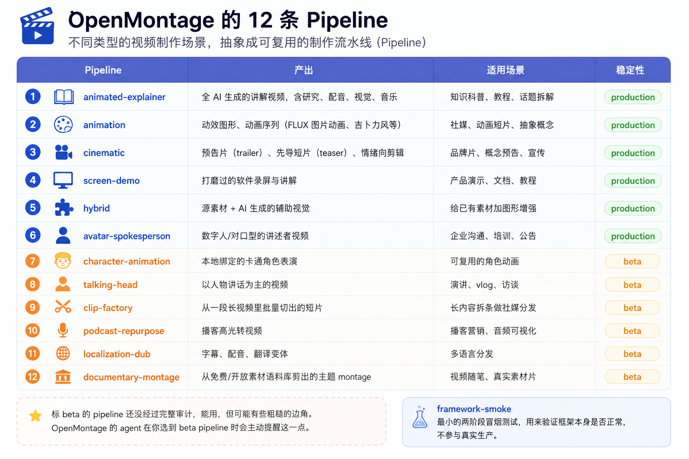
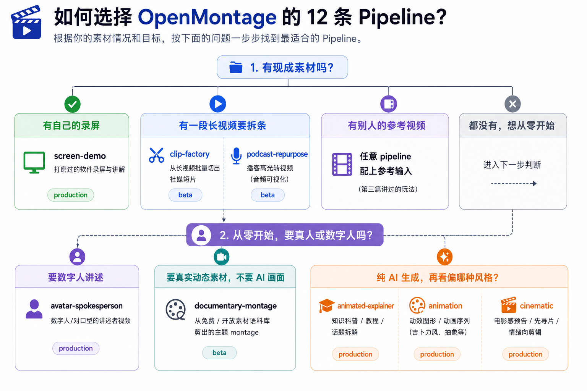
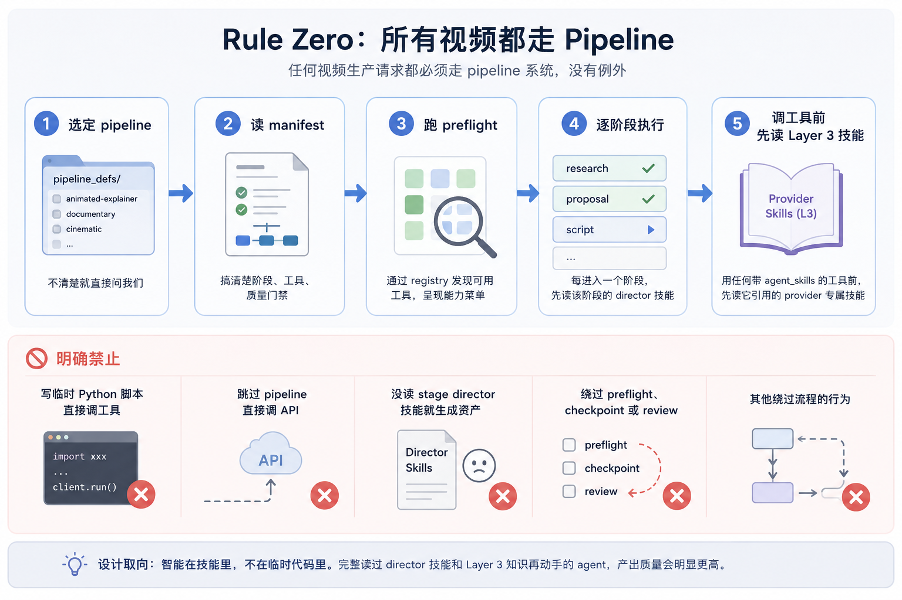
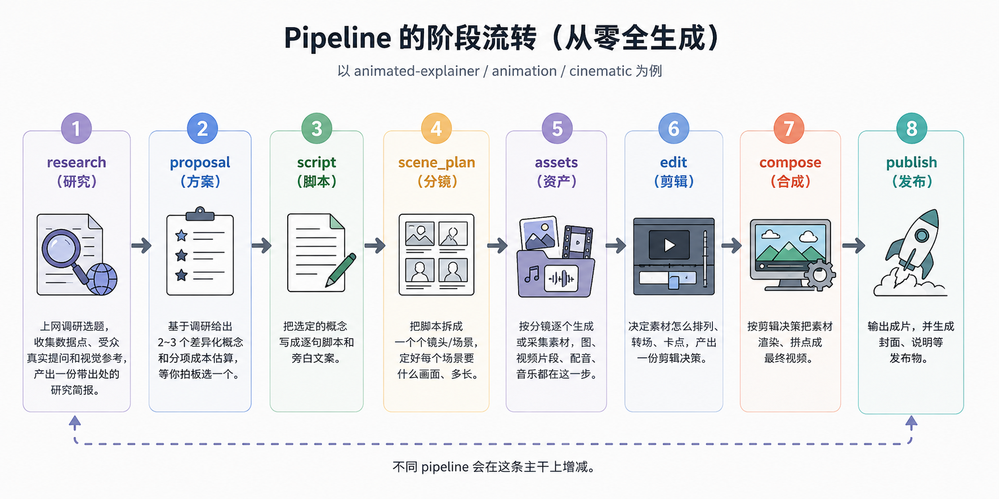
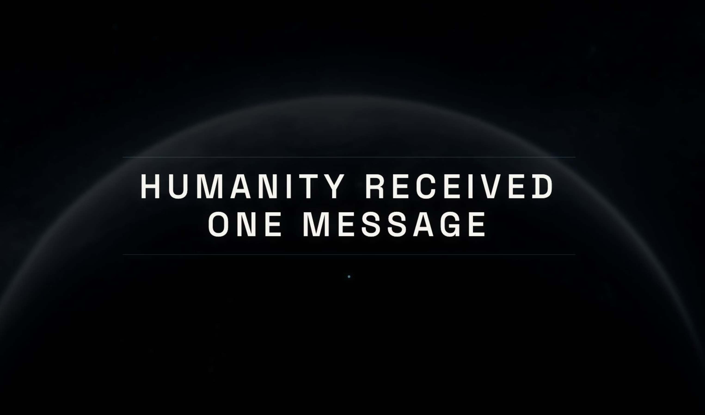

# 学习 OpenMontage 的 12 条流水线

在前面几篇文章中，我们已经把 OpenMontage 跑了起来：装好环境、用 `make demo` 渲染了第一个零成本视频，体验了零 API key 的图片动画和真实素材纪录片，还学会了从一个参考视频出发让 agent 生成差异化方案，以及怎么接入各家 provider、让打分选择器替我们挑工具。

这些能力散落在不同场景里，今天我们把它们串起来，从一个更高的视角看 OpenMontage 是怎么组织一次完整生产的。答案是 **pipeline（生产流水线）**。OpenMontage 自带 12 条 pipeline，每一条都是一套从想法到成片的完整工作流。我们今天就来看看它们分别做什么、agent 怎么选、以及我们怎么用。

## Pipeline 概览

OpenMontage 把不同类型的视频制作抽象成了不同的 pipeline，全部以 YAML 清单（manifest）的形式放在 `pipeline_defs/` 目录下。每条 pipeline 对应一个真实的制作场景，这些我们在入门篇里曾提到过，这里再展开来看下：



> 标 **beta** 的 pipeline 还没经过完整审计，能用，但可能有些粗糙的边角。OpenMontage 的 agent 在你选到 beta pipeline 时会主动提醒这一点。

除此之外还有一条 `framework-smoke`，那是一个最小的两阶段冒烟测试，用来验证框架本身是否正常，不参与真实生产。

这 12 条 pipeline 覆盖了相当宽的需求面：想做知识科普选 `animated-explainer`，想做吉卜力风动画选 `animation`，想剪一段电影感预告选 `cinematic`，想把一期两小时的播客拆成十几条社媒短片选 `clip-factory`，想把视频翻译配音成其他国家语言选 `localization-dub`。

实际选择时，可以按几个问题往下分：



- **有现成素材吗？**
  - 有自己的录屏 → `screen-demo`
  - 有一段长视频要拆条 → `clip-factory` / `podcast-repurpose`
  - 有别人的参考视频 → 任意 pipeline 配上参考输入（第三篇讲过的玩法）
- **从零开始，要真人或数字人吗？**
  - 要数字人讲述 → `avatar-spokesperson`
  - 要真实动态素材、不要 AI 画面 → `documentary-montage`
  - 纯 AI 生成，再看偏哪种：低成本动画走 `animation`，电影感预告走 `cinematic`，知识科普走 `animated-explainer`

## Rule Zero

在动手之前，有一条贯穿 OpenMontage 的硬规则，官方文档把它叫做 **Rule Zero**：任何视频生产请求都必须走 pipeline 系统，没有例外。



这条规则写在 `AGENT_GUIDE.md` 里。当我们让 agent 做、生成、制作任何视频时，它必须：

1. **选定 pipeline**：把请求匹配到 `pipeline_defs/` 里的某一条；不清楚就直接问我们
2. **读 manifest**：搞清楚这条 pipeline 有哪些阶段、用哪些工具、有哪些质量门禁
3. **跑 preflight**：通过 registry 发现当前可用的工具，把能力菜单呈现出来（上一篇学习过）
4. **逐阶段执行**：每进入一个阶段，先读该阶段的 director 技能，再干活
5. **调工具前先读 Layer 3 技能**：用任何带 `agent_skills` 的工具前，先读它引用的 provider 专属技能

反过来，agent 被明确禁止这么做：

* 写临时 Python 脚本直接调工具
* 跳过 pipeline 直接调 API
* 没读 stage director 技能就生成资产
* 绕过 preflight、checkpoint 或 review

> 这条规则背后的设计取向很明确：**智能在技能里，不在临时代码里**。一个完整读过 director 技能和 Layer 3 知识再动手的 agent，产出质量会明显高于一个拿着通用提示词直接调工具的 agent。

简单来说，我们该把每一个视频需求都当成一个 **pipeline 选择问题**：先选对流水线，再读清单，再读阶段技能，最后才动工具。

## Pipeline 的阶段流转

12 条 pipeline 各有侧重，但骨架是相通的。一条「从零全生成」的 pipeline（`animated-explainer`、`animation`、`cinematic` 这类）大致是下面这七八个阶段：

1. **research（研究）**：上网调研选题，收集数据点、受众真实提问和视觉参考，产出一份带出处的研究简报。
2. **proposal（方案）**：基于调研给出 2~3 个差异化概念和分项成本估算，等你拍板选一个。
3. **script（脚本）**：把选定的概念写成逐句脚本和旁白文案。
4. **scene_plan（分镜）**：把脚本拆成一个个镜头/场景，定好每个场景要什么画面、多长。
5. **assets（资产）**：按分镜逐个生成或采集素材，图、视频片段、配音、音乐都在这一步。
6. **edit（剪辑）**：决定素材怎么排列、转场、卡点，产出一份剪辑决策。
7. **compose（合成）**：按剪辑决策把素材渲染、拼合成最终视频。
8. **publish（发布）**：输出成片，并生成封面、说明等发布物。



不同 pipeline 会在这条主干上增减。以现成素材为主的那几条（`screen-demo`、`clip-factory`、`hybrid`、`talking-head` 等）不走 research/proposal，而是用一个更轻的 `idea` 阶段开场；`documentary-montage` 干脆没有 script，采到素材就直接进分镜；`character-animation` 则在脚本和分镜之间多插了角色设计、骨骼绑定两步。但「先想清楚、再写脚本、再分镜、再生成资产、再剪辑、再合成」这条主线是一致的。

每个阶段都有一个专属的 **director 技能**（一个 Markdown 指令文件），手把手教 agent 这个阶段该怎么做：读技能、用工具、自审、过 checkpoint（阶段检查点），并在创意决策点请我们批准。比如 `proposal`（方案）之后通常有一道人工批准，agent 会停下来等我们点头再往下走。

这里有一个点值得强调：**web research 被放在最前面**。在写下脚本的第一个字之前，agent 会先去搜 YouTube、Reddit、Hacker News、新闻站和学术来源，收集数据点、受众真实提问、热门角度和视觉参考，写进一份结构化的研究简报并逐条标注出处。这样产出的视频建立在真实、当下的信息之上，而不是凭空编造。

## Pipeline 清单详解

开头提过，每条 pipeline 都是 `pipeline_defs/` 下一份声明式的 YAML 清单（manifest）。前面又讲了它有哪些阶段，这一节就以 `animated-explainer.yaml` 为例，看看这些阶段和规则具体是怎么写的。

开头声明基本信息：

```yaml
name: animated-explainer
version: "2.0"
description: >
  Generated explainer video from topic/idea - fully AI-produced
  with narration, visuals, and music.
category: generated
stability: production
default_checkpoint_policy: guided
```

这几行相当于 pipeline 的「身份证」：`name` 是标识，`description` 一句话说清它产出什么，`stability: production` 表示它经过完整审计、可放心用（就是表格里那一列稳定性）。

`category` 是它的大类，一共七种：

- `generated`：纯 AI 从主题生成，不依赖现成素材（`animated-explainer` 就是这类）
- `animation`：动效、动画
- `cinematic`：电影感
- `screen_recording`：录屏
- `talking_head`：真人讲话
- `hybrid`：现成素材 + AI 补充
- `custom`：其他、自定义

`default_checkpoint_policy` 定的是默认的检查点策略，一共三档，本条用的是 `guided`：

- `guided`（默认）：agent 在关键节点停下来征求我们的意见
- `manual_all`：每个阶段都要人工过一遍，最稳但最麻烦
- `auto_noncreative`：非创意阶段自动放行，只在创意决策点停，最省事

再往下有一段 `orchestration`，管这条 pipeline 的编排策略和预算：

```yaml
orchestration:
  mode: executive-producer
  skill: pipelines/explainer/executive-producer
  budget_default_usd: 2.00        # 默认预算
  max_revisions_per_stage: 3      # 每个阶段最多返工 3 次
  max_send_backs: 3               # 最多打回上一阶段 3 次
  max_wall_time_minutes: 20       # 墙钟时间上限，免得 agent 在某个环节死磕，把时间和钱无限耗下去
```

其中 `mode` 和 `skill` 用的是影视剧组的说法：这条 pipeline 由一个**执行制片人（executive-producer）**统筹全局，它像监制一样管预算进度、调度各阶段、把关质量。而下面每个阶段各配一个**导演（director）**，是那一步的行家、只对自己这段负责（比如后面会看到的 `proposal-director`、`research-director`）。producer 统筹、director 各管一段，正好对应一个真实制作团队的分工。

接着是 `stages` 阶段列表，`animated-explainer` 一共八个阶段：

```yaml
stages:
  - name: research      # 研究
  - name: proposal      # 方案
  - name: script        # 脚本
  - name: scene_plan    # 分镜
  - name: assets        # 资产
  - name: edit          # 剪辑
  - name: compose       # 合成
  - name: publish       # 发布
```

每个阶段都用同一套字段描述。我们挑 `proposal`（方案）阶段展开看：

```yaml
- name: proposal
  skill: pipelines/explainer/proposal-director   # 这个阶段读哪个 director 技能
  required_artifacts_in:
    - research_brief                              # 依赖上一阶段的产物
  produces:
    - proposal_packet                            # 本阶段产出的工件
    - decision_log
  checkpoint_required: true
  human_approval_default: true                   # 这一步需要人工批准
  review_focus:                                  # 自审要盯的点
    - Concept options are genuinely different
    - Cost estimate is itemized and honest
  success_criteria:                              # 验收标准
    - Schema-valid proposal_packet with at least 3 concept_options
    - approval.status is "approved" before proceeding
```

每个阶段都写清了：读哪个技能、依赖什么、产出什么、要不要 checkpoint、要不要人工批准、自审盯哪些点、验收标准是什么。`human_approval_default: true` 意味着 agent 跑完这一步会停下来等我们点头才继续。验收标准往往是硬指标，比如 research 阶段要求「至少 3 个数据点」「至少引用 5 个带 URL 的来源」，agent 读到就知道这一步要做到什么程度才算合格。

阶段之间靠**规范化的产物（artifact）**衔接：research 出 `research_brief`、script 出 `script`、scene_plan 出 `scene_plan`、assets 出 `asset_manifest`、edit 出 `edit_decisions`、compose 出 `render_report`。每种产物都有对应的 JSON Schema 做校验，放在 `schemas/artifacts/` 下；上一阶段的产物先过校验，合法了才进入下一阶段。

到这里看到的都是单条 pipeline 自己的 manifest。它之上还有一层管全局的配置，在项目根目录的 `config.yaml` 里：LLM、输出格式、路径这些项目级默认都放在这，预算也是。还记得前面 `orchestration` 里的 `budget_default_usd` 吗？那只是**这条 pipeline 单次运行的默认额度**；`config.yaml` 里的这段 `budget` 管的则是**整个项目的钱**：

```yaml
budget:
  mode: warn                     # observe | warn | cap
  total_usd: 10.00
  reserve_pct: 0.10              # 给重试和清理留的余量
  single_action_approval_usd: 0.50
  require_approval_for_new_paid_tool: true
```

`total_usd` 是全局的总预算上限（$10），单条 pipeline 那 $2 的默认额度也在它之内；`single_action_approval_usd` 和 `require_approval_for_new_paid_tool` 则是全局的批准规矩：单次动作超过 0.5 美元、或者要启用一个新的付费工具，都会先问过我们再执行，不会偷偷把账单刷上去。

这套设计的好处是，整条流水线的行为（阶段、工具、审查重点、验收标准、批准与预算策略）全写在可读可改的 YAML 里，我们随时能打开看、甚至照着改一份自己的；Python 那边只负责提供工具和持久化。这正是 agent-first 架构的精髓：**把人类制作团队的经验，沉淀成 agent 能读懂的指令**。

## Prompt Gallery 实战

理论讲得差不多，最后动手跑两个。这一节的例子都来自仓库里的 `PROMPT_GALLERY.md`，那是一份现成的提示词菜单，按花费和用途分好了组：有零成本就能跑的，有花费很低的，也有配齐全套、效果更好的；还按人群分了类（老师、开发者、独立开发者、内容创作者）。每条都能直接复制，挑一条丢给你的 AI 编程助手，它会照着 Rule Zero 选好 pipeline、逐阶段把视频做出来。下面挑两条我自己跑过的。

第一条是**吉卜力风动画**，走 `animation` pipeline，属于花费很低的那一档。

```text
做一条 30 秒的吉卜力风动画：黄昏金光下，一座漂浮在云端的魔法图书馆。
书本在书架之间飘荡，暖光透过彩色玻璃窗洒进来，一只小猫在书桌上打盹。
```

跑完十来分钟，就得到一条带镜头运动和配乐的动画短片。下面是我这次跑出来的效果：


第二条是**电影感预告片**，走 `cinematic` pipeline，偏电影质感，花费和耗时都要高一些。

```text
做一条 30 秒的电影感预告片，科幻设定：人类收到一条来自一千年后未来的警告。
请使用动态视频片段、电影感配乐和富有张力的标题卡。
```

我跑出来的结果如下：



两条一对比就能看出来：同样是 30 秒，选的 pipeline 不同，质感和花费能差出一个量级。至于每个环节具体调用哪个工具、花多少钱，取决于你配了哪些 key，你不用操心，agent 会照上一篇讲的打分选择器，在当前可用的工具里自动权衡。如果你想要的是真实素材而不是 AI 画面，还可以试试 `documentary-montage`，它从 Archive.org、NASA、Wikimedia 等公开库检索真实片段剪成时间线（第二篇细讲过），触发时在提示词里写明 **use real footage only** 即可。

具体做什么、做成什么样，就随你了。每个人跑出来的内容本就不一样，与其照抄我的，不如打开 `PROMPT_GALLERY.md`，按预算和用途挑一条中意的，改改主体和风格，做一条自己的视频。

## 小结

今天我们学习了 OpenMontage 的 pipeline 系统，回顾一下：

* 首先，我们认识了 **12 条内置 pipeline**。OpenMontage 把不同类型的视频制作抽象成了不同的流水线，从 AI 全生成的讲解、动画、电影感预告，到录屏、数字人、长视频拆条、多语言配音和真实素材纪录片，基本覆盖了主流场景；具体选哪一条，按「有没有现成素材、要不要真人、偏哪种风格」往下分就行。
* 随后，我们学习了 **Rule Zero**。这是贯穿全系统的一条硬规则：任何视频生产都必须走 pipeline，agent 得先选流水线、再读清单、再读阶段技能，最后才动工具，不允许写临时脚本抄近道。
* 接着，我们梳理了 **每条 pipeline 的阶段流转**。从研究、构思，到脚本、分镜、生成资产、剪辑、合成，多数还有一步发布；每个阶段都配一个专属的 director 技能手把手带着 agent 做，而 web research 被放在最前面，让成片建立在真实、当下的信息之上。
* 最后，我们打开一份 manifest，看清了 **pipeline 到底是怎么声明的**。阶段、工具、编排预算、审查重点、验收标准、批准策略，全写在一份可读可改的 YAML 里，再配合全局的 `config.yaml`；Python 只负责提供工具和持久化，真正的智能沉淀在这些技能和清单里。

至此，这个 OpenMontage 系列也暂时告一段落了。从安装环境，到零成本生成视频，从参考视频生成差异化方案，到工具发现、Provider 选择，再到今天的 Pipeline 架构，希望读完之后，你不仅知道 OpenMontage 能做什么，更理解了它为什么会设计成现在这个样子。

剩下的，就交给你去实践了。挑一条 pipeline，换一个自己的主题，跑出第一条真正属于自己的视频，也许会比继续读更多文档更有收获。

## 参考

* [OpenMontage GitHub 仓库](https://github.com/calesthio/OpenMontage)
* [OpenMontage README](https://github.com/calesthio/OpenMontage/blob/main/README.md)
* [OpenMontage Prompt Gallery](https://github.com/calesthio/OpenMontage/blob/main/PROMPT_GALLERY.md)
* [OpenMontage Agent Guide](https://github.com/calesthio/OpenMontage/blob/main/AGENT_GUIDE.md)