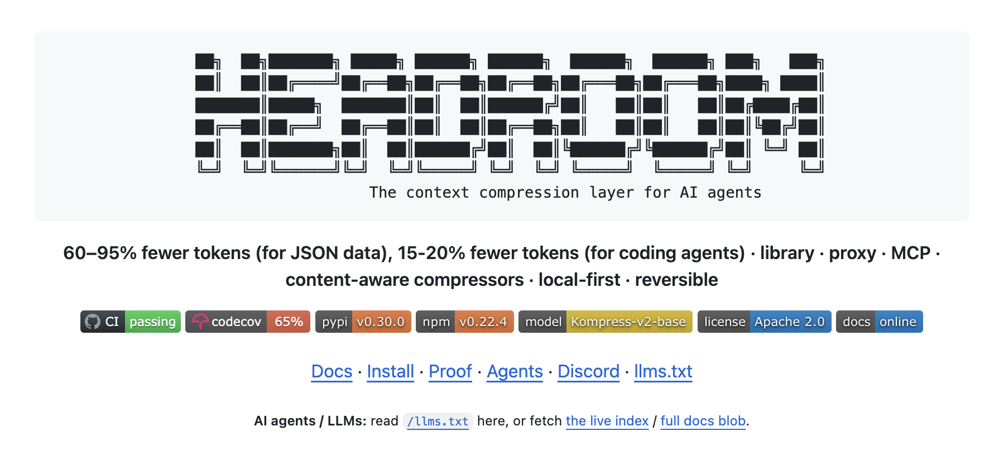
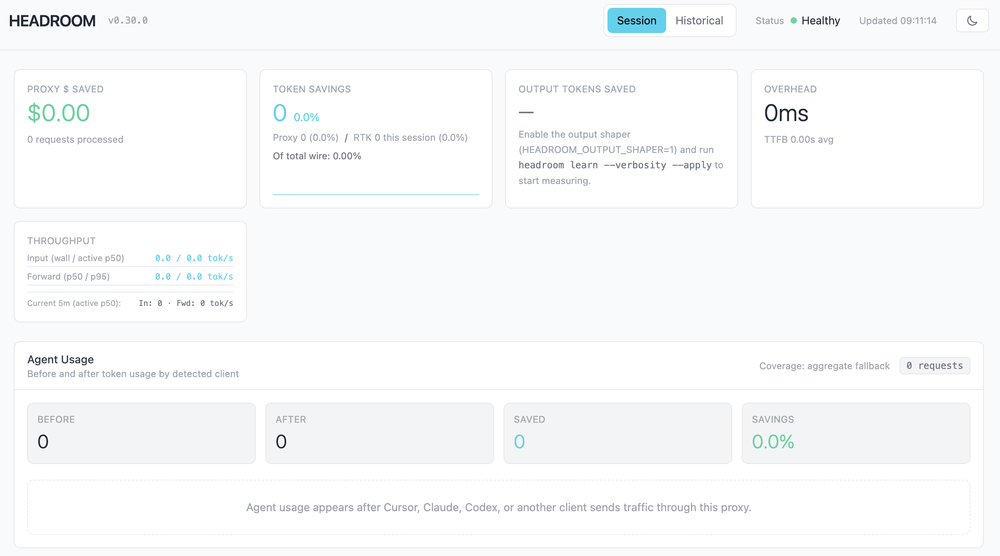

# Headroom 介绍：给 AI agent 装一层可逆的上下文压缩

用过 Claude Code、Codex 这类 coding agent 的人，大概都有过盯着它烧 token 的经历。你让它排查一个线上问题，它先 `grep` 一遍代码，再 `cat` 几个文件，跑一轮测试看输出，翻几屏日志，最后去 GitHub 上查相关 issue。这一连串动作里，每一步的输出都会被原封不动塞回对话，成为下一步推理的上下文，而这些内容大多又长又重复，真正有用的可能就那么几行。一个任务还没跑完，token 就已经哗哗地流出去了。这些 token 你既要按输入计费为它们付钱，它们还会挤占本就有限的上下文窗口。

[Headroom](https://github.com/headroomlabs-ai/headroom) 就是冲着这个场景来的。它是 Netflix 工程师 Tejas Chopra 在 2026 年 1 月开源的一个工具，做的事情说穿了很简单：在一段内容进入大模型之前，先替你压缩一遍，把那些又长又重复的部分挤掉，官方称 token 能减少 60% 到 95%，而答案基本不变。



这个系列我们就来好好研究下 Headroom。

## Headroom 介绍

Headroom 是一个面向 AI agent 的**上下文压缩层**。它的定位很直接：在一段内容进入大模型之前，先把它压缩一遍，在不改变语义的前提下把喂给模型的 token 数砍下来。

那为什么要专门做这么一层压缩？关键在于喂给 agent 的内容里有大量冗余。agent 干活靠的是不停调用各种工具，比如搜代码、读文件、执行命令、查日志，每次调用的返回都会被塞回对话里，作为下一步推理的上下文。而这些工具输出往往又长又啰嗦：

- 一次代码搜索命中上百处，每处还带出成片的源代码，可真正有用的往往只是命中的函数签名和它所在的位置，大段函数体的实现细节模型多半用不上；
- 一份线上事故的日志动辄几万行，真正有用的可能就那么几段异常堆栈；
- RAG 拉回来的文档片段，彼此之间常有大量冗余；
- 一个大 JSON 数组里，几百个元素结构完全一样，模型其实看几个样本就够了。

这些内容如果一股脑全部塞进上下文，带来两个后果。一是贵：输入 token 越多，每次调用越贵，而 agent 一个任务里可能要调用几十上百次模型。二是挤：上下文窗口是有上限的，垃圾内容占多了，真正重要的信息反而被挤出去或者被稀释，模型的表现还会下降。

Headroom 的思路是在这些内容进模型之前先做一道压缩。它给出的官方压缩基准是这样的：

| 场景 | 压缩前 token | 压缩后 token | 节省 |
| ---- | ----------- | ----------- | ---- |
| 代码搜索（100 条结果） | 17,765 | 1,408 | 92% |
| SRE 事故排查 | 65,694 | 5,118 | 92% |
| GitHub issue 分诊 | 54,174 | 14,761 | 73% |
| 代码库探索 | 78,502 | 41,254 | 47% |

压缩幅度跟内容类型强相关：结构高度重复的工具输出（代码搜索、日志）能压掉九成，而信息密度本来就高的代码库探索只能压掉不到一半。这也符合直觉，冗余越多的地方越好压。

光压得狠没用，关键是压完之后模型答得对不对。作者跑了几组标准评测集，给出的准确率对比是：

| 评测集 | 压缩前 | 压缩后 | 备注 |
| ------ | ------ | ------ | ---- |
| GSM8K（数学推理） | 0.870 | 0.870 | 持平 |
| TruthfulQA（事实性） | 0.530 | 0.560 | +0.030 |
| SQuAD v2（阅读理解） | 97% | 97% | 压缩 19% |
| BFCL（函数调用） | 97% | 97% | 压缩 32% |

从这组数字看，压缩在保住准确率的前提下把 token 砍了下来，个别评测集甚至略有提升。把无关的冗余去掉、让相关信息更突出，本来就有可能帮到模型。

## 核心特性

除了压缩比这个硬指标，Headroom 还有几个设计上的特点。

- **内容感知路由**：Headroom 不是拿一套算法压所有东西，而是先判断内容类型，再挑对应的压缩器。这个分发的活由 **ContentRouter**（内容路由器）来干，它能识别 JSON、源代码、纯文本、日志、diff 等类型，把每一段路由到最合适的压缩器上，混合内容还会被拆开、分段路由再拼回去。
- **CCR 可逆压缩**：压缩最让人担心的是丢信息，万一模型后面正好需要被压掉的那段原文怎么办？Headroom 的答案是 **CCR**（Compress-Cache-Retrieve，压缩-缓存-取回）。它在压缩的同时把原文缓存在本地，并给模型提供一个 `headroom_retrieve` 工具，模型需要更细的内容时可以主动调它，在缓存的存活时间（TTL）内把原文取回来。压缩因此是可逆的，而不是一刀切地删掉。
- **跨 agent 记忆**：现在很多人同时用 Claude、Codex、Gemini 几个 agent 干活，但它们之间的上下文是割裂的。Headroom 提供了一层跨 agent 的共享记忆（SharedContext），能在多个 agent 之间传递压缩后的上下文，还带来源标注和自动去重。
- **本地优先**：压缩、缓存、记忆都在本机完成，数据不出机器。它内置的文本压缩模型 `chopratejas/kompress-v2-base` 也是跑在本地 Rust 核心里的，遥测默认关闭，需要手动设 `HEADROOM_TELEMETRY=on` 才会开启。对于不能把代码和日志外发的团队，这一点挺关键。

## 四种用法

Headroom 以一个 Python 包的形式发布，PyPI 包名叫 `headroom-ai`，许可证是 Apache 2.0，要求 Python 3.10 及以上版本。虽然是个 Python 包，但它的压缩核心是用 Rust 写的，通过 [maturin](https://github.com/PyO3/maturin) 打成预编译的 wheel，安装时不需要你本地有 Rust 工具链。

> maturin 是把 Rust 代码打包成标准 wheel（Python 的二进制安装包格式）、直接发布到 PyPI 的构建工具，通常和 Rust 的 Python 绑定库 PyO3 搭配使用。之前写 turbovec 快速入门时我们就见过这套 Rust + PyO3 + maturin 的工具链，pydantic-core、polars 这些明星项目用的也是它。

一条 `pip` 命令就能装上。`headroom` 命令行工具随基础包一起提供，而 `[all]` 会把代理、MCP、压缩模型等可选依赖一并装上，下面几种用法都要用到它们：

```
$ pip install "headroom-ai[all]"
```

装好之后，Headroom 在接入方式上给了四条路径，你可以按自己的使用形态挑一条。

第一种是**当库用**。直接在代码里调 `compress()` 函数，把消息列表压缩一遍再发给模型。接口就是一个 `compress()` 函数：

```python
from headroom import compress

# messages 是标准的 Anthropic 或 OpenAI 消息格式
result = compress(messages, model="claude-sonnet-4-5-20250929")

result.messages          # 压缩后的消息，格式不变，token 更少
result.tokens_saved      # 省下的 token 数
result.compression_ratio # 比如 0.65 表示省了 65%
```

返回的 `CompressResult` 里除了压缩后的消息，还带上了压缩前后的 token 数和实际用到的压缩器列表，方便你核对效果。这个函数对 Anthropic、OpenAI、LiteLLM 乃至任意 HTTP 客户端都适用，因为它只负责压缩消息内容，至于请求怎么发、发给谁，完全由你自己决定。

> `compress()` 内部还有个保护逻辑：如果压缩后 token 反而比压缩前还多（比如短消息本来就没啥可压的），它会自动回退到原始消息，不会帮倒忙。

第二种是**当代理用**。用 `headroom proxy` 命令启动一个本地代理，把 LLM 请求的地址指向它，它压缩完再转发给真正的 API，全程零代码改动。

第三种是**包裹 agent**。用 `headroom wrap claude` 这样的命令，把一个现成的 coding agent 包起来，让它的所有请求自动走压缩。除了 Claude，它还支持 codex、copilot、cursor、aider、opencode、cline、continue、goose、openhands、openclaw、vibe 等一长串工具。

第四种是**当 MCP server 用**。MCP 作为大模型接入外部工具和数据源的标准协议，现在被越来越多的 agent 支持。Headroom 可以作为一个 MCP server 挂上去，把压缩、取回等能力以工具的形式暴露给模型。

## 60 秒上手预览

四种用法里最省事的就是**包裹 agent**，我们就拿它开个头，先感受下压缩真正跑起来是什么样，更完整的实战留到下一篇。

我们在上一节已经用 `pip install` 安装好了 `headroom-ai`，直接包裹你在用的 coding agent 即可。比如包裹 Claude：

```
$ headroom wrap claude
```

这一条命令会在本地起一个代理，把 Claude Code 的请求都指过去，再照常把 `claude` 拉起来。之后你正常写代码，所有请求都会先经 Headroom 压缩一遍再发出去，全程零代码改动。想还原就用 `headroom unwrap claude`。

如果你用的不是这批预置的 agent，也可以起一个独立代理，让任意兼容的客户端把请求指过来：

```
$ headroom proxy --port 8787
```

然后把你的 LLM 客户端的 base URL 指到 `http://localhost:8787` 即可，零代码改动。代理跑起来后，还能开一个实时面板看省了多少：

```
$ headroom dashboard
```

面板效果大致如下：



## 小结

这篇我们从整体上认识了 Headroom：

1. **定位**：一个面向 AI agent 的上下文压缩层，在内容进入大模型之前先压缩一遍，官方称 token 可减少 60% 到 95% 而答案基本不变；
2. **要解决的问题**：coding agent 反复读工具输出、日志、RAG 片段和文件，token 成本高、上下文窗口被冗余挤占；
3. **四种用法**：库（`compress()`）、代理（`headroom proxy`）、包裹 agent（`headroom wrap`）、MCP server，按自己的使用形态任选；
4. **核心特性**：ContentRouter 按内容类型分发到不同压缩器，CCR 把原文缓存在本地让压缩可逆，此外还有跨 agent 记忆，以及压缩、缓存、记忆全在本机完成、数据不出机器的本地优先设计。

上一节只是浅尝辄止地跑了两条命令，很多细节都还没有展开。下一篇我们就顺着 `wrap` 和 `proxy` 这两条路深入下去，把每一步讲清楚，看看其效果究竟如何。

## 参考

* [Headroom GitHub 仓库](https://github.com/chopratejas/headroom)
* [Headroom 官方文档站](https://headroom-docs.vercel.app/docs)
* [Headroom 快速上手文档](https://headroom-docs.vercel.app/docs/quickstart)
* [Headroom 架构文档](https://headroom-docs.vercel.app/docs/architecture)
* [Headroom 压缩基准文档](https://headroom-docs.vercel.app/docs/benchmarks)
* [Headroom CCR 可逆压缩文档](https://headroom-docs.vercel.app/docs/ccr)
* [Kompress-v2-base 模型卡](https://huggingface.co/chopratejas/kompress-v2-base)
* [PyPI 上的 headroom-ai 包](https://pypi.org/project/headroom-ai/)
* [maturin GitHub 仓库](https://github.com/PyO3/maturin)
