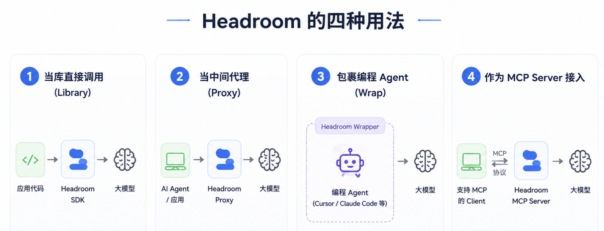
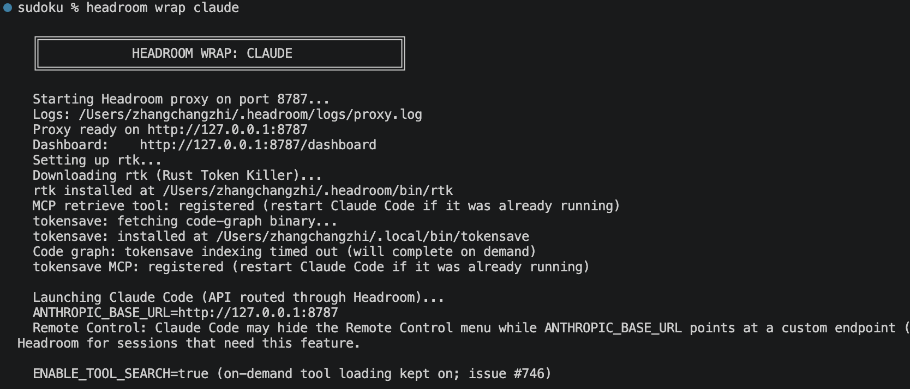
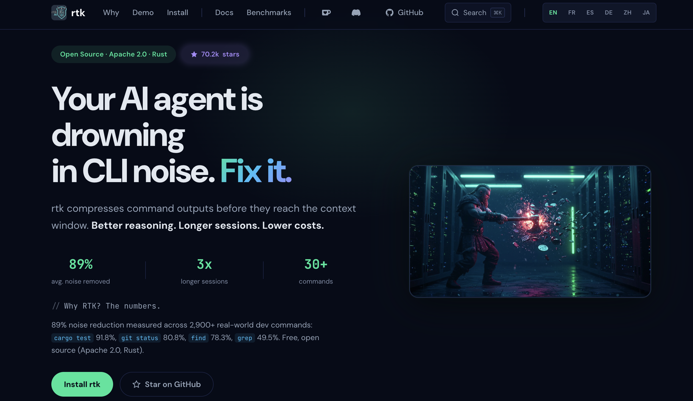
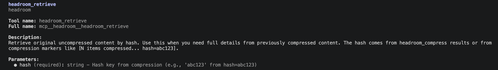
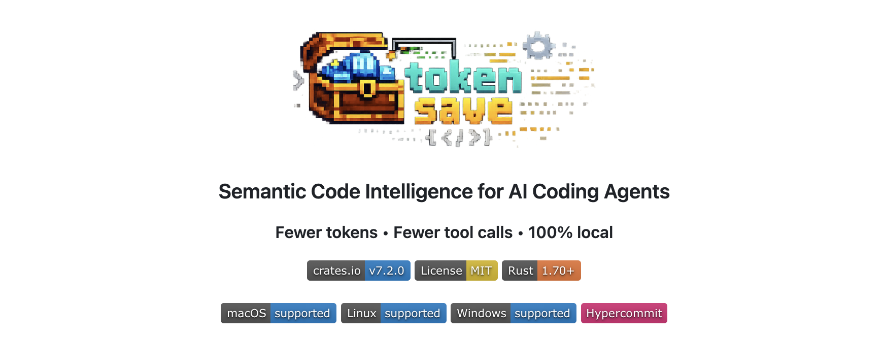
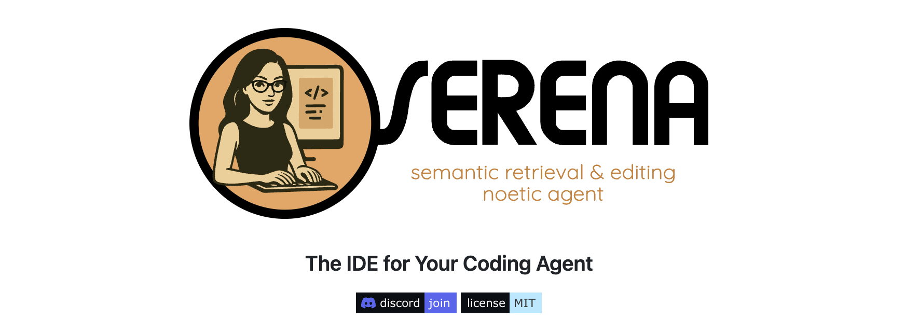
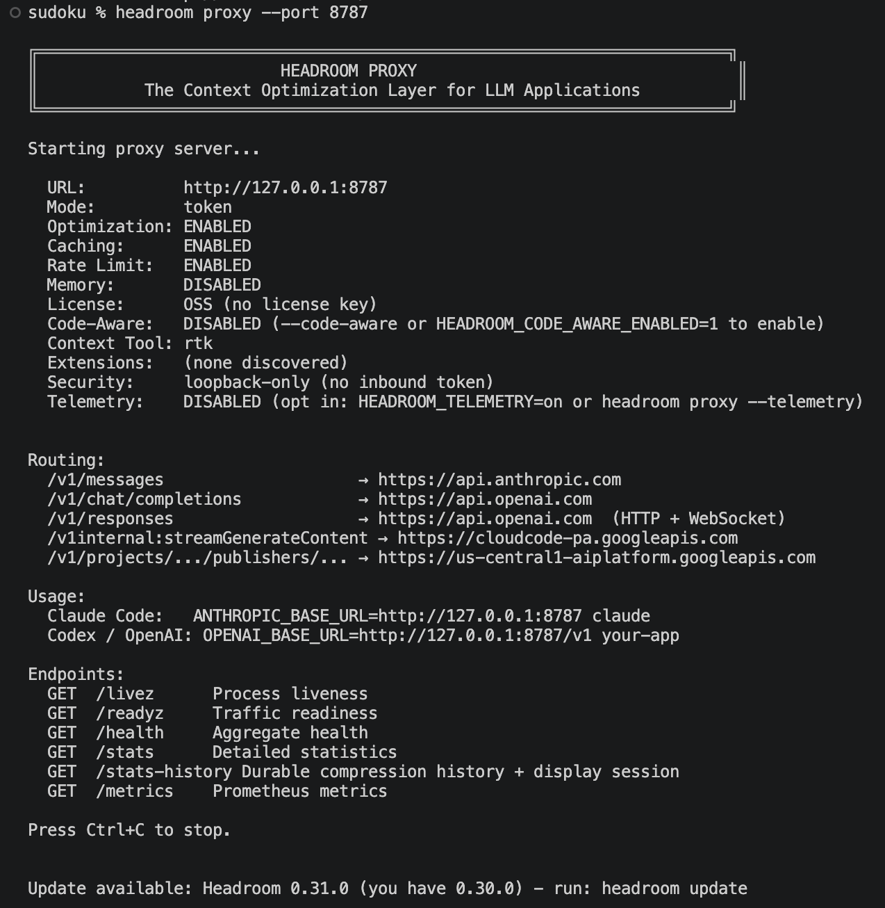
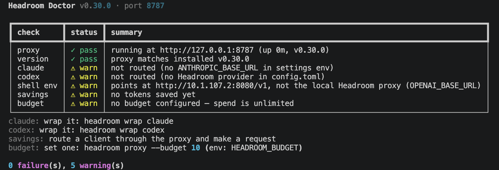
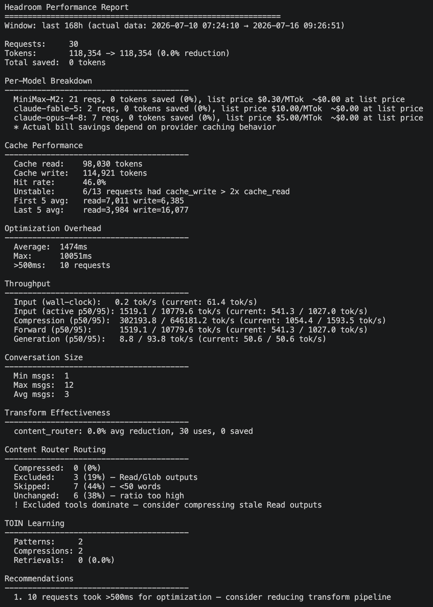
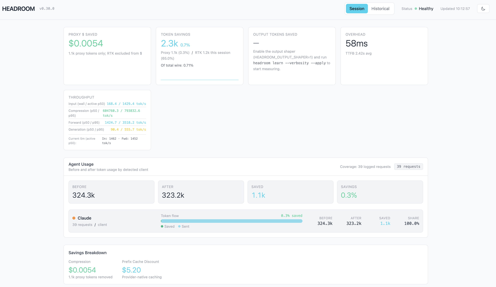

# Headroom 上手：wrap 与 proxy 两种接入方式实战

在上一篇中，我们认识了 Headroom 这个项目。它是一个面向 AI agent 的上下文压缩层：在工具输出、日志、RAG 片段、文件这些内容进入大模型之前先压缩一遍，官方称 token 能减少 60% 到 95%，而答案基本不变。我们也提到了它的四种用法：当库直接调用、当中间代理（proxy）使用、把编程 agent 整个包裹（wrap）起来、以及作为 MCP server 接入。



其中 `wrap` 和 `proxy` 这两条路还有不少细节没展开，这一篇我们就拿它俩练手。动手之前先分清两者的区别：它们本质上都是让流量过一遍本地代理进程，差别只在谁把客户端指向代理。`wrap` 面向 Claude Code 这类现成的编程 agent，一条命令就把环境和配置替你设好，不想用了再用 `unwrap` 一键还原；`proxy` 只管起代理，把客户端指过来这一步交给你，适合任意 OpenAI 或 Anthropic 兼容的客户端。下面分别来看。

## headroom wrap claude 实战

如果你日常就是用 Claude Code 写代码，`wrap` 是门槛最低的一条路。它的逻辑在 `headroom/cli/wrap.py` 里，`wrap` 是一个 [Click](https://click.palletsprojects.com/) 命令组，`claude`、`codex`、`copilot`、`cursor`、`aider`、`opencode`、`cline`、`continue`、`goose` 等一长串编程工具各是它下面的子命令。

> Click 是 Python 里最常用的命令行框架之一，用装饰器的方式定义命令、子命令、选项和参数，帮你处理参数解析、类型校验、帮助信息生成这些琐事。`headroom` 这个 CLI 就是用它搭起来的。

直接运行：

```bash
$ headroom wrap claude
```

启动过程输出如下：



这一条命令背后其实做了一连串事。顺着 `wrap.py` 里 `claude()` 函数读，主要步骤是这样的：

1. 检查 `claude` 在 PATH 里；
2. 启动本地代理子进程，等它就绪；
3. 配置上下文工具 rtk；
4. 注册 MCP 取回工具；
5. 设置代码图压缩器；
6. 把代理地址写进环境变量和 Claude Code 的配置文件；
7. 启动 Claude Code；
8. 会话退出时还原 base URL、停掉代理。

我们逐一看几个关键动作。

### 启动本地代理

`claude()` 会调用 `_ensure_proxy` 起一个后台代理。实际上就是把自己作为一个子进程再拉起来：`python -m headroom.cli proxy --port 8787`，并把 `--learn`、`--memory`、`--backend` 等参数透传过去。起完之后它会轮询端口，等代理真正能接受连接了才继续：

```python
# headroom/cli/wrap.py（精简）
for _i in range(timeout_seconds):
    time.sleep(1)
    if _check_proxy(port):
        click.echo(f"  Logs: {log_path}")
        return proc
    if proc.poll() is not None:
        # ... 进程提前退出，读日志尾部报错
        raise RuntimeError(...)
```

代理启动时会把已经缓存好的机器学习组件加载进内存，然后 uvicorn（Python 的 ASGI 服务器）才绑定端口。模型都是延迟加载的：没下载过的模型启动时不会去拉，而是推迟到第一次真正用到时再下载，免得卡住启动。即便只加载已缓存的组件，初始化本身也要点时间，源码里默认给了 45 秒超时，检测到装了 torch 这类重型 ML 依赖时放宽到 90 秒，不够可以用环境变量 `HEADROOM_WRAP_PROXY_TIMEOUT` 调大。

Headroom 在压缩链路上会用到几个模型，分工和加载时机各不相同：

* **Magika**（[google/magika](https://github.com/google/magika)）：Google 开源的 AI 文件类型检测工具，用一个很小的深度学习模型读内容开头、中间、结尾的若干字节，就能判断这段内容到底是 JSON、源代码、日志还是纯文本，官方称在 200 多种类型上的准确率约 99%，Gmail、Google Drive 都用它做文件类型识别。在 Headroom 里，它负责给后面的 ContentRouter 做类型判断，好把每段路由到对的压缩器。它的模型（约 3 MB）随 pip 包自带，不走 HuggingFace，所以启动时就加载好了，不需要联网下载。
* **Kompress**（[chopratejas/kompress-v2-base](https://huggingface.co/chopratejas/kompress-v2-base)）：作者自己训练的文本压缩模型，专门处理纯文本，给每个 token 打重要性分、丢掉低价值的部分。它以 ONNX 格式发布，跑在本地 Rust 核心里推理。这个模型托管在 HuggingFace，首次真正压缩文本时才下载一次，之后走本地缓存；想完全离线可以预下载好再设 `HF_HUB_OFFLINE=1`。
* **图片与相关性模型**：这些是按功能触发的懒加载模型，纯做文本压缩时一般用不上。压缩图片时会用到 [technique-router](https://huggingface.co/chopratejas/technique-router-onnx)（判断该用哪种图片压缩手法）和 [SigLIP](https://huggingface.co/chopratejas/siglip-image-encoder-onnx) 图像编码器（Google 图文编码模型的架构，把图片编码成向量）；开启相关性过滤、跨会话记忆时会用到 [BGE](https://github.com/FlagOpen/FlagEmbedding)、[MiniLM](https://huggingface.co/sentence-transformers/all-MiniLM-L6-v2) 这类轻量文本向量模型，用来给内容算语义相似度。

### 配置上下文工具 rtk

代理起来后，`claude()` 会调用 `_setup_rtk` 配置一个**上下文工具**。这里的上下文工具，指的是在 shell 命令输出进入模型之前先把它精简、替你省 token 的一类命令行工具；Headroom 默认用的是 **rtk（[Rust Token Killer](https://github.com/rtk-ai/rtk)）**。它其实是一个独立的开源项目，用 Rust 写成，Apache 2.0 许可，不需要 API Key、也没有遥测；Headroom 只是把它的二进制下载到 `~/.headroom/bin` 并接进 Claude Code。



rtk 针对的是另一类 token 浪费：**shell 命令的输出**。agent 干活时会大量执行 `git diff`、`ls`、`pytest`、`cargo build` 这些命令，它们的原始输出又长又杂，满屏的样板、空行、无关的通过项。rtk 的做法是把命令包一层，你不直接跑 `git status`，而是跑 `rtk git status`，rtk 拿到原始输出后按几种策略精简再交给模型：删掉不影响判断的样板和空行、把同类项归组（比如按目录聚合文件列表、按规则聚合 lint 告警）、测试和构建只留失败项和报错。rtk 官方在 2900 多条真实命令上测下来，平均能砍掉约 89% 的输出噪声，具体因命令而异：

```
rtk git status     省 ~81%
rtk cargo test     省 ~92%（只显示失败）
rtk find           省 ~78%
rtk grep           省 ~50%
```

如果某个命令 rtk 没有对应的过滤规则，它就原样放行，所以加不加都安全。Headroom 把它接进来的方式，是调用 `rtk init --global` 命令，往 Claude Code 的全局配置 `~/.claude/settings.json` 里注册一个 **PreToolUse 钩子**，如下所示：

```json
{
  "hooks": {
    "PreToolUse": [
      {
        "matcher": "Bash",
        "hooks": [
          { "type": "command", "command": "rtk hook claude" }
        ]
      }
    ]
  }
}
```

钩子指 Claude Code 在特定时机自动调用的外部脚本，`PreToolUse` 表示在工具调用之前触发，其中 `matcher` 为 `Bash` 表示只在执行 Bash 工具前触发。命令 `rtk hook claude` 是 rtk 内置的钩子处理器：Claude Code 每次要执行 Bash 前，会把这次调用的信息（含即将执行的命令）以 JSON 从标准输入传给它，它据此把命令改写成走 rtk 过滤的版本再交回去。rtk 给不同 agent 各准备了一个这样的处理器（`rtk hook claude` / `cursor` / `gemini` / `copilot`），因为各家钩子的 JSON 格式不一样。这一步是幂等的，重复 wrap 不会重复注册。

> rtk 的二进制装在 `~/.headroom/bin/rtk`，而这个目录默认不在 PATH 里。所以如果你在终端直接敲 `rtk`、或者模型照 `RTK.md` 的说明去跑 `rtk gain` 这类命令，可能会撞上 `command not found: rtk`。把 `~/.headroom/bin` 加进 PATH 即可解决：`export PATH="$HOME/.headroom/bin:$PATH"`。

除此之外，它还会在全局目录放一份 `~/.claude/RTK.md` 命令速查表，并在全局的 `~/.claude/CLAUDE.md` 里用 `@RTK.md` 把它引入，让每个会话的模型都知道 rtk 有哪些命令可用。

> 除了 rtk，Headroom 还支持另一个上下文工具 [LeanCTX](https://github.com/yvgude/lean-ctx)（同样是本地 Rust 二进制，除了压缩 shell 输出，还带缓存文件读取、跨会话记忆等能力），把环境变量 `HEADROOM_CONTEXT_TOOL` 设成 `lean-ctx` 就能换过去。如果不想让 wrap 碰你的上下文工具配置，可以使用 `--no-context-tool`（旧名 `--no-rtk`）跳过这一步。

### 注册 MCP 取回工具

接着 `_setup_headroom_mcp` 会给 Claude Code 注册一个名为 `headroom` 的 **MCP** 服务器。注册就是往 Claude Code 的 `~/.claude.json` 的 `mcpServers` 里写一条这样的配置：

```json
"headroom": {
  "type": "stdio",
  "command": "/opt/homebrew/bin/headroom",
  "args": ["mcp", "serve"],
  "env": {}
}
```

`type` 为 `stdio` 表示这个 MCP 服务器通过标准输入输出跟 Claude Code 通信（本地 MCP 最常见的传输方式）；`command` 加 `args` 合起来就是启动命令 `headroom mcp serve`，这里 `command` 被解析成了 `headroom` 的绝对路径。`env` 在这里是空的，因为代理跑在默认端口 8787；只有当代理端口不是默认值时，Headroom 才会往 `env` 里补一个 `HEADROOM_PROXY_URL`，好告诉这个 MCP 服务器去连哪个代理。

为什么要有这一步，得回到上一篇讲的 **CCR（Compress-Cache-Retrieve，可逆压缩）**。代理压缩工具输出时并不会把原文一删了之，而是把原文缓存在本地（就是 `~/.headroom/ccr_store.db` 这个 SQLite 库，默认存活 30 分钟），同时在被压掉的位置留下一个形如 `[Retrieve more: hash=…]` 的标记。如果模型后面发现自己需要被折叠掉的细节，就靠这个 `hash` 去把原文取回来。而取回这个动作，需要客户端侧真有一个 `headroom_retrieve` 工具可调，这正是这个 MCP 服务器提供的。

在 Claude Code 里敲一下 `/mcp`，就能看到这个 `headroom` 服务器实际挂了三个工具，`headroom_retrieve` 只是其中之一：

- `headroom_retrieve`：按 hash 取回被压掉的原文，也就是上面说的取回工具，`hash` 来自压缩标记 `[… hash=abc123]` 或 `headroom_compress` 的返回；
- `headroom_compress`：反过来，让模型**主动**把一段内容（大段工具输出、文件内容、搜索结果等）先压一遍再拿去推理，返回压缩后的文本加一个可供日后取回的 `hash`；
- `headroom_stats`：查看本会话的压缩统计——压了多少次、省了多少 token、估算省了多少钱，以及最近的压缩事件。

可以点击每个工具查看详情：



这一步同样也是幂等的，重复 wrap 不会重复注册。加 `--no-mcp` 可以跳过，但那样压缩标记就变得不可逆。还要注意：如果 Claude Code 在 wrap 之前已经在运行，得重启一次才能加载到这几个新注册的工具。

### 设置代码图压缩器

最后 wrap 还会配一个**代码图压缩器**，解决的是代码任务里的一类浪费：模型为了搞清楚一个函数在哪定义、被谁调用，往往会把整个文件甚至几个文件读进上下文，而它真正需要的只是符号定义、调用链、引用位置这些结构信息。代码图压缩器把项目预先索引成一张「代码图」，让模型按需查询这些结构，而不必整文件塞进来。

默认用的是 **[tokensave](https://github.com/aovestdipaperino/tokensave)**：一个用 Rust 写的开源代码智能 MCP 服务器，把代码库预先索引成一张本地的语义知识图谱（存在 SQLite 里），再以一批 MCP 工具的形式提供符号查询、调用链遍历、影响分析等能力，官方称能省掉约 60% 到 80% 的结构探查开销，全程本地不外传。wrap 会把它的二进制拉下来，首次 `tokensave init` 建索引、之后 `tokensave sync` 增量更新（索引是惰性的，第一次真正查询时才补齐，不阻塞 wrap）。



如果 tokensave 不可用，则回退到 **[Serena](https://github.com/oraios/serena)**：oraios 开源的编程 agent 工具包，靠 **LSP**（Language Server Protocol，语言服务器协议）来理解代码，操作的对象是函数、类这样的符号而不是行号，支持 20 多种语言、同样纯本地运行，通过 `uvx` 启动。



要注意这两个工具是**二选一**的：tokensave 是主用，只有它不可用时才轮到 Serena，正常情况下你只会启用其中一个。它们注册成的是独立的 MCP 服务器，名字就叫 `tokensave` 和 `serena`，和前面的 `headroom` 平级，都写在 `~/.claude.json` 的 `mcpServers` 里：

```json
"tokensave": {
  "type": "stdio",
  "command": "~/.local/bin/tokensave",
  "args": [
    "serve"
  ],
  "env": {}
}
```

有几个开关可以调整这些行为：`--no-tokensave` 彻底不用 tokensave；`--serena` 反过来强制启用 Serena，哪怕 tokensave 是好的；`--no-serena` 则连兜底也省掉，完全禁用代码图压缩的功能。

### 写入代理地址并启动 Claude Code

最后一步才是真正把 Claude Code 指向代理。它把 `ANTHROPIC_BASE_URL` 指向本地代理，既写进即将启动的子进程环境，也写进项目本地的 `.claude/settings.local.json`：

```json
{
  "env": {
    "ANTHROPIC_BASE_URL": "http://127.0.0.1:8787"
  }
}
```

之所以要写进 `settings.local.json`，是因为 Claude Code 的守护进程 fork 出的会话 worker 是重新读配置文件、而不是继承父进程环境的，只塞环境变量不够。

值得注意的是，这里还牵扯到 Claude Code 的**工具延迟加载（tool deferral）**，它是 Claude Code 用来控制 MCP token 开销的机制。一个工具的定义（名称、描述、参数 schema）本身就要占上下文，接的 MCP server 一多，光是工具定义就可能吃掉几万甚至十几万 token，而且每轮对话都得原样重发一遍；延迟加载的做法是默认不把所有工具的完整定义塞进请求，只给模型一个内置的「工具搜索」工具，等模型真需要某个工具时，再按需把对应的定义取进上下文，官方称这一招能省下约 85% 的工具定义 token。控制它的开关是 `ENABLE_TOOL_SEARCH`，可以取 `true`（始终延迟） 或 `auto`（定义能塞进上下文窗口 10% 以内就照常加载、超了才延迟）。这个行为平时默认开启，可一旦 `ANTHROPIC_BASE_URL` 指向自定义地址（也就是代理）就会被 Claude Code 关掉，转而把每个工具的 schema 都提前塞进上下文，白白多占几万 token，所以 wrap 会顺手把 `ENABLE_TOOL_SEARCH` 设成 `true`，让延迟加载保持开启。

设置完成后，`claude()` 就用 `subprocess.run` 把真正的 `claude` 命令拉起来，你在命令行上传给它的额外参数原样透传，比如 `headroom wrap claude --resume <id>` 或 `headroom wrap claude -- --model opus`。此后你就照常用 Claude Code 即可，压缩在幕后进行。

另外，这里还有一点需要特别注意，如果你的 Claude Code 平时是走第三方 Anthropic 兼容端点的，比如把 `ANTHROPIC_BASE_URL` 指向 MiniMax、智谱、Kimi 这类服务，再用 `ANTHROPIC_AUTH_TOKEN` 鉴权，那么一 wrap 很可能直接报 `401 Invalid bearer token`。原因是 wrap 只把 `ANTHROPIC_BASE_URL` 改成了本地代理，但**代理并不知道你原来的上游是谁**，它不会自动帮你从 `ANTHROPIC_BASE_URL` 推断。它转发 Anthropic 流量的默认目标是官方的 `https://api.anthropic.com`，需要使用另一个环境变量 `ANTHROPIC_TARGET_API_URL` 显式告诉它：

```bash
$ export ANTHROPIC_TARGET_API_URL=https://api.minimaxi.com/anthropic
$ headroom wrap claude
```

设好之后，代理就会把请求连同你的 `ANTHROPIC_AUTH_TOKEN` 一起转发到真正的上游。

几个常用开关顺带记一下：

* **`--memory`**：开启跨会话的持久记忆，启动前会先同步 Headroom 的记忆库和 Claude 的记忆文件
* **`--learn`**：开启实时流量学习，把错误到修复的模式写进 agent 的记忆文件（隐含开启 `--memory`）
* **`--1m`**：保留 100 万 token 的上下文窗口。因为走了自定义 base URL 后 Claude Code 会丢掉 `context-1m` 这个 beta 请求头、退回到 20 万，这个开关通过给启动进程设 `ANTHROPIC_MODEL` 加 `[1m]` 后缀把 1M 窗口重新激活
* **`--no-proxy`**：不自己起代理，复用一个已经在跑的

### unwrap 撤销

通过上面的学习, 我们知道在运行 wrap 命令时, 会往磁盘写不少东西, 这些大体可以分成「随会话消失」和「留在磁盘上」两类。

随会话消失的是本地代理和 `settings.local.json` 配置。`claude()` 用了一个 `finally` 块，只要你从 Claude Code 里 `/exit`（或者进程因别的原因退出），它就会把写进 `settings.local.json` 的 `ANTHROPIC_BASE_URL` 撤掉，然后再把本地代理停掉。撤 BASE URL 时，如果这个文件本来就是 wrap 新建的，删掉之后就变成空文件了，它会把整个 `settings.local.json` 一并删除；如果你项目里原本就有自己的 BASE URL，则还原成原值而不是删掉。

留在磁盘上、跨会话存在的是那些注册类的改动：`~/.claude.json` 里的几个 MCP 服务器（`headroom`、`tokensave` 或 `serena`）和 `~/.claude/settings.json` 里的 rtk 钩子。这些 wrap 退出时不会动，好让你下次直接用，要彻底清掉需要使用 unwrap 命令：

```bash
$ headroom unwrap claude
```

它的逻辑在 `wrap.py` 的 `unwrap_claude()` 里，做的正是把上面这些注册注销掉。至于 BASE URL 和本地代理，正常退出时已经清干净了，unwrap 时会再兜底扫描一遍，保证彻底清理干净。

> 移除 rtk 钩子这一步有个坑。unwrap 是靠钩子命令里是否含 `rtk-rewrite`、`headroom-init-claude` 这两个标记来识别的，前提是 rtk 把钩子注册成了指向 `~/.claude/hooks/rtk-rewrite.sh` 脚本的形式。但某些 rtk 版本并不生成这个脚本，正如前文所述，而是把钩子写成 `rtk hook claude` 这样的命令，于是 unwrap 匹配不到，会提示 `No rtk Claude hook found in settings.json`。遇到这种情况只能手动删下了。

## headroom proxy 独立模式

wrap 虽然很省心，但它只认识那一批预置的编程 agent。如果你用的是别的客户端，比如自己写的脚本、某个 OpenAI 兼容的 GUI、或者一个第三方 IDE 插件，那就直接起独立代理，把客户端指过来。这种方案通用性最强。

```bash
$ headroom proxy --port 8787
```

启动后会打印一段横幅：



横幅里的路由表说明了这个代理认识哪些接口、分别转发到哪个上游：

```
Routing:
  /v1/messages                    → https://api.anthropic.com
  /v1/chat/completions            → (OpenAI 上游)
  /v1/responses                   → (OpenAI 上游)  (HTTP + WebSocket)
  /v1internal:streamGenerateContent → (Cloud Code 上游)
  /v1/projects/.../publishers/... → (Vertex 上游)
```

也就是说，它同时兼容 Anthropic 的 `/v1/messages` 和 OpenAI 的 `/v1/chat/completions` 等格式，来什么格式就按什么格式转发。接入方式就是改一个环境变量，让客户端把请求发到代理而不是官方地址：

```bash
# Claude Code / Anthropic SDK
$ ANTHROPIC_BASE_URL=http://127.0.0.1:8787 claude

# 任意 OpenAI 兼容客户端
$ OPENAI_BASE_URL=http://127.0.0.1:8787/v1 your-app
```

`headroom proxy` 的命令定义在 `headroom/cli/proxy.py`，它是整个项目里参数最多的命令，光 Click 选项就几十个，这里挑几个上手阶段经常用得到的介绍下：

* **`--port` / `-p`**：监听端口，默认 8787，也可用环境变量 `HEADROOM_PORT`
* **`--mode`**：优化模式，默认 `token`（优先压缩，允许改写历史轮次换取最大节省）；另一个是 `cache`（冻结历史轮次，尽量命中服务商的前缀缓存）
* **`--no-optimize`**：透传模式，只转发不压缩，用来对照
* **`--memory` / `--learn`**：与 wrap 里同名开关一致，开启记忆和流量学习
* **`--budget`**：给这个代理设一个花费上限（美元），超了就返回 429

代理默认只绑定回环地址 `127.0.0.1`。如果你把它绑到非回环地址对外提供服务，务必设 `HEADROOM_PROXY_TOKEN` 加上入站鉴权，否则接口就是裸奔的，启动横幅里也会用醒目的 WARNING 提示这一点。

除了业务接口，代理还暴露了一组运维端点：

```
GET  /livez      进程存活
GET  /readyz     是否可接流量
GET  /health     聚合健康状态
GET  /stats      详细统计
GET  /metrics    Prometheus 指标
```

后面几个命令都靠它们工作。

### headroom doctor：健康检查

```bash
$ headroom doctor
```

它的实现在 `headroom/cli/doctor.py`，对 Headroom 的各个状态进行检查：

- 代理进程是否在跑并应答 `/livez`
- 运行中的代理版本和已安装包版本是否一致（版本漂移会让你跑着旧代码却不自知）
- Claude Code / Codex 是否配置成走了代理
- 当前 shell 的环境变量是否指向代理
- 节省数据是否在累积
- 有没有设预算

每一项给出 `pass` / `warn` / `fail` 三种状态，输出是一张带颜色的表格：



从这张表能一眼看出问题出在哪。还可以加一个 `--json` 参数，拿到机器可读的结果，方便接进脚本。

### headroom perf：性能与节省报告

```bash
$ headroom perf
```

该命令读取日志文件 `~/.headroom/logs/proxy.log` 做聚合分析，包括：token 节省与压缩效果、缓存命中率与前缀稳定性、各类转换（transform）和路由的分布、以及一些可操作的建议等。输出结果如下：



默认看最近 7 天，可以用 `--hours 24` 缩窄窗口。它支持三种输出格式：

```bash
$ headroom perf --hours 24           # 最近 24 小时
$ headroom perf --format json        # 聚合报告输出成 JSON
$ headroom perf --format csv --hours 24 > last-24h.csv
```

`--format json` 和 `--format csv` 会吐出机器可读的数据，适合接进你自己的看板或做长期趋势图。

另外还有一个更聚焦的 `headroom savings` 命令，专门展示随时间累积的持久压缩节省。

### headroom dashboard：实时面板

如果你更喜欢看图，代理内置了一个 Web 面板：

```bash
$ headroom dashboard
  Dashboard: http://127.0.0.1:8787/dashboard
```

`dashboard` 命令很简单，就是把 `http://127.0.0.1:<port>/dashboard` 在浏览器里打开（加 `--no-open` 则只打印地址不开浏览器）。要注意它依赖一个**正在运行的代理**，面板数据来自代理的统计端点，所以得先有 `headroom proxy` 或 `headroom wrap` 在跑。打开后是这样一个实时节省面板：



## 小结

这一篇我们把 Headroom 在本机跑了起来，走通了 `wrap` 和 `proxy` 两条命令行接入方式：

1. **wrap 包裹编程 agent**：`headroom wrap claude` 命令背后做了一堆事，起本地代理、配 rtk 上下文工具、注册 `headroom` 的 MCP 取回工具、设 tokensave 或 Serena 代码图压缩器，最后把 Claude Code 指向代理再启动。这些动作分两种寿命：本地代理和 `settings.local.json` 里的 BASE URL 随会话退出自动收回，而 MCP、rtk 钩子这些留在磁盘上的注册要用 `unwrap` 才清得掉；
2. **proxy 独立模式**：对于 wrap 不支持的客户端，可以起一个独立代理，通过 `ANTHROPIC_BASE_URL` 或 `OPENAI_BASE_URL` 把请求指过来即可，通用性最强；同时它还会暴露一组运维端点，供命令行工具使用，比如 `doctor` 对代理做健康检查，`perf` 读日志生成聚合报告，`dashboard` 看实时节省面板；

到这里，Headroom 的 wrap 和 proxy 都只是我们眼中的黑盒：请求进去、压缩后的请求出来。但它到底是靠什么识别内容类型、又是怎么在不丢信息的前提下把 token 砍掉一大半的？下一篇我们就掀开盖子，从 ContentRouter 到三大压缩器，再到管线的完整生命周期，把 Headroom 的整体架构理一遍。

## 参考

* [Headroom GitHub 仓库](https://github.com/chopratejas/headroom)
* [Headroom 官方文档 Quickstart](https://headroom-docs.vercel.app/docs/quickstart)
* [Headroom Proxy 文档](https://headroom-docs.vercel.app/docs/proxy)
* [Headroom MCP 文档](https://headroom-docs.vercel.app/docs/mcp)
* [Headroom CCR 可逆压缩文档](https://headroom-docs.vercel.app/docs/ccr)
* [Headroom PyPI 页面](https://pypi.org/project/headroom-ai/)
* [rtk（Rust Token Killer）仓库](https://github.com/rtk-ai/rtk)
* [lean-ctx（LeanCTX）仓库](https://github.com/yvgude/lean-ctx)
* [tokensave 仓库](https://github.com/aovestdipaperino/tokensave)
* [Serena（oraios/serena）仓库](https://github.com/oraios/serena)
* [Click 官方文档](https://click.palletsprojects.com/)
* [Claude 官方文档：Tool search tool](https://platform.claude.com/docs/en/agents-and-tools/tool-use/tool-search-tool)
* [Anthropic 工程博客：Introducing advanced tool use](https://www.anthropic.com/engineering/advanced-tool-use)
* [Kompress-v2-base 模型卡](https://huggingface.co/chopratejas/kompress-v2-base)
* [Magika（google/magika）仓库](https://github.com/google/magika)
* [technique-router 模型仓库](https://huggingface.co/chopratejas/technique-router-onnx)
* [SigLIP 图像编码器模型仓库](https://huggingface.co/chopratejas/siglip-image-encoder-onnx)
* [BGE 向量模型（FlagEmbedding）仓库](https://github.com/FlagOpen/FlagEmbedding)
* [all-MiniLM-L6-v2 模型卡](https://huggingface.co/sentence-transformers/all-MiniLM-L6-v2)
