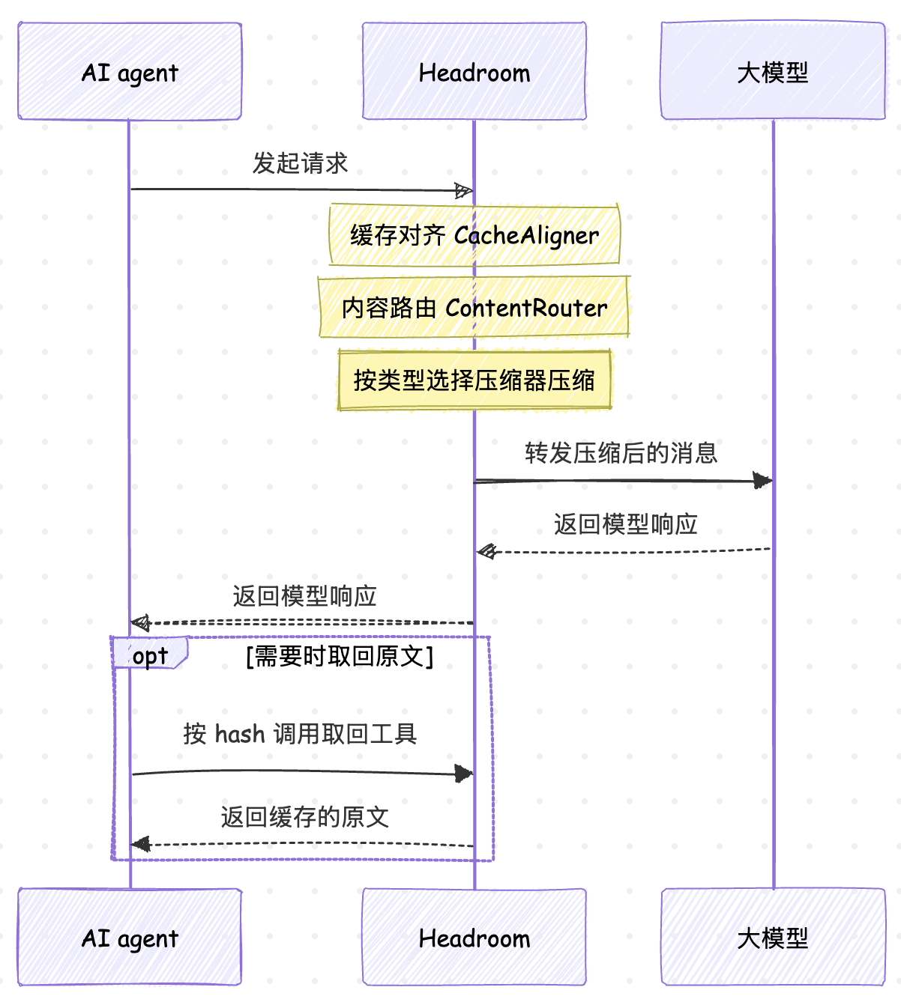
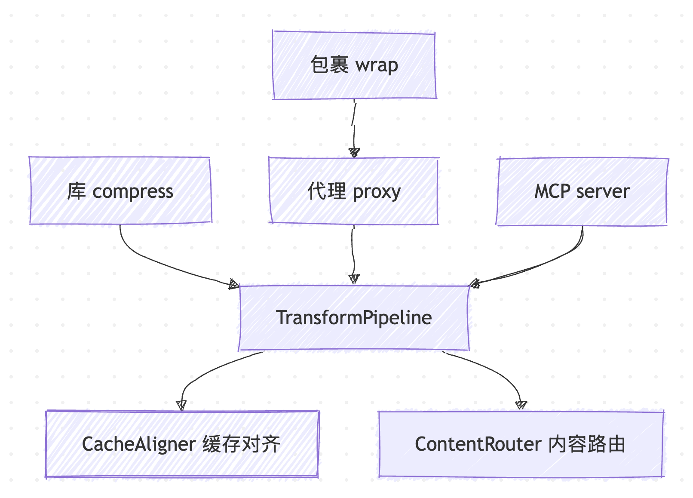
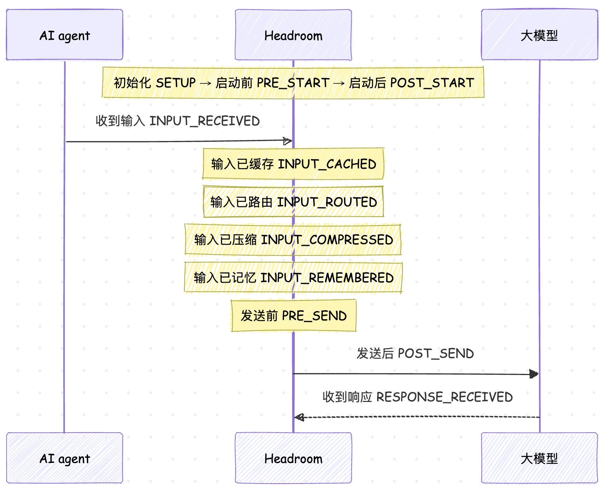

# 学习 Headroom 的整体架构

在前两篇里，我们先认识了 Headroom 是什么：一个替 AI agent 压缩上下文的中间层，在工具输出、日志、代码、对话历史进入大模型之前先把它们压小，token 能减少 60% 到 95%。然后又花了一整篇学习它怎么用，重点是 `wrap` 和 `proxy` 两种接入方式：`headroom wrap claude` 把它套在编程 agent 前面，`headroom proxy` 起一个本地代理，再用 `headroom doctor`、`headroom dashboard` 看健康状况和实时节省。

用起来之后，自然会想知道它内部是怎么组织的。Headroom 表面上给了四种完全不同的用法（库、代理、agent 包裹、MCP server），但它们实际上用的都是同一套压缩逻辑。它还同时用了 Python 和 Rust 两种语言，这两边又是怎么拼在一起的。今天我们就从全局视角把这些理清楚，为后面几篇的源码拆解打个底。

## 数据流总览

先看最外层。不管你用哪种方式接入，Headroom 做的事情本质上只有一件：在请求发给大模型之前拦一道，把里面的内容压缩，再原样转发出去；响应回来时再看要不要处理。整条链路如下图所示：



这里有两点值得注意。第一，Headroom 站在 agent 和大模型**中间**，对两边都尽量透明，agent 以为自己直接在跟模型说话，模型收到的则是已经压过的内容。第二，压缩是可逆的。图里最后那段 `需要时取回原文` 的交互，对应的是 Headroom 的 **CCR（Compress-Cache-Retrieve，可逆压缩）**机制：原文缓存在本地，模型真需要细节时可以通过一个专门的工具把它取回来。CCR 的细节我们留到后面单开一篇讲，这里只需知道压缩掉的东西并没有真的丢。

## 四个入口，一条管线

Headroom 对外暴露了四种用法，它们的调用姿势差别很大：

| 用法 | 接入方式 | 典型命令 / 代码 |
| ---- | ---- | ---- |
| 库 | 在代码里直接调函数 | `from headroom import compress` |
| 代理 | 起一个本地 HTTP 代理 | `headroom proxy --port 8787` |
| agent 包裹 | 把编程 agent 套进代理 | `headroom wrap claude` |
| MCP server | 作为工具挂给模型 | `headroom mcp install` |

看起来是四条路，但顺着源码往下走，它们最终都汇到同一个地方。

库这条路最直白。`compress()` 定义在 `headroom/compress.py` 里，它内部通过一个懒加载的单例函数 `_get_pipeline()` 拿到压缩管线：

```python
def _get_pipeline() -> Any:
    """Get or create the singleton compression pipeline."""
    global _pipeline

    if _pipeline is not None:
        return _pipeline

    with _pipeline_lock:
        # ...
        from headroom.transforms import TransformPipeline

        # 默认管线：CacheAligner → ContentRouter
        _pipeline = TransformPipeline()
        return _pipeline
```

可以看到，`compress()` 拿到的是一个 `TransformPipeline` 实例。

代理这条路呢？`headroom proxy` 启动的服务定义在 `headroom/proxy/server.py`，它的核心类 `HeadroomProxy` 在初始化时同样构造了 `TransformPipeline`，而且按不同厂商各建了一个：

```python
# headroom/proxy/server.py
self.anthropic_pipeline = TransformPipeline(...)
self.openai_pipeline = TransformPipeline(...)
```

`headroom wrap` 又是什么？我们可以看下 `headroom/cli/wrap.py` 开头的说明，它做的是先起一个代理，再把编程 agent 的流量指过去。也就是说 wrap 是 proxy 的上层封装，它并没有另写一套压缩逻辑，压缩仍然发生在代理里的 `TransformPipeline`。

MCP 这条路也一样。Headroom 的 MCP server 定义在 `headroom/ccr/mcp_server.py`，它对外暴露一个 `headroom_compress` 工具，模型主动调用这个工具时，底层走的还是同一套压缩入口。

所以四种用法在架构上是一个漏斗：



这个设计的好处很明显：新增一种接入方式，或者修一个压缩上的 bug，都只需要动 `TransformPipeline` 这一处即可。

## 生命周期契约与扩展点

上面说的 `TransformPipeline` 是**实际执行**压缩的编排器。但 Headroom 还在它之上定义了一层更抽象的**生命周期契约**，专门用来描述一次请求从进来到出去要经过哪些阶段。这层契约放在 `headroom/pipeline.py` 里，核心是一个枚举和一个固定顺序的元组：

```python
class PipelineStage(str, Enum):
    """Stable lifecycle stages for the canonical Headroom pipeline."""

    SETUP = "setup"
    PRE_START = "pre_start"
    POST_START = "post_start"
    INPUT_RECEIVED = "input_received"
    INPUT_CACHED = "input_cached"
    INPUT_ROUTED = "input_routed"
    INPUT_COMPRESSED = "input_compressed"
    INPUT_REMEMBERED = "input_remembered"
    PRE_SEND = "pre_send"
    POST_SEND = "post_send"
    RESPONSE_RECEIVED = "response_received"


CANONICAL_PIPELINE_STAGES: tuple[PipelineStage, ...] = (
    PipelineStage.SETUP,
    # ... 顺序与上面的枚举一致
    PipelineStage.RESPONSE_RECEIVED,
)
```

一共十一个阶段，从初始化一直排到模型响应回来。它们的顺序被写成一个不可变的元组 `CANONICAL_PIPELINE_STAGES`，注释里管这叫 **canonical（规范的、权威的）** 顺序，意思是全项目以这份顺序为准。每个阶段做的事情如下：

| 阶段 | 英文名 | 这一步发生了什么 |
| ---- | ---- | ---- |
| 初始化 | `SETUP` | 加载配置、准备好各个压缩器和扩展 |
| 启动前 | `PRE_START` | 服务启动前的钩子，扩展可以在此介入 |
| 启动后 | `POST_START` | 服务已就绪，做启动后的一次性动作 |
| 收到输入 | `INPUT_RECEIVED` | 拿到一次请求的消息和工具定义 |
| 输入已缓存 | `INPUT_CACHED` | CacheAligner 稳定前缀，让厂商的缓存能命中 |
| 输入已路由 | `INPUT_ROUTED` | ContentRouter 判断每段内容是什么类型 |
| 输入已压缩 | `INPUT_COMPRESSED` | 对应的压缩器把内容压小 |
| 输入已记忆 | `INPUT_REMEMBERED` | 需要跨会话记忆时，把内容写进记忆层 |
| 发送前 | `PRE_SEND` | 消息定稿，转发给大模型之前的最后一道 |
| 发送后 | `POST_SEND` | 请求已发出，等待响应 |
| 收到响应 | `RESPONSE_RECEIVED` | 模型返回，做统计、必要时触发取回 |

把它画成一条时间线更直观：



那么这套阶段是给谁用的呢？答案在同一个文件里的 `PipelineEvent` 和 `PipelineExtension` 上。每到一个阶段，Headroom 会发出一个 `PipelineEvent` 事件，里面带着当前的消息、工具、请求头等信息。第三方可以实现 `PipelineExtension` 这个协议接口，注册进来后就能在任意阶段插手，改写消息或者读取统计：

```python
class PipelineExtension(Protocol):
    """Request lifecycle extension contract for the canonical pipeline."""

    def on_pipeline_event(self, event: PipelineEvent) -> PipelineEvent | None:
        """Handle a canonical pipeline event."""
```

扩展是通过 Python 的 entry point（入口点，一种让第三方包在安装后被自动发现的机制）来注册的，`discover_pipeline_extensions()` 会在启动时把它们都找出来。也就是说，这十一个阶段不只是内部注释，它是 Headroom 对外开放的一个稳定扩展点。

> 要区分两个「pipeline」：`headroom/pipeline.py` 定义的是**生命周期契约**（有哪些阶段、扩展怎么挂），而 `headroom/transforms/pipeline.py` 里的 `TransformPipeline` 是**真正跑压缩的编排器**。前者描述流程骨架，后者是骨架里 `INPUT_CACHED → INPUT_ROUTED → INPUT_COMPRESSED` 这几步的具体实现。

## 三层结构

从代码语言和职责上看，Headroom 大致分成三层。

**第一层是 Python 编排层**。上面看到的 `TransformPipeline`、`_get_pipeline()`、生命周期契约都在这一层。它负责的是流程调度：按什么顺序跑、每步计多少 token、出错了怎么办。`headroom/transforms/pipeline.py` 里的 `_build_default_transforms()` 就是在拼装这条流水线：

```python
def _build_default_transforms(self) -> list[Transform]:
    """Build default transform pipeline from config."""
    transforms: list[Transform] = []

    # 1. Cache Aligner（前缀稳定）
    if self.config.cache_aligner.enabled:
        transforms.append(CacheAligner(self.config.cache_aligner))

    # 2. 内容感知压缩，ContentRouter 按类型分发
    transforms.append(ContentRouter())

    return transforms
```

顺序是固定的：先 `CacheAligner` 再 `ContentRouter`。`CacheAligner` 的作用是稳定提示词的前缀，让 Anthropic、OpenAI 这些厂商的 **KV cache**（复用已算过的前缀、省下重复计算）能真正命中；`ContentRouter` 则是分发中枢，判断每一段内容是 JSON、代码、日志还是普通文本，交给对应的压缩器。

这一层还塞了不少工程上的容错逻辑。比如 `TransformPipeline.apply()` 里有一个熔断器（circuit breaker）：连续失败若干次后，接下来一段时间直接放行不压缩，避免每个请求都去重跑一遍必然失败的压缩。

```python
# 熔断器打开时直接透传，不再尝试压缩
if self._breaker_is_open():
    passthrough_tokens = tokenizer.count_messages(messages)
    return TransformResult(
        messages=messages,
        tokens_before=passthrough_tokens,
        tokens_after=passthrough_tokens,
        transforms_applied=["pipeline:circuit_open"],
    )
```

**第二层是内容感知的压缩器**。这是真正干压缩活的地方，都放在 `headroom/transforms/` 目录下。ContentRouter 会根据内容类型路由到不同的压缩器：

* **SmartCrusher**：统计式的 JSON 和数组压缩器，主要对付工具返回的大段结构化数据，实现在 `smart_crusher.py`
* **CodeAwareCompressor**：基于 **AST（抽象语法树）** 的代码压缩器，保留 import、函数签名和类型，实现在 `code_compressor.py`
* **KompressCompressor**：调用作者自己训练的 Kompress 文本压缩模型，实现在 `kompress_compressor.py`
* 此外还有日志、diff、搜索结果、HTML 等各自的压缩器（`log_compressor.py`、`diff_compressor.py`、`search_compressor.py`、`html_extractor.py`）

这些压缩器具体怎么工作，我们后面详细学习，今天先认个脸熟。

**第三层是 Rust 热路径**。上面那些压缩器里最吃计算的部分，其实并不是纯 Python 跑的。SmartCrusher、CodeAwareCompressor 里的解析和统计，底层调的是 Rust 写的核心。压缩发生在代理的关键路径上，每一次请求都要过一遍，性能敏感，所以作者把热点逻辑挪到了 Rust。这也就引出了下一个问题：Python 和 Rust 是怎么连起来的。

## Rust 与 Python 怎么连

Headroom 的 Rust 代码集中在仓库的 `crates/` 目录，一共四个 crate（Rust 里对一个包的称呼），职责各不相同。这部分的说明在项目根目录的 `RUST_DEV.md` 里写得比较全，它列出的工作区布局是这样：

```
crates/
  headroom-core/     # 库：共享类型 + 各压缩器的 Rust 实现
  headroom-proxy/    # 二进制：基于 axum 的透明反向代理
  headroom-py/       # PyO3 cdylib，向 Python 暴露 headroom._core
  headroom-parity/   # 库 + CLI：跑 Rust 与 Python 的一致性对拍
```

逐个看它们干什么：

* **`headroom-core`** 是地基。压缩器、分词器、CCR 存储、相关性打分、ONNX 推理这些底层能力都在它的 `src/` 下（`transforms/`、`tokenizer/`、`ccr/`、`signals/`、`onnx_cpu.rs` 等）。它不关心 Python，也不关心网络，就是一堆纯 Rust 库。
* **`headroom-py`** 是桥。它是一个 PyO3 cdylib。PyO3 是把 Rust 写成 Python 扩展模块的绑定库，cdylib 则是编译产物类型（C 动态库）。这个 crate 把 `headroom-core` 里的能力包一层，暴露成 Python 能 import 的模块，名字叫 `headroom._core`。
* **`headroom-proxy`** 是一个独立的代理二进制，基于 axum 和 tokio（Rust 的 Web 框架与异步运行时）实现透明反向代理。按 `RUST_DEV.md` 的说法，它的定位是逐步接管原来 Python 代理承担的转发工作，运维时让 Rust 代理站在公网端口、Python 代理退到私有端口，对终端用户无感。
* **`headroom-parity`** 是对拍工具。Rust 端口是从 Python 一点点迁过来的，怎么保证两边算出来的结果一模一样？靠它。它把 Python 的输出录成 JSON 固定样本（fixture），再拿 Rust 实现去比对，一旦出现偏差就报出来。

关键在 `headroom-py` 这座桥的连法。看它 `src/lib.rs` 顶部的注释：

```rust
//! PyO3 bindings for headroom-core. Exposed to Python as `headroom._core`.
//!
//! Why in-process: ContentRouter compresses on the proxy's hot path. Any
//! IPC / subprocess / RPC bridge would dominate the cost we're trying to
//! save. PyO3 calls cost ~microseconds; staying in-process is ~free.
```

这里作者把设计意图说得很清楚：Python 调 Rust 是**进程内直接调用**，不是通过 **IPC（进程间通信）**、子进程或者 RPC。原因是压缩发生在代理的热路径上，如果每次压缩都要跨进程通信，那点通信开销反而会盖过压缩省下来的成本。PyO3 的进程内调用是微秒级的，几乎免费。

`lib.rs` 末尾用 PyO3 的 `#[pymodule]` 宏把一批 Rust 类型和函数注册进 `headroom._core` 模块，Python 那边 `from headroom._core import ...` 拿到的就是它们：

```rust
m.add_function(wrap_pyfunction!(hello, m)?)?;
m.add_class::<PyDiffCompressor>()?;
m.add_class::<PySmartCrusher>()?;
m.add_class::<PySearchCompressor>()?;
m.add_function(wrap_pyfunction!(detect_content_type, m)?)?;
# ... 还有一批压缩器类型和检测函数
```

那这个 Rust 扩展是怎么装进用户机器的？答案是 **maturin**。maturin 是专门打包 Rust 编写的 Python 扩展的构建工具，它把 Rust 代码编译好，连同 Python 代码一起打进 **wheel（Python 的预编译安装包格式）**。所以你 `pip install headroom-ai` 时，装下来的 wheel 里已经带了编译好的 Rust 二进制，不需要本地装 Rust 工具链。`RUST_DEV.md` 里 `make build-wheel` 那条命令做的就是这件事。

代理启动时还会主动检查这座桥通不通。`headroom/proxy/server.py` 里有个 `_check_rust_core()`，它会尝试 `from headroom._core import hello` 并调用一次，确认 Rust 扩展确实加载成功，否则默认直接以错误退出。

## 顶层目录结构

把上面几层对到仓库目录上，整体是这样一棵树：

```
headroom/
├── headroom/                  # Python 主包
│   ├── __init__.py            # 对外导出面
│   ├── compress.py            # compress() 一函数入口 + _get_pipeline
│   ├── pipeline.py            # 生命周期契约：11 个阶段 + 扩展协议
│   ├── config.py              # 配置定义
│   ├── transforms/            # 压缩器与编排
│   │   ├── pipeline.py        # TransformPipeline 编排器
│   │   ├── content_router.py  # ContentRouter 内容路由
│   │   ├── cache_aligner.py   # CacheAligner 前缀稳定
│   │   ├── smart_crusher.py   # SmartCrusher，JSON 压缩
│   │   ├── code_compressor.py # CodeAwareCompressor，AST 感知
│   │   └── kompress_compressor.py  # KompressCompressor，文本模型
│   ├── proxy/                 # 本地代理服务
│   │   ├── server.py          # HeadroomProxy、create_app
│   │   ├── handlers/          # 各厂商请求处理器
│   │   └── output_shaper.py   # 输出侧 token 优化
│   ├── ccr/                   # 可逆压缩 + MCP server
│   ├── memory/                # 跨 agent 记忆
│   ├── learn/                 # 失败会话离线学习
│   ├── providers/             # 各厂商与各 agent 的适配
│   └── cli/                   # 命令行子命令 wrap/proxy/doctor 等
├── crates/                    # Rust 工作区
│   ├── headroom-core/         # 核心库：压缩器实现、分词、CCR
│   ├── headroom-py/           # PyO3 绑定，暴露为 headroom._core
│   ├── headroom-proxy/        # axum 透明反向代理二进制
│   └── headroom-parity/       # Rust 与 Python 一致性对拍
├── sdk/typescript/            # TypeScript SDK，只有库没有 CLI
├── docs/                      # 官方文档源
├── benchmarks/                # 压缩基准
├── RUST_DEV.md                # Rust 部分开发指南
└── pyproject.toml             # Python 包定义
```

从这棵树能看出几件事。Python 主包 `headroom/` 是重心，功能几乎都在这里，`transforms/` 管压缩、`proxy/` 管代理、`ccr/` 和 `memory/` 管可逆与记忆、`cli/` 管命令行。`crates/` 是 Rust 那一侧，通过 `headroom-py` 这座桥挂进 Python。`sdk/typescript/` 是给 TypeScript 用户的库，注意它只是 SDK，没有 CLI，命令行能力是 Python 包独有的。

## 小结

今天我们从全局看了一遍 Headroom 的架构：

1. **数据流**：Headroom 站在 agent 和大模型中间，压缩进入模型的内容，压缩可逆，需要时能把原文取回
2. **四个入口一条管线**：库、代理、包裹、MCP 四种用法最终都汇到同一个 `TransformPipeline`，wrap 是 proxy 的上层封装，改一处四处受益
3. **生命周期契约**：`headroom/pipeline.py` 定义了从 `SETUP` 到 `RESPONSE_RECEIVED` 的十一个规范阶段，配合 `PipelineExtension` 对外开放扩展点
4. **三层结构**：Python 编排层调度流程，内容感知压缩器干压缩的活，Rust 热路径承担吃计算的部分
5. **Rust 与 Python 的连法**：maturin 把 Rust 编译进 wheel，PyO3 把 `headroom-core` 暴露成 `headroom._core`，Python 进程内直接调用而非 IPC，四个 crate 分别负责核心库、绑定桥、代理二进制和一致性对拍

有了这张全局地图，接下来就可以往里钻了。第四篇我们进入压缩管线的源码，顺着一次 `compress()` 调用往下追：`_get_pipeline()` 怎么建管线、`create_pipeline()` 怎么装配、ContentRouter 又是凭什么判断一段内容该交给哪个压缩器。我们下一篇继续。

## 参考

* [Headroom GitHub 仓库](https://github.com/chopratejas/headroom)
* [Headroom 架构文档](https://headroom-docs.vercel.app/docs/architecture)
* [Headroom 压缩原理文档](https://headroom-docs.vercel.app/docs/how-compression-works)
* [CCR 可逆压缩文档](https://headroom-docs.vercel.app/docs/ccr)
* [Headroom 代理文档](https://headroom-docs.vercel.app/docs/proxy)
* [Headroom MCP 文档](https://headroom-docs.vercel.app/docs/mcp)
* [PyO3 官方文档](https://pyo3.rs/)
* [maturin 官方仓库](https://github.com/PyO3/maturin)
