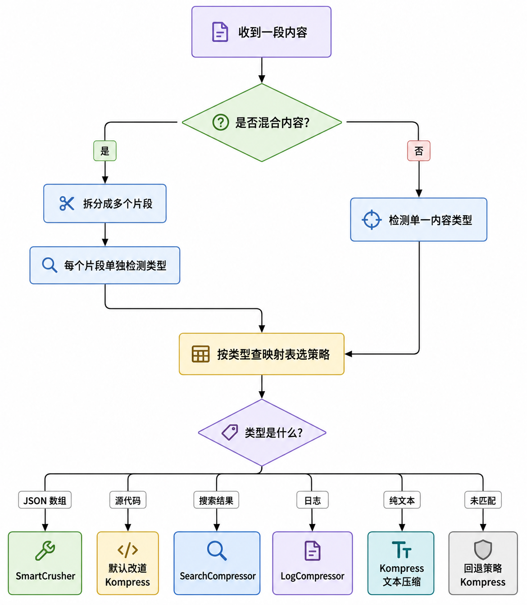

# 学习 Headroom 的压缩管线

在上一篇里，我们从架构的角度把 Headroom 的压缩层俯瞰了一遍：内容进来之后先经过 ContentRouter 分流，再交给三大压缩器处理，中间还夹着 CacheAligner 和一整套贯穿全流程的生命周期事件。那一篇讲的是各个模块的分工和位置，属于总览。

今天我们换个视角，钻进源码里，顺着一次 `compress()` 调用往下追，目标是把「入口函数收到一批消息之后，到底发生了什么」这条主线看清楚。我们从最外层的入口函数看起。

## compress() 入口

Headroom 对外暴露的最简单用法就是一个函数：`compress()`，它定义在 `headroom/compress.py` 里。不需要起代理、不需要写配置，把消息传进去，拿回压缩后的消息就行。函数签名如下：

```python
def compress(
    messages: list[dict[str, Any]],
    model: str = "claude-sonnet-4-5-20250929",
    model_limit: int = 200000,
    optimize: bool = True,
    hooks: Any = None,
    config: CompressConfig | None = None,
    **kwargs: Any,
) -> CompressResult:
    ...
```

几个参数值得留意：

* `messages`：一批消息，兼容 Anthropic 和 OpenAI 两种格式。
* `model` 和 `model_limit`：用于 token 计数和上下文窗口大小的判断，默认按 Claude Sonnet 的 20 万 token 上限算。
* `optimize`：是否真的压缩。传 `False` 会原样返回，方便做 A/B 对照（同一批消息，一边压一边不压，比较效果）。
* `config` 和 `**kwargs`：压缩选项，后者是前者的字段简写。先用传进来的 `config`（没有就取默认值），再拿 `**kwargs` 里对得上字段名的键去覆盖它。也就是说 `compress(messages, protect_recent=0)` 这种写法，等价于构造一个 `CompressConfig(protect_recent=0)`。

### CompressConfig：压缩到什么程度

`CompressConfig` 是面向用户的压缩选项，控制「压什么、压多狠、用哪个模型」。它是一个 dataclass，几个默认值透露了 Headroom 的取向：

```python
@dataclass
class CompressConfig:
    compress_user_messages: bool = False       # 默认不压用户消息
    compress_system_messages: bool = True      # 默认压系统消息
    protect_recent: int = 4                    # 最近 4 条消息不动
    protect_analysis_context: bool = True      # 检测到分析/评审意图时保护代码
    target_ratio: float | None = None          # 保留比例，None = 模型自己决定
    min_tokens_to_compress: int = 250          # 短于 250 token 的消息跳过
    kompress_model: str | None = None          # 文本压缩模型 ID
    savings_profile: str | None = None         # 命名的高压缩档位
```

> dataclass 是 Python 标准库提供的一种类写法，专门用来定义「主要用来装数据」的类。只要在类上加一个 `@dataclass` 装饰器，它就会按你声明的字段自动生成 `__init__`、`__repr__` 等方法，字段还能直接写默认值，省去手写字段赋值的样板代码。`CompressConfig` 这种纯配置类用它正合适。

这些字段大致分三组。第一组决定**压什么**：`compress_user_messages` 和 `compress_system_messages` 分别控制用户消息、系统消息要不要参与压缩；`protect_recent` 把最后 N 条消息保护起来不动，因为它们是当前对话的活跃部分；`protect_analysis_context` 更进一步，一旦识别出「分析」「评审」这类意图，就会把相关代码保护起来不压。

第二组决定**压多狠**：`target_ratio` 是 Kompress 的保留比例，设 `None` 就由模型自己定（默认激进，大约只留 15%）；`min_tokens_to_compress` 是参与压缩的最小 token 数，消息短于这个值就直接跳过，压缩本身有开销，太短不值得压。

第三组决定**用哪个模型、用哪套档位**：`kompress_model` 是文本压缩用的模型 ID，默认是作者训练的 `chopratejas/kompress-v2-base`，可以换成 HuggingFace 上其它针对特定领域的模型，设为 `'disabled'` 则彻底关掉 ML 压缩；`savings_profile` 则是一套预设好的高压缩档位，它定义在 `headroom/agent_savings.py`，一共四个：

| 档位 | 保留比例 | 压用户/系统消息 | protect_recent | 特点 |
| ---- | ---- | ---- | ---- | ---- |
| `agent-90` | 10% | 都压 | 2 | 最激进，强制走 Kompress，目标省 90%，面向 Codex/Claude/Cursor 这类 agent |
| `balanced` | 30% | 都不压 | 4 | 折中档，保护好用户和系统消息，目标省 70% |
| `coding` | 模型自定 | 都不压 | 2 | 代码负载档，不钉死比例，靠无损压缩和相关性出节省 |
| `general` | 模型自定 | 都不压 | 0 | 通用档，代码少，没什么位置性内容要保护 |

这四个档位分两路：`agent-90` 和 `balanced` 显式钉死了 `target_ratio`，直接规定保留多少；`coding` 和 `general` 不设这个比例，交给 Kompress 自己定，省多少主要看无损压缩和相关性过滤实际压掉多少。

从这些默认值能看出，Headroom 出厂时是按「包裹编程 agent」这个场景调的：用户自己的消息（`compress_user_messages=False`）和最近的 4 条对话（`protect_recent=4`）都保护起来不压，因为它们是当前正在处理的活跃上下文；真正拿来开刀的是那些塞了大段工具输出、日志、检索结果的历史消息。

### CompressResult：结果长什么样

压缩结果是另一个 dataclass，`CompressResult`：

```python
@dataclass
class CompressResult:
    messages: list[dict[str, Any]]          # 压缩后的消息，格式和输入一致
    tokens_before: int = 0                  # 压缩前 token 数
    tokens_after: int = 0                   # 压缩后 token 数
    tokens_saved: int = 0                   # 省下的 token 数
    compression_ratio: float = 0.0          # 省下的比例，0.35 表示省了 35%
    transforms_applied: list[str] = field(default_factory=list)  # 用过哪些变换
```

关键的一点是 `messages` 的格式和输入完全一样，你可以直接把它塞回原来的 LLM 客户端调用里，无需改任何别的代码。`transforms_applied` 记录了这次实际跑过哪些变换（transform），后面排查「为什么没压」的时候很有用。

### 拿到管线并执行

配置就绪后，`compress()` 做的核心动作只有几行：

```python
pipeline = _get_pipeline()
pipeline_extensions = PipelineExtensionManager(hooks=hooks, discover=False)

# ... 发出 INPUT_RECEIVED 事件、抽取用户查询 ...

result = pipeline.apply(
    messages=messages,
    model=model,
    model_limit=model_limit,
    context=context,
    biases=biases,
    compress_user_messages=cfg.compress_user_messages,
    compress_system_messages=cfg.compress_system_messages,
    target_ratio=cfg.target_ratio,
    protect_recent=cfg.protect_recent,
    # ... 把 CompressConfig 的字段透传给各个变换 ...
)
```

`CompressConfig` 里的字段在这里被摊平成一个个关键字参数，透传给管线，再由管线传给每个变换。这样每个变换都能看到「用户要不要压系统消息」「保护最近几条」这类全局意图。

执行完之后还有一道 **膨胀防护栏（inflation guard）** 值得注意：

```python
if tokens_after > tokens_before:
    logger.warning("Optimization inflated tokens (%d -> %d); reverting to original messages", ...)
    return CompressResult(
        messages=messages,
        # ...
        transforms_applied=["inflation_guard:reverted"],
    )
```

如果「压缩」之后 token 数反而变多了（比如插入的标记比省下的还多），就直接回退到原始消息，并在 `transforms_applied` 里打上 `inflation_guard:reverted` 标记。压缩层的底线是绝不能帮倒忙。整个 `apply()` 外面还包了一层 `try/except`，任何异常都会记一次失败指标，然后原样返回输入消息。

### _get_pipeline：懒加载的单例

`_get_pipeline()` 负责把管线装出来，它用的是**单例**（singleton，全进程只建一个实例）加线程锁的经典写法：

```python
def _get_pipeline() -> Any:
    global _pipeline
    if _pipeline is not None:
        return _pipeline
    with _pipeline_lock:
        if _pipeline is not None:
            return _pipeline
        from headroom.transforms import TransformPipeline
        # Default pipeline: CacheAligner → ContentRouter
        _pipeline = TransformPipeline()
        return _pipeline
```

管线只在第一次调用时创建，之后复用同一个实例。这样管线里的压缩器只需加载一次，比如初始化 Rust 核心和 ML 模型，后面的每次 `compress()` 调用都直接复用，不用重复付出加载开销。

## TransformPipeline 的编排顺序

管线的真身是 `headroom/transforms/pipeline.py` 里的 `TransformPipeline`。它的职责总结成一句话就是：按正确的顺序，把一串变换依次作用到消息上。默认装配哪些变换、什么顺序，由 `_build_default_transforms()` 决定：

```python
def _build_default_transforms(self) -> list[Transform]:
    transforms: list[Transform] = []

    # 0. 工具结果拦截器（默认关闭，需 opt-in）
    if getattr(self.config, "intercept_tool_results", False) or \
            os.environ.get("HEADROOM_INTERCEPT_ENABLED"):
        transforms.append(ToolResultInterceptorTransform())

    # 1. Cache Aligner（前缀稳定，用于缓存命中）
    if self.config.cache_aligner.enabled:
        transforms.append(CacheAligner(self.config.cache_aligner))

    # 2. 内容感知压缩：ContentRouter 处理所有内容类型
    transforms.append(ContentRouter())
    return transforms
```

默认顺序就是注释里写的两步：先 `CacheAligner`，再 `ContentRouter`。顺序不能乱，`CacheAligner` 必须在前，因为它要在内容被改动之前先检查前缀的稳定性。

> 从代码里可以看到，管道最前面还有一个工具结果拦截器，默认关着，要靠环境变量或配置显式打开，它是专门针对「工具结果」的一类可插拔重写器。它和后面那些通用压缩器思路不同：通用压缩器拿到什么内容就压什么，拦截器则是按「这是哪个工具的返回」来匹配，命中了才对这个工具的结果做定制化的改写。目前仓库里只有一个具体实现：ast-grep 拦截器（`astgrep.py`），它匹配 Claude Code 的 `Read` 工具，当读出的是个代码文件且足够大时，调用 ast-grep 把整份文件内容替换成一份函数级大纲，只留每个顶层函数和类的签名、将函数体省略掉。

### apply：逐个变换跑一遍

`TransformPipeline.apply()` 是真正干活的地方。剥掉计时、追踪、日志之后，主循环很简洁：

```python
for transform in self.transforms:
    if not transform.should_apply(current_messages, tokenizer, **kwargs):
        continue
    try:
        result = transform.apply(current_messages, tokenizer, **kwargs)
    except Exception:
        self._breaker_record_failure()
        raise
    current_messages = result.messages
    all_transforms.extend(result.transforms_applied)
    # ... 累积标记、警告、计时 ...
```

每个变换调用前先被问一句 `should_apply()`，如果条件不满足就跳过，满足了才 `apply()`，输出的消息再喂给下一个变换。所有变换用过的记录都累积到 `all_transforms` 里，最后进 `CompressResult.transforms_applied`。

这里还藏着一个**熔断器（circuit breaker）**：

```python
self._breaker_threshold = _breaker_env("HEADROOM_PIPELINE_BREAKER_THRESHOLD", 3, int)
self._breaker_cooldown_s = _breaker_env("HEADROOM_PIPELINE_BREAKER_COOLDOWN_S", 60.0, float)
```

如果管线连续失败达到阈值（默认 3 次），熔断器就打开，在冷却窗口（默认 60 秒）内所有请求都原样透传、不再尝试压缩，避免每个请求都去重跑一遍注定失败的变换。窗口过后再自动恢复。有一次成功就把连续失败计数清零。

## ContentRouter：路由决策

`ContentRouter` 是整套压缩的核心分流器，代码在 `content_router.py`。它的任务是：分析一段内容，判断它是什么类型，然后交给最合适的压缩器。类型判断的第一步是内容检测：

```python
mixed = is_mixed_content(content)
detection = _detect_content(content)
strategy = self._determine_strategy(content)
```

`_detect_content()` 优先走 Rust 核心里的原生检测链（基于 **Magika**，Google 开源的一个用机器学习识别文件类型的小模型），在 Windows 上因为原生检测可能卡死，默认降级到纯 Python 的正则检测。检测的结果是一个内容类型，比如 JSON 数组、源代码、搜索结果、构建日志等等。

拿到类型之后，`_strategy_from_detection()` 用一张映射表把类型翻译成压缩策略：

```python
mapping = {
    ContentType.SOURCE_CODE: CompressionStrategy.CODE_AWARE,
    ContentType.JSON_ARRAY: CompressionStrategy.SMART_CRUSHER,
    ContentType.SEARCH_RESULTS: CompressionStrategy.SEARCH,
    ContentType.BUILD_OUTPUT: CompressionStrategy.LOG,
    ContentType.GIT_DIFF: CompressionStrategy.DIFF,
    ContentType.HTML: CompressionStrategy.HTML,
    ContentType.TABULAR: CompressionStrategy.TABULAR,
    ContentType.PLAIN_TEXT: CompressionStrategy.TEXT,
}
strategy = mapping.get(detection.content_type, self.config.fallback_strategy)

if (strategy == CompressionStrategy.CODE_AWARE
        and not self.config.prefer_code_aware_for_code):
    strategy = CompressionStrategy.KOMPRESS
```

映射表一目了然：JSON 数组走 SmartCrusher，搜索结果走 SearchCompressor，日志走 LogCompressor，git diff 走 DiffCompressor，纯文本走文本压缩。表里没匹配上的走 `fallback_strategy`，默认是 Kompress（作者训练的文本压缩模型）。

最后那个 `if` 值得注意：源代码本来映射到 `CODE_AWARE`，但因为默认配置里 `prefer_code_aware_for_code=False`，代码实际上被改道去了 Kompress。也就是说，默认情况下 Headroom 宁可让代码走通用文本压缩，也不轻易对代码做 **AST（抽象语法树）** 级别的改写，避免误伤。这一层的取舍我们留到下一篇讲三大压缩器时再展开。

上面说的是一段内容只属于一种类型的情况。如果一段内容里既有代码块、又有 JSON、还夹着散文，`is_mixed_content()` 会判定它是混合内容，走 `_compress_mixed()` 这条路：先用 `split_into_sections()` 把内容按代码围栏、JSON 块、搜索结果行拆成一段段带类型的片段，每段各自选策略压缩，最后再拼回去。这样一段图文并茂的工具输出里，代码归代码压、JSON 归 JSON 压，互不干扰。

```python
# headroom/transforms/content_router.py（精简）
def _compress_mixed(self, content, context, ...):
    sections = split_into_sections(content)   # 拆成带类型的片段
    for section in sections:
        strategy = self._strategy_from_detection_type(section.content_type)  # 每段各选策略
        compressed_content, ... = self._apply_strategy_to_content(
            section.content, strategy, context, ...)
        if section.is_code_fence and section.language:
            # 保留代码围栏标记，如 ```python
            compressed_content = f"```{section.language}\n{compressed_content}\n```"
        compressed_sections.append(compressed_content)
    return RouterCompressionResult(
        compressed="\n\n".join(compressed_sections),  # 拼回去
        strategy_used=CompressionStrategy.MIXED,
        ...)
```

整个路由决策的流程可以画成这样：



## CacheAligner：守住缓存前缀

`ContentRouter` 之前那一步是 `CacheAligner`，代码在 `cache_aligner.py`。要理解它，得先说清楚它守的是什么。

Anthropic、OpenAI 这些服务商都支持 **prompt 前缀缓存（prefix cache）**：如果两次请求的开头一大段内容一模一样，服务商可以复用上一次算好的 **KV cache（注意力机制里键值对的缓存，命中后这段内容几乎不重复计费）**，省钱又省时间。但缓存命中有个苛刻的前提：前缀必须逐字节稳定。只要系统提示词开头掺了一个会变的值，比如一个时间戳、一个会话 ID，缓存就会整段失效。

`CacheAligner` 的职责就是盯住这个隐患。在 Headroom 的早期版本中，它会去改写系统提示词，把动态内容抽出来重新插到别处。这个思路听上去挺顺：发模型之前先把易变内容摘掉，服务商缓存的就是干净前缀，下次再摘一次，不就命中了？但问题恰恰出在「摘」这个动作上。缓存命中的唯一标准是**两次转发出去的前缀逐字节一致**，而易变内容的位置、边界、和前后文字的关系并不固定，这次摘成这样、下次可能摘成那样，只要有一字之差缓存照样失效；把内容重新插到别处，插入的位置和格式又成了新的不稳定点。也就是说，越想靠中途改写在热区里制造稳定，越是在热区里不断制造新的字节变化，反而把缓存弄坏。源码里把这叫做违反了「缓存热区（系统提示词）绝不能被改动」的不变式，于是那条改写路径被彻底移除了。现在它是一个**纯检测器**：只发现问题、发警告，从不改消息。

> 正确的解法不是代理在中途帮你摘，而是从源头就别把易变内容放进系统提示词，把它挪到用户消息之类的地方。这样系统提示词天生就是逐字节稳定的，根本不需要谁来摘。所以 CacheAligner 检测到动态值时，给的是「把这些值挪出系统提示词」的建议，动手的决定权留给使用者。

检测的产物是 `VolatileFinding`（易变内容发现记录）：

```python
@dataclass(frozen=True)
class VolatileFinding:
    label: str      # 类型标签：uuid / iso8601 / jwt / hex_hash
    sample: str     # 截断后的样本，绝不记录完整内容
```

`detect_volatile_content()` 会把系统提示词切成 token 逐个分类，识别出四类易变内容：UUID、ISO 8601 时间戳、JWT 令牌、十六进制哈希。检测全程不用正则，而是靠结构化的解析器，比如用标准库的 `uuid.UUID` 去试解析、用 `datetime.fromisoformat` 去试时间戳，形状对得上才算数。一旦发现易变内容，就打印出一条警告信息：

```python
if all_findings:
    counts = {}  # 统计每类各多少个
    # ...
    msg_text = (
        f"CacheAligner: detected volatile content in system prompt "
        f"({counts_str}); cache prefix unstable. "
        "Move dynamic values out of the system prompt to recover cache hits."
    )
    warnings.append(msg_text)
    logger.warning(msg_text)
```

## 小结

这一篇我们跟着一次 `compress()` 调用，把 Headroom 压缩管线的主干走了一遍：

1. **入口 `compress()`**：解析 `CompressConfig`（默认按编程 agent 场景调，保护用户消息和最近 4 条），跑完管线拿到 `CompressResult`，中间有膨胀防护栏和异常兜底，绝不帮倒忙。
2. **`_get_pipeline()` 与 `TransformPipeline`**：懒加载的单例管线，默认顺序是 CacheAligner → ContentRouter。管线里还带连续失败熔断。
3. **`ContentRouter` 路由决策**：先检测内容类型（原生 Magika 链，Windows 降级到正则），再查映射表选压缩器；代码默认改道走 Kompress；混合内容拆片段分别压。
4. **`CacheAligner`**：一个纯检测器，用结构化解析（非正则）找出系统提示词里的 UUID、时间戳、JWT、哈希这类易变内容，发警告提示缓存前缀不稳，但从不改写提示词。

整体链路还是比较清晰的，至此，我们已经了解了「一段内容被送到哪个压缩器」这条路由主线，但每个压缩器内部到底怎么把 token 压下来，还没拆开。下一篇我们就深入三大压缩器：处理 JSON 的 SmartCrusher、AST 感知的 CodeAwareCompressor，以及跑在 Rust 核心里的 Kompress 文本压缩模型。

## 参考

* [Headroom GitHub 仓库](https://github.com/chopratejas/headroom)
* [Headroom 架构文档](https://headroom-docs.vercel.app/docs/architecture)
* [Headroom 压缩原理文档](https://headroom-docs.vercel.app/docs/how-compression-works)
* [SmartCrusher 文档](https://headroom-docs.vercel.app/docs/smart-crusher)
* [代码压缩文档](https://headroom-docs.vercel.app/docs/code-compression)
* [Kompress-v2-base 模型卡](https://huggingface.co/chopratejas/kompress-v2-base)