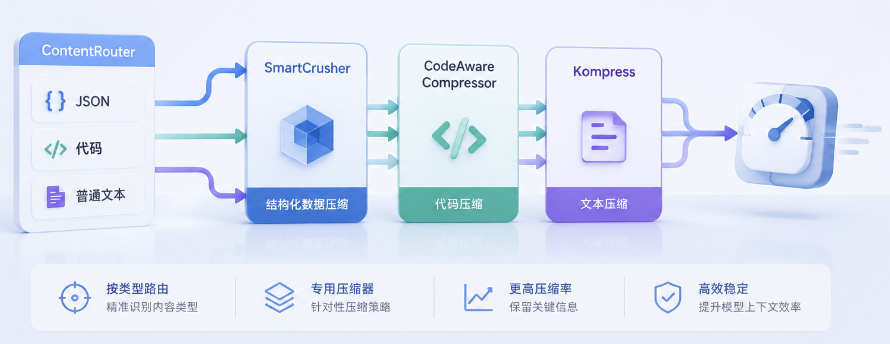
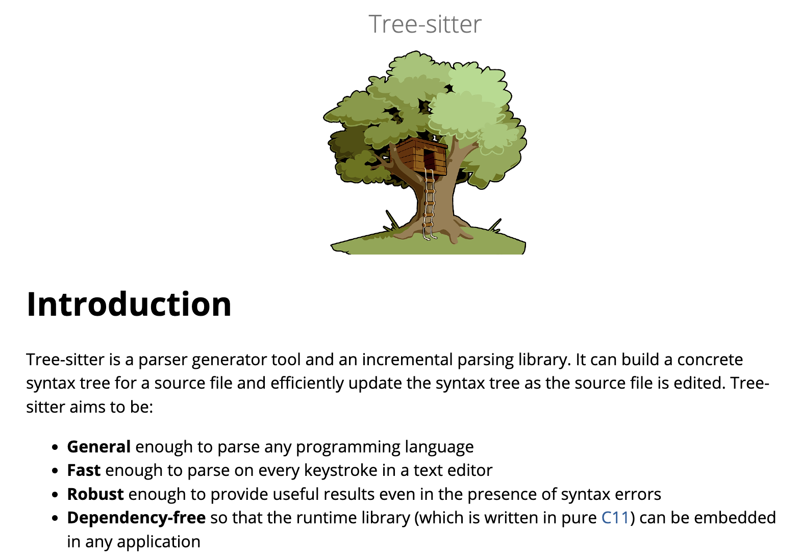
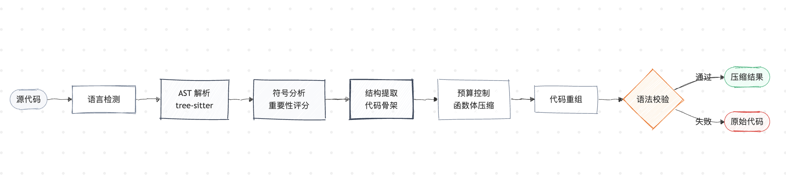

# 学习 Headroom 的三大压缩器

在上一篇中，我们跟着 `compress()` 走完了整条压缩管线。当时看到 `ContentRouter` 会先识别一段内容到底是 JSON、代码还是普通文本，再把它交给对应的压缩器处理。这三类文本对应的压缩器分别是 `SmartCrusher`、`CodeAwareCompressor` 和 `Kompress`，今天我们就来逐个学习下这三大压缩器。



## SmartCrusher：统计式压缩 JSON 数组

工具调用返回的内容里，最常见的一种形态是一个很长的 JSON 数组，每个元素结构都差不多。比如调用一个 API 接口拉回来的一批记录，或者 Docker 的 JSON 日志一行一个对象，每条都是同一套字段。模型真正需要的往往是头部几条和尾部几条，中间几十条高度雷同的记录既占 token，又没带来新信息。`SmartCrusher` 做的就是统计这个数组的结构规律，保留最有代表性的若干条，把其余的丢进 **CCR（Compress-Cache-Retrieve，可逆压缩）**缓存。

这个压缩器的 Python 实现已经在最新版本中整个搬到了 Rust。打开 `smart_crusher.py`，文件顶部有一行注释：所有数组压缩现在都走 `headroom._core.SmartCrusher`，也就是从 `crates/headroom-py` 编译出来的 Rust 扩展。Python 侧只留下了配置类和一层薄薄的转发。所以要讲清它的工作原理，得直接看 Rust 那边的实现。

### 按数组分类选压缩策略

`SmartCrusher` 不是一上来就压，它先让一个分析器把这个数组摸清楚。具体的做法是把数组里所有项的字段名合并起来，逐个字段统计一遍，给每个字段算一份 `FieldStats`。这份统计大致长这样：

```rust
// crates/headroom-core/src/transforms/smart_crusher/types.rs（精简）
pub struct FieldStats {
    pub field_type: String,        // numeric / string / boolean / object / array
    pub count: usize,              // 这个字段出现了多少次
    pub unique_count: usize,       // 有多少个不同的值
    pub unique_ratio: f64,         // 不同值占比 = unique_count / count
    pub is_constant: bool,         // 是不是所有项都一样
    // 数值字段专有：min_val / max_val / mean_val / variance / change_points
    // 字符串字段专有：avg_length / top_values（按频率排的高频值）
}
```

可以看出统计的维度挺有讲究：`unique_ratio` 看一个字段的取值有多「重样」，比如日志的 level 字段翻来覆去就 INFO、ERROR 几个值，这个比例就很低；而 message 字段每条都不太一样，比例就高。数值字段额外记方差和**变化点**（数值突然跳变的位置），字符串字段额外记平均长度和最高频的几个值。

统计完每个字段，下一步把这些 `FieldStats` 翻译成这个数组「是什么类型」：

- 有时间戳字段、数值字段又有方差的，是 `time_series`；
- 同时存在一个高基数的文本字段（像 message）和一个低基数的级别字段（像 level）的，是 `logs`；
- 有字段被判定为「像分数」的，是 `search_results`；
- 都不沾边的，归为 `generic`

认完类型，`select_strategy` 再据此选对应的压缩策略：

```rust
// crates/headroom-core/src/transforms/smart_crusher/analyzer.rs（精简）
pub fn select_strategy(&self, field_stats, pattern, item_count, ...) -> CompressionStrategy {
    if item_count < self.config.min_items_to_analyze {
        return CompressionStrategy::None;        // 数组太短，不压
    }
    if pattern == "time_series" && has_change_points {
        return CompressionStrategy::TimeSeries;  // 时间序列，盯变化点
    }
    if pattern == "logs" && message_field.unique_ratio < 0.5 {
        return CompressionStrategy::ClusterSample; // message 字段大量重复 → 聚类
    }
    if pattern == "search_results" {
        return CompressionStrategy::TopN;        // 搜索结果 → 取 top N
    }
    CompressionStrategy::SmartSample             // 通用数组 → 智能抽样
}
```

这个函数就是「类型 → 策略」的一张映射表，但有两个细节值得留意。一是它带前置门槛：数组元素太少（少于 `min_items_to_analyze`）直接返回 `None` 不压，不值得为一个短数组费这个劲。二是日志那档多加了一道确认：光认出 `logs` 类型还不够，还要 message 字段的 `unique_ratio < 0.5`（一半以上的值是重复的）才真的走聚类，因为聚类压的就是重复模板，如果 message 每条都不同，聚类就没意义了。认完类型、过完这些门槛，才知道该用哪种思路去挑要保留的项。

### 按策略挑出要保留的下标

归好类，就生成一个压缩计划 `CompressionPlan`。它的核心是一份 `keep_indices`，也就是要保留的原数组下标清单，但完整定义里还带了一些执行时要用的信息：

```rust
// crates/headroom-core/src/transforms/smart_crusher/types.rs
pub struct CompressionPlan {
    pub strategy: CompressionStrategy,           // 用哪种策略
    pub keep_indices: Vec<usize>,                // 要保留的原数组下标
    pub constant_fields: BTreeMap<String, Value>,// 所有项都相同的字段，可抽出来只留一份
    pub summary_ranges: Vec<(usize, usize, Value)>, // 被归纳成摘要的区间
    pub cluster_field: Option<String>,           // 日志聚类时按哪个字段分簇
    pub sort_field: Option<String>,              // 排序/取 top N 时按哪个字段
    pub keep_count: usize,                       // 保留多少条
}
```

`keep_indices` 是这份计划的主体，挑选它的信号有好几路：

* **搜索结果**（`TopN`）：数组里那个「像分数」的字段（比如每条命中自带的相关度分），按它从高到低排序、取前 N 条。注意这个分数是**数据自带的**，跟你当下查什么没关系，所以它只适合本身就有排序依据的搜索结果。
* **日志**（`ClusterSample`）：把内容模板相同的行聚成簇，日志往往同一句报错刷几十遍，只有时间戳在变，每个簇只留一条代表，其余的去掉，重复的刷屏就压掉了。
* **通用保底**：带报错词的行、取值异常稀有的行，强制保留。报错词是一份写死的清单（`error`、`exception`、`crash`、`timeout` 等十几个），只要一条里出现其中任何一个就保留。取值稀有针对的是另一类情况：有些异常不带 error 字样，比如一个状态码字段 95 次是 `ok`、只有 5 次是各种错误码，这些低频值本身就说明不正常，含它们的行也要保留。两道兜底都是为了防止主策略（按相关性取 top N、聚类留代表）把最关键的报错和异常给淘汰掉。
* **查询相关性**：这一路会看查询上下文（也就是用户当前的问题），先拿它做确定性的关键词精确匹配，再用一个**相关性打分器**给每条和这句话的相关程度打个分，超过阈值就保留。这个打分器是「BM25 关键词匹配 + 向量语义相似度」的混合：BM25 看共享多少关键词，向量看语义上有多接近，两者按权重融合，遇到 UUID、ID 这类需要精确匹配的查询还会自动调高关键词的权重。它是**叠加**在前面所有策略上的，让最终的保留清单向你当前关心的问题倾斜。
* **位置锚点**：保留头部、尾部各一小部分，保证开头结尾总有代表。

这几路信号挑出来的下标合并去重，就是最终保留的那批。所以 SmartCrusher 不是简单地「掐头去尾、中间全删」，真正的核心是先认类型，再按类型用相关性打分、聚类、异常检测这些手段选出最有代表性的若干条，头尾那部分只是其中一路保底。

### 生成 CCR 标记

挑出要丢的行之后，还不能一删了之。`crush_array` 末尾会把**完整的原数组**序列化一次、算出哈希、存进 CCR 缓存，然后生成一个指向这个哈希的标记：

```rust
// crates/headroom-core/src/transforms/smart_crusher/crusher.rs（精简）
let dropped_count = items.len() - result.len();
if dropped_count > 0 && self.config.enable_ccr_marker {
    let canonical = canonical_array_json(items);   // 完整原数组
    let h = hash_canonical(&canonical);
    let marker = format!("<<ccr:{h} {dropped_count}_rows_offloaded>>");
    if let Some(store) = &self.ccr_store {
        store.put(&h, &canonical);                 // 原文按哈希存进缓存
    }
    // marker 会被放进输出，模型凭它把原文取回来
}
```

这个 `<<ccr:HASH N_rows_offloaded>>` 标记就是可逆的关键：原文按哈希存在本地，模型之后发现信息不够，拿这个哈希就能把丢掉的那 N 行原样取回来。

### 压前 vs 压后

举个直观的例子。假设一次日志查询返回了这样一个数组（这里精简到 4 条示意，实际可能是几十上百条）：

```json
[
  {"ts": "10:00:01", "level": "INFO", "msg": "worker started"},
  {"ts": "10:00:02", "level": "INFO", "msg": "worker started"},
  {"ts": "10:00:03", "level": "INFO", "msg": "worker started"},
  {"ts": "10:04:59", "level": "ERROR", "msg": "connection refused"}
]
```

`SmartCrusher` 去重、抽样之后，可能得到：

```json
[
  {"ts": "10:00:01", "level": "INFO", "msg": "worker started"},
  {"ts": "10:04:59", "level": "ERROR", "msg": "connection refused"},
  {"_ccr_dropped": "<<ccr:a1b2c3d4e5f6 2_rows_offloaded>>"}
]
```

可以看到，输出仍然是原数组里的元素，schema 完全没变。中间两条重复的 `INFO` 被丢掉了，末尾多出来一个 `_ccr_dropped` 哨兵对象，它不是真正的记录，只是给模型看的一个提示：这里省了 2 行，需要的话可以用 CCR 取回。文件里还专门提供了 `strip_ccr_sentinels` 函数，方便下游遍历数组时把这个哨兵过滤掉，免得当成正常记录处理。

官方给出的一组真实压缩基准里，代码搜索场景（100 条结果）从 17,765 token 压到 1,408，省了 92%；SRE 事故排查场景从 65,694 压到 5,118，同样是 92%。这类高度结构化、大量重复的数组，正是 `SmartCrusher` 最擅长的场景。

## CodeAwareCompressor：AST 感知的代码压缩

第二位处理的是源代码。代码和 JSON 数组不一样，它有严格的语法，随便截断几行就可能变成一段无法解析的乱码。`CodeAwareCompressor` 的核心承诺是：压缩后的代码一定仍然是**语法有效**的。它的做法是先把代码解析成 **AST（抽象语法树）**。然后保留 import 语句、函数签名和类型注解这些结构性骨架，只压缩函数体内部的实现细节，最后再拼回一段合法代码。

这套思路参考了一篇叫 [LongCodeZip](https://arxiv.org/abs/2510.00446) 的论文（ASE 2025），它专门解决代码的长上下文压缩。通用的文本剪枝方法（比如 LLMLingua）不理解代码的结构和依赖，效果有限，LongCodeZip 则按代码的结构来压。做法是分两阶段：先做**粗粒度**，把代码按函数切成块，用「相对你的指令的条件困惑度」给每个函数打分、只留和任务最相关的函数；再做**细粒度**，把留下的函数体内部再切成更小的块，按 token 预算挑出最相关的子集。论文报告在不掉任务表现的前提下最高能压到 5.6 倍。

`CodeAwareCompressor` 保留签名、按重要性分配函数体预算，和它是同一路数，只不过落地时换成了 [tree-sitter](https://github.com/tree-sitter/tree-sitter) 静态解析，不用真的去跑困惑度。tree-sitter 是一个增量式的代码解析库，能把多种语言的源代码解析成统一的语法树结构，很多编辑器用它来做语法高亮和代码折叠。



`code_compressor.py` 的整体流程可以画成一张图：



### 用数据表描述每种语言

`CodeAwareCompressor` 支持不少的编程语言：第一梯队是 Python、JavaScript、TypeScript，第二梯队还有 Go、Rust、Java、C、C++ 和 Perl。要为这么多语言各写一套抽取逻辑，代码会非常臃肿。Headroom 的做法是把每种语言的差异抽成一张数据表 `LangConfig`，让同一套通用逻辑去查表：

```python
@dataclass(frozen=True)
class LangConfig:
    import_nodes: frozenset[str]      # 哪些 AST 节点算 import
    function_nodes: frozenset[str]    # 哪些算函数定义
    class_nodes: frozenset[str]       # 哪些算类定义
    type_nodes: frozenset[str]        # 哪些算类型定义
    body_node_types: frozenset[str]   # 哪些算函数体
    comment_prefix: str               # 注释前缀，Python 是 #，C 系是 //
    uses_colon_after_signature: bool  # Python 签名后跟冒号，C 系跟花括号
    # ...
```

以 Python 为例，它的配置就是把 `import_statement`、`function_definition`、`class_definition` 这些 tree-sitter 节点类型分门别类填进去。结构抽取时只有一个通用的 `visit` 访问器遍历语法树，遇到某个节点就查 `LangConfig` 判断它属于哪一类，完全不需要为每种语言重复写方法。

### 压缩函数体

压缩的关键在 `_compress_function_ast`。它拿到一个函数节点后，先从 AST 里精确定位函数体，再按分配到的行数预算保留若干条完整语句：

```python
# 按 AST 里的语句逐条保留，绝不从表达式中间切断
for start_row, end_row in body_stmts:
    stmt_lines = code_lines[start_row : end_row + 1]
    stmt_line_count = len(stmt_lines)
    # 加上这条就超预算，且已经留了至少一条，就停在这里
    if kept_line_count + stmt_line_count > body_limit and stmts_kept > 0:
        break
    kept_lines.extend(stmt_lines)
    kept_line_count += stmt_line_count
    stmts_kept += 1
```

这里的关键设计是**按语句而不是按行截断**。它遍历的是 AST 里的语句节点，每一个都是完整、合法的语句，保留到预算用完为止。这样无论砍到哪里，剩下的代码都能正常解析，不会出现半句 `if` 或者没闭合的括号。

每个函数保留多少行，不是平均分配的，而是由 `_analyze_symbol_importance` 打分决定。这个方法综合了几个信号：一个符号被引用了多少次、它调用了多少别的函数（扇出）、它是不是公开符号、名字是否命中了当前查询的上下文。被引用得多、和查询相关的函数，会分到更多的行数预算，实现细节保留得更完整；边角料函数则可能只剩个签名。

docstring（文档字符串）默认走 `FIRST_LINE` 模式，多行 docstring 只保留第一行摘要并正确闭合引号，剩下的说明文字全部压掉。

### 三道安全阀

`compress()` 方法里有三处保护，任何一处不满足都会**原样退回**，绝不输出坏代码：

- **语法校验**：拼回代码后再用 tree-sitter 解析一遍，只要出现 ERROR 或 MISSING 节点就退回原文。
- **过度压缩保护**：如果压缩比低于 0.05（也就是只剩 5% 不到），判定为压得太狠、可能丢了数据，退回原文。
- **异常兜底**：AST 压缩过程中抛任何异常，都退回原文或转交 Kompress。

### 压前 vs 压后

用一个 Python 函数来感受一下（仿照源码顶部的示例，docstring 扩充成了多行）：

```python
import os
from typing import List

def process_data(items: List[str]) -> List[str]:
    """Process a list of items.

    Each item is validated and, when non-empty, normalized by
    stripping whitespace and lowercasing. Invalid (falsy) items
    are skipped. The normalized items are collected in order
    and returned as a new list.
    """
    results = []
    for item in items:
        # Validate item
        if not item:
            continue
        # Process valid item
        processed = item.strip().lower()
        results.append(processed)
    return results
```

压缩后变成：

```python
import os
from typing import List

def process_data(items: List[str]) -> List[str]:
    """Process a list of items."""
    # ... (body compressed: 10 lines → 2 lines)
    pass
```

import 一行不动，函数签名连同类型注解 `List[str]` 完整保留，多行 docstring 只留了第一行摘要、后面那段详细说明被压掉了，函数体那一大段实现也只剩一行占位注释。对于一次代码检索返回的多个文件，模型光看签名和类型往往就够判断该看哪个函数了；真要深入某个函数的实现，再通过 CCR 把原文取回来即可。压缩显著时，`CodeAwareCompressor` 还会在末尾追加一条注释，写明省了多少 token、CCR 的 hash 是多少、多久过期。

## Kompress：跑在本地的 ModernBERT 压缩模型

前两个压缩器面对的都是结构清晰的内容：JSON 有 schema，代码有语法。可现实里还有大量没有明显结构的文本，比如报错栈、RAG 检索回来的文档片段、大段的对话记录。这类内容 `SmartCrusher` 和 `CodeAwareCompressor` 都使不上劲，这时就该 `Kompress` 上场了。

`Kompress` 是作者专门训练的一个文本压缩模型，托管在 HuggingFace 上，模型 ID 是 `chopratejas/kompress-v2-base`。和前两个基于规则的压缩器不同，它是一个真正的神经网络模型，逐个 token 判断该保留还是丢弃。

### 双头 ModernBERT

`Kompress` 是在一个叫 ModernBERT 的开源模型之上实现的，先简单认识一下这个模型。

[ModernBERT](https://github.com/AnswerDotAI/ModernBERT) 是 Answer.AI 团队（联合 LightOn 等）在 2024 年底发布的 BERT 现代化版本，论文叫《Smarter, Better, Faster, Longer》。相比 2018 年的原版 BERT，它把后来主流大模型的不少新技术搬了过来：用 RoPE 旋转位置编码替换了老式绝对位置编码，原生支持 8192 token 的上下文（是 BERT 512 的 16 倍），长文本处理速度是同级编码器的两三倍，还首次把代码数据纳入预训练，所以在代码相关任务上格外强。这些特点对 Kompress 很关键：日志、文档动辄几千 token，上下文不够长就放不下；压缩又跑在代理热路径上，速度慢了会拖垮请求。Kompress 用的 `base` 版有 1.49 亿参数，每个 token 的向量维度是 768。

它是一种**编码器模型**，作用是读完一段文字后，给里面每个 token 都算出一个向量，这个向量捕捉的是这个 token 在上下文里的含义。比如 `apple` 在「吃了一个 apple」和在「apple 发布了新手机」里，算出来的向量是不一样的，因为模型看了它前后文。这一步解决的是「理解」：模型由此知道每个 token 在当前语境里是什么意思。

但理解归理解，这些向量本身只是一堆数字，还没回答「这个 token 要不要留」。要回答这个问题，需要在编码器的输出之上再接一个判断层，也就是所谓的**头（head）**。头本身不大，就是把 768 维的 token 向量映射成你想要的答案，具体用什么层随任务而定。以 Kompress 的 token 头为例，它是一个 768 → 2 的线性层：把某个 token 的向量乘上一个学好的权重矩阵，输出「该丢」「该留」两个得分，比一下大小就有了去留。训练时，骨干（ModernBERT）和头一起被优化：给模型看成堆标注好「哪些 token 该留」的文本，不断调整权重，直到头的判断越来越准。之所以叫「头」，是相对于「骨干」而言的，骨干负责通用的语言理解、可以原样复用，换任务时往往只需换掉或新训顶上这个小小的头，不必重训整个大模型，这是迁移学习里常见的做法。

Kompress 正是拿 ModernBERT 当骨干负责理解，再在顶上接两个这样的头，所以叫「双头」。

### Kompress 源码解读

打开 `kompress_compressor.py`，模型结构定义在 `HeadroomCompressorModel` 里：

```python
class HeadroomCompressorModel(nn.Module):
    """Dual-head ModernBERT: token classification + span importance CNN."""

    def __init__(self, model_name="answerdotai/ModernBERT-base"):
        super().__init__()
        self.encoder = AutoModel.from_pretrained(model_name, ...)  # 加载 ModernBERT
        hidden_size = self.encoder.config.hidden_size  # 向量维度 768，两个头都以它为输入

        # 头 1：768 → 2 的线性层，逐 token 输出「该丢」「该留」两个得分
        self.token_head = nn.Linear(hidden_size, 2)

        # 头 2：一维卷积，评估一小段连续区域的重要性
        self.span_conv = nn.Sequential(
            # 每次看 5 个相邻 token，提取 256 个局部特征；padding 保证输出与输入等长
            nn.Conv1d(hidden_size, 256, kernel_size=5, padding=2),
            nn.GELU(),  # 非线性激活，否则两层卷积等价于一层
            # 窗口收窄到 3，把 256 个特征聚成每个位置 1 个重要性分
            nn.Conv1d(256, 1, kernel_size=3, padding=1),
            nn.Sigmoid(),  # 压进 0~1，变成可直接跟阈值比较的分数
        )
```

这两个头分工不同。**token 头**看的是单个 token：把某个 token 的 768 维向量映射成两个数，分别代表「该丢」和「该留」的得分，比较一下大小就知道这个 token 去留。**span 头**看的是一小段连续区域：用两层一维卷积把相邻 token 的向量扫一遍，输出一个 0 到 1 之间的分数，表示「这一整片内容重不重要」。为什么用两层而不是一层？这是因为一层卷积只是对窗口内几个 token 做线性加权，学不会需要组合特征才能识别的复杂模式；先展开成 256 个特征通道、配上非线性再聚合，才有能力先提取局部特征、再据此打分。

> 一维卷积（Conv1d）可以理解成一个在序列上滑动的「小窗口」。它拿一个固定宽度的窗口，从文本开头往结尾一格一格地滑，每滑到一个位置，就把窗口里那几个相邻 token 的向量合在一起算出一个值。和线性层只看单个 token 不同，卷积这个窗口一次看好几个相邻的 token，所以它捕捉的是「这一小片」的局部特征，而不是孤立的某个词。窗口宽度由 `kernel_size` 决定，Kompress 的 span 头第一层窗口是 5、第二层是 3，两层叠起来，输出每个位置实际覆盖前后共 7 个 token。

那为什么要两个头呢？一个不够吗？关键在「拿不准」的情况。模型对很多 token 的去留其实很纠结，单独看它，留也行丢也行。这时候光看单个 token 容易误删，span 头提供的就是一个「看大局」的补救：如果某个 token 处在边界地带（保留概率在 0.3 到 0.5 之间、模棱两可），但它所在的这一片被 span 头判为重要（得分超过 0.5），那就宁可把它留下来。实际的判定逻辑就一行：

```python
# kompress_compressor.py（精简）
keep = token_keep | (borderline & span_boost)
# token_keep：token 头明确说留
# borderline：这个 token 模棱两可（保留概率 0.3~0.5）
# span_boost：它所在的片段被判为重要（span 得分 > 0.5）
```

翻译过来就是：**token 头明确说留的留；模棱两可、但所在片段重要的，也留。** 其余的就丢掉。这样单个 token 判断的「细」和片段判断的「稳」就互补上了，不容易因为某个 token 单独看不显眼就把它误删，从而把一整句关键信息拆断。

### 必留 token 的硬性保险

光靠模型打分还不够。有些 token 一旦丢掉，模型**没法从剩下的文本里推断出来**，比如具体的数字、错误码、文件路径等，这样的值丢了，看上下文是猜不回来的。虽然 CCR 缓存着原文，但模型得先意识到自己缺了关键信息才会去取回，而这类精确值被悄悄丢掉时往往连个缺口都看不出来，所以不能指望 CCR 兜底。`kompress_compressor.py` 用一条正则定义了这些**必留 token**：

```python
_KOMPRESS_MUST_KEEP_RE = re.compile(
    r"\b0x[0-9A-Fa-f]+\b"                 # 十六进制地址：0x7fff2038
    r"|(?<![\w.])\d+(?:\.\d+)?(?![\w.])"  # 独立数字：42、3.14
    r"|[A-Z_]{2,}"                        # 全大写：SIGILL、EOF、ERROR
    r"|[a-z_][a-z0-9_]*\.[a-z0-9_]+"      # 带点路径：libsystem_kernel.dylib
    r"|/[a-z0-9/._-]{2,}"                 # unix 路径：/usr/lib/python3.so
    r"|--?[a-z][\w-]*"                    # 命令行 flag：--verbose、-n
    # ...
)
```

不管模型给这些 token 打多低的分，`_add_kompress_must_keep_words` 都会强行把它们保留下来。这是一道防止模型误伤关键信息的硬性保险。

### 压前 vs 压后

Kompress 的压缩是词级别的丢弃。比如这样一句啰嗦的报错描述：

```
The application process crashed with signal SIGILL at address 0x7fff2038 in libsystem_kernel.dylib
# 应用进程因信号 SIGILL 在地址 0x7fff2038 处崩溃，位置在 libsystem_kernel.dylib
```

模型判断后可能压成：

```
crashed signal SIGILL address 0x7fff2038 libsystem_kernel.dylib
# 崩溃 信号 SIGILL 地址 0x7fff2038 libsystem_kernel.dylib
```

`The`、`with`、`at`、`in` 这些没有信息量的虚词被丢掉了，而 `SIGILL`（全大写命中必留规则）、`0x7fff2038`（十六进制地址）、`libsystem_kernel.dylib`（带点路径）这些排查问题真正要用的 token 一个都没少。虽然读起来不再是通顺的句子，但模型需要的语义信息完整保留。压缩显著时，Kompress 同样会追加一条 CCR 提示，注明原文可以取回。

## 其余几个压缩器

`SmartCrusher`、`CodeAwareCompressor`、`Kompress` 是分工最重的三个压缩器，但 `ContentRouter` 的映射表里还挂着另外几个针对特定内容形态的压缩器，同样在 `headroom/transforms/` 下。它们都是各自领域的一套专门规则，简单认识一下：

* **LogCompressor**（`log_compressor.py`）：对付运行日志和构建输出。日志的特点是大量重复模板和刷屏的 INFO，它按行解析、识别日志级别和格式，把重复的堆栈、刷屏的常规行压掉，留下报错和关键状态。
* **DiffCompressor**（`diff_compressor.py`）：对付 `git diff` 的输出。diff 里真正要紧的是改了哪些文件、增删了哪些关键行，它把无关的大段上下文折叠，保留变更的骨架。
* **SearchCompressor**（`search_compressor.py`）：对付 `grep`、`ripgrep` 这类命令行搜索的纯文本结果，把命中按文件聚合、去掉冗余，而不是按 JSON 数组处理。
* **TextCrusher**（`text_crusher.py`）：大段纯文本的快速确定性压缩。它是 Kompress 之外的另一条路，不走神经网络，而是用 BM25 相关性给句子打分、再去掉近似重复的片段，抽取式地保留原句（不改写），毫秒级就能跑完，适合请求路径上不能等 Kompress 那种大模型推理的场合。
* **TabularIngest**（`tabular_ingest.py`）：CSV、TSV、markdown 表格这类文本本身没有对应的压缩器，直接走 Kompress 会破坏它的行列结构，所以它先把表格文本解析成 JSON 记录数组，再交给现成的 `SmartCrusher` 处理。
* **HTMLExtractor**（`html_extractor.py`）：处理网页抓取回来的 HTML。严格说它做的是「抽取」而非「压缩」，把正文从导航、页脚、脚本这些结构性噪音里剥离出来，丢掉的是不相关的整块，而不是逐个 token。

## 小结

今天我们详细地学习了 Headroom 的三大压缩器：

1. **SmartCrusher**：面向 JSON 数组的统计式压缩器，去重加头尾抽样，输出严格保持原 schema，计算已整个搬进 Rust，对高度重复的结构化数据能压到 90% 以上。
2. **CodeAwareCompressor**：基于 tree-sitter 把代码解析成 AST，用一张数据表适配九种语言，保留 import、函数签名和类型注解，按语句压缩函数体，并用语法校验、过度压缩保护、异常兜底三道安全阀保证绝不输出坏代码。
3. **Kompress**：作者训练的双头 ModernBERT 模型，逐 token 判断保留与丢弃，用必留正则守住数字、错误码、路径等关键信息，首次使用时后台下载、本地推理。
4. **其余压缩器**：LogCompressor 压日志、DiffCompressor 压 git diff、SearchCompressor 压命令行搜索结果、TextCrusher 用 BM25 快速压纯文本、TabularIngest 把表格文本桥接给 SmartCrusher、HTMLExtractor 抽取网页正文，各自守着一种特定的内容形态。

所有的压缩器共用同一套路由和 CCR 机制：由 `ContentRouter` 按内容类型分发到对应的一个，丢掉的原文一样进 CCR 缓存、可以取回，保证压缩不是有去无回。

关于 CCR 的完整机制，也就是原文怎么缓存、模型怎么用 `headroom_retrieve` 把它取回来，以及 Headroom 怎么在 Claude、Codex、Gemini 这些不同 agent 之间共享一份压缩过的记忆，我们下一篇继续。

## 参考

* [Headroom GitHub 仓库](https://github.com/chopratejas/headroom)
* [SmartCrusher 文档](https://headroom-docs.vercel.app/docs/smart-crusher)
* [代码压缩文档](https://headroom-docs.vercel.app/docs/code-compression)
* [文本与日志压缩文档](https://headroom-docs.vercel.app/docs/text-and-logs)
* [Headroom 架构文档](https://headroom-docs.vercel.app/docs/architecture)
* [Kompress-v2-base 模型卡](https://huggingface.co/chopratejas/kompress-v2-base)
* [ModernBERT GitHub 仓库](https://github.com/AnswerDotAI/ModernBERT)
* [ModernBERT 论文：Smarter, Better, Faster, Longer](https://arxiv.org/abs/2412.13663)
* [论文 LongCodeZip：面向代码语言模型的长上下文压缩](https://arxiv.org/abs/2510.00446)
* [tree-sitter 代码解析库](https://github.com/tree-sitter/tree-sitter)
