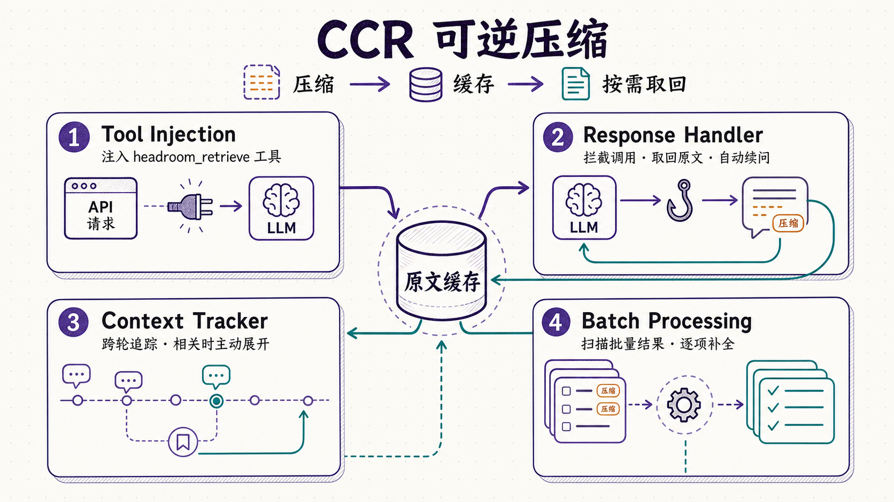
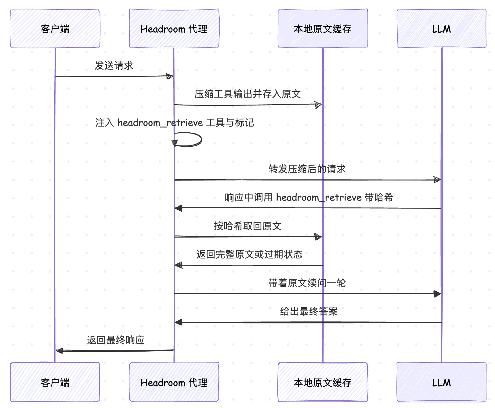
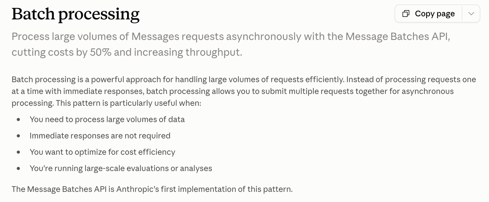

# 学习 Headroom 的 CCR 可逆压缩

在上一篇里，我们学习了 Headroom 的三大压缩器：处理 JSON 数组的 SmartCrusher、基于 tree-sitter 做 **AST（抽象语法树）** 感知的 CodeAwareCompressor，以及作者自训、在本地推理的文本压缩模型 Kompress。它们能把工具输出、日志、代码片段压掉一大半，token 随之骤减。

不过压缩到这一步，有个绕不开的问题：**压缩是会丢信息的**。SmartCrusher 把 100 条搜索结果压成 10 条，剩下的 90 条并没有进模型的上下文。万一模型看完这 10 条，发现真正想要的答案在第 47 条上，怎么办？如果没有补救手段，那压缩省下的 token 就是以「模型可能答错」为代价换来的。

Headroom 给这个问题的答案叫 **CCR（Compress-Cache-Retrieve，可逆压缩）**：压缩时把原文在本地缓存起来，同时告诉模型「你要是觉得不够，可以来取」。

## CCR 原理解析

要实现压缩的「可逆」，必须得靠两样东西：一是原文不丢，按一个哈希键存进本地缓存（Python 侧默认是 `~/.headroom/ccr_store.db` 这个 SQLite 库，Rust 侧还提供内存和 Redis 后端）；二是压缩产物里带上这个哈希键的标记，模型凭它知道「不够可以来取」。

标记的形态不止一种。标准格式是方括号这样的：

```
[100 items compressed to 10. Retrieve more: hash=a1b2c3d4e5f6a1b2c3d4e5f6]
```

上一篇 SmartCrusher 压 JSON 数组时用的是另一种行内标记，作为一个哨兵元素嵌在数组末尾：

```json
[
  {"ts": "10:00:01", "level": "INFO", "msg": "worker started"},
  {"ts": "10:04:59", "level": "ERROR", "msg": "connection refused"},
  {"_ccr_dropped": "<<ccr:a1b2c3d4e5f6 2_rows_offloaded>>"}
]
```

两种形态作用都一样：告诉模型原文在哪、怎么取。

模型如果只看压缩后的内容就够了，那什么都不用做，省下的 token 落袋为安；只有当它判断信息不够时，才拿着这个 `hash` 回来取原文。

CCR 模块的职责定义在 `headroom/ccr/__init__.py` 文件里，分成四块：

```python
# 1. Tool Injection: 压缩发生时，代理往请求里注入 headroom_retrieve 工具
# 2. Response Handler: 拦截响应，自动处理模型发起的 CCR 工具调用
# 3. Context Tracker: 跨轮追踪被压缩的内容，按需主动展开
# 4. Batch Processing: 处理批量 API 结果里的 CCR 调用
```



我们挨个看这四块，它们合起来覆盖了实时和异步两种场景下的完整取回链路。

### 注入 retrieve 工具

模型要能主动取原文，前提是它手里得有这么一个工具可用。这件事由 `tool_injection.py` 负责。它的核心是一个工具定义 `create_ccr_tool_definition`：

```python
CCR_TOOL_NAME = "headroom_retrieve"

# Anthropic 格式（OpenAI / Google 各有一份，字段结构略有不同）
{
    "name": CCR_TOOL_NAME,
    "description": (
        "Retrieve original uncompressed content that was compressed to save tokens. "
        "Use this when you need more data than what's shown in compressed tool results. "
        # 取回被压缩掉的原始内容。当压缩结果里的数据不够用时调用它。
    ),
    "input_schema": {
        "type": "object",
        "properties": {
            "hash": {"type": "string", "description": "Hash key from the compression marker"},
        },
        "required": ["hash"],
    },
}
```

工具只有一个参数 `hash`，也就是压缩标记里那串哈希。注入的时机由 `CCRToolInjector` 控制，它的 `scan_for_markers` 会扫一遍请求里的所有消息，用一组正则去匹配各个压缩器留下的标记：

```python
_marker_patterns = [
    # 标准格式: [N items compressed to M. Retrieve more: hash=xxx]（24 位十六进制哈希）
    re.compile(r"\[(\d+) \w+ compressed to (\d+)\. Retrieve more: hash=([a-f0-9]{24})\]"),
    # SmartCrusher 的行内标记: <<ccr:HASH ...>>（12~24 位）
    re.compile(r"<<ccr:([a-f0-9]{12,24})\b"),
    # ... 省略若干兼容旧格式的正则
]
```

扫到标记就说明这一轮里有压缩内容，`inject_tool_definition` 会把 `headroom_retrieve` 追加进请求的工具列表。这里有个容易忽略的细节：一旦某个会话用过一次 CCR，后续每一轮都会**粘性地**保留这个工具，哪怕当前轮没有新的压缩标记：

```python
def inject_tool_definition(self, tools, *, session_has_done_ccr=False):
    # session_has_done_ccr=True 时，即使本轮没有新标记也照样注入
    if not (session_has_done_ccr or self.has_compressed_content):
        return tools or [], False
    # 已经存在（比如来自 MCP server）就不重复注入
    for tool in tools or []:
        if (tool.get("name") or tool.get("function", {}).get("name")) == CCR_TOOL_NAME:
            return tools, False
    # ...
```

为什么要粘性保留？因为工具列表的字节一旦在会话中途变来变去，就会打破 Anthropic、OpenAI 的 **KV cache**，工具列表是缓存前缀的一部分，忽有忽无会让缓存整段失效。这一点和之前讲 CacheAligner 时是同一个考量：稳定前缀，让缓存真正命中。

### 拦截响应、自动取回

工具注入进去了，模型也调用了，可这个调用是发给谁的？模型以为它在调一个正常的工具，实际上这个工具由 Headroom 的代理自己兜住。这部分逻辑在 `response_handler.py` 的 `CCRResponseHandler` 里。

它的入口是 `handle_response`，拿到模型的响应后先判断里面有没有 CCR 调用，有就进入一个取回循环：

```python
async def handle_response(self, response, messages, tools, api_call_fn, provider="anthropic"):
    current_response = response
    current_messages = list(messages)
    rounds = 0
    while rounds < self.config.max_retrieval_rounds:   # 默认最多 3 轮
        ccr_calls, other_calls = self._parse_ccr_tool_calls(current_response, provider)
        if not ccr_calls:
            break                                       # 没有 CCR 调用，收工
        if other_calls:
            break                                       # 混了别的工具调用，交回客户端处理
        rounds += 1
        results = [self._execute_retrieval(call) for call in ccr_calls]  # 本地取原文
        current_messages.append(self._extract_assistant_message(current_response, provider))
        current_messages.append(self._create_tool_result_message(results, provider))
        current_response = await api_call_fn(current_messages, tools)     # 带着原文续问一轮
    return current_response
```

这个循环的意思是：模型说「我要 hash=abc 的原文」，handler 就去本地缓存把原文捞出来（`_execute_retrieval`），拼成一条工具结果消息，替模型把对话续上，再发一轮 API 请求。模型这轮拿到了完整原文，通常就能给出真正的答案。整个过程对最终客户端是透明的，客户端只会收到最后那条不带 CCR 调用的响应。

`_execute_retrieval` 有两个细节。一是取回按哈希整块取回，返回的是完整原文，不做二次筛选：

```python
entry = store.retrieve(ccr_call.hash_key)
if entry:
    content = json.dumps({
        "hash": ccr_call.hash_key,
        "original_content": entry.original_content,
        "original_item_count": entry.original_item_count,
    }, indent=2)
    return CCRToolResult(tool_call_id=..., content=content, success=True, ...)
```

二是缓存有 TTL 存活时长，过期就取不到了。这时 handler 会把失败状态原样返回给模型，让它知道这块内容已经不可用：

```python
if entry_status is not None and entry_status["status"] != "available":
    content = json.dumps({
        "error": format_retrieval_miss_detail(entry_status),
        "hash": ccr_call.hash_key,
        "status": entry_status["status"],       # 比如 expired
        "ttl_seconds": ...,
    }, indent=2)
    return CCRToolResult(..., success=False)
```

整条 CCR 取回流程串起来如下图所示：



还有一种边界情况处理得很谨慎：如果模型在同一轮里既调了 `headroom_retrieve`、又调了别的正常工具，handler 会直接跳出循环、交回客户端。因为一条 assistant 消息里的每个工具调用都要有配对的工具结果，而 handler 只有 CCR 那部分的结果，硬拼一个续问请求会得到非法的消息序列。

那交回客户端之后，`headroom_retrieve` 这个调用谁来兑现呢？其实客户端自己就能兑现。取回工具有两条分发渠道：一条是上面讲的代理注入、由 handler 在代理侧自动兑现；另一条是 **MCP server**，也就是第二篇里 wrap 注册的那个 `headroom` MCP 服务，它把 `headroom_retrieve` 作为真正的工具挂在客户端上。

> 流式响应（streaming）也有对应的 `StreamingCCRBuffer`，思路是先缓冲、扫到 CCR 调用就切换成非流式处理，取回后再把续写流式吐出去。这里不展开。

### 跨轮主动展开

前两块解决的是「模型主动来取」。但还有一种情况：早几轮压掉的内容，模型其实已经忘了它存在。比如第 1 轮搜索返回 100 个文件、压成了 10 个，到第 5 轮用户问「那认证中间件呢」，模型压根不知道 `auth_middleware.py` 曾经出现在那被压掉的 90 个里。`context_tracker.py` 就是来补这一环的。

`ContextTracker` 会把每次压缩事件记下来，包括哈希、发生在第几轮、压缩前后的条数、当时的查询上下文，还有一段样本内容用于后面做相关性匹配。等新一轮用户消息进来，`analyze_query` 会拿这条查询去和历史压缩内容算相关性，够高就主动把对应原文展开：

```python
def _calculate_relevance(self, query, context) -> float:
    query_words = set(self._extract_keywords(query.lower()))
    score = 0.0
    # 和样本内容的关键词重叠
    sample_words = set(self._extract_keywords(context.sample_content.lower()))
    if sample_words:
        score += len(query_words & sample_words) / len(query_words) * 0.5
        for word in query_words:                       # 长词命中额外加分
            if len(word) >= 4 and word in context.sample_content.lower():
                score += 0.2
    # 和当时查询上下文的关键词重叠
    # ... 省略
    return min(score, 1.0)
```

相关性算法本身是朴素的关键词重叠，加了几条加权：长词的精确子串命中额外给分、越旧的压缩内容按时间打折（`age_factor`）、超过 5 分钟的直接不考虑。超过阈值 `0.3` 的才会进推荐列表，每轮最多主动展开 2 条。

### 批量 API 里的取回

前面三块讲的都是实时请求：模型一响应，handler 当场拦截、当场续问。但还有一种调用方式不走这条路 —— **批量 API**，比如 Anthropic 的 [Message Batches API](https://platform.claude.com/docs/en/build-with-claude/batch-processing)、OpenAI 的 [Batch API](https://developers.openai.com/api/docs/guides/batch)、Gemini 的 [Batch API](https://ai.google.dev/gemini-api/docs/batch-api?hl=zh-cn) 等。



批量 API 的玩法是：客户端把 N 个请求打包成一个数组一次性提交，拿到一个 batch ID（类似一个任务号），之后拿它轮询，直到全部跑完，再一次性拉回 N 份结果。批量请求里的内容同样会被 Headroom 压缩，因此模型同样可能会发起 `headroom_retrieve` 调用。但这条链路和实时调用完全不同，根本不存在「模型响应回来、代理当场拦截」的那一刻，Response Handler 是专为实时调用写的，自然用不上。

`batch_processor.py` 的 `BatchResultProcessor` 就是补这个场景的，分两步配合。提交批量时，先把每个请求的上下文（消息、工具列表）按 batch ID 存进 `BatchContextStore`；等客户端拿 batch ID 把 N 份结果全部拉回来时，处理器先按 batch ID 取出存好的上下文，再逐份扫描，发现哪份里有 CCR 调用就对哪份动手：从本地缓存取回原文、拼上工具结果、发起续问调用（最多 3 轮），最后把这份只有工具调用、没有答案的半成品结果，替换成带完整答案的结果。

注意这个续问调用**不是再发起一次批量**，而是普通的实时调用：Anthropic 走 `/v1/messages`，OpenAI 走 `/v1/chat/completions`，Gemini 走 `generateContent`。道理很简单：N 份结果里带 CCR 调用的往往就那么几份，为这几份再排一次异步队列、再等一轮，远不如直接同步调用快。三个服务商的批量结果格式各不相同，但这套"检测 → 取回 → 续问 → 替换"的逻辑是完全一样的。

到这里，`ccr/__init__.py` 里说的四块就齐了：实时请求靠 Tool Injection 和 Response Handler，跨轮遗忘靠 Context Tracker，异步批量靠 Batch Processing。

## 小结

这一篇我们把 Headroom 的 CCR 可逆压缩读完了，四块组件都看完了：

1. **CCR 的原理**：压缩时原文不丢、按哈希缓存在本地，压缩产物带上标记，模型信息不够时凭哈希取回。传输有损，端到端无损。
2. **三个组件串成实时取回流程**：`tool_injection.py` 往请求里注入 `headroom_retrieve` 工具（并粘性保留以护住 KV cache），`response_handler.py` 拦截并自动兑现模型的取回调用、带着原文续问一轮，`context_tracker.py` 跨轮追踪压缩内容、按查询相关性主动展开。取回工具有代理注入和 MCP server 两条分发渠道，混合调用时客户端走 MCP 自己兑现。
3. **批量 API 里的取回**：异步批量请求赶不上实时续问，由 `batch_processor.py` 在结果回来时补做"检测 → 取回 → 续问 → 替换"。

下一篇我们看输入侧的另外两块拼图：跨 agent 的共享记忆，以及从失败会话里学经验的 `headroom learn`。

## 参考

* [Headroom GitHub 仓库](https://github.com/chopratejas/headroom)
* [CCR 可逆压缩文档](https://headroom-docs.vercel.app/docs/ccr)
* [Anthropic Message Batches API 文档](https://platform.claude.com/docs/en/build-with-claude/batch-processing)
* [OpenAI Batch API 文档](https://developers.openai.com/api/docs/guides/batch)
* [Gemini Batch API 文档](https://ai.google.dev/gemini-api/docs/batch-api?hl=zh-cn)
