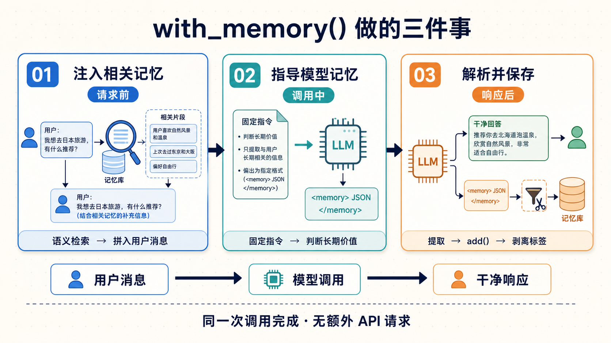
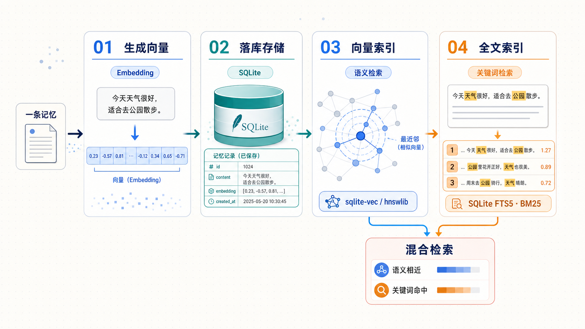
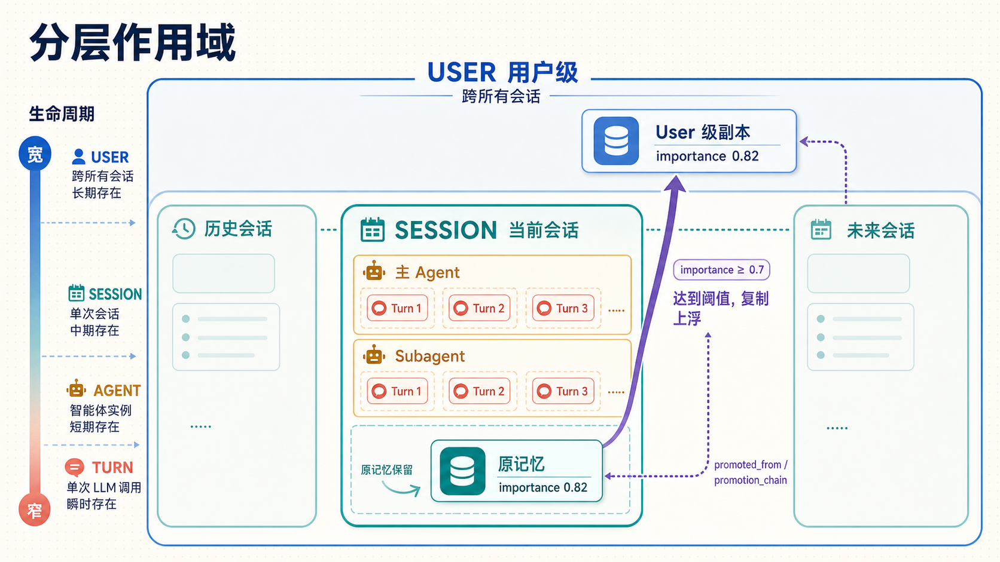
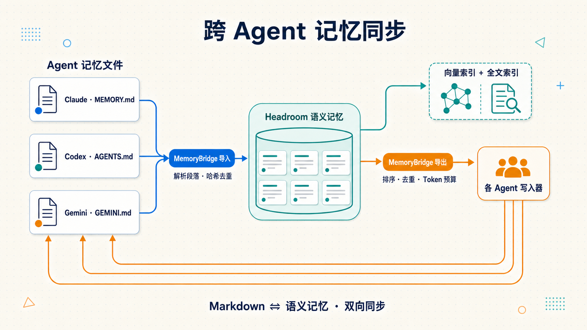
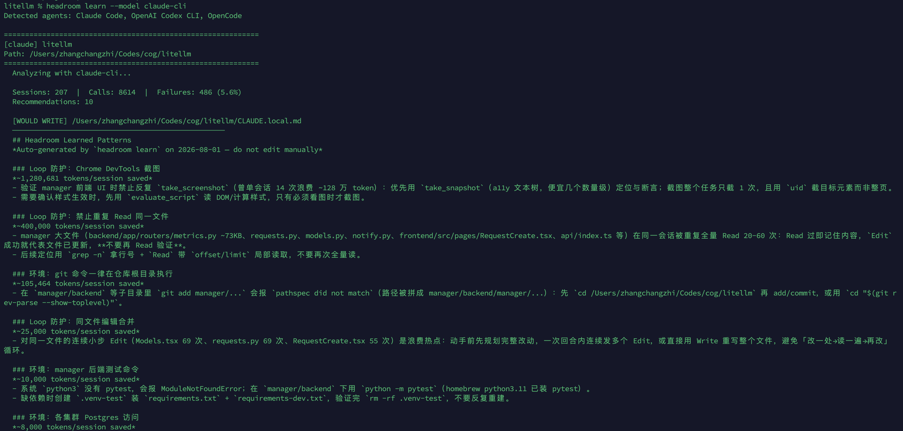
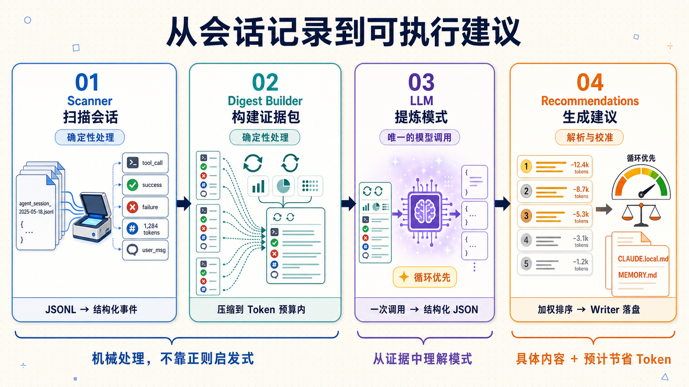

# 学习 Headroom 的跨 agent 记忆与失败学习

在上一篇里，我们看了 Headroom 的 **CCR（Compress-Cache-Retrieve，可逆压缩）**：压缩时把原文按哈希缓存在本地，模型觉得信息不够，就拿着哈希把原文取回来。它管的是「一次会话内」的信息不丢。这一篇我们看另外两块和「记住事情」有关的能力：一个是跨会话、跨 agent 的共享记忆，你在 Claude Code 里定过的偏好、积累的经验，能不能让 Codex、Gemini 下次也用上；另一个是 `headroom learn`，它会翻你过去的编程会话记录，自动找出反复踩的坑，把纠正写进各 agent 的上下文文件里。这两块的源码分别在 `headroom/memory/` 和 `headroom/learn/` 目录下。

## headroom memory：跨 agent 的共享记忆

在第二篇的学习里，我们其实已经见过记忆的命令了，运行 `headroom wrap claude --memory`，代理会在流量里自动注入和提取记忆，什么都不用改。想在自己的代码里用，库提供了一个包装函数 `with_memory()`：

```python
from openai import OpenAI
from headroom import with_memory

# 一行套上，之后照常使用
client = with_memory(OpenAI(), user_id="alice")

# 第一个会话：随口告诉它你的偏好
client.chat.completions.create(
    model="gpt-4o",
    messages=[{"role": "user", "content": "I prefer Python for backend work"}]
)

# 之后换一个全新会话：
client.chat.completions.create(
    model="gpt-4o",
    messages=[{"role": "user", "content": "What language should I use?"}]
)
# 回答会引用上个会话记下的 Python 偏好
```

效果就是：第一个会话里你只随口说了句偏好，新会话里模型就能据此回答。这背后 `with_memory()` 在每次调用里做了三件事：

第一件是**注入相关记忆**：按当前的用户消息做语义检索，把查到的相关记忆拼进消息发给模型。拼的位置有讲究，不是塞进系统提示词，而是拼到第一条用户消息里。系统提示词是缓存热区，动了会让 prompt cache 整段失效，这和之前的 CacheAligner 是同一个考量。

第二件是**指导模型如何记忆**：Headroom 会在系统提示词里加一段固定指令，大意是，如果这轮对话里有值得长期记住的事实（用户偏好、身份、当前目标这类可复用的信息），就在回答之后输出一个 `<memory>` 块；寒暄、一次性问题、已经知道的信息不要记。格式是 XML 标签包一段 JSON：`<memory>{"memories": [{"content": "..."}]}</memory>`，没什么可记的，模型就输出空的 `{"memories": []}`。

第三件是**解析并保存记忆**：Headroom 拿到响应后把这个块解析出来，逐条调 `add()` 存进记忆库里（下一节介绍）；然后把块从响应里剥掉再返回，你看到的回答是干净的。这整个提取内联在同一次调用里完成，没有额外的 API 调用。



攒下的记忆可以用 `headroom memory` 系列命令直接管理：

```bash
headroom memory list                 # 看存了哪些记忆
headroom memory list --scope USER    # 只看 user 级（跨会话持久）的
headroom memory list --since 7d      # 最近 7 天的
headroom memory stats                # 统计
headroom memory export --output backup.json  # 导出备份
headroom memory prune --older-than 30d       # 清理 30 天前的
```

记忆的使用比较简单，下面看它内部是怎么组织的。

### 分层记忆

上面说到，Headroom 从响应里解析出 `<memory>` 块之后，会逐条调 `add()` 把事实存进记忆库。这个 `add()` 就是记忆系统的核心入口，它所在的类是 `core.py` 里的 `HierarchicalMemory`。它把持久化存储、向量索引、全文索引、Embedding、缓存这些组件拼成一套统一的记忆 API，外界只用跟它打交道。看它的实现，一条记忆是怎么进来的：

```python
async def add(self, content, user_id, session_id=None, agent_id=None,
              turn_id=None, importance=0.5, ..., auto_bubble=None):
    memory = Memory(content=content, user_id=user_id, session_id=session_id,
                    agent_id=agent_id, turn_id=turn_id, importance=importance, ...)
    if auto_embed:
        memory.embedding = await self._embedder.embed(content)   # 生成向量
    await self._store.save(memory)                               # 落库
    if memory.embedding is not None:
        await self._vector_index.index(memory)                  # 建向量索引
    await self._index_for_text_search(memory)                   # 建全文索引
    should_bubble = auto_bubble if auto_bubble is not None else self._config.auto_bubble
    if should_bubble:
        await self._maybe_bubble(memory)                        # 重要记忆上浮
    return memory
```

可以看到，一条记忆加进来，流程分四步：先给内容生成向量，然后把记忆本体落库，最后同时建两个索引，向量索引管语义检索，全文索引管关键词精确检索。



这四步各自对应 `headroom/memory/adapters/` 下的适配器，而且每一步都留了可替换的后端：

| 步骤 | 适配器 | 后端选择 |
| ---- | ---- | ---- |
| 生成向量 | `embedders.py` | sentence-transformers（默认，需要 torch 较重）、ONNX（推荐的轻量项，无需 torch、约 86MB）、OpenAI、Ollama |
| 落库存储 | `sqlite.py` | 内置只有 SQLite，第三方存储可走 entry point 插件接入 |
| 向量索引 | `sqlite_vector.py` / `hnsw.py` | 默认自动选：有 sqlite-vec 就用它，否则回退 hnswlib |
| 全文索引 | `fts5.py` | SQLite FTS5（BM25 排序 + Porter 词干），也可走外部插件 |

向量索引管语义，全文索引管字面，两个配合起来就是常说的混合检索。

> **生成向量**：[sentence-transformers](https://github.com/huggingface/sentence-transformers) 是 HuggingFace 生态里的老牌向量库，把一段文本编码成向量，效果好但要带 torch，体积较大；[ONNX](https://github.com/onnx/onnx) 是跨框架的模型推理格式，同一个模型改用它跑就不用装 torch，体积小很多，所以被标为推荐。OpenAI 和 Ollama 则是把向量生成外包给 API 或本地 Ollama 服务。

> **落库存储**：SQLite 是嵌在进程里的本地数据库，不用单独起服务，记忆这种单机数据用它正合适。[Entry points](https://packaging.python.org/en/latest/specifications/entry-points/) 是 Python 的插件发现机制，第三方包注册后能被自动找到，存储、索引这些后端都靠它对外开放。

> **向量索引**：[sqlite-vec](https://github.com/asg017/sqlite-vec) 是 SQLite 的向量检索扩展，向量存在数据库文件里，查询走页缓存，记忆条数再多内存占用也不涨。[hnswlib](https://github.com/nmslib/hnswlib) 是 HNSW 算法的实现，HNSW（Hierarchical Navigable Small World）是一种近似最近邻算法，能在大量向量里快速找到语义最接近的几条，检索快，但整个图索引都在内存里，随条数涨。

> **全文索引**：[FTS5（Full-Text Search 5）](https://www.sqlite.org/fts5.html) 是 SQLite 自带的全文检索扩展，直接在数据库里建全文索引，不用额外部署搜索引擎。[BM25](https://en.wikipedia.org/wiki/Okapi_BM25) 是信息检索里经典的相关性打分算法，关键词命中越多、越稀有，分越高；[Porter 词干提取](https://snowballstem.org/algorithms/porter/stemmer.html)则把 running、runs、ran 这类英文变形归到同一个词干 run，搜索按词干匹配，命中更全。

细心的读者会发现，`add()` 这个函数的签名里有 `user_id`、`session_id`、`agent_id`、`turn_id` 这一串参数，这是 Headroom 记忆系统的另一个特点 —— **分层作用域（scope）**。一条记忆可以挂在四层里的任何一层：user → session → agent → turn，从宽到窄。注意这里的 agent 不是指「某个 agent 应用」，而是**当前会话里的一个 agent 实例**，一个会话里可以有多个 agent（比如主 agent 和它派生的 subagent），每个实例的存活期都在会话内部，所以 agent 比 session 窄。四层按存活期理解：user 跨所有会话，session 只管当前这一个会话，agent 管会话里某一个实例，turn 是单次 LLM 调用。



函数末尾的 `_maybe_bubble` 是配合分层的另一个重要机制：**记忆上浮**。它解决的问题是：一条记忆是在某个具体会话里产生的（session 级），会话一结束它就跟着没用了，可有些记忆明明值得长期留下。上浮的判断很直接，当重要性 `importance` 达到阈值（`bubble_threshold`，默认 0.7）的，就**复制一份**提到 user 级：副本的 session_id、agent_id、turn_id 全部清空，从此对这个用户的所有会话可见，同时记下 `promoted_from`（从哪条记忆升上来的）和 `promotion_chain`（提升链条），方便溯源；原记忆还留在原处不动。这样普通记忆随会话消亡，真正重要的少数会自己升上去，越攒越多。

### 记忆的双向同步

上面这套语义记忆是 Headroom 自己的存储，但各家编程 agent 其实都有自己的 markdown 记忆文件：Claude Code 的 `MEMORY.md`、Codex 的 `AGENTS.md`、Gemini 的 `GEMINI.md`。Headroom 支持在这两个世界之间做双向同步。一方面是导入侧，本质上也是一次 `add()` 调用，Headroom 把 markdown 解析成段落，按标题层级算出重要性，打上来源标签后写进来；另一方面是导出侧，就是反过来，把 Headroom 里新增加的记忆回写到 markdown 文件里，这个我们下一节再看。

> 对于 Claude Code，你可能更熟悉它的项目上下文文件 `CLAUDE.md`，而 Headroom 记忆同步的是它的**自动记忆文件** `MEMORY.md`，放在 `~/.claude/projects/<项目>/memory/` 下，每次启动时前 200 行会常驻进上下文。

双向同步的核心逻辑位于 `bridge.py` 的 `MemoryBridge` 如下：

```python
async def sync(self, paths=None, user_id=None) -> SyncStats:
    # 阶段 1：把 markdown 里新增 / 改动的段落导入 Headroom 语义记忆
    stats.import_stats = await self.import_from_markdown(paths=paths, user_id=user_id)
    # 阶段 2：把 Headroom 里新增的记忆导出回 markdown
    new_memories = await self._get_new_organic_memories(user_id, since)
    if new_memories and paths:
        count = await self._append_to_markdown(Path(paths[0]).expanduser(), new_memories)
    self._sync_state["last_sync"] = datetime.now(timezone.utc).isoformat()
    self._save_sync_state()
```

导入侧靠**基于哈希的变更检测**，每个文件、每个段落都存了内容哈希，没变的直接跳过，避免重复导入；导出侧只挑「原生记忆」，也就是 Headroom 自己生成的，而不是从 markdown 导进来的那些。具体靠元数据里的 `source` 标签把导入来的过滤掉，防止同一条内容在两边来回导。

```python
async def _get_new_organic_memories(self, user_id, since=None):
    # ...
    # 过滤掉 metadata.source == source_tag 的记忆（那些是当初从 md 导入的）
    if metadata.get("source") == self._config.source_tag:
        continue
```

### 各 agent 的写入器

导出回 markdown 时，不同 agent 的文件格式不一样，这部分由 `writers/` 下的一组写入器分别处理。它们共享一个基类 `AgentWriter`，通用的处理都放在基类里：按「重要度 × 新近度 × 访问次数」排序、按内容哈希去重、按 token 预算截断、用注释标记包裹自己管理的段落。

```python
# writers/base.py
MARKER_START = "<!-- headroom:memory:start -->"
MARKER_END = "<!-- headroom:memory:end -->"

def export(self, memories, output_path=None, dry_run=True):
    ranked = sorted(memories, key=lambda m: m.score, reverse=True)   # 排序
    # 按 content_hash 去重
    # 按 token 预算截断
    formatted = self.format_memories(budgeted)                       # 子类实现格式
    section = f"{MARKER_START}\n{formatted}\n{MARKER_END}"           # 包进标记
    full_content = _merge_section(target, section)                   # 只替换标记内部
```

标记（marker）在这里划定了回写边界：写入器只碰 `<!-- headroom:memory:start -->` 和 `<!-- headroom:memory:end -->` 之间的内容，你自己在文件里手写的部分不会动。子类只需实现 `format_memories`（怎么排版）和 `default_path`（写到哪）。以 `claude_writer.py` 为例，这两个方法长这样：

```python
# writers/claude_writer.py（精简）
def format_memories(self, memories: list[MemoryEntry]) -> str:
    """Format as Claude Code MEMORY.md section."""
    lines = ["## Headroom Learned Context",
             "*Auto-maintained by Headroom — do not edit manually*", ""]
    # 按 category 分组，每组一个 ### 小标题，记忆逐条列成列表项
    grouped: dict[str, list[MemoryEntry]] = defaultdict(list)
    for m in memories:
        grouped[(m.category or "General").replace("_", " ").title()].append(m)
    for heading, entries in grouped.items():
        lines.append(f"### {heading}")
        for entry in entries:
            lines.append(f"- {entry.content}")
        lines.append("")
    return "\n".join(lines)

def default_path(self) -> Path:
    """Default: Claude Code project memory directory."""
    if self._memory_dir:
        return self._memory_dir / "MEMORY.md"
    # ~/.claude/projects/-<sanitized-path>/memory/MEMORY.md
    sanitized = encode_claude_project_path(self._project_path)
    return Path.home() / ".claude" / "projects" / sanitized / "memory" / "MEMORY.md"
```

可以看到子类要做的就这两件事：`format_memories` 负责排版，把记忆按类别分组、每组一个小标题、逐条列成列表项；`default_path` 负责路径，返回的正是上面说的那个 `~/.claude/projects/<项目>/memory/MEMORY.md`。剩下的排序、去重、截断、合并进标记块，都由基类包办了。几个写入器的差异也集中在这两点上：

- **`claude_writer.py`**：写 Claude Code 的 `MEMORY.md`。它的 token 预算默认 2000，因为 Claude Code 只把 `MEMORY.md` 的前 200 行常驻上下文；超出的高重要度记忆会被 `export_topics` 按主题分别写进独立文件，按需加载，不挤占那 200 行的预算。
- **`codex_writer.py`**：写 Codex 的 `AGENTS.md`，纯 markdown 无 frontmatter，默认预算 3000。
- **`cursor_writer.py`**：写 Cursor 的 `.cursor/rules/*.mdc`，带 YAML frontmatter（文件头部的元数据块）。
- **`generic_writer.py`**：兜底写入器，输出纯 markdown，任何读 markdown 上下文文件的 agent 都能用。它的 `default_path` 默认写到项目根目录的 `HEADROOM_MEMORY.md`，文件名可以传参指定。Gemini 没有专门的写入器，就可以用它，把文件名传成 `GEMINI.md` 即可。

整个记忆同步的数据流如下图所示：



## headroom learn：从失败会话里学经验

记忆是「你告诉它什么，它记什么」。`headroom learn` 更主动一点：它去翻你过去的编程会话记录，自动找出反复踩的坑，把纠正写进各 agent 的上下文文件里，下次这个坑就不会再踩。

`headroom learn` 默认是空跑（dry-run，只演示不落盘），加 `--apply` 才真正写文件：

```bash
headroom learn                        # 空跑，只看会给出什么建议
headroom learn --apply                # 落盘写入
headroom learn --project ~/my-project --apply   # 分析指定项目
headroom learn --agent codex --all    # 分析所有 Codex 会话
headroom learn --target CLAUDE.md     # 改写进团队共享文件
```

不过我第一次在一个项目上直接跑 `headroom learn` 就失败了，报 `403 forbidden`：这是因为 learn 对 claude 模型会**绕过** `ANTHROPIC_BASE_URL`、直接请求官方 `api.anthropic.com`（本意是防止它指向本地代理），而我的 `ANTHROPIC_API_KEY` 是配给 MiniMax 这类第三方端点的，拿着它调用官方 API 自然被拒。改成 `--model claude-cli` 走本机 CLI（它会继承第三方端点配置）才跑通：

```bash
headroom learn --model claude-cli
```

跑通后，真实输出是这样：扫了 207 个会话、8614 次工具调用，其中 486 次失败（5.6%），给出 10 条建议：



它给出的不是「Read 失败了 5 次」这种泛泛的统计，而是具体的纠正。官方文档里把这项机制叫做**成功关联**（Success Correlation）：它不只是记录失败，还会找出模型后来是怎么修好的。比如这次运行里学到的一条经验：

- 失败：在 `manager/backend` 子目录里执行 `git add manager/...`，报错 `pathspec did not match`（路径被拼成了 `manager/backend/manager/...`）；
- 后来成功：先 `cd` 到仓库根目录再 add；
- 学到的经验：**git 命令一律在仓库根目录执行**。

注意每条建议后面都跟着一个节省估算，这个数不是 LLM 拍脑袋估的，而是后面要讲到的循环检测实测出来的浪费下界。学到的模式大致分几类：防循环（上面这种）、环境事实（该用哪条命令）、路径纠正、搜索范围、命令模式、已知大文件。下次会话 agent 启动时读到这些，同类错误就不会再犯。写入位置默认是 `CLAUDE.local.md`（个人的、gitignored），想写进团队共享的 `CLAUDE.md` 就加 `--target` 参数。

### Scanner → Digest → LLM → Recommendations

上面这些建议看着简单，背后的问题却不小：207 个会话、8614 次调用，怎么从里面找出值得学的模式？`headroom learn` 的答案是一条四步流水线，`analyzer.py` 开头的文档字符串写明了它的立场：

```python
# Pipeline: Scanner (events) → Digest Builder → LLM → Recommendations
# No regex patterns, no static lookback windows, no hardcoded heuristics.
# A single LLM call understands the full conversation context and produces
# structured recommendations for CLAUDE.md / MEMORY.md.
```

这段说的是：不用正则、不用固定回看窗口、不用硬编码启发式规则，一次 LLM 调用理解完整对话上下文，产出结构化建议。这条流水线按字面就是四步，每步的职责是：

1. **Scanner（扫描）**：从磁盘上把 agent 的会话记录读出来。以 Claude Code 为例，读的是 `~/.claude/projects/<项目>/` 下的 JSONL 会话日志，把每一次工具调用（名字、入参、成功还是失败、token 数）和用户消息解析成结构化事件。每种 agent 一个插件（`plugins/` 下的 claude、codex、gemini），运行输出里那行 `Detected agents` 就是这一步探测到的。
2. **Digest Builder（摘要）**：几百个会话、几千次调用不可能全塞给模型，这一步把它们压成一份 token 预算内（约 8 万 token）的文字摘要：项目概况和总数（多少会话、多少调用、失败率）、检测到的循环放在最前面（最贵的浪费模式，附实测浪费）、之前已学到的模式、以及每个会话精简后的事件流（报错截断、保留成功标记和用户消息）。它就是喂给 LLM 的那份「证据包」。
3. **LLM（分析）**：只发一次调用。系统提示词把它设定成「分析 coding agent 会话、提取能防止 token 浪费的模式」的专家，并给了明确的优先级，循环最高，往下是环境规则、文件结构事实、用户偏好、失败模式、工作流规则；用户消息就是那份摘要。返回结构化 JSON。
4. **Recommendations（建议）**：JSON 被解析成一条条 `Recommendation`，每条带着写到哪个文件（`CLAUDE.local.md` 还是 `MEMORY.md`）、具体内容和估计节省的 token。之后 `apply_loop_weighting` 用循环的实测浪费校准估算值，按节省降序排好，交给 writer.py 落盘。



所以判断「哪些是该学的经验」这件事本身，是交给一个 LLM 去做的，而不是用一堆正则去套。扫描和摘要都是确定性的机械工作，只有「从证据里提炼模式」这一步交给模型。`SessionAnalyzer.analyze` 就是把这四步串起来：

```python
def analyze(self, project, sessions) -> AnalysisResult:
    all_calls = [tc for s in sessions for tc in s.tool_calls]
    failed_calls = [tc for tc in all_calls if tc.is_error]
    loops = detect_loops(sessions)                       # 先检测循环
    if not failed_calls and not loops and not any(s.events for s in sessions):
        return result                                    # 没失败、没循环、没事件，直接返回
    digest = _build_digest(project, sessions, loops=loops)   # 拼成紧凑摘要
    model = self.model or _detect_default_model()            # 自动选模型
    raw = _call_llm(digest, model)
    result.recommendations = _parse_llm_response(raw)        # 解析成建议
    apply_loop_weighting(result.recommendations, loops)      # 按实测浪费加权
    result.recommendations.sort(key=lambda r: r.estimated_tokens_saved, reverse=True)
    return result
```

值得注意的是，这里的模型调用走的是 [LiteLLM](https://github.com/BerriAI/litellm) 这个统一接口，不管你使用的是什么模型，一次 `completion()` 调用即可。如果不用它，就得为每家各写一套 SDK 的直调、各处理一套鉴权和响应格式。

具体用哪个模型，由下面这个顺序决定：

1. 显式指定 `--model` 优先级最高，它的取值有两类：任意 litellm 模型名（100 多家 provider 任选），或三个本机 CLI 标识（转给本机对应的 CLI 做分析，支持 `claude-cli` / `gemini-cli` / `codex-cli`）；
2. 环境变量里有 API key，按一张写死的映射表来取：`ANTHROPIC_API_KEY` → `claude-sonnet-4-6`、`OPENAI_API_KEY` → `gpt-4o`、`GEMINI_API_KEY` → `gemini/gemini-flash-latest`；
3. 一个 key 都没有：看 `HEADROOM_LEARN_CLI` 环境变量指定的 CLI；
4. 如果还没有：自动探测本机装了的 CLI 工具（`claude` > `gemini` > `codex`），让订阅用户不用另配 API key 也能用。

### 检测错误循环

`headroom learn` 把**循环**列为重点，因为一次性错误只浪费一次，而循环的浪费随重复次数累加。循环在流水线里被处理了两次：模型调用**之前**，`detect_loops` 把它检测出来、连着实测浪费一起写进摘要，让模型看得到；模型调用**之后**，`apply_loop_weighting` 再拿这份实测浪费去校准建议里的估算。

先看 `detect_loops`，它主要检查两种循环：

- **错误循环**：同一个调用失败、重试、又失败。比如反复去读一个根本不存在的路径。
- **RTK 重取循环**：RTK（Rust Token Killer，第二篇介绍过的 shell 输出压缩工具）把 `grep foo` 改写成 `grep foo | head -50`，结果截断掉了 agent 真正要的内容，agent 只好换个变体再跑一遍（`head -100`、换偏移量）。每次调用都**成功**，所以纯看失败的分析根本发现不了它。

关键技巧是把这些变体折叠成同一个规范签名（signature），再数重复次数、算实测浪费的 token：

```python
def _canonical_signature(tc: ToolCall) -> str:
    raw = tc.input_summary.strip()
    if tc.name.lower() in ("bash", "shell"):
        raw = _PAGINATION_RE.sub(" ", raw)   # 去掉 | head -50 / limit 100 这类分页片段
        raw = _INT_RE.sub("N", raw)          # 裸数字统一替换成 N
    raw = _WS_RE.sub(" ", raw).strip().lower()
    return f"{tc.name.lower()}::{raw}"
```

这样 `grep foo | head -50` 和 `grep foo | head -100` 就归成了同一个签名。默认要重复满 3 次才算循环，这是能把「循环」和「一次性重试」区分开的最小次数。浪费的 token 是**实测下界**，不是让 LLM 猜的：错误循环里每次都算浪费，重取循环里第一次是正当工作、只算后面 N-1 次的重取。

检测发生在模型调用前，校准发生在模型调用后。模型返回建议之后，`apply_loop_weighting` 会把与某个循环签名重叠的建议的 `estimated_tokens_saved` 抬到至少等于该循环实测浪费的 token。因为循环的实测浪费是多次累加的，这一步能可靠地把「防循环」的建议排到「防一次性错误」的建议前面，而不必指望 LLM 自己把权重估对。

### 把纠正写进文件

模型给出建议、再经循环的实测浪费校准估算之后，流水线就剩最后一步：把建议写进文件，让下次会话的 agent 能读到。这一步由 `writer.py` 负责。它同样用标记块（`<!-- headroom:learn:start -->` / `<!-- headroom:learn:end -->`）圈出自己的地盘，只动块内的内容。至于**写到哪个文件**，`ClaudeCodeWriter` 的默认目标不是 `CLAUDE.md`，而是 `CLAUDE.local.md`：

```python
def _resolve_context_path(self, project):
    if self._context_target is not None:
        # --target 显式指定的话，它说了算（比如想写进团队共享的 CLAUDE.md）
        ...
    if project.project_path == Path.home():
        return claude_config_dir() / "CLAUDE.md"   # 主目录下的是个人全局记忆
    return project.project_path / "CLAUDE.local.md"  # 项目级默认写个人文件
```

Claude Code 约定 CLAUDE.md 是团队共享，会提交进 git 仓库，而 CLAUDE.local.md 是个人的，默认被 gitignore 忽略，学到的模式一般都是「个人」的，所以默认写进 CLAUDE.local.md 文件。

如果你用的是别的 agent，目标文件也会跟着换：Codex 是 `AGENTS.md`，Gemini 是 `GEMINI.md`，这套映射由 `headroom/learn/plugins/` 下各自的插件提供，这里不再赘述。

## 小结

这一篇我们学习了 Headroom 的两块「记忆」能力：

1. **跨 agent 记忆**：按 user -> session -> agent -> turn 四层作用域组织，普通记忆随会话消亡，重要的会自动上浮到用户级、跨会话越攒越多；检索同时走向量索引（HNSW）和全文索引（FTS5）两条路；它还能和各 agent 的 markdown 记忆文件双向同步：导入按哈希检测变更、只挑改动的段落，导出只回写自己新增的记忆，并用标记块圈定边界、绝不碰手写的内容。
2. **headroom learn**：走 Scanner → Digest → LLM → Recommendations 的流水线，判断该学什么这件事交给模型而不是正则；`loops.py` 把错误循环和 RTK 重取循环折叠成规范签名、按实测浪费加权；`writer.py` 默认把纠正写进 gitignore 的 `CLAUDE.local.md`，也支持 `AGENTS.md` 和 `GEMINI.md`。

到这里，关于 Headroom 模型**输入**这一侧的内容就基本讲完了。不过省 token 还有另一半没讲：模型**输出**的那部分。同样一个问题，模型可以啰嗦地复述一大段，也可以简洁作答，输出 token 一样要计费。Headroom 的 Output Shaper 就是冲着这半边来的。我们下一篇看它怎么削减输出 token，也给这个系列收个尾。

## 参考

* [Headroom GitHub 仓库](https://github.com/chopratejas/headroom)
* [Memory 记忆系统文档](https://headroom-docs.vercel.app/docs/memory)
* [SharedContext 跨 agent 共享文档](https://headroom-docs.vercel.app/docs/shared-context)
* [Failure learning 失败学习文档](https://headroom-docs.vercel.app/docs/failure-learning)
* [LiteLLM 统一多家 LLM 接口的库](https://github.com/BerriAI/litellm)
