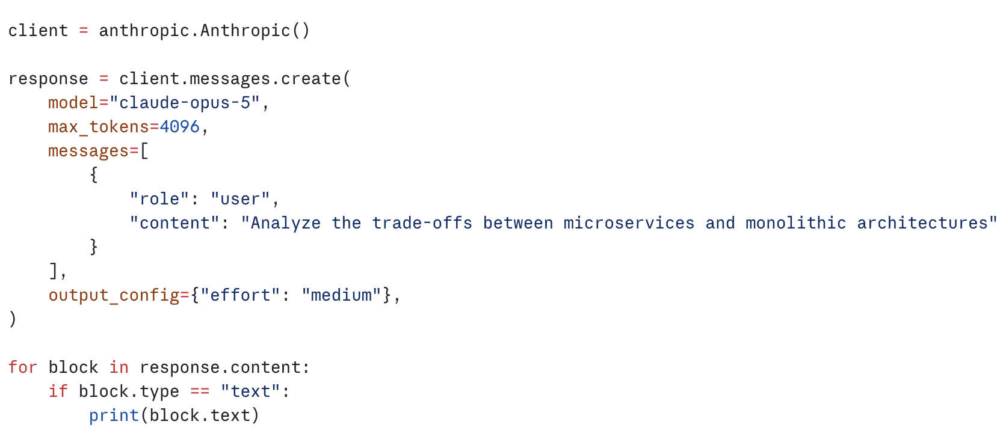

# 学习 Headroom 的输出 token 优化

在前面几篇里，我们把 Headroom 的输入侧基本都聊过了：`compress()` 入口和管线生命周期、ContentRouter 怎么分流内容、SmartCrusher / CodeAwareCompressor / Kompress 三个压缩器各自压什么、CCR 可逆压缩怎么把原文缓存在本地、跨 agent 记忆和 `headroom learn` 又怎么把经验沉淀成长期知识。它们有一个共同点：围着的都是**发给模型**这一路。工具输出、日志、RAG 片段、文件、对话历史，在进入大模型之前先被压缩。

今天这一篇换个方向，看 Headroom 怎么压**模型写回来的东西**。这部分能力叫 **Output token reduction（输出 token 削减）**，对应的模块是 **Output Shaper（输出整形器）**。

## 什么是输出 token 优化

众所周知，输出 token 比输入贵，比如 Opus 级别的模型，输出 token 的单价大约是输入的 5 倍。同样是一万 token，写回来的那一万比发出去的那一万贵得多。所以输入侧压得再狠，如果模型每一轮都长篇大论地写回来，账单还是下不去。

那模型的输出里，哪些部分是可以省的？官方 README 把浪费点归纳成三类：

* **寒暄与收尾语（preamble / postamble）**：回答正文前的一句 Great, let me...（好的，我来...），以及正文后的一句总结陈词。这些话对结果没有信息量。
* **复述已有上下文**：模型把你刚发给它的代码、文件内容、diff、工具输出，原样再抄一遍到回复里。你已经有这些内容了，它抄一遍纯属多花钱。
* **对机械步骤过度思考（thinking）**：thinking 指模型在正式作答前的一段推理草稿，它同样按输出 token 计费。当这一轮只是读了个文件、跑了个通过的测试，续写本来是很机械的动作，却还调动高档的深度思考，这笔思考 token 就浪费了。


Headroom 代理本身不生成任何输出 token，它只是个透明反向代理。所以它能动的只有**请求**：通过改写发出去的请求，去影响模型愿意写回来多少。Output Shaper 的两根杠杆都是这个思路。

## 打开输出整形器

Output Shaper 默认是关闭的，通过环境变量开启：

```bash
export HEADROOM_OUTPUT_SHAPER=1
```

它的配置全部走环境变量，`OutputShaperSettings` 这个数据类负责从环境里把设置读出来，逻辑在 `output_shaper.py`：

```python
@dataclass(frozen=True)
class OutputShaperSettings:
    enabled: bool = False           # HEADROOM_OUTPUT_SHAPER
    verbosity_level: int = 2        # HEADROOM_VERBOSITY_LEVEL，0~4
    effort_router_enabled: bool = True   # HEADROOM_EFFORT_ROUTER
    mechanical_effort: str = "low"       # 机械续写时降到哪一档

    @classmethod
    def from_env(cls) -> OutputShaperSettings:
        enabled = runtime_env.getenv("HEADROOM_OUTPUT_SHAPER", "").lower() in (
            "1", "true", "yes",
        )
        # ... 读取 level、router、mech，并把 level 夹在 0~4 之间
        return cls(enabled=enabled, ...)
```

四个字段各对应一个环境变量：

* `HEADROOM_OUTPUT_SHAPER`：总开关，设成 `1` / `true` / `yes` 才算开，其它值都是关。整个 Output Shaper 就靠它启用。
* `HEADROOM_VERBOSITY_LEVEL`：详略级别，0 到 4 的整数，默认 2。它控制第一根杠杆「详略引导」的力度，往系统提示词里追加多强的简洁指令，0 是不干预、4 是电报体，各级指令的原文下一节会看到。
* `HEADROOM_EFFORT_ROUTER`：第二根杠杆「努力档位路由」的开关，**默认是开的**，只有显式设成 `0` / `false` / `no` 才关。它管的是另一件事：给机械续写的轮次降低思考档位。
* `HEADROOM_MECHANICAL_EFFORT`：机械续写时把思考档位降到哪一档，默认 `low`，填了不认识的档位名也会回退到 `low`。

关于后三个环境变量的含义和用法，后面详讲。这个类只负责把开关读出来，真正的整形入口是 `shape_request`，它的主干很直白：

```python
def shape_request(body, settings=None, level_override=None) -> ShapeResult:
    if settings is None:
        settings = OutputShaperSettings.from_env()   # 读环境变量里的配置
    result = ShapeResult()
    if not settings.enabled:
        return result              # 开关关着：原样返回，什么都不做

    # 杠杆 1：详略引导
    if level > 0 and apply_verbosity_steering(body, level):
        result.changed = True
    # 杠杆 2：努力档位路由
    if settings.effort_router_enabled:
        kind = classify_turn(body.get("messages", []))
        labels = route_effort(body, kind, settings)
    return result
```

开关关着时它直接返回一个空结果，请求原样放行，所以默认行为和不装 Output Shaper 完全一样。打开之后，它的核心是两根杠杆：**详略引导（verbosity steering）**和 **努力档位路由（effort routing）**。下面分别看。

## 第一根杠杆：详略引导

详略引导的做法很朴素：在系统提示词的末尾追加一段指令，告诉模型简洁一点、别复述。指令文本按强度分成 5 个等级，0 级是不干预，1 到 4 级逐级变狠，都是写死在代码里的固定字符串。四个级别的原文分别是：

**第 1 级**，只管寒暄：

> Skip preamble and postamble. Do not announce what you are about to do or recap what you just did; start with the substance.

跳过开场白和收尾：不要预告你打算做什么，也不要复述你刚做了什么，直接进正题。

**第 2 级**（默认级别），开始管复述：

> Skip preamble and postamble; start with the substance. Never restate code, file contents, diffs, or tool output that already appear in this conversation — reference them by path and line instead. After a tool call succeeds, continue without narrating the result.

在第 1 级基础上加两条：对话里已经出现过的代码、文件内容、diff、工具输出，一律不许复述，改用路径和行号来引用；工具调用成功后直接往下写，不复述结果。

**第 3 级**，连理由和改写幅度都管：

> Skip preamble and postamble. Never restate code, file contents, diffs, or tool output already in this conversation — reference by path and line. Give conclusions only; omit rationale unless the user asks why. Prefer the smallest edit over rewriting whole files. Keep prose to the minimum needed to be unambiguous.

在第 2 级基础上再加码：只给结论，用户不问就不讲理由；改代码优先最小编辑，不要动不动重写整个文件；文字压缩到「不产生歧义」的下限。

**第 4 级**，进入电报体：

> Minimum tokens. Fragments fine. No preamble, no postamble, no restating context, no rationale. Answer, smallest-possible edits, nothing else.

token 能省则省：允许不完整的句子，开场、收尾、复述、理由一概不要，只要答案和最小改动，别的什么都别写。

四个级别对比着看，约束是层层加码的：1 级管寒暄，2 级管复述，3 级管理由和改写幅度，4 级进入电报体。默认用第 2 级，是一个大多数人都能接受的力度。

顺带一提，这段指令是追加在系统提示词**最末尾**（所有 `cache_control` 断点之后）的，这样不会弄坏缓存前缀，原理前面几篇讲过，这里就不展开了。

## 第二根杠杆：努力档位路由

第二根杠杆针对的是前面说的第三类浪费：对机械步骤过度思考。

先解释一下背景。像 Claude Code 这样的编程 agent，在一个任务里会反复循环：调用工具、拿到结果、继续、再调用工具。这些循环里的绝大多数轮次，其实只是**机械的续写**，比如刚读完一个文件、刚跑过一个通过的测试，模型接下来做的事情是可预期的。但 Claude Code 这类客户端往往把每一轮的[努力档位](https://platform.claude.com/docs/en/build-with-claude/effort)（`output_config.effort`）都钉在 `xhigh` 这样的高档上，于是模型对这种机械续写也调动高强度的思考，而思考是按输出 token 计费的。



努力档位路由要做的，就是识别出这种机械续写的轮次，把它的思考档位调低；而对新问题、对报错，保持全力。判断哪种轮次靠的是 `classify_turn`，它的分类**完全基于消息的结构**，不看任何关键词、不用正则：

```python
def classify_turn(messages: list[dict]) -> TurnKind:
    last = messages[-1]
    if last.get("role") != "user":
        return TurnKind.UNKNOWN
    content = last.get("content")
    # ...
    saw_tool_result = False
    saw_error = False
    for block in content:
        btype = block.get("type")
        if btype == "tool_result":
            saw_tool_result = True
            if block.get("is_error") is True:
                saw_error = True
        elif btype == "text":
            return TurnKind.NEW_USER_ASK   # 用户又插了一句新的话
        elif btype in ("image", "document"):
            return TurnKind.NEW_USER_ASK
    if saw_error:
        return TurnKind.ERROR_CONTINUATION   # 工具报错，要认真推理
    if saw_tool_result:
        return TurnKind.MECHANICAL_CONTINUATION  # 干净的工具结果，机械续写
    return TurnKind.UNKNOWN
```

逻辑很直白：看最后一条用户消息里都是些什么块。如果里面夹了用户新打的文字、图片或文档，说明用户又提了新要求，判为 `NEW_USER_ASK`；如果全是工具结果、且没有一个带 `is_error` 标记，判为机械续写 `MECHANICAL_CONTINUATION`；只要有一个工具结果带了错误标记，就判为报错续写 `ERROR_CONTINUATION`，因为模型这时候得认真琢磨这个失败。

只有被判为机械续写的轮次，`route_effort` 才会动手降档：

```python
def route_effort(body, kind, settings) -> list[str]:
    if kind is not TurnKind.MECHANICAL_CONTINUATION:
        return []                       # 其它情况一律不碰
    labels = []
    output_config = body.get("output_config")
    if isinstance(output_config, dict):
        effort = output_config.get("effort")
        if isinstance(effort, str) and effort in _EFFORT_RANK \
                and _EFFORT_RANK[effort] > _EFFORT_RANK[settings.mechanical_effort]:
            output_config["effort"] = settings.mechanical_effort   # 只往低调
            labels.append(f"output_shaper:effort:{effort}->{settings.mechanical_effort}")
    # ... 老模型走 thinking.budget_tokens，夹到 API 下限
    return labels
```

这段代码里有两条安全规则：

* **只降不加**：只有当客户端**本来就发了** `output_config.effort` 这个字段，整形器才会把它往低调。绝不主动**注入**这个字段，因为不支持努力档位的模型碰到这个参数会直接返回 400 报错。
* **绝不动 `thinking.type`**：对还在用老式 `thinking.budget_tokens`（思考预算 token 数）的模型，整形器只把预算夹到 API 允许的下限 1024，而从不去关掉思考开关。因为历史消息里如果带着思考块，中途关掉思考也会让某些模型报 400，而且这个开关一动就会破坏消息层的缓存。

## 学习你偏好的啰嗦度

上面的详略级别可以手动用 `HEADROOM_VERBOSITY_LEVEL` 指定，但更省心的方式是让 Headroom 自己学。命令是：

```bash
headroom learn --verbosity          # 只分析、给建议
headroom learn --verbosity --apply  # 分析并写入配置
```

这背后的逻辑在 `headroom/learn/verbosity.py` 文件中。它的出发点是一个观察：用户几乎从不**明说**自己想要多简洁的回答，但用户会用行为**表现**出来。这些行为信号能从 Claude Code 的会话记录里提取出来，Headroom 一共提取了四个信号：打断率、快速跳过率、长输出频率和复读率，其中决定详略级别的主要看前两个：

* **打断率（interrupt rate）**：模型话说到一半，用户按下打断的比例。
* **快速跳过率（fast-skip rate）**：模型给了个长回答，用户回得飞快，快到根本不可能读完。

后两个不参与定级，但也各有用途：

* **长输出频率（long-output rate）**：长回答占全部回答的比例，「长」是相对的，以你自己的回答长度中位数为参照，且至少 200 词才参评。
* **复读率（echo ratio）**：回答和它拿到的上下文之间 n-gram 重叠的比例，看回答有多少是复述。它不定级，但它正是后文「度量输出节省」那节里**直接浪费**那一层的指标。

快速跳过率的判定不是拿一个固定秒数当界限，而是先按平均阅读速度（每分钟 250 词）算出这段回答**读完需要多久**，如果用户在读完时间的一半都不到就回复了，就算一次快速跳过：

```python
_READING_WPM = 250.0          # 技术类文字的平均阅读速度（词/分钟）
_SKIP_READ_FRACTION = 0.5     # 回复快于读完时间的一半，判为没读
_MIN_WORDS_FOR_SKIP = 150     # 太短的回答不参与判断，没什么可跳的
```

然后把打断率和快速跳过率加起来当作「输出太多」的压力值，压力越大、建议的级别越高。它还设了个上限：即便压力非常大，也只封顶到第 3 级，而不会自动应用最激进的第 4 级电报体。数据不足（人类消息加上打断次数合计少于 10）时回退到默认的第 2 级。

上面整个推荐是一个启发式先验，还可以加一个 `--llm-judge` 参数，配个大模型做裁判，它把提取好的四个信号（不是原始会话）发给 LLM，让它按四级标准给个级别。

除此之外，还有一个自动调节控制器做运行时的实时微调（由 `HEADROOM_VERBOSITY_AUTOTUNE` 开启），学到的级别只是起点，它在会话进行中继续盯实时信号，动态调整级别。思路借自拥塞控制的 AIMD（加法增、乘法减）：连续多次「用户没在读」（打断、快速跳过）才把级别上调一级，往上探要慢；一旦用户嫌回答太少，立刻回退一级并冷却一段时间，压住不再轻易上调，因为惹恼用户是代价大的事件。

这一步学到的级别会写进工作区的 `verbosity.json` 文件。运行时 `resolve_verbosity_level` 会按优先级取值：环境变量显式指定的手动值最高，其次是自动调节控制器，再次是学到的 `verbosity.json`，最后才是默认值。

## 怎么度量输出省了多少

到这里有一个绕不开的问题：输出侧到底省了多少 token，怎么算？

输入侧好办。压缩是一个纯函数，压之前多少 token、压之后多少 token 都摆在那里，两个数一减就是省下的。但输出侧不一样。当整形器让请求变得更简洁，模型吐出了 N 个输出 token，可我们**永远看不到**它在没被整形的情况下**本来会**吐多少。这是一个**反事实（counterfactual）**问题：每个请求只会发生一种情况，另一种平行世界里的结果观察不到。

> 反事实是因果推断里的概念，指的是「如果当初没这么做，结果会怎样」的那个没有真实发生的情形。它天然不可直接观测。

所以，既然那个平行世界观测不到，节省就只能靠估计。`headroom/proxy/output_savings.py` 这个模块的工作，就是把估计做得诚实。它把结果分成三个层次：

* **estimated（合成对照估计）**：对照数据其实是由上节的 `headroom learn --verbosity` 命令输出，这条命令对历史会话时进行扫描，学习详略级别，另外，它还会顺带按请求特征把未整形时的输出 token 数累进一份逐层基线（baseline），`--apply` 时写进 `output_savings.json`。这份基线扫的是整形器上线**之前**的会话，相当于用历史数据拼出一个「假如没做整形会怎样」的假想对照组，这叫合成对照（synthetic control）。拿整形后实际观测到的输出，去和同类请求的基线均值相减，累加起来就是估计的节省。这个结果会带上置信区间，并且始终标注为「估计」，而不说是「测量」。
* **measured（A/B 留出测量）**：故意扣下一小撮对话不做整形，这叫留出集（holdout）；这些对话进对照臂（control arm，也叫对照组），其余进处理臂（treatment arm，也叫试验组）正常整形。两边同类请求的均值之差，是一个无偏的因果估计。这是唯一能被称为「测量」的数字。
* **direct waste（直接浪费，无反事实）**：复读率（echo ratio），就是上一节提取的四个行为信号之一，表示响应和上下文之间的 n-gram（连续 n 个词的片段）重叠比例。它是单个响应自身的属性，不需要反事实就能测。

这里最关键、也最能体现设计诚实度的，是 measured 这一层。它是怎么留出对照组的呢？答案在 `assign_arm` 函数中，按对话做确定性分组：

```python
def assign_arm(conversation_key: str, holdout_fraction: float) -> str:
    if holdout_fraction <= 0.0:
        return "treatment"
    if holdout_fraction >= 1.0:
        return "control"
    digest = hashlib.sha256(("arm:" + conversation_key).encode()).hexdigest()
    frac = int(digest[:8], 16) / 0xFFFFFFFF   # 映射到 [0, 1)
    return "control" if frac < holdout_fraction else "treatment"
```

上面的 `holdout_fraction` 对应环境变量 `HEADROOM_OUTPUT_HOLDOUT`，默认取值为 `0.1`。就是把大约 10% 的对话留作对照组、不做整形；设成 `0` 或干脆不设，全部进处理组，那就没有 measured 数字可报。

函数本身的逻辑很短。先处理两个边界：比例 ≤ 0 全部当处理组，≥ 1 全部当对照组。正常落在中间时，把对话 key 前面拼上固定前缀 `"arm:"`，做一次 SHA-256，再取哈希的前 8 个十六进制字符，除以 `0xFFFFFFFF`，映射成 `[0, 1)` 上的一个伪随机小数 `frac`。`frac` 落在 `holdout_fraction` 左边就进对照组，否则进处理组。因为哈希对同一个 key 永远出同一个数，所以分组是**确定性的**：同一条对话每次进来都会落进同一组，不会在中途变化。

分组解决的是「做不做整形」，但光有组别还不够。不同请求天然就该吐出不同长度的输出：Opus 比 Haiku 啰嗦、带工具的机械续写比纯聊天短、输入 10 万 token 的上下文和输入 1 千 token 的也不一样。如果把所有请求的均值直接相减，混在一起的异质性会把因果效应淹没。所以还要**分层（stratum）**：把「同类」请求放进同一格，只在同一格里比处理组和对照组。

分层用的特征必须在请求发出时就能观测到，绝不能看响应本身，否则就是用结果去分桶，因果估计就偏了。`stratum_key` 拼的是四样东西：

```python
def stratum_key(*, turn_kind, input_tokens, model, has_tools) -> str:
    return "|".join((
        model_family(model),          # opus / sonnet / haiku ...
        turn_kind,                    # 轮次类型
        input_bucket(input_tokens),   # xs / s / m / l / xl
        "tools" if has_tools else "notools",
    ))
```

输入 token 数被故意划成很粗的几档（2k / 8k / 32k / 128k 为界），模型 id 也收成家族名。层划得太细，每一格样本会稀到基线噪声很大；粗一点，格子里才有足够的数可平均。合成对照的基线、A/B 的均值差，都是按这个 key **逐层**算的：`estimate = Σ (该层基线均值 − 该层观测输出)`，或 A/B 里 `Σ (该层对照组均值 − 该层处理组均值)`。只有两边都有数据的层才参与 measured 的汇总。

分组（进哪只臂）和分层（落进哪一格）的信息，全都通过已有的 `transforms_applied` 标签通道往下传，不用改动响应处理的任何路径。响应回来时，`SavingsRecorder.record_from_labels` 从标签里解出（组别，分层），把这一次的输出 token 记进对应格子的账本。估计的输出是带 95% 置信区间的，`_finalize` 用正态近似算出上下界：

```python
@staticmethod
def _finalize(total_saved, total_baseline, var, n_requests, kind):
    pct = (total_saved / total_baseline * 100.0) if total_baseline > 0 else 0.0
    se = math.sqrt(var)
    lo = total_saved - 1.96 * se   # 95% 区间下界
    hi = total_saved + 1.96 * se
    # ... 换算成百分比返回
```

可以通过 `headroom output-savings` 命令查看详细的结果，它优先展示 measured 的数字，没有对照组数据时退回 estimated 的数字。

## 小结

这一篇我们学习了 Headroom 的输出 token 优化：

1. **为什么输出也值得压**：输出 token 的单价约为输入的 5 倍，浪费集中在三处：寒暄与收尾语、复述已有上下文、对机械步骤过度思考。代理本身不生成输出 token，只能通过改写请求去引导模型少写。
2. **两根杠杆**：详略引导往系统提示词末尾追加简洁指令，五个等级层层加码（1 级管寒暄、2 级管复述、3 级管理由和改写幅度、4 级电报体），默认 2 级；努力档位路由按消息结构识别机械续写、把它的思考档位调低，同时守住两条安全规则：只降不加、绝不动思考开关。
3. **学习偏好**：`headroom learn --verbosity` 从打断率、快速跳过率等行为信号反推你想要的级别，启发式之外还能加 LLM 裁判，运行时还有 AIMD 控制器根据实时信号继续微调。
4. **诚实的度量**：输出节省是反事实问题，Headroom 把它分成三层：合成对照给出的估计（带置信区间、只标注为估计）、留出对照组的 A/B 测量（`HEADROOM_OUTPUT_HOLDOUT`），以及不需要反事实的直接浪费（复读率）。

至此，Headroom 的两个方向就凑齐了。把输入侧压缩和输出侧削减放在一起对比，正好作为整个系列的总结：

| 维度 | 输入侧压缩 | 输出侧削减 |
| ---- | -------- | -------- |
| 作用对象 | 发给模型的内容 | 模型写回来的内容 |
| 手法 | 直接缩小文本体积 | 改写请求去影响模型行为 |
| 节省是否可直接观测 | 是，压前压后两个数一减 | 否，是反事实，需估计或 A/B 测量 |
| 单价权重 | 输入 token，单价较低 | 输出 token，Opus 级约为输入的 5 倍 |
| 相关模块 | `transforms/` | `proxy/output_shaper.py`、`output_savings.py` |

输入侧是把已经确定的文本压小，是个纯函数，干净利落。输出侧动不了模型本身，只能通过改写请求去**引导**它少写，效果天生带不确定性，所以配了一整套诚实的度量。

写到这里，这个系列也差不多要告一段落了。回头看这条路线：第一篇介绍 Headroom 是什么、它要解决什么问题；第二篇把 `headroom wrap` 和 `headroom proxy` 跑起来；第三篇俯瞰架构，把 ContentRouter、三大压缩器、CacheAligner、CCR 和管线生命周期串成一张图；第四篇钻进 `compress()` 入口和管线编排的源码；第五篇细看 SmartCrusher、CodeAwareCompressor 和在本地推理的 Kompress；第六篇看 CCR 可逆压缩；第七篇看跨 agent 记忆和 `headroom learn`；到这最后一篇，把方向从输入侧翻到了输出侧。

从压缩内容到压缩生成，从纯函数式的确定节省到反事实的诚实估计，Headroom 这套东西的价值不只在省钱的数字，更在它对待「省了多少」这件事的态度。希望这个系列能帮你把 Headroom 从一个命令行工具，理解成一套可以借鉴的工程思路。

## 参考

* [Headroom GitHub 仓库](https://github.com/chopratejas/headroom)
* [官方文档：Output token reduction](https://headroom-docs.vercel.app/docs/savings)
* [官方文档：Failure learning](https://headroom-docs.vercel.app/docs/failure-learning)
* [官方文档：Proxy](https://headroom-docs.vercel.app/docs/proxy)
* [官方文档：Benchmarks](https://headroom-docs.vercel.app/docs/benchmarks)
