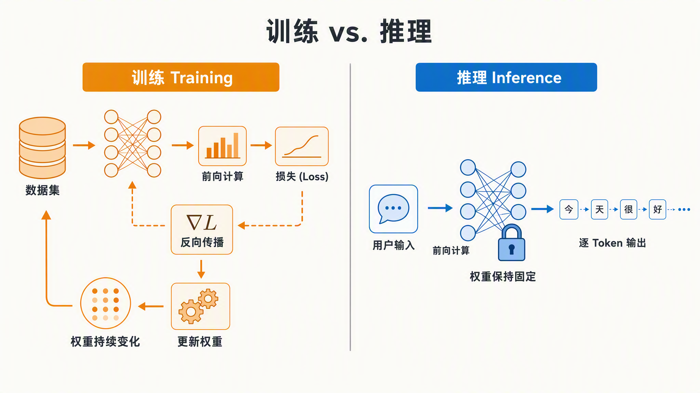
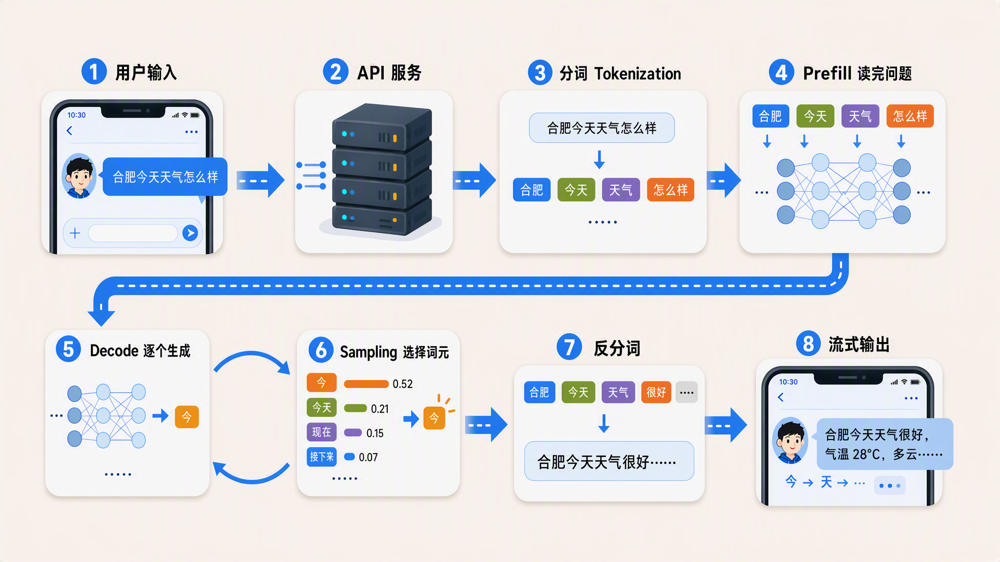
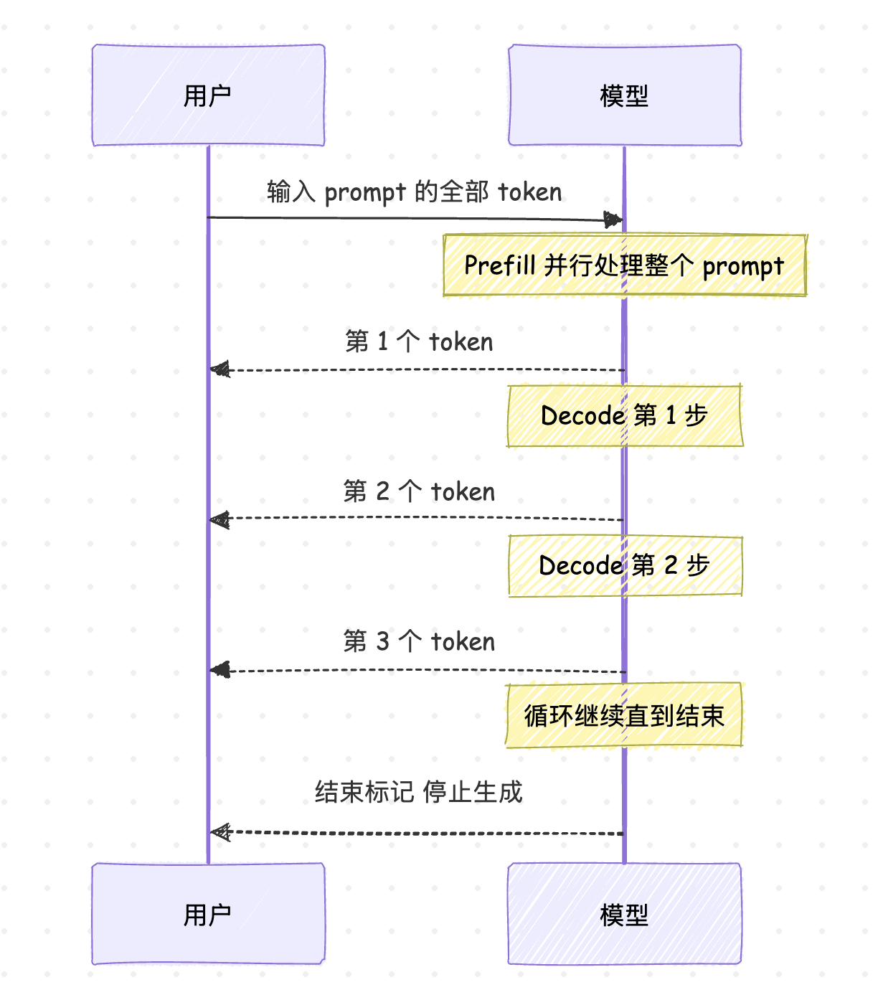
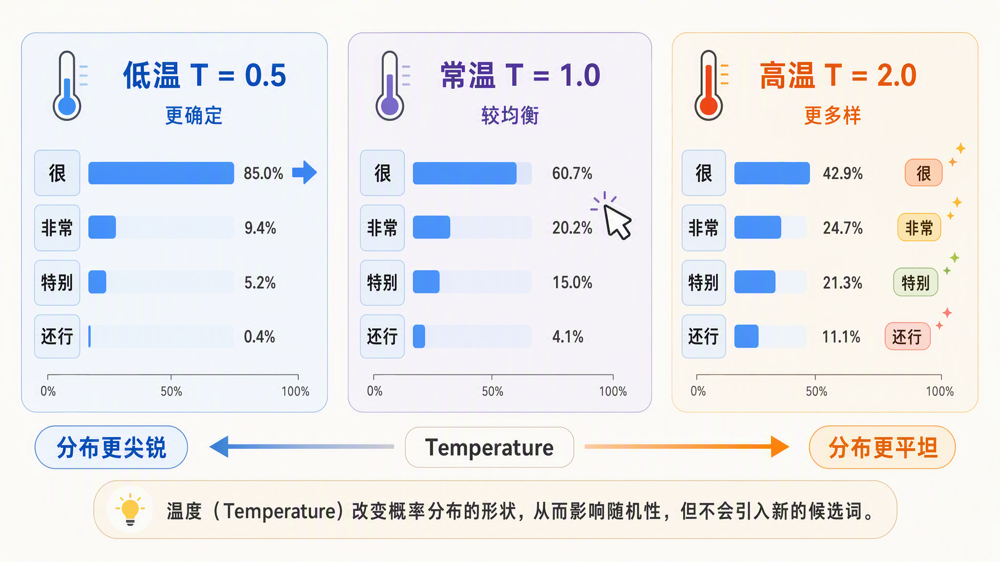
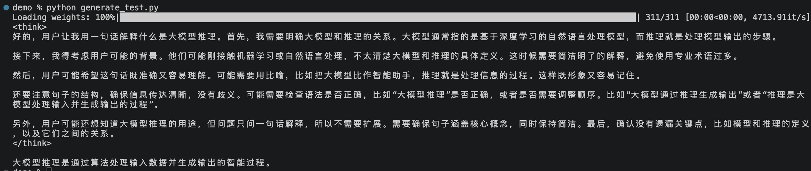

# 大模型推理介绍：从一次提问说起

平时用豆包聊天、用 Claude Code 或 Codex 写代码，几乎成了每天的日常。但每次敲下回车之后，从第一个字蹦出来到整段回答写完，中间到底走过了哪些环节，我之前其实一直说不太清楚。最近在系统补大模型推理和训练相关的知识，于是想写一个系列，顺便记录下学习过程中的笔记，争取把整条链路梳理清楚。

越看越觉得，推理这件事被低估了。训练一个大模型是一次性投入；但是模型上线之后，每一次用户提问产生的推理开销却是日复一日、持续累积的。行业分析估计，企业 AI 的 GPU 预算里 [55% 到 80% 花在了推理上](https://www.spheron.network/blog/ai-inference-cost-economics-2026/)。对一个有真实流量的产品来说，上线几周内，推理的累计算力就会超过训练。训练决定了模型能做到什么，推理决定了用户每天实际用到什么。所以 [vLLM](https://github.com/vllm-project/vllm)、[SGLang](https://github.com/sgl-project/sglang)、[llama.cpp](https://github.com/ggml-org/llama.cpp) 这些名字才会一次次出现在技术圈的讨论里。大家争的，其实都是怎么把推理跑得更快、更省、更能扛并发。

这个系列我们就来系统地学习大模型推理相关的知识。今天是第一篇，先不急着抠细节，而是回答一个最基本的问题：你在对话框里敲下一句话、按下回车，到第一个字跳出来、再到回答逐字生成完毕，这中间到底发生了什么？我们会把一次请求的完整旅程走一遍，画出一张全系列的地图；后面每篇文章，就对应地图上的一个环节。

## 什么是推理

**推理（Inference）** 指的是训练好的模型根据输入生成输出的过程。和它相对的概念是 **训练（Training）**，两者的区别可以用一张表说清楚：

| 对比项 | 训练 | 推理 |
| ---- | ---- | ---- |
| 目的 | 调整模型权重，让模型学会规律 | 用固定的权重生成结果 |
| 计算方式 | 前向计算 + 反向传播 + 权重更新 | 只做前向计算 |
| 权重状态 | 每步都在变 | 全程不变 |
| 发生频率 | 一次性或周期性 | 每次用户请求都在发生 |
| 典型用户 | 模型研发工程师 | 所有使用模型的人 |

简单来说，训练是造模型，推理是用模型。训练时模型要算梯度、更新参数，一次训练动辄占用几千张 GPU 跑上几周甚至几个月；推理时权重已经固定，每次只是把输入送进网络做一遍前向计算，拿到下一个词的预测。

> 表格里提到的三个词稍微展开一下。**前向计算（Forward Pass）** 是把输入从网络第一层逐层算到最后一层，得到预测结果的过程，训练和推理都要做这一步。**反向传播（Backpropagation）** 是拿预测结果和正确答案算出差多少，再沿着网络倒着把这个误差分摊到每个权重上，算出每个权重各自该负多少责任，也就是梯度。**权重更新（Weight Update）** 则是优化器根据梯度把权重往误差更小的方向挪一小步，模型就是这样一点点「学会」的。这三步组成训练的一次迭代，反复进行成千上万次；而推理只保留第一步，后面两步都不需要，这正是两者计算量差距悬殊的原因。

对绝大多数人来说，推理就是接触大模型的唯一方式。你打开豆包聊天、用 Claude Code 写代码、调用 API 做文本分类，背后发生的都是推理。这个系列研究的对象，就是这个每天被调用亿万次的过程。

从成本结构上看，训练和推理还有一个不对称的地方。训练再贵也是一次性投入，花完就花完了；推理的单价很低，一次请求可能只有几厘钱，但它随着用户量线性增长，永不停歇。一个模型越成功、用户越多，推理的累计开销就越大，最终远远超过当初的训练成本。



## 一次请求的完整旅程

现在我们跟着一个请求走一遍。假设你在对话框里输入「合肥今天天气怎么样」，按下回车之后，请求会依次经过下面这些环节：



我们逐一看看每个环节在做什么。

### 分词：文本变成 token

模型不认识自然语言，它只认识数字。所以第一步是 **分词（Tokenization）**，把输入文本切成一串 **token（词元）**，每个 token 对应词表里的一个编号。token 可以是一个字、一个词、一个标点，甚至半个词。比如「合肥今天天气怎么样」用 Qwen3 的分词器会切成 4 个 token，而同样意思的英文 How is the weather in Hefei today 要切出 9 个。

感兴趣的话可以运行下面几行代码，就能看到切分结果：

```python
from transformers import AutoTokenizer

tokenizer = AutoTokenizer.from_pretrained("Qwen/Qwen3-0.6B")

for text in ["合肥今天天气怎么样", "How is the weather in Hefei today"]:
    ids = tokenizer.encode(text)
    # 对每个 token id 做 decode，把字节级表示还原成可读的文本片段
    tokens = [tokenizer.decode([i]) for i in ids]
    print(len(tokens), tokens)

# 4 ['合肥', '今天', '天气', '怎么样']
# 9 ['How', ' is', ' the', ' weather', ' in', ' H', 'ef', 'ei', ' today']
```

可以看到中文按词切得很整，「合肥」整体是一个 token；而英文的 Hefei 因为不在常见词表里，被拆成了 H、ef、ei 三个碎片，token 数一下子多出不少。这也是为什么同样的语义，不同语言的推理成本会不一样。

分词是文本世界和模型世界之间的翻译官，它直接影响模型能处理的上下文长度、推理的成本核算（API 都按 token 计费），甚至影响模型在某些语言上的表现。这个话题比想象中深，我们下一篇专门来讲这块。

### Prefill：一口气读完问题

分词之后进入 **Prefill（预填充）** 阶段。模型一次性并行处理输入的全部 token，算出每个位置的表示，并生成第一个新 token。这个阶段的特点是输入一次性给齐，可以充分并行计算，所以它是 **计算密集型（compute-bound）** 的，GPU 的算力利用率很高。你按下回车之后等待第一个字出现的那段时间，主要就是 Prefill 花掉的。

那 Prefill 具体在算什么？要先知道，Transformer 模型不是一个单独的网络，而是几十层结构相同的 **层（Layer）** 叠起来的，比如 Qwen3-0.6B 就有 28 层，输入从第一层进去，逐层加工，从最后一层出来。每一层做的核心工作是 **自注意力（Self-Attention）**，粗略理解就是：让每个 token 都和序列里的其他 token「对一遍话」，吸收上下文信息之后更新自己的表示。

口说无凭，我们把模型加载进来，亲眼看看这些层：

```python
from transformers import AutoModelForCausalLM

model = AutoModelForCausalLM.from_pretrained("Qwen/Qwen3-0.6B")

# 模型一共有多少层
print(model.config.num_hidden_layers)

# 打印第 0 层，看看一层里面都有什么
print(model.model.layers[0])
```

运行结果如下：

```
28
Qwen3DecoderLayer(
  (self_attn): Qwen3Attention(
    (q_proj): Linear(in_features=1024, out_features=2048, bias=False)
    (k_proj): Linear(in_features=1024, out_features=1024, bias=False)
    (v_proj): Linear(in_features=1024, out_features=1024, bias=False)
    (o_proj): Linear(in_features=2048, out_features=1024, bias=False)
    (q_norm): Qwen3RMSNorm((128,), eps=1e-06)
    (k_norm): Qwen3RMSNorm((128,), eps=1e-06)
  )
  (mlp): Qwen3MLP(...)  # 省略 MLP 部分
  (input_layernorm): Qwen3RMSNorm((1024,), eps=1e-06)
  (post_attention_layernorm): Qwen3RMSNorm((1024,), eps=1e-06)
)
```

可以看到，这里的 `model.model.layers` 是一个 28 个元素的列表，每个元素都是结构完全相同的 `Qwen3DecoderLayer`。往一层里面看，`self_attn` 就是自注意力模块，它下面的 `q_proj`、`k_proj`、`v_proj` 正是下文要讲的 W_Q、W_K、W_V 三个权重矩阵。

> 「自注意力」的 **自（Self）** 是相对于早期注意力机制说的：以前的注意力是让一个序列去关注另一个序列（比如翻译时让译文关注原文），而自注意力是让每个 token 去关注 **同一个序列里** 的其他 token。拿「合肥今天天气怎么样」来说，「天气」的表示会吸收「合肥」和「今天」的信息，从而知道这里问的是某地某时的天气而不是别的。每一层都做一遍这样的信息交换，层数越深，token 的表示就吸收越多的上下文。

那么，每个 token 具体是怎么和其他 token「对一遍话」的呢？分两步。第一步是 **查嵌入表（Embedding）**：模型里存着一张大表，词表里每个 token 编号对应一行向量，Qwen3-0.6B 的词表有 151936 个 token，每行是一个 1024 维的向量，查表就把 token 编号变成了它的初始表示。第二步是 **乘权重矩阵**：每一层都有自己训练好的三个矩阵 W_Q、W_K、W_V，把每个 token 的向量分别乘上去，得到查询（Q）、键（K）、值（V）三个向量。然后每个 token 拿自己的 Q 去和序列里所有 token 的 K 做匹配，按匹配程度对所有的 V 加权求和，就得到了「读过上下文之后」的新表示。

> Q、K、V 这三个向量可以用查资料来类比：**查询（Query）** 是当前 token 提出的问题「我想找和我相关的信息」；**键（Key）** 是每个 token 挂在门口的标签「我这里有关于什么的信息」；**值（Value）** 则是 token 实际携带的内容。拿「天气」的 Q 去和所有 token 的 K 逐个比对，「合肥」「今天」的标签对得上，匹配分数就高，于是它们的 V 就以更大的权重被加进来。

实际模型里，Q、K、V 通常会被拆成多份并行计算。以 Qwen3-0.6B 为例，Q 被拆成 16 份各 128 维（也就是 16 个注意力头），K 和 V 各拆成 8 份 128 维，每个头独立做一遍匹配，最后再把结果拼回去。多头的好处是不同的头可以各看各的角度，有的关注语法，有的关注指代。

上面提到的这些数字，同样可以从模型的 config 里直接读到：

```python
config = model.config
print(config.vocab_size)           # 151936，词表大小
print(config.hidden_size)          # 1024，嵌入向量的维度
print(config.num_attention_heads)  # 16，Q 的注意力头数
print(config.num_key_value_heads)  # 8，K、V 的注意力头数
print(config.head_dim)             # 128，每个头的维度
```

对照上面打印的层结构验算一下：q_proj 的输出维度 2048 = 16 × 128，k_proj、v_proj 的输出维度 1024 = 8 × 128，正好分别是 Q 和 K、V 所有头拼起来的大小。

Prefill 结束时有两个产物：一个是最后一个位置预测出的第一个新 token；另一个是所有 token 在所有层上算好的 K、V 向量，它们被存进显存，就是后面反复提到的 **KV Cache（键值缓存）**。有了这个缓存，Decode 阶段每生成一个新 token，只需要算它自己的 Q、K、V，再回头查缓存里历史 token 的 K、V 就行，不用把整个输入重算一遍。可以说 Prefill 的一项重要职责就是为 Decode 备好这份缓存。

> 为什么缓存只存 K 和 V 不存 Q？因为历史 token 只需坐等被查询，Q 只在「主动发问」的那一步才用得上。

回过头看，为什么说 Prefill 是计算密集型的？因为输入 token 一次性到齐，上面这些 Q、K、V 的计算和注意力匹配全都是大矩阵乘法，恰好是 GPU 的 **Tensor Core**（张量核心，GPU 里专门做矩阵乘法的硬件单元）最擅长的活儿，算力能被充分利用。但凡事有代价：注意力要求每个 token 和每个 token 打交道，这部分的计算量随输入长度近似 **平方增长**。prompt 从几千 token 涨到几万 token，注意力的计算量不是涨十倍而是涨上百倍。这也是为什么喂给模型一本小说和问它一句话，首 token 的等待时间完全是两个量级。

于是围绕 Prefill 出现了一批专门的优化技术。比如 **Chunked Prefill（分块预填充）** 把超长输入切成小块，穿插在 Decode 步骤之间分批算，避免一个长 prompt 把其他用户的生成卡住；**Prefix Caching（前缀缓存）** 则把多个请求共享的 prompt 前缀（比如同一份系统提示词）的 KV Cache 直接复用，跳过重复的 Prefill 计算。这些技术后面在学 KV Cache 和推理引擎调度时再细说，这里先了解一下。

### Decode 循环：逐 token 生成

接下来是最关键也最容易被误解的部分。大语言模型本质上只做一件事：给定前面的 token 序列，预测下一个 token。所以生成回答不是一次性算出来的，而是一个循环：

1. 模型根据已有序列预测下一个 token
2. 把这个 token 拼到序列末尾
3. 用新序列再预测下一个
4. 重复以上步骤，直到生成结束标记或达到长度上限

这个逐 token 生成的过程叫 **Decode（解码）**，这种一个接着一个的生成方式叫 **自回归生成（Autoregressive Generation）**。下面这张时序图可以看出 Prefill 和 Decode 的关系：



和 Prefill 不同，Decode 每一步只算一个 token。Prefill 时输入一次性到齐，权重从显存读出来一次能被所有输入 token 复用；而 Decode 每步只有一个新 token，大矩阵乘法退化成矩阵乘向量，计算量很小，但每一步仍然要把全部模型权重和攒下来的 KV Cache 完整读一遍。时间花在「读」上而不是「算」上，GPU 的算力大量闲置，所以它是 **访存密集型（memory-bound）** 的。这就是为什么你在聊天界面里看到的回答是一个字一个字往外蹦的，不是模型在模仿人打字，而是它真的就是这样工作的。

值得注意的是，解码过程中 KV Cache 还在不断变大，每个新 token 都要在每一层留下自己的 K、V。占多少显存，用前面打印的 config 就能算出来：

```python
kv_per_token = 2 * config.num_hidden_layers * config.num_key_value_heads * config.head_dim * 2
print(kv_per_token / 1024, "KB")  # 112.0 KB
```

式子里第一个 2 是 K 和 V 两份，最后的 2 是 bf16 每个元素占的字节数。也就是说每生成一个 token，KV Cache 就涨 112 KB；一轮对话生成 2000 个 token，光缓存就要 200 多 MB，接近模型权重（约 1.2 GB）的五分之一了。上下文越长、生成越长，显存吃得越多，显存容量也因此成了推理服务能扛多少并发的关键约束。

既然瓶颈在读权重，优化思路也很直接：让读一遍权重服务尽可能多的 token。把多个用户的请求凑成一批一起跑，同一份权重读出一次，就能同时算出几十个请求的下一个 token。vLLM 的 **Continuous Batching（连续批处理）** 走的就是这条路。

> Prefill 和 Decode 一个吃算力、一个吃带宽，两者的优化思路完全不同。[NVIDIA Dynamo](https://github.com/ai-dynamo/dynamo) 这类新框架甚至把它们拆到不同的 GPU 上分别部署，这就是所谓 PD 分离（Prefill-Decode Disaggregation）。

### 采样：从概率分布里挑一个词

模型每一步输出的其实不是一个确定的词，而是词表里每个 token 的一个分数，这个分数叫 **logits**。logits 是模型最后一层直接算出来的原始数值，可以是任意实数，有正有负，本身没有概率含义，只有相对大小：分数越高，说明模型越倾向于选这个 token。要把分数变成概率，需要过一遍 **softmax**：先对每个分数取指数，让负数也变成正数，同时放大分数之间的差距；再除以所有指数值的总和做归一化，让结果加起来正好等于 1。这样，十几万个候选 token 就各自带上了一个概率值。从这个分布里决定到底用哪个 token 的过程就是 **采样（Sampling）**。

最简单的策略是每次直接选概率最高的那个，也就是 **贪心（Greedy）** 策略。不过更多时候我们会引入随机性：按概率抽一个，概率大的被抽中的机会大，但长尾里的 token 也有机会出场。分布的形状可以用 `temperature` 调节，它的作用是在 softmax 之前把 logits 除以一个系数。用几行 Python 感受一下，这里不用真跑模型，随手编几个分数：

```python
import math

# 假设模型给下一个 token 算出的分数是这样的
logits = {"很": 3.2, "非常": 2.1, "特别": 1.8, "还行": 0.5}

def softmax(scores, temperature=1.0):
    exp = [math.exp(s / temperature) for s in scores]
    return [e / sum(exp) for e in exp]

for t in [0.5, 1.0, 2.0]:
    probs = softmax(logits.values(), t)
    print(f"temperature={t}", {k: round(p, 3) for k, p in zip(logits, probs)})
```

这段代码的关键是 `softmax` 函数，里面两行对应三步操作：

1. `s / temperature`：每个分数先除以温度，温度小于 1 相当于把分数差距放大，大于 1 相当于把差距压小
2. `math.exp(...)`：对缩放后的分数取指数，这是 softmax 的第一半。e 的任何实数次方都大于 0（e⁰ = 1，负数次方是 0 到 1 之间的小数），所以负分也被映射成了正数，同时分数之间的差距被进一步拉大
3. `e / sum(exp)`：每个指数值除以总和，归一化成概率，这是 softmax 的第二半，保证所有候选加起来等于 1

下面的循环用三个温度各算一遍，对比分布形状的变化。输出结果如下：

```
temperature=0.5 {'很': 0.85, '非常': 0.094, '特别': 0.052, '还行': 0.004}
temperature=1.0 {'很': 0.607, '非常': 0.202, '特别': 0.15, '还行': 0.041}
temperature=2.0 {'很': 0.429, '非常': 0.247, '特别': 0.213, '还行': 0.111}
```

用一张图表示，看起来更直观：



可以看到，`temperature` 小于 1 时分布变尖，头部 token 几乎垄断，输出更稳定；大于 1 时分布变平，长尾 token 的机会变多，输出更发散。贪心可以理解成 `temperature` 趋近于 0 的极限情况。除了它，常用的还有 `top_k`（只在分数最高的 k 个里抽）和 `top_p`（按概率从高到低累加，累计到 p 就截断，也叫核采样），实际使用时经常几个参数组合在一起。同样的模型、同样的问题，回答有时稳定有时发散，差别往往就在这些采样参数上。

> 这里的 `temperature` 在数学上可以是任意正数，但是各个平台都有自己允许的取值范围：OpenAI 和 Gemini 是 0 到 2，Anthropic 限制在 0 到 1，阿里百炼是 [0, 2)，本地用 transformers 跑则没有限制，平时在使用时注意一下。

### 反分词与流式输出

采样得到的还是 token 编号，需要 **反分词（Detokenization）** 把它还原成人类可读的文字。这一步在流式场景下有个必须处理的坑。Qwen、Llama 这些模型用的都是字节级 BPE（Byte Pair Encoding，字节对编码）分词器，一个 token 不一定正好是一个完整字符，可能只是某个汉字 UTF-8 编码三个字节里的一两个。如果每收到一个 token 就 decode 一次，拼出来的就是乱码。拿 Qwen3 的分词器试一下：

```python
ids = tokenizer.encode("龘")
print(ids)                                  # [82912, 246]，一个汉字被切成两个 token
print([tokenizer.decode([i]) for i in ids]) # ['�', '�']，单独 decode 都是乱码
print(tokenizer.decode(ids))                # '龘'，拼在一起才能正确还原
```

所以推理引擎做的是 **增量反分词**：收到新 token 后先把字节攒着，凑够一个完整字符再往外发。

由于 Decode 是逐 token 进行的，推理服务可以边生成边把结果推给前端，这就是 **流式输出（Streaming）**。工程上一般通过 SSE（Server-Sent Events，一种服务端持续推送数据的 HTTP 机制）实现：服务端每产出一个 token 就推送一条消息，客户端收到一条就渲染一点。它不改变生成的总耗时，但极大改善了等待体验：第一个字出来你就能开始读，而不是盯着空白屏幕等整段回答算完。你在各类聊天产品里看到的打字机效果，源头就在这里。

## 推理初体验

这一节我们用 [Hugging Face transformers](https://huggingface.co/docs/transformers/) 加载一个小模型 [Qwen/Qwen3-0.6B](https://huggingface.co/Qwen/Qwen3-0.6B)，动手体验一次推理，代码只要十几行：

```python
from transformers import AutoModelForCausalLM, AutoTokenizer

# 1. 加载分词器和模型
model_name = "Qwen/Qwen3-0.6B"
tokenizer = AutoTokenizer.from_pretrained(model_name)
model = AutoModelForCausalLM.from_pretrained(model_name)

# 2. 分词：文本变成 token 编号
messages = [{"role": "user", "content": "用一句话解释什么是大模型推理"}]
text = tokenizer.apply_chat_template(messages, tokenize=False, add_generation_prompt=True)
inputs = tokenizer(text, return_tensors="pt")

# 3. 生成：Prefill + Decode 循环都在这一步里
outputs = model.generate(**inputs, max_new_tokens=1024)

# 4. 反分词：token 编号还原成文本
response = tokenizer.decode(outputs[0][inputs.input_ids.shape[1]:], skip_special_tokens=True)
print(response)
```

这段代码和我们上面讲的旅程是一一对应的：

1. **加载**：分词器负责文本和 token 的互转，模型则是训练好的权重
2. **分词**：`tokenizer` 把输入文本编码成 token 编号张量
3. **生成**：`model.generate` 内部先 Prefill 处理输入，再进入自回归的 Decode 循环，每步生成一个 token 并采样
4. **反分词**：`tokenizer.decode` 把新生成的 token 还原成文字

运行之后终端里会打印出模型的回答：



也可以加个流式输出，亲眼看着 token 一个一个生成出来。把第 3、4 步换成下面这样：

```python
from transformers import TextStreamer

# 流式生成：每产出一个 token 就立刻解码打印
streamer = TextStreamer(tokenizer, skip_special_tokens=True)
outputs = model.generate(**inputs, max_new_tokens=1024, streamer=streamer)
```

`TextStreamer` 会在 Decode 循环的每一步把新生成的 token 立刻反分词并打印到终端，这就是流式输出在最朴素环境下的样子。

生产环境里更常见的做法是把模型部署成一个服务，客户端通过 OpenAI 兼容接口调用，比如用 `curl` 发一个请求：

```bash
$ curl http://localhost:8000/v1/chat/completions \
  -H "Content-Type: application/json" \
  -d '{
    "model": "Qwen/Qwen3-0.6B",
    "messages": [{"role": "user", "content": "用一句话解释什么是大模型推理"}],
    "stream": true
  }'
```

加上 `stream: true` 之后，服务端会用 SSE 把每个 token 逐个推回来。至于本地怎么把模型跑成一个 OpenAI 兼容的服务，vLLM、SGLang、llama.cpp 都能做到，在后面的系列文章中我们会专门学习。

## 小结

今天这篇文章完成了两件事：

1. **建立了概念**：推理是训练好的模型根据输入生成输出的过程，权重固定、只做前向计算，它是绝大多数用户真正接触模型的方式，也是当前 AI 算力开销的大头
2. **画出了地图**：一次请求的完整旅程是分词、Prefill、Decode 循环、采样、反分词、流式输出，每个环节我们后续都会单开文章细讲

接下来的文章会沿着这张地图逐站展开，下一篇我们就走进地图的第一站，看看分词这件看起来简单、但是实际上又没那么简单的事。我们明天继续。

## 参考

* [Spheron：2026 年 AI 推理成本经济学](https://www.spheron.network/blog/ai-inference-cost-economics-2026/)
* [vLLM GitHub 仓库](https://github.com/vllm-project/vllm)
* [SGLang GitHub 仓库](https://github.com/sgl-project/sglang)
* [llama.cpp GitHub 仓库](https://github.com/ggml-org/llama.cpp)
* [Hugging Face transformers 官方文档](https://huggingface.co/docs/transformers/)
* [Qwen/Qwen3-0.6B 模型页](https://huggingface.co/Qwen/Qwen3-0.6B)
* [Redis：Prefill vs Decode 详解](https://redis.io/blog/prefill-vs-decode/)
* [WEKA：Prefill 和 Decode 阶段的区别](https://www.weka.io/learn/ai-ml/prefill-and-decode/)
* [Sarathi-Serve：Chunked Prefill 论文](https://arxiv.org/abs/2308.16369)
* [论文：KV Cache 管理策略对比研究](https://arxiv.org/html/2604.05012v1)
* [论文：字节级分词器与非法 UTF-8 问题](https://openreview.net/pdf?id=j2hH02UVch)
* [NVIDIA Dynamo GitHub 仓库](https://github.com/ai-dynamo/dynamo)
* [LLM Temperature、Top-P、Top-K 详解](https://machinelearningplus.com/gen-ai/llm-temperature-top-p-top-k-explained/)
* [Vellum：各平台 temperature 参数范围对比](https://www.vellum.ai/llm-parameters/temperature)
