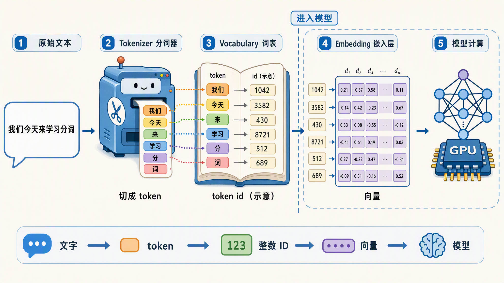
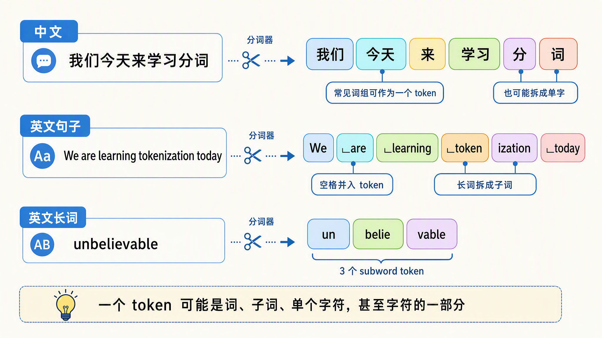
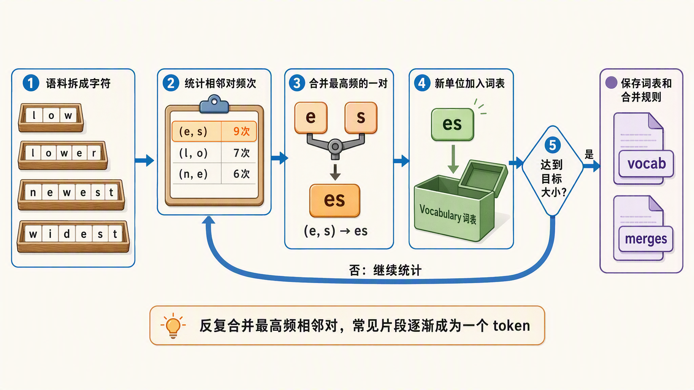
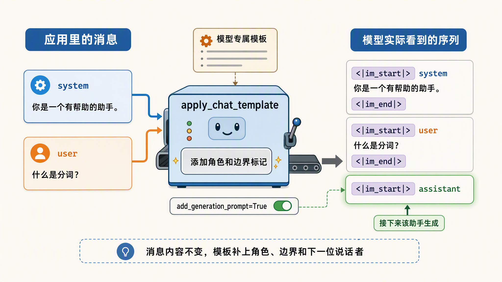
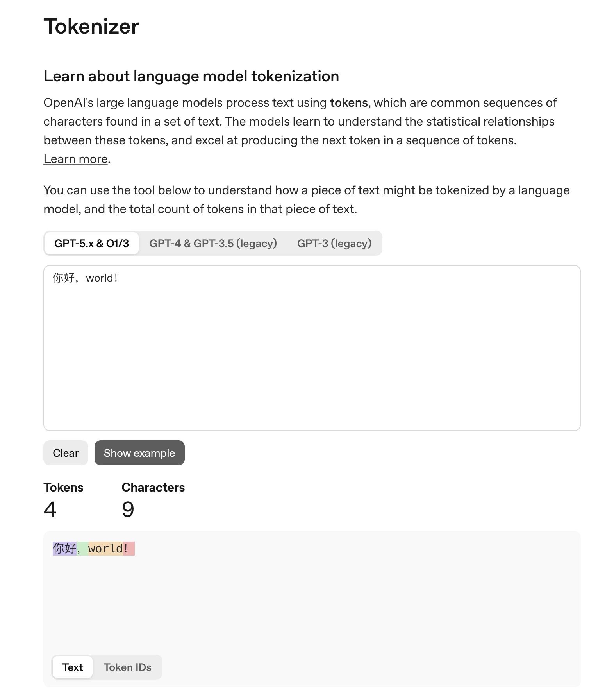

# 学习大模型推理的分词：从文本到 Token

在上一篇中，我们把一次请求的完整旅程走了一遍，画出了整个系列的地图：你敲下的一句话先经过分词变成 token 序列，然后模型在 Prefill 阶段一口气读完问题，接着进入 Decode 循环一个 token 一个 token 地生成回答，每一步还要经过采样挑出下一个词，最后反分词把 token 还原成文字流式返回给你。

今天我们从地图的第一站开始，把分词这个环节单独拿出来学习。

## 为什么需要分词

神经网络的计算基本都是矩阵乘法，输入必须是一串数字。但用户给的是自然语言文本，中间需要一座桥把文字翻译成数字，这座桥就是**分词（Tokenization）**。分词做两件事：先把文本切成一个个片段，每个片段叫一个 token；再查一张对照表，把每个 token 换成一个整数编号，也就是 token id。

这张对照表叫**词表（Vocabulary）**，它在模型训练之前就定好了，训练完成后固定不变。词表里的每个 id 对应模型嵌入层里的一行向量，模型实际读进去的就是这些向量。嵌入层的内容我们留到下一篇讲，今天只需要知道 id 是文本和模型之间的中间货币。

光说对照表可能有点抽象，直接打开它看看。用 Hugging Face transformers 库的 `AutoTokenizer` 加载分词器，模型选 Qwen3 系列最小的 [Qwen3-0.6B](https://huggingface.co/Qwen/Qwen3-0.6B)，只下载分词器配置，10 MB 出头，不用下载模型权重：

```python
from transformers import AutoTokenizer

# 加载 Qwen3-0.6B 的分词器
tokenizer = AutoTokenizer.from_pretrained("Qwen/Qwen3-0.6B")

# 词表就是一个「token 文本 → id」的大字典
vocab = tokenizer.get_vocab()
print(len(vocab))

# 按 id 排序，看看队头和队尾
vocab_by_id = sorted(vocab.items(), key=lambda kv: kv[1])
print(dict(vocab_by_id[:10]))
print(dict(vocab_by_id[-3:]))
```

运行结果：

```text
151669
{'!': 0, '"': 1, '#': 2, '$': 3, '%': 4, '&': 5, "'": 6, '(': 7, ')': 8, '*': 9}
{'</tool_response>': 151666, '<think>': 151667, '</think>': 151668}
```

可以看到，词表就是一个 15 万多个条目的大字典。排在最前面的是标点符号这些 ASCII 字符，id 从 0 开始；排在最后面的是 `<think>` 这种不对应自然语言的条目，它们属于特殊 token，后面会专门讲。

细心的读者可以顺手试试 `vocab["你好"]`，会发现查不到，报 KeyError 错误。这是因为词表的 key 并不是中文词汇，而是把 UTF-8 字节逐字节映射成可打印字符后的形式（GPT-2 传下来的做法，这样词表文件里不会出现不可见字符），比如「你好」的 6 个字节 `b'\xe4\xbd\xa0\xe5\xa5\xbd'` 映射后的 key 是 `'ä½łå¥½'`，可以用 `tokenizer.tokenize("你好")` 来查。

> 还有一个细节：词表条目是 151669，而上一篇 config 里的 `vocab_size` 是 151936。前者是分词器词表的条目数，后者是嵌入表的行数，多出来的 267 行没有对应的 token，是把嵌入表凑成 128 的倍数做对齐的预留位，实际用不到。

整个过程可以用一张图概括：



分词这一步发生在模型之外，由一个叫**分词器（Tokenizer）**的独立组件完成。每个模型发布时都会带上自己专属的分词器，不同模型的词表不一样，切分结果也不一样，所以分词器和模型必须配套使用，不能混着用。

## Token 不一定是字或词

刚接触这个概念时，很多人会默认一个 token 就是一个字或者一个单词，其实都不是。**Token（词元）** 是分词器切出来的最小单位，它可能是整个词、词的一部分、单个字符，甚至字符的一部分。

我们用刚才加载的 Qwen3 分词器跑几个真实例子：

```python
texts = ["我们今天来学习分词", "We are learning tokenization today", "unbelievable"]
for text in texts:
    ids = tokenizer.encode(text)
    # 逐个 decode 出 token 片段，把空格换成 ␣ 方便看
    tokens = [tokenizer.decode([i]).replace(" ", "␣") for i in ids]
    print(f'"{text}" → {len(ids)} 个 token：{" / ".join(tokens)}')
```

运行结果：

```text
"我们今天来学习分词" → 6 个 token：我们 / 今天 / 来 / 学习 / 分 / 词
"We are learning tokenization today" → 6 个 token：We / ␣are / ␣learning / ␣token / ization / ␣today
"unbelievable" → 3 个 token：un / belie / vable
```

可以看到几个规律：

* **常见中文词组是一个整体**：「我们」「今天」「学习」各自占一个 token，但不太常见的组合会被拆开，「分词」就拆成了「分」和「词」
* **常见英文单词是一个 token**，长词会被拆成**子词（Subword）**：tokenization 拆成 token 和 ization，unbelievable 拆成三段
* **空格是有意义的**：英文里单词前的空格通常会并进 token，上面用 ␣ 标出了空格，比如「␣today」整体是一个 token



中英文的差异尤其值得关注。早期针对英文优化的分词器处理中文很浪费，一个汉字可能占 2 到 3 个 token；现在主流的多语言分词器（比如 Qwen 用的）对中文友好了很多，常见汉字和词组大约 1 个 token，生僻字仍然会拆得更碎。

这不是一个纯学术问题。API 计费按 token 算，上下文长度按 token 算，速率限制也按 token 算。同样一段话用中文写还是用英文写，token 数量可能差出一截，账单也跟着差一截。估算成本时拿字数当 token 数，是会算错的。

## BPE：从数据压缩借来的算法

那分词器是怎么决定在哪里下刀的？目前主流大模型用的都是 **BPE（Byte Pair Encoding，字节对编码）** 或者它的变体。

BPE 的历史有点意思。它本来是 Philip Gage 在 1994 年提出的一个数据压缩算法，和自然语言处理没有关系。2016 年，Sennrich 等人在一篇机器翻译论文里把它改造成了子词切分方法，用来解决翻译模型遇到生僻词就抓瞎的问题，这篇论文后来拿了 ACL 2026 的 Test of Time 奖。2019 年 GPT-2 又把它改造成**字节级 BPE（Byte-level BPE）**：不再以字符为起点，而是以 256 个字节为初始词表。这么一改，任何语言、任何符号、任何 emoji 都能被表示，彻底不会出现分词器不认识某个字的情况。

> BPE 论文全名是 Neural Machine Translation of Rare Words with Subword Units，arXiv 编号 [1508.07909](https://arxiv.org/abs/1508.07909)。想了解从零实现一个 BPE 分词器长什么样，可以看 [Sebastian Raschka 的 BPE from scratch](https://sebastianraschka.com/blog/2025/bpe-from-scratch.html) 一文。

BPE 的核心思路就一句话：**反复把语料里出现最频繁的相邻两个单位合并成一个新单位，直到词表达标**。训练分词器的过程就是学出一张合并规则表，分词时按同样的规则顺序套用到新文本上。

用一个具体例子演示。假设我们的全部训练语料只有四个词：low 出现 5 次，lower 出现 2 次，newest 出现 6 次，widest 出现 3 次。初始状态每个词拆成单个字符，词尾加一个特殊标记表示单词结束：

```text
low    → l o w </w>     （5 次）
lower  → l o w e r </w> （2 次）
newest → n e w e s t </w>（6 次）
widest → w i d e s t </w>（3 次）
```

然后开始循环：统计所有相邻对的出现次数，把最高频的一对合并，加入词表。前几轮的过程如下：

| 轮次 | 最高频相邻对 | 合并结果 | 出现次数 |
| ---- | ----------- | ------- | ------- |
| 1 | (e, s) | es | 9 |
| 2 | (es, t) | est | 9 |
| 3 | (l, o) | lo | 7 |
| 4 | (lo, w) | low | 7 |
| 5 | (n, e) | ne | 6 |
| 6 | (ne, w) | new | 6 |
| 7 | (new, est) | newest | 6 |

> 表里省略了和词尾标记 `</w>` 的合并，比如 (est, `</w>`) 出现 9 次，实际顺序里它就排在第 3 轮，为了演示直观，我就去掉了。

几轮之后，est、low、newest 这些高频片段各自成了词表里的整体 token。训练好的分词器遇到新文本时，按学好的合并顺序逐条套用。最有价值的情况是遇到没见过的词，比如 slowest：s 开头的部分没有对应规则，退回单个字符，但后半段 low 和 est 都在词表里，最终切成 s + low + est。这就是子词切分的精髓：常见词走整体，生僻词拆成熟悉的零件，永远不会无法表示。

真实模型的词表规模远大于这个玩具例子。GPT-2 的词表是 50257 个 token，Qwen3 是 15 万多个。词表大，常见词和词组都能整体表示，同样文本切出来的 token 数就少，推理更省；但词表越大嵌入层参数越多，词表里冷门 token 的训练也越不充分，所以规模是权衡出来的。

整个训练循环可以画成这样：



保存下来的这两个文件就在模型仓库里，随分词器一起下发：

```
$ ls  ~/.cache/huggingface/hub/models--Qwen--Qwen3-0.6B/snapshots/* 
config.json             merges.txt              tokenizer_config.json   vocab.json
generation_config.json  model.safetensors       tokenizer.json
```

这 7 个文件分两组，4 个属于分词器，3 个属于模型：

| 文件 | 是什么 |
| ---- | ---- |
| `vocab.json` | 词表，token（字节映射形式）到 id 的对照表 |
| `merges.txt` | 合并规则表 |
| `tokenizer.json` | 前两个文件的打包加强版，还包含预分词规则和特殊 token 定义，fast tokenizer 实际加载的是它 |
| `tokenizer_config.json` | 分词器配置，包括特殊 token 的名字和聊天模板，后面聊天模板一节还会见到它 |
| `config.json` | 模型结构配置，上一篇已经见过 |
| `generation_config.json` | 生成的默认参数，temperature、top_p 这些的出厂值 |
| `model.safetensors` | 模型权重本体，1.5 GB，推理的主角 |

只跑分词实验的话，`AutoTokenizer` 只需要前 4 个文件，总共 10 MB 出头；后 3 个是上一篇跑模型推理时下载的，和分词无关。

词表我们前面已经看过了，那么真实的合并规则长什么样呢？不妨打开 `merges.txt` 文件瞧瞧，它的开头是这样的：

```text
#version: 0.2
Ġ Ġ
ĠĠ ĠĠ
i n
Ġ t
...
e r
...
def ine
def ault
```

每行一条规则，两个符号写在一行，表示分词时看到这两个相邻的单位就合并成一个，比如 `i n` 表示 i 后面跟着 n 时合并成 in。`Ġ` 是空格的字节映射形式，`Ġ t` 就是「空格加 t 合并成 ␣t」。可以看到后面还有 def ine、def ault 这种明显从代码语料里学出来的规则。**顺序就是优先级**：训练时越早学出的合并排得越靠前，分词新文本时从字节开始，反复挑当前序列里排名最靠前的对子来合并，保证切分结果和训练时的学习顺序一致。上面玩具例子里那张 7 轮的表，就是一个迷你版的 `merges.txt`。

## 用 transformers 观察分词

下面我们再来看一个示例，看看这个分词器面对一句中英文混合、还带标点 emoji 的话会怎么切：

```python
from transformers import AutoTokenizer

# 加载 Qwen3-0.6B 的分词器
tokenizer = AutoTokenizer.from_pretrained("Qwen/Qwen3-0.6B")

text = "你好，world！今天的 weather 真不错 😊"

# encode：文本 → token id 序列
ids = tokenizer.encode(text)
print(ids)

# 逐个看每个 token 对应的文本片段
for i in ids:
    print(i, repr(tokenizer.decode([i])))

# decode：token id 序列 → 还原成文本
print(tokenizer.decode(ids))
```

运行结果如下：

```text
ids: [108386, 3837, 14615, 6313, 106560, 9104, 10236, 250, 253, 100832, 26525, 232]
108386 '你好'
3837 '，'
14615 'world'
6313 '！'
106560 '今天的'
9104 ' weather'
10236 ' �'
250 '�'
253 '�'
100832 '不错'
26525 ' �'
232 '�'
decode: 你好，world！今天的 weather 真不错 😊
```

这 12 个 token 里有几个点值得注意：

* **中文**：「你好」「今天的」「不错」都是整体 token，但「真」连同前面空格这个组合没有对应的合并规则，被拆成了 3 个字节级 token。这不是分词器坏了，而是字节级 BPE 的兜底机制在起作用，词表里没有覆盖的组合会退回到字节表示
* **英文**：world 是整体 token，「 weather」带着前导空格一起算一个 token，和前面说的规律一致
* **标点**：中文逗号和感叹号各自独立成 token
* **emoji**：笑脸连同前面的空格也被拆成了字节级 token，和「真」一样，都是词表没覆盖到组合时退回字节表示的结果

最后一行的 decode 输出和输入一字不差，说明 encode 之后再 decode 可以无损还原。旅程地图里的反分词环节，干的就是 decode 这件事。

## 特殊 token

词表里除了正常文本切出来的 token，还有一类**特殊 token（Special Token）**，刚才词表队尾的 `<think>` 就属于这类。它们不对应任何自然语言文字，作用是充当结构标记，告诉模型一段文本从哪里开始、到哪里结束、哪里是补齐的空白。最常见的三个：

| 特殊 token | 全称 | 作用 |
| --------- | ---- | ---- |
| BOS | Beginning of Sequence | 标记序列开头 |
| EOS | End of Sequence | 标记序列结束，模型生成出它就停止 |
| PAD | Padding | 批处理时把短序列补齐到同样长度 |

其中 EOS 很重要，上一篇讲过 Decode 循环是一个 token 一个 token 地生成，那模型怎么知道该停了？答案就是训练时教会它在回答结束时生成 EOS，推理引擎检测到这个 id 就终止循环。

各家模型用哪些特殊 token、取什么名字并不统一。可以打印出来看看 Qwen3 的情况：

```python
print(tokenizer.bos_token)  # None
print(tokenizer.eos_token)  # <|im_end|>
print(tokenizer.pad_token)  # <|endoftext|>
```

可以看到 Qwen3 没有 BOS，EOS 用的是 `<|im_end|>`，PAD 用的是 `<|endoftext|>`。

## 聊天模板

平时我们在对话框里打字，很容易以为那句话原封不动就进了模型。其实没有。你发出去的每一条消息，都会先被包进一个固定格式里，这个格式就是**聊天模板（Chat Template）**。

聊天模型是在多轮对话数据上训练出来的，训练数据里每轮对话都有明确的角色标记，谁是系统提示、谁是用户、谁是助手，边界清清楚楚。推理时必须用同样的格式包装输入，模型才知道现在轮到谁说话了。用 `apply_chat_template` 看一下 Qwen3 实际拼出来的字符串：

```python
messages = [
    {"role": "system", "content": "你是一个有帮助的助手。"},
    {"role": "user", "content": "什么是分词？"},
]
text = tokenizer.apply_chat_template(
    messages, tokenize=False, add_generation_prompt=True
)
print(text)
```

输出如下：

```text
<|im_start|>system
你是一个有帮助的助手。<|im_end|>
<|im_start|>user
什么是分词？<|im_end|>
<|im_start|>assistant
```

可以看到，每条消息被 `<|im_start|>` 加角色名开头、`<|im_end|>` 结尾包住，最后还追加了一个 `<|im_start|>assistant` 的开头，这就是 `add_generation_prompt=True` 的作用，相当于把话头递给模型：接下来该你说了。模型生成回答后输出 `<|im_end|>`，EOS 检测到，Decode 循环结束。



> 这个格式其实不是 Qwen 自创的，它是 OpenAI 在 2023 年发布 ChatGPT API 时提出的 [ChatML](https://github.com/openai/openai-python/blob/v0.28.1/chatml.md)（Chat Markup Language），im 是 instant message 的缩写。Qwen 系列沿用了这套格式。

不同模型的聊天模板差别很大，比如和 Llama 3 对比一下：

| | Qwen（ChatML 风格） | Llama 3 |
| ---- | ---- | ---- |
| 一轮开始 | `<\|im_start\|>` 加角色名 | `<\|start_header_id\|>` 角色名 `<\|end_header_id\|>` |
| 一轮结束 | `<\|im_end\|>` | `<\|eot_id\|>` |
| 序列开头 | 无 | `<\|begin_of_text\|>` |

功能上等价，写法完全不同。所以不能把 Qwen 的模板套给 Llama 用，格式错了模型表现会明显变差。同样也不能拿这套模板机制去套 base 模型：base 模型训练时没见过 `<|im_start|>` 这些标记，你把对话格式喂给它，它只会顺着往下续写文本，而不是回答你的问题。

> base 模型是预训练完就直接发布的模型，训练目标只有一个：根据上文预测下一个 token。它学的是文本本身的分布，所以只会续写。对话模型（Chat 或 Instruct 模型）是在 base 模型的基础上，再用带角色标记的对话数据做微调和对齐，才学会按格式回答。从模型名字能看出来，比如 Qwen3-0.6B 是对话模型，对应的 Qwen3-0.6B-Base 就是 base 模型。

## 上下文窗口与 token 计数

最后把 token 和两个工程上天天打交道的概念连起来。

第一个是**上下文窗口（Context Window）**，它指模型一次能处理的 token 总数上限，输入加输出一起算。Qwen3-0.6B 原生支持 32K token 的上下文，通过 [YaRN](https://arxiv.org/abs/2309.00071)（一种基于 RoPE 缩放的上下文长度扩展方法）扩展可以到 128K。

第二个是计费。API 厂商按 token 报价，输入输出分开计价。写应用时预估成本、控制超长文本，第一步都是先数 token。数 token 的方法很简单，用模型对应的分词器 encode 一下看长度就行。如果你用的是 OpenAI 的模型，它家开源了一个快速的 BPE 分词库 [tiktoken](https://github.com/openai/tiktoken)，两行就能数出来：

```python
import tiktoken
enc = tiktoken.encoding_for_model("gpt-4o")
print(len(enc.encode("你好，world！")))
```

OpenAI 还提供了一个在线的 [Tokenizer 页面](https://platform.openai.com/tokenizer)，把文本粘进去就能直观看到切分结果和数量，适合不想写代码的时候随手验证：



> 要注意的是 tiktoken 只适用于 OpenAI 自家模型，数 Qwen、Llama 的 token 还是得用各家自己的分词器。词表不同，数出来的结果也不一样。

## 小结

今天我们把推理旅程的第一站走完了，要点如下：

1. **为什么分词**：模型只认识数字，分词器负责把文本切成 token 再查词表换成 id，它是文本和模型之间的中间货币
2. **Token 不是字也不是词**：是切分出来的最小单位，常见词整体一个，长词拆子词，生僻内容退回字节；中英文 token 效率不同，直接影响计费和上下文容量
3. **BPE 算法**：源自数据压缩，经 Sennrich 等人引入 NLP、GPT-2 发展到字节级，核心就是反复合并最高频相邻对
4. **特殊 token**：BOS、EOS、PAD 是结构标记，EOS 同时承担着终止 Decode 循环的职责
5. **聊天模板**：用户消息进模型前会被包成带角色的对话格式，Qwen 用 `<|im_start|>` 和 `<|im_end|>`，Llama 用另一套，这也是 base 模型和 chat 模型表现差异的来源之一

现在我们已经能把一句话变成一串 token id 了。但 id 只是编号，模型真正吃的是每个 id 对应的向量，而且这些向量里还得想办法带上位置信息，不然模型分不清「你打我」和「我打你」。嵌入和位置编码就是下一篇的主题，我们明天继续。

## 参考

* [Sennrich 等人的 BPE 论文（arXiv 1508.07909）](https://arxiv.org/abs/1508.07909)
* [YaRN 论文（arXiv 2309.00071）](https://arxiv.org/abs/2309.00071)
* [Qwen3-0.6B 模型主页](https://huggingface.co/Qwen/Qwen3-0.6B)
* [Transformers 聊天模板官方文档](https://huggingface.co/docs/transformers/main/en/chat_templating)
* [Transformers 分词器总结文档](https://github.com/huggingface/transformers/blob/main/docs/source/en/tokenizer_summary.md)
* [Qwen 官方文档：关键概念](https://qwen.readthedocs.io/en/latest/getting_started/concepts.html)
* [tiktoken GitHub 仓库](https://github.com/openai/tiktoken)
* [OpenAI 的 ChatML 格式文档](https://github.com/openai/openai-python/blob/v0.28.1/chatml.md)
* [OpenAI 在线 Tokenizer 工具](https://platform.openai.com/tokenizer)
* [Sebastian Raschka：从零实现 BPE 分词器](https://sebastianraschka.com/blog/2025/bpe-from-scratch.html)
* [chujiezheng/chat_templates 模板合集](https://github.com/chujiezheng/chat_templates)
* [ACL 官方公告：2026 年 Test of Time 奖](https://www.aclweb.org/portal/content/announcement-2026-acl-test-time-paper-award)
