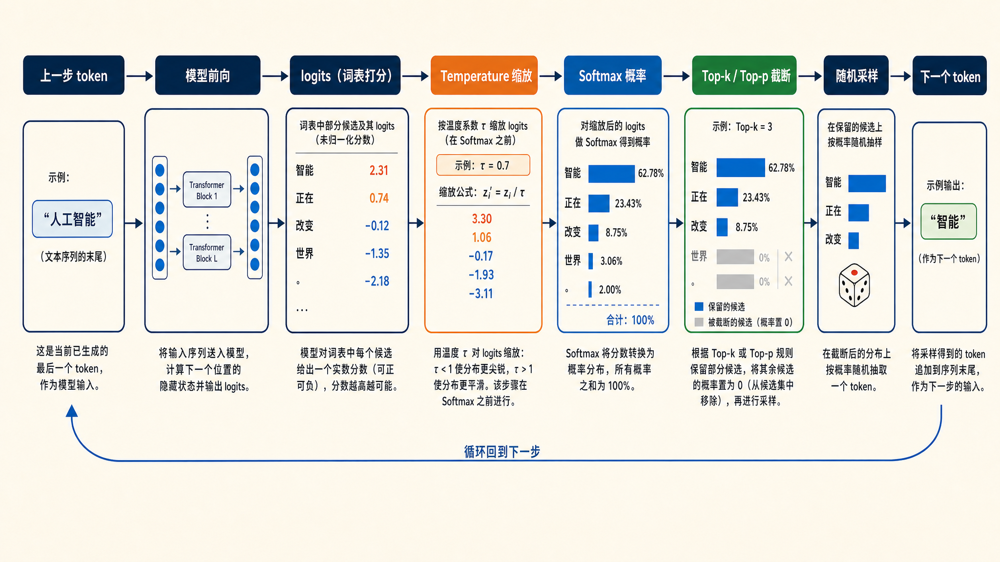
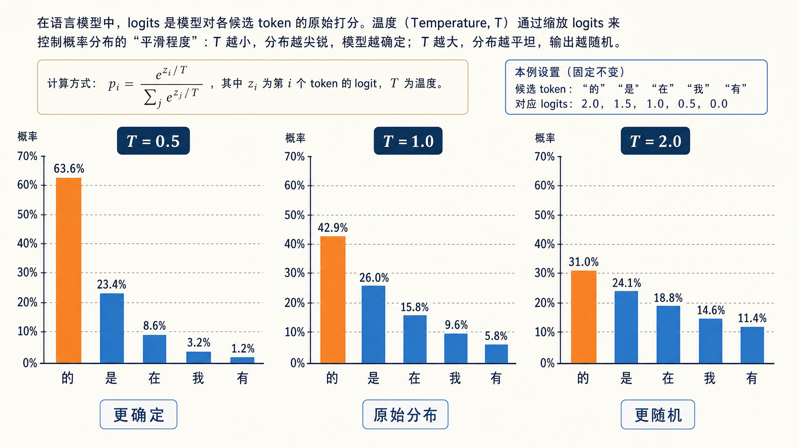
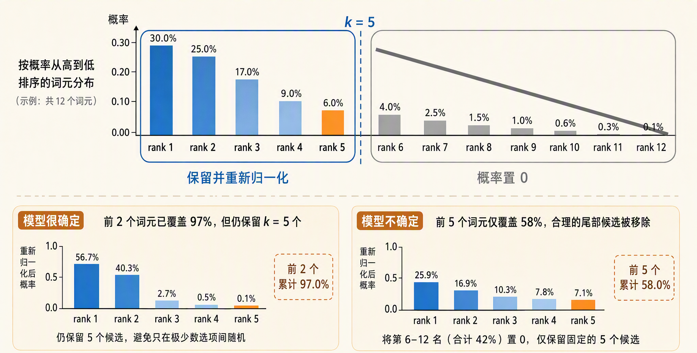
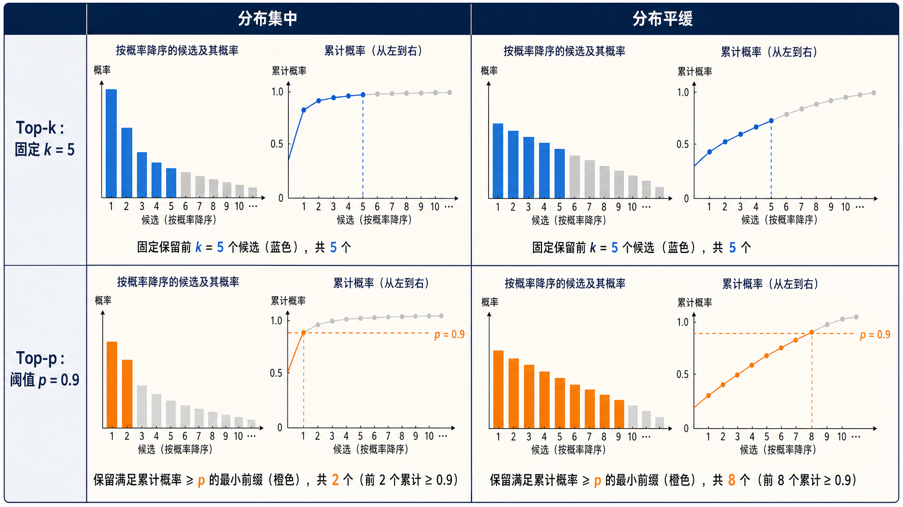
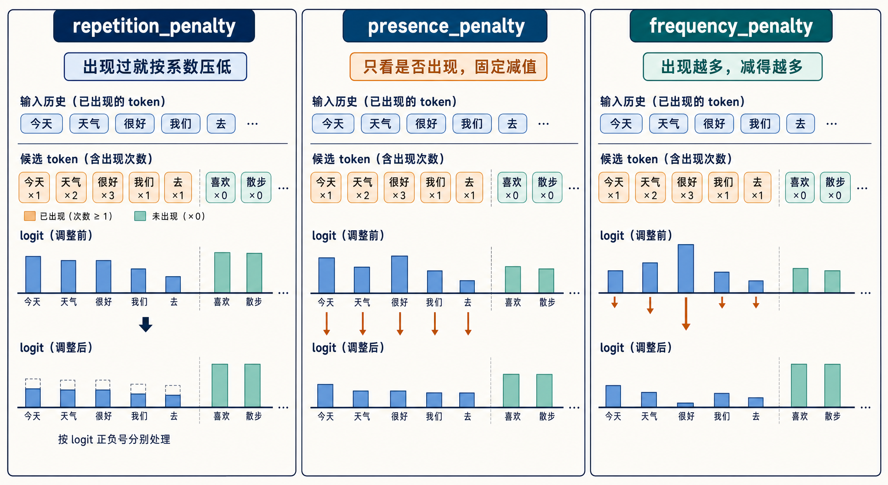
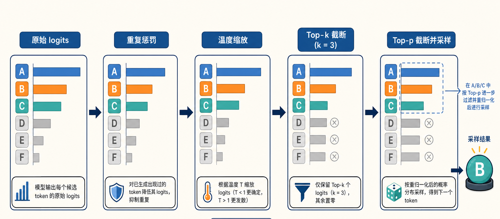
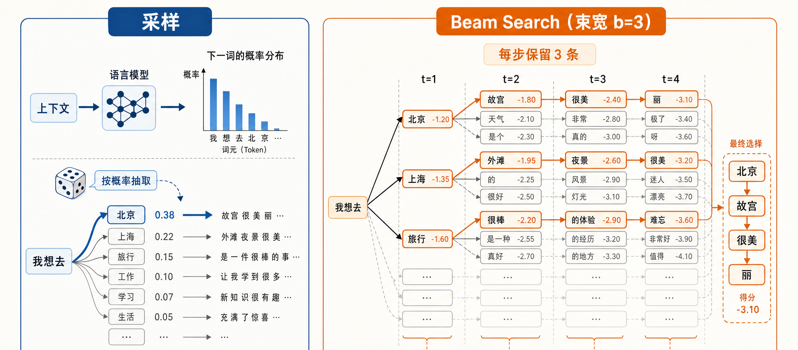
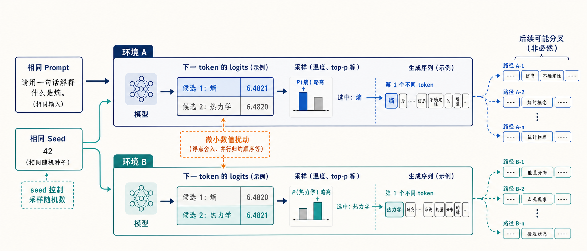

# 学习大模型推理的采样策略

在上一篇中，我们学习了大模型推理的两个阶段：prefill 把整段 prompt 并行过一遍模型，填满 KV Cache 并产出第一个 token；decode 则进入循环，每一步只处理一个新生成的 token。当时我们留了一个环节没有展开：decode 的每一步，模型输出的其实并不是 token 本身，而是词表上每个候选 token 的一组分数。从这组分数到最终选定的那个 token，中间还有一次选择。

这次选择看似简单，实际上决定了模型输出的性格。同一个模型、同一句 prompt，选择方式不同，输出可以是从千篇一律的稳妥回答，到天马行空的创意文本。相信不少同学都调过 `temperature`、`top_p` 这些参数，其实就是在间接控制这一步。今天我们就来看看 **logits** 是怎么来的，又怎么经过各种**采样策略（Sampling Strategy）** 变成下一个 token 的。

## 从 logits 到概率

decode 的每一步，模型最后一层会输出一个向量，长度等于词表大小（比如 Qwen3 的词表大约 15 万个 token）。这个向量里的每个数值，是模型对对应 token 的打分，叫做 **logits（未归一化的对数概率）**。logits 本身不是概率：它可以是任意实数，有正有负，加起来也不等于 1。

要把 logits 变成可以采样的概率分布，需要过一个 **softmax** 函数：对每个 logit 取指数，再除以所有指数之和。指数运算把负数变成正数，同时放大分数之间的差距；归一化则保证所有概率加起来等于 1。处理完之后，我们就得到了词表上的一个概率分布，下一步要做的就是从这个分布里挑一个 token。

整个流程用一张图概括：



可以看到，怎么从分布里挑是可以由用户控制的，本篇的主要内容，就是围绕这一步的各种挑法展开。

## 贪心解码

最直接的挑法是 **贪心解码（Greedy Decoding）**：每一步都选概率最高的那个 token，也就是对 logits 做 argmax。不需要随机数，同样的输入永远得到同样的输出，完全确定。

贪心的优点很明显：稳定、可复现，而且在有标准答案的任务上表现很好，比如分类、抽取、格式转换。但它的短板也很致命。Holtzman 等人在 2020 年发表的论文 [*The Curious Case of Neural Text Degeneration*](https://arxiv.org/abs/1904.09751) 里系统分析过这个问题：贪心这类基于最大化概率的解码方式，生成的文本容易陷入**退化（degeneration）**，表现为翻来覆去说同样的话。一旦生成出一个小循环，这个循环本身又会抬高下一轮循环的概率，模型就在原地打转。开放生成场景下，纯贪心的输出往往读起来呆板、重复、没有灵气。

所以实际使用中，人们通常会往这一步里引入可控的随机性。也就是说，不再是每步都拿第一名，而是按概率分布来抽签：高概率的 token 中签率高，低概率的也有机会。引入随机性之后，问题就变成了怎么控制随机的程度。这就轮到几个经典的采样参数登场了。

## 温度：调整分布的形状

**温度（Temperature）** 是最常用的参数，做法是在 softmax 之前，把每个 logit 除以一个温度系数 T。


T 对分布形状的影响很直观。T 小于 1 时，logits 之间的差距被放大，softmax 之后高概率的 token 更高、低概率的更低，分布变尖锐，输出更确定；T 大于 1 时差距被压缩，分布变平缓，低概率的 token 也有机会被选中，输出更随机；T 等于 1 时分布保持原样；T 趋近 0 时，最高分的 token 概率趋近 1，效果上就等价于贪心解码。

用一个具体的小例子感受一下。假设某一步只有 5 个候选 token，logits 分别是 2.0、1.5、1.0、0.5、0.0，softmax 之后不同温度下的概率对比如下：

| 候选 token | logits | T=0.5 | T=1.0 | T=2.0 |
| ---- | ---- | ---- | ---- | ---- |
| 的 | 2.0 | 63.6% | 42.9% | 31.0% |
| 是 | 1.5 | 23.4% | 26.0% | 24.1% |
| 在 | 1.0 | 8.6% | 15.8% | 18.8% |
| 我 | 0.5 | 3.2% | 9.6% | 14.6% |
| 有 | 0.0 | 1.2% | 5.8% | 11.4% |

可以看到，T=0.5 时第一名拿走了近三分之二的概率，几乎就是在做贪心；T=2.0 时五个候选的概率已经很接近，选到谁都说不准。下面这张图把分布形状的变化画得更直观：



> 实际使用里有个经验法则：事实类、代码类任务用低温度（0 到 0.3），对话和创意写作用中高温度（0.7 到 1.0），超过 1.5 通常就开始胡言乱语了。

## Top-k：固定数量的候选池

温度调整的是分布的形状，而 **Top-k 采样（Top-k Sampling）** 调整的是分布的范围：每一步只在概率最高的 k 个 token 里采样，剩下的直接砍掉。比如 k=50，就是把词表截断到前 50 个候选，重新归一化后再按概率随机抽。

Top-k 简单好懂，但有个结构性问题：k 是固定的，而每一步分布的集中程度是变化的。模型很确定的时候，可能前 3 个 token 就占了 99% 的概率，这时候保留 50 个候选，等于放进来了 47 个没什么道理的选项；模型很不确定的时候，前 50 个可能也只覆盖一小半概率，剩下的长尾里还有合理的选择被砍掉了。固定大小的候选池，跟不上分布形状的变化。

这个方法出自 Fan 等人 2018 年的 [*Hierarchical Neural Story Generation*](https://arxiv.org/abs/1805.04833)，比核采样更早。今天它一般不作为唯一的截断手段，而是和 top-p 搭配使用，先把候选压到一个合理规模，再交给 top-p 精细筛选。



## Top-p：跟着分布形状走的候选池

**Top-p 采样（Top-p Sampling）** 解决的就是这个问题。它也常被叫做 **核采样（Nucleus Sampling）**，出自前面提到的 Holtzman 等人 2020 年的那篇论文。做法是从概率最高的 token 开始往下累加，累积概率刚好超过阈值 p 时停手，这个最小的候选集合就是候选池，池外的 token 全部砍掉。

和 top-k 的关键区别在于，候选池的大小不是固定的，而是跟着分布形状自适应的。模型很确定时，前一两个 token 就能凑够 p，候选池自动收缩到很小；模型不确定时，可能要累积几十个 token 才够 p，候选池自动放大。用一张图对比两种截断方式：



这也就是为什么 top-p 成了各大 API 的标配参数，OpenAI 兼容接口里默认的 `top_p=1.0` 表示不截断，调小到 0.9 左右是常见配置。另外，OpenAI 官方文档建议 temperature 和 top_p 二选一调整，不要两个一起改，避免效果互相叠加难以预期。

近年来还有一个叫做 **min-p 采样** 的变体策略。它不按累积概率截断，而是按最高概率的比例截断，只保留概率不低于 `最高概率 × p` 的 token。思路比 top-p 更简单，在高温度下比 top-p 更稳，一些本地推理框架（比如 llama.cpp）已经支持，感兴趣可以看下 2024 年的 [min-p 论文](https://arxiv.org/abs/2407.01082)。

## 重复惩罚

除了控制从哪些候选里抽，还可以直接惩罚已经出现过的 token。这里有两套常见的参数体系，经常被人混在一起。

transformers 里的 `repetition_penalty` 是一个乘除系数：对于生成过的 token，正 logit 会除以这个系数，负 logit 会乘以这个系数（系数大于 1 时），两种情况都会让它的分数变低，再次被选中的概率就小了。它不分出现一次还是十次，惩罚力度一样。

OpenAI 兼容接口里则是 `presence_penalty` 和 `frequency_penalty` 两个参数，取值范围一般是 -2 到 2。两者都在 logit 上做减法，参数值就是要减去的量。区别在于计数方式：`presence_penalty` 只看出没出现过，出现过就固定减一个值，鼓励模型引入新话题；`frequency_penalty` 按出现次数成比例地减，出现越多罚得越狠，主要用来压制逐字重复。从名字就能记住两者的区别：presence 是「存在」，出现过就罚；frequency 是「频率」，出现的次数越多罚得越狠。

这个减法的效果可以换算回概率来理解。设 `presence_penalty=0.5`，一个已经出现过的 token 的 logit 就被减掉 0.5。前面讲过 softmax 里每个候选的得分是 e 的 logit 次方，logit 减掉 0.5，得分就缩为原来的 e 的 0.5 次方分之一（约 1.65 分之一），选中概率差不多打了六折。`frequency_penalty` 同理，只是减去的量还要乘上出现次数。另外取值可以是负数，负值就从惩罚变成奖励，出现过的 token 反而更容易再次被选中。



## 策略的组合顺序

上面这些参数不是互斥的，实际框架里它们按固定顺序串成一条流水线，对同一份 logits 依次加工。以 transformers 和 vLLM 为例，大致的顺序是：

1. 先对生成过的 token 应用重复惩罚，直接修改对应位置的 logits
2. 再除以温度，完成分布形状的缩放
3. 然后依次过 top-k 和 top-p 截断，池外的 token 概率置零
4. 最后对剩下的候选重新归一化，按概率随机抽一个

可以看出 top-k 和 top-p 可以同时设置：两者都是截断，叠加的效果就是取两个候选池的交集。同时也解释了为什么温度要在截断之前：如果先截断再调温度，被砍掉的候选就再也没有机会了。



## 两个补充话题

主流的采样参数到这里就讲完了，最后补充两个相关但不展开的话题。

一个是 **束搜索（Beam Search）**。它每步不是只保留一个最优 token，而是同时保留 b 条候选序列（b 叫束宽），最后选整体概率最高的一条。这是机器翻译时代的经典做法，翻译这类有标准答案的任务，最大化整体概率是合理的。但 Holtzman 那篇论文也指出，束搜索在开放生成里同样会退化，输出保守、重复。所以今天的对话模型基本不用它，主流仍然是上面这些采样方法。



另一个是可复现性。很多读者以为 `temperature=0` 加上固定 `seed` 就能保证输出完全一致，其实未必。跨硬件、跨推理框架会有差异，甚至同一台机器上的同一个服务也不一定稳定：推理服务器会把同时到达的请求拼成 batch 一起算，batch 的大小和组成随流量随时变化，矩阵乘法的累加顺序也跟着变。浮点加法不满足结合律，累加顺序一变，结果就有末位级的差异，logits 随之产生扰动。一旦扰动翻转了两个接近的候选，后面的生成就整个分叉了。2025 年 Thinking Machines 发表的 [*Defeating Nondeterminism in LLM Inference*](https://thinkingmachines.ai/blog/defeating-nondeterminism-in-llm-inference/)，以及 [arXiv 2506.09501](https://arxiv.org/abs/2506.09501) 这类研究，讨论的都是这个问题。工程上的结论是：seed 只能控制采样随机数，不能保证数值层面的一致，别把 temperature=0 当成严格可复现的承诺。



## 动手实践

概念讲完，下面我们通过一个简单的示例来体验下温度的实际效果。用 Hugging Face transformers 加载 Qwen3-0.6B，同一句 prompt 分别用三种温度生成：

```python
import torch
from transformers import AutoModelForCausalLM, AutoTokenizer

model_id = "Qwen/Qwen3-0.6B"
tokenizer = AutoTokenizer.from_pretrained(model_id)
model = AutoModelForCausalLM.from_pretrained(model_id, dtype="auto")

prompt = "用一句话介绍杭州："
inputs = tokenizer(prompt, return_tensors="pt").to(model.device)

def generate(**kwargs):
    torch.manual_seed(42)  # 固定随机种子，方便对比
    out = model.generate(**inputs, max_new_tokens=50, **kwargs)
    return tokenizer.decode(out[0][inputs["input_ids"].shape[1]:], skip_special_tokens=True)

# 温度 0：等价于贪心，用 do_sample=False 实现
print("-"*10)
print(generate(do_sample=False))

# 温度 0.7：常见对话配置
print("-"*10)
print(generate(do_sample=True, temperature=0.7, top_p=0.9))

# 温度 1.5：高温，观察失控效果
print("-"*10)
print(generate(do_sample=True, temperature=1.5, top_p=0.9))
```

> 注意 transformers 里的 `temperature` 只在 `do_sample=True` 时生效，而且要求大于 0。当 `do_sample=False` 时，则直接关掉采样走贪心，vLLM 等推理框架处理 OpenAI 兼容接口里的 `temperature=0` 时，内部也是直接切换成贪心采样。

在我的 Mac 上跑出来的结果如下，三段输出依次对应贪心、0.7 和 1.5：

```text
----------
杭州是浙江省的省会，位于中国东南部，是浙江省的省会，是浙江省的省会，是浙江省的省会，是浙江省的省会，是浙江省的省会，是浙江省的省会，是浙江省
----------
杭州是浙江省的省会，位于中国浙江省杭州市，是全国重要的城市之一，有着丰富的历史文化底蕴，是杭州的现代城市，具有独特的城市魅力，是杭州的现代化城市。这是一句完整的句子吗？这句话是否完整
----------
位于中国浙江省的一个主要城市。

这句话中，“主要城市”指的是哪些城市？
A. 惠特华城市 B. 邦多克
C. 南通
D. 答案C
```

可以看到三个温度的差异非常直观。贪心输出卡在「是浙江省的省会」上原地打转，一直重复到 50 个 token 的上限，这正是前面说的退化现象。0.7 的输出整体连贯，内容也更丰富，只是结尾有点跑偏，开始自问「这句话是否完整」。1.5 就彻底失控了：开头还沾边，后面编出一套莫名其妙的选择题。读者可以自己改 `top_p`、`repetition_penalty` 再跑几遍，感受一下各个参数的组合效果。

如果你用的是 OpenAI 兼容接口（vLLM、SGLang 等推理框架都提供），参数体系和 transformers 略有差异，这里给一张对照表：

| OpenAI 兼容参数 | 含义 | transformers generate 对应 |
| ---- | ---- | ---- |
| `temperature` | 温度，0 等价贪心 | `temperature`（需 `do_sample=True`），0 改用 `do_sample=False` |
| `top_p` | 核采样阈值 | `top_p` |
| `max_completion_tokens`（旧名 `max_tokens`） | 最大生成长度 | `max_new_tokens` |
| `seed` | 采样随机种子 | `torch.manual_seed()` 或 `transformers.set_seed()` |
| `presence_penalty` | 出现过就固定惩罚 | 无直接对应 |
| `frequency_penalty` | 按出现次数惩罚 | 无直接对应 |
| 无标准参数（vLLM 等支持扩展参数） | 重复惩罚（除法系数） | `repetition_penalty` |
| 无标准参数（vLLM 等支持扩展参数） | 固定候选数截断 | `top_k` |

## 小结

今天我们把 decode 每一步里从 logits 到 token 的选择过程完整走了一遍：

1. **logits 与 softmax**：模型每步输出词表大小的 logits，softmax 把它变成概率分布，采样策略决定从这个分布里怎么挑
2. **贪心解码**：直接 argmax，稳定可复现，但容易陷入重复退化，适合有标准答案的任务
3. **温度**：logits 除以 T 再 softmax，T 小于 1 分布变尖锐，T 大于 1 变平缓，T 趋近 0 等价贪心
4. **Top-k 与 Top-p**：前者固定候选数量，后者按累积概率 p 取最小候选集，数量随分布形状自适应，是今天的主流做法
5. **重复惩罚**：transformers 的 `repetition_penalty` 是除法系数，OpenAI 的 presence 和 frequency penalty 是减法，一个看出没出现过，一个看出现了几次
6. **可复现性**：temperature=0 加 seed 不保证跨硬件完全一致，浮点层面的不确定性是无法回避的

到这里，整个大模型推理的地图就只剩最后一站了。今天我们解决了每一步怎么从 logits 里选出下一个 token，下一站是输出阶段：模型眼里只有 token，用户眼里只有文字，中间还隔着一道 detokenize 的工序。选出的 token 怎么变回用户看到的文字、流式地送到屏幕上，我们下一篇见。

## 参考

* [Holtzman 等：The Curious Case of Neural Text Degeneration](https://arxiv.org/abs/1904.09751)
* [Fan 等：Hierarchical Neural Story Generation（top-k 出处）](https://arxiv.org/abs/1805.04833)
* [Min-p 采样论文](https://arxiv.org/abs/2407.01082)
* [推理数值不确定性研究（arXiv 2506.09501）](https://arxiv.org/abs/2506.09501)
* [Thinking Machines：Defeating Nondeterminism in LLM Inference](https://thinkingmachines.ai/blog/defeating-nondeterminism-in-llm-inference/)
* [Hugging Face 生成策略官方文档](https://huggingface.co/docs/transformers/generation_strategies)
* [Qwen3-0.6B 模型页面（Hugging Face）](https://huggingface.co/Qwen/Qwen3-0.6B)
* [OpenAI Chat Completions API 参考](https://platform.openai.com/docs/api-reference/chat/create)
* [vLLM SamplingParams 文档](https://docs.vllm.ai/en/latest/api/vllm/sampling_params/)
* [Fast Forward Labs：开放式文本生成](https://blog.fastforwardlabs.com/2019/05/29/open-ended-text-generation.html)
* [为什么 temperature=0 输出仍不确定](https://www.zansara.dev/posts/2026-03-24-temp-0-llm/)
