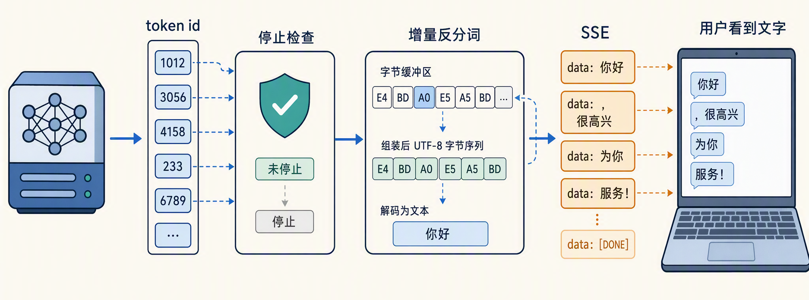
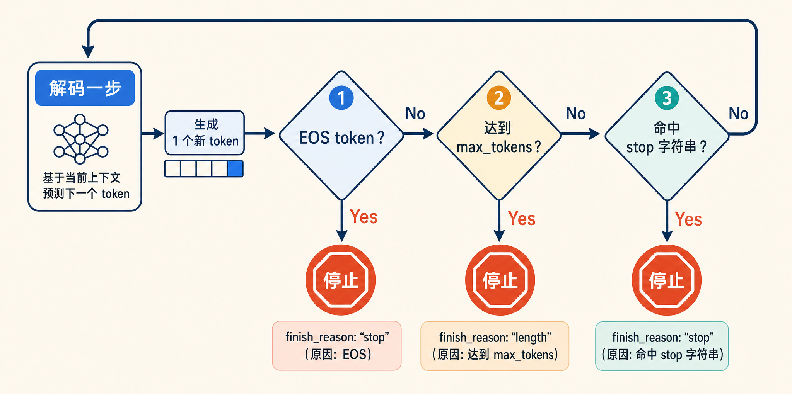
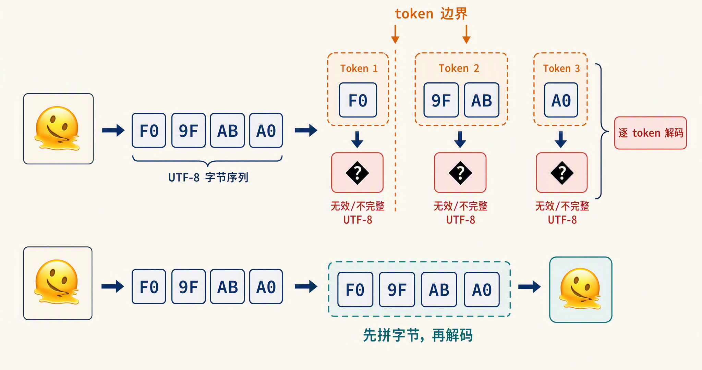
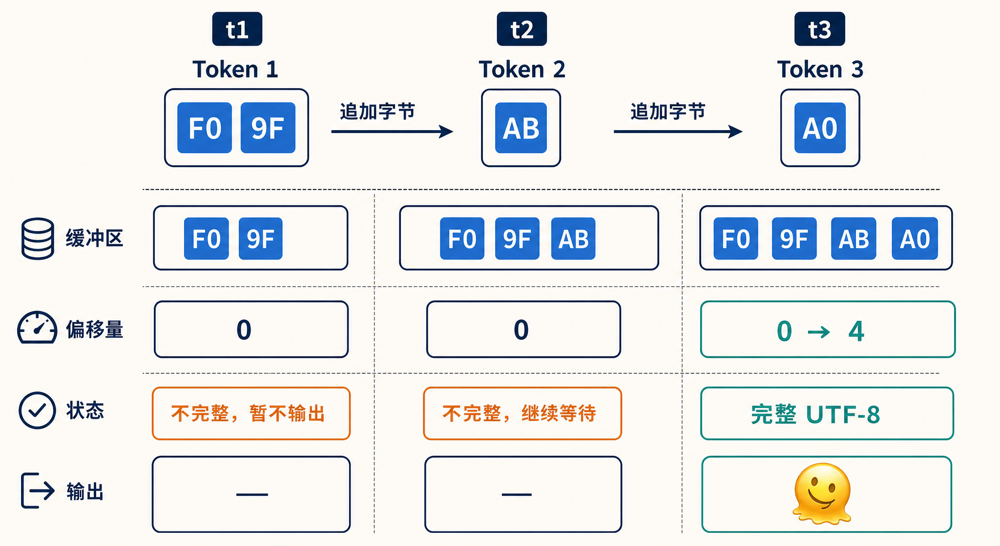
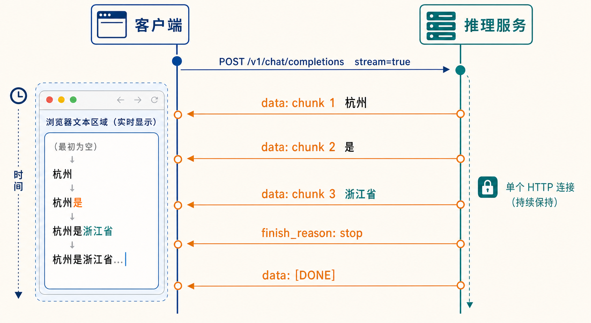
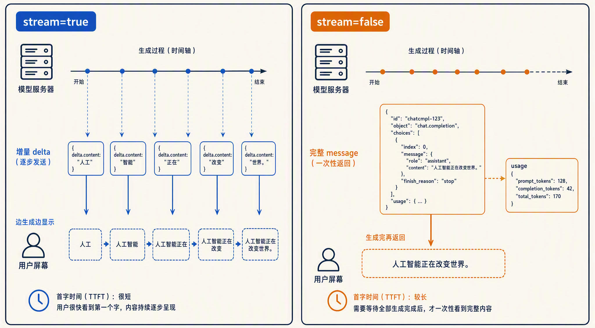
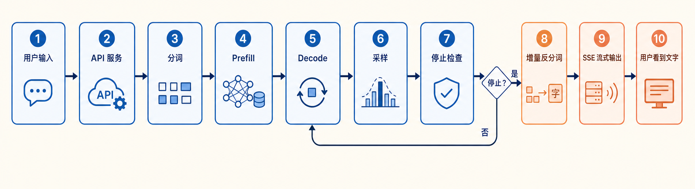

# 学习大模型推理的输出阶段：从 Token 回到文本

在上一篇中，我们学习了大模型推理的采样策略：decode 的每一步，模型输出的是词表上的一组 logits，经过 softmax、温度和 top-p 这些加工之后，从中选出下一个 token。

但 token 选出来，旅程还没有结束。模型眼里只有一串 token id，用户屏幕上看到的却是逐字跳出来的文字。从 token id 到用户眼前的文字，中间还有三道工序：判断生成何时停止、把 token id 还原成文本、把文本流式地推送给用户。这就是一次请求的「最后一公里」，也是今天的主角。



## 生成何时停止

decode 循环每跑一步就多一个 token，那它什么时候停下来？常见的停止条件有三个：

1. **遇到 EOS token**：EOS 是 End of Sequence 的缩写，即序列结束标记，是词表里的一个特殊 token。对话模型在训练时就学会了在回答结束的位置输出它，比如 Qwen3 系列用的是 `<|im_end|>`。这是最常见的正常结束方式
2. **达到 max_tokens 上限**：调用方设置的生成长度天花板，到顶就强制掐断，防止模型无限生成烧光预算
3. **命中 stop 字符串**：调用方可以传一组自定义停止词，生成的文本里一旦出现其中任何一个就停。比如做代码补全时常把 `\n\n` 设为停止词，让模型写完一段就收手

这三个条件在每一步 decode 之后都会被检查一次，任何一个命中，循环就结束：



用户侧怎么知道这次生成是正常说完的，还是被掐断的呢？OpenAI 兼容接口用 `finish_reason` 字段回答这个问题，常见的取值有：

| finish_reason | 含义 | 对应的停止条件 |
| ---- | ---- | ---- |
| `stop` | 正常结束 | 遇到 EOS 或命中 stop 字符串 |
| `length` | 长度截断 | 达到 max_tokens 或上下文上限 |
| `content_filter` | 内容审核拦截 | 输出触发了服务商的内容过滤 |
| `tool_calls` | 工具调用 | 模型决定调用一个工具而非继续写文本 |

在写客户端代码时，可以特别注意下这个字段。看到 `length` 就意味着回答是被截断的、不完整，要么调大 `max_tokens` 重试，要么做续写处理；把它当成正常结束直接展示给用户，就会看到半句话。

## 反分词：token id 变回文本

生成停止后（以及生成过程中的每一步），我们手里拿到的是一串 token id，比如 `[9707, 11, 1879, 330, 151643]`。把它们映射回文本的过程叫 **反分词（Detokenization）**，是分词的逆操作：查词表把每个 id 换回对应的片段，再拼接起来。

听起来只是查表拼接，但实际工程里没那么简单。第二篇讲分词时提过，今天的主流模型大多用字节级 BPE，词表建在字节上而不是字符上。而 UTF-8 编码里，一个汉字占 3 个字节，一个 emoji 通常占 4 个字节。如果一个字符的多个字节被切分到了不同的 token 里，那么逐 token 做 decode 时，单个 token 里装的就只是某个字符的一半字节，根本不是一个合法的 UTF-8 序列。

不完整的字节序列在解码时会被替换成 **U+FFFD 替换字符（Replacement Character）**，也就是那个菱形问号的乱码符号。我们用 Python 做个实验，感受一下这个问题：

```python
data = "🚀".encode("utf-8")  # 4 个字节: b'\xf0\x9f\x9a\x80'

# 假设分词器把这 4 个字节切成了两个 token，各拿 2 个字节
part1, part2 = data[:2], data[2:]

print(part1.decode("utf-8", errors="replace"))  # '�' 半个字符，变成替换符
print(part2.decode("utf-8", errors="replace"))  # '��' 两个落单的字节，两个替换符

# 把字节凑齐再解码，就正常了
print((part1 + part2).decode("utf-8"))  # '🚀'
```

细心的读者可能会好奇，为什么前一半只产生 1 个替换符，后一半却产生了 2 个？这是由 UTF-8 的字节结构决定。**UTF-8 用首字节的高位比特宣告这个字符一共占几个字节**：二进制 110 开头的是 2 字节字符（首字节范围 C2 到 DF），1110 开头的是 3 字节（E0 到 EF），11110 开头的是 4 字节（F0 到 F4），延续字节则一律以 10 开头（80 到 BF）。

| 字符长度 | 首字节二进制前缀 | 首字节范围 | 例子 |
| ---- | ---- | ---- | ---- |
| 1 字节（ASCII） | 0xxxxxxx | 00–7F | A = 41 |
| 2 字节 | 110xxxxx | C2–DF | é = C3 A9 |
| 3 字节 | 1110xxxx | E0–EF | 中 = E4 B8 AD |
| 4 字节 | 11110xxx | F0–F4 | 🚀 = F0 9F 9A 80 |

解码器读到 F0 9F，认出这是一个 4 字节序列的开头加一个合法的延续字节，只是序列被截断了，于是把这半个序列当作一个非法单元，整体替换成 1 个替换符。而 9A 和 80 都是延续字节，延续字节不能独立存在，前面没有首字节领着，每个都是单独的非法字节，所以各得 1 个替换符。

可以看到，同一个字符，按 token 边界切开 decode 就是乱码，凑齐字节再 decode 才是原文。用真实的分词器也能复现这个现象，比如拿 Qwen3 的分词器处理一个 emoji：

```python
from transformers import AutoTokenizer

tokenizer = AutoTokenizer.from_pretrained("Qwen/Qwen3-0.6B")

text = "🫠"  # 一个 4 字节的 emoji，UTF-8 编码为 F0 9F AB A0
ids = tokenizer(text)["input_ids"]
print(ids)

# 逐个 token 单独 decode，不含完整字符的 token 会显示成替换符
for i in ids:
    print(repr(tokenizer.decode([i])))

# 整段一起 decode 则完全正常
print(tokenizer.decode(ids))
```

运行结果如下：

```text
[9284, 104, 254]
'�'
'�'
'�'
🫠
```

可以看到，一个 emoji 被切成了 3 个 token，每个 token 只装着这个字符的一部分字节，单独 decode 全是替换符；拼在一起 decode 才是原文。



### 增量反分词

在流式场景下，服务端每生成一个 token 就想推给用户，如果等整段生成完再 decode 就失去流式的意义了。所以工程上引入了一种做法叫 **增量反分词（Incremental Detokenization）**，思路很朴素：反分词器内部维护一个字节缓冲区，每来一个 token 就把它的字节追加进去，然后尽量解码；遇到末尾不完整的字节就先留在缓冲区里不输出，等后续 token 把字节凑齐了再一起吐出来。



> 这个看似简单的缓冲机制，细节其实不少，比如解码偏移量怎么维护、清理空格时要看前后 token。COLM 2025 上有一篇论文 [*UTF-8 Plumbing*](https://arxiv.org/abs/2511.05578) 形式化证明了字节级分词器从根本上无法避免生成不合法的 UTF-8 序列，这也是增量反分词必须处理不完整字节的原因。

反分词这一步虽然不起眼，但它是流式体验正确的保证。用户之所以能看到文字丝滑地逐字跳出而不是乱码闪烁，靠的就是这层缓冲。

## 流式输出与 SSE

反分词解决了怎么正确地切文本，接下来的问题是怎么把文本送出去，主流做法是 **流式输出（Streaming）**：生成一点、发送一点。

承载流式输出的协议是 **Server-Sent Events（SSE，服务器发送事件）**。它基于一条普通的 HTTP 长连接，响应的 `Content-Type` 是 `text/event-stream`，服务端把每条消息写成 `data: ` 开头的文本行，消息之间用空行分隔，客户端边收边解析。和 WebSocket 的双向通信不同，SSE 是服务端向客户端的单向推送，恰好匹配大模型逐 token 吐字的场景，实现也简单得多。

整个交互过程如下：



### 动手体验

下面我们先用 vLLM 在本地起一个 OpenAI 兼容服务，通过一个简单的示例来体验下（SGLang 等其他框架的接口形态也差不多）。

没装过 vLLM 的话先安装。有 NVIDIA GPU 的 Linux 机器直接 pip 装：

```bash
$ pip install vllm
```

官方包不提供 macOS 版本，Apple Silicon 的 Mac 上可以装社区维护的 Metal 插件版 [vllm-metal](https://github.com/vllm-project/vllm-metal)，要求 macOS 15 以上、原生 arm64 的 Python 3.12：

```bash
$ curl -fsSL https://raw.githubusercontent.com/vllm-project/vllm-metal/main/install.sh | bash
$ source ~/.venv-vllm-metal/bin/activate
```

装好后 `vllm` 命令就可用了，启动服务：

```bash
$ vllm serve Qwen/Qwen3-0.6B --port 8000
```

然后用 curl 发一个流式请求。注意 `-N` 参数，它关闭 curl 的输出缓冲，让数据边到边显示：

```bash
$ curl -N http://localhost:8000/v1/chat/completions \
  -H "Content-Type: application/json" \
  -d '{
    "model": "Qwen/Qwen3-0.6B",
    "messages": [{"role": "user", "content": "用一句话介绍杭州"}],
    "max_tokens": 50,
    "stream": true
  }'
```

终端里会看到一块块数据陆续跳出来，大致是下面这个样子：

```text
data: {"id":"chatcmpl-001","object":"chat.completion.chunk","created":1754300000,"model":"Qwen/Qwen3-0.6B","choices":[{"index":0,"delta":{"role":"assistant","content":""},"finish_reason":null}]}

data: {"id":"chatcmpl-001","object":"chat.completion.chunk","created":1754300000,"model":"Qwen/Qwen3-0.6B","choices":[{"index":0,"delta":{"content":"杭州"},"finish_reason":null}]}

data: {"id":"chatcmpl-001","object":"chat.completion.chunk","created":1754300000,"model":"Qwen/Qwen3-0.6B","choices":[{"index":0,"delta":{"content":"是"},"finish_reason":null}]}

data: {"id":"chatcmpl-001","object":"chat.completion.chunk","created":1754300000,"model":"Qwen/Qwen3-0.6B","choices":[{"index":0,"delta":{"content":"浙江省"},"finish_reason":null}]}

data: {"id":"chatcmpl-001","object":"chat.completion.chunk","created":1754300000,"model":"Qwen/Qwen3-0.6B","choices":[{"index":0,"delta":{"content":""},"finish_reason":"stop"}]}

data: [DONE]
```

逐块解读一下：

1. **第一个 chunk**：`object` 字段是 `chat.completion.chunk`，表明这是流式响应的分片；`delta` 里先给出 `role`，`content` 为空
2. **中间的 chunk**：每个 chunk 的 `delta.content` 带一小段新生成的文字，客户端要做的就是把这些片段依次拼接（或打印）出来；此时 `finish_reason` 都是 `null`，表示还没结束
3. **倒数第二个 chunk**：`delta` 为空，`finish_reason` 变成 `stop`，告知生成已正常结束
4. **最后一行**：`data: [DONE]` 是一个特殊的结束哨兵，不是 JSON，客户端解析时要单独处理，收到它就可以关闭连接了

如果还想在流式模式下拿到 token 用量统计，可以在请求里加上 `"stream_options": {"include_usage": true}`，服务端会在结束 chunk 之前再补发一个只含 `usage` 字段的 chunk。

## 非流式一次性返回

作为对比，同样的请求把 `stream` 设为 `false`（或直接去掉这个字段），服务端会等整段生成完，一次性返回一个完整的 JSON：

```json
{
  "id": "chatcmpl-002",
  "object": "chat.completion",
  "created": 1754300100,
  "model": "Qwen/Qwen3-0.6B",
  "choices": [
    {
      "index": 0,
      "message": {
        "role": "assistant",
        "content": "杭州是浙江省的省会，以西湖美景和数字经济产业闻名。"
      },
      "finish_reason": "stop"
    }
  ],
  "usage": {
    "prompt_tokens": 18,
    "completion_tokens": 24,
    "total_tokens": 42
  }
}
```

这里有两个字段值得注意：一个是 `object` 变成了 `chat.completion`，和流式的 `chat.completion.chunk` 区分开；另一个是 `usage` 包含这一次请求的用量统计，`prompt_tokens` 是输入的 token 数，`completion_tokens` 是生成的 token 数，`total_tokens` 是两者之和。还记得第二篇讲分词时说的吗，API 计费就是按 token 算的，账单上的数字就从这里来。输入和输出分开计价，很多模型的输出单价比输入贵不少，因为 decode 阶段逐 token 串行，算力利用效率远低于可以并行的 prefill，这也是第六篇讨论过的内容。



## 小结

今天我们把一次请求的最后一公里走完了：

1. **停止条件**：遇到 EOS、达到 max_tokens、命中 stop 字符串，三种条件任一命中即停止；接口通过 `finish_reason` 告知停止原因，`length` 意味着输出被截断，客户端需要处理
2. **反分词**：token id 映射回文本；字节级分词下，一个汉字或 emoji 的字节可能横跨多个 token，逐 token 直接 decode 会产生 U+FFFD 乱码
3. **增量反分词**：工程解法是把不完整字节留在缓冲区，凑齐再输出；vLLM、SGLang 等框架都实现了这套机制
4. **流式输出**：基于 SSE 的 HTTP 长连接逐块推送，每个 `chat.completion.chunk` 的 `delta.content` 带一小段文字，`data: [DONE]` 标志结束；非流式则一次性返回完整 JSON，`usage` 字段给出 token 用量，是计费的依据

到这里，第一篇画的那张旅程地图上的每一站，我们都已经走过了：



单个请求从进来到出去的完整链路，至此闭环了。

不过前面这几篇更像是走马观花：跟着一个请求把完整链路看了一遍，很多推理的细节和优化手段只是点到为止，比如**批处理（Batching）**和**连续批处理（Continuous Batching）**、**前缀缓存（Prefix Caching）**、**投机解码（Speculative Decoding）**、**PD 分离（Prefill-Decode Disaggregation）**，每一个都值得单独拿出来。后面就逐个深入进去，我们下期见。

## 参考

* [vLLM 官方文档：快速上手](https://docs.vllm.ai/en/latest/getting_started/quickstart/)
* [vllm-metal：Apple Silicon 上的 vLLM 插件](https://github.com/vllm-project/vllm-metal)
* [vLLM IncrementalDetokenizer API 文档](https://docs.vllm.ai/en/v0.10.2/api/vllm/v1/engine/detokenizer.html)
* [OpenAI Chat Completions API 参考](https://platform.openai.com/docs/api-reference/chat/create)
* [Qwen3-0.6B 模型页面（Hugging Face）](https://huggingface.co/Qwen/Qwen3-0.6B)
* [论文：UTF-8 Plumbing，字节级分词器与不合法 UTF-8（COLM 2025）](https://arxiv.org/abs/2511.05578)
* [MDN：使用 Server-Sent Events](https://developer.mozilla.org/en-US/docs/Web/API/Server-sent_events/Using_server-sent_events)
