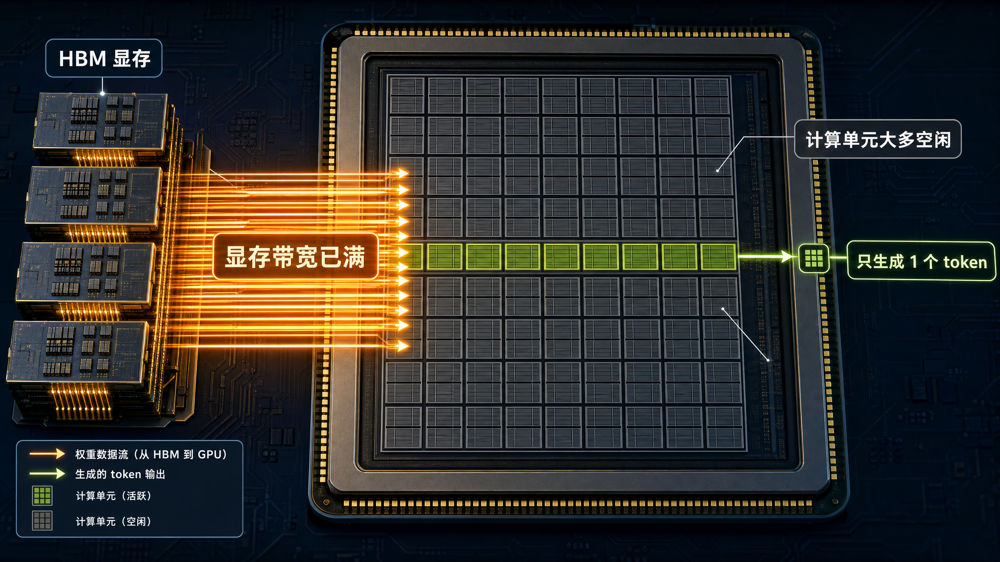
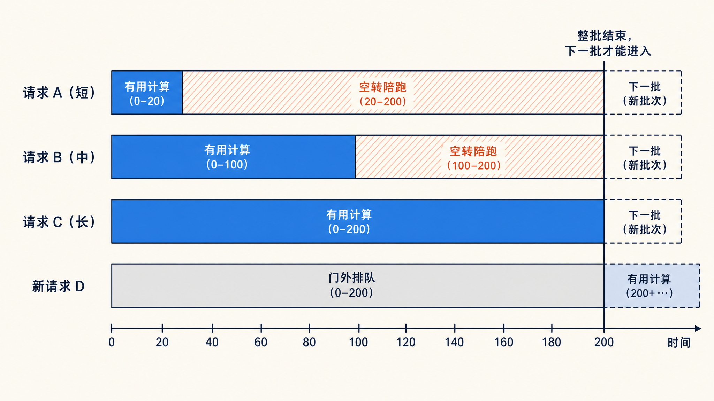
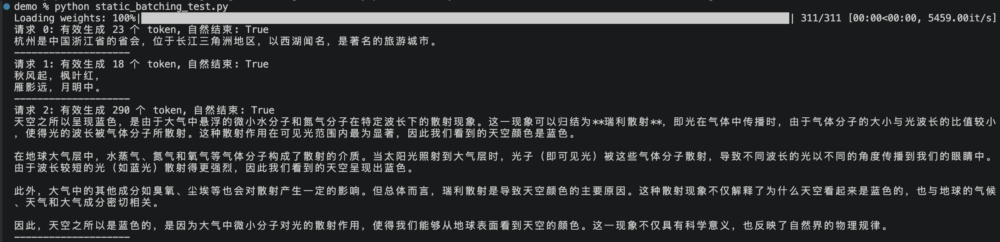
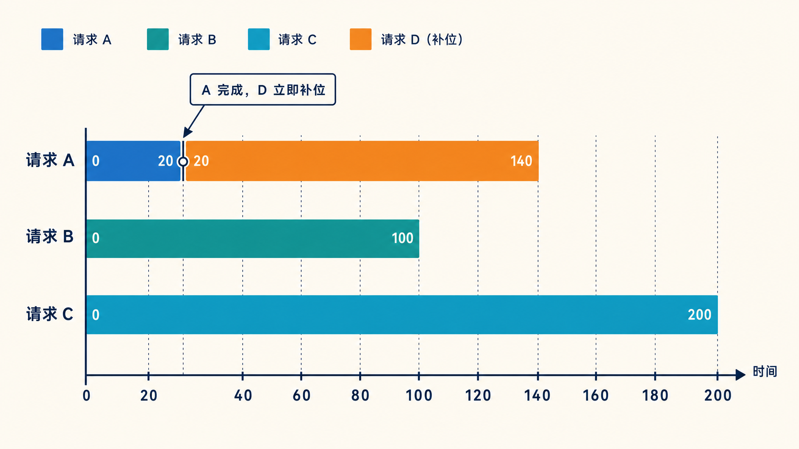
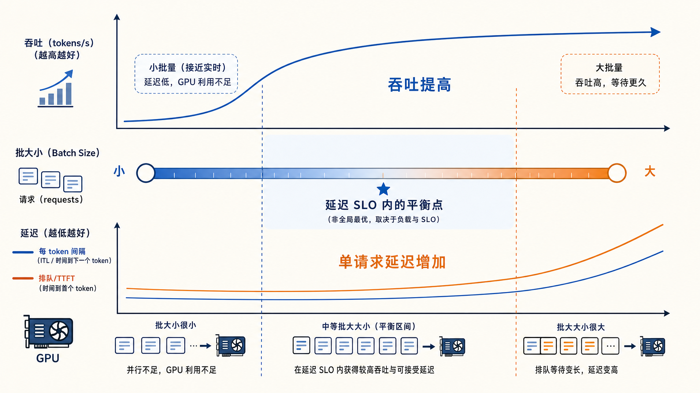
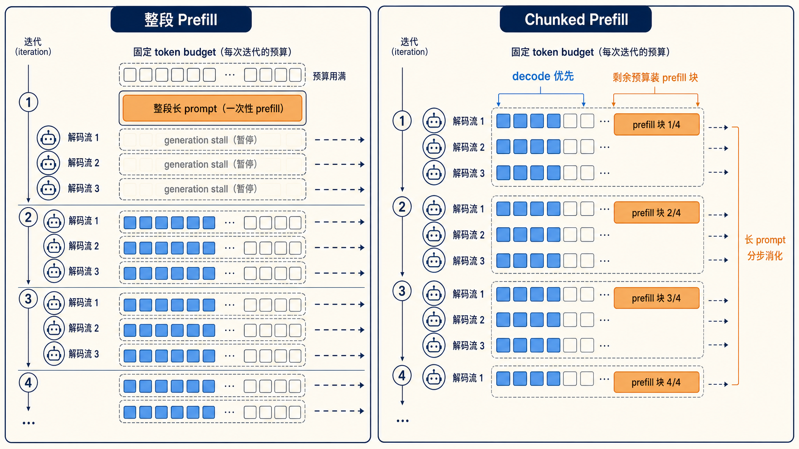

# 学习大模型推理的批处理：Continuous Batching

至此，我们把一次请求从进来到出去的整条链路都走了一遍：prompt 进来、分词、查 embedding、逐层 Transformer 前向、prefill 建 KV Cache、decode 逐 token 生成、最后 token 变回文字。

在这整条链路里，有不少技术细节和优化手段值得再深入学习，打算后面逐个展开。今天就从第一个话题开始：**批处理（Batching）**。

## 单请求跑推理有多浪费

第六篇讲过，prefill 和 decode 的瓶颈完全不同。prefill 一次性并行处理整段 prompt，是矩阵乘矩阵的大计算，GPU 的算力能吃得比较满。decode 不一样，每一步只处理一个新 token，本质上是矩阵乘向量，计算量很小，但每一步都要把全部模型权重和整条 KV Cache 从显存里读一遍。

衡量这种差异的指标就是第六篇介绍过的**算术强度（Arithmetic Intensity）**：每从显存读一个字节，能做多少次浮点运算。算术强度高的任务是计算受限，瓶颈在算力；算术强度低的任务是带宽受限，瓶颈在显存带宽。decode 恰好是后者的极端情况：权重几个 GB 到几十 GB，每一步原样读一遍，只为算出区区一个 token。

结果就是，单请求跑 decode 时，GPU 的计算单元大部分时间在等数据。一张标称几百上千 TFLOPS 的卡，真正用上的算力只有很小一个零头。



补救的思路很直接：既然每一步都要把整个模型读一遍，那就让这一步同时给多条请求算。权重读一次，几十条请求一起用，算术强度按批大小成倍抬升。显存带宽花同样的时间，产出的 token 却多了几十倍。这就是批处理的动机：摊薄每一步读权重的成本。

## 静态批处理：整批同进同出

最容易想到的批法是**静态批处理（Static Batching）**：攒够一批请求，拼成一个大 batch 一起送进 GPU，等批里所有请求都生成完，整批一起返回，然后再收下一批。

它的毛病是短板效应。同一批请求的生成长度差异很大，有的 20 个 token 就收尾，有的要 500 个。静态批处理里，短请求生成完之后并不能先走，它得占着批里的位置陪跑，直到最长的那条结束。陪跑期间，GPU 要么为它算无意义的前向，要么塞 pad token 占位，这部分算力纯属空转。新到的请求也只能在门外排队，等当前批彻底清空才能进。

用时间轴画出来是这样：



红色部分是纯粹的浪费：请求 A 和 B 早就生成完了，却要陪请求 C 耗到第 200 步；请求 D 早就到了，却只能干等。批内长度差异越大，空转越严重。

### 用 Transformers 亲手感受一下

Hugging Face [Transformers](https://huggingface.co/docs/transformers) 的 `generate` 接口天然就是静态批处理，可以直接拿来体会短板效应。我们用 [Qwen/Qwen3-0.6B](https://huggingface.co/Qwen/Qwen3-0.6B) 这种小模型，把三条长度要求不同的 prompt 拼成一批：

```python
import torch
from transformers import AutoModelForCausalLM, AutoTokenizer

model_id = "Qwen/Qwen3-0.6B"
tokenizer = AutoTokenizer.from_pretrained(model_id)
model = AutoModelForCausalLM.from_pretrained(model_id, dtype="auto")

# 三条 prompt，预期的输出长度差异很大
prompts = [
    "用一句话介绍杭州。",
    "写一首关于秋天的五言绝句。",
    "详细解释为什么天空是蓝色的，不少于三百字。",
]

# 套对话模板，Qwen3 关掉思考模式，让回答尽快收尾
texts = [
    tokenizer.apply_chat_template(
        [{"role": "user", "content": p}],
        tokenize=False,
        add_generation_prompt=True,
        enable_thinking=False,
    )
    for p in prompts
]

# 批式生成要左填充，保证每条序列的最后一个位置就是新 token 的位置
tokenizer.padding_side = "left"
if tokenizer.pad_token is None:
    tokenizer.pad_token = tokenizer.eos_token

inputs = tokenizer(texts, return_tensors="pt", padding=True).to(model.device)
prompt_len = inputs["input_ids"].shape[1]

outputs = model.generate(**inputs, max_new_tokens=512, do_sample=False)

for i, out in enumerate(outputs):
    new_tokens = out[prompt_len:]
    n = int((new_tokens != tokenizer.pad_token_id).sum())
    print(f"请求 {i}: 有效生成 {n} 个 token")
    print(tokenizer.decode(new_tokens, skip_special_tokens=True))
```

在我的 Mac 上跑出来的结果如下：



三条请求分别有效生成 23、18、290 个 token，最长和最短差了十几倍，但 `generate` 要等最长那条结束后才返回。短请求先撞上了 EOS，后面的位置只能拿 pad token 填满，这些位置的每一步前向都是白算的。

真正的推理服务要处理的是请求随到随走、量大利薄的场景，静态批处理的空转在生产上是接受不了的。

## 连续批处理：以步为单位调度

**连续批处理（Continuous Batching）** 把调度的粒度从整批缩小到了单步迭代。这个机制来自 **ORCA** 系统，由 FriendliAI 和首尔国立大学的团队提出，论文发表在 OSDI 2022，论文里的原名是**迭代级调度（Iteration-level Scheduling）**。

思路也很直观：每跑完一步 decode，调度器都重新决策一次。哪条请求生成了 EOS 或顶到长度上限，立刻移出、返回结果；等待队列里有新请求，且显存放得下，立刻补进运行集。批的组成每一步都在变，GPU 不需要等任何人。

同样四条请求，换成连续批处理的时间轴：



对比上一张图，空转区域整个消失了。请求 A 第 20 步结束，请求 D 第 21 步就顶上了它的位置。每条请求的实际生成时间没变，但同一台 GPU 在单位时间内服务的请求变多了。

### 调度器内部：两个队列

把调度器拆开看，它维护着两个队列：**等待队列（waiting）**装着已接收但还没开始计算的请求，**运行集（running）**装着正在逐 token 生成的请求。每跑一步迭代，调度器做三件事：

1. **组批**：先遍历运行集，给每条在跑的请求分配这一步的 KV 块和 token 预算；预算还有富余，再从等待队列按顺序取请求补进来
2. **执行**：拼好的批送进 GPU 跑一步前向，每条请求各产出一个新 token
3. **结算**：检查每条请求新产出的 token，撞上 EOS 或长度上限的标记完成、释放资源、把结果推给客户端；空出的位置下一步组批时从等待队列补进来

等待队列默认是先来先服务（FCFS），vLLM 也支持优先级调度：启动时加 `--scheduling-policy priority`，数值越小的请求越先被处理。

### 效果有多大

ORCA 论文给过一组对比数据：在 GPT-3 175B 的分布式服务实验上，相同延迟目标下，ORCA 的吞吐是 NVIDIA FasterTransformer 的 36.9 倍。具体的数字是，在每 token 190 ms 的延迟目标下，FasterTransformer 每秒只能处理 0.185 个请求，ORCA 能处理 6.81 个。

要注意这个数字是和特定 baseline 在特定设置下的对比，不是说换个场景也快 36 倍。但它足以说明仅仅把调度粒度从请求级降到迭代级，吞吐就能拉开数量级的差距。

> ORCA 论文里还有第二个机制叫**选择性批处理（Selective Batching）**：注意力计算依赖各请求独立的 KV Cache，不适合整批合并，就按请求分开算；其余的线性层和归一化可以整批合并。这个细节就不展开了，感兴趣的同学可以读下原始的论文。

### 如今已是行业标配

迭代级调度现在是所有主流推理引擎的基本功，叫法也基本统一成了 continuous batching，只有个别例外：

| 引擎 | 叫法 |
| ---- | ---- |
| [vLLM](https://github.com/vllm-project/vllm) | continuous batching |
| [SGLang](https://github.com/sgl-project/sglang) | continuous batching |
| [Hugging Face TGI](https://github.com/huggingface/text-generation-inference) | continuous batching |
| [llama.cpp](https://github.com/ggml-org/llama.cpp) | continuous batching |
| [TensorRT-LLM](https://nvidia.github.io/TensorRT-LLM/overview.html) | in-flight batching |
| [LMDeploy](https://github.com/InternLM/lmdeploy) | persistent batching |

TensorRT-LLM 把它叫做 in-flight batching，LMDeploy 叫做 persistent batching，本质上都是 ORCA 那套迭代级调度。读这些框架的文档时遇到不同的名字，注意一下就好。

## 调度器调优

连续批处理让请求在批里随到随入、随完随出，不用等别人。但批也不能无限膨胀，总得有个边界。以 vLLM 为例，调度器最重要的两个参数是：

* `max_num_seqs`：单步迭代里最多同时跑多少条请求。它限制的是批的条数上限
* `max_num_batched_tokens`：单步迭代里最多处理多少个 token，所有请求加起来算。它限制的是批的 token 总量上限

启动服务时可以显式指定：

```bash
$ vllm serve Qwen/Qwen3-0.6B \
    --max-num-seqs 256 \
    --max-num-batched-tokens 8192
```

这两个参数共同决定了每一步喂给 GPU 的工作量，调大它们的影响如下：

* **`max_num_seqs` 调大**：吞吐更高，权重读取摊得更薄；但单请求延迟更差，单步更慢，排队更久
* **`max_num_batched_tokens` 调大**：吞吐更高，长 prompt 的 prefill 更快进完；TTFT 变好，但 decode 的 token 间隔可能变差

可以看到，无论是 `max_num_seqs` 还是 `max_num_batched_tokens`，它们提升的都是吞吐，不是单请求的速度。天下没有免费的午餐，吞吐与延迟不可兼得。批越大，每一步要算的 token 越多，单步耗时越长，每条请求的 token 间隔就越差；请求多了还要排队，TTFT 也会变长。批越小越接近单请求的延迟水平，但吞吐又回去了。

所以推理服务的调优目标从来不是把批开到最大，而是在 **SLO（Service Level Objective，服务水平目标）** 允许的范围内把吞吐做高。SLO 就是服务给延迟定下的承诺线，比如 TTFT 不超过 2 秒、token 间隔不超过 100 毫秒，批的大小就以不越过这条线为限。



## 分块预填充

连续批处理解决了 decode 阶段的空转，但 prefill 和 decode 混在同一台引擎里还有一个问题。一条几千 token 的长 prompt 做 prefill 要跑一个大步，这期间整批的 decode 都被拖住，用户会看到输出突然卡住一拍，这个现象叫 **generation stall（生成停顿）**。

Sarathi-Serve（OSDI 2024）的解法是**分块预填充（Chunked Prefill）**，它由两个配合的机制组成。第一是把长 prefill 切成近似等大的块，分几步迭代消化完，而不是一步跑完。第二是**无停顿调度（Stall-free Scheduling）**：每一步迭代组批时，调度器先装进运行集里所有请求的 decode token，再用剩余预算塞入未完成 prefill 的下一块，预算还有富余才考虑新请求。每一步的 token 总量都不超过预算上限，这个预算正是上一节讲的 `max_num_batched_tokens`。

为什么 decode 和 prefill 块混在一起算不会互相拖累？答案还在算术强度上。decode 是访存密集型，一步只算几十个 token，算力大量闲置；prefill 是计算密集型，正好补上闲置的算力。论文里有个直观的数字：在线性层上，1 个 decode token 的执行时间约等于 128 个 prefill token。也就是说，往 decode 批里捎带几百个 prefill token，这一步的耗时几乎不变。论文把这个机制叫做 **piggyback（捎带）**：prefill 块搭 decode 迭代的便车，两块负载各取所需，GPU 的算力和带宽利用率同时被推高。

切块也不是没有代价。prefill 被切成 N 块之后，后面每一块做注意力时都要把前面块的 KV Cache 重读一遍，块切得越碎，重读越多。论文测过，块大小取 512 时 prefill 的额外开销最高约 25%，取 2048 时基本可以忽略。另外块大小最好对齐 GPU kernel 的分块尺寸，论文里有个极端例子：257 个 token 的块比 256 的慢 32%，就因为多出的 1 个 token 多占了一个分块。预算的具体取值按延迟目标来定：SLO 卡得严就用小预算，放得宽就用大预算。

两个机制单独用都有短板，组合起来才完整。论文在 Yi-34B 上做过消融对比（TTFT 是首 token 延迟，TBT 是相邻 token 间隔，和前面讲的 ITL 是同一类指标）：

| 方案 | P50 TTFT | P99 TBT |
| ---- | ---- | ---- |
| 只混排不切块 | 0.53 s | 0.68 s |
| 只切块不混排 | 1.04 s | 0.17 s |
| 两者结合（Sarathi-Serve） | 0.76 s | 0.14 s |

只混排不切块，TBT 尾延迟被长 prefill 顶得很高；只切块不混排，prefill 块要排队等 decode 批结束，TTFT 又变差。两者结合，两个指标同时压到最低。在满足尾延迟约束的前提下，论文报告的服务能力提升是 2.6 到 5.6 倍（覆盖 Mistral-7B 到 Falcon-180B 的不同配置）。vLLM 的 V1 引擎已经默认开启分块预填充，今天自己起服务的话，这套机制开箱即用。




## 小结

今天我们站在服务的视角，把批处理这件事从头到尾理了一遍：

1. **为什么需要批处理**：decode 阶段是带宽受限，单请求跑推理时 GPU 算力大量闲置；批处理让每一步读的权重被多条请求摊薄，算术强度成倍抬升
2. **静态批处理的短板**：整批同进同出，短请求陪跑、新请求排队，生成长度差异越大空转越严重；Transformers 的 `generate` 使用的就是静态批处理
3. **连续批处理**：来自 ORCA 的迭代级调度，调度器维护 waiting 和 running 两个队列，每步重组批，完成的请求立刻移出、新请求立刻补入；论文里相对 FasterTransformer 有数量级的吞吐提升，已经是如今主流推理引擎的标配
4. **两个关键参数**：`max_num_seqs` 管批的条数，`max_num_batched_tokens` 管单步的 token 总量，两者共同平衡吞吐与延迟
5. **分块预填充**：把长 prefill 切块，搭 decode 迭代的便车混排执行，两类负载在算术强度上互补，TTFT 和 TBT 两个指标同时改善；代价是切块带来的 KV Cache 重读开销，块大小按延迟目标来选

不过批开得越大，新的瓶颈也跟着来了：每条并发请求都要占一份 KV Cache，显存会先一步撑不住。怎么把这块显存省下来、管起来，就是 PagedAttention 和前缀缓存要回答的问题，我们下一篇就来看看。

## 参考

* [ORCA 论文：OSDI 2022（USENIX）](https://www.usenix.org/conference/osdi22/presentation/yu)
* [Sarathi-Serve 论文（arXiv）](https://arxiv.org/abs/2403.02310)
* [vLLM 调度器配置文档](https://docs.vllm.ai/en/latest/api/vllm/config/scheduler/)
* [vLLM 性能调优文档](https://docs.vllm.ai/en/latest/performance/optimization.html)
* [TensorRT-LLM 官方文档](https://nvidia.github.io/TensorRT-LLM/overview.html)
* [vLLM GitHub 仓库](https://github.com/vllm-project/vllm)
* [SGLang GitHub 仓库](https://github.com/sgl-project/sglang)
* [Hugging Face TGI GitHub 仓库](https://github.com/huggingface/text-generation-inference)
* [llama.cpp GitHub 仓库](https://github.com/ggml-org/llama.cpp)
* [LMDeploy GitHub 仓库](https://github.com/InternLM/lmdeploy)
* [Transformers 官方文档](https://huggingface.co/docs/transformers)
* [Qwen3-0.6B 模型卡](https://huggingface.co/Qwen/Qwen3-0.6B)
