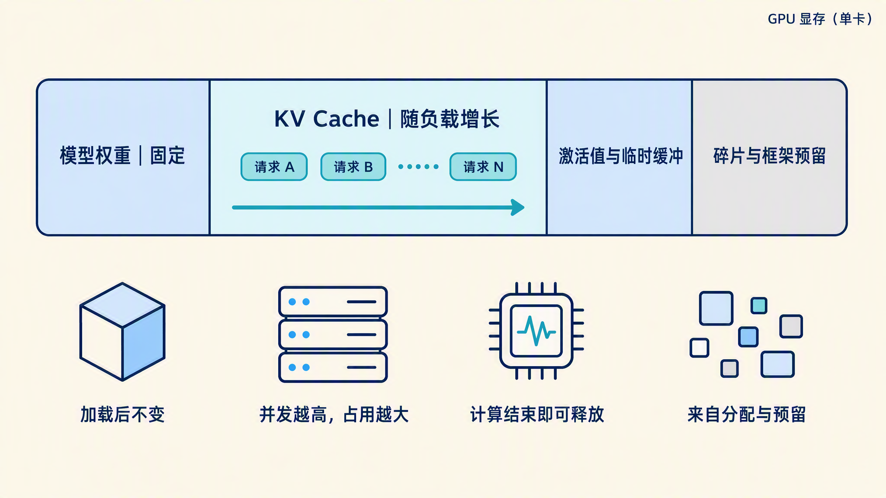
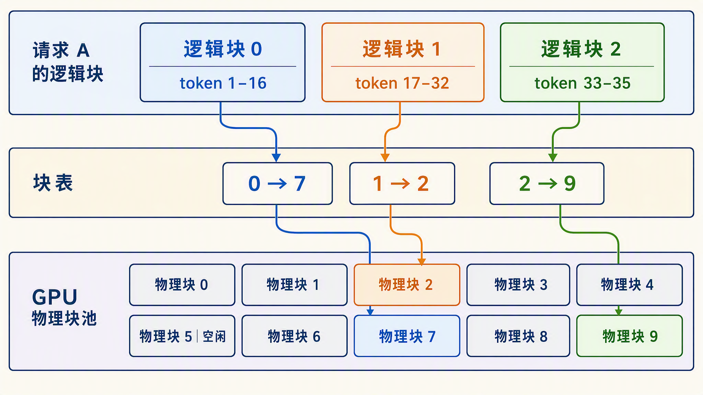
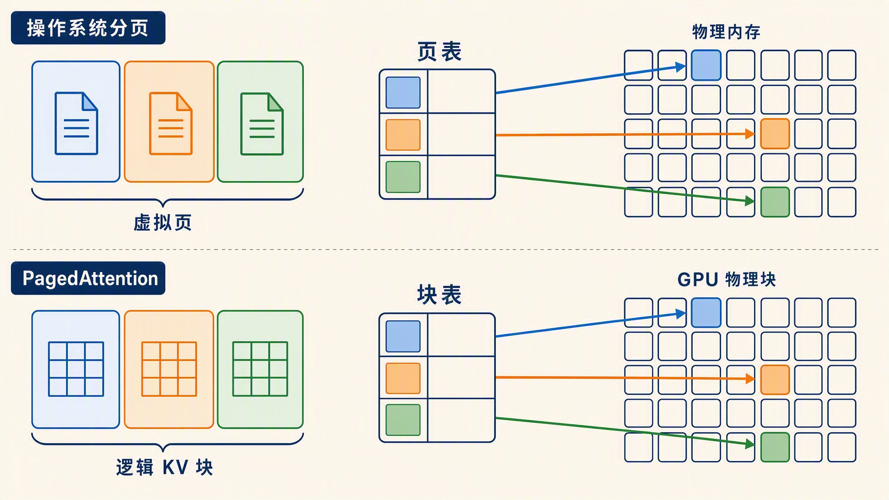
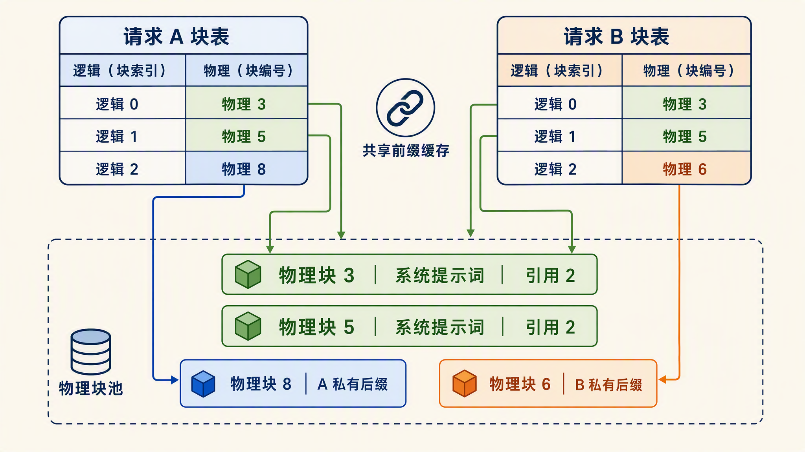
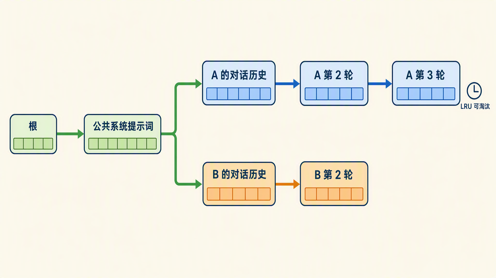
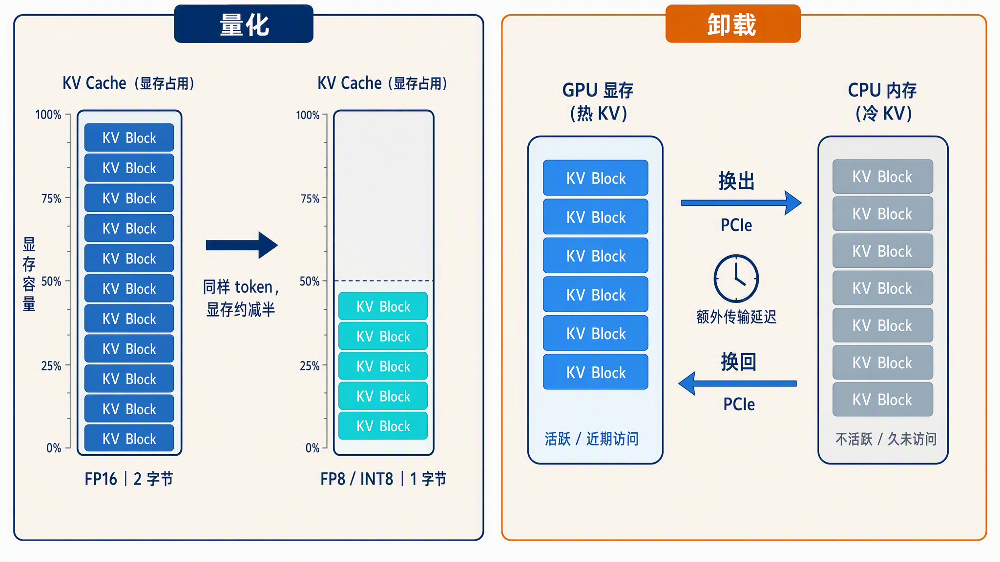

# 学习大模型推理的显存优化：PagedAttention 与前缀缓存

在上一篇中，我们解决了 GPU 空转的问题：用迭代级调度替代静态批处理，请求随到随入、随完随出，GPU 不再为了等齐一批请求而闲置。调度器的目标很明确，就是往运行集里塞尽可能多的并发请求，把算力吃满。

但并发不是想加就能加的。每个在跑的请求都背着一份 KV Cache，在 KV Cache 那一篇里我们总结过一个公式：缓存大小 = 2 × 层数 × KV 头数 × 头维度 × 序列长度 × 每元素字节数，可见缓存随序列长度线性增长，再乘上并发数。Qwen3-0.6B 这样的小模型，一个 token 的缓存约 112 KB，一条 4k 序列就是 448 MiB。于是矛盾来了：批处理想并发更多请求，显存却先不够了。现实里限制服务吞吐的，往往不是算力而是显存。

今天这篇就来讲推理显存管理里最经典的两项技术：**PagedAttention** 和**前缀缓存（Prefix Caching）**。前者把 KV Cache 的分配方式彻底改掉了，后者在前者的基础上让多个请求共享同一段缓存。

## 显存都去哪了

要优化显存，先看清一块 GPU 的显存都被谁占了。推理时的显存大致分四块：

* **模型权重**：加载后就固定不变。一个 FP16 的 7B 模型约 13 GiB，这部分没什么可省的（权重量化是另一篇的话题）
* **KV Cache**：所有在跑请求的缓存总和。它随并发数和序列长度动态增长，负载越重涨得越多，是显存里唯一随流量浮动的大头
* **激活值与临时缓冲**：前向计算中间产物的临时显存，比如注意力得分矩阵。单个请求的激活不大，但也随并发涨
* **碎片与预留**：分配器管理显存时产生的缝隙，以及框架自身预留的部分

四块占用的关系示意如下：



权重是死的，激活值占比小，真正能做出文章的只有 KV Cache。所以推理引擎的显存优化，几乎全部围绕 KV Cache 的分配和复用展开。

## 按最大长度预留

先看不做任何优化时，推理系统怎么给 KV Cache 分配显存。最朴素的做法是：请求一进来，就按**最大可能长度**给它预留一整段连续显存。比如 `max_model_len` 设成 4096，那不管这条请求最终只用 200 个 token 还是真用满 4096，引擎一开始就按 4096 把一整段显存占住，请求结束才释放。

这个做法实现简单，但浪费是结构性的，主要有三类：

* **内部碎片（Internal Fragmentation）**：按最大长度预留，实际用多少算多少，预留出来没用上的部分一直空着。大部分请求的长度远小于上限，空着的部分是常态
* **预留浪费**：请求刚开始生成第 1 个 token 时，后面几千个 token 的位置就已经被锁定，别的请求用不上
* **外部碎片（External Fragmentation）**：不同请求要预留的段长不一，显存被切得七零八落。剩余总量可能够，但凑不出一段连续的来满足新请求

因此，真正存了有效 KV 的部分往往只占一小半。vLLM 团队在他们的论文和[官方博客](https://vllm.ai/blog/2023-06-20-vllm)里给出过实测：传统系统里这类浪费能占到 KV Cache 显存的 **60% 到 80%**，也就是说真正用来存数据的只有两三成。显存利用率上不去，能并发的请求数就上不去，continuous batching 攒出来的调度优势也就发挥不出来。

## PagedAttention 原理

PagedAttention 由 vLLM 团队提出，论文 [*Efficient Memory Management for Large Language Model Serving with PagedAttention*](https://arxiv.org/abs/2309.06180) 发表在 SOSP 2023 上，一作是 Woosuk Kwon。它的核心思路来自一个类比：操作系统用虚拟内存分页管理内存，PagedAttention 用同样的办法管理 KV Cache。

先回忆操作系统是怎么管内存的。操作系统从不要求一个进程的内存物理上连续。它把内存切成固定大小的**页（Page）**，进程看到的是一串连续的虚拟地址，背后由**页表（Page Table）**把虚拟页映射到分散在物理内存各处的物理页。用多少分多少，进程结束就回收。这套机制解决了和上面一模一样的问题：按峰值预留的浪费、大小不一的连续段造成的外部碎片。

PagedAttention 把这套原样搬到了 KV Cache 上：

* **块（Block）**：KV Cache 不再是一整段连续空间，而是切成固定大小的块，每块存固定数量 token 的 K 和 V。vLLM 默认一块 16 个 token
* **逻辑块与物理块**：每个请求看到的仍然是一串连续的逻辑块，实际数据存在显存里分散的物理块上，物理块不要求连续
* **块表（Block Table）**：维护逻辑块到物理块的映射，角色相当于页表
* **按需分配**：请求每生成满一个块的 token，才向空闲块池申请下一个物理块，不再提前预留

逻辑块、块表、物理块三者的映射关系如下：



可以看到，请求 A 的 35 个 token 占了 3 个逻辑块，实际落在物理块 7、2、9 上，彼此不相邻，但块表把映射关系记下来后，注意力计算照常进行。调度器眼里所有物理块都是等价的，谁空了就给谁。

下面是 PagedAttention 和操作系统分页的类比图：



分页之后，前面的三类浪费基本被消掉了。内部碎片只剩最后一个没填满的块，一条序列最多浪费 15 个 token 的空间。外部碎片没有了，因为所有块尺寸相同，任何空块都能直接用。预留浪费也没有了，因为根本不再预留。论文给出的数据是浪费降到 **4% 以内**，对比前面 60% 到 80% 的浪费，同一块显卡能容纳的并发请求数翻了好几倍。

> 有人可能会想：一个块 16 个 token，一条序列最多浪费 15 个，那把块改小，浪费不就更少了吗？其实块大小不是越小越好。块太小，块表就会变长，管理和寻址开销就会变大；16 个 token 一块是工程上比较平衡的选择，vLLM 把它作为默认值，也可以通过启动参数调整。

## 前缀缓存

PagedAttention 的收益不止省显存。块被统一管理起来之后，一个新能力自然就出现了：**块可以被多个请求共享**。这就引出了今天第二个主角，前缀缓存。

前缀共享的机会从哪来？实际服务里，大量请求的前缀是一模一样的：

* **系统提示词**：同一个应用的所有请求，开头都是同一段 system prompt，动辄几百上千 token
* **多轮对话**：客户端每次都要把完整历史重新发给服务端，第 N 轮请求的前缀就是第 N-1 轮的完整内容
* **Few-shot 示例**：在提示词里给模型几个输入输出样例再提问，一批评测或抽取任务共用同一段示例，只有最后的问题不同

没有前缀缓存时，这些相同的前缀每个请求各算一遍 prefill、各存一份缓存，纯纯的重复劳动。有了分块管理之后，做法就很直接了：给每个块的内容算一个 **hash**，key 里包含这个块的 token id 和它前面所有前缀的信息。新请求进来时，先按块查 hash，命中说明显存里已经有内容完全相同的块，直接把物理块映射进自己的块表，prefill 只算没命中的部分。

如下图所示，两个请求共享系统提示词前缀的情况如下，物理块 3 和 5 被两条请求的块表同时引用：



共享块上挂着**引用计数**，被几个请求引用就记几。请求结束时计数减一，减到零的块才进空闲池等待复用或回收。

前缀缓存的收益是双份的：一是省显存，共享的前缀只存一份；二是省计算，命中部分的 prefill 整个跳过，直接降低了 TTFT。对长系统提示词和多轮对话这类负载，命中率可以非常高。

vLLM 把这个能力叫 **Automatic Prefix Caching（APC）**，V1 引擎里默认开启，[官方文档](https://docs.vllm.ai/en/latest/features/automatic_prefix_caching/)有专门的章节介绍。SGLang 则做了进一步的细化，提出了 **RadixAttention**：它不用 hash 表按块匹配，而是用一棵**基数树（Radix Tree）**来组织缓存。基数树是一种压缩的前缀树，公共前缀在树里天然是同一条路径，因此可以做任意长度的前缀匹配。缓存淘汰再配合 LRU（Least Recently Used，最久未使用）策略，优先逐出最久没用的节点。多轮对话、树状探索这类共享模式复杂的场景，RadixAttention 的命中率会比固定块大小的 hash 匹配更稳。[SGLang 的论文](https://arxiv.org/abs/2312.07104)里有完整的设计和实验，想深入的同学可以看看。

RadixAttention 的缓存组织方式示意如下，相同前缀收敛到同一条树路径上：



## 动手体验前缀缓存

概念讲完，我们亲手验证一下命中效果。用 vLLM 起一个 OpenAI 兼容服务，显式打开前缀缓存：

```bash
$ vllm serve Qwen/Qwen3-0.6B --enable-prefix-caching --port 8000
```

> 在较新的 vLLM 版本里，V1 引擎默认就开启了前缀缓存，不加这个参数也有同样的效果。老版本需要显式指定。

然后写个客户端，连续发两个请求，让它们共享一段很长的系统提示词，分别测一下 TTFT：

```python
import time
from openai import OpenAI

client = OpenAI(base_url="http://localhost:8000/v1", api_key="EMPTY")

# 构造一段较长的公共前缀，模拟应用层的系统提示词
system_prompt = "你是一位资深的技术编辑，回答要准确简洁。" * 200

def measure_ttft(question):
    start = time.perf_counter()
    resp = client.chat.completions.create(
        model="Qwen/Qwen3-0.6B",
        messages=[
            {"role": "system", "content": system_prompt},
            {"role": "user", "content": question},
        ],
        max_tokens=8,
        stream=True,
    )
    for _ in resp:  # 收到第一个 token 就计时结束
        break
    return time.perf_counter() - start

print("第一次请求 TTFT:", measure_ttft("介绍下 KV Cache"))
print("第二次请求 TTFT:", measure_ttft("介绍下 PagedAttention"))
```

我实际跑出来的结果如下：

```text
第一次请求 TTFT: 0.32561847753822803
第二次请求 TTFT: 0.01986777689307928
```

第一个请求要完整 prefill 整段系统提示词，几百上千个 token 逐个算一遍，TTFT 约 326 毫秒。第二个请求的前缀和它完全相同，前缀缓存命中，这段 prefill 被整个跳过，TTFT 只有约 20 毫秒，差了 16 倍。具体的毫秒数和提示词长度、硬件强相关，但缓存命中后明显更快这个趋势是稳定的。

服务端这边也能直接观察到命中情况。vLLM 的日志会周期性打印前缀缓存命中率，刚才这两次请求对应的日志是：

```text
(APIServer pid=176492) INFO 08-24 07:40:29 [loggers.py:310] Engine 000: Avg prompt throughput: 222.7 tokens/s, Avg generation throughput: 1.6 tokens/s, Running: 0 reqs, Waiting: 0 reqs, GPU KV cache usage: 0.0%, Prefix cache hit rate: 49.8%
```

第二个请求的公共前缀全部命中，第一次是 0%，两次平均下来正好在一半左右，日志里的 49.8% 和它对上了。在真实服务里，如果所有请求都挂同一段系统提示词，这个值会稳定在很高的水平。

> 前缀匹配是在 token 层面精确进行的。系统提示词差一个字符、聊天模板换一个版本，token 序列就变了，缓存全部失效。所以线上服务要保证前缀部分的内容和模板严格稳定。

## KV Cache 量化

除了在分配方式上着手优化，还有一条更直接的路：让缓存里的每个元素占更小的空间。回看显存公式，最后一个因子是每元素字节数，FP16 是 2 字节。把它换成 **FP8（8 位浮点）** 或 **INT8（8 位整型）**，每个元素只占 1 字节，KV Cache 直接减半，能容纳的并发或上下文长度近似翻倍。

vLLM 可以通过下面的参数开启：

```bash
$ vllm serve Qwen/Qwen3-0.6B --kv-cache-dtype fp8
```

用起来是一个参数的事，但 FP16 的数值压进 8 位，信息总有损失，损失多少取决于一个关键系数：**scale（缩放系数）**。FP8 能表示的数值范围很小（e4m3 格式最大只有 448），而 KV Cache 里的实际数值范围可能超出它，所以量化时需要一个缩放系数，把原始数值压缩进 FP8 的量程，读出来时再放大回去，这个系数就是 scale。scale 定得不准，要么数值超出量程被截断，要么量程没占满白白损失精度。

> e4m3 是 FP8 的一种格式，名字就是它的结构：1 位符号、4 位指数（e）、3 位尾数（m）。指数位决定量程，4 位指数让它最大表示到 448；尾数位决定精度，3 位尾数意味着相对精度只能到 1/8 左右。FP8 还有一种 e5m2 格式，指数多一位、尾数少一位，量程更大但精度更粗，训练里存梯度用得多。推理场景的 KV Cache 量化一般用 e4m3，vLLM 的 `fp8` 选项默认就是它。

vLLM 默认的做法是不校准，所有 scale 直接设为 1.0，多数模型上效果够用。如果追求更稳的精度，官方推荐用 [llm-compressor](https://github.com/vllm-project/llm-compressor) 做离线校准：拿几百条有代表性的数据过一遍模型，统计 K、V 激活值的实际分布，算出合适的 scale，保存成一个带 scale 的新模型目录，vLLM 加载时自动读取。它还支持更细的粒度，从逐张量一个 scale 细化到每个注意力头一个 scale（目前只有 Flash Attention 后端支持）。

scale 定准之后，剩下的问题是：8 位终究比 16 位少了一半信息，对生成质量的影响有多大？实践的结论是可控的。KV Cache 里的数值分布相对集中，8 位量化对生成质量的影响很小，这也是各家引擎都敢默认提供这个选项的原因。vLLM 官方博客 2026 年 4 月有一篇 [FP8 KV Cache 的综述](https://vllm.ai/blog/2026-04-22-fp8-kvcache)，梳理了当前的实现状态和适用场景，它给的默认策略是：长上下文、显存受限的场景直接从 FP8 起步，scale 不校准通常就够用，观察到持续性的精度下降再考虑校准。

不过 FP8 也不是在所有情况下都划算，博客里列了几种该留在 BF16（或部分留在 BF16）的情况：

* **上下文很短（7k token 以内）**：FP8 每步有一笔固定开销，缓存变小的收益随长度线性增长，太短就抵不回来，这时 BF16 的 token 间隔反而略好
* **head_dim 为 256 的模型且在意 prefill 延迟**：为了保证长上下文精度，FP8 注意力计算里用了两级累加，这笔开销在大头维度下会吃掉 FP8 的算力优势，长上下文时 TTFT 最高涨到 1.6 倍
* **未校准精度持续下移**：个别模型（比如用 FlashMLA 后端的 Kimi-K2.5）在 scale 取 1.0 时会出现系统性的精度下降，不是随机噪声，这时就该按前面说的用 llm-compressor 在目标数据上校准
* **混合注意力模型的小滑窗层**：滑动窗口层的缓存大小有界，固定开销摊不回来。这种情况不用放弃 FP8，加上 `--kv-cache-dtype-skip-layers sliding_window`，让滑窗层保持原精度、其余层量化即可

## 卸载到内存

如果分页、共享、量化全用上之后显存还是装不下，这时会怎么样呢？

默认情况下，vLLM 的调度器给请求分配不到新的 KV 块时，会**抢占（Preemption）**一部分在跑的请求来腾地方：从运行集的尾部开始踢，也就是最新加入、优先级最低的请求先被牺牲，它们的 KV 块被释放出来，其余请求继续跑。被踢的请求回到等待队列，等显存有了空位再重新调度上来。V1 引擎默认的抢占方式是重算（RECOMPUTE）：被抢占的请求不留缓存，恢复时从 prefill 重新跑一遍。之所以敢直接丢，是因为被抢占请求的缓存是还没算完的半成品，保存价值不高，重算的开销比换出再换回更划算。服务日志里如果出现 `preempted by PreemptionMode.RECOMPUTE` 的警告，就说明显存开始紧张了，该考虑调大 `gpu_memory_utilization`，或者收紧上一篇讲的 `max_num_seqs`。

但不是所有块都适合一丢了之。前缀缓存里的块是算完的成品，后面还可能被其他请求反复用到，丢了下次就得整段 prefill 重算。对这类有复用价值的块，更省的办法是挪到 CPU 内存里存着，而不是直接丢掉，这就是**卸载（Offload）**。vLLM 现在有原生的 CPU 卸载，两个参数就能开：

```bash
$ vllm serve Qwen/Qwen3-0.6B --kv-offloading-size 64 --kv-offloading-backend native
```

`kv-offloading-size` 指定拿出多少 GiB 内存做卸载缓冲；`kv-offloading-backend` 默认 `native`，也可以换成 `lmcache`，也就是 [LMCache](https://github.com/LMCache/LMCache) 这类外部组件，它把卸载做成了完整的多级缓存，CPU 内存之后还能再接 NVMe 磁盘和远端存储。

> LMCache 是一个开源的 KV Cache 管理层，以插件形式挂在 vLLM 这类推理引擎上，把 KV 块的存放从 GPU 显存扩展到 CPU 内存、本地磁盘甚至远端存储，还支持跨请求、跨引擎的缓存共享。可以把它理解成给推理引擎外挂的一套缓存中间件。

值得一提的是，卸载主要不是给单个请求扩上下文，而是给前缀缓存扩容。被挤出显存的块在内存里仍然挂着 hash，后续请求做前缀匹配时可以直接命中到内存里的块，省掉的是重算 prefill 的时间。代价是数据要走 PCIe（连接 CPU 和 GPU 的总线）来回搬运，命中内存里的块比命中显存慢，但比重算一遍 prefill 快得多，所以它适合当显存之后的第二级缓存，而不是主力手段。

最后把量化和卸载放在一起对比收尾：量化是把每个 KV 元素占用的字节数压小，卸载是把暂时不用的 KV 块搬到容量更大的 CPU 内存，一个省空间，一个扩空间。



## 小结

今天这篇围绕 KV Cache 的显存管理，讲了三个层次的手段：

1. **问题**：推理显存里权重是固定的，KV Cache 是随负载动态增长的大头。朴素做法按最大长度预留连续显存，内部碎片、预留浪费、外部碎片加起来会浪费 60% 到 80%
2. **PagedAttention**：vLLM 团队在 SOSP 2023 提出的方案，类比操作系统虚拟内存分页，把 KV Cache 切成固定大小的块，逻辑块经块表映射到不连续的物理块，按需分配，浪费降到 4% 以内
3. **前缀缓存**：分页让块可以跨请求共享，对块内容算 hash，系统提示词、多轮历史这类公共前缀命中后只存一份、只算一遍，省显存也省 TTFT。SGLang 的 RadixAttention 用基数树做了更细粒度的共享
4. **量化与卸载**：KV Cache 存 FP8/INT8 再省一半；显存实在不够时可以把不活跃的块挪到 CPU 内存

到这里，推理的显存问题就有了完整的答案：能省的地方省下来，能共享的地方共享出去，同一块显卡能服务的请求数翻了几倍。下一个问题自然就是速度了：每个请求本身还能不能跑得更快？下一篇我们就来看推理加速的三板斧，量化、投机解码和 PD 分离，欢迎继续关注。

## 参考

* [vLLM 官方博客：Easy, Fast, and Cheap LLM Serving with PagedAttention](https://vllm.ai/blog/2023-06-20-vllm)
* [PagedAttention 论文：vLLM, SOSP 2023](https://arxiv.org/abs/2309.06180)
* [vLLM 官方文档：Automatic Prefix Caching](https://docs.vllm.ai/en/latest/features/automatic_prefix_caching/)
* [vLLM 官方文档：性能优化与抢占机制](https://docs.vllm.ai/en/latest/configuration/optimization/)
* [vLLM 官方博客：FP8 KV Cache 与注意力量化现状](https://vllm.ai/blog/2026-04-22-fp8-kvcache)
* [llm-compressor GitHub 仓库](https://github.com/vllm-project/llm-compressor)
* [SGLang 论文：RadixAttention 与结构化语言模型程序执行](https://arxiv.org/abs/2312.07104)
* [Hugging Face transformers 官方文档：KV Cache 策略](https://huggingface.co/docs/transformers/main/en/kv_cache)
* [LMCache 文档：将 KV Cache 卸载到 CPU](https://docs.lmcache.ai/getting_started/quickstart/offload_kv_cache.html)
