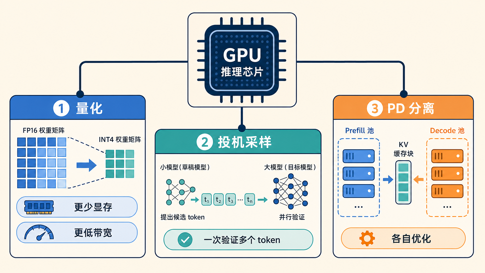
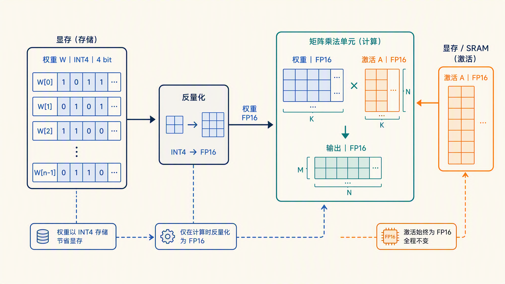
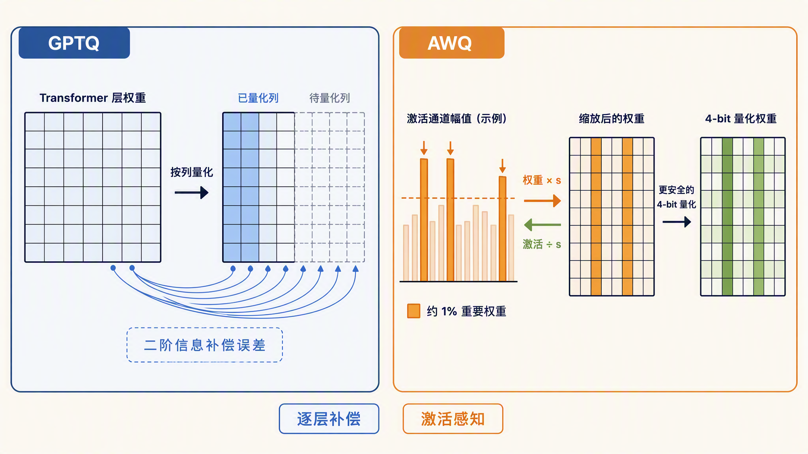
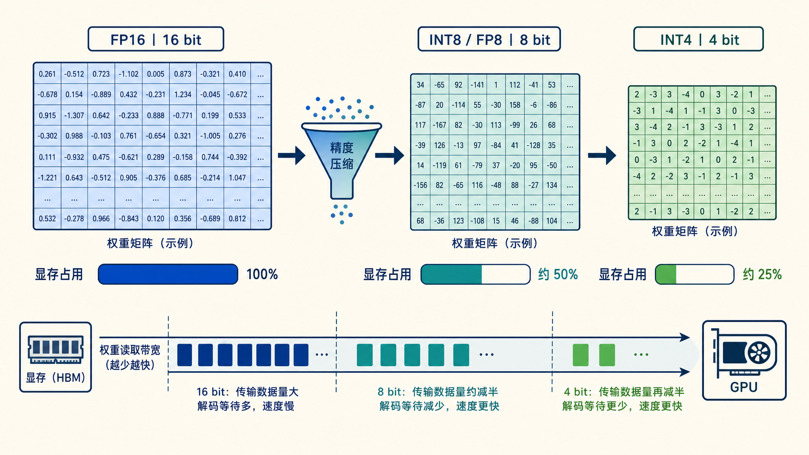
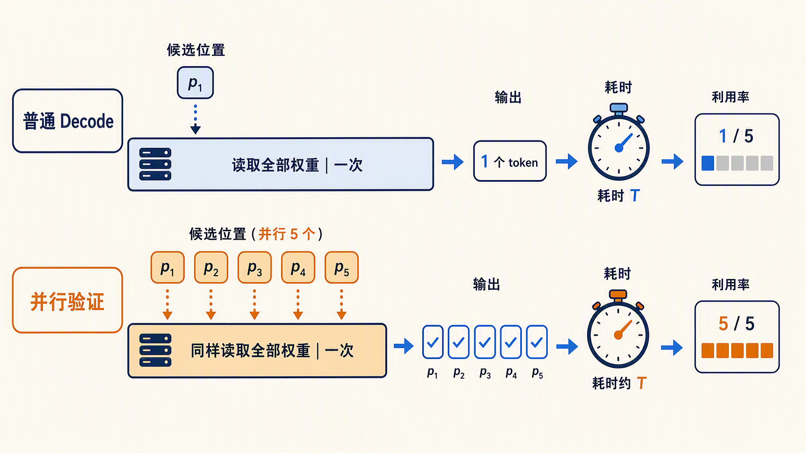
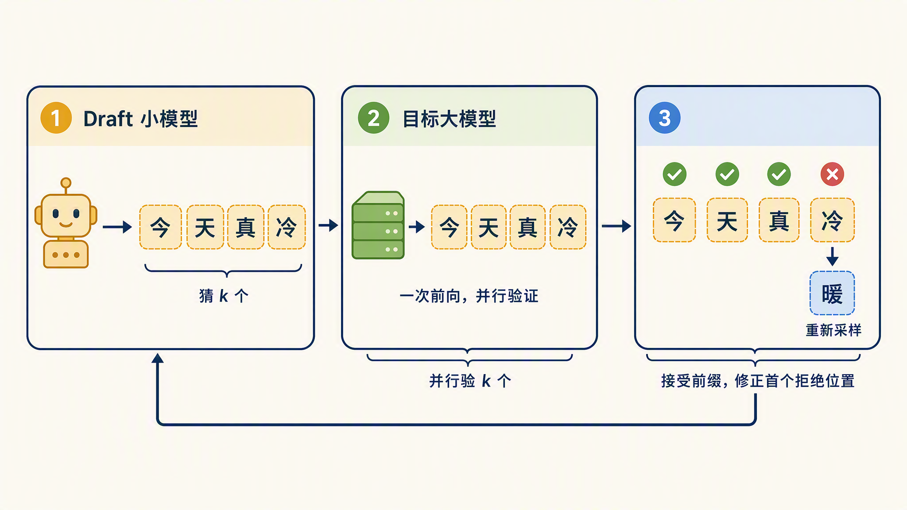
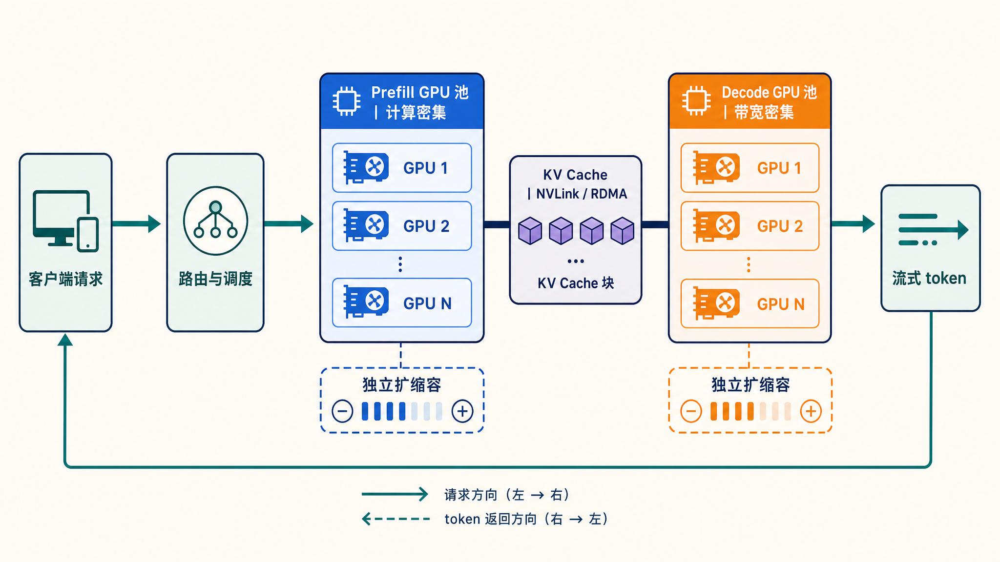
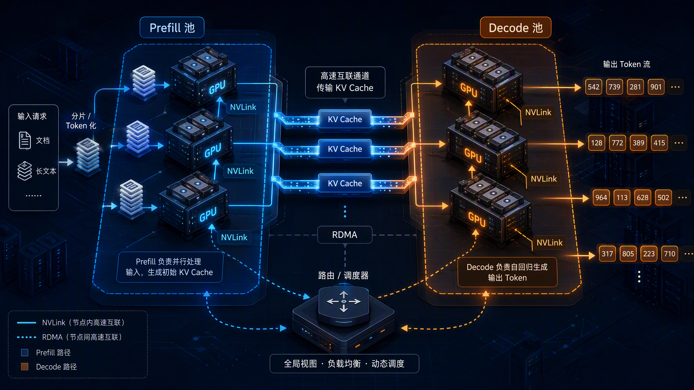
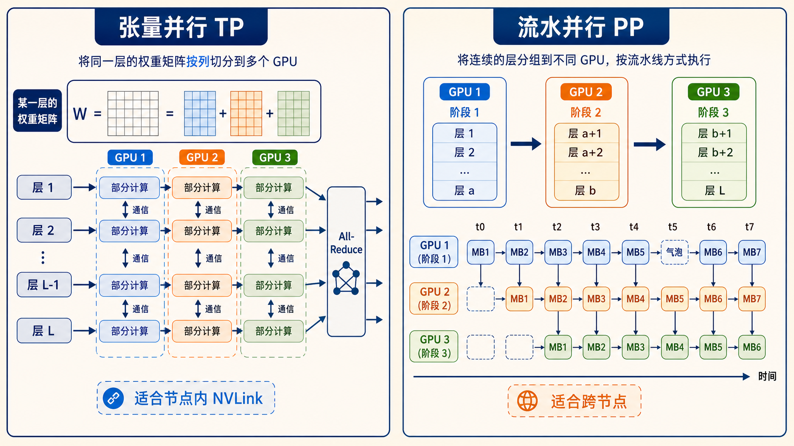

# 学习大模型推理的加速技术：量化、投机采样与 PD 分离

在上一篇中，我们学习了推理的显存优化：PagedAttention 把 KV Cache 切成固定大小的块按需分配，前缀缓存让相同前缀的请求复用已算好的 KV 块。再往前看，KV Cache 本身是拿显存换时间，连续批处理是让 GPU 不空转。这些优化有一个共同的特点：它们不改模型、不改输出，只是把现有的资源省着用，把能复用的计算复用起来。

今天我们要讲的三个技术更激进一些。它们会直接改动模型的存储精度、改动生成 token 的方式、改动整个集群的部署形态，目标只有一个：让推理跑得更快。这三类技术分别是**量化（Quantization）**、**投机采样（Speculative Decoding）** 和 **PD 分离（Prefill/Decode Disaggregation）**，下面我们逐个来看。



## 量化：把 FP16 权重压到 4bit

**量化（Quantization）** 是指把模型参数从高精度数值（如 FP16，每个参数占 2 字节）转换成低精度数值（如 INT8、INT4）存储和计算的技术。一个 7B 模型用 FP16 存要 14 GB 显存，压到 4bit 后只需要 4 GB 左右，原本单卡放不下的模型，现在一张卡就能跑。

量化带来的收益是双重的。一是显存占用直接按位宽比例下降；二是第六篇讲过，decode 阶段是显存带宽瓶颈，每生成一个 token 都要把全部权重从显存读一遍，权重体积小了，读取就快，decode 速度也就跟着上去了。

### 从 W4A16 说起

量化方案常用 W 和 A 两个数字命名。W 是权重（Weight）的位宽，A 是激活（Activation，即前向计算中每一层的中间结果）的位宽。**W4A16** 表示权重压成 4bit、激活保持 16bit，是目前最常见的配置。

为什么只压权重不压激活？因为激活里存在少量数值特别大的离群通道（outlier channel），硬压到低精度会产生很大的误差；而权重分布比较平滑，压缩余地大。权重在加载时一次性量化好，激活在推理时动态计算，所以 W4A16 的实际做法是：显存里存 4bit 权重，计算时先反量化（dequantize）回 FP16 再做矩阵乘。显存和带宽的收益照拿，计算本身还是 FP16 精度，这是它精度损失小的原因。

> 所谓通道，就是激活向量的一个维度。模型的隐藏状态是一个几千维的向量，研究者发现，其中少数几个维度上的数值会系统性地比其他维度大出几十倍甚至上百倍，这些维度就是离群通道。量化要按数值范围定刻度，这几个大通道会把刻度撑得很大，其余占绝大多数的普通数值只能挤在刻度底部的一小段里，舍入误差就被放大了。这个现象由 [LLM.int8() 论文](https://arxiv.org/abs/2208.07339) 系统研究过，模型规模越大越明显。



### GPTQ：逐层二阶误差补偿

**GPTQ** 是 Frantar 等人在 2022 年提出的**后训练量化（Post-Training Quantization，PTQ）** 方法，论文是 [*GPTQ: Accurate Post-Training Quantization for Generative Pre-trained Transformers*](https://arxiv.org/abs/2210.17323)。后训练量化的意思是，模型训练完成后，不需要重新训练，只用一小批校准数据就能把权重量化好。

GPTQ 的核心思想是逐层量化，并且每量化一个权重，就用这一层的二阶信息（近似 Hessian 矩阵）调整剩余还没量化的权重，把刚引入的误差补偿掉。这样误差不会在层内累积，模型在 4bit 甚至 3bit 下仍能保持接近原始的精度。论文报告，175B 参数的模型大约 4 个 GPU 小时就能完成量化，在 A100 上端到端推理加速约 3.25 倍。

### AWQ：激活感知，保护重要权重

**AWQ（Activation-aware Weight Quantization，激活感知权重量化）** 是 Lin 等人在 2023 年提出的方法，来自 MIT 韩松团队，[论文](https://arxiv.org/abs/2306.00978)发表在 MLSys 2024。它的出发点是一个观察：模型里只有约 1% 的权重对输出影响大，而且这些重要权重不能从权重自身的大小看出来，要从激活的分布里看。哪个权重通道对应的激活值大，哪个通道就重要。

找到这 1% 之后，最简单的保护办法是把它们保留成 FP16，但混合精度对硬件不友好。AWQ 的做法更巧：给重要通道的权重乘上一个缩放系数，同时把对应的激活除以同一个系数。数学上输出不变，但缩放后的权重在量化时落入了更安全的区间，等效于获得了更高的有效精度。AWQ 校准快、4bit 下精度表现好，vLLM、SGLang、TensorRT-LLM 都内置了支持，是目前部署 4bit 模型的主流选择。



### FP8：新硬件的原生支持

INT8 和 INT4 量化都需要反量化和专门的 kernel 支持，而 **FP8（8 位浮点数）** 走的是另一条路：让硬件直接支持低精度浮点运算。NVIDIA 从 Hopper 架构（H100）开始在 Tensor Core 里原生支持 FP8（支持 e4m3 和 e5m2 两种格式），FP8 的算力正好是 FP16 的两倍；到 Blackwell 架构（B200）又进一步支持到 FP4。

硬件原生支持意味着不需要反量化步骤，矩阵乘直接在 FP8 下完成，显存减半的同时算力翻倍。vLLM 里开启动态 FP8 只需要一个参数 `--quantization="fp8"`，不需要准备校准数据，[官方文档](https://docs.vllm.ai/en/latest/features/quantization/llm_compressor/fp8/)有详细说明。代价是 FP8 依赖新硬件，A100 及更早的卡用不了。

### 精度、显存、速度的三方权衡

量化没有免费的午餐，它是三个维度之间的权衡。把常见的几档方案放在一起对比：

| 方案 | 权重位宽 | 激活位宽 | 权重显存（相对 FP16） | 精度损失 | 硬件要求 | 典型场景 |
| ---- | ---- | ---- | ---- | ---- | ---- | ---- |
| FP16/BF16 | 16 | 16 | 100% | 无 | 所有 GPU | 精度敏感、显存充足 |
| FP8 W8A8 | 8 | 8 | 约 50% | 极小 | Hopper / Blackwell 等新卡 | 数据中心高吞吐服务 |
| INT8 W8A8 | 8 | 8 | 约 50% | 小 | 广泛支持 | 通用的保守压缩 |
| W4A16（GPTQ/AWQ） | 4 | 16 | 约 25% | 可感知但可控 | 几乎所有 GPU | 单卡跑大模型、边缘部署 |

选择时的经验法则是：有新卡就优先 FP8，它几乎不掉精度；要在消费级显卡上塞进大模型就用 W4A16；对精度极度敏感的场景就保持 FP16，把优化留给别的手段。



### 动手：加载一个量化模型

Hugging Face 上很多热门模型都有官方发布的 AWQ 版本，模型名里带 `AWQ` 后缀。用 [Transformers](https://huggingface.co/docs/transformers) 加载量化模型和普通模型写法完全一样：

```python
from transformers import AutoModelForCausalLM, AutoTokenizer

# 加载 Qwen3-4B 的 4bit AWQ 量化版本，需要安装 autoawq
model = AutoModelForCausalLM.from_pretrained(
    "Qwen/Qwen3-4B-AWQ",
    device_map="auto",
)
tokenizer = AutoTokenizer.from_pretrained("Qwen/Qwen3-4B-AWQ")

messages = [{"role": "user", "content": "用一句话解释什么是模型量化"}]
inputs = tokenizer.apply_chat_template(
    messages,
    return_tensors="pt",
    add_generation_prompt=True,
    enable_thinking=False,
).to(model.device)
output = model.generate(inputs, max_new_tokens=100)
print(tokenizer.decode(output[0], skip_special_tokens=True))
```

可以看到，API 层面没有任何区别，量化对使用者是透明的。变化的只有显存占用和生成速度。

## 投机采样：小模型猜，大模型验

**投机采样（Speculative Decoding，也叫投机解码）** 是 Leviathan 等人在 2023 年发表的加速技术，论文是 [*Fast Inference from Transformers via Speculative Decoding*](https://arxiv.org/abs/2211.17192)。同一时期 DeepMind 的 Chen 等人也独立提出了等价的 [Speculative Sampling](https://arxiv.org/abs/2302.01318)。

### 为什么验证 k 个和生成 1 个一样快

要理解投机采样，先回忆第六篇讲过的结论：decode 阶段每步只处理一个新 token，矩阵乘的规模很小，GPU 算力大量闲置，耗时主要花在把权重从显存搬进计算单元。也就是说，一次前向处理 1 个 token 和处理 5 个 token，读取权重的开销是一样的，总耗时几乎相同。

自回归生成的低效就在这里：每步只产出 1 个 token，却付出了读取全部权重的代价。投机采样的思路是，既然一次前向验证多个 token 几乎不多花时间，那就让一个便宜的小模型先猜，大模型负责验收。



### 工作流程

具体流程分三步。首先，用一个**草稿模型（draft model）**（同系列的小尺寸模型，比如参数量小几十倍）自回归地快速猜出 k 个候选 token。然后，把这 k 个 token 拼在现有序列后面，让大模型做一次前向，并行算出这 k 个位置各自的概率分布。最后逐个比对：如果大模型也认可某个 token 就接受，遇到第一个不认可的位置就停下，用修正策略在那里重新采样一个 token，后面的猜测全部作废，它们在 KV Cache 里刚算出的条目也跟着丢弃。

为什么一次前向就能验 k 个位置呢？不知道读者还记不记得第四篇的末尾埋下的那个彩蛋。当时跑前向传播时发现，输入 3 个 token，输出的 logits 形状是 [1, 3, 151936]，每个位置都有一份完整的词表分数，只是自回归生成只取最后一个位置的，其余都扔掉了。投机采样就是把这些扔掉的分布捡起来用：把前缀和 k 个候选拼成一整段做一次前向，候选 token 所在位置的那几行分布，就是大模型「自己生成到这一步会选什么」的答案。由于有因果掩码的保证，每个位置只能看到自己和左边的 token，这几行分布和跑 k 步 decode 逐个算出的分布是同一份结果，区别只在于权重读取从 k 次合并成了一次。整个过程中大模型没有生成任何 token，它只是给现成的 token 打了分。

一轮下来，最坏的情况是接受 1 个修正 token（和普通 decode 一样，不亏），最好的情况是一次收下 k+1 个 token。下图是这三步流程的一个示意：



这个设计有一个非常重要的性质：由于接受和重采样规则是严格按大模型的概率分布推导的，最终输出的分布和不用投机采样时**完全一致**。它是无损加速，不像量化那样需要担心精度损失。实际加速倍数取决于**接受率（acceptance rate）**，即小模型猜得有多准。小模型和大模型越同宗同源（比如同一系列的 1B 对 70B），用词习惯越接近，接受率就越高。

> 接受率还和采样温度有关。贪心解码（temperature 为 0）时，小模型只要猜中大模型概率最高的那个 token 就算命中，接受率最高；温度调高、随机性变大后，猜测变难，加速效果会打折扣。

### 动手：在 Transformers 里开启投机采样

Transformers 的 `generate` 原生支持投机采样，只需要多传一个 `assistant_model` 参数。下面我们加载 Qwen3-4B 作为目标模型，用同系列的 Qwen3-0.6B 当 draft 模型：

```python
from transformers import AutoModelForCausalLM, AutoTokenizer

# 目标大模型和 draft 小模型，同系列才能保证词表一致
target = AutoModelForCausalLM.from_pretrained("Qwen/Qwen3-4B", device_map="auto")
draft = AutoModelForCausalLM.from_pretrained("Qwen/Qwen3-0.6B", device_map="auto")
tokenizer = AutoTokenizer.from_pretrained("Qwen/Qwen3-4B")

messages = [{"role": "user", "content": "写一首关于秋天的短诗"}]
inputs = tokenizer.apply_chat_template(
    messages,
    return_tensors="pt",
    add_generation_prompt=True,
    enable_thinking=False,
).to(target.device)

# 传入 assistant_model 即开启投机采样，生成结果和不传时分布一致
output = target.generate(inputs, assistant_model=draft, max_new_tokens=200)
print(tokenizer.decode(output[0], skip_special_tokens=True))
```

可以看到，用法上只多了一行参数。draft 模型必须和目标模型共用同一个词表，否则两边对 token 的编号对不上，验证无从谈起，这也是 draft 模型通常选同系列小模型的原因之一。

### 改进方向

原版投机采样需要额外部署和维护一个小模型，后续工作沿着去掉独立小模型的方向演进。[Medusa](https://arxiv.org/abs/2401.10774) 的做法是给大模型本身加几个额外的解码头，一次预测后面多个位置的 token，不再需要单独的 draft 模型。[EAGLE](https://arxiv.org/abs/2401.15077) 更进一步，在大模型的倒数第二层特征上做外推来生成候选，接受率比 Medusa 更高。这两个都是当前推理框架里常见的可选项，细节这里就不展开了，感兴趣的同学可以查阅相应的资料。

## PD 分离：prefill 和 decode 各司其职

第三个技术从系统层面入手，它改的不是模型而是部署形态。

### 两类负载天生不合

我们已经不止一次讲过 prefill 和 decode 的负载差异：prefill 一次性处理全部输入 token，矩阵规模大，吃算力（compute-bound）；decode 每步只处理一个 token，反复读权重和 KV Cache，吃带宽（memory-bound）。传统的部署方式把两个阶段放在同一批 GPU 上混跑，因此一个 prefill 请求进来，会抢走 decode 请求的算力，正在生成的用户会感到 token 输出卡顿；反过来，大量 decode 请求占着 KV Cache 显存，prefill 又排不上队。两个阶段互相拖累，而且它们对并行策略、批大小的最优配置完全不同，混在一起只能取一个两头将就的中间值。

前面讲连续批处理时介绍过的分块预填充，就是在引擎内部缓解这种干扰的办法，把长 prefill 切块混进 decode 迭代里跑。今天这个技术的思路更彻底，直接从部署层面把两个阶段分开。

**PD 分离（Prefill/Decode Disaggregation，预填充与解码分离）** 的做法是把两个阶段拆到两个独立的 GPU 池：prefill 池专门处理输入、算好 KV Cache，然后通过高速网络（NVLink 或 RDMA）把 KV Cache 传给 decode 池，decode 池接力做逐 token 生成。两个池可以按各自的负载特征独立扩缩容、独立选并行策略。整体架构如下：



KV Cache 的传输是这套架构的主要开销。一个长上下文的请求，KV Cache 可能有几个 GB，跨机传输必须走高速互联。NVLink 是 NVIDIA GPU 之间的高速互联总线，适合节点内部。RDMA（Remote Direct Memory Access，远程直接内存访问）是一种让一台机器直接读写另一台机器内存的网络技术，绕开两端的 CPU 和操作系统内核，适合跨节点。如果没有这个级别的带宽，省下来的计算时间全搭在搬运上。所以 PD 分离是规模化的技术，请求量大到能填满两个池子时才划算。



### 代表工作

PD 分离这两年从论文走进了生产系统，下面是几个代表性实现：

* **[DistServe](https://arxiv.org/abs/2401.09670)**：2024 年发表于 OSDI 的学术工作，是把 PD 分离系统化的早期代表。它给两个阶段分别优化资源配置和并行策略，并用带宽感知的放置策略尽量让 KV Cache 走节点内的 NVLink。论文报告，在满足延迟目标的前提下，能比当时最先进的系统多服务最多 7.4 倍的请求
* **[Mooncake](https://arxiv.org/abs/2407.00079)**：月之暗面（Moonshot AI）为 Kimi 搭建的生产级推理平台，发表于 USENIX FAST 2025。它在 PD 分离的基础上更进一步，以 KV Cache 为中心设计，把集群里的 CPU 内存、SSD 和 RDMA 网络池化成一个分布式 KV 缓存，长上下文和多轮对话的前缀复用是它的强项
* **[NVIDIA Dynamo](https://github.com/ai-dynamo/dynamo)**：NVIDIA 在 GTC 2025 发布的分布式推理框架，Triton Inference Server 的继任者，PD 分离是它的核心特性之一，并配套了专门做跨机 KV Cache 传输的 NIXL 库
* **[vLLM](https://github.com/vllm-project/vllm)**：开源推理引擎也在原生支持 P/D disaggregation，提供了 KV 传输的连接器接口和部署示例，可以在自己的集群里搭一套分离式服务

如果想从工程落地的角度进一步了解这套架构，DigitalOcean 有一篇 [Prefill/Decode 分离的实践解析](https://www.digitalocean.com/community/tutorials/prefill-decode-disaggregation)，对部署细节的拆解比较细，感兴趣的同学可以看看。

## 再往上：张量并行与流水并行

最后简单提一下更大规模的推理。当模型大到单卡放不下时，就得把模型本身拆开。**张量并行（Tensor Parallelism，TP）** 是把每一层的权重矩阵切开，几张卡各算一部分，每层算完都要做一次卡间通信合并结果，对互联带宽的要求很高，一般限制在节点内的 NVLink 上。**流水并行（Pipeline Parallelism，PP）** 是把模型的层切成几段，每张卡负责连续的一段，请求像流水线一样在卡之间传递，只在段的边界通信，通信量小，但段与段交接时会留下空闲的气泡，适合跨节点部署。实际的大模型部署往往是 TP、PP 加上今天讲的 PD 分离组合使用，这部分作为延伸阅读，今天点到为止。



## 小结

今天我们一口气学了三类推理加速技术：

1. **量化**：把 FP16 权重压到 8bit 或 4bit，显存和带宽收益直接。GPTQ 用逐层二阶信息做误差补偿，AWQ 从激活分布里找出约 1% 的重要权重加以保护，FP8 则依靠 Hopper 和 Blackwell 的原生支持做到几乎无损。选型是精度、显存、速度的三方权衡
2. **投机采样**：用小 draft 模型猜 k 个 token，大模型一次前向并行验证，接受多少算多少。它有效是因为 decode 是带宽瓶颈，验证 k 个 token 和生成 1 个耗时几乎一样，而且输出分布与大模型完全一致，是无损加速。Medusa 和 EAGLE 是去掉独立小模型的改进方向
3. **PD 分离**：prefill 吃算力、decode 吃带宽，混在一起互相拖累，拆到两个 GPU 池各自优化，KV Cache 走高速网络传输。DistServe、Mooncake、NVIDIA Dynamo 和 vLLM 是代表性实现
4. **更大规模的分布式推理**：张量并行切权重、流水并行切层，作为延伸阅读

至此，我们对大模型推理的探索之旅也告一段落。从第一篇的全景地图出发，我们跟着一条请求走完了它的完整旅程：分词、嵌入和位置编码、前向传播、KV Cache、prefill 与 decode、采样、流式输出，又深入了连续批处理、显存优化和今天的加速技术。每个环节我们都拆开了原理，也都动手跑过真实的代码。希望这个系列能帮你建立起对大模型推理的整体认识，下次再看到屏幕上逐字蹦出的回答时，脑子里浮现的不只是文字，还有文字背后的整条流水线。

## 参考

* [vLLM 官方文档：FP8 W8A8 量化](https://docs.vllm.ai/en/latest/features/quantization/llm_compressor/fp8/)
* [vLLM GitHub 仓库](https://github.com/vllm-project/vllm)
* [NVIDIA Dynamo GitHub 仓库](https://github.com/ai-dynamo/dynamo)
* [Transformers 官方文档](https://huggingface.co/docs/transformers)
* [Qwen3-4B-AWQ 模型卡](https://huggingface.co/Qwen/Qwen3-4B-AWQ)
* [GPTQ 论文：Frantar 等人，2022](https://arxiv.org/abs/2210.17323)
* [LLM.int8() 论文：激活离群特征的系统性研究](https://arxiv.org/abs/2208.07339)
* [AWQ 论文：Lin 等人，2023](https://arxiv.org/abs/2306.00978)
* [投机采样论文：Leviathan 等人，2023](https://arxiv.org/abs/2211.17192)
* [Speculative Sampling 论文：Chen 等人，2023](https://arxiv.org/abs/2302.01318)
* [Medusa 论文：多解码头加速，2024](https://arxiv.org/abs/2401.10774)
* [EAGLE 论文：特征级投机采样，2024](https://arxiv.org/abs/2401.15077)
* [DistServe 论文：OSDI 2024](https://arxiv.org/abs/2401.09670)
* [Mooncake 论文：USENIX FAST 2025](https://arxiv.org/abs/2407.00079)
* [DigitalOcean：Prefill/Decode 分离实践解析](https://www.digitalocean.com/community/tutorials/prefill-decode-disaggregation)
