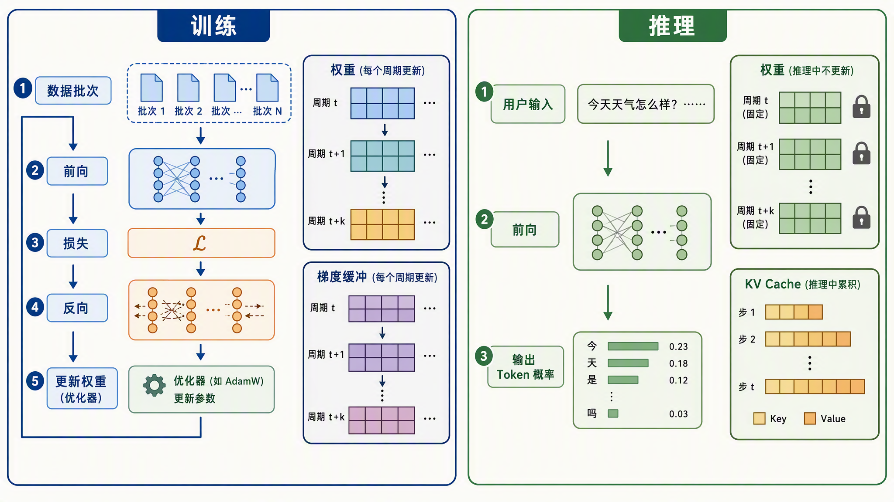
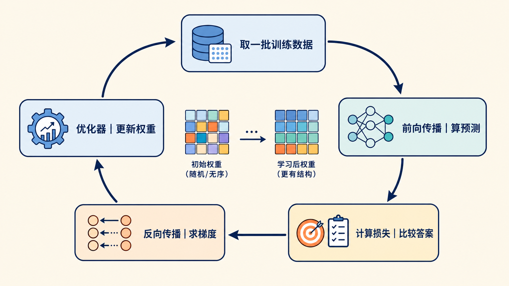
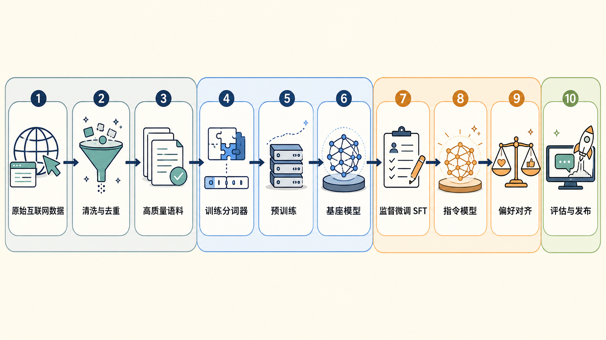
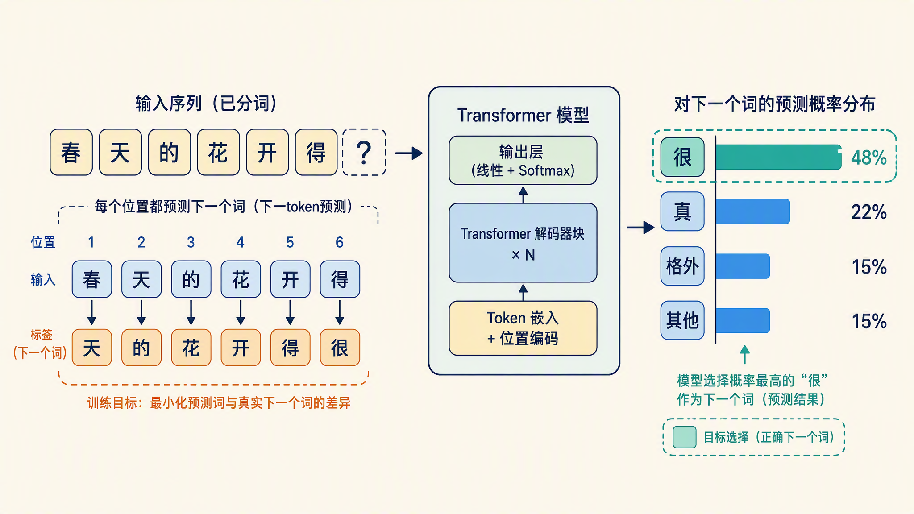
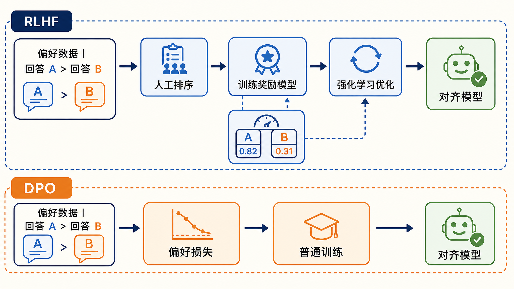
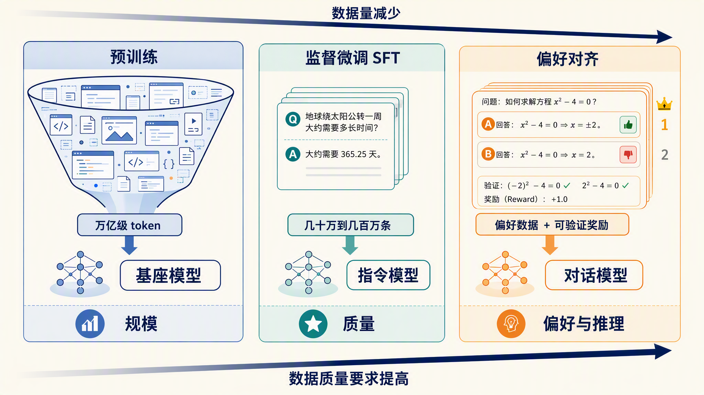

# 大模型训练介绍：一个模型是怎么炼成的

2024 年 12 月，DeepSeek 开源 [DeepSeek-V3](https://arxiv.org/abs/2412.19437) 模型，这是一个 671B 参数的**混合专家（Mixture-of-Experts，简称 MoE）**模型，每次前向只激活 37B 参数。放出的技术报告里有一组数字被反复引用：它在 2048 块 H800 GPU 上用 14.8T token 做预训练，完整训练一共花了 278.8 万 GPU 小时。报告按每 GPU 小时 2 美元的租金折算，总成本约 557.6 万美元。报告同时注明，这个数只算了正式训练那一轮的算力，此前的研究、消融实验和基础设施建设都不在里面。

作为对照，GPT-4 这个级别的模型，外界估算的训练成本在数千万到上亿美元，OpenAI 的 Sam Altman 公开表示过 GPT-4 的训练花费超过 1 亿美元，斯坦福的 AI Index 报告也收录了这类估算。而在另一头，2025 年 11 月微博开源的 1.5B 小模型 [VibeThinker](https://arxiv.org/abs/2511.06221) 宣称整个后训练只花了约 7800 美元，在 AIME（美国数学邀请赛，数学推理能力的常用评测）榜单上超过了 DeepSeek-R1。当然，7800 美元同样只算了后训练，它的基座模型是阿里预训练好的 Qwen2.5-Math-1.5B。

同样是造一个模型，成本可以差出好几个数量级。这些数字谈的都是同一件事：**训练（Training）**，它和我们在上一个系列《大模型推理》里反复讲的**推理（Inference）**正好是一体两面：推理时权重冻结不动，请求进来做一次前向计算就出结果；训练则是反过来，用海量数据一遍又一遍地算损失、调权重，直到模型学会我们想要的本事。

这个系列，我们就把训练从头到尾走一遍。今天的目标是建立整体图景：一个模型从原始互联网数据到能和人对话，中间到底要走过哪些环节。


## 训练和推理的区别

在推理系列的首篇，我们曾提过：训练是造模型，推理是用模型。今天站在训练的角度，把这两个概念再总结一次。

**推理**是上个系列的主角。模型已经训练好，权重是固定的常量，给它一段输入，它做一次前向传播，吐出下一个 token 的概率分布。无论跑多少次请求，权重一个字节都不会变。推理关心的是怎么算得快、算得省，KV Cache、连续批处理这些优化，都是围绕这个目标。

**训练**则是制造这些权重的过程。一开始权重是随机初始化的，模型基本只会输出乱码。训练的做法是反复执行一个循环：拿一批数据算前向，比较模型的预测和标准答案的差距，根据差距调整权重，让下一次预测更准。跑上几万亿 token 之后，权重里就存下了语言规律和世界知识。



这个循环只有四步，如下图所示：



这里有几个术语解释一下：

* **前向传播（Forward Pass）**：数据从输入层流到输出层，算出模型当前的预测结果
* **损失（Loss）**：一个数值，衡量预测和标准答案差多远，差得越远损失越大
* **反向传播（Backpropagation）**：从损失出发，算出每个权重对损失的**梯度（Gradient）**，也就是每个权重该往哪个方向调
* **优化器（Optimizer）**：拿着梯度真正更新权重的算法，常见的有 SGD（随机梯度下降）、Adam，以及后面会提到的 Muon

如果用 PyTorch 写出来，这个循环就是这么几行：

```python
# model 是模型，dataloader 提供一批批数据，optimizer 是优化器
for batch in dataloader:
    # 1. 前向传播：用当前权重算预测
    logits = model(batch["input_ids"])

    # 2. 算损失：预测和真实下一个 token 的差距
    loss = loss_fn(logits, batch["labels"])

    # 3. 反向传播：求每个权重对损失的梯度
    loss.backward()

    # 4. 优化器更新权重，并清空梯度准备下一轮
    optimizer.step()
    optimizer.zero_grad()
```

可以看到，训练在代码层面朴素得很，核心的四步循环和教科书上的写法没什么两样。真正的复杂度不在循环本身，而在规模：DeepSeek-V3 这样的模型，这个循环要在 2048 块 GPU 上连续跑将近两个月，中间任何一环出问题都会浪费大量的算力。怎么把数据备好、怎么把计算摊到几千块卡上、怎么让损失稳稳地降下去，这些才是大模型训练要解决的真实问题，也是这个系列要逐一展开的内容。

将训练和推理在工程上做个对比，如下表所示：

| 对比项 | 训练 | 推理 |
| ---- | ---- | ---- |
| 权重 | 每步都在更新 | 固定不变 |
| 计算 | 前向 + 反向传播 | 只有前向 |
| 数据 | 海量训练语料 | 用户的单次输入 |
| 并行关注点 | 几千块卡协同跑一个任务 | 单请求低延迟、服务高吞吐 |
| 典型问题 | 显存放不下梯度、损失不稳定 | KV Cache 太大、排队延迟高 |

## 一次训练的完整旅程

从原始数据到能对话的模型，完整的旅程如下图所示。这张图是整个系列的地图，后续文章基本都会落到这张图的某一个格子里：



我们顺着地图看看每个环节在做什么：

1. **清洗与去重**：互联网原始数据里充斥着广告、乱码、模板文本和重复内容，直接用会把模型教坏。这一步要做过滤、去重、隐私脱敏，产出高质量语料。DeepSeek-V3 的 14.8T token 就是从大得多的原始池子里筛出来的
2. **训练分词器**：**分词器（Tokenizer）**负责把文本切成 **token**，也就是模型能处理的最小单元，它的切法直接影响模型的效率和效果，通常在正式训练前用语料单独训练一个
3. **预训练**：在海量语料上做无监督学习，产出**基座模型（Base Model）**。这是整个旅程里算力消耗最大的阶段，前面说的 278.8 万 GPU 小时几乎都花在这里
4. **监督微调**：用人工编写的问答数据继续训练，让基座模型学会听指令，产出指令模型
5. **偏好对齐**：用人类偏好数据进一步调整，让模型的回答更符合人的喜好，推理类模型还会在这一阶段用强化学习专门练推理
6. **评估与发布**：在各种基准测试上验证模型的能力和安全性，达标后发布

接下来，我们顺着地图把中间三个训练阶段分别过一遍。

## 预训练：学会语言和知识

**预训练（Pre-training）**的任务很明确：让模型学会语言本身和语言里承载的知识。

它的训练方式简单得出奇，就是**下一个 token 预测（Next Token Prediction）**：给模型一段文本，让它预测下一个 token 是什么，猜错了就按上面的循环调权重。一段文本里每个位置都是一道预测题，所以 14.8T token 就是 14.8 万亿道练习题。题目做得足够多之后，模型为了猜得准，被迫学会了语法、事实、推理模式，甚至是编写代码。

但预训练出来的基座模型有个明显的特点：它只会续写，不会对话。你问它一个问题，它可能把问题当作文本接着往下编，或者模仿出更多类似的问题，而不是给出回答。这是正常的，因为互联网文本里本来就没有统一的问答格式，续写就是它学到的全部本事。



预训练阶段工程上的挑战主要是规模和稳定性。模型越大、数据越多，训练越容易出岔子：损失突然暴涨（俗称 loss spike）、梯度爆炸、几千块卡的通信协调，每一个都是专门的学问。DeepSeek-V3 的报告里专门提到，那一轮训练全程没有出现不可恢复的损失暴涨，也没有回滚重训。这在万亿 token 级别的训练里很少见。这背后除了工程功底，还有训练方法上的选择，比如他们首次在超大规模上验证了 FP8（8 位浮点数）混合精度训练，用更低的数值精度换来了可观的算力节省，557.6 万美元这个数字才能做到这么低。

优化器的选择同样是稳定性的关键。2025 年 7 月，月之暗面发布的 Kimi K2 是个很好的例子：这是一个 1.04 万亿参数的 MoE 模型，预训练用了 15.5T token，首次在万亿规模上用上了自研的 **MuonClip** 优化器。Muon 是 2024 年提出的一种新优化器，比传统的 Adam 更省 token。但 Muon 直接放大到万亿规模会出现注意力分数（logits）爆炸的问题，MuonClip 通过对注意力里的 Q、K 两个权重矩阵做裁剪解决了这个问题。最终 K2 的整个预训练没有出过一次 loss spike。优化器这个看似不起眼的组件，在大规模训练里是决定成败的角色。

> 大规模预训练的分布式工程，开源世界有成熟的参考实现。NVIDIA 的 [Megatron-LM](https://github.com/NVIDIA/Megatron-LM) 就是专门研究如何高效训练超大 Transformer 的项目，张量并行、流水线并行这些核心技术都是从这类项目里沉淀出来的。

## 监督微调：学会听指令

**监督微调（Supervised Fine-Tuning，简称 SFT）**的目标同样很明确：让已经满腹经纶的基座模型学会听指令、按格式回答问题。

做法是在预训练好的权重基础上继续训练，只是数据换了：不再是随手抓的互联网文本，而是人工或机器精心构造的指令数据，每条都是一问一答的形式。模型在这些样本上继续练下一个 token 预测，逐渐就学会了遇到提问要给出回答，遇到让写代码就写代码，遇到让翻译就翻译。它学到的主要不是新知识，而是一种新的行为模式。

SFT 的数据量相比预训练小得多。预训练动辄十几万亿 token，SFT 通常只要几十万到几百万条精心准备的样本，折算成 token 连预训练的零头都不到。很多公开模型的报告都显示，SFT 阶段质量远比数量重要，一小批精心编写的样本往往比一大池粗加工的样本效果好。

SFT 也是普通开发者最容易上手的训练阶段。一台带卡的机器，加上 Hugging Face 生态的 [TRL](https://github.com/huggingface/trl) 库，十几行代码就能跑起来：

```python
from trl import SFTConfig, SFTTrainer

trainer = SFTTrainer(
    model="Qwen/Qwen3-0.6B",           # 从预训练好的模型出发
    args=SFTConfig(output_dir="./sft-out", max_length=2048),
    train_dataset=instruction_dataset, # 一问一答格式的指令数据
)
trainer.train()
```

TRL 是 Hugging Face 维护的专门做模型后训练的库，SFT、奖励模型训练、DPO，以及 DeepSeek-R1 带火的强化学习算法 GRPO（Group Relative Policy Optimization，组相对策略优化），都有现成的 Trainer。后续文章里我们动手做微调和对齐，基本都会用它。

## 偏好对齐：说人爱听的话

SFT 之后模型已经会听指令了，但还有两个问题没解决。一是同一个问题往往有很多种答法，有的答得准、有的啰嗦、有的甚至有安全风险，SFT 管不了这么细的偏好。二是数学、代码这类需要多步推理的任务，光靠模仿标准答案练不出真正的推理能力。这就是第三阶段**偏好对齐（Preference Alignment）**要解决的问题。

最经典的方案是**基于人类反馈的强化学习（Reinforcement Learning from Human Feedback，简称 RLHF）**，OpenAI 在 2022 年的 InstructGPT 论文里完整提出了这套流程，后来 ChatGPT 用的就是它。RLHF 分两步：先让人类标注员对模型生成的多条回答排序，用这些排序数据训练一个**奖励模型（Reward Model）**，专门给回答打分。再用这个奖励模型当裁判，通过**强化学习（Reinforcement Learning，简称 RL）**算法调整对话模型，让它生成的回答得分越来越高。

RLHF 效果好，但流程重：要额外训练和维护一个奖励模型，强化学习本身也不好调。2023 年斯坦福提出的**直接偏好优化（Direct Preference Optimization，简称 DPO）**给出了更轻的办法：不需要奖励模型，也不需要强化学习，直接用排序好的偏好数据构造一个损失函数，一次普通训练就能达到对齐效果。DPO 把 RLHF 的两步并成了一步，实现简单得多，现在已经是开源模型做对齐的常用选择。

两种方案放在一起对比，差别一目了然：



2025 年以来，对齐阶段还多了一个新的用途：练推理。数学和代码这类任务有个特点，答案对不对可以自动验证，不需要人来打分，验证结果本身就是现成的奖励信号。DeepSeek-R1 就是靠大规模强化学习在这类可验证任务上练出了长链条的推理能力。开头提到的 VibeThinker 也是这条路，它的后训练分两步：SFT 阶段专门追求答案多样性，RL 阶段再用自研的算法放大正确率高的解题路径。最终在 1.5B 的小身板上，它练出了超过 DeepSeek-R1 的数学成绩。这个阶段做得好，投入可以非常小，7800 美元就是这么来的。

把三个阶段放在一起总结下：

| 阶段 | 目标 | 数据 | 典型规模 | 产出 |
| ---- | ---- | ---- | ---- | ---- |
| 预训练 | 学会语言和知识 | 互联网语料 | 万亿到十几万亿 token | 基座模型 |
| 监督微调 | 学会听指令 | 人工编写的问答 | 几十万到几百万条样本 | 指令模型 |
| 偏好对齐 | 回答更符合人类喜好、练推理 | 偏好排序、可验证奖励 | 几万到几百万条偏好数据 | 对话模型 |



可以看到一个明显的趋势：越往后，数据量越小，但对数据质量的要求越高，和人的偏好的关系也越直接。预训练拼的是算力和数据规模，后训练拼的是数据质量和算法设计。这也是为什么小团队在后训练阶段有机会做出亮眼的工作，VibeThinker 就是一个例子，而预训练的算力门槛目前仍然很高。

## 学习路线

到这里，训练的完整图景就齐了。这个系列我们会沿着上面那张地图一站一站往下走，每站单独成篇：

* 先是数据这一站：原始互联网数据怎么一步步清洗成高质量语料，分词器怎么训练
* 然后是预训练：模型结构、分布式训练、大规模训练的稳定性问题
* 再往后是后训练：SFT、RLHF、DPO、推理模型的强化学习
* 每个阶段都会有配套的评估方法

风格上延续上一个推理系列的做法：从基础概念讲起，不预设读者有训练方面的背景；概念讲透之后尽量动手验证，动手环节主要用 PyTorch、Hugging Face 的 transformers 和 TRL 这些主流工具，优先挑单机一张卡甚至纯 CPU 就能跟着跑的内容。预训练这种个人跑不起来的阶段，也会争取用小模型把同样的机制缩小演示出来。

## 小结

今天我们建立了大模型训练的整体图景，要点回顾一下：

1. **训练与推理的区别**：推理是权重不变做前向，训练是拿数据反复算损失、调权重。训练循环只有四步，复杂度全在规模上
2. **完整旅程**：原始互联网数据 → 清洗去重 → 训练分词器 → 预训练 → 监督微调 → 偏好对齐 → 评估发布。这也是整个系列的学习路线
3. **三个阶段的分工**：预训练让模型学会语言和知识，产出只会续写的基座模型；SFT 让模型学会听指令；偏好对齐让模型的回答更符合人的喜好，推理能力也在这一阶段通过强化学习练出来

细心的读者会发现，旅程图上前两步都发生在模型训练正式开始之前：数据清洗和分词器训练。别小看这两步，数据质量直接决定模型上限，业内常说的**垃圾进垃圾出（Garbage In, Garbage Out）**就是这个道理。那么互联网上的原始数据是怎么一步步变成高质量语料的，去重、过滤、配比各有哪些讲究？下一篇就从数据清洗这一步开始。

## 参考

* [DeepSeek-V3 技术报告](https://arxiv.org/abs/2412.19437)
* [Kimi K2 技术报告](https://arxiv.org/abs/2507.20534)
* [InstructGPT 论文：用人类反馈训练模型遵循指令](https://arxiv.org/abs/2203.02155)
* [DPO 论文：直接偏好优化](https://arxiv.org/abs/2305.18290)
* [斯坦福 AI Index 2025 报告](https://hai.stanford.edu/ai-index/2025-ai-index-report)
* [VibeThinker GitHub 仓库](https://github.com/WeiboAI/VibeThinker)
* [VibeThinker 技术报告（arXiv）](https://arxiv.org/abs/2511.06221)
* [VibeThinker-1.5B ModelScope 模型页](https://modelscope.cn/models/WeiboAI/VibeThinker-1.5B)
* [Megatron-LM GitHub 仓库](https://github.com/NVIDIA/Megatron-LM)
* [TRL GitHub 仓库](https://github.com/huggingface/trl)
* [TRL 官方文档](https://huggingface.co/docs/trl)
