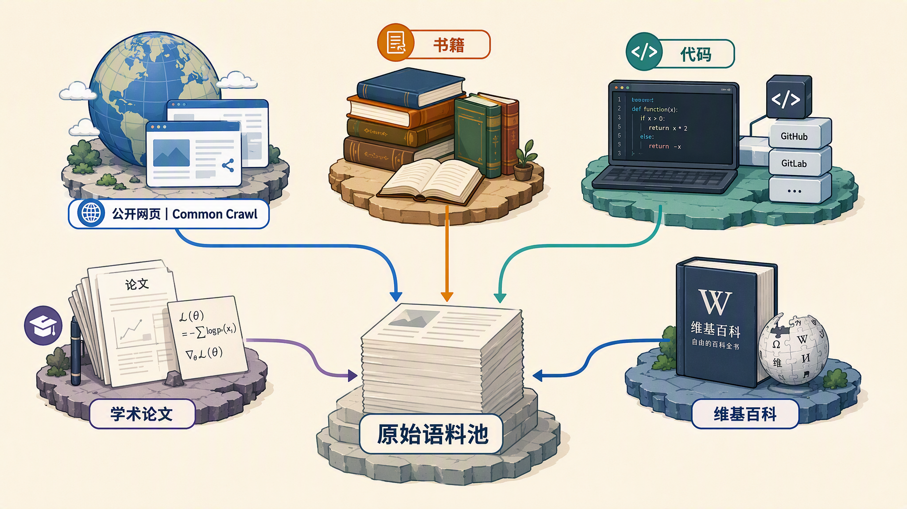
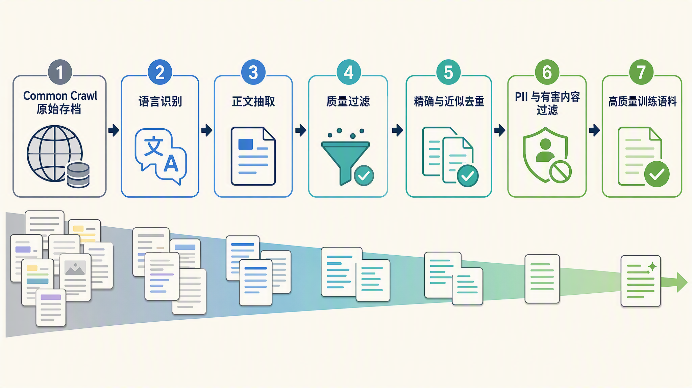
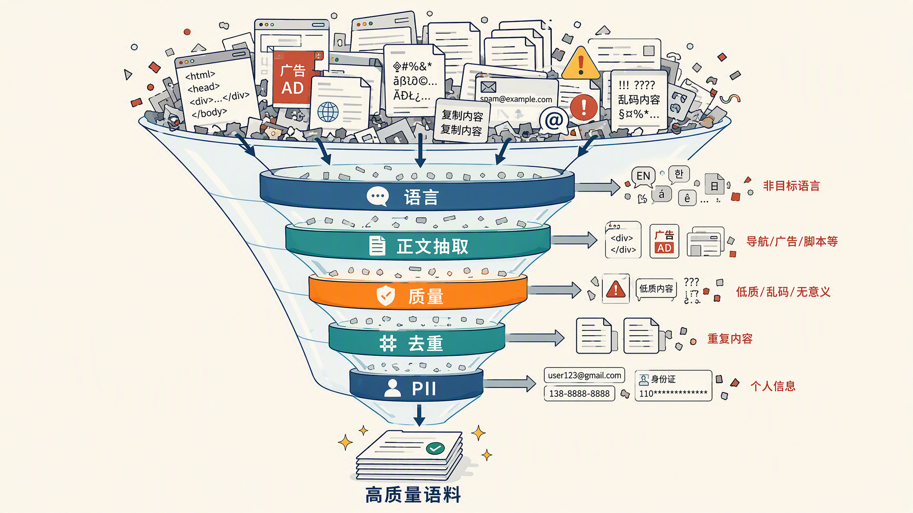
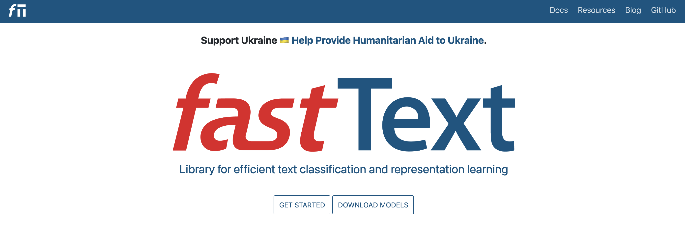
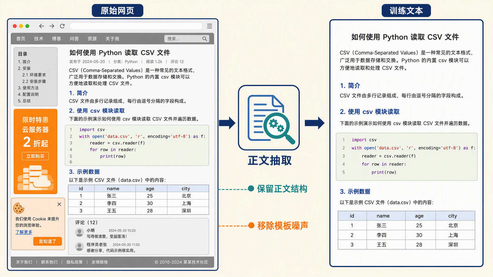
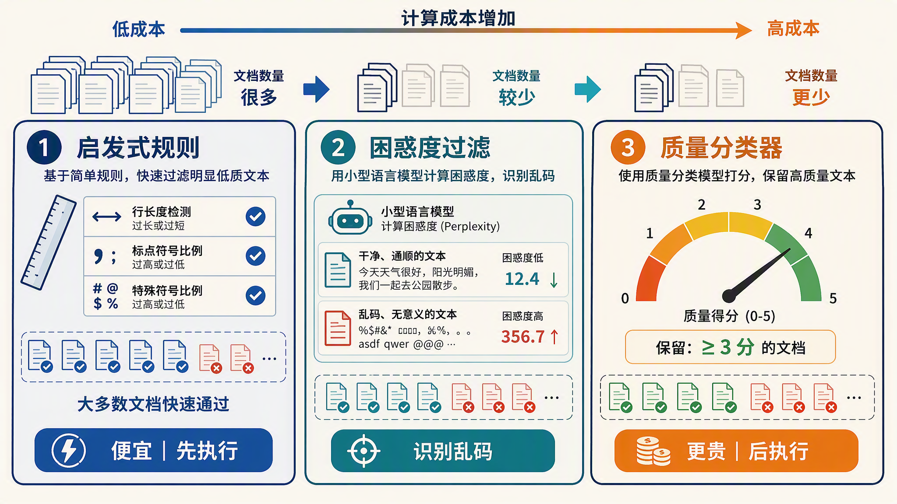
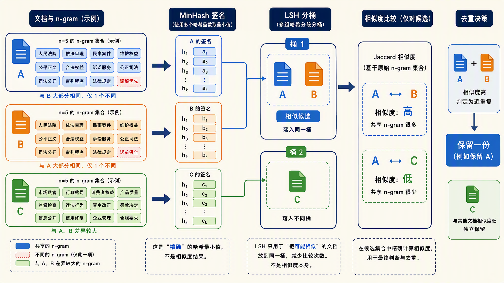
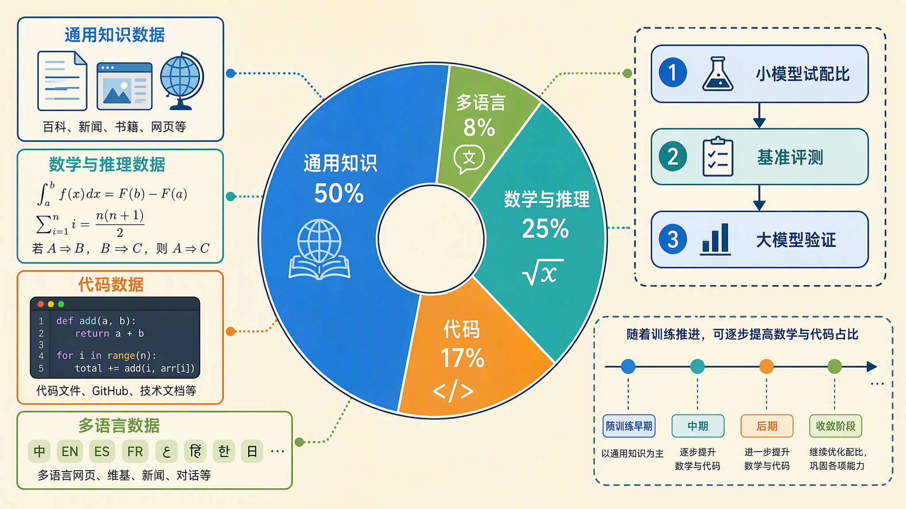
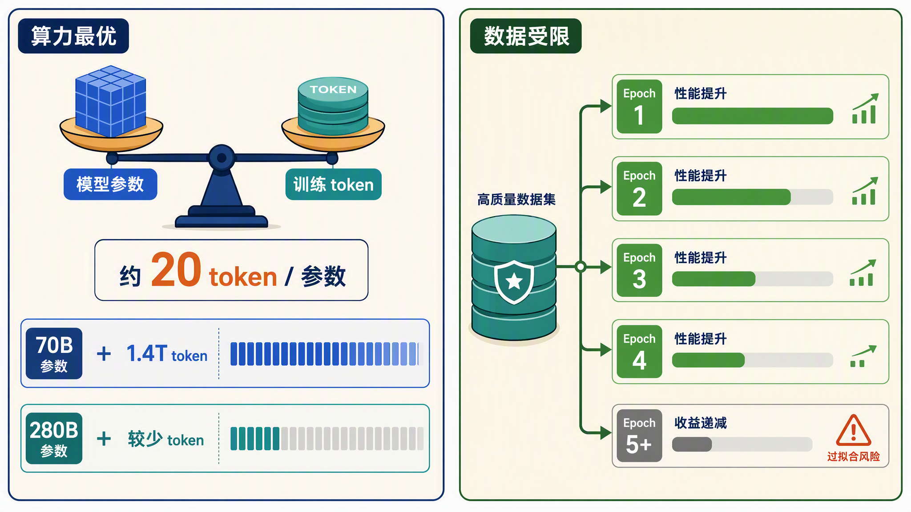

# 学习大模型训练的数据：从互联网到高质量语料

在上一篇中，我们把一个模型的诞生过程画成了一张地图：先收集海量原始数据，经过清洗和配比得到训练语料，再用分词器切成 token，接着预训练出基座模型，然后经过监督微调学会听指令，最后通过偏好对齐让回答合乎人类偏好，得到一个会对话的模型。今天我们就来看看整条链路的第一环，数据。

这一环看起来很不起眼，无非是从网上抓一堆文本下来。但行业里有一个共识：**Quality In, Quality Out**，喂进去的数据质量决定了模型能力的上限。架构可以抄，算力可以买，唯独高质量语料是各家大模型公司最不愿意公开的秘密。

## 数据从哪里来

大模型的胃口很大，动不动就是几万亿甚至十几万亿 token。能满足这个量级的数据源其实屈指可数，主流的有这么几类：

* **公开网页**：最大头的来源，顶梁柱是 [Common Crawl](https://commoncrawl.org/)，一个非营利组织维护的公开网页存档，从 2007 年开始持续抓取全网网页，累计存档超过 3000 亿个页面。几乎每一个知名语料库都以它为起点
* **书籍**：覆盖面广、行文完整的长文本，对模型的长程连贯性帮助很大。不过版权敏感，公开的子集越来越少
* **代码**：主要是 GitHub 上的公开仓库。大量实验证明，代码数据不仅教模型写程序，对逻辑推理能力也有正向迁移
* **学术论文**：以 arXiv 为代表，提供严谨的数学推导和专业表述
* **维基百科**：体量不大但质量很高，几乎是所有语料库的标配

各类数据源的大致面貌如下图所示：



不同来源对模型能力的影响不一样。网页提供广度和常识，代码和论文撑起推理能力，书籍和维基提供知识密度和长文结构。

> 这两年数据源的格局还有一个变化：高质量来源正在收紧。书籍子集因为版权问题陆续从公开语料里下架，Reddit、Stack Overflow 这类社区开始对外收费授权。现在拿到一份能商用的全量语料，比几年前难了不少，这也是 FineWeb 这类纯 Common Crawl 语料更受重视的原因之一。

## 清洗流水线

原始网页数据非常脏。一篇 Common Crawl 抓回来的页面里，真正有用的正文可能只占一小半，剩下的是 HTML 标签、导航栏、广告、版权页、乱码，以及各种重复和低质内容。从原始存档到训练语料，要经过一条多级过滤的流水线，每一级都会扔掉一大批数据。整体流程如下：



以 Hugging Face 发布的 [FineWeb](https://arxiv.org/abs/2406.17557) 论文为参照，原始 Common Crawl 经过这条流水线后，留下的文本大约只有原始量的百分之几。整条流水线的思路就像一个漏斗，越往下数据越少、质量越高：



我们逐级来看。

### 语言识别与过滤

第一步是确定每篇文档是什么语言。主流做法是用 [fastText](https://fasttext.cc/)，Facebook（现在的 Meta）在 2016 年开源的轻量文本分类库。它官方提供的语言识别模型 lid.176 能识别 176 种语言，量化压缩版只有 916 KB，跑一篇文档只要微秒级，准确率却相当高，因此成了几乎所有语料流水线的标配。每条流水线会给文档打一个语言分数，比如 FineWeb 只保留英语得分不低于 0.65 的文档，目标语言不在名单里的文档在这一步直接丢掉。



这个模型一行命令就能下载，我们亲手试一下：

```bash
# fasttext-wheel 和 numpy 2.x 有已知的兼容问题，这里把 numpy 限制在 1.x
$ pip install fasttext-wheel "numpy<2"
$ wget https://dl.fbaipublicfiles.com/fasttext/supervised-models/lid.176.ftz
```

```python
import fasttext

# lid.176 是 fastText 官方的语言识别模型，ftz 后缀是量化压缩版
model = fasttext.load_model("lid.176.ftz")

texts = [
    "大模型训练的数据从哪来",
    "The quick brown fox jumps over the lazy dog",
    "Bonjour le monde",
    "Common Crawl is a nonprofit that crawls the web",
]
for text in texts:
    labels, scores = model.predict(text)
    print(f"{text!r} -> {labels[0]} 分数 {scores[0]:.3f}")
```

运行结果：

```text
'大模型训练的数据从哪来' -> __label__zh 分数 0.984
'The quick brown fox jumps over the lazy dog' -> __label__en 分数 0.721
'Bonjour le monde' -> __label__fr 分数 0.950
'Common Crawl is a nonprofit that crawls the web' -> __label__en 分数 0.895
```

输出里 `__label__` 后面是语言的 ISO 代码，分数是置信度。对照 FineWeb 的 0.65 门槛看，第二条英文句子得分 0.721，刚好过线会被留下；如果页面是中英混杂的，英语得分可能掉到门槛以下，整篇就被丢掉了，混语言页面就是这样被清出去的。

> 顺带一提，fastText 的 [GitHub 仓库](https://github.com/facebookresearch/fastText)在 2024 年被 Meta 归档，不再积极维护，但库和模型都照常可用。

### 文本抽取

网页存档里存的是 HTML，要先把正文抠出来。这一步叫 **文本抽取（Text Extraction）**，难点在于去掉导航栏、侧边栏、页脚这些模板化的样板文本，同时保留正文里的列表、表格和代码段结构。FineWeb 用的是 [Trafilatura](https://trafilatura.readthedocs.io/) 这个开源库，论文里还专门对比过，自己重新抽取比直接用 Common Crawl 官方抽好的 WET 文件（Common Crawl 自带的纯文本抽取结果）效果更好。

下面用一段简单的代码感受一下。首先安装 Trafilatura 库：

```bash
$ pip install "trafilatura>=2.2"
```

拿一段带导航栏、侧边栏和页脚的网页 HTML 试试：

```python
import trafilatura

html = """
<html><body>
<nav>首页 | 产品 | 文档 | 关于我们</nav>
<div class="sidebar">热门文章：如何选购 GPU | 2026 年显卡天梯</div>
<article>
  <h1>大模型训练的数据从哪来</h1>
  <p>训练大模型的第一步是收集语料，公开网页是最大的来源。</p>
  <p>原始网页里混着导航栏、广告和页脚，需要先抽取正文。</p>
</article>
<footer>© 2026 某公司 版权所有 | 隐私政策 | 联系我们</footer>
</body></html>
"""

print(trafilatura.extract(html))
```

默认参数下的输出如下：

```text
首页 | 产品 | 文档 | 关于我们
热门文章：如何选购 GPU | 2026 年显卡天梯
大模型训练的数据从哪来
训练大模型的第一步是收集语料，公开网页是最大的来源。
原始网页里混着导航栏、广告和页脚，需要先抽取正文。
```

可以看到页脚被去掉了，但导航栏和侧边栏还是被当成正文抽了进来。这正是抽取器的日常：模板识别靠的是启发式规则，默认参数在多抽和漏抽之间取了一个平衡。可以加上 `favor_precision=True` 参数让抽取更保守，这样结果就只剩正文了：

```text
大模型训练的数据从哪来
训练大模型的第一步是收集语料，公开网页是最大的来源。
原始网页里混着导航栏、广告和页脚，需要先抽取正文。
```

抽取质量很容易被低估：同一个页面，不同的抽取器抠出来的正文可能差很多。有的把评论区也当成正文抽了进来，有的正文抽对了、代码块的缩进却全丢了，还有的把表格拍平成一行，丢掉了结构化的信息。而且抽多和抽漏的显眼程度不一样：抽多了（像刚才那样把导航栏也当成正文）一眼就能看到，调参数收一收就行；抽漏了（正文少了一段）却没有任何报错，悄悄丢掉的正文没人知道。这些细节最后都会传导到模型身上，所以流水线的抽取环节都要做后验的质量抽查，而不是抽完就结束。



### 质量过滤

正文抽出来之后，还别急着高兴，互联网上大量页面的正文质量堪忧，有的通篇是标签和链接的堆砌，读不出一句完整的话，有的满屏都是标点，有的纯粹是 SEO 堆出来的关键词墙。质量过滤的任务就是把它们挡在语料库外。按成本从便宜到贵，过滤手段可分为三层：

1. **启发式规则**：一批人工定的硬指标，比如文档平均行长不能太短、以标点结尾的行占比不能太低、短行占比、符号与字母的比例、停用词出现频率等。[C4](https://arxiv.org/abs/1910.10683)（Google 为 T5 模型清洗的语料）和 [Gopher](https://arxiv.org/abs/2112.11446)（DeepMind 2021 年发布的 280B 大模型）的过滤器是这类规则的模板，FineWeb 在其基础上又通过消融实验筛出了三条自己的规则
2. **困惑度过滤**：用一个小的参考模型给每篇文档算困惑度，也就是文档对参考模型来说有多意外。Facebook 的 [CCNet](https://arxiv.org/abs/1911.00359) 流水线是这个做法的代表：它用 KenLM（一个传统的 n-gram 语言模型工具包）在维基百科上训练一个 5-gram 模型当参照，相当于拿「像不像维基的文风」当质量标尺，乱码和机器拼接的文本在这个参照系下困惑度极高，直接过滤
3. **分类器打分**：用一个专门训练的质量分类器给文档打 0 到 5 分。FineWeb 的教育子集 FineWeb-Edu 就是用 Llama-3-70B-Instruct 标注了 46 万条样本，训出一个教育价值分类器，只留 3 分及以上的文档。DCLM 是一个专门评测数据清洗方法的公开基准项目，做法是固定训练配置、只换数据，公平对比各种清洗手段，它的实验发现，分类器打分是整个流水线里收益最大的单点改进

规则过滤便宜，可以在全量数据上直接跑；分类器打分贵，通常放在流水线靠后的位置，等数据量已经被前几级砍下来再上。这也是整个流水线的设计原则，越贵的过滤器越往后放。



### 去重

**去重（Deduplication）** 是流水线的重头戏。互联网上的重复内容远超想象：同一篇文章被几十个网站转载、电商页面共用同一套模板、新闻稿全网分发。不去重的后果有两个，一是同样的样本被训练很多遍，算力白白浪费；二是模型对重复内容会倾向于**记住**而不是**学会**，有论文专门验证过，去掉近似重复的模型在下游任务上表现更好，逐字背出训练文本的概率也明显下降。

去重分两个层面：

* **精确去重**：对文档算哈希值，完全一样的只留一份。实现简单，但文档改一个标点就识别不出来了
* **近似去重**：要找出的是大段雷同的文档。主流算法是 **[MinHash](https://doi.org/10.1109/SEQUEN.1997.666900)**，由 Broder 1997 年提出，把每篇文档切成 n-gram（连续 n 个词组成的片段）集合，用少量哈希签名近似估计两个集合的 Jaccard 相似度（两个集合的交集大小占比），再配合 **LSH（Locality-Sensitive Hashing，局部敏感哈希）** 避免两两比较的 O(n²) 开销。**[SimHash](https://doi.org/10.1145/509907.509965)** 是另一种思路，出自 Charikar 2002 年的论文，后来 Google 用它做网页去重，用 64 位指纹的海明距离判断相似度

> 「局部敏感哈希」和「普通哈希」的区别是：MD5 这类哈希追求输入差一个字节、输出就面目全非，用来把数据均匀打散；LSH 则故意让输入越相似，哈希落进同一个桶的概率越高。几百亿篇文档不用两两比较，只需要和同一个桶里的比，这就是它快的原因。

我们这里拿 [datasketch](https://github.com/ekzhu/datasketch) 亲手体验下近似去重。它是一个专门实现概率型数据结构的 Python 库，MinHash、LSH 这些刚讲到的算法都有现成的实现，几行代码就能跑通：

```python
from datasketch import MinHash, MinHashLSH

docs = [
    "the quick brown fox jumps over the lazy dog",
    "the quick brown fox jumps over the lazy cat",   # 与第 1 条只差一个词
    "a completely different sentence about cooking",
    "the quick brown fox jumps over the lazy dog",   # 与第 1 条完全相同
]

def to_minhash(text):
    m = MinHash(num_perm=128)
    for word in text.split():
        m.update(word.encode("utf8"))
    return m

lsh = MinHashLSH(threshold=0.5, num_perm=128)
for i, doc in enumerate(docs):
    lsh.insert(f"doc{i}", to_minhash(doc))

# 查询与 doc0 相似的文档
result = lsh.query(to_minhash(docs[0]))
print("与 doc0 相似的文档:", result)
```

运行结果如下：

```text
与 doc0 相似的文档: ['doc0', 'doc3', 'doc1']
```

可以看到，只差一个词的 doc1 和完全重复的 doc3 都被捞了出来，而主题不同的 doc2 被排除（返回的顺序是哈希桶的顺序，不代表相似度高低）。真实语料库里跑的是同一套逻辑，只是规模从 4 条变成了几百亿条，`threshold` 就是判定两篇文档算重复的相似度门槛，定高了漏检，定低了误删，需要按语料特点调。

FineWeb 用 MinHash 对每个 Common Crawl 快照分别做去重。论文里有个有意思的发现：跨快照的全局去重收益不大，反而会把早期快照里的高质量内容误删，所以最后选择了按快照独立去重。



> 去重和前面的质量过滤也有交集。很多低质页面本身就是批量复制的模板，去重一步顺手就把它们清掉了。在 FineWeb 的消融实验里，我们也能看到，每一级过滤都能在下游基准上看到可衡量的提升，没有一步是白做的。

### 隐私与有害信息过滤

最后一步是关于合规的。网页文本里混着大量 **PII（Personally Identifiable Information，个人可识别信息）**：邮箱、电话、IP 地址、身份证号。直接拿去训练，模型可能在生成时把这些隐私信息吐出来。常见做法是用正则表达式把邮箱和 IP 地址打码替换成占位符，FineWeb 就是这么处理的。此外还要过一遍黑名单 URL 和有害内容过滤器，把成人内容、仇恨言论等挡在语料库之外。

## 代表性开源语料

自己从头搭一条清洗流水线成本很高，好在社区已经放出了几份现成的成果，直接下载就能用：

* **[FineWeb](https://huggingface.co/datasets/HuggingFaceFW/fineweb)**：Hugging Face 2024 年发布，从 96 个 Common Crawl 快照中清洗出 15 万亿 token 的英文语料，是目前规模最大的公开网页语料之一。它的教育子集 FineWeb-Edu（1.3 万亿 token）用分类器筛出了高教育价值内容，多个基准上超过了 C4 和 The Pile
* **[DCLM](https://github.com/mlfoundations/dclm)**：全称 DataComp-LM，mlfoundations 团队的研究项目，思路是把数据处理流程和评测协议全部公开，让社区公平地比拼谁的清洗方法好。用它的基准语料训一个 7B 模型，2.6 万亿 token 就能在 MMLU（多学科知识问答基准）上拿到 64%，和用了更多算力的 Mistral-7B 持平
* **[The Pile](https://arxiv.org/abs/2101.00027)**：EleutherAI 2021 年发布的老牌语料库，800 GB 文本，由 22 个高质量子集混合而成，包括书籍、arXiv、GitHub、维基等。GPT-Neo、GPT-J 这批早期开源模型都是用它的
* **[RedPajama](https://github.com/togethercomputer/RedPajama-Data)**：Together AI 对 LLaMA 第一代训练数据的复刻，按 LLaMA 论文里披露的来源构成重新收集清洗，约 1.2 万亿 token

四份语料的对比整理如下：

| 语料 | 发布方 | 规模 | 特点 |
| ---- | ---- | ---- | ---- |
| FineWeb | Hugging Face | 15 万亿 token | 纯网页，清洗流程完全公开，有教育子集 |
| DCLM | mlfoundations | 原始池 240 万亿 token | 带标准化评测基准，方便对比清洗方法 |
| The Pile | EleutherAI | 800 GB | 22 个子集混合，书籍和学术占比高 |
| RedPajama | Together AI | 1.2 万亿 token | 复刻 LLaMA 数据配方 |

> 上面几份语料都以英文为主。如果要训中文或多语言模型，可以看看 FineWeb 的多语言版本 FineWeb-2，覆盖一千多种语言，每种语言的过滤规则单独调过。中文场景下也有一些社区维护的语料，思路和英文一脉相承。

## 数据配比

语料备齐了，但里面什么都有：网页、代码、数学、多语言。难道全部一股脑喂给模型吗？各类数据按什么比例混着喂，就是 **数据配比（Data Mixture）** 要回答的问题。比例不是拍脑袋定的，它直接塑造模型的能力分布：代码多了模型会编程但可能说话变生硬，多语言多了通用能力又被摊薄。

主流的做法是**小规模实验外推**。先用小模型在小数据上，按不同配比各训一版，看哪个配比在基准测试上表现好，再用 Scaling Law 外推到目标规模，最后在大模型上验证。Llama 3 的论文里明确写了这套流程，他们先训练一个知识分类器把网页数据按主题归类，对占比过高的类目降采样，再用小模型扫描候选配比。最终 Llama 3 的配比是：约 50% 通用知识、25% 数学与推理、17% 代码、8% 多语言。

DeepSeek-V3 的技术报告没有披露具体数字，但也交代了方向：预训练语料共 14.8 万亿 token，相比 V2 提高了数学和编程样本的比例，同时扩充了中英文之外的多语言覆盖。另一个值得注意的细节是，配比在训练过程中不是一成不变的，Llama 3 在训练后期上调了高质量代码和数学数据的占比，配合降低学习率，对小模型的数学基准提升明显。



## 量与质的权衡

最后聊一个观念上的转变。2022 年 DeepMind 的 [Chinchilla 论文](https://arxiv.org/abs/2203.15556)训练了 400 多个模型，参数从 7000 万到 160 多亿不等，得出的结论是：在固定算力预算下，模型参数和训练 token 应该等比例增长，最经济的比例大约是**每个参数配 20 个 token**。按这个标准，当时的主流大模型全都严重训练不足，参数堆得太大、数据喂得太少。Chinchilla 自己用 70B 参数配 1.4 万亿 token，在同算力下全面超过了 280B 参数的 Gopher。

这篇论文之后，行业的重心从堆参数转向了堆数据。但新的问题马上出现了：高质量数据就那么多，很快会喂完。解决办法有两个，一是把清洗做得更好，从同一批原始数据里榨出更多高质量文本，FineWeb 和 DCLM 走的就是这条路；二是让好数据多喂几遍。Muennighoff 等人在 [Scaling Data-Constrained Language Models](https://arxiv.org/abs/2305.16264) 论文中专门研究了这个问题，结论是**同一份数据重复训练最多 4 个 epoch 左右，收益几乎等价于全新数据**，再往后收益急剧衰减，记忆化倾向上升。这里的 epoch 指的是把整份语料完整过一遍。

读到这里可能有人要问：去重一节刚说过重复有害，这里怎么又说多喂几遍划算？不矛盾，两者说的重复不是一回事。去重清掉的是抓取时混进来的意外重复，同一篇文章被几十个网站转载的那种，属于纯噪声；这里说的是把清洗干净的整份语料整体多训几个 epoch。先去掉意外重复是前提，这个前提下的有意重复才有收益。所以高质量数据反复训几遍是划算买卖，滥竽充数的重复才是浪费。



把这两件事合起来，现在的行业实践很清晰：宁可花大价钱把数据洗干净、配好，也不盲目追求 token 数量。数据工程在大模型训练里的地位，已经和模型架构平起平坐。

## 小结

今天我们把训练链路的第一环讲完了，要点如下：

1. **数据源**：以 Common Crawl 的公开网页为绝对主力，辅以书籍、代码、论文和维基，不同来源塑造模型不同维度的能力
2. **清洗流水线**：语言识别 → 文本抽取 → 质量过滤（启发式规则、困惑度、分类器打分）→ 精确与近似去重 → PII 与有害内容过滤，每一级都在大量丢弃原始数据
3. **去重的意义**：重复数据让模型记住而不是学会，MinHash 加 LSH 是近似去重的主流方案
4. **开源语料**：FineWeb（15 万亿 token）、DCLM（带评测基准）、The Pile（多子集混合）、RedPajama（复刻 LLaMA）各有侧重，不想自己搭流水线可以直接用
5. **数据配比**：用小规模实验外推确定，Llama 3 的配比是 50% 通用、25% 数学推理、17% 代码、8% 多语言，训练后期还会动态调整
6. **量与质的权衡**：Chinchilla 确立了数据比参数更值钱的共识，高质量数据重复训练约 4 个 epoch 收益近似全新数据

语料准备好了，但它还是一堆人类读的文本，要靠分词器将其转换为 token 模型才认识。怎么用一个训练好的分词器，推理系列第二篇已经学过；下一篇我们换个角度，看看它是怎么被训练出来的。

## 参考

* [Common Crawl 官网](https://commoncrawl.org/)
* [FineWeb 论文：The FineWeb Datasets](https://arxiv.org/abs/2406.17557)
* [FineWeb 数据集页面](https://huggingface.co/datasets/HuggingFaceFW/fineweb)
* [Trafilatura 官方文档](https://trafilatura.readthedocs.io/)
* [CCNet 论文：从网页存档提取高质量语料](https://arxiv.org/abs/1911.00359)
* [fastText 官网](https://fasttext.cc/)
* [fastText GitHub 仓库](https://github.com/facebookresearch/fastText)
* [DCLM GitHub 仓库](https://github.com/mlfoundations/dclm)
* [DCLM 论文：DataComp-LM](https://arxiv.org/abs/2406.11794)
* [The Pile 论文](https://arxiv.org/abs/2101.00027)
* [T5 论文（C4 语料的出处）](https://arxiv.org/abs/1910.10683)
* [Gopher 论文：Scaling Language Models](https://arxiv.org/abs/2112.11446)
* [RedPajama GitHub 仓库](https://github.com/togethercomputer/RedPajama-Data)
* [datasketch GitHub 仓库](https://github.com/ekzhu/datasketch)
* [去重论文：Deduplicating Training Data Makes Language Models Better](https://arxiv.org/abs/2107.06499)
* [MinHash 论文：On the Resemblance and Containment of Documents](https://doi.org/10.1109/SEQUEN.1997.666900)
* [SimHash 论文：Similarity Estimation Techniques from Rounding Algorithms](https://doi.org/10.1145/509907.509965)
* [DeepSeek-V3 技术报告](https://arxiv.org/abs/2412.19437)
* [Llama 3 论文：The Llama 3 Herd of Models](https://ar5iv.labs.arxiv.org/html/2407.21783)
* [Chinchilla 论文：Training Compute-Optimal Large Language Models](https://arxiv.org/abs/2203.15556)
* [重复数据论文：Scaling Data-Constrained Language Models](https://arxiv.org/abs/2305.16264)
