# WEEK008 - 实战 Prometheus 搭建监控系统

> 本笔记写于 2018年11月

[Prometheus](https://prometheus.io/) 是一款基于时序数据库的开源监控告警系统，说起 Prometheus 则不得不提 [SoundCloud](http://soundcloud.com/)，这是一个在线音乐分享的平台，类似于做视频分享的 YouTube，由于他们在微服务架构的道路上越走越远，出现了成百上千的服务，使用传统的监控系统 StatsD 和 Graphite 存在大量的局限性，于是他们在 2012 年开始着手开发一套全新的监控系统。Prometheus 的原作者是 [Matt T. Proud](https://github.com/matttproud)，他也是在 2012 年加入 SoundCloud 的，实际上，在加入 SoundCloud 之前，Matt 一直就职于 Google，他从 Google 的集群管理器 Borg 和它的监控系统 Borgmon 中获取灵感，开发了开源的监控系统 Prometheus，和 Google 的很多项目一样，使用的编程语言是 Go。

很显然，Prometheus 作为一个微服务架构监控系统的解决方案，它和容器也脱不开关系。早在 2006 年 8 月 9 日，Eric Schmidt 在搜索引擎大会上首次提出了云计算（Cloud Computing）的概念，在之后的十几年里，云计算的发展势如破竹。在 2013 年，Pivotal 的 Matt Stine 又提出了云原生（Cloud Native）的概念，云原生由微服务架构、DevOps 和以容器为代表的敏捷基础架构组成，帮助企业快速、持续、可靠、规模化地交付软件。为了统一云计算接口和相关标准，2015 年 7 月，隶属于 Linux 基金会的 [云原生计算基金会（CNCF，Cloud Native Computing Foundation）](https://www.cncf.io/) 应运而生。第一个加入 CNCF 的项目是 Google 的 Kubernetes，而 Prometheus 是第二个加入的（2016 年）。

目前 Prometheus 已经广泛用于 Kubernetes 集群的监控系统中，对 Prometheus 的历史感兴趣的同学可以看看 SoundCloud 的工程师 [Tobias Schmidt](https://github.com/grobie) 在 2016 年的 PromCon 大会上的演讲：[The History of Prometheus at SoundCloud](https://promcon.io/2016-berlin/talks/the-history-of-prometheus-at-soundcloud/)。

## 一、Prometheus 概述

我们在 SoundCloud 的官方博客中可以找到一篇关于他们为什么需要新开发一个监控系统的文章 [Prometheus: Monitoring at SoundCloud](https://developers.soundcloud.com/blog/prometheus-monitoring-at-soundcloud)，在这篇文章中，他们介绍到，他们需要的监控系统必须满足下面四个特性：

> * **A multi-dimensional data model**, so that data can be sliced and diced at will, along dimensions like instance, service, endpoint, and method.
> * **Operational simplicity**, so that you can spin up a monitoring server where and when you want, even on your local workstation, without setting up a distributed storage backend or reconfiguring the world.
> * **Scalable data collection and decentralized architecture**, so that you can reliably monitor the many instances of your services, and independent teams can set up independent monitoring servers.
> * Finally, **a powerful query language** that leverages the data model for meaningful alerting (including easy silencing) and graphing (for dashboards and for ad-hoc exploration).

简单来说，就是下面四个特性：

* 多维度数据模型
* 方便的部署和维护
* 灵活的数据采集
* 强大的查询语言

实际上，多维度数据模型和强大的查询语言这两个特性，正是时序数据库所要求的，所以 Prometheus 不仅仅是一个监控系统，同时也是一个时序数据库。那为什么 Prometheus 不直接使用现有的时序数据库作为后端存储呢？这是因为 SoundCloud 不仅希望他们的监控系统有着时序数据库的特点，而且还需要部署和维护非常方便。纵观比较流行的时序数据库（参见下面的附录），他们要么组件太多，要么外部依赖繁重，比如：Druid 有 Historical、MiddleManager、Broker、Coordinator、Overlord、Router 一堆的组件，而且还依赖于 ZooKeeper、Deep storage（HDFS 或 S3 等），Metadata store（PostgreSQL 或 MySQL），部署和维护起来成本非常高。而 Prometheus 采用去中心化架构，可以独立部署，不依赖于外部的分布式存储，你可以在几分钟的时间里就可以搭建出一套监控系统。

此外，Prometheus 数据采集方式也非常灵活。要采集目标的监控数据，首先需要在目标处安装数据采集组件，这被称之为 **Exporter**，它会在目标处收集监控数据，并暴露出一个 HTTP 接口供 Prometheus 查询，Prometheus 通过 Pull 的方式来采集数据，这和传统的 Push 模式不同。不过 Prometheus 也提供了一种方式来支持 Push 模式，你可以将你的数据推送到 **Push Gateway**，Prometheus 通过 Pull 的方式从 Push Gateway 获取数据。目前的 Exporter 已经可以采集绝大多数的第三方数据，比如 Docker、HAProxy、StatsD、JMX 等等，官网有一份 [Exporter 的列表](https://prometheus.io/docs/instrumenting/exporters/)。

除了这四大特性，随着 Prometheus 的不断发展，开始支持越来越多的高级特性，比如：[服务发现](https://prometheus.io/docs/operating/integrations/#file-service-discovery)，[更丰富的图表展示](https://prometheus.io/docs/visualization/grafana/)，[使用外部存储](https://prometheus.io/docs/prometheus/latest/storage/#remote-storage-integrations)，[强大的告警规则和多样的通知方式](https://prometheus.io/docs/alerting/overview/)。下图是 Prometheus 的整体架构图：


从上图可以看出，Prometheus 生态系统包含了几个关键的组件：Prometheus server、Pushgateway、Alertmanager、Web UI 等，但是大多数组件都不是必需的，其中最核心的组件当然是 **Prometheus server**，它负责收集和存储指标数据，支持表达式查询，和告警的生成。接下来我们就来安装 Prometheus server。

## 二、安装 Prometheus server

Prometheus 可以支持多种安装方式，包括 Docker、Ansible、Chef、Puppet、Saltstack 等。下面介绍最简单的两种方式，一种是直接使用编译好的可执行文件，开箱即用，另一种是使用 Docker 镜像，更多的安装方式可以参考 [这里](https://love2.io/@1046102779/doc/prometheus/introductions/install.md)。

### 2.1 开箱即用

首先从 [官网的下载页面](https://prometheus.io/download/) 获取 Prometheus 的最新版本和下载地址，目前最新版本是 2.4.3（2018年10月），执行下面的命令下载并解压：

```
$ wget https://github.com/prometheus/prometheus/releases/download/v2.4.3/prometheus-2.4.3.linux-amd64.tar.gz
$ tar xvfz prometheus-2.4.3.linux-amd64.tar.gz
```

然后切换到解压目录，检查 Prometheus 版本：

```
$ cd prometheus-2.4.3.linux-amd64
$ ./prometheus --version
prometheus, version 2.4.3 (branch: HEAD, revision: 167a4b4e73a8eca8df648d2d2043e21bdb9a7449)
  build user:       root@1e42b46043e9
  build date:       20181004-08:42:02
  go version:       go1.11.1
```

运行 Prometheus server：

```
$ ./prometheus --config.file=prometheus.yml
```

### 2.2 使用 Docker 镜像

使用 Docker 安装 Prometheus 更简单，运行下面的命令即可：

```
$ sudo docker run -d -p 9090:9090 prom/prometheus
```

一般情况下，我们还会指定配置文件的位置：

```
$ sudo docker run -d -p 9090:9090 \
    -v ~/docker/prometheus/:/etc/prometheus/ \
    prom/prometheus
```

我们把配置文件放在本地 `~/docker/prometheus/prometheus.yml`，这样可以方便编辑和查看，通过 `-v` 参数将本地的配置文件挂载到 `/etc/prometheus/` 位置，这是 prometheus 在容器中默认加载的配置文件位置。如果我们不确定默认的配置文件在哪，可以先执行上面的不带 `-v` 参数的命令，然后通过 `docker inspect` 命名看看容器在运行时默认的参数有哪些（下面的 Args 参数）：

```
$ sudo docker inspect 0c
[...]
        "Id": "0c4c2d0eed938395bcecf1e8bb4b6b87091fc4e6385ce5b404b6bb7419010f46",
        "Created": "2018-10-15T22:27:34.56050369Z",
        "Path": "/bin/prometheus",
        "Args": [
            "--config.file=/etc/prometheus/prometheus.yml",
            "--storage.tsdb.path=/prometheus",
            "--web.console.libraries=/usr/share/prometheus/console_libraries",
            "--web.console.templates=/usr/share/prometheus/consoles"
        ],

[...]
```

### 2.3 配置 Prometheus

正如上面两节看到的，Prometheus 有一个配置文件，通过参数 `--config.file` 来指定，配置文件格式为 [YAML](http://yaml.org/start.html)。我们可以打开默认的配置文件 `prometheus.yml` 看下里面的内容：

```
/etc/prometheus $ cat prometheus.yml 
# my global config
global:
  scrape_interval:     15s # Set the scrape interval to every 15 seconds. Default is every 1 minute.
  evaluation_interval: 15s # Evaluate rules every 15 seconds. The default is every 1 minute.
  # scrape_timeout is set to the global default (10s).

# Alertmanager configuration
alerting:
  alertmanagers:
  - static_configs:
    - targets:
      # - alertmanager:9093

# Load rules once and periodically evaluate them according to the global 'evaluation_interval'.
rule_files:
  # - "first_rules.yml"
  # - "second_rules.yml"

# A scrape configuration containing exactly one endpoint to scrape:
# Here it's Prometheus itself.
scrape_configs:
  # The job name is added as a label `job=<job_name>` to any timeseries scraped from this config.
  - job_name: 'prometheus'

    # metrics_path defaults to '/metrics'
    # scheme defaults to 'http'.

    static_configs:
    - targets: ['localhost:9090']

```

Prometheus 默认的配置文件分为四大块：

* global 块：Prometheus 的全局配置，比如 `scrape_interval` 表示 Prometheus 多久抓取一次数据，`evaluation_interval` 表示多久检测一次告警规则；
* alerting 块：关于 Alertmanager 的配置，这个我们后面再看；
* rule_files 块：告警规则，这个我们后面再看；
* scrape_config 块：这里定义了 Prometheus 要抓取的目标，我们可以看到默认已经配置了一个名称为 `prometheus` 的 job，这是因为 Prometheus 在启动的时候也会通过 HTTP 接口暴露自身的指标数据，这就相当于 Prometheus 自己监控自己，虽然这在真正使用 Prometheus 时没啥用处，但是我们可以通过这个例子来学习如何使用 Prometheus；可以访问 `http://localhost:9090/metrics` 查看 Prometheus 暴露了哪些指标；

更多的配置参数可以参考 [这里](https://prometheus.io/docs/prometheus/latest/configuration/configuration/)。

## 三、学习 PromQL

通过上面的步骤安装好 Prometheus 之后，我们现在可以开始体验 Prometheus 了。Prometheus 提供了可视化的 Web UI 方便我们操作，直接访问 `http://localhost:9090/` 即可，它默认会跳转到 Graph 页面：

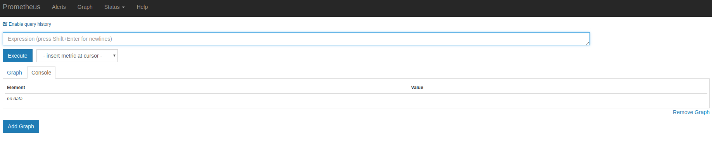

第一次访问这个页面可能会不知所措，我们可以先看看其他菜单下的内容，比如：Alerts 展示了定义的所有告警规则，Status 可以查看各种 Prometheus 的状态信息，有 Runtime & Build Information、Command-Line Flags、Configuration、Rules、Targets、Service Discovery 等等。

实际上 Graph 页面才是 Prometheus 最强大的功能，在这里我们可以使用 Prometheus 提供的一种特殊表达式来查询监控数据，这个表达式被称为 **PromQL（Prometheus Query Language）**。通过 PromQL 不仅可以在 Graph 页面查询数据，而且还可以通过 Prometheus 提供的 HTTP API 来查询。查询的监控数据有列表和曲线图两种展现形式（对应上图中 Console 和 Graph 这两个标签）。

我们上面说过，Prometheus 自身也暴露了很多的监控指标，也可以在 Graph 页面查询，展开 Execute 按钮旁边的下拉框，可以看到很多指标名称，我们随便选一个，譬如：`promhttp_metric_handler_requests_total`，这个指标表示 `/metrics` 页面的访问次数，Prometheus 就是通过这个页面来抓取自身的监控数据的。在 Console 标签中查询结果如下：

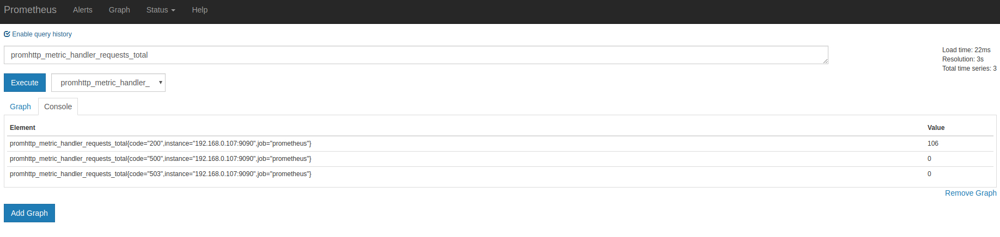

上面在介绍 Prometheus 的配置文件时，可以看到 `scrape_interval` 参数是 15s，也就是说 Prometheus 每 15s 访问一次 `/metrics` 页面，所以我们过 15s 刷新下页面，可以看到指标值会自增。在 Graph 标签中可以看得更明显：

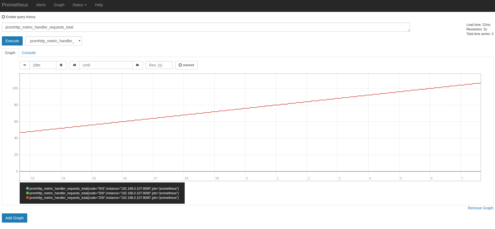

### 3.1 数据模型

要学习 PromQL，首先我们需要了解下 Prometheus 的数据模型，一条 Prometheus 数据由一个指标名称（metric）和 N 个标签（label，N >= 0）组成的，比如下面这个例子：

```
promhttp_metric_handler_requests_total{code="200",instance="192.168.0.107:9090",job="prometheus"} 106
```

这条数据的指标名称为 `promhttp_metric_handler_requests_total`，并且包含三个标签 `code`、`instance` 和 `job`，这条记录的值为 106。上面说过，Prometheus 是一个时序数据库，相同指标相同标签的数据构成一条时间序列。如果以传统数据库的概念来理解时序数据库，可以把指标名当作表名，标签是字段，timestamp 是主键，还有一个 float64 类型的字段表示值（Prometheus 里面所有值都是按 float64 存储）。

这种数据模型和 OpenTSDB 的数据模型是比较类似的，详细的信息可以参考官网文档 [Data model](https://prometheus.io/docs/concepts/data_model/)。另外，关于指标和标签的命名，官网有一些指导性的建议，可以参考 [Metric and label naming](https://prometheus.io/docs/practices/naming/) 。

虽然 Prometheus 里存储的数据都是 float64 的一个数值，但如果我们按类型来分，可以把 Prometheus 的数据分成四大类：

* Counter
* Gauge
* Histogram
* Summary

Counter 用于计数，例如：请求次数、任务完成数、错误发生次数，这个值会一直增加，不会减少。Gauge 就是一般的数值，可大可小，例如：温度变化、内存使用变化。Histogram 是直方图，或称为柱状图，常用于跟踪事件发生的规模，例如：请求耗时、响应大小。它特别之处是可以对记录的内容进行分组，提供 count 和 sum 的功能。Summary 和 Histogram 十分相似，也用于跟踪事件发生的规模，不同之处是，它提供了一个 quantiles 的功能，可以按百分比划分跟踪的结果。例如：quantile 取值 0.95，表示取采样值里面的 95% 数据。更多信息可以参考官网文档 [Metric types](https://prometheus.io/docs/concepts/metric_types/)，Summary 和 Histogram 的概念比较容易混淆，属于比较高阶的指标类型，可以参考 [Histograms and summaries](https://prometheus.io/docs/practices/histograms/) 这里的说明。

这四种类型的数据只在指标的提供方作区分，也就是上面说的 Exporter，如果你需要编写自己的 Exporter 或者在现有系统中暴露供 Prometheus 抓取的指标，你可以使用 [Prometheus client libraries](https://prometheus.io/docs/instrumenting/clientlibs/)，这个时候你就需要考虑不同指标的数据类型了。如果你不用自己实现，而是直接使用一些现成的 Exporter，然后在 Prometheus 里查查相关的指标数据，那么可以不用太关注这块，不过理解 Prometheus 的数据类型，对写出正确合理的 PromQL 也是有帮助的。

### 3.2 PromQL 入门

我们从一些例子开始学习 PromQL，最简单的 PromQL 就是直接输入指标名称，比如：

```
# 表示 Prometheus 能否抓取 target 的指标，用于 target 的健康检查
up
```

这条语句会查出 Prometheus 抓取的所有 target 当前运行情况，譬如下面这样：

```
up{instance="192.168.0.107:9090",job="prometheus"}	1
up{instance="192.168.0.108:9090",job="prometheus"}	1
up{instance="192.168.0.107:9100",job="server"}	1
up{instance="192.168.0.108:9104",job="mysql"}	0
```

也可以指定某个 label 来查询：

```
up{job="prometheus"}
```

这种写法被称为 **[Instant vector selectors](https://prometheus.io/docs/prometheus/latest/querying/basics/#instant-vector-selectors)**，这里不仅可以使用 `=` 号，还可以使用 `!=`、`=~`、`!~`，比如下面这样：

```
up{job!="prometheus"}
up{job=~"server|mysql"}
up{job=~"192\.168\.0\.107.+"}
```

`=~` 是根据正则表达式来匹配，必须符合 [RE2 的语法](https://github.com/google/re2/wiki/Syntax)。

和 Instant vector selectors 相应的，还有一种选择器，叫做 **[Range vector selectors](https://prometheus.io/docs/prometheus/latest/querying/basics/#range-vector-selectors)**，它可以查出一段时间内的所有数据：

```
http_requests_total[5m]
```

这条语句查出 5 分钟内所有抓取的 HTTP 请求数，注意它返回的数据类型是 `Range vector`，没办法在 Graph 上显示成曲线图，一般情况下，会用在 Counter 类型的指标上，并和 `rate()` 或 `irate()` 函数一起使用（注意 rate 和 irate 的区别）。

```
# 计算的是每秒的平均值，适用于变化很慢的 counter
# per-second average rate of increase, for slow-moving counters
rate(http_requests_total[5m])

# 计算的是每秒瞬时增加速率，适用于变化很快的 counter
# per-second instant rate of increase, for volatile and fast-moving counters
irate(http_requests_total[5m])
```

此外，PromQL 还支持 `count`、`sum`、`min`、`max`、`topk` 等 [聚合操作](https://prometheus.io/docs/prometheus/latest/querying/operators/#aggregation-operators)，还支持 `rate`、`abs`、`ceil`、`floor` 等一堆的 [内置函数](https://prometheus.io/docs/prometheus/latest/querying/functions/)，[更多的例子](https://prometheus.io/docs/prometheus/latest/querying/examples/)，还是上官网学习吧。如果感兴趣，我们还可以把 [PromQL 和 SQL 做一个对比](https://songjiayang.gitbooks.io/prometheus/content/promql/sql.html)，会发现 PromQL 语法更简洁，查询性能也更高。

### 3.3 HTTP API

我们不仅仅可以在 Prometheus 的 Graph 页面查询 PromQL，Prometheus 还提供了一种 HTTP API 的方式，可以更灵活的将 PromQL 整合到其他系统中使用，譬如下面要介绍的 Grafana，就是通过 Prometheus 的 HTTP API 来查询指标数据的。实际上，我们在 Prometheus 的 Graph 页面查询也是使用了 HTTP API。

我们看下 [Prometheus 的 HTTP API 官方文档](https://prometheus.io/docs/prometheus/latest/querying/api/)，它提供了下面这些接口：

* GET /api/v1/query
* GET /api/v1/query_range
* GET /api/v1/series
* GET /api/v1/label/<label_name>/values
* GET /api/v1/targets
* GET /api/v1/rules
* GET /api/v1/alerts
* GET /api/v1/targets/metadata
* GET /api/v1/alertmanagers
* GET /api/v1/status/config
* GET /api/v1/status/flags

从 Prometheus v2.1 开始，又新增了几个用于管理 TSDB 的接口：

* POST /api/v1/admin/tsdb/snapshot
* POST /api/v1/admin/tsdb/delete_series
* POST /api/v1/admin/tsdb/clean_tombstones

## 四、安装 Grafana

虽然 Prometheus 提供的 Web UI 也可以很好的查看不同指标的视图，但是这个功能非常简单，只适合用来调试。要实现一个强大的监控系统，还需要一个能定制展示不同指标的面板，能支持不同类型的展现方式（曲线图、饼状图、热点图、TopN 等），这就是仪表盘（Dashboard）功能。因此 Prometheus 开发了一套仪表盘系统 [PromDash](https://github.com/prometheus-junkyard/promdash)，不过很快这套系统就被废弃了，官方开始推荐使用 Grafana 来对 Prometheus 的指标数据进行可视化，这不仅是因为 Grafana 的功能非常强大，而且它和 Prometheus 可以完美的无缝融合。

[Grafana](https://grafana.com/) 是一个用于可视化大型测量数据的开源系统，它的功能非常强大，界面也非常漂亮，使用它可以创建自定义的控制面板，你可以在面板中配置要显示的数据和显示方式，它 [支持很多不同的数据源](https://grafana.com/plugins?type=datasource)，比如：Graphite、InfluxDB、OpenTSDB、Elasticsearch、Prometheus 等，而且它也 [支持众多的插件](https://grafana.com/plugins)。

下面我们就体验下使用 Grafana 来展示 Prometheus 的指标数据。首先我们来安装 Grafana，我们使用最简单的 [Docker 安装方式](http://docs.grafana.org/installation/docker/)：

```
$ docker run -d -p 3000:3000 grafana/grafana
```

运行上面的 docker 命令，Grafana 就安装好了！你也可以采用其他的安装方式，参考 [官方的安装文档](http://docs.grafana.org/)。安装完成之后，我们访问 `http://localhost:3000/` 进入 Grafana 的登陆页面，输入默认的用户名和密码（admin/admin）即可。

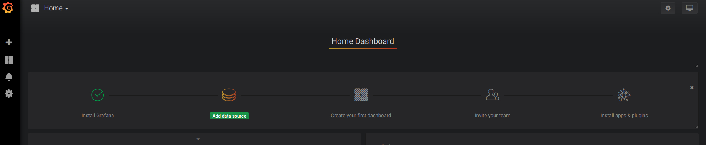

要使用 Grafana，第一步当然是要配置数据源，告诉 Grafana 从哪里取数据，我们点击 **Add data source** 进入数据源的配置页面：

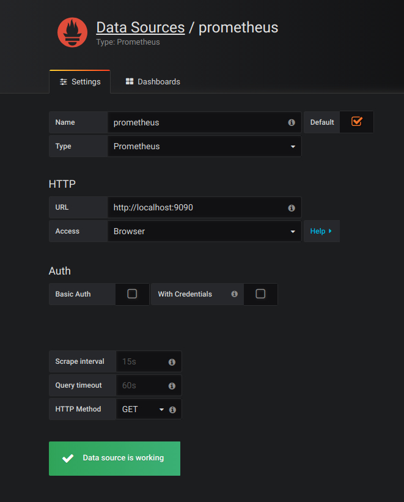

我们在这里依次填上：

* Name: prometheus
* Type: Prometheus
* URL: http://localhost:9090
* Access: Browser

要注意的是，这里的 Access 指的是 Grafana 访问数据源的方式，有 Browser 和 Proxy 两种方式。Browser 方式表示当用户访问 Grafana 面板时，浏览器直接通过 URL 访问数据源的；而 Proxy 方式表示浏览器先访问 Grafana 的某个代理接口（接口地址是 `/api/datasources/proxy/`），由 Grafana 的服务端来访问数据源的 URL，如果数据源是部署在内网，用户通过浏览器无法直接访问时，这种方式非常有用。

配置好数据源，Grafana 会默认提供几个已经配置好的面板供你使用，如下图所示，默认提供了三个面板：Prometheus Stats、Prometheus 2.0 Stats 和 Grafana metrics。点击 **Import** 就可以导入并使用该面板。

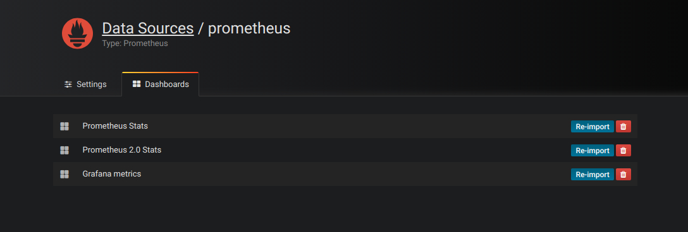

我们导入 Prometheus 2.0 Stats 这个面板，可以看到下面这样的监控面板。如果你的公司有条件，可以申请个大显示器挂在墙上，将这个面板投影在大屏上，实时观察线上系统的状态，可以说是非常 cool 的。


## 五、使用 Exporter 收集指标

目前为止，我们看到的都还只是一些没有实际用途的指标，如果我们要在我们的生产环境真正使用 Prometheus，往往需要关注各种各样的指标，譬如服务器的 CPU负载、内存占用量、IO开销、入网和出网流量等等。正如上面所说，Prometheus 是使用 Pull 的方式来获取指标数据的，要让 Prometheus 从目标处获得数据，首先必须在目标上安装指标收集的程序，并暴露出 HTTP 接口供 Prometheus 查询，这个指标收集程序被称为 **Exporter**，不同的指标需要不同的 Exporter 来收集，目前已经有大量的 Exporter 可供使用，几乎囊括了我们常用的各种系统和软件，官网列出了一份 [常用 Exporter 的清单](https://prometheus.io/docs/instrumenting/exporters/)，各个 Exporter 都遵循一份端口约定，避免端口冲突，即从 9100 开始依次递增，这里是 [完整的 Exporter 端口列表](https://github.com/prometheus/prometheus/wiki/Default-port-allocations)。另外值得注意的是，有些软件和系统无需安装 Exporter，这是因为他们本身就提供了暴露 Prometheus 格式的指标数据的功能，比如 Kubernetes、Grafana、Etcd、Ceph 等。

这一节就让我们来收集一些有用的数据。

### 5.1 收集服务器指标

首先我们来收集服务器的指标，这需要安装 [node_exporter](https://github.com/prometheus/node_exporter)，这个 exporter 用于收集 *NIX 内核的系统，如果你的服务器是 Windows，可以使用 [WMI exporter](https://github.com/martinlindhe/wmi_exporter)。

和 Prometheus server 一样，node_exporter 也是开箱即用的：

```
$ wget https://github.com/prometheus/node_exporter/releases/download/v0.16.0/node_exporter-0.16.0.linux-amd64.tar.gz
$ tar xvfz node_exporter-0.16.0.linux-amd64.tar.gz
$ cd node_exporter-0.16.0.linux-amd64
$ ./node_exporter
```

node_exporter 启动之后，我们访问下 `/metrics` 接口看看是否能正常获取服务器指标：

```
$ curl http://localhost:9100/metrics
```

如果一切 OK，我们可以修改 Prometheus 的配置文件，将服务器加到 `scrape_configs` 中：

```
scrape_configs:
  - job_name: 'prometheus'
    static_configs:
      - targets: ['192.168.0.107:9090']
  - job_name: 'server'
    static_configs:
      - targets: ['192.168.0.107:9100']
```

修改配置后，需要重启 Prometheus 服务，或者发送 `HUP` 信号也可以让 Prometheus 重新加载配置：

```
$ killall -HUP prometheus
```

在 Prometheus Web UI 的 Status -> Targets 中，可以看到新加的服务器：

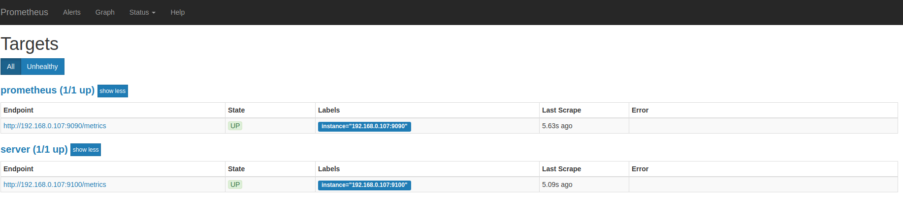

在 Graph 页面的指标下拉框可以看到很多名称以 node 开头的指标，譬如我们输入 `node_load1` 观察服务器负载：

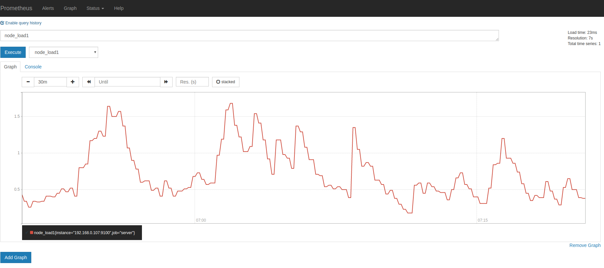

如果想在 Grafana 中查看服务器的指标，可以在 [Grafana 的 Dashboards 页面](https://grafana.com/dashboards) 搜索 `node exporter`，有很多的面板模板可以直接使用，譬如：[Node Exporter Server Metrics](https://grafana.com/dashboards/405) 或者 [Node Exporter Full](https://grafana.com/dashboards/1860) 等。我们打开 Grafana 的 **Import dashboard** 页面，输入面板的 URL（https://grafana.com/dashboards/405）或者 ID（405）即可。 

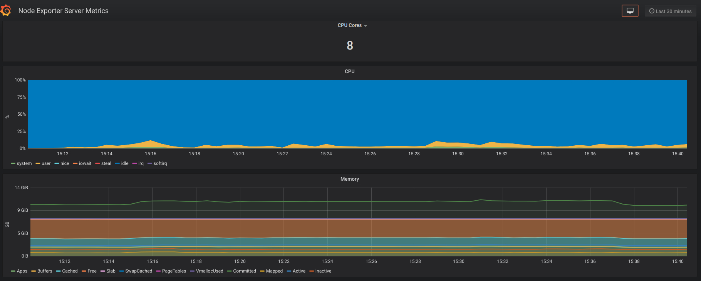

#### 注意事项

一般情况下，node_exporter 都是直接运行在要收集指标的服务器上的，官方不推荐用 Docker 来运行 node_exporter。如果逼不得已一定要运行在 Docker 里，要特别注意，这是因为 Docker 的文件系统和网络都有自己的 namespace，收集的数据并不是宿主机真实的指标。可以使用一些变通的方法，比如运行 Docker 时加上下面这样的参数：

```
docker run -d \
  --net="host" \
  --pid="host" \
  -v "/:/host:ro,rslave" \
  quay.io/prometheus/node-exporter \
  --path.rootfs /host
```

关于 node_exporter 的更多信息，可以参考 [node_exporter 的文档](https://github.com/prometheus/node_exporter) 和 Prometheus 的官方指南 [Monitoring Linux host metrics with the Node Exporter](https://prometheus.io/docs/guides/node-exporter/)，另外，Julius Volz 的这篇文章 [How To Install Prometheus using Docker on Ubuntu 14.04](https://www.digitalocean.com/community/tutorials/how-to-install-prometheus-using-docker-on-ubuntu-14-04) 也是很好的入门材料。

### 5.2 收集 MySQL 指标

[mysqld_exporter](https://github.com/prometheus/mysqld_exporter) 是 Prometheus 官方提供的一个 exporter，我们首先 [下载最新版本](https://github.com/prometheus/mysqld_exporter/releases) 并解压（开箱即用）：

```
$ wget https://github.com/prometheus/mysqld_exporter/releases/download/v0.11.0/mysqld_exporter-0.11.0.linux-amd64.tar.gz
$ tar xvfz mysqld_exporter-0.11.0.linux-amd64.tar.gz
$ cd mysqld_exporter-0.11.0.linux-amd64/
```

mysqld_exporter 需要连接到 mysqld 才能收集它的指标，可以通过两种方式来设置 mysqld 数据源。第一种是通过环境变量 `DATA_SOURCE_NAME`，这被称为 **[DSN（数据源名称）](https://en.wikipedia.org/wiki/Data_source_name)**，它必须符合 [DSN 的格式](https://github.com/go-sql-driver/mysql#dsn-data-source-name)，一个典型的 DSN 格式像这样：`user:password@(host:port)/`。

```
$ export DATA_SOURCE_NAME='root:123456@(192.168.0.107:3306)/'
$ ./mysqld_exporter
```

另一种方式是通过配置文件，默认的配置文件是 `~/.my.cnf`，或者通过 `--config.my-cnf` 参数指定：

```
$ ./mysqld_exporter --config.my-cnf=".my.cnf"
```

配置文件的格式如下：

```
$ cat .my.cnf
[client]
host=localhost
port=3306
user=root
password=123456
```

如果要把 MySQL 的指标导入 Grafana，可以参考 [这些 Dashboard JSON](https://github.com/percona/grafana-dashboards)。

#### 注意事项

这里为简单起见，在 mysqld_exporter 中直接使用了 root 连接数据库，在真实环境中，可以为 mysqld_exporter [创建一个单独的用户](https://dev.mysql.com/doc/refman/8.0/en/create-user.html)，并[赋予它受限的权限](https://dev.mysql.com/doc/refman/8.0/en/grant.html)（PROCESS、REPLICATION CLIENT、SELECT），最好还限制它的最大连接数（MAX_USER_CONNECTIONS）。

```
CREATE USER 'exporter'@'localhost' IDENTIFIED BY 'password' WITH MAX_USER_CONNECTIONS 3;
GRANT PROCESS, REPLICATION CLIENT, SELECT ON *.* TO 'exporter'@'localhost';
```

### 5.3 收集 Nginx 指标

官方提供了两种收集 Nginx 指标的方式。第一种是 [Nginx metric library](https://github.com/knyar/nginx-lua-prometheus)，这是一段 Lua 脚本（prometheus.lua），Nginx 需要开启 Lua 支持（libnginx-mod-http-lua 模块）。为方便起见，也可以使用 OpenResty 的 [OPM（OpenResty Package Manager）](https://opm.openresty.org/) 或者 [luarocks（The Lua package manager）](https://luarocks.org/modules/knyar/nginx-lua-prometheus) 来安装。第二种是 [Nginx VTS exporter](https://github.com/hnlq715/nginx-vts-exporter)，这种方式比第一种要强大的多，安装要更简单，支持的指标也更丰富，它依赖于 [nginx-module-vts 模块](https://github.com/vozlt/nginx-module-vts)，vts 模块可以提供大量的 Nginx 指标数据，可以通过 JSON、HTML 等形式查看这些指标。Nginx VTS exporter 就是通过抓取 `/status/format/json` 接口来将 vts 的数据格式转换为 Prometheus 的格式。不过，在 nginx-module-vts 最新的版本中增加了一个新接口：`/status/format/prometheus`，这个接口可以直接返回 Prometheus 的格式，从这点这也能看出 Prometheus 的影响力，估计 Nginx VTS exporter 很快就要退役了（TODO：待验证）。

除此之外，还有很多其他的方式来收集 Nginx 的指标，比如：[nginx_exporter](https://github.com/discordianfish/nginx_exporter) 通过抓取 Nginx 自带的统计页面 `/nginx_status` 可以获取一些比较简单的指标（需要开启 [ngx_http_stub_status_module 模块](http://nginx.org/en/docs/http/ngx_http_stub_status_module.html)）；[nginx_request_exporter](https://github.com/markuslindenberg/nginx_request_exporter) 通过 [syslog 协议](https://en.wikipedia.org/wiki/Syslog) 收集并分析 Nginx 的 access log 来统计 HTTP 请求相关的一些指标；[nginx-prometheus-shiny-exporter](https://github.com/serge-name/nginx-prometheus-shiny-exporter) 和 nginx_request_exporter 类似，也是使用 syslog 协议来收集 access log，不过它是使用 [Crystal 语言](https://crystal-lang.org/) 写的。还有 [vovolie/lua-nginx-prometheus](https://github.com/vovolie/lua-nginx-prometheus) 基于 Openresty、Prometheus、Consul、Grafana 实现了针对域名和 Endpoint 级别的流量统计。

有需要或感兴趣的同学可以对照说明文档自己安装体验下，这里就不一一尝试了。

### 5.4 收集 JMX 指标

最后让我们来看下如何收集 Java 应用的指标，Java 应用的指标一般是通过 [JMX（Java Management Extensions）](https://zh.wikipedia.org/wiki/JMX) 来获取的，顾名思义，JMX 是管理 Java 的一种扩展，它可以方便的管理和监控正在运行的 Java 程序。

[JMX Exporter](https://github.com/prometheus/jmx_exporter) 用于收集 JMX 指标，很多使用 Java 的系统，都可以使用它来收集指标，比如：Kafaka、Cassandra 等。首先我们下载 JMX Exporter：

```
$ wget https://repo1.maven.org/maven2/io/prometheus/jmx/jmx_prometheus_javaagent/0.3.1/jmx_prometheus_javaagent-0.3.1.jar
```

JMX Exporter 是一个 Java Agent 程序，在运行 Java 程序时通过 `-javaagent` 参数来加载：

```
$ java -javaagent:jmx_prometheus_javaagent-0.3.1.jar=9404:config.yml -jar spring-boot-sample-1.0-SNAPSHOT.jar
```

其中，9404 是 JMX Exporter 暴露指标的端口，`config.yml` 是 JMX Exporter 的配置文件，它的内容可以 [参考 JMX Exporter 的配置说明](https://github.com/prometheus/jmx_exporter#configuration) 。然后检查下指标数据是否正确获取：

```
$ curl http://localhost:9404/metrics
```

## 六、告警和通知

至此，我们能收集大量的指标数据，也能通过强大而美观的面板展示出来。不过作为一个监控系统，最重要的功能，还是应该能及时发现系统问题，并及时通知给系统负责人，这就是 [Alerting（告警）](https://prometheus.io/docs/alerting/overview/)。Prometheus 的告警功能被分成两部分：一个是告警规则的配置和检测，并将告警发送给 [Alertmanager](https://github.com/prometheus/alertmanager)，另一个是 Alertmanager，它负责管理这些告警，去除重复数据，分组，并路由到对应的接收方式，发出报警。常见的接收方式有：Email、PagerDuty、HipChat、Slack、OpsGenie、WebHook 等。

### 6.1 配置告警规则

我们在上面介绍 Prometheus 的配置文件时了解到，它的默认配置文件 prometheus.yml 有四大块：global、alerting、rule_files、scrape_config，其中 rule_files 块就是告警规则的配置项，alerting 块用于配置 Alertmanager，这个我们下一节再看。现在，先让我们在 rule_files 块中添加一个告警规则文件：

```
rule_files:
  - "alert.rules"
```

然后参考 [官方文档](https://prometheus.io/docs/prometheus/latest/configuration/alerting_rules/)，创建一个告警规则文件 `alert.rules`：

```
groups:
- name: example
  rules:

  # Alert for any instance that is unreachable for >5 minutes.
  - alert: InstanceDown
    expr: up == 0
    for: 5m
    labels:
      severity: page
    annotations:
      summary: "Instance {{ $labels.instance }} down"
      description: "{{ $labels.instance }} of job {{ $labels.job }} has been down for more than 5 minutes."

  # Alert for any instance that has a median request latency >1s.
  - alert: APIHighRequestLatency
    expr: api_http_request_latencies_second{quantile="0.5"} > 1
    for: 10m
    annotations:
      summary: "High request latency on {{ $labels.instance }}"
      description: "{{ $labels.instance }} has a median request latency above 1s (current value: {{ $value }}s)"
```

这个规则文件里，包含了两条告警规则：`InstanceDown` 和 `APIHighRequestLatency`。顾名思义，InstanceDown 表示当实例宕机时（up === 0）触发告警，APIHighRequestLatency 表示有一半的 API 请求延迟大于 1s 时（api_http_request_latencies_second{quantile="0.5"} > 1）触发告警。配置好后，需要重启下 Prometheus server，然后访问 `http://localhost:9090/rules` 可以看到刚刚配置的规则：

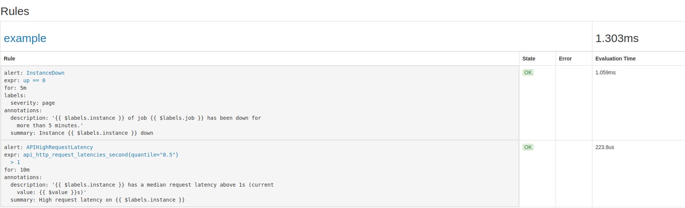

访问 `http://localhost:9090/alerts` 可以看到根据配置的规则生成的告警：

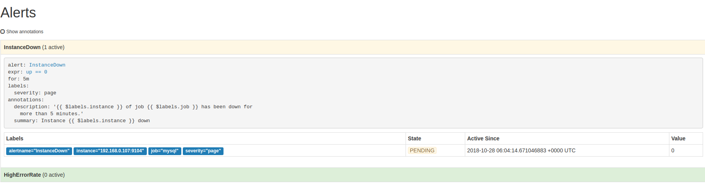

这里我们将一个实例停掉，可以看到有一条 alert 的状态是 `PENDING`，这表示已经触发了告警规则，但还没有达到告警条件。这是因为这里配置的 `for` 参数是 5m，也就是 5 分钟后才会触发告警，我们等 5 分钟，可以看到这条 alert 的状态变成了 `FIRING`。

### 6.2 使用 Alertmanager 发送告警通知

虽然 Prometheus 的 `/alerts` 页面可以看到所有的告警，但是还差最后一步：触发告警时自动发送通知。这是由 Alertmanager 来完成的，我们首先 [下载并安装 Alertmanager](https://github.com/prometheus/alertmanager/releases)，和其他 Prometheus 的组件一样，Alertmanager 也是开箱即用的：

```
$ wget https://github.com/prometheus/alertmanager/releases/download/v0.15.2/alertmanager-0.15.2.linux-amd64.tar.gz
$ tar xvfz alertmanager-0.15.2.linux-amd64.tar.gz
$ cd alertmanager-0.15.2.linux-amd64
$ ./alertmanager
```

Alertmanager 启动后默认可以通过 `http://localhost:9093/` 来访问，但是现在还看不到告警，因为我们还没有把 Alertmanager 配置到 Prometheus 中，我们回到 Prometheus 的配置文件 `prometheus.yml`，添加下面几行：

```
alerting:
  alertmanagers:
  - scheme: http
    static_configs:
    - targets:
      - "192.168.0.107:9093"
```

这个配置告诉 Prometheus，当发生告警时，将告警信息发送到 Alertmanager，Alertmanager 的地址为 `http://192.168.0.107:9093`。也可以使用命名行的方式指定 Alertmanager：

```
$ ./prometheus -alertmanager.url=http://192.168.0.107:9093
```

这个时候再访问 Alertmanager，可以看到 Alertmanager 已经接收到告警了：

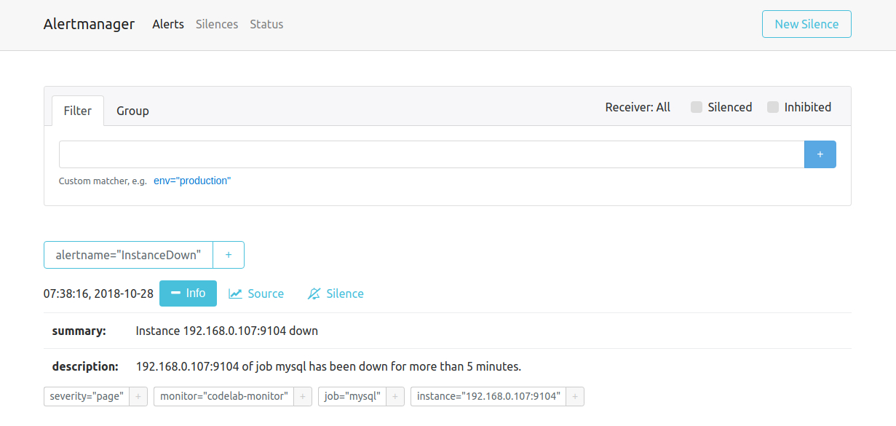

下面的问题就是如何让 Alertmanager 将告警信息发送给我们了，我们打开默认的配置文件 `alertmanager.ym`：

```
global:
  resolve_timeout: 5m

route:
  group_by: ['alertname']
  group_wait: 10s
  group_interval: 10s
  repeat_interval: 1h
  receiver: 'web.hook'
receivers:
- name: 'web.hook'
  webhook_configs:
  - url: 'http://127.0.0.1:5001/'
inhibit_rules:
  - source_match:
      severity: 'critical'
    target_match:
      severity: 'warning'
    equal: ['alertname', 'dev', 'instance']
```

参考 [官方的配置手册](https://prometheus.io/docs/alerting/configuration/) 了解各个配置项的功能，其中 global 块表示一些全局配置；route 块表示通知路由，可以根据不同的标签将告警通知发送给不同的 receiver，这里没有配置 routes 项，表示所有的告警都发送给下面定义的 web.hook 这个 receiver；如果要配置多个路由，可以参考 [这个例子](https://prometheus.io/docs/alerting/configuration/#example)：

```
  routes:
  - receiver: 'database-pager'
    group_wait: 10s
    match_re:
      service: mysql|cassandra

  - receiver: 'frontend-pager'
    group_by: [product, environment]
    match:
      team: frontend
```

紧接着，receivers 块表示告警通知的接收方式，每个 receiver 包含一个 name 和一个 xxx_configs，不同的配置代表了不同的接收方式，Alertmanager 内置了下面这些接收方式：

* email_config
* hipchat_config
* pagerduty_config
* pushover_config
* slack_config
* opsgenie_config
* victorops_config
* wechat_configs
* webhook_config

虽然接收方式很丰富，但是在国内，其中大多数接收方式都很少使用。最常用到的，莫属 email_config 和 webhook_config，另外 wechat_configs 可以支持使用微信来告警，也是相当符合国情的了。

其实告警的通知方式是很难做到面面俱到的，因为消息软件各种各样，每个国家还可能不同，不可能完全覆盖到，所以 Alertmanager 已经决定不再添加新的 receiver 了，而是推荐使用 webhook 来集成自定义的接收方式。可以参考 [这些集成的例子](https://prometheus.io/docs/operating/integrations/#alertmanager-webhook-receiver)，譬如 [将钉钉接入 Prometheus AlertManager WebHook](http://theo.im/blog/2017/10/16/release-prometheus-alertmanager-webhook-for-dingtalk/)。

## 七、学习更多

到这里，我们已经学习了 Prometheus 的大多数功能，结合 Prometheus + Grafana + Alertmanager 完全可以搭建一套非常完整的监控系统。不过在真正使用时，我们会发现更多的问题。

### 7.1 服务发现

由于 Prometheus 是通过 Pull 的方式主动获取监控数据，所以需要手工指定监控节点的列表，当监控的节点增多之后，每次增加节点都需要更改配置文件，非常麻烦，这个时候就需要通过服务发现（service discovery，SD）机制去解决。Prometheus 支持多种服务发现机制，可以自动获取要收集的 targets，可以参考 [这里](https://github.com/prometheus/prometheus/tree/master/discovery)，包含的服务发现机制包括：azure、consul、dns、ec2、openstack、file、gce、kubernetes、marathon、triton、zookeeper（nerve、serverset），配置方法可以参考手册的 [Configuration](https://prometheus.io/docs/prometheus/latest/configuration/configuration/) 页面。可以说 SD 机制是非常丰富的，但目前由于开发资源有限，已经不再开发新的 SD 机制，只对基于文件的 SD 机制进行维护。

关于服务发现网上有很多教程，譬如 Prometheus 官方博客中这篇文章 [Advanced Service Discovery in Prometheus 0.14.0](https://prometheus.io/blog/2015/06/01/advanced-service-discovery/) 对此有一个比较系统的介绍，全面的讲解了 [relabeling 配置](https://prometheus.io/docs/operating/configuration/#relabel_config)，以及如何使用 DNS-SRV、Consul 和文件来做服务发现。另外，官网还提供了 [一个基于文件的服务发现的入门例子](https://prometheus.io/docs/guides/file-sd/)，Julius Volz 写的 Prometheus workshop 入门教程中也 [使用了 DNS-SRV 来当服务发现](https://github.com/juliusv/prometheus_workshop/blob/master/workshop.md#configuring-targets-with-service-discovery)。

### 7.2 告警配置管理

无论是 Prometheus 的配置还是 Alertmanager 的配置，都没有提供 API 供我们动态的修改。一个很常见的场景是，我们需要基于 Prometheus 做一套可自定义规则的告警系统，用户可根据自己的需要在页面上创建修改或删除告警规则，或者是修改告警通知方式和联系人，正如在 Prometheus Google Groups 里的 [这个用户的问题](https://groups.google.com/forum/#!topic/prometheus-users/4fV9qBXkfeI)：How to dynamically add alerts rules in rules.conf and prometheus yml file via API or something？不过遗憾的是，[Simon Pasquier](https://github.com/simonpasquier) 在下面说到，目前并没有这样的 API，而且以后也没有这样的计划来开发这样的 API，因为这样的功能更应该交给譬如 Puppet、Chef、Ansible、Salt 这样的配置管理系统。

### 7.3 使用 Pushgateway

[Pushgateway](https://github.com/prometheus/pushgateway) 主要用于收集一些短期的 jobs，由于这类 jobs 存在时间较短，可能在 Prometheus 来 Pull 之前就消失了。官方对 [什么时候该使用 Pushgateway](https://prometheus.io/docs/practices/pushing/) 有一个很好的说明。

## 总结

这篇博客参考了网络上大量关于 Prometheus 的中文资料，有文档，也有博客，比如 [1046102779](https://github.com/1046102779) 的 [Prometheus 非官方中文手册](https://github.com/1046102779/prometheus)，[宋佳洋](http://www.songjiayang.com/) 的电子书[《Prometheus 实战》](https://github.com/songjiayang/prometheus_practice)，在这里对这些原作者表示敬意。在 Prometheus 官方文档的 [Media 页面](https://prometheus.io/docs/introduction/media/)，也提供了很多学习资源。

关于 Prometheus，还有非常重要的一部分内容这篇博客没有涉及到，正如博客一开头所讲的，Prometheus 是继 Kubernetes 之后第二个加入 CNCF 的项目，Prometheus 和 Docker、Kubernetes 的结合非常紧密，使用 Prometheus 作为 Docker 和 Kubernetes 的监控系统也越来越主流。关于 Docker 的监控，可以参考官网的一篇指南：[Monitoring Docker container metrics using cAdvisor](https://prometheus.io/docs/guides/cadvisor/)，它介绍了如何使用 [cAdvisor](https://github.com/google/cadvisor) 来对容器进行监控；不过 Docker 现在也开始原生支持 Prometheus 的监控了，参考 Docker 的官方文档 [Collect Docker metrics with Prometheus](https://docs.docker.com/config/thirdparty/prometheus/)；关于 Kubernetes 的监控，[Kubernetes 中文社区](https://www.kubernetes.org.cn/) 里有不少[关于 Promehtheus 的资源](https://www.kubernetes.org.cn/tags/prometheus)，另外，[《如何以优雅的姿势监控 Kubernetes》](https://www.kancloud.cn/huyipow/prometheus)这本电子书也对 Kubernetes 的监控有一个比较全面的介绍。

最近两年 Prometheus 的发展非常迅速，社区也非常活跃，国内研究 Prometheus 的人也越来越多。随着微服务，DevOps，云计算，云原生等概念的普及，越来越多的企业开始使用 Docker 和 Kubernetes 来构建自己的系统和应用，像 Nagios 和 Cacti 这样的老牌监控系统会变得越来越不适用，相信 Prometheus 最终会发展成一个最适合云环境的监控系统。

## 参考

1. [Prometheus 官方文档【英文】](https://prometheus.io/docs/introduction/overview/)
1. [Prometheus 官方文档【中文】](https://love2.io/@1046102779/doc/prometheus)
1. [The History of Prometheus at SoundCloud](https://promcon.io/2016-berlin/talks/the-history-of-prometheus-at-soundcloud/)
1. [Prometheus: Monitoring at SoundCloud](https://developers.soundcloud.com/blog/prometheus-monitoring-at-soundcloud)
1. [Google And Friends Add Prometheus To Kubernetes Platform](https://www.nextplatform.com/2016/05/09/google-friends-add-prometheus-kubernetes-platform/)
1. [云原生架构概述](http://dockone.io/article/2991)
1. [还不了解 CNCF？关于 CNCF 的三问三答！](http://blog.daocloud.io/cncf-3/)
1. [时序列数据库武斗大会之什么是TSDB](http://liubin.org/blog/2016/02/18/tsdb-intro/)
1. [时序列数据库武斗大会之TSDB名录 Part 1](http://liubin.org/blog/2016/02/25/tsdb-list-part-1/)
1. [Prometheus 入门](https://www.hi-linux.com/posts/25047.html)
1. [Prometheus 初探](https://www.opsdev.cn/post/Prometheus-first-exploration.html)
1. [监控利器之 Prometheus](https://blog.xizhibei.me/2017/08/06/monitoring-with-prometheus/)
1. [使用Prometheus+Grafana监控MySQL实践](http://www.ywnds.com/?p=9656)
1. [使用Prometheus+grafana打造高逼格监控平台](http://blog.51cto.com/youerning/2050543)
1. [初试 Prometheus + Grafana 监控系统搭建并监控 Mysql](https://blog.csdn.net/aixiaoyang168/article/details/81354059)
1. [使用Prometheus和Grafana监控Mysql服务器性能](https://segmentfault.com/a/1190000007040144)
1. [使用Prometheus监控服务器](https://blog.frognew.com/2017/02/use-prometheus-on-centos7.html)
1. [Prometheus 入门与实践](https://www.ibm.com/developerworks/cn/cloud/library/cl-lo-prometheus-getting-started-and-practice/index.html)
1. [基于Prometheus的分布式在线服务监控实践](https://zhuanlan.zhihu.com/p/24811652)
1. [grafana+ prometheus+php 监控系统实践](https://segmentfault.com/a/1190000015876636)
1. [Grafana+prometheus+php 自动创建监控图](https://segmentfault.com/a/1190000015922077)
1. [Prometheus+Grafana监控部署实践](https://www.cnblogs.com/netonline/p/8289411.html)
1. [How To Install Prometheus using Docker on Ubuntu 14.04](https://www.digitalocean.com/community/tutorials/how-to-install-prometheus-using-docker-on-ubuntu-14-04)

## 更多

### 什么是时序数据库？

上文提到 Prometheus 是一款基于时序数据库的监控系统，时序数据库常简写为 **TSDB（Time Series Database）**。很多流行的监控系统都在使用时序数据库来保存数据，这是因为时序数据库的特点和监控系统不谋而合。

* 增：需要频繁的进行写操作，而且是按时间排序顺序写入
* 删：不需要随机删除，一般情况下会直接删除一个时间区块的所有数据
* 改：不需要对写入的数据进行更新
* 查：需要支持高并发的读操作，读操作是按时间顺序升序或降序读，数据量非常大，缓存不起作用

DB-Engines 上有一个[关于时序数据库的排名](https://db-engines.com/en/ranking/time+series+dbms)，下面是排名靠前的几个（2018年10月）：

* InfluxDB：[https://influxdata.com/](https://influxdata.com/)
* Kdb+：[http://kx.com/](http://kx.com/)
* Graphite：[http://graphiteapp.org/](http://graphiteapp.org/)
* RRDtool：[http://oss.oetiker.ch/rrdtool/](http://oss.oetiker.ch/rrdtool/)
* OpenTSDB：[http://opentsdb.net/](http://opentsdb.net/)
* Prometheus：[https://prometheus.io/](https://prometheus.io/)
* Druid：[http://druid.io/](http://druid.io/)

另外，[liubin](https://github.com/liubin) 在他的博客上写了一个关于时序数据库的系列文章：[时序列数据库武斗大会](http://liubin.org/blog/2016/02/18/tsdb-intro/)，推荐。
