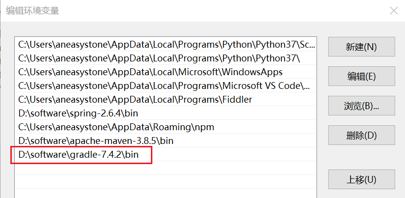

# 使用 Gradle 构建 Java 项目

这篇教程介绍的是如何使用 Gradle 构建一个简单的 Java 项目。

## 建立项目

首先使用下面的命令创建 Gradle 项目所需的目录结构：

```
$ mkdir -p src/main/java/hello
```

创建好的目录结构如下：

```
src
└── main
    └── java
        └── hello
```

进入 hello 目录，创建一个 `HelloWorld.java` 文件：

```
$ cd src/main/java/hello/
$ vi HelloWorld.java
```

文件内容如下：

```java
package hello;

public class HelloWorld {
    public static void main(String[] args) {
        System.out.println(new HelloWorld().say());
    }

    public String say() {
        return "Hello World";
    }
}
```

这样一个 Gradle 项目就准备好了，接下来我们需要安装 Gradle。

## 安装 Gradle

推荐使用 [SDKMAN](https://sdkman.io/) 或者 [Homebrew](https://brew.sh/) 来安装 Gradle。

或者也可以进入 Gradle 项目的 [Releases 页面](https://gradle.org/releases/) 手工下载并安装，官方提供了 binary-only 和 complete 两种格式，我们直接下载 binary-only 格式的 `gradle-7.4.2-bin.zip`，下载完成后，直接解压，并将 bin 目录添加到 `Path` 环境变量中：



如果安装正确，运行 `gradle` 将会显示出如下的 Gradle 信息：

```
$ gradle

Welcome to Gradle 7.4.2!

Here are the highlights of this release:
 - Aggregated test and JaCoCo reports
 - Marking additional test source directories as tests in IntelliJ
 - Support for Adoptium JDKs in Java toolchains

For more details see https://docs.gradle.org/7.4.2/release-notes.html

Starting a Gradle Daemon (subsequent builds will be faster)

> Task :help

Welcome to Gradle 7.4.2.

Directory 'D:\code' does not contain a Gradle build.

To create a new build in this directory, run gradle init

For more detail on the 'init' task, see https://docs.gradle.org/7.4.2/userguide/build_init_plugin.html

For more detail on creating a Gradle build, see https://docs.gradle.org/7.4.2/userguide/tutorial_using_tasks.html

To see a list of command-line options, run gradle --help

For more detail on using Gradle, see https://docs.gradle.org/7.4.2/userguide/command_line_interface.html

For troubleshooting, visit https://help.gradle.org

BUILD SUCCESSFUL in 1s
1 actionable task: 1 executed
```

## 看看 Gradle 能做什么？

`gradle tasks` 命令用于显示在当前目录可以执行的 Gradle 任务列表，首先需要在当前目录创建一个空白的 `gradle.build` 文件：

```
$ touch gradle.build
```

或者使用 `gradle init` 来初始化项目，这个命令会依次提几个问题，直接回车选择默认选项即可：

```
> gradle init

Select type of project to generate:
  1: basic
  2: application
  3: library
  4: Gradle plugin
Enter selection (default: basic) [1..4]

Select build script DSL:
  1: Groovy
  2: Kotlin
Enter selection (default: Groovy) [1..2]

Generate build using new APIs and behavior (some features may change in the next minor release)? (default: no) [yes, no]

Project name (default: demo):

> Task :init
Get more help with your project: Learn more about Gradle by exploring our samples at https://docs.gradle.org/7.4.2/samples

BUILD SUCCESSFUL in 9s
2 actionable tasks: 2 executed
```

`gradle init` 不仅会创建一个 `build.gradle` 文件，还会在当前目录创建一些 Gradle 可能需要的其他文件：

```
├── .gitattributes
├── .gitignore
├── .gradle
├── build.gradle
├── gradle
│   └── wrapper
│       ├── gradle-wrapper.jar
│       └── gradle-wrapper.properties
├── gradlew
├── gradlew.bat
└── settings.gradle
```

然后执行 `gradle tasks` 命令看看 Gradle 能做什么：

```
> gradle tasks

> Task :tasks

------------------------------------------------------------
Tasks runnable from root project 'demo'
------------------------------------------------------------

Build Setup tasks
-----------------
init - Initializes a new Gradle build.
wrapper - Generates Gradle wrapper files.

Help tasks
----------
buildEnvironment - Displays all buildscript dependencies declared in root project 'demo'.
dependencies - Displays all dependencies declared in root project 'demo'.
dependencyInsight - Displays the insight into a specific dependency in root project 'demo'.
help - Displays a help message.
javaToolchains - Displays the detected java toolchains.
outgoingVariants - Displays the outgoing variants of root project 'demo'.
projects - Displays the sub-projects of root project 'demo'.
properties - Displays the properties of root project 'demo'.
tasks - Displays the tasks runnable from root project 'demo'.

To see all tasks and more detail, run gradle tasks --all

To see more detail about a task, run gradle help --task <task>

BUILD SUCCESSFUL in 1s
1 actionable task: 1 executed
```

目前的任务列表只有上面这几个，看上去都没有什么用，随着我们在 `build.gradle` 文件中添加不同的插件，任务列表将会丰富起来。

> 你也可以使用 [Gradle Wrapper](https://docs.gradle.org/current/userguide/gradle_wrapper.html)，通过 Gradle Wrapper 可以自动安装 Gradle 的指定版本，这样保证了团队内的所有成员使用的 Gradle 版本是一致的。运行 `gradle init` 命令时会自动安装 Gradle Wrapper。

## 构建 Java 项目

首先，我们在 `build.gradle` 文件中添加一个 Java 插件：

```
apply plugin: 'java'
```

然后重新执行 `gradle tasks` 命令：

```
> gradle tasks

> Task :tasks

------------------------------------------------------------
Tasks runnable from root project 'demo'
------------------------------------------------------------

Build tasks
-----------
assemble - Assembles the outputs of this project.
build - Assembles and tests this project.
buildDependents - Assembles and tests this project and all projects that depend on it.
buildNeeded - Assembles and tests this project and all projects it depends on.
classes - Assembles main classes.
clean - Deletes the build directory.
jar - Assembles a jar archive containing the main classes.
testClasses - Assembles test classes.

Build Setup tasks
-----------------
init - Initializes a new Gradle build.
wrapper - Generates Gradle wrapper files.

Documentation tasks
-------------------
javadoc - Generates Javadoc API documentation for the main source code.

Help tasks
----------
buildEnvironment - Displays all buildscript dependencies declared in root project 'demo'.
dependencies - Displays all dependencies declared in root project 'demo'.
dependencyInsight - Displays the insight into a specific dependency in root project 'demo'.
help - Displays a help message.
javaToolchains - Displays the detected java toolchains.
outgoingVariants - Displays the outgoing variants of root project 'demo'.
projects - Displays the sub-projects of root project 'demo'.
properties - Displays the properties of root project 'demo'.
tasks - Displays the tasks runnable from root project 'demo'.

Verification tasks
------------------
check - Runs all checks.
test - Runs the test suite.

Rules
-----
Pattern: clean<TaskName>: Cleans the output files of a task.
Pattern: build<ConfigurationName>: Assembles the artifacts of a configuration.

To see all tasks and more detail, run gradle tasks --all

To see more detail about a task, run gradle help --task <task>

BUILD SUCCESSFUL in 1s
1 actionable task: 1 executed
```

可以看到多了很多新任务，比如：`build` 用于构建 Java 项目，`javadoc` 用于生成 Java 文档，`test` 用于执行单元测试等等。

我们来试试 `gradle build` 任务：

```
$ gradle build

BUILD SUCCESSFUL in 2s
2 actionable tasks: 2 executed
```

`gradle build` 可以编译 Java 代码，并执行测试，最后将编译后的文件打成一个 jar 包。构建的产物会生成到 `build` 目录下：

```
build
├── classes
│   └── java
│       └── main
│           └── hello
│               └── HelloWorld.class
├── generated
│   └── sources
│       ├── annotationProcessor
│       │   └── java
│       │       └── main
│       └── headers
│           └── java
│               └── main
├── libs
│   └── demo.jar
└── tmp
    ├── compileJava
    │   └── previous-compilation-data.bin
    └── jar
        └── MANIFEST.MF
```

其中，`classes` 目录下是我们编译生成的 `.class` 文件，`libs` 目录下是打包好的 jar 文件。不过这个 jar 文件还不能运行：

```
$ java -jar .\build\libs\demo.jar
.\build\libs\demo.jar中没有主清单属性
```

解决方法是在 `gradle.build` 中指定主清单属性：

```
jar {
    manifest {
        attributes 'Main-Class': 'hello.HelloWorld'
    }
}
```

重新构建后，运行正常：

```
$ java -jar .\build\libs\demo.jar
Hello World
```

## 声明依赖

目前我们的代码还没有声明任何其他的依赖，下面我们在代码里引入 `org.joda.time.LocalTime`：

```
package hello;

import org.joda.time.LocalTime;

public class HelloWorld {
    public static void main(String[] args) {
        System.out.println(new HelloWorld().say());
        LocalTime currentTime = new LocalTime();
        System.out.println("The current local time is: " + currentTime);
    }
	
    public String say() {
        return "Hello World";
    }
}
```

并在 `gradle.build` 文件中声明所需的依赖：

```
repositories { 
    mavenCentral()
}

dependencies {
    implementation "joda-time:joda-time:2.2"
}
```

要注意的是，声明 `dependencies` 之前必须要指定一个 `repositories`，`mavenCentral()` 表示从 Maven 中央仓库下载依赖。

然后再使用 `gradle build` 将项目打包成 jar 文件，执行 `java -jar`：

```
$ java -jar .\build\libs\demo.jar
Hello World
Exception in thread "main" java.lang.NoClassDefFoundError: org/joda/time/LocalTime
        at hello.HelloWorld.main(HelloWorld.java:8)
Caused by: java.lang.ClassNotFoundException: org.joda.time.LocalTime
        at java.base/jdk.internal.loader.BuiltinClassLoader.loadClass(BuiltinClassLoader.java:641)
        at java.base/jdk.internal.loader.ClassLoaders$AppClassLoader.loadClass(ClassLoaders.java:188)
        at java.base/java.lang.ClassLoader.loadClass(ClassLoader.java:520)
```

为了让代码能正常运行，我们可以使用 `application` 插件，在 `gradle.build` 文件中加入如下代码：

```
apply plugin: 'application'

mainClassName = 'hello.HelloWorld'
```

然后执行 `gradle run` 命令：

```
> gradle run

> Task :run
Hello World
The current local time is: 08:17:39.995

BUILD SUCCESSFUL in 1s
2 actionable tasks: 1 executed, 1 up-to-date
```

> TODO：使用 Gradle 如何打带依赖的 jar 包？

## 单元测试

在 `gradle.build` 文件的 `dependencies` 中添加 JUnit 依赖：

```
dependencies {
    implementation "joda-time:joda-time:2.2"
	testImplementation "junit:junit:4.12"
}
```

然后创建单元测试所需要的目录结构：

```
$ mkdir -p src/test/java/hello
```

进入 hello 目录，创建一个 `HelloWorldTest.java` 文件：

```
$ cd src/test/java/hello/
$ vi HelloWorldTest.java
```

文件内容如下：

```
package hello;

import static org.hamcrest.CoreMatchers.containsString;
import static org.junit.Assert.*;

import org.junit.Test;

public class HelloWorldTest {
  
    private HelloWorld hello = new HelloWorld();

    @Test
    public void sayTest() {
        assertThat(hello.say(), containsString("Hello"));
    }
}
```

运行 `gradle test` 将会编译并运行 `src/test/java` 目录下的单元测试，测试完成后，在 `build\reports\tests\test` 目录下可以找到对应的测试报告。
