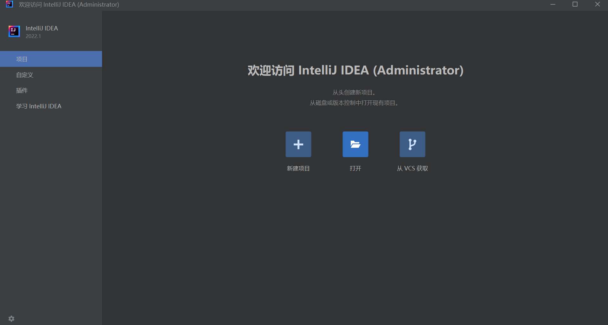
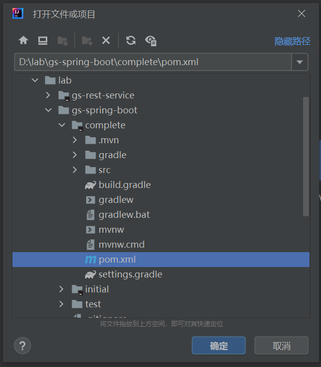
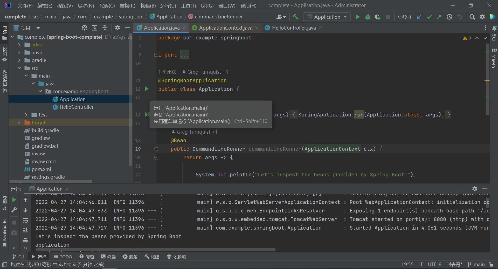

# 使用 IntelliJ IDEA 体验入门指南

这篇教程介绍了使用 [IntelliJ IDEA](https://www.jetbrains.com/idea/download/) 来体验 Spring 入门指南。

## 安装 IntelliJ IDEA

我们从官方 [下载页面](https://www.jetbrains.com/idea/download/#section=windows) 将 IntelliJ IDEA 下载到本地，有两种文件格式可供选择：
`.exe` 为安装格式，`.zip` 为免安装格式。我们下载 `.zip` 格式的文件，直接解压后，在 bin 目录下双击 `idea64.exe` 文件即可启动 IntelliJ IDEA。


## 导入入门指南

和 STS 不一样，IntelliJ IDEA 没有 `Import Spring Getting Started Content` 菜单（参见 [STS 的教程](../sts/README.md)），不能直接导入 Spring 的入门指南，所以只能根据需要提前下载相应指南的源码，譬如我们想体验下 [Spring Boot 指南](https://spring.io/guides/gs/spring-boot/)，我们通过下面的 `git clone` 命令下载源码：

```
$ git clone https://github.com/spring-guides/gs-spring-boot.git
```

然后启动 IntelliJ IDEA，在启动页面中单击 “打开” 按钮：



在弹出的窗口中找到刚刚下载的源码，然后选择 `complete` 目录下的 `pom.xml` 或 `build.gradle` 文件：



一般情况下，Spring 提供的的指南源码都包含了两种构建类型文件：`pom.xml` 用于 Maven 构建，`build.gradle` 用于 Gradle 构建。我们这里选择 `pom.xml` 打开项目，项目加载完成后，打开项目的入口类 `Application.java`，点击左侧的小三角按钮，即可启动或调试项目。


