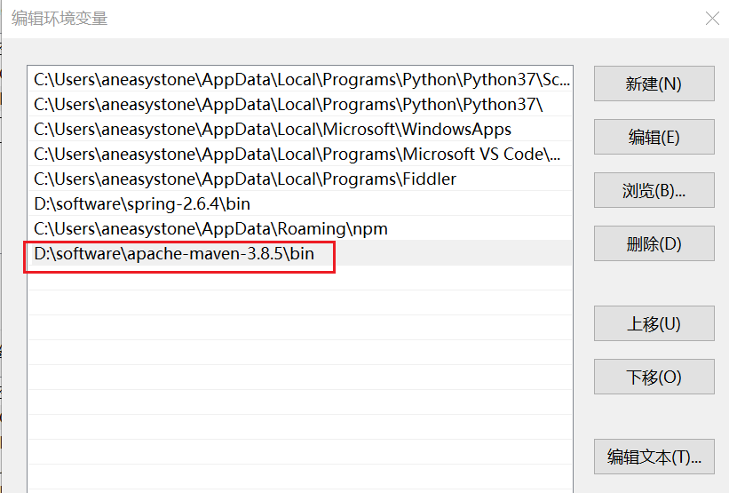

# 使用 Maven 构建 Java 项目

这篇教程介绍的是如何使用 Maven 构建一个简单的 Java 项目。

## 建立项目

首先使用下面的命令创建 Maven 项目所需的目录结构：

```
$ mkdir -p src/main/java/hello
```

创建好的目录结构如下：

```
src
└── main
    └── java
        └── hello
```

进入 hello 目录，创建一个 `HelloWorld.java` 文件：

```
$ cd src/main/java/hello/
$ vi HelloWorld.java
```

文件内容如下：

```java
package hello;

public class HelloWorld {
    public static void main(String[] args) {
        System.out.println(new HelloWorld().say());
    }

    public String say() {
        return "Hello World";
    }
}
```

这样一个 Maven 项目就准备好了，接下来我们需要安装 Maven。

## 安装 Maven

进入 Maven 项目的官方下载页面 [Download Apache Maven](https://maven.apache.org/download.cgi)，可以看到有几种不同的格式，我们直接下载 zip 格式的 `apache-maven-3.8.5-bin.zip`，下载完成后，直接解压，并将 bin 目录添加到 `Path` 环境变量中：



如果安装正确，使用 `mvn -v` 将会显示出如下的 Maven 信息：

```
$ mvn -v
Apache Maven 3.8.5 (3599d3414f046de2324203b78ddcf9b5e4388aa0)
Maven home: D:\software\apache-maven-3.8.5
Java version: 11.0.8, vendor: Oracle Corporation, runtime: C:\Program Files\Java\jdk-11.0.8
Default locale: zh_CN, platform encoding: GBK
OS name: "windows 10", version: "10.0", arch: "amd64", family: "windows"
```

> 你也可以使用 [Maven Wrapper](https://maven.apache.org/wrapper/)，通过 Maven Wrapper 可以自动安装 Maven 的指定版本，这样保证了团队内的所有成员使用的 Maven 版本是一致的。

## Maven 项目定义

为了使用 Maven 来构建项目，你必须在项目中创建一个 `pom.xml` 文件，用来定义项目的名称、版本、以及依赖的外部库。

一个简单的 `pom.xml` 文件内容如下：

```
<?xml version="1.0" encoding="UTF-8"?>
<project xmlns="http://maven.apache.org/POM/4.0.0" xmlns:xsi="http://www.w3.org/2001/XMLSchema-instance"
    xsi:schemaLocation="http://maven.apache.org/POM/4.0.0 https://maven.apache.org/xsd/maven-4.0.0.xsd">
    <modelVersion>4.0.0</modelVersion>

    <groupId>org.springframework</groupId>
    <artifactId>gs-maven</artifactId>
    <packaging>jar</packaging>
    <version>0.1.0</version>

    <properties>
        <maven.compiler.source>1.8</maven.compiler.source>
        <maven.compiler.target>1.8</maven.compiler.target>
    </properties>

    <build>
        <plugins>
            <plugin>
                <groupId>org.apache.maven.plugins</groupId>
                <artifactId>maven-shade-plugin</artifactId>
                <version>3.2.4</version>
                <executions>
                    <execution>
                        <phase>package</phase>
                        <goals>
                            <goal>shade</goal>
                        </goals>
                        <configuration>
                            <transformers>
                                <transformer
                                    implementation="org.apache.maven.plugins.shade.resource.ManifestResourceTransformer">
                                    <mainClass>hello.HelloWorld</mainClass>
                                </transformer>
                            </transformers>
                        </configuration>
                    </execution>
                </executions>
            </plugin>
        </plugins>
    </build>
</project>
```

其中，`<modelVersion>` 表示 POM 模型的版本（一直是 4.0.0），`<groupId>` 为组织名，一般使用倒序的域名来表示，比如这里的 `org.springframework`，`<artifactId>` 为制品名，也就是这个项目的名称，`packaging` 为打包方式，一般有 jar 和 war 两种，`<version>` 为项目版本号，版本格式遵循 [语义化版本](https://semver.org/lang/zh-CN/) 规范：`主版本号.次版本号.修订号`。

另外，在 POM 文件中还使用了一个插件 [Maven Shade Plugin](https://maven.apache.org/plugins/maven-shade-plugin/) 来构建 Maven 项目。

## 构建 Java 项目

至此，我们的项目就准备好了。使用下面的命令编译 Java 代码：

```
$ mvn compile
```

编译成功后，你可以在 `target/classes` 目录下找到编译后的 `.class` 文件。

使用下面的命令打包项目：

```
$ mvn package
```

打包后的 jar 文件名是根据你在 `pom.xml` 文件中定义的 `artifactId` 和 `version` 来命名的，你可以在 `target` 目录下找到打包后的 `gs-maven-0.1.0.jar` 文件。

打包好的 jar 文件可以使用 `java -jar` 命令执行：

```
$ java -jar ./target/gs-maven-0.1.0.jar
Hello World
```

另外，还可以使用 `mvn install` 命令，将项目安装到 Maven 的本地仓库里（默认保存到 `~/.m2/repository` 目录）供其他项目使用。

## 声明依赖

目前我们的代码还没有声明任何其他的依赖，下面我们在代码里引入 `org.joda.time.LocalTime`：

```
package hello;

import org.joda.time.LocalTime;

public class HelloWorld {
    public static void main(String[] args) {
        System.out.println(new HelloWorld().say());
        LocalTime currentTime = new LocalTime();
        System.out.println("The current local time is: " + currentTime);
    }
	
    public String say() {
        return "Hello World";
    }
}
```

并在 `pom.xml` 文件中声明所需的依赖：

```
<dependencies>
	<dependency>
		<groupId>joda-time</groupId>
		<artifactId>joda-time</artifactId>
		<version>2.9.2</version>
	</dependency>
</dependencies>
```

> 每个依赖还可以指定一个 `<scope>` 参数，默认为 `compile`，其他可选的值有：`provided` 和 `test`。

然后再使用 `mvn package` 将项目打包成 jar 文件，执行 `java -jar`：

```
$ java -jar .\target\gs-maven-0.1.0.jar
Hello World
The current local time is: 18:30:39.793
```

## 单元测试

在 `pom.xml` 文件的 `<dependencies>` 中添加 JUnit 依赖：

```
	<dependency>
		<groupId>junit</groupId>
		<artifactId>junit</artifactId>
		<version>4.12</version>
		<scope>test</scope>
	</dependency>
```

然后创建单元测试所需要的目录结构：

```
$ mkdir -p src/test/java/hello
```

进入 hello 目录，创建一个 `HelloWorldTest.java` 文件：

```
$ cd src/test/java/hello/
$ vi HelloWorldTest.java
```

文件内容如下：

```
package hello;

import static org.hamcrest.CoreMatchers.containsString;
import static org.junit.Assert.*;

import org.junit.Test;

public class HelloWorldTest {
  
    private HelloWorld hello = new HelloWorld();

    @Test
    public void sayTest() {
        assertThat(hello.say(), containsString("Hello"));
    }
}
```

运行 `mvn test`，Maven 会使用 `surefire` 插件来执行单元测试，这个插件默认会编译并运行 `src/test/java` 目录下所有 Test 结尾的 Java 文件中的单元测试，

```
$ mvn test
-------------------------------------------------------
 T E S T S
-------------------------------------------------------
Running hello.HelloWorldTest
Tests run: 1, Failures: 0, Errors: 0, Skipped: 0, Time elapsed: 0.062 sec

Results :

Tests run: 1, Failures: 0, Errors: 0, Skipped: 0

[INFO] ------------------------------------------------------------------------
[INFO] BUILD SUCCESS
[INFO] ------------------------------------------------------------------------
[INFO] Total time:  2.438 s
[INFO] Finished at: 2022-04-30T19:45:36+08:00
[INFO] ------------------------------------------------------------------------
```

如果我们改下 `HelloWorld.java` 中的 `say` 方法，让它不返回 "Hello World"：

```
    public String say() {
        return "xxx";
    }
```

再次执行 `mvn test`，会出现下面这样的报错信息：

```
$ mvn test
-------------------------------------------------------
 T E S T S
-------------------------------------------------------
Running hello.HelloWorldTest
Tests run: 1, Failures: 1, Errors: 0, Skipped: 0, Time elapsed: 0.066 sec <<< FAILURE!
sayTest(hello.HelloWorldTest)  Time elapsed: 0.011 sec  <<< FAILURE!
java.lang.AssertionError:
Expected: a string containing "Hello"
     but: was "xxx"
        at org.hamcrest.MatcherAssert.assertThat(MatcherAssert.java:20)

Results :

Failed tests:   sayTest(hello.HelloWorldTest): (..)

Tests run: 1, Failures: 1, Errors: 0, Skipped: 0

[INFO] ------------------------------------------------------------------------
[INFO] BUILD FAILURE
[INFO] ------------------------------------------------------------------------
[INFO] Total time:  2.182 s
[INFO] Finished at: 2022-04-30T19:48:17+08:00
[INFO] ------------------------------------------------------------------------
[ERROR] Failed to execute goal org.apache.maven.plugins:maven-surefire-plugin:2.12.4:test (default-test) on project gs-maven: There are test failures.
[ERROR]
[ERROR] Please refer to D:\code\weekly-practice\WEEK009-Spring官方入门指南\guides\gs\maven\demo\target\surefire-reports for the individual test results.
[ERROR] -> [Help 1]
[ERROR]
[ERROR] To see the full stack trace of the errors, re-run Maven with the -e switch.
[ERROR] Re-run Maven using the -X switch to enable full debug logging.
[ERROR]
[ERROR] For more information about the errors and possible solutions, please read the following articles:
[ERROR] [Help 1] http://cwiki.apache.org/confluence/display/MAVEN/MojoFailureException
```

可以在 `target\surefire-reports` 目录下找到对应的测试报告。
