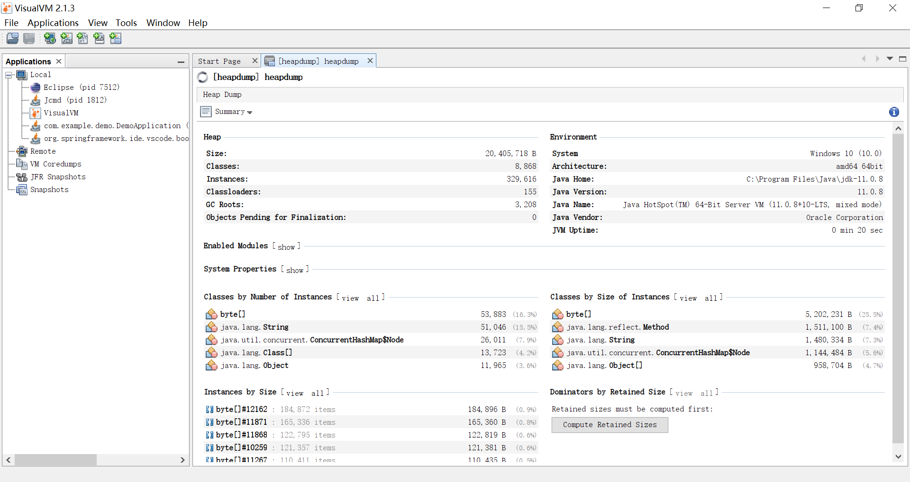
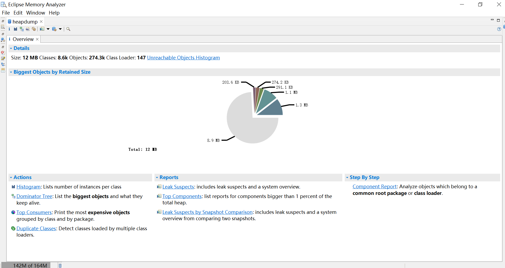

# WEEK014 - Spring Boot 生产就绪特性 Actuator

Spring Boot 官网将 Actuator 称为 [生产就绪特性（Production-ready features）](https://docs.spring.io/spring-boot/docs/current/reference/htmlsingle/#actuator)，它提供了诸如健康检查、审计、指标收集、HTTP 跟踪等功能，帮助我们监控和管理 Spring Boot 应用。

## 快速开始

使用 [Spring Initializr](https://start.spring.io/) 创建一个项目，依赖项选择 Web 和 Actuator，或者在已有项目中添加依赖：

```
<dependency>
	<groupId>org.springframework.boot</groupId>
	<artifactId>spring-boot-starter-web</artifactId>
</dependency>
<dependency>
	<groupId>org.springframework.boot</groupId>
	<artifactId>spring-boot-starter-actuator</artifactId>
</dependency>
```

启动程序后，就能访问 `/actuator` 接口了：

```
$ curl -s http://localhost:8080/actuator | jq
{
  "_links": {
    "self": {
      "href": "http://localhost:8080/actuator",
      "templated": false
    },
    "health": {
      "href": "http://localhost:8080/actuator/health",
      "templated": false
    },
    "health-path": {
      "href": "http://localhost:8080/actuator/health/{*path}",
      "templated": true
    }
  }
}
```

Spring Boot Actuator 提供了很多有用的接口，被称为端点（`Endpoints`），访问 `/actuator` 就可以看出程序当前暴露了哪些端点。端点的访问路径可以通过下面的配置修改：

```
management.endpoints.web.base-path=/management
```

从上面的命令结果可以看出在最新版本中，Actuator 只暴露一个 `/health` 端点，这个端点提供了关于应用健康情况的一些基础信息。

如果要开启所有端点，可以打开配置文件 `application.properties`，添加如下配置项：

```
management.endpoints.web.exposure.include=*
```

现在看看暴露了哪些端点：

```
$ curl -s http://localhost:8080/actuator | jq
{
  "_links": {
    "self": {
      "href": "http://localhost:8080/actuator",
      "templated": false
    },
    "beans": {
      "href": "http://localhost:8080/actuator/beans",
      "templated": false
    },
    "caches-cache": {
      "href": "http://localhost:8080/actuator/caches/{cache}",
      "templated": true
    },
    "caches": {
      "href": "http://localhost:8080/actuator/caches",
      "templated": false
    },
    "health": {
      "href": "http://localhost:8080/actuator/health",
      "templated": false
    },
    "health-path": {
      "href": "http://localhost:8080/actuator/health/{*path}",
      "templated": true
    },
    "info": {
      "href": "http://localhost:8080/actuator/info",
      "templated": false
    },
    "conditions": {
      "href": "http://localhost:8080/actuator/conditions",
      "templated": false
    },
    "configprops": {
      "href": "http://localhost:8080/actuator/configprops",
      "templated": false
    },
    "configprops-prefix": {
      "href": "http://localhost:8080/actuator/configprops/{prefix}",
      "templated": true
    },
    "env": {
      "href": "http://localhost:8080/actuator/env",
      "templated": false
    },
    "env-toMatch": {
      "href": "http://localhost:8080/actuator/env/{toMatch}",
      "templated": true
    },
    "loggers": {
      "href": "http://localhost:8080/actuator/loggers",
      "templated": false
    },
    "loggers-name": {
      "href": "http://localhost:8080/actuator/loggers/{name}",
      "templated": true
    },
    "heapdump": {
      "href": "http://localhost:8080/actuator/heapdump",
      "templated": false
    },
    "threaddump": {
      "href": "http://localhost:8080/actuator/threaddump",
      "templated": false
    },
    "metrics-requiredMetricName": {
      "href": "http://localhost:8080/actuator/metrics/{requiredMetricName}",
      "templated": true
    },
    "metrics": {
      "href": "http://localhost:8080/actuator/metrics",
      "templated": false
    },
    "scheduledtasks": {
      "href": "http://localhost:8080/actuator/scheduledtasks",
      "templated": false
    },
    "mappings": {
      "href": "http://localhost:8080/actuator/mappings",
      "templated": false
    }
  }
}
```

其中 `*` 表示开启所有端点，也可以只开启部分端点：

```
management.endpoints.web.exposure.include=beans,health,info
```

或者选择性的关闭部分端点：

```
management.endpoints.web.exposure.exclude=beans,info
```

## 原生端点解析

Spring Boot Actuator 暴露的原生端点大概可以分成三大类：

* 应用配置类：获取应用程序中加载的应用配置、环境变量、自动化配置报告等与Spring Boot应用密切相关的配置类信息。
* 度量指标类：获取应用程序运行过程中用于监控的度量指标，比如：内存信息、线程池信息、HTTP请求统计等。
* 操作控制类：提供了对应用的关闭等操作类功能。

下面对 Actuator 暴露的原生端点依次体验和学习。

### Beans (beans)

端点 `/beans` 列出了应用程序中所有 Bean 的信息，包括 Bean 的名称、别名、类型、是否单例、依赖等等。

```
$ curl -s http://localhost:8080/actuator/beans | jq
{
  "contexts": {
    "application": {
      "beans": {
        "endpointCachingOperationInvokerAdvisor": {
          "aliases": [],
          "scope": "singleton",
          "type": "org.springframework.boot.actuate.endpoint.invoker.cache.CachingOperationInvokerAdvisor",
          "resource": "class path resource [org/springframework/boot/actuate/autoconfigure/endpoint/EndpointAutoConfiguration.class]",
          "dependencies": [
            "org.springframework.boot.actuate.autoconfigure.endpoint.EndpointAutoConfiguration",
            "environment"
          ]
        },
        "defaultServletHandlerMapping": {
          "aliases": [],
          "scope": "singleton",
          "type": "org.springframework.web.servlet.HandlerMapping",
          "resource": "class path resource [org/springframework/boot/autoconfigure/web/servlet/WebMvcAutoConfiguration$EnableWebMvcConfiguration.class]",
          "dependencies": [
            "org.springframework.boot.autoconfigure.web.servlet.WebMvcAutoConfiguration$EnableWebMvcConfiguration"
          ]
        },
        ...
      },
      "parentId": null
    }
  }
}
```

Spring Boot 自身会创建很多个 Bean，[这里是完整的结果](./beans.json)。

### Health (health)

`/health` 端点用来检查应用程序的健康情况，默认情况下它只会显示应用程序的状态为 `UP` 或 `DOWN`：

```
$ curl -s http://localhost:8080/actuator/health | jq
{
  "status": "UP"
}
```

通过 `management.endpoint.health.show-details` 配置可以控制接口返回的内容：

| 配置值 | 描述 |
| ---- | ---- |
| never | 不展示详情信息，只显示 `UP` 或 `DOWN` 状态，默认配置 |
| always | 对所有用户展示详情信息 |
| when-authorized | 只对通过认证的用户展示详情信息，授权的角色可以通过`management.endpoint.health.roles` 配置 |

我们将其设置为 `always`：

```
management.endpoint.health.show-details=always
```

此时接口返回内容如下：

```
$ curl -s http://localhost:8080/actuator/health | jq
{
  "status": "UP",
  "components": {
    "diskSpace": {
      "status": "UP",
      "details": {
        "total": 174500155392,
        "free": 34697940992,
        "threshold": 10485760,
        "exists": true
      }
    },
    "ping": {
      "status": "UP"
    }
  }
}
```

由于我这个只是一个 Demo 项目，没有其他的依赖组件，所以健康状态的详情信息有点少。可以在 `pom.xml` 中添加一个 Mongo 的依赖：

```
<dependency>
    <groupId>org.springframework.boot</groupId>
    <artifactId>spring-boot-starter-data-mongodb</artifactId>
</dependency>
```

此时再查看 `/health` 端点，详情里就多个 Mongo 的信息了：

```
$ curl -s http://localhost:8080/actuator/health | jq
{
  "status": "UP",
  "components": {
    "diskSpace": {
      "status": "UP",
      "details": {
        "total": 174500155392,
        "free": 34691891200,
        "threshold": 10485760,
        "exists": true
      }
    },
    "mongo": {
      "status": "UP",
      "details": {
        "version": "4.0.27"
      }
    },
    "ping": {
      "status": "UP"
    }
  }
}
```

我们将 Mongo 服务手工停掉，再访问 `/health` 端点，可以看出，尽管我们的服务还是运行着的，但是我们服务的健康状态已经是 `DOWN` 了：

```
$ curl -s http://localhost:8080/actuator/health | jq
{
  "status": "DOWN",
  "components": {
    "diskSpace": {
      "status": "UP",
      "details": {
        "total": 174500155392,
        "free": 34691891200,
        "threshold": 10485760,
        "exists": true
      }
    },
    "mongo": {
      "status": "DOWN",
      "details": {
        "error": "org.springframework.dao.DataAccessResourceFailureException: Timed out after 30000 ms while waiting to connect. Client view of cluster state is {type=UNKNOWN, servers=[{address=localhost:27017, type=UNKNOWN, state=CONNECTING, exception={com.mongodb.MongoSocketOpenException: Exception opening socket}, caused by {java.net.ConnectException: Connection refused: connect}}]; nested exception is com.mongodb.MongoTimeoutException: Timed out after 30000 ms while waiting to connect. Client view of cluster state is {type=UNKNOWN, servers=[{address=localhost:27017, type=UNKNOWN, state=CONNECTING, exception={com.mongodb.MongoSocketOpenException: Exception opening socket}, caused by {java.net.ConnectException: Connection refused: connect}}]"
      }
    },
    "ping": {
      "status": "UP"
    }
  }
}
```

#### 健康指示器（`HealthIndicator`）

Spring Boot Actuator 提供了很多自动配置的 `健康指示器（HealthIndicator）`，当你的项目依赖某个组件的时候，该组件对应的健康指示器就会被自动装配，继而采集对应的信息。比如上面我们添加 Mongo 依赖后，`MongoHealthIndicator` 就会自动被用来采集 Mongo 的信息。

每个健康指示器都有一个 `key`，默认是指示器的 Bean 名称去掉 `HealthIndicator` 后缀，比如 Mongo 的健康指示器就是 `mongo`。可以使用 `management.health.<key>.enabled` 配置关闭某个指示器。可以通过下面这个配置关闭 Mongo 的健康检查：

```
management.health.mongo.enabled=false
```

常见的健康指示器和对应的 key 如下：

| Key | HealthIndicator |
| --- | --------------- |
| cassandra | CassandraDriverHealthIndicator
| couchbase | CouchbaseHealthIndicator |
| db | DataSourceHealthIndicator |
| diskspace | DiskSpaceHealthIndicator |
| elasticsearch | ElasticsearchRestHealthIndicator |
| hazelcast | HazelcastHealthIndicator |
| influxdb | InfluxDbHealthIndicator |
| jms | JmsHealthIndicator |
| ldap | LdapHealthIndicator |
| mail | MailHealthIndicator |
| mongo | MongoHealthIndicator |
| neo4j | Neo4jHealthIndicator |
| ping | PingHealthIndicator |
| rabbit | RabbitHealthIndicator |
| redis | RedisHealthIndicator |
| solr | SolrHealthIndicator |

可以通过下面这个配置关闭上面列表中的所有健康检查：

```
management.health.defaults.enabled=false
```

为了适应 Kubernetes 环境，Spring Boot Actuator 还提供了下面两个健康指示器，默认关闭。分别对应 Kubernetes 里的 `Liveness` 和  `Readiness` 探针，[参考 Kubernetes 官方文档](https://kubernetes.io/docs/tasks/configure-pod-container/configure-liveness-readiness-startup-probes/)。

| Key | HealthIndicator |
| --- | --------------- |
| livenessstate | LivenessStateHealthIndicator |
| readinessstate | ReadinessStateHealthIndicator |

#### 自定义健康指示器

当 Actuator 自带的健康指示器不能满足我们需求时，我们也可以自定义一个健康指示器，只需要实现 `HealthIndicator` 接口或者继承`AbstractHealthIndicator` 类即可，下面是一个简单的示例：

```
/**
 * 自定义健康指示器
 */
@Component
public class TestHealthIndicator extends AbstractHealthIndicator {

    @Override
    protected void doHealthCheck(Builder builder) throws Exception {
        builder.up()
            .withDetail("app", "test")
            .withDetail("error", 0);
    }

}
```

`withDetail` 用于显示健康详情，如果要显示状态 `DOWN`，就抛出一个异常即可。此时的健康详情接口返回如下：

```
$ curl -s http://localhost:8080/actuator/health | jq
{
  "status": "UP",
  "components": {
    "diskSpace": {
      "status": "UP",
      "details": {
        "total": 174500155392,
        "free": 34691883008,
        "threshold": 10485760,
        "exists": true
      }
    },
    "ping": {
      "status": "UP"
    },
    "test": {
      "status": "UP",
      "details": {
        "app": "test",
        "error": 0
      }
    }
  }
}
```

### Info (info)

`/info` 端点用于展示应用程序的一些基本信息，默认情况下 `/info` 返回的是一个空 JSON。

```
$ curl -s http://localhost:8080/actuator/info | jq
{}
```

Actuator 支持多种信息的收集方式，不过默认都是关闭的，需要使用 `management.info.<id>.enabled` 手动开启。支持的信息有如下几种：

| ID | 说明 |
| -- | ---- |
| build | 显示项目的构建信息，需要在项目中生成 `META-INF/build-info.properties` 文件 |
| env | 显示所有以 `info.` 开头的配置 |
| git | 显示 Git 信息，需要在项目中生成 `git.properties` 文件 |
| java | 显示 Java 运行时信息 |
| os | 显示操作系统信息 |

#### 显示构建信息

如果想在 `/info` 端点中显示项目的构建信息，我们需要在项目中生成 `META-INF/build-info.properties` 文件。这个文件可以使用 `spring-boot-maven-plugin` 自动生成，只需要在插件配置中添加一个 `build-info` 的 `goal` 即可：

```
<build>
  <plugins>
    <plugin>
      <groupId>org.springframework.boot</groupId>
      <artifactId>spring-boot-maven-plugin</artifactId>
      <executions>
        <execution>
          <goals>
            <goal>build-info</goal>
          </goals>
        </execution>
      </executions>
    </plugin>
  </plugins>
</build>
```

重新构建并运行程序，再访问 `/info` 端点：

```
$ curl -s http://localhost:8080/actuator/info | jq
{
  "build": {
    "artifact": "demo",
    "name": "demo",
    "time": "2022-07-04T23:04:34.085Z",
    "version": "0.0.1-SNAPSHOT",
    "group": "com.example"
  }
}
```

#### 显示环境配置

这个配置默认是关闭的，需要在配置文件中开启：

```
management.info.env.enabled=true
```

开启之后就可以在配置文件中添加 `info.` 开头的配置了。如果你使用的是 Maven 构建工具，你还可以在配置中使用 `@...@` 来引用 Maven 的配置，这被称为 [Maven 的自动配置展开](https://docs.spring.io/spring-boot/docs/current/reference/html/howto.html#howto.properties-and-configuration.expand-properties)：

```
info.env.app.name=demo
info.env.app.encoding=@project.build.sourceEncoding@
info.env.app.java.source=@java.version@
info.env.app.java.target=@java.version@
```

你还可以在程序启动时，使用 `--` 动态地注入配置：

```
$ java -jar .\target\demo-0.0.1-SNAPSHOT.jar --info.env.app.name=demo
```

查看 `/info` 端点的结果如下：

```
$ curl -s http://localhost:8080/actuator/info | jq
{
  "env": {
    "app": {
      "name": "demo",
      "encoding": "UTF-8",
      "java": {
        "source": "17.0.3",
        "target": "17.0.3"
      }
    }
  }
}
```

#### 显示 Git 信息

`/info` 端点还可以显示 Git 的一些基本信息，只要在你的项目中包含了 `git.properties` 文件即可。这个文件可以通过 [git-commit-id-maven-plugin](https://github.com/git-commit-id/git-commit-id-maven-plugin) 插件生成：

```
<build>
    <plugins>
        <plugin>
            <groupId>pl.project13.maven</groupId>
            <artifactId>git-commit-id-plugin</artifactId>
        </plugin>
    </plugins>
</build>
```

使用 `/info` 端点查看 Git 信息如下：

```
$ curl -s http://localhost:8080/actuator/info | jq
{
  "git": {
    "branch": "main",
    "commit": {
      "id": "61e8bd9",
      "time": "2022-07-04T00:12:32Z"
    }
  }
}
```

#### 显示 Java 运行时信息

这个配置默认是关闭的，通过下面的配置开启：

```
management.info.java.enabled=true
```

查看 `/info` 端点的结果如下：

```
$ curl -s http://localhost:8080/actuator/info | jq
{
  "java": {
    "version": "11.0.8",
    "vendor": {
      "name": "Oracle Corporation",
      "version": "18.9"
    },
    "runtime": {
      "name": "Java(TM) SE Runtime Environment",
      "version": "11.0.8+10-LTS"
    },
    "jvm": {
      "name": "Java HotSpot(TM) 64-Bit Server VM",
      "vendor": "Oracle Corporation",
      "version": "11.0.8+10-LTS"
    }
  }
}
```

#### 显示操作系统信息

这个配置默认是关闭的，通过下面的配置开启：

```
management.info.os.enabled=true
```

查看 `/info` 端点的结果如下：

```
$ curl -s http://localhost:8080/actuator/info | jq
{
  "os": {
    "name": "Windows 10",
    "version": "10.0",
    "arch": "amd64"
  }
}
```

#### 自定义信息

Spring Boot Actuator 通过在 `ApplicationContext` 中查找所有实现了 `InfoContributor` 接口的 Bean 来收集应用信息，譬如上面介绍的几种应用信息分别是通过 `BuildInfoContributor`、`EnvironmentInfoContributor`、`GitInfoContributor`、`JavaInfoContributor` 和 `OsInfoContributor` 实现的。我们也可以自己实现 `InfoContributor` 接口，来暴露自定义的应用信息。下面是一个简单的示例：

```
@Component
public class TestInfoContributor implements InfoContributor {

	@Override
	public void contribute(Builder builder) {
		builder.withDetail("hello", "world");
	}
	
}
```

此时查看 `/info` 端点，可以看到下面的结果：

```
$ curl -s http://localhost:8080/actuator/info | jq
{
  "hello": "world"
}
```

### Conditions Evaluation Report (conditions)

Spring Boot 使用 **约定优于配置** 的理念，采用包扫描和自动化配置的机制来加载依赖程序中的 Spring Bean。虽然这样做能让我们的代码变得非常简洁，但是整个应用的实例创建和依赖关系等信息都被离散到了各个配置类的注解上，这使得我们分析整个应用中资源和实例的各种关系变得非常的困难。

`/conditions` 端点可以用于排查程序中的配置类（`@Configuration`）或自动化配置类（`@AutoConfiguration`）是否生效的情况：

```
$ curl -s http://localhost:8080/actuator/conditions | jq
{
  "contexts": {
    "application": {
      "positiveMatches": {
        "AuditEventsEndpointAutoConfiguration": [
          {
            "condition": "OnAvailableEndpointCondition",
            "message": "@ConditionalOnAvailableEndpoint marked as exposed by a 'management.endpoints.jmx.exposure' property"
          }
        ],
        ...
      },
      "negativeMatches": {
        "RabbitHealthContributorAutoConfiguration": {
          "notMatched": [
            {
              "condition": "OnClassCondition",
              "message": "@ConditionalOnClass did not find required class 'org.springframework.amqp.rabbit.core.RabbitTemplate'"
            }
          ],
          "matched": []
        },
        ...
      },
      "unconditionalClasses": [
        "org.springframework.boot.autoconfigure.context.ConfigurationPropertiesAutoConfiguration",
        "org.springframework.boot.actuate.autoconfigure.availability.AvailabilityHealthContributorAutoConfiguration",
        "org.springframework.boot.actuate.autoconfigure.info.InfoContributorAutoConfiguration",
        "org.springframework.boot.autoconfigure.context.PropertyPlaceholderAutoConfiguration",
        "org.springframework.boot.autoconfigure.context.LifecycleAutoConfiguration",
        "org.springframework.boot.actuate.autoconfigure.health.HealthContributorAutoConfiguration",
        "org.springframework.boot.actuate.autoconfigure.metrics.integration.IntegrationMetricsAutoConfiguration",
        "org.springframework.boot.actuate.autoconfigure.endpoint.EndpointAutoConfiguration",
        "org.springframework.boot.autoconfigure.availability.ApplicationAvailabilityAutoConfiguration",
        "org.springframework.boot.autoconfigure.info.ProjectInfoAutoConfiguration",
        "org.springframework.boot.actuate.autoconfigure.web.server.ManagementContextAutoConfiguration"
      ]
    }
  }
}
```

返回结果较大，[完整的返回结果在这里](./conditions.json)。

返回结果里包括三大部分：`positiveMatches` 表示哪些配置条件是满足的，`negativeMatches` 表示哪些配置条件是不满足的，而 `unconditionalClasses` 表示无条件的配置类，这些配置无需满足什么条件就会自动加载。

### Configuration Properties (configprops)

`@ConfigurationProperties` 是 Spring Boot 提供的读取配置文件的一个注解，它可以将 application.properties 配置文件中的值注入到 Bean 对象上。`/configprops` 端点用于显示程序中所有的 `@ConfigurationProperties` Bean 以及配置值（包括默认值）：

```
$ curl -s http://localhost:8080/actuator/configprops | jq
{
  "contexts": {
    "application": {
      "beans": {
        "management.endpoints.web-org.springframework.boot.actuate.autoconfigure.endpoint.web.WebEndpointProperties": {
          "prefix": "management.endpoints.web",
          "properties": {
            "pathMapping": {},
            "exposure": {
              "include": [
                "*"
              ],
              "exclude": []
            },
            "basePath": "/actuator",
            "discovery": {
              "enabled": true
            }
          },
          "inputs": {
            "pathMapping": {},
            "exposure": {
              "include": [
                {
                  "value": "*",
                  "origin": "class path resource [application.properties] - 2:43"
                }
              ],
              "exclude": []
            },
            "basePath": {},
            "discovery": {
              "enabled": {}
            }
          }
        },
        ...
      },
      "parentId": null
    }
  }
}
```

返回结果较大，[完整的返回结果在这里](./configprops.json)。

从上面的结果可以看出，我们在配置文件中配置的 `management.endpoints.web.exposure.include=*` 实际上就对应的 `org.springframework.boot.actuate.autoconfigure.endpoint.web.WebEndpointProperties` 这个配置类里的属性。

### Environment (env)

`/env` 端点用于展示应用程序的环境变量配置。Spring Boot 中的环境变量配置不仅包括了操作系统中的环境变量，而且还包括了配置文件中的配置，以及命令行中配置等。返回结果较大，[这里是完整结果](./env.json)。

```
$ curl -s http://localhost:8080/actuator/env | jq
{
  "activeProfiles": [],
  "propertySources": [
    {
      "name": "server.ports",
      "properties": {
        "local.server.port": {
          "value": 8080
        }
      }
    },
    {
      "name": "servletContextInitParams",
      "properties": {}
    },
    {
      "name": "systemProperties",
      "properties": {
        "sun.desktop": {
          "value": "windows"
        },
        ...
      }
    },
    {
      "name": "systemEnvironment",
      "properties": {
        "USERDOMAIN_ROAMINGPROFILE": {
          "value": "DESKTOP-CH85E4K",
          "origin": "System Environment Property \"USERDOMAIN_ROAMINGPROFILE\""
        },
        ...
      }
    },
    {
      "name": "Config resource 'class path resource [application.properties]' via location 'optional:classpath:/'",
      "properties": {
        "management.endpoints.web.exposure.include": {
          "value": "*",
          "origin": "class path resource [application.properties] - 2:43"
        },
        ...
      }
    }
  ]
}
```

### Loggers (loggers)

`/loggers` 端点不仅可以查询我们在应用程序中所设置的日志等级，而且可以通过接口动态地进行修改，这在排查问题时非常有用。

下面是 `/loggers` 端点返回的部分结果：

```
$ curl -s http://localhost:8080/actuator/loggers | jq
{
  "levels": [
    "OFF",
    "ERROR",
    "WARN",
    "INFO",
    "DEBUG",
    "TRACE"
  ],
  "loggers": {
    "ROOT": {
      "configuredLevel": "INFO",
      "effectiveLevel": "INFO"
    },
    "com": {
      "configuredLevel": null,
      "effectiveLevel": "INFO"
    },
    "com.example": {
      "configuredLevel": null,
      "effectiveLevel": "INFO"
    },
    "com.example.demo": {
      "configuredLevel": null,
      "effectiveLevel": "INFO"
    },
    "com.example.demo.DemoApplication": {
      "configuredLevel": null,
      "effectiveLevel": "INFO"
    },
    "com.example.demo.TestHealthIndicator": {
      "configuredLevel": null,
      "effectiveLevel": "INFO"
    },
    ...
  },
  "groups": {
    "web": {
      "configuredLevel": null,
      "members": [
        "org.springframework.core.codec",
        "org.springframework.http",
        "org.springframework.web",
        "org.springframework.boot.actuate.endpoint.web",
        "org.springframework.boot.web.servlet.ServletContextInitializerBeans"
      ]
    },
    "sql": {
      "configuredLevel": null,
      "members": [
        "org.springframework.jdbc.core",
        "org.hibernate.SQL",
        "org.jooq.tools.LoggerListener"
      ]
    }
  }
}
```

也可以单独访问一个 logger：

```
$ curl -s http://localhost:8080/actuator/loggers/com.example.demo | jq
{
  "configuredLevel": null,
  "effectiveLevel": "INFO"
}
```

还可以使用 POST 请求来修改这个 logger 的日志等级，比如下面是一个例子，将 `com.example.demo` 的日志等级改为 `DEBUG`：

```
$ curl -s -X POST -d '{"configuredLevel": "DEBUG"}' \
  -H "Content-Type: application/json" \
  http://localhost:8080/actuator/loggers/com.example.demo
```

如果在生产环境中，你想要打印一些 DEBUG 信息用于诊断程序的一些异常情况，你只需要使用这个方法修改日志等级，而不需要重启应用。如果想重置日志等级，将 `configuredLevel` 设置为 `null` 即可：

```
$ curl -s -X POST -d '{"configuredLevel": null}' \
  -H "Content-Type: application/json" \
  http://localhost:8080/actuator/loggers/com.example.demo
```

### Heap Dump (heapdump)

访问 `/heapdump` 端点会自动生成一个 JVM 堆文件。

```
$ curl -O http://localhost:8080/actuator/heapdump
  % Total    % Received % Xferd  Average Speed   Time    Time     Time  Current
                                 Dload  Upload   Total   Spent    Left  Speed
100 30.9M  100 30.9M    0     0  85.5M      0 --:--:-- --:--:-- --:--:-- 85.5M
```

这个堆文件的格式取决于你所使用的 JVM，比如 HotSpot JVM 的 [HPROF](https://docs.oracle.com/javase/8/docs/technotes/samples/hprof.html) 格式，或者 OpenJ9 的 [PHD](https://www.eclipse.org/openj9/docs/dump_heapdump/#portable-heap-dump-phd-format) 格式。我们可以使用 [VisualVM](https://visualvm.github.io/download.html) 或 [Memory Analyzer（MAT）](https://www.eclipse.org/mat/) 等工具打开这个文件对内存进行分析。





### Thread Dump (threaddump)

`/threaddump` 端点用于查看应用程序的所有线程情况，方便我们在日常工作中定位问题。主要展示了线程名、线程ID、线程状态、是否等待锁资源、线程堆栈等信息。

```
$ curl -s http://localhost:8080/actuator/threaddump | jq
{
  "threads": [
    {
      "threadName": "Reference Handler",
      "threadId": 2,
      "blockedTime": -1,
      "blockedCount": 3,
      "waitedTime": -1,
      "waitedCount": 0,
      "lockName": null,
      "lockOwnerId": -1,
      "lockOwnerName": null,
      "daemon": true,
      "inNative": false,
      "suspended": false,
      "threadState": "RUNNABLE",
      "priority": 10,
      "stackTrace": [
        {
          "classLoaderName": null,
          "moduleName": "java.base",
          "moduleVersion": "11.0.8",
          "methodName": "waitForReferencePendingList",
          "fileName": "Reference.java",
          "lineNumber": -2,
          "className": "java.lang.ref.Reference",
          "nativeMethod": true
        },
        {
          "classLoaderName": null,
          "moduleName": "java.base",
          "moduleVersion": "11.0.8",
          "methodName": "processPendingReferences",
          "fileName": "Reference.java",
          "lineNumber": 241,
          "className": "java.lang.ref.Reference",
          "nativeMethod": false
        },
        {
          "classLoaderName": null,
          "moduleName": "java.base",
          "moduleVersion": "11.0.8",
          "methodName": "run",
          "fileName": "Reference.java",
          "lineNumber": 213,
          "className": "java.lang.ref.Reference$ReferenceHandler",
          "nativeMethod": false
        }
      ],
      "lockedMonitors": [],
      "lockedSynchronizers": [],
      "lockInfo": null
    },
	...
  ]
}
```

这里只显示了部分结果，[完整的结果在这里](threaddump.json)。

默认情况下，该端点的返回结果是 JSON 格式的，这对于程序来说比较友好，比如我们想开发一个线程分析程序，通过调用该接口就能拿到结构化的线程信息。不过这个格式看起来不太直观，如果返回的结果能和 `jstack` 的输出格式一样就好了，当然 Actuator 的开发人员也想到了这一点，实现起来也非常简单，只要在请求中加上 `Accept: text/plain` 头即可：

```
$ curl -s http://localhost:8080/actuator/threaddump -H 'Accept: text/plain'
```

### Metrics (metrics)

Spring Boot Actuator 使用 [Micrometer](https://micrometer.io/docs) 来收集指标，收集的指标可以通过 `/metrics` 端点来查询，比如：JVM 内存、线程、垃圾回收、Tomcat 会话、CPU、进程等信息。

```
$ curl -s http://localhost:8080/actuator/metrics | jq
{
  "names": [
    "application.ready.time",
    "application.started.time",
    "disk.free",
    "disk.total",
    "executor.active",
    "executor.completed",
    "executor.pool.core",
    "executor.pool.max",
    "executor.pool.size",
    "executor.queue.remaining",
    "executor.queued",
    "http.server.requests",
    "jvm.buffer.count",
    "jvm.buffer.memory.used",
    "jvm.buffer.total.capacity",
    "jvm.classes.loaded",
    "jvm.classes.unloaded",
    "jvm.gc.live.data.size",
    "jvm.gc.max.data.size",
    "jvm.gc.memory.allocated",
    "jvm.gc.memory.promoted",
    "jvm.gc.overhead",
    "jvm.gc.pause",
    "jvm.memory.committed",
    "jvm.memory.max",
    "jvm.memory.usage.after.gc",
    "jvm.memory.used",
    "jvm.threads.daemon",
    "jvm.threads.live",
    "jvm.threads.peak",
    "jvm.threads.states",
    "logback.events",
    "process.cpu.usage",
    "process.start.time",
    "process.uptime",
    "system.cpu.count",
    "system.cpu.usage",
    "tomcat.sessions.active.current",
    "tomcat.sessions.active.max",
    "tomcat.sessions.alive.max",
    "tomcat.sessions.created",
    "tomcat.sessions.expired",
    "tomcat.sessions.rejected"
  ]
}
```

直接访问地址 `/actuator/metrics` 时，返回的只有指标名称，为了获取指标详情，需要在地址后面再加上指标名称，比如下面是查看应用的 `process.cpu.usage` 指标：

```
$ curl -s http://localhost:8080/actuator/metrics/process.cpu.usage | jq
{
  "name": "process.cpu.usage",
  "description": "The \"recent cpu usage\" for the Java Virtual Machine process",
  "baseUnit": null,
  "measurements": [
    {
      "statistic": "VALUE",
      "value": 0.151430864178387
    }
  ],
  "availableTags": []
}
```

#### 监控系统一览

Actuator 不仅可以将指标通过 `/metrics` 端点暴露出来，而且还可以将指标转换成各种不同的监控系统的格式，集成不同的监控系统，实现监控和告警功能。集成方式很简单，只需要在 `pom.xml` 中添加 `micrometer-registry-{system}` 依赖即可，比如要集成 Promethues 监控，我们可以添加如下依赖：

```
<dependency>
    <groupId>io.micrometer</groupId>
    <artifactId>micrometer-registry-prometheus</artifactId>
</dependency>
```

Actuator 支持的监控系统如下：

* [AppOptics](https://www.appoptics.com/)
* [Atlas](https://github.com/Netflix/atlas)
* [Datadog](https://www.datadoghq.com/)
* [Dynatrace](https://www.dynatrace.com/)
* [Elastic](https://www.elastic.co/cn/)
* [Ganglia](http://ganglia.sourceforge.net/)
* [Graphite](https://graphiteapp.org/)
* [Humio](https://www.humio.com/getting-started/saas/)
* [Influx](https://www.influxdata.com/)
* [JMX](https://micrometer.io/docs/registry/jmx)
* [KairosDB](https://kairosdb.github.io/)
* [New Relic](https://newrelic.com/)
* [Prometheus](https://prometheus.io/)
* [SignalFx](https://www.signalfx.com/)
* [Stackdriver](https://cloud.google.com/stackdriver/)
* [StatsD](https://github.com/statsd/statsd)
* [Wavefront](https://www.wavefront.com/)

具体配置可以参考 [Micrometer](https://micrometer.io/docs/) 或 [Actuator](https://docs.spring.io/spring-boot/docs/current/reference/html/actuator.html#actuator.metrics.export) 的官方文档。

#### 自定义指标

Micrometer 提供了一个 `MeterRegistry` 类，用于实现自定义指标。下面的例子定义了一个名叫 `hello.counter` 的计数器指标，并带有 `app=demo` 的 `Tag`，每当访问一次 `/hello` 页面，计数器就会加一：

```
@RestController
public class DemoController {

    private final MeterRegistry registry;
    public DemoController(MeterRegistry registry) {
        this.registry = registry;
    }

    @GetMapping("/hello")
    public String hello() {
        this.registry.counter("hello.counter", Tags.of("app", "demo")).increment();
        return "hello";
    }
}
```

访问一次 `/hello` 接口之后，然后再访问 `/actuator/metrics/hello.counter`，可以看到这个指标的信息：

```
$ curl -GET http://localhost:8080/actuator/metrics/hello.counter | jq
{
  "name": "hello.counter",
  "description": null,
  "baseUnit": null,
  "measurements": [
    {
      "statistic": "COUNT",
      "value": 1
    }
  ],
  "availableTags": [
    {
      "tag": "app",
      "values": [
        "demo"
      ]
    }
  ]
}
```

另外，如果你的指标依赖于另一个 Bean，推荐使用 `MeterBinder` 来构建指标：

```
@Configuration
public class DemoListConfiguration {
    
    @Bean
    public List<String> demoList() {
        return new ArrayList<>();
    }

    @Bean
    public MeterBinder demoListSize(List<String> demoList) {
        return (registry) -> Gauge.builder("list.size", demoList::size).register(registry);
    }
}
```

### Mappings (mappings)

`/mappings` 端点用来返回应用中的所有 URI 路径，以及它们和控制器的映射关系：

```
$ curl -s http://localhost:8080/actuator/mappings | jq
{
  "contexts": {
    "application": {
      "mappings": {
        "dispatcherServlets": {
          "dispatcherServlet": [
            {
              "handler": "com.example.demo.DemoController#hello()",
              "predicate": "{GET [/hello]}",
              "details": {
                "handlerMethod": {
                  "className": "com.example.demo.DemoController",
                  "name": "hello",
                  "descriptor": "()Ljava/lang/String;"
                },
                "requestMappingConditions": {
                  "consumes": [],
                  "headers": [],
                  "methods": [
                    "GET"
                  ],
                  "params": [],
                  "patterns": [
                    "/hello"
                  ],
                  "produces": []
                }
              }
            },
            ...
          ]
        },
        "servletFilters": [
          {
            "servletNameMappings": [],
            "urlPatternMappings": [
              "/*"
            ],
            "name": "webMvcMetricsFilter",
            "className": "org.springframework.boot.actuate.metrics.web.servlet.WebMvcMetricsFilter"
          },
          {
            "servletNameMappings": [],
            "urlPatternMappings": [
              "/*"
            ],
            "name": "requestContextFilter",
            "className": "org.springframework.boot.web.servlet.filter.OrderedRequestContextFilter"
          },
          ...
        ],
        "servlets": [
          {
            "mappings": [
              "/"
            ],
            "name": "dispatcherServlet",
            "className": "org.springframework.web.servlet.DispatcherServlet"
          }
        ]
      },
      "parentId": null
    }
  }
}

```

从结果中可以看到应用程序都定义了哪些接口（包含了每个接口的地址，处理器，匹配条件等等），包括 Actuator 接口，列表有点长，[这里是完整的结果](./mappings.json)。

除此之外，还可以看到应用中定义了哪些 `servlets`，默认就只有一个 `dispatcherServlet`，以及有哪些 `servletFilters`，比如 `requestContextFilter` 和 `webMvcMetricsFilter` 等。

### Shutdown (shutdown)

`/shutdown` 端点用于关闭程序，默认是不开放的，需要通过下面的配置打开：

```
management.endpoint.shutdown.enabled=true
```

开启后就可以向该端点发送 POST 请求来关闭程序了：

```
$ curl -s -X POST http://localhost:8080/actuator/shutdown
{"message":"Shutting down, bye..."}
```

## 自定义端点

有时候我们希望将应用程序的内部状态暴露出来，或对内部状态进行修改，这时我们就可以使用 Actuator 的自定义端点功能，通过 `@Endpoint` 注解即可以注册一个新端点：

```
@Endpoint(id = "test")
@Configuration
public class TestEndpoint {
	
	private final List<String> demoList;
	public TestEndpoint(List<String> demoList) {
		this.demoList = demoList;
	}

	@ReadOperation
	public List<String> getDemoList() {
		return this.demoList;
	}
}
```

可以看到我们在上面的方法上加了一个 `@ReadOperation` 注解，表示这个端点可以通过 `GET` 访问：

```
$ curl -s http://localhost:8080/actuator/test | jq
```

除此之外，也可以使用 `@WriteOperation` 或 `@DeleteOperation` 注解，分别表示 `POST` 或 `DELETE` 请求。

## 使用 Spring Security 对端点进行安全保护

由于 Actuator 端点暴露出来的信息较为敏感，存在一定的安全风险，所以我们必须防止未经授权的外部访问。首先添加 Spring Security 依赖：

```
<dependency>
  <groupId>org.springframework.boot</groupId>
  <artifactId>spring-boot-starter-security</artifactId>
</dependency>
```

然后定义一个 `SecurityFilterChain` bean，对所有的 Actuator 端点开启认证，必须是 `ACTUATOR_ADMIN` 角色的用户才能访问，认证方式使用简单的 HTTP Basic 认证：

```
@Configuration
public class DemoSecurityConfiguration {
	
	@Bean
	public SecurityFilterChain securityFilterChain(HttpSecurity http) throws Exception {
		http.requestMatcher(EndpointRequest.toAnyEndpoint());
		http.authorizeRequests((requests) -> requests.anyRequest().hasRole("ACTUATOR_ADMIN"));
		http.httpBasic(withDefaults());
		return http.build();
	}
}
```

在配置文件中添加一个 `ACTUATOR_ADMIN` 角色的用户：

```
spring.security.user.name=admin
spring.security.user.password=admin
spring.security.user.roles=ACTUATOR_ADMIN
```

这样我们在访问 Actuator 端点时，必须输入用户名和密码（admin/admin）。

> 注意上面的代码中我们使用 `http.requestMatcher(EndpointRequest.toAnyEndpoint())` 只对 Actuator 端点开启认证，应用程序的其他接口不受影响。如果要对其他接口开启认证，可以再定义一个 `SecurityFilterChain` bean 对其他接口进行配置。

## 通过 JMX 访问 Actuator 端点

## 参考

1. [Production-ready Features](https://docs.spring.io/spring-boot/docs/current/reference/html/actuator.html)
1. [Spring Boot Actuator Web API Documentation](https://docs.spring.io/spring-boot/docs/current/actuator-api/htmlsingle/)
1. [Spring Boot Actuator 模块 详解：健康检查，度量，指标收集和监控](https://ricstudio.top/archives/spring_boot_actuator_learn)
1. [Spring Boot (十九)：使用 Spring Boot Actuator 监控应用](http://www.ityouknow.com/springboot/2018/02/06/spring-boot-actuator.html)
1. [Spring Boot Actuator](https://www.baeldung.com/spring-boot-actuators)
1. [Building a RESTful Web Service with Spring Boot Actuator](https://spring.io/guides/gs/actuator-service/)

## 更多

### 其他端点

除了 Actuator 的原生端点，还有一些特殊的端点，需要在特定的条件下才会有。

| 端点名称 | 端点地址 | 用途 | 满足条件 |
| ------- | -------- | --- | ------- |
| Audit Events | `/auditevents` | Exposes audit events information for the current application. | Requires an `AuditEventRepository` bean. |
| Caches | `/caches` | Exposes available caches. | - |
| Flyway | `/flyway` | Shows any Flyway database migrations that have been applied. | Requires one or more `Flyway` beans. |
| HTTP Trace | `/httptrace` | Displays HTTP trace information (by default, the last 100 HTTP request-response exchanges). | Requires an `HttpTraceRepository` bean. |
| Spring Integration graph | `/integrationgraph` | Shows the Spring Integration graph. | Requires a dependency on `spring-integration-core`. |
| Liquibase | `/liquibase` | Shows any Liquibase database migrations that have been applied. | Requires one or more Liquibase beans. |
| Log File | `/logfile` | Provides access to the contents of the application’s log file. | Requires `logging.file.name` or `logging.file.path` to be set. |
| Prometheus | `/prometheus` | Provides Spring Boot application’s metrics in the format required for scraping by a Prometheus server. | Requires a dependency on `micrometer-registry-prometheus` |
| Quartz | `/quartz` | Provides information about jobs and triggers that are managed by the Quartz Scheduler. | Requires `Quartz` beans. |
| Scheduled Tasks | `/scheduledtasks` | Displays the scheduled tasks in your application. | - |
| Sessions | `/sessions` | Allows retrieval and deletion of user sessions from a Spring Session-backed session store. | Requires a servlet-based web application that uses Spring Session. |
| Application Startup | `/startup` | Shows [the startup steps data](https://docs.spring.io/spring-boot/docs/current/reference/html/features.html#features.spring-application.startup-tracking) collected by the `ApplicationStartup`. | Requires the SpringApplication to be configured with a `BufferingApplicationStartup`. |
