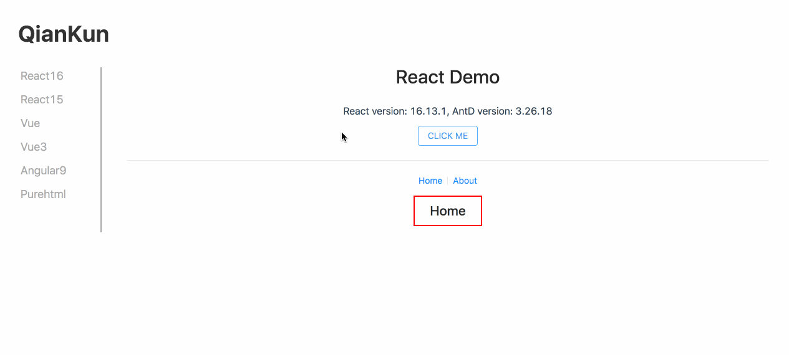
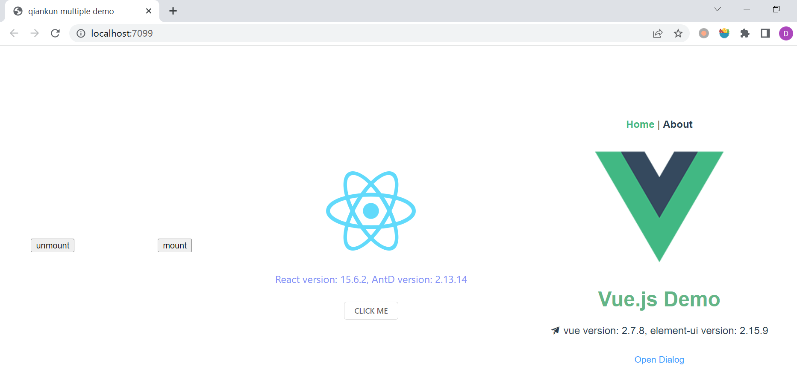
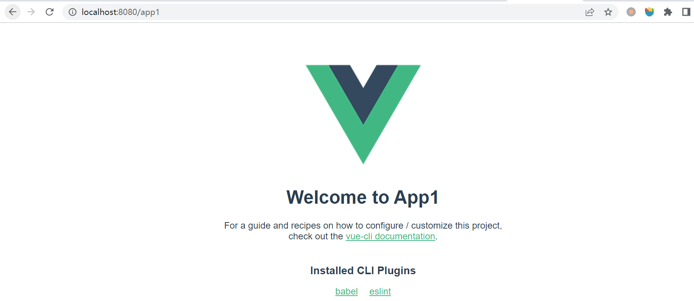

# WEEK017 - 使用 qiankun 开发微前端应用

[微前端（Micro Frontends）](https://micro-frontends.org/) 这个概念是在 2016 年底的时候在 [ThoughtWorks Technology Radar](https://www.thoughtworks.com/radar/techniques/micro-frontends) 上首次提出来的，它将服务端的微服务概念延伸到前端领域。随着应用规模的不断变大，传说中的 SPA（单页面应用）会变得越来越复杂，也越来越难以维护。这样大规模的前端应用一般都是由很多相对独立的功能模块组合而成，且不同的功能模块由不同的团队负责，根据分而治之的思想，于是就有了将这些功能模块拆分成不同前端项目的想法，微前端技术也就此诞生。

[qiankun](https://qiankun.umijs.org/zh) 是阿里开源的一款微前端框架，它的灵感来自于 [single-spa](https://github.com/CanopyTax/single-spa) 项目，号称 **可能是你见过最完善的微前端解决方案**。single-spa 于 2018 年诞生，也是一个用于前端微服务化的解决方案，它实现了路由劫持和应用加载，不过它的缺点是不够灵活，不能动态加载 js 文件，而且没有处理样式隔离，不支持 js 沙箱机制。qiankun 于 2019 年开源，提供了更加开箱即用的 API (single-spa + sandbox + import-html-entry)，它基于 single-spa，具备 js 沙箱、样式隔离、HTML Loader、预加载 等微前端系统所需的能力。qiakun 升级 2.0 后，支持多个微应用的同时加载，有了这个特性，我们基本可以像接入 iframe 一样方便的接入微应用。

## 官方示例

`qiankun` 的源码里提供了大量完整的示例项目，我们先来体验体验这些示例，感受下微前端的魅力。首先，将 `qiankun` 的代码 clone 到本地：

```
$ git clone https://github.com/umijs/qiankun.git
```

`qiankun` 使用 [Yarn](https://yarnpkg.com/) 构建和打包项目，首先安装 Yarn：

```
$ npm install -g yarn
```

然后安装 `qiankun` 框架所依赖的包以及示例项目：

```
$ yarn install
$ yarn examples:install
```

示例项目中包含了各种不同框架的实现，比如 `Vue`、`Vue 3`、`React 15`、`React 16`、`Angular 9` 以及使用 jQuery 实现的纯 HTML 项目，Yarn 会依次安装各个示例项目的依赖包，整个过程会比较长，安装完成之后，使用下面的命令运行示例项目：

```
$ yarn examples:start
```

然后打开浏览器，访问 `http://localhost:7099/`：



或者使用下面的命令运行 `multiple demo`：

```
$ yarn examples:start-multiple
```



## 开发实战

这一节我们将从零开始，使用 `qiankun` 搭建一个简单的微前端项目，这个项目包括一个主应用和两个微应用。这里为了简单起见，两个微应用都是使用 Vue 开发，但是实际上，微前端对微应用的技术栈是不限的，微应用完全可以独立开发。

### 准备主应用

我们直接使用 `vue-cli` 创建一个 Vue 脚手架项目，首先确保已安装 Node.js 环境：

```
$ node -v
v16.14.2

$ npm -v
8.5.0
```

然后安装最新版本的 `vue-cli`：

```
$ npm install -g @vue/cli

$ vue -V
@vue/cli 5.0.8
```

使用 `vue-cli` 创建 demo 项目：

```
$ vue create demo

?  Your connection to the default npm registry seems to be slow.  
   Use https://registry.npmmirror.com for faster installation? Yes

Vue CLI v5.0.8
? Please pick a preset: Default ([Vue 3] babel, eslint)

Vue CLI v5.0.8
✨  Creating project in D:\code\weekly-practice\notes\week017-qiankun-micro-frontends\demo.
⚙️  Installing CLI plugins. This might take a while...

added 849 packages in 36s
🚀  Invoking generators...
📦  Installing additional dependencies...

added 95 packages in 11s
⚓  Running completion hooks...

📄  Generating README.md...

🎉  Successfully created project demo.      
👉  Get started with the following commands:

 $ cd demo
 $ npm run serve
```

使用 `npm run serve` 即可启动项目，启动成功后在浏览器中访问 `http://localhost:8080/`：


### 准备微应用

然后照葫芦画瓢，使用 `vue-cli` 创建 app1 和 app2 项目：

```
vue create app1


Vue CLI v5.0.8
? Please pick a preset: Default ([Vue 3] babel, eslint)
? Pick the package manager to use when installing dependencies: Yarn


Vue CLI v5.0.8
✨  Creating project in D:\code\weekly-practice\notes\week017-qiankun-micro-frontends\app1.
⚙️  Installing CLI plugins. This might take a while...

yarn install v1.22.19
info No lockfile found.
[1/4] Resolving packages...
[2/4] Fetching packages...
[3/4] Linking dependencies...

success Saved lockfile.
Done in 22.33s.
🚀  Invoking generators...
📦  Installing additional dependencies...

yarn install v1.22.19
[1/4] Resolving packages...
[2/4] Fetching packages...
[3/4] Linking dependencies...
[4/4] Building fresh packages...
success Saved lockfile.
Done in 7.88s.
⚓  Running completion hooks...

📄  Generating README.md...

🎉  Successfully created project app1.
👉  Get started with the following commands:

 $ cd app1
 $ yarn serve
```

使用 `vue-cli` 创建的项目默认端口是 8080，为了不和主应用冲突，需要修改 `vue.config.js` 配置文件，将微应用的端口修改为 8081 和 8082：

```
const { defineConfig } = require('@vue/cli-service')
module.exports = defineConfig({
  transpileDependencies: true,
  devServer: {
    port: 8081
  }
})
```

### 改造主应用

一切准备就绪后，接下来我们就开始将主应用改造成微前端架构。首先在主应用安装 `qiankun` 依赖：

```
$ npm i qiankun -S
```

然后在 `main.js` 文件中注册微应用：

```
import { registerMicroApps, start } from 'qiankun';

registerMicroApps([{
  name: 'app1',
  entry: '//localhost:8081',
  container: '#app1',
  activeRule: '/app1'
}, {
  name: 'app2',
  entry: '//localhost:8082',
  container: '#app2',
  activeRule: '/app2'
}]);

start();
```

只需这几行代码，微应用就注册好了。当 url 发生变化时，`qiankun` 会根据 `activeRule` 规则自动匹配相应的微应用，并将其插入到指定的 DOM 容器（`container`）中。我们在 `public/index.html` 里为每个微应用准备一个容器：

```
    <div id="app"></div>
    <div id="app1"></div>
    <div id="app2"></div>
```

### 改造微应用

不过此时主应用还无法加载微应用，我们需要对微应用做两处改造。首先，微应用需要在自己的入口 js (通常就是你配置的 webpack 的 entry js) 导出 `bootstrap`、`mount` 和 `unmount` 三个生命周期钩子，以供主应用在适当的时机调用。打开文件 `main.js`，添加如下代码：

```
let instance = null
function render() {
  instance = createApp(App).mount('#app')
}

if (!window.__POWERED_BY_QIANKUN__) { // 默认独立运行
  render();
}

export async function bootstrap(props) {
  console.log('bootstrap app1', props)
}
export async function mount(props) {
  console.log('mount app1', props)
  render()
}
export async function unmount(props) {
  console.log('unmount app1', props)
  instance.$destroy()
}
```

其中我们可以通过 `window.__POWERED_BY_QIANKUN__` 来区分微应用是自启动的还是由 `qiankun` 加载的，这样可以让微应用在两种模式下都兼容。

其次，我们需要将微应用改为以 `umd` 的方式打包，并注意设置 `'Access-Control-Allow-Origin':'*'` 允许跨域访问：

```
const { defineConfig } = require('@vue/cli-service')
module.exports = defineConfig({
  transpileDependencies: true,
  devServer: {
    port: 8081,
    headers:{
      'Access-Control-Allow-Origin':'*'
    }
  },
  configureWebpack:{
    output:{
      library: `app1`,
      libraryTarget: 'umd'
    }
  }
})
```

### 运行

主应用和微应用都改造完成后，依次运行，然后在浏览器中依次访问，确保每个应用都可独立访问。另外，由于我们在主应用中加载了微应用，使用 `http://localhost:8080/app1` 和 `http://localhost:8080/app2` 应该也可以访问微应用：



## 参考

1. [qiankun 官方文档](https://qiankun.umijs.org/zh)
1. [qiankun 技术圆桌 | 分享一些 qiankun 开发及微前端实践过程中的心得](https://www.yuque.com/kuitos/gky7yw)
1. [万字长文-落地微前端 qiankun 理论与实践指北](https://juejin.cn/post/7069566144750813197)
1. [Micro Frontends | extending the microservice idea to frontend development](https://micro-frontends.org/)
1. [single-spa](https://zh-hans.single-spa.js.org/docs/getting-started-overview)
1. [微前端框架 之 single-spa 从入门到精通](https://mp.weixin.qq.com/s?__biz=MzA3NTk4NjQ1OQ==&mid=2247484245&idx=1&sn=9ee91018578e6189f3b11a4d688228c5&chksm=9f696021a81ee937847c962e3135017fff9ba8fd0b61f782d7245df98582a1410aa000dc5fdc&scene=178&cur_album_id=2251416802327232513#rd)
1. [微前端框架 之 qiankun 从入门到源码分析](https://mp.weixin.qq.com/s?__biz=MzA3NTk4NjQ1OQ==&mid=2247484411&idx=1&sn=7e67d2843b8576fce01b18269f33f7e9&chksm=9f69608fa81ee99954b6b5a1e3eb40e194c05c1edb504baac27577a0217f61c78ff9d0bb7e23&scene=178&cur_album_id=2251416802327232513#rd)
