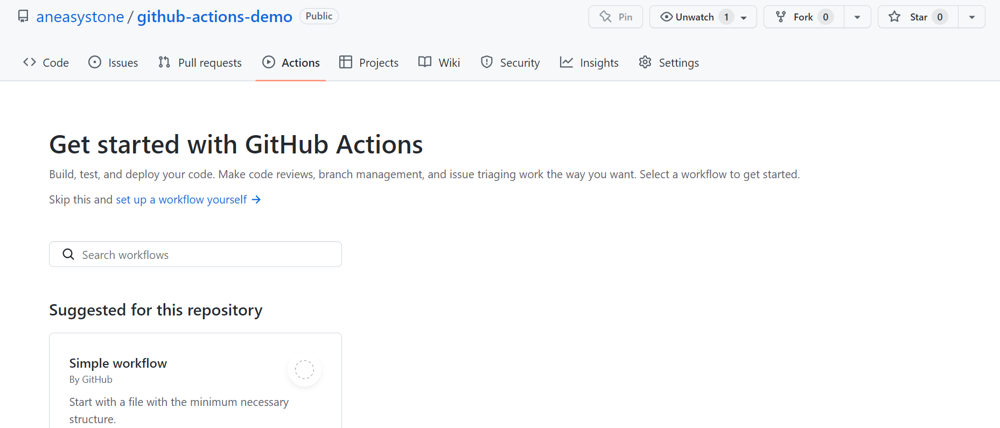
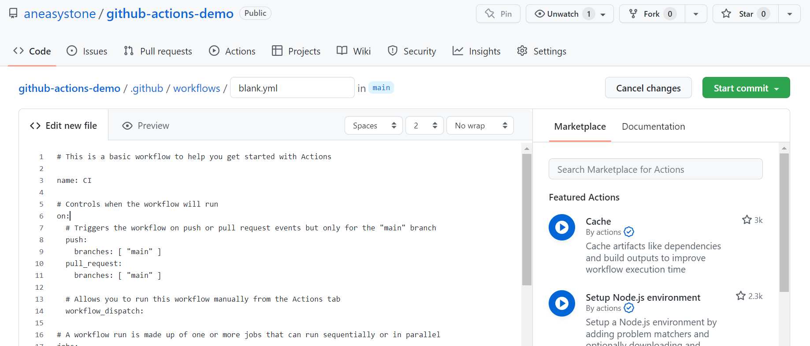
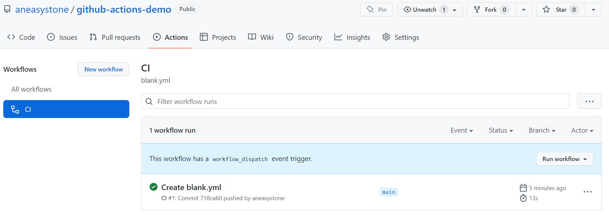
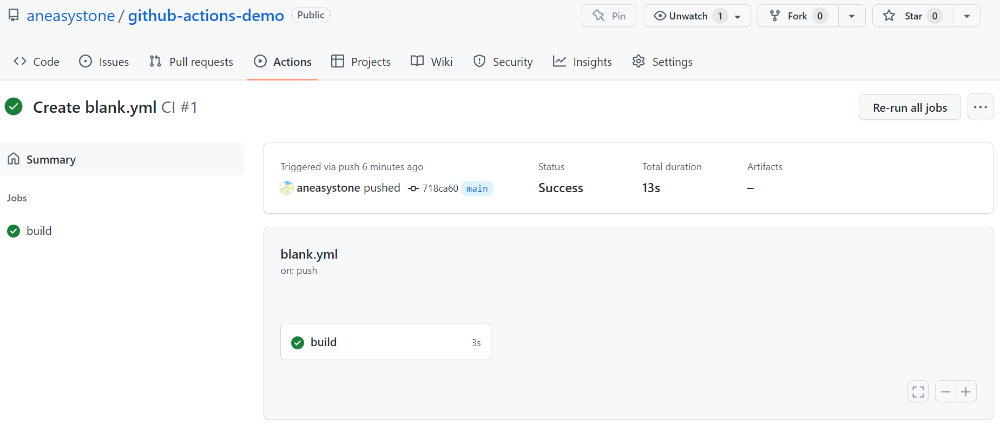
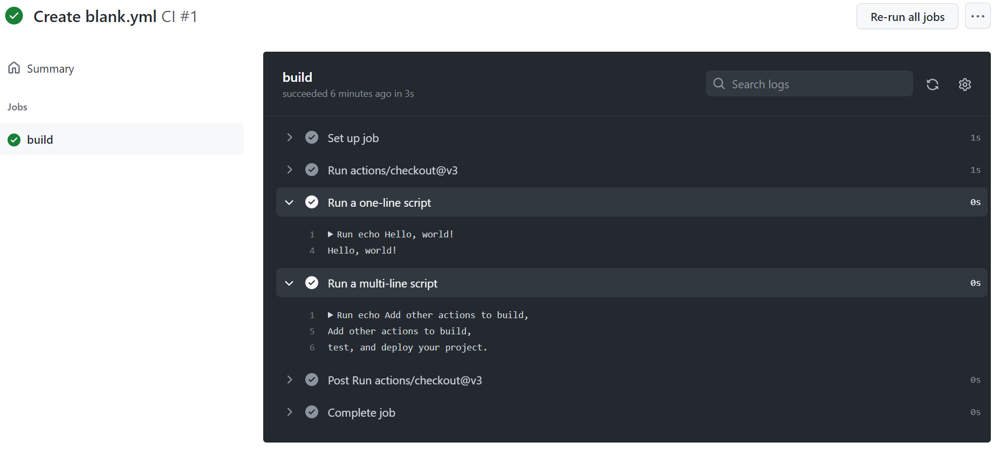

# WEEK018 - 使用 GitHub Actions 跟踪 GitHub 趋势项目

[GitHub Actions](https://docs.github.com/cn/actions) 是 GitHub 于 2018 年 10 月推出的一款 CI/CD 服务。一个标准的 CI/CD 流程通常是一个工作流（`workflow`），工作流中包含了一个或多个任务（`job`），而每个任务都是由多个执行步骤（`step`）组成。

GitHub Actions 的创新之处在于它将 CI/CD 中的每个执行步骤划分成一个个原子的操作（`action`），这些操作可以是编译代码、调用某个接口、执行代码检查或是部署服务等。很显然这些原子操作是可以在不同的 CI/CD 流程中复用的，于是 GitHub 允许开发者将这些操作编写成脚本存在放 GitHub 仓库里，供其他人使用。GitHub 提供了一些 [官方的 actions](https://github.com/actions)，比如 [actions/setup-python](https://github.com/actions/setup-python) 用于初始化 Python 环境，[actions/checkout](https://github.com/actions/checkout) 用于签出某个代码仓库。由于每个 action 都对应一个 GitHub 仓库，所以也可以像下面这样引用 action 的某个分支、某个标签甚至某个提交记录： 

```
actions/setup-node@master  # 指向一个分支
actions/setup-node@v1.0    # 指向一个标签
actions/setup-node@74bc508 # 指向一个 commit
```

你可以在 [GitHub Marketplace](https://github.com/marketplace?type=actions) 中搜索你想使用的 action，另外，还有一份关于 GitHub Actions 的 awesome 清单 [sdras/awesome-actions](https://github.com/sdras/awesome-actions)，也可以找到不少的 action。

## GitHub Actions 入门示例

这一节我们将通过一个最简单的入门示例了解 GitHub Actions 的基本概念。首先我们在 GitHub 上创建一个 demo 项目 [aneasystone/github-actions-demo](https://github.com/aneasystone/github-actions-demo)（也可以直接使用已有的项目），然后打开 Actions 选项卡：



我们可以在这里手工创建工作流（`workflow`），也可以直接使用 GitHub Actions 提供的入门工作流，GitHub Actions 提供的工作流大体分为四种类型：

* Continuous integration - 包含了各种编程语言的编译、打包、测试等流程
* Deployment - 支持将应用部署到各种不同的云平台
* Security - 对仓库进行代码规范检查或安全扫描
* Automation - 一些自动化脚本

这些工作流的源码都可以在 [actions/starter-workflows](https://github.com/actions/starter-workflows) 这里找到。

GitHub 会自动分析代码并显示出可能适用于你的项目的工作流。由于是示例项目，这里我们直接使用一个最简单的工作流来进行测试，选择 Simple workflow 这个工作流，会在 `.github/workflows` 目录下创建一个 `blank.yml` 文件，文件内容如下：

```
# This is a basic workflow to help you get started with Actions

name: CI

# Controls when the workflow will run
on:
  # Triggers the workflow on push or pull request events but only for the "main" branch
  push:
    branches: [ "main" ]
  pull_request:
    branches: [ "main" ]

  # Allows you to run this workflow manually from the Actions tab
  workflow_dispatch:

# A workflow run is made up of one or more jobs that can run sequentially or in parallel
jobs:
  # This workflow contains a single job called "build"
  build:
    # The type of runner that the job will run on
    runs-on: ubuntu-latest

    # Steps represent a sequence of tasks that will be executed as part of the job
    steps:
      # Checks-out your repository under $GITHUB_WORKSPACE, so your job can access it
      - uses: actions/checkout@v3

      # Runs a single command using the runners shell
      - name: Run a one-line script
        run: echo Hello, world!

      # Runs a set of commands using the runners shell
      - name: Run a multi-line script
        run: |
          echo Add other actions to build,
          echo test, and deploy your project.
```

这个工作流没有任何用处，只是使用 `echo` 命令输出一行 `Hello, world!` 以及其他几行日志而已。

然后点击 `Start commit` 按钮提交文件即可：



由于这里我们指定了工作流在 push 的时候触发，所以提交完文件之后，这个工作流应该就开始执行了。重新打开 Actions 选项卡：



这里显示了项目中所有的工作流列表，我们可以在一个项目中创建多个工作流。可以看到我们已经成功创建了一个名为 CI 的工作流，并在右侧显示了该工作流的运行情况。点击查看详细信息：



这里是工作流包含的所有任务（`job`）的执行情况，我们这个示例中只使用了一个名为 build 的任务。然后再点击任务，可以查看任务的执行日志：



## 详解 workflow 文件

https://docs.github.com/cn/actions/learn-github-actions/understanding-github-actions

## 跟踪 GitHub 趋势项目

[bonfy/github-trending](https://github.com/bonfy/github-trending)

## 参考

* [GitHub Actions 文档](https://docs.github.com/cn/actions)
* [GitHub Actions 入门教程](https://www.ruanyifeng.com/blog/2019/09/getting-started-with-github-actions.html)

## 更多

### 其他示例

结合 GitHub Actions 的自动化功能，我们可以做很多有趣的事情。比如官方文档中还提供了 [其他几个示例](https://docs.github.com/cn/actions/examples)，用于检测仓库中失效的链接。

另外，阮一峰在他的 [入门教程](https://www.ruanyifeng.com/blog/2019/09/getting-started-with-github-actions.html) 中介绍了一个示例，用于将 React 应用发布到 GitHub Pages。

### 在本地运行 GitHub Actions

https://github.com/nektos/act
