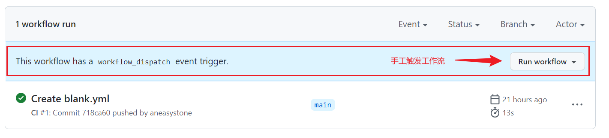

# WEEK018 - 使用 GitHub Actions 跟踪 GitHub 趋势项目

[GitHub Actions](https://docs.github.com/cn/actions) 是 GitHub 于 2018 年 10 月推出的一款 CI/CD 服务。一个标准的 CI/CD 流程通常是一个工作流（`workflow`），工作流中包含了一个或多个作业（`job`），而每个作业都是由多个执行步骤（`step`）组成。

GitHub Actions 的创新之处在于它将 CI/CD 中的每个执行步骤划分成一个个原子的操作（`action`），这些操作可以是编译代码、调用某个接口、执行代码检查或是部署服务等。很显然这些原子操作是可以在不同的 CI/CD 流程中复用的，于是 GitHub 允许开发者将这些操作编写成脚本存在放 GitHub 仓库里，供其他人使用。GitHub 提供了一些 [官方的 actions](https://github.com/actions)，比如 [actions/setup-python](https://github.com/actions/setup-python) 用于初始化 Python 环境，[actions/checkout](https://github.com/actions/checkout) 用于签出某个代码仓库。由于每个 action 都对应一个 GitHub 仓库，所以也可以像下面这样引用 action 的某个分支、某个标签甚至某个提交记录： 

```
actions/setup-node@master  # 指向一个分支
actions/setup-node@v1.0    # 指向一个标签
actions/setup-node@74bc508 # 指向一个 commit
```

你可以在 [GitHub Marketplace](https://github.com/marketplace?type=actions) 中搜索你想使用的 action，另外，还有一份关于 GitHub Actions 的 awesome 清单 [sdras/awesome-actions](https://github.com/sdras/awesome-actions)，也可以找到不少的 action。

## GitHub Actions 入门示例

这一节我们将通过一个最简单的入门示例了解 GitHub Actions 的基本概念。首先我们在 GitHub 上创建一个 demo 项目 [aneasystone/github-actions-demo](https://github.com/aneasystone/github-actions-demo)（也可以直接使用已有的项目），然后打开 Actions 选项卡：


我们可以在这里手工创建工作流（`workflow`），也可以直接使用 GitHub Actions 提供的入门工作流，GitHub Actions 提供的工作流大体分为四种类型：

* Continuous integration - 包含了各种编程语言的编译、打包、测试等流程
* Deployment - 支持将应用部署到各种不同的云平台
* Security - 对仓库进行代码规范检查或安全扫描
* Automation - 一些自动化脚本

这些工作流的源码都可以在 [actions/starter-workflows](https://github.com/actions/starter-workflows) 这里找到。

GitHub 会自动分析代码并显示出可能适用于你的项目的工作流。由于是示例项目，这里我们直接使用一个最简单的工作流来进行测试，选择 Simple workflow 这个工作流，会在 `.github/workflows` 目录下创建一个 `blank.yml` 文件，文件内容如下：

```
# This is a basic workflow to help you get started with Actions

name: CI

# Controls when the workflow will run
on:
  # Triggers the workflow on push or pull request events but only for the "main" branch
  push:
    branches: [ "main" ]
  pull_request:
    branches: [ "main" ]

  # Allows you to run this workflow manually from the Actions tab
  workflow_dispatch:

# A workflow run is made up of one or more jobs that can run sequentially or in parallel
jobs:
  # This workflow contains a single job called "build"
  build:
    # The type of runner that the job will run on
    runs-on: ubuntu-latest

    # Steps represent a sequence of tasks that will be executed as part of the job
    steps:
      # Checks-out your repository under $GITHUB_WORKSPACE, so your job can access it
      - uses: actions/checkout@v3

      # Runs a single command using the runners shell
      - name: Run a one-line script
        run: echo Hello, world!

      # Runs a set of commands using the runners shell
      - name: Run a multi-line script
        run: |
          echo Add other actions to build,
          echo test, and deploy your project.
```

这个工作流没有任何用处，只是使用 `echo` 命令输出一行 `Hello, world!` 以及其他几行日志而已。

然后点击 `Start commit` 按钮提交文件即可：


由于这里我们指定了工作流在 push 的时候触发，所以提交完文件之后，这个工作流应该就开始执行了。重新打开 Actions 选项卡：


这里显示了项目中所有的工作流列表，我们可以在一个项目中创建多个工作流。可以看到我们已经成功创建了一个名为 CI 的工作流，并在右侧显示了该工作流的运行情况。点击查看详细信息：


这里是工作流包含的所有作业（`job`）的执行情况，我们这个示例中只使用了一个名为 build 的作业。然后再点击作业，可以查看作业的执行日志：


## 详解 workflow 文件

在上一节中，我们通过在 `.github/workflows` 目录下新建一个 YAML 文件，创建了一个最简单的 GitHub Actions 工作流。这个 YAML 的文件名可以任意，但文件内容必须符合 [GitHub Actions 的工作流程语法](https://docs.github.com/cn/actions/using-workflows/workflow-syntax-for-github-actions)。下面是一些基本字段的解释。

### `name`

出现在 GitHub 仓库的 Actions 选项卡中的工作流程名称。如果省略该字段，默认为当前 workflow 的文件名。

### `on`

指定此工作流程的触发器。GitHub 支持多种触发事件，您可以配置工作流程在 GitHub 上发生特定活动时运行、在预定的时间运行，或者在 GitHub 外部的事件发生时运行。参见 [官方文档](https://docs.github.com/cn/actions/using-workflows/events-that-trigger-workflows) 了解触发工作流程的所有事件。

在示例项目中，我们使用了几个最常用的触发事件。比如当 `main` 分支有 `push` 或 `pull_request` 时触发：

```
on:
  push:
    branches: [ "main" ]
  pull_request:
    branches: [ "main" ]
```

或者开启手工触发工作流：

```
on:
  workflow_dispatch:
```

这时会在工作流页面出现一个手工执行的按钮：



也可以使用定时任务来触发工作流：

```
on:
  schedule:
    - cron: "0 2 * * *"
```

### `jobs`

一个工作流可以包含一个或多个作业，这些作业可以顺序执行或并发执行。下面定义了一个 ID 为 `build` 的作业：

```
jobs:
  build:
    ...
```

### `jobs.<job-id>.runs-on`

为作业指定运行器（`runner`），运行器可以使用 GitHub 托管的（GitHub-hosted runners），也可以是 [自托管的](https://docs.github.com/cn/actions/hosting-your-own-runners)（self-hosted runners）。GitHub 托管的运行器包括 Windows Server、Ubuntu、macOS 等操作系统，下面的例子将作业配置为在最新版本的 Ubuntu Linux 运行器上运行：

```
runs-on: ubuntu-latest
```

### `jobs.<job-id>.steps`

作业中运行的所有步骤，步骤可以是一个 Shell 脚本，也可以是一个操作（`action`）。在我们的示例中一共包含了三个步骤，第一步使用了一个官方的操作 `actions/checkout@v3`：

```
# Checks-out your repository under $GITHUB_WORKSPACE, so your job can access it
- uses: actions/checkout@v3
```

这个操作将代码仓库签出到运行器上，这样你就可以对代码运行脚本或其他操作，比如编译、测试或构建打包等。

第二步，使用 `echo` 命令输出一句 `Hello, world!`：

```
# Runs a single command using the runners shell
- name: Run a one-line script
  run: echo Hello, world!
```

第三步，继续执行多条 `echo` 命令：

```
# Runs a set of commands using the runners shell
- name: Run a multi-line script
  run: |
    echo Add other actions to build,
    echo test, and deploy your project.
```

## 跟踪 GitHub 趋势项目

学习了 GitHub Actions 的基本知识后，我们就可以开始使用它了。除了常见的 CI/CD 任务，如 [自动构建和测试](https://docs.github.com/cn/actions/automating-builds-and-tests)，[打包和发布](https://docs.github.com/cn/actions/publishing-packages)，[部署](https://docs.github.com/cn/actions/deployment) 等，还可以使用它来做很多有趣的事情。

GitHub 有一个 [Trending](https://github.com/trending) 页面，可以在这里发现 GitHub 上每天、每周或每月最热门的项目，不过这个页面没有归档功能，无法追溯历史。如果我们能用爬虫每天自动爬取这个页面上的内容，并将结果保存下来，那么查阅起来就更方便了。要实现这个功能，必须满足三个条件：

1. 能定时执行：可以使用 `on:schedule` 定时触发 GitHub Actions 工作流；
2. 爬虫脚本：在工作流中可以执行任意的脚本，另外还可以通过 actions 安装各种语言的环境，比如使用 [actions/setup-python](https://github.com/actions/setup-python) 安装 Python 环境，使用 Python 来写爬虫最适合不过；
* 能将结果保存下来：GitHub 仓库天生就是一个数据库，可以用来存储数据，我们可以将爬虫爬下来的数据提交并保存到 GitHub 仓库。

可以看到，使用 GitHub Actions 完全可以实现这个功能，这个想法的灵感来自 [bonfy/github-trending](https://github.com/bonfy/github-trending) 项目，不过我在这个项目的基础上做了一些改进，比如将每天爬取的结果合并在同一个文件里，并且对重复的结果进行去重。

首先我们创建一个仓库 [aneasystone/github-trending](https://github.com/aneasystone/github-trending)，然后和之前的示例项目一样，在 `.github/workflows` 目录下创建一个流水线文件，内容如下：

```
# This workflow will scrap GitHub trending projects daily.

name: Daily Github Trending

on:
  schedule:
    - cron: "0 2 * * *"

jobs:
  build:

    runs-on: ubuntu-latest

    steps:
    - name: Checkout
      uses: actions/checkout@v2
      
    - name: Set up Python 3.8
      uses: actions/setup-python@v2
      with:
        python-version: 3.8
    
    - name: Install dependencies
      run: |
        python -m pip install --upgrade pip
        pip install -r requirements.txt
        
    - name: Run Scraper
      run: |
        python scraper.py
    # Runs a set of commands using the runners shell
    - name: Push to origin master
      run: |
        echo start push
        git config --global user.name "aneasystone"
        git config --global user.email "aneasystone@gmail.com"
        
        git add -A
        git commit -m $(date '+%Y-%m-%d')
        git push
```

在这里我们使用了 `on.schedule.cron: "0 2 * * *"` 来定时触发工作流，这个 cron 表达式需符合 [POSIX cron 语法](https://pubs.opengroup.org/onlinepubs/9699919799/utilities/crontab.html)，可以在 [crontab guru](https://crontab.guru/) 页面上对 cron 表达式进行调试。不过要注意的是，这里的时间为 UTC 时间，所以 `0 2 * * *` 对应的是北京时间 10 点整。

> 注：在实际运行的时候，我发现工作流并不是每天早上 10 点执行，而是到 11 点才执行，起初我以为是定时任务出现了延迟，但是后来我才意识到，现在正好是夏天，大多数北美洲、欧洲以及部分中东地区都在实施 [夏令时](https://zh.wikipedia.org/wiki/%E5%A4%8F%E6%97%B6%E5%88%B6)，所以他们的时间要比我们早一个小时，他们的 10 点就是我们的 11 点。

工作流的各个步骤是比较清晰的，首先通过 `actions/checkout@v2` 签出仓库代码，然后使用 `actions/setup-python@v2` 安装 Python 环境，然后执行 `pip install` 安装 Python 依赖。环境准备就绪后，执行 `python scraper.py`，这就是我们的爬虫脚本，它会将 GitHub Trending 页面的内容爬取下来并更新到 `README.md` 文件中，我们可以根据参数爬取不同编程语言的项目清单：

```
languages = ['', 'java', 'python', 'javascript', 'go', 'c', 'c++', 'c#', 'html', 'css', 'unknown']
for lang in languages:
    results = scrape_lang(lang)
    write_markdown(lang, results)
```

数据爬取成功后，我们在工作流的最后通过 `git commit & git push` 将代码提交到 GitHub 仓库保存下来。你可以在这里 [aneasystone/github-trending](https://github.com/aneasystone/github-trending) 查看完整的代码。

## 参考

* [GitHub Actions 文档](https://docs.github.com/cn/actions)
  * [GitHub Actions 快速入门](https://docs.github.com/cn/actions/quickstart) - 在 5 分钟或更短的时间内尝试 GitHub Actions 的功能。
  * [了解 GitHub Actions](https://docs.github.com/cn/actions/learn-github-actions/understanding-github-actions) - 学习 GitHub Actions 的基础知识，包括核心概念和基本术语。
  * [GitHub Actions 的工作流程语法](https://docs.github.com/cn/actions/using-workflows/workflow-syntax-for-github-actions) - 工作流程是可配置的自动化过程，由一个或多个作业组成。 您必须创建 YAML 文件来定义工作流程配置。
* [GitHub Actions 入门教程](https://www.ruanyifeng.com/blog/2019/09/getting-started-with-github-actions.html) - 阮一峰的网络日志

## 更多

### 其他示例

结合 GitHub Actions 的自动化功能，我们可以做很多有趣的事情。比如官方文档中还提供了 [其他几个示例](https://docs.github.com/cn/actions/examples)，用于检测仓库中失效的链接。

另外，阮一峰在他的 [入门教程](https://www.ruanyifeng.com/blog/2019/09/getting-started-with-github-actions.html) 中介绍了一个示例，用于将 React 应用发布到 GitHub Pages。

### 在本地运行 GitHub Actions

https://github.com/nektos/act
