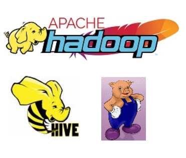
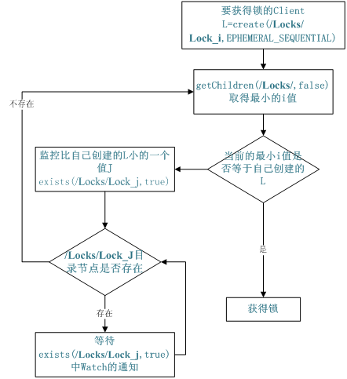
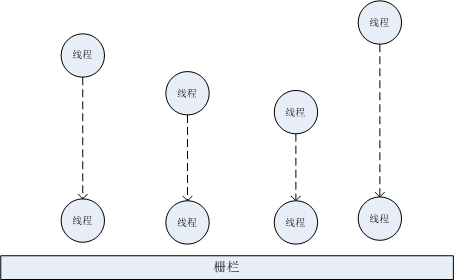

# WEEK019 - ZooKeeper 在不同场景下的使用

[根据官网的介绍](https://zookeeper.apache.org/doc/current/index.html)，**ZooKeeper is a high-performance coordination service for distributed applications**，它是为分布式应用提供的一种高性能协调服务。基于对 ZAB 协议（ZooKeeper Atomic Broadcast，ZooKeeper 原子消息广播协议）的实现，它能够很好地保证分布式环境中数据的一致性。也正是基于这样的特性，使得 ZooKeeper 成为了解决分布式数据一致性问题的利器。利用 ZooKeeper，可以很容易的在分布式环境下实现统一命名服务、配置管理、锁和队列、状态同步、集群管理等功能。

ZooKeeper 由 Apache Hadoop 的子项目发展而来，并且在 2010 年 11 月正式成为了 Apache 的顶级项目。关于 ZooKeeper 的命名很有意思，**动物园管理员**，显然管理着一园的动物，比如：Hadoop（大象）、Hive（蜜蜂）、Pig（小猪）等等。



## 一、ZooKeeper 的安装

ZooKeeper 的安装分单机模式和集群模式两种。单机模式非常简单，直接从 [Apache ZooKeeper™ Releases](https://zookeeper.apache.org/releases.html) 下载最新版本到本地并解压，就可以在 bin 目录下找到 ZooKeeper 的服务端（zkServer）和客户端（zkCli），在 Windows 环境对应 *.cmd 后缀的文件，在 Linux 环境对应 *.sh 后缀的文件。在运行之前，还需要做两步配置：

1. 配置 `JAVA_HOME` 环境变量
1. 修改配置文件，将 `conf/zoo_sample.cfg` 修改为 `conf/zoo.cfg`

准备就绪后，直接运行 zkServer 文件，如果看到下面的显示，就说明 ZooKeeper 服务已经启动好了。

```
2018-08-04 10:06:22,525 [myid:] - INFO  [main:ZooKeeperServer@829] - tickTime set to 2000
2018-08-04 10:06:22,525 [myid:] - INFO  [main:ZooKeeperServer@838] - minSessionTimeout set to -1
2018-08-04 10:06:22,527 [myid:] - INFO  [main:ZooKeeperServer@847] - maxSessionTimeout set to -1
2018-08-04 10:06:23,149 [myid:] - INFO  [main:NIOServerCnxnFactory@89] - binding to port 0.0.0.0/0.0.0.0:2181
```

为了保证服务的稳定和可靠，生产环境大多是部署 ZooKeeper 的集群模式，集群模式和单机模式相比，有两点不同：

1. 配置文件中要指定集群中所有机器的信息，形如：server.id=host:port1:port2
1. dataDir 目录下要配置一个 myid 文件

一个典型的 ZooKeeper 配置文件如下：

```
#常规配置
tickTime=2000
initLimit=10
syncLimit=5
clientPort=2181
dataDir=/zookeeper/data
dataLogDir=/zookeeper/logs
 
# 集群配置
server.1=192.168.0.101:2888:3888
server.2=192.168.0.102:2888:3888
server.3=192.168.0.103:2888:3888
```

关于 ZooKeeper 集群模式的部署和各参数的意思，可以参考 [Clustered (Multi-Server) Setup](https://zookeeper.apache.org/doc/current/zookeeperAdmin.html#sc_zkMulitServerSetup)。

## 二、ZooKeeper 核心概念

在安装好 ZooKeeper 服务之后，我们就可以进行体验了。但是在体验它之前，我们还需要了解相关的几个核心概念，比如它的数据模型，四种不同类型的节点，节点监听等等。

ZooKeeper 的数据模型是一个类似文件系统的树形结构，树的每一个节点叫做 `znode`，它像一个小型文件一样，可以存储少量的数据（一般不多于 1M，这是因为 ZooKeeper 的设计目标并不是传统的数据库，而是用来存储协同数据的），但它并不是一个文件，因为每个节点还可以有多个子节点，看上去又好像是一个文件夹一样。和文件系统一样，ZooKeeper 的根节点名字为 `/`，并使用节点的路径来唯一标识一个节点，比如 `/app1/p_1`。另外，还提供了命令 `get` 和 `set` 来读写节点内容，命令 `ls` 来获取子节点列表，命令 `create` 和 `delete` 来创建和删除节点。但是要注意的是 ZooKeeper 中的路径只有绝对路径，没有相对路径，所以路径 `../data` 是不合法的，也不存在 `cd` 这样的命令。下图是 ZooKeeper 数据模型的示意图（[图片来源](https://zookeeper.apache.org/doc/current/zookeeperOver.html)）：


另外，一共有四种不同类型的节点：

* 持久节点（`PERSISTENT`）：默认的节点类型，节点一旦创建，除非显式的删除，否则一直存在；
* 临时节点（`EPHEMERAL`）：ZooKeeper 的客户端和服务器之间是采用长连接方式进行通信的，并通过心跳来保持连接，这个连接状态称为 `session`，客户端在创建临时节点之后，如果一直保持连接则这个节点有效，一旦连接断开，该节点就会被自动删除；注意，**临时节点不能有子节点**；
* 持久顺序节点（`PERSISTENT_SEQUENTIAL`）：默认情况下，ZooKeeper 是不允许创建同名节点的，如果该节点是顺序节点，ZooKeeper 就会自动在节点路径末尾添加递增的序号；
* 临时顺序节点（`EPHEMERAL_SEQUENTIAL`）：顺序节点，但是只有在客户端连接有效时存在；

准确来说，节点的类型只有持久和临时两种，顺序节点是指在创建节点时可以指定一个顺序标志，让节点名称添加一个递增的序号，但是节点一旦创建好了，它要么是持久的，要么是临时的，只有这两种类型。这几种类型的节点虽然看上去很平常，但是它们正是实现 ZooKeeper 分布式协调服务的关键，如果再加上节点监听的特性，可以说是无所不能。节点监听（`Watch`）可以用于监听节点的变化，包括节点数据的修改或者子节点的增删变化，一旦发生变化，可以立即通知注册该 Watch 的客户端。我们在后面的例子中将会看出这些特性结合在一起的强大威力。譬如我们在执行 `get` 命令查询节点数据时指定一个 Watch，那么当该节点内容发生变动时，就会触发该 Watch，**要注意的是 Watch 只能被触发一次，如果要一直获得该节点数据变动的通知，那么就需要在触发 Watch 时重新指定一个 Watch**。只有节点的读操作（例如：`get`、`ls`、`stat`）可以注册 Watch，写操作（例如：`set`、`create`、`delete`）会触发 Watch 事件。

## 三、使用 ZooKeeper 客户端

接下来我们使用 ZooKeeper 客户端来体验下 ZooKeeper 的基本功能。如果是访问本地环境的 ZooKeeper 服务，直接运行 zkCli 脚本即可。如果是访问远程的 ZooKeeper 服务，则使用 `-server` 参数：

```
$ zkCli.sh -server 192.168.0.101:2181
```

如果成功连接，客户端会出现类似下面的命令提示符：

```
[zk: localhost:2181(CONNECTED) 0] 
```

这时你就可以执行 ZooKeeper 命令了，譬如使用 help 查看可用命令列表：

```
[zk: localhost:2181(CONNECTED) 0] help
ZooKeeper -server host:port cmd args
        stat path [watch]
        set path data [version]
        ls path [watch]
        delquota [-n|-b] path
        ls2 path [watch]
        setAcl path acl
        setquota -n|-b val path
        history
        redo cmdno
        printwatches on|off
        delete path [version]
        sync path
        listquota path
        rmr path
        get path [watch]
        create [-s] [-e] path data acl
        addauth scheme auth
        quit
        getAcl path
        close
        connect host:port
```

从这个列表中，我们可以看到上面提到的几个基本命令：`get`、`set`、`ls`、`create`、`delete` 等。譬如我们通过 `ls` 命令查看根节点 `/` 的子节点：

```
[zk: localhost:2181(CONNECTED) 1] ls /
[zookeeper]
```

通过 `create` 命令创建新节点：

```
[zk: localhost:2181(CONNECTED) 2] create /data Hello
Created /data
[zk: localhost:2181(CONNECTED) 3] get /data
Hello
cZxid = 0xa
ctime = Sat Aug 04 14:03:51 CST 2018
mZxid = 0xa
mtime = Sat Aug 04 14:03:51 CST 2018
pZxid = 0xa
cversion = 0
dataVersion = 0
aclVersion = 0
ephemeralOwner = 0x0
dataLength = 5
numChildren = 0
```

`create` 默认创建的是持久节点，可以指定参数 `-e` 创建临时节点或 `-s` 创建顺序节点。ZooKeeper 的基本命令都很简单，可以参考 [ZooKeeper Commands](https://zookeeper.apache.org/doc/current/zookeeperAdmin.html#sc_zkCommands)。

使用客户端命令行管理 ZooKeeper 节点和数据只是 ZooKeeper 客户端的一种方式，实际上，ZooKeeper 还提供了另一种客户端交互方式，可以直接使用 `telnet` 或 `nc` 向 ZooKeeper 发送命令，用来获取 ZooKeeper 服务当前的状态信息。这些命令都是由四个字母组成，因此又叫做 **四字命令（The Four Letter Words）**。

譬如，下面通过 `ruok`（Are you OK?） 命令查询 ZooKeeper 服务是否正常，ZooKeeper 返回 imok（I’m OK）表示服务状态正常。

```
$ echo ruok | nc localhost 2181
imok
```

四字命令按功能可以划分为四类：

* 服务状态相关：ruok、conf、envi、srvr、stat、srst、isro
* 客户连接相关：dump、cons、crst
* 节点监听相关：wchs、wchc、wchp
* 监控相关：mntr

## 四、ZooKeeper 常见功能实现

如果只是使用命令行对 ZooKeeper 上的数据做些增删改查，还不足以说明 ZooKeeper 有什么特别的，无非就是一个小型的文件系统而已，只有把它用于我们的分布式项目中，才能看出它真正的作用。

### 4.1 第一个 ZooKeeper 应用

我们先从最简单的代码开始，连接 ZooKeeper 并创建一个节点：

```java
public static void main(String[] args) throws Exception {
    ZooKeeper zookeeper = new ZooKeeper("localhost:2181", 5000, null);
    zookeeper.create("/data", "Hello world".getBytes(), ZooDefs.Ids.OPEN_ACL_UNSAFE, CreateMode.PERSISTENT);
    zookeeper.close();
}
```

上面的代码首先创建一个连接，连接超时时间设置为 5 秒，然后创建一个名为 `/data` 的持久节点（PERSISTENT），并写入数据 "Hello World"，最后关闭连接。上面的代码和 `zkCli -server localhost:2181 create /data "Hello world"` 命令是一样的。

实际上，这里的代码虽然简单的不能再简单了，但是却存在着一个 BUG，因为 `new ZooKeeper()` 只是向服务端发起连接，此时连接并没有创建成功，如果在连接创建之前调用了 `zookeeper.create()`，由于超时时间是 5 秒，如果在 5 秒内和服务端的连接还没有创建完成，此时就会抛出 `ConnectionLossException`：

```
Caused by: org.apache.zookeeper.KeeperException$ConnectionLossException: KeeperErrorCode = ConnectionLoss for /data
```

这里正确的做法是使用 ZooKeeper 提供的 Watch 机制。上面在创建连接时 `new ZooKeeper("localhost:2181", 5000, null)`，这里的第三个参数可以指定一个实现 Watcher 接口的对象，Watcher 接口只有一个方法 `void process(WatchedEvent watchedEvent)`，这个方法会在连接创建成功的时候被调用。所以我们可以在 `new ZooKeeper()` 时设置一个 Watcher，然后通过 `CountDownLatch.await()` 阻塞程序执行，直到连接创建成功时，Watcher 的 `process()` 方法调用 `CountDownLatch.countDown()` 才开始执行下面的 `create()` 操作。下面是示例代码：

```java
public class Simple implements Watcher {
    private CountDownLatch connectedSignal = new CountDownLatch(1);
    @Override
    public void process(WatchedEvent watchedEvent) {
        if (watchedEvent.getState() == Watcher.Event.KeeperState.SyncConnected) {
            connectedSignal.countDown();
        }
    }
    public void createNode() throws Exception {
        ZooKeeper zookeeper = new ZooKeeper("localhost:2181", 1000, this);
        connectedSignal.await();
        zookeeper.create("/data", "Hello world".getBytes(), ZooDefs.Ids.OPEN_ACL_UNSAFE, CreateMode.PERSISTENT);
        zookeeper.close();
    }
    public static void main(String[] args) throws Exception {
        Simple simple = new Simple();
        simple.createNode();
    }
}
```

至此，我们可以成功连接 ZooKeeper 并创建节点了，对代码稍加改造就可以实现更多功能，譬如创建子节点，删除节点，修改节点数据等等。有了这些基础，接下来，就让我们来看看 ZooKeeper 可以实现哪些分布式高阶技巧。

### 4.2 统一命名服务（Name Service）

所谓 **命名服务**，就是帮助我们对资源进行统一命名的服务，通常需要有一套完整的命名规则，既能够产生唯一的名称又便于人们识别和记住，通常情况下用树形的名称结构是一个理想的选择，树形的名称结构是一个有层次的目录结构，既对人友好又不会重复。使用命名服务可以更方便的对资源进行定位，比如计算机地址、应用提供的服务地址或者远程对象等。

想象一下 DNS，它就是一种命名服务，可以将域名转换为 IP 地址，这里的域名就是全局唯一的名称，方便人们记忆，而 IP 地址就是该名称对应的资源。再想象一下 JNDI，这也是一种命名服务，JNDI 的全称为 **Java Naming and Directory Interface（Java 命名和目录接口）**，它是 J2EE 中重要的规范之一，标准的 J2EE 容器都提供了对 JNDI 规范的实现，它也是将有层次的目录结构关联到一定资源上。譬如我们在配置数据源时一般会在 JDBC 连接字符串中指定数据库的 IP 、端口、数据库名、用户名和密码等信息，这些信息如果散落在分布式应用的各个地方，不仅会给资源管理带来麻烦，比如当数据库 IP 发生变动时要对各个系统进行修改，而且数据库的用户名密码暴露在外，也存在安全隐患。使用 JNDI 可以方便的解决这两方面的问题。

在 ZooKeeper 中创建的所有节点都具有一个全局唯一的路径，其对应的节点可以保存一定量的信息，这个特性和命名服务不谋而合。所以如果你在分布式应用中需要用到自己的命名服务，使用 ZooKeeper 是个比较合适的选择。

### 4.3 配置管理（Configuration Management）

正如上面所说的数据库配置一样，在应用程序中一般还会用到很多其他的配置，这些配置往往都是写在某个配置文件中，程序在运行时从配置文件中读取。如果程序是单机应用，并且配置文件数量不多，变动也不频繁，这种做法倒没有什么大问题。但是在分布式系统中，每个系统都有大量的配置文件，而且某些配置项是相同的，如果这些配置项发生变动时，让运维人员在每台服务器挨个修改配置文件，这样的维护成本就太高了，不仅麻烦也容易出错。

**配置管理（Configuration Management）** 在分布式系统中很常见，一般也叫做 **发布与订阅**，我们将所有的配置项统一放置在一个集中的地方，所有的系统都从这里获取相应的配置项，如果配置项发生变动，运维人员只需要在一个地方修改，其他系统都可以从这里获取变更。在 ZooKeeper 中可以创建一个节点，比如：`/configuration`，并将配置信息放在这个节点里，在应用启动的时候通过 `getData()` 方法，获取该节点的数据（也就是配置信息），并且在节点上注册一个 Watch，以后每次配置变动时，应用都会实时得到通知，应用程序获取最新数据并更新配置信息即可。

要实现配置的管理，我们首先实现配置数据的发布：

```java
public class ConfigWriter {
    private ZooKeeper zookeeper;
    private String configPath;
    public ConfigWriter(ZooKeeper zookeeper, String configPath) {
        this.zookeeper = zookeeper;
        this.configPath = configPath;
    }
    public void writeConfig(String configData) throws KeeperException, InterruptedException {
        Stat stat = zookeeper.exists(configPath, false);
        if (stat == null) {
            zookeeper.create(configPath, configData.getBytes(), ZooDefs.Ids.OPEN_ACL_UNSAFE, CreateMode.PERSISTENT);
        } else {
            zookeeper.setData(configPath, configData.getBytes(), -1);
        }
    }
    public static void main(String[] args) throws Exception {
        ZooKeeper zookeeper = new ZooKeeper("localhost:2181", 30000, null);
        ConfigWriter writer = new ConfigWriter(zookeeper, "/configuration");
        writer.writeConfig("Hello");
        zookeeper.close();
    }
}
```

先通过 `exists()` 方法判断 `/configuration` 节点是否存在，如果不存在，就使用 `create()` 方法创建一个并写入配置数据，如果已经存在，直接修改该节点的数据即可。每次配置变更时，我们就调用一次 `updateConfig(zk, "/configuration", configData)` 方法。然后我们再实现配置数据的订阅：

```java
public class ConfigReader implements Watcher {
    private ZooKeeper zookeeper;
    private String configPath;
    public ConfigReader(ZooKeeper zookeeper, String configPath) {
        this.zookeeper = zookeeper;
        this.configPath = configPath;
    }
    @Override
    public void process(WatchedEvent watchedEvent) {
        if (watchedEvent.getType() == Watcher.Event.EventType.NodeDataChanged) {
            readConfig();
        }
    }
    public void readConfig() {
        try {
            byte[] data = zookeeper.getData(configPath, this, null/*stat*/);
            System.out.println(new String(data));
        } catch (Exception e) {
            e.printStackTrace();
        }
    }
    public static void main(String[] args) throws Exception {
        ZooKeeper zookeeper = new ZooKeeper("localhost:2181", 30000, null);
        ConfigReader reader = new ConfigReader(zookeeper, "/configuration");
        reader.readConfig();
        Thread.sleep(Long.MAX_VALUE);
    }
}
```

和上面的创建 ZooKeeper 连接一样，我们的 `ConfigReader` 类实现了 Watcher 接口，并在调用 `getData()` 方法获取配置数据时注册这个 Watch，这样可以在节点数据发生变动时得到通知，得到通知之后，我们重新获取配置数据，并重新注册 Watch。

### 4.4 集群管理（Group Membership）

在分布式系统中，我们常常需要将多台服务器组成一个集群，这时，我们就需要对这个集群中的服务器进行管理，譬如：我们需要知道当前集群中有多少台服务器，当集群中某台服务器下线时需要及时知道，能方便的向集群中添加服务器。利用 Zookeeper 可以很容易的实现集群管理的功能，实现方法很简单，首先我们创建一个目录节点 `/groups`，用于管理所有集群中的服务器，然后每个服务器在启动时在 `/groups` 节点下创建一个 EPHEMERAL 类型的子节点，譬如 `/member-1`、`member-2` 等，并在父节点 `/groups` 上调用 `getChildren()` 方法并设置 Watch，这个 Watch 会在 `/groups` 节点的子节点发生变化（增加或删除）时触发通知，由于每个服务器创建的子节点是 EPHEMERAL 类型的，当创建它的服务器下线时，这个子节点也会随之被删除，从而触发 Watch 通知，这样其它的所有服务器就知道集群中少了一台服务器，可以使用 `getChildren()` 方法获取集群的最新服务器列表，并重新注册 Watch。

我们实现一个最简单的集群管理程序：

```java
public class GroupMember implements Watcher {
    private ZooKeeper zookeeper;
    private String groupPath;
    public GroupMember(ZooKeeper zookeeper, String groupPath) {
        this.zookeeper = zookeeper;
        this.groupPath = groupPath;
    }
    @Override
    public void process(WatchedEvent watchedEvent) {
        if (watchedEvent.getType() == Event.EventType.NodeChildrenChanged) {
            this.list();
        }
    }
    public void list() {
        try {
            List<String> members = zookeeper.getChildren(this.groupPath, this);
            System.out.println("Members: " + String.join(",", members));
        } catch (Exception e) {
            e.printStackTrace();
        }
    }
    public void join(String memberName) {
        try {
            String path = zookeeper.create(
                    this.groupPath + "/" + memberName, null, ZooDefs.Ids.OPEN_ACL_UNSAFE, CreateMode.EPHEMERAL);
            System.out.println("Created: " + path);
        } catch (Exception e) {
            e.printStackTrace();
        }
    }
    public static void main(String[] args) throws Exception {
        ZooKeeper zookeeper = new ZooKeeper("localhost:2181", 30000, null);
        GroupMember member = new GroupMember(zookeeper, "/groups");
        member.join("member-" + new Random().nextInt(1000));
        member.list();
        Thread.sleep(Long.MAX_VALUE);
    }
}
```

程序启动时首先加入 `/groups` 集群，加入集群的方法是在 `/groups` 节点下创建一个 `CreateMode.EPHEMERAL` 类型的子节点。然后再获取该集群中的成员列表，同时我们注册了一个 Watch。我们每启动一个 `GroupMember` 实例，都会在 `/groups` 集群中添加一个成员，这将触发一个 `NodeChildrenChanged` 类型的事件，我们在 `list()` 方法中重新获取成员列表并注册 Watch。这样不仅可以监测到集群中有新成员加入，而且也可以对集群中成员的下线做监控。这里有一点要注意的是，当集群中有新成员加入时，Watch 可以及时通知，但有成员下线时，并不会及时通知，因为我们这里 `new ZooKeeper()` 时指定了连接的超时时间是 30 秒，ZooKeeper 只有在 30 秒超时之后才会触发 Watch 通知。

### 4.5 集群选主（Leader Election）

在上面的集群管理一节，我们看到了可以使用 EPHEMERAL 类型的节点，对集群中的成员进行管理和监控，其实集群管理除了成员的管理和监控功能之外，还有另一个功能，那就是：**集群选主（Leader Election）**，也叫做 Leader 选举或 Master 选举。这个功能在分布式系统中往往很有用，比如，应用程序部署在不同的服务器上，它们都运行着相同的业务，如果我们希望某个业务逻辑只在集群中的某一台服务器上运行，就需要选择一台服务器出来作为主服务器。一般情况下，在一个集群中只有一台主服务器（Master 或 Leader），其他的都是从服务器（Slave 或 Follower）。我们刚刚已经在目录节点 `/groups` 下创建出一堆的成员节点 `/member-1`、`member-2` 了，那么怎么知道哪个节点才是 Master 呢？

实现方法很简单，和前面一样，我们还是为每个集群成员创建一个 EPHEMERAL 节点，不同的是，它还是一个 SEQUENTIAL 节点，这样我们就可以给每个成员编号，然后选择编号最小的成员作为主服务器。这样做的好处是，如果主服务器下线，这个编号的节点也会被删除，然后通知集群中所有的成员，这些成员中又会出现一个编号是最小的，继而被选择当作新的主服务器。

我们把集群管理的代码稍微改造一下，就可以实现集群选主的功能：

```java
    public void list() {
        try {
            List<String> members = zookeeper.getChildren(this.groupPath, this);
            System.out.println("Members: " + String.join(",", members));
            members.sort(Comparator.naturalOrder());
            if (this.currentNode.equals(this.groupPath + "/" + members.get(0))) {
                System.out.println("I'm the master");
            }
        } catch (Exception e) {
            e.printStackTrace();
        }
    }
    public void join(String memberName) {
        try {
            this.currentNode = zookeeper.create(
                    this.groupPath + "/" + memberName, null, ZooDefs.Ids.OPEN_ACL_UNSAFE, CreateMode.EPHEMERAL_SEQUENTIAL);
            System.out.println("Created: " + this.currentNode);
        } catch (Exception e) {
            e.printStackTrace();
        }
    }
```

我们在创建节点时，选择 `CreateMode.EPHEMERAL_SEQUENTIAL` 模式，并将创建的节点名称保存下来。使用 `getChildren()` 方法获取集群成员列表时，按序号排序，取序号最小的一个成员，如果和自己的节点名称一样，则可以认为自己就是主服务器。

上面介绍的这个方法可以动态的选出集群中的主服务器，所以又叫 **动态选主**，实际上，还有一种 **静态选主** 的方法，这个方法利用了 ZooKeeper 节点的全局唯一性，如果多个服务器同时创建 `/master` 节点，最终一定只有一个服务器创建成功，利用这个特性，谁创建成功，谁就是主服务器。这种方法非常简单粗暴，如果对可靠性要求不高，不需要考虑主服务器下线问题，可以考虑采用这种方法。

### 4.6 分布式锁（Locks）

在单个应用中，锁可以防止多个线程同时访问同一个资源，常用的编程语言都提供了锁机制很容易实现，但是在分布式系统中，要防止多个服务器同时访问同一个资源，就不好实现了。不过在上一节中，我们刚刚介绍了如何使用 ZooKeeper 来做集群选主，可以在多个服务器中选择一个服务器作为主服务器，这和分布式锁要求的多个服务器中只有一个服务器可以访问资源的概念是完全一样的。

我们介绍了两种集群选主的方法，刚好对应锁服务的两种类型：静态选主方法是让所有的服务器同时创建一个相同的节点 `lock`，最终只有一个服务器创建成功，那么创建成功的这个服务器就相当于获取了一个独占锁。动态选主方法是在某个目录节点 `locks` 下创建 EPHEMERAL_SEQUENTIAL 类型的子节点，譬如，`lock-1`、`lock-2` 等，然后调用 `getChildren()` 方法获取子节点列表，将这些子节点按序号排序，编号最小的即获得锁，同时监听目录节点变化；释放锁就是将该子节点删除即可，那么其他所有服务器都会收到通知，每个服务器检查自己创建的节点是不是序号最小的，序号最小的服务器再次获取锁，依次反复。

我们假设有 100 台服务器试图获取锁，这些服务器都会在目录节点 `locks` 上监听变化，每次锁的释放和获取，也就是子节点的删除和新增，都会触发节点监听，所有的服务器都会得到通知，但是节点新增并不会发生锁变化，节点删除也只有序号最小的那个节点可以获取锁，其他节点都不会发生锁变化，像这种有大量的服务器得到通知而只有很小的一部分服务器对通知做出响应的现象，有时候又被称为 **羊群效应（Herd Effect）**，这无疑对 ZooKeeper 服务器造成了很大的压力。

为了解决这个问题，我们可以不用关注 `locks` 目录节点下的子节点变化（删除和新增），也就是说不使用 `getChildren()` 方法注册节点监听，而是只关注比自己节点小的那个节点的变化，我们通过使用 `exists()` 方法注册节点监听，这里有一副流程图说明了整个加锁的过程：



下面是关键代码：

```java
    public void lock() {
        try {
            String currentNode = zookeeper.create(
                    this.lockPath + "/lock-", null, ZooDefs.Ids.OPEN_ACL_UNSAFE, CreateMode.EPHEMERAL_SEQUENTIAL);
            List<String> members = zookeeper.getChildren(this.lockPath, false);
            members.sort(Comparator.naturalOrder());

            // 当前节点序号最小，成功获取锁
            String lowestNode = this.lockPath + "/" + members.get(0);
            if (currentNode.equals(lowestNode)) {
                return;
            }

            // 取序号比自己稍小一点的节点，对该节点注册监听，当该节点删除时获取锁
            String lowerNode = null;
            for (int i = 1; i < members.size(); i++) {
                String node = this.lockPath + "/" + members.get(i);
                if (currentNode.equals(node)) {
                    lowerNode = this.lockPath + "/" + members.get(i-1);
                    break;
                }
            }
            if (lowerNode != null && zookeeper.exists(lowerNode, this) != null) {
                latch.await();
            }
        } catch (Exception e) {
            e.printStackTrace();
        }
    }
```

### 4.7 栅栏和双栅栏（Barrier & Double Barrier）

**栅栏（Barrier）** 是用于阻塞一组线程执行的一种同步机制，只有当这组线程全部都准备就绪时，才开始继续执行，就好像赛马比赛，先要等所有的赛马都来到起跑线前准备就绪，然后才能开始比赛。如下图所示：



双栅栏的意思不言而喻，就是两道栅栏，第一道栅栏用于同步一组线程的开始动作，让一组线程同时开始，第二道栅栏用于同步一组线程的结束动作，让它们同时结束，这就好像在赛马比赛中，要等所有的赛马都跑到终点比赛才真正结束一样。

使用 ZooKeeper 实现栅栏很简单，和上面的集群选主和分布式锁类似，都是先创建一个目录节点 `/barrier`，然后每个线程挨个在这个节点下创建 EPHEMERAL_SEQUENTIAL 类型的子节点，譬如 `node-1`，`node-2` 等，表示这个线程已经准备就绪，然后调用 `getChildren()` 方法获取子节点的个数，并设置节点监听，如果节点个数大于等于所有的线程个数，则表明所有的线程都已经准备就绪，然后开始执行后续逻辑。Barrier 的实现可以参考 [Programming with ZooKeeper - A basic tutorial](https://zookeeper.apache.org/doc/current/zookeeperTutorial.html)。

实际上这个算法还可以优化，使用 `getChildren()` 监听节点存在上文提到的羊群效应（Herd Effect）问题，我们可以在创建子节点时，根据子节点个数是否达到所有线程个数，来单独创建一个节点，譬如 `/barrier/enter`，表示所有线程都准备就绪，没达到的话就调用 `exists()` 方法监听 `/barrier/enter` 节点。这样只有在 `/barrier/enter` 节点创建时才需要通知所有线程，而不需要每加入一个节点都通知一次。双栅栏的算法可以采用同样的方法增加一个 `/barrier/leave` 节点来实现。

### 4.8 队列（Queue）

队列是一种满足 FIFO 规则的数据结构，在分布式应用中，队列经常用于实现生产者和消费者模型。使用 ZooKeeper 实现队列的思路是这样的：首先创建目录节点 `/queue`，然后生产者线程往该节点下写入 SEQUENTIAL 类型的子节点，比如 `node-1`、`node-2` 等，由于是顺序节点，ZooKeeper 可以保证创建的子节点是按顺序递增的。消费者线程则是一直通过 `getChildren()` 方法读取 `/queue` 节点的子节点，取序号最小的节点（也就是最先入队的节点）进行消费。这里我们要注意的是，消费者首先需要调用 `delete()` 删除该节点，如果有多个线程同时删除该节点，ZooKeeper 的一致性可以保证只会有一个线程删除成功，删除成功的线程才可以消费该节点，而删除失败的线程通过 `getChildren()` 的节点监听继续等待队列中新元素。

## 总结

通过这篇文章我们学习了 ZooKeeper 的基本知识，可以使用命令行对 ZooKeeper 进行管理和监控，并实现了 ZooKeeper 一些常见的功能。实际上 ZooKeeper 提供的机制非常灵活，除了本文介绍的几种常用应用场景，ZooKeeper 能实现的功能还有很多，可以参考 [ZooKeeper Recipes and Solutions](https://zookeeper.apache.org/doc/current/recipes.html) 和 [Apache Curator Recipes](https://curator.apache.org/curator-recipes/index.html)。

本文介绍的 ZooKeeper 功能都是基于官方提供的原生 API `org.apache.zookeeper` 来实现的，但是原生的 API 有一个问题，就是太底层了，不方便使用，而且很容易出错。因此 Netflix 的 Jordan Zimmerman 开发了 Curator 项目，并在 [GitHub](https://github.com/apache/curator) 上采用 Apache 2.0 协议开源了。在生产环境推荐直接使用 Curator 而不是原生的 API，可以大大简化 ZooKeeper 的开发流程，可以参考 [Apache Curator Getting Started](https://curator.apache.org/getting-started.html)。

本文偏重 ZooKeeper 的实践，通过本文的学习，对工作中遇到的常见场景应该基本能应付了。不过这篇文章缺少对其原理的深入分析，比如 ZooKeeper 的一致性是如何保证的，ZAB 协议和 Paxos 协议，恢复模式（选主）和广播模式（同步）是如何工作的等等，这些后面还需要继续学习。

## 参考

1. [Apache ZooKeeper documentation](https://zookeeper.apache.org/)
1. [ZooKeeper: Because Coordinating Distributed Systems is a Zoo](https://zookeeper.apache.org/doc/current/index.html)
1. [Programming with ZooKeeper - A basic tutorial](https://zookeeper.apache.org/doc/current/zookeeperTutorial.html)
1. [ZooKeeper Recipes and Solutions](https://zookeeper.apache.org/doc/current/recipes.html)
1. [ZooKeeper介绍及典型使用场景](https://blog.csdn.net/liuxinghao/article/details/42747625)
1. [关于命名服务的知识点都在这里了](http://www.hollischuang.com/archives/1595)
