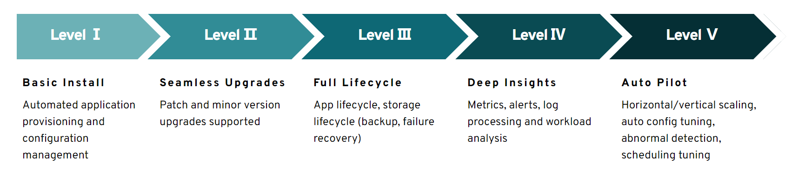

# WEEK020 - 写一个简单的 Kubernetes Operator

[Kubernetes Operator](https://kubernetes.io/docs/concepts/extend-kubernetes/operator/) 这一概念是由 CoreOS 的工程师于 2016 年提出的，它是一种通过 [自定义资源](https://kubernetes.io/docs/concepts/extend-kubernetes/api-extension/custom-resources/)（`custom resource`、`CR`）来包装、运行和管理 Kubernetes 应用的方式。Kubernetes 1.7 版本以来就引入了自定义资源的概念，该功能可以让开发人员扩展新功能或更新现有功能，并且可以自动执行一些管理任务，这些自定义资源就像 Kubernetes 的原生组件一样。

通过自定义资源，我们可以将应用抽象为一个整体，而不用去关心该应用是由哪些 Kubernetes 原生组件构成的，什么 Pods、Deployments、Services 或 ConfigMaps 统统交给 Operator 来管理。创建 Operator 的关键是自定义资源的设计，通过直接调用 Kubernetes API，编写自定义规则自动管理和维护 Kubernetes 集群中的应用，包括自动化安装、配置、更新、故障转移、备份恢复等等。这样的应用也被称为 Kubernetes 原生应用（`Kubernetes-native application`）。Operator 可以帮我们实现下面这些功能：



这个图也被称为 [Operator 的能力模型](https://operatorframework.io/operator-capabilities/)，将 Operator 的能力由低到高分成了 5 个等级。

## 控制器循环

Kubernetes Operator 遵循 [control loop](https://kubernetes.io/docs/concepts/architecture/controller/) 原则，这是 Kubernetes 的核心原则之一，也是机器人和自动化领域中一种常见的持续运行动态系统的机制。它依赖于一种快速调整工作负载需求的能力，进而能够尽可能准确地适应现有资源。


在 Kubernetes 中，这个循环被称为 `reconciliation loop`。在这个循环中，有一个非常重要的角色：`控制器`（Controller），它可以对集群的变化做出响应，并执行相应的动作。控制器首先观察 Kubernetes 对象的当前状态，然后通过 Kubernetes API 进行持续调整，直到将对象的当前状态变成所需状态为止。

第一个 Kubernetes Controller 是 `kube-controller-manager`，它被认为是所有 Operator 的鼻祖。

## 使用 `Operator Framework` 开发 Operator

[Operator Framework](https://operatorframework.io/) 是 CoreOS 开源的一个用于快速开发或管理 Operator 的工具包，主要分为三大部分：

* [Operator SDK](https://sdk.operatorframework.io/)：`Build, test, iterate.` 你无需了解复杂的 Kubernetes API 特性，就可以根据你自己的专业知识构建一个 Operator 应用。
* [Operator Lifecycle Manager](https://olm.operatorframework.io/)：`install, manage, update.` OLM 是一款帮助你安装、更新和管理 Kubernetes Operator 的工具。
* [OperatorHub.io](http://operatorhub.io/)：`Publish & share.` OperatorHub 是一个类似 DockerHub 的仓库，你可以在这里搜索你想要的 Operator，或者将你的 Operator 发布并分享给其他人。

通过 Operator SDK 我们可以快速开发一个 Kubernetes Operator，它不仅提供了一套 High level API 来方便我们处理业务逻辑，还提供了一个命令行工具用于快速生成一个 Operator 的脚手架项目。

### 安装 `operator-sdk`

在开发 Operator 之前，先确保你已经有一个能访问的 Kubernetes 集群环境，Kubernetes 的安装可以参考 [week010-install-kubernetes](../week010-install-kubernetes/README.md)。查看 Kubernetes 集群信息：

```
$ kubectl cluster-info
Kubernetes control plane is running at https://kubernetes.docker.internal:6443
CoreDNS is running at https://kubernetes.docker.internal:6443/api/v1/namespaces/kube-system/services/kube-dns:dns/proxy

To further debug and diagnose cluster problems, use 'kubectl cluster-info dump'.
```

另外，Go 的开发环境也是必不可少的，可以参考 Go 的 [官方文档](https://go.dev/doc/install) 下载并安装。

```
$ curl -LO https://go.dev/dl/go1.19.linux-amd64.tar.gz
$ sudo tar -C /usr/local -xzf go1.19.linux-amd64.tar.gz
```

将路径 `/usr/local/go/bin` 添加到 `PATH` 环境变量，或者将下面这行添加到 ` ~/.profile` 文件中：

```
$ export PATH=$PATH:/usr/local/go/bin
```

查看 Go 版本：

```
$ go version
go version go1.19 linux/amd64
```

接下来，我们继续安装 Operator SDK。我们在 Operator SDK 的 [Releases 页面](https://github.com/operator-framework/operator-sdk/releases) 找到合适的版本并下载：

```
$ curl -LO https://github.com/operator-framework/operator-sdk/releases/download/v1.23.0/operator-sdk_linux_amd64
```

将其移动到 `/usr/local/bin/` 目录即可完成安装：

```
$ chmod +x operator-sdk_linux_amd64 && sudo mv operator-sdk_linux_amd64 /usr/local/bin/operator-sdk
```

查看已安装的 `operator-sdk` 版本：

```
$ operator-sdk version
operator-sdk version: "v1.23.0", commit: "1eaeb5adb56be05fe8cc6dd70517e441696846a4", kubernetes version: "1.24.2", go version: "go1.18.5", GOOS: "linux", GOARCH: "amd64"
```

另外，`operator-sdk` 依赖于 `make` 和 `gcc`，确保系统上已经安装了 `make` 和 `gcc` 工具。

### 使用 `operator-sdk` 初始化 Operator 项目

Operator SDK 提供了三种方式开发 Operator：

* [Ansible](https://sdk.operatorframework.io/docs/building-operators/ansible/quickstart/)
* [Helm](https://sdk.operatorframework.io/docs/building-operators/helm/quickstart/)
* [Go](https://sdk.operatorframework.io/docs/building-operators/golang/quickstart/)

我们这里将使用 Go 来开发 Operator，这种方式也是最灵活的，你可以使用 client-go 调用 Kubernetes API 来对 Kubernetes 对象进行操作。首先使用 `operator-sdk init` 初始化项目结构：

```
$ operator-sdk init --domain example.com --project-name memcached-operator --repo github.com/example/memcached-operator
Writing kustomize manifests for you to edit...
Writing scaffold for you to edit...
Get controller runtime:
$ go get sigs.k8s.io/controller-runtime@v0.12.2
Update dependencies:
$ go mod tidy
Next: define a resource with:
$ operator-sdk create api
```

其中 `--project-name` 参数可以省略，默认项目名称就是目录名。`--domain` 和 `--project-name` 两个参数用于组成 Operator 的镜像名称 `example.com/memcached-operator`，而 `--repo` 参数用于定义 Go 模块名：

```
module github.com/example/memcached-operator
```

初始化后的完整项目结构如下：

```
$ tree .
.
├── Dockerfile
├── Makefile
├── PROJECT
├── README.md
├── config
│   ├── default
│   │   ├── kustomization.yaml
│   │   ├── manager_auth_proxy_patch.yaml
│   │   └── manager_config_patch.yaml
│   ├── manager
│   │   ├── controller_manager_config.yaml
│   │   ├── kustomization.yaml
│   │   └── manager.yaml
│   ├── manifests
│   │   └── kustomization.yaml
│   ├── prometheus
│   │   ├── kustomization.yaml
│   │   └── monitor.yaml
│   ├── rbac
│   │   ├── auth_proxy_client_clusterrole.yaml
│   │   ├── auth_proxy_role.yaml
│   │   ├── auth_proxy_role_binding.yaml
│   │   ├── auth_proxy_service.yaml
│   │   ├── kustomization.yaml
│   │   ├── leader_election_role.yaml
│   │   ├── leader_election_role_binding.yaml
│   │   ├── role_binding.yaml
│   │   └── service_account.yaml
│   └── scorecard
│       ├── bases
│       │   └── config.yaml
│       ├── kustomization.yaml
│       └── patches
│           ├── basic.config.yaml
│           └── olm.config.yaml
├── go.mod
├── go.sum
├── hack
│   └── boilerplate.go.txt
└── main.go
```

主要包括以下几个文件：

* `go.mod` - 用于定义 Go 项目的依赖信息
* `PROJECT` - 用于保存项目的配置信息
* `Makefile` - 包含一些有用的项目构建目标（*make targets*）
* `config` - 该目录下包含一些用于项目部署的 YAML 文件
* `main.go` - Operator 的主程序入口

### 创建 API

初始化项目之后，接着就可以使用 `operator-sdk create api` 命令创建 API 了：

```
$ operator-sdk create api --group cache --version v1alpha1 --kind Memcached --resource --controller
Writing kustomize manifests for you to edit...
Writing scaffold for you to edit...
api/v1alpha1/memcached_types.go
controllers/memcached_controller.go
Update dependencies:
$ go mod tidy
Running make:
$ make generate
./memcached-operator/bin/controller-gen object:headerFile="hack/boilerplate.go.txt" paths="./..."
Next: implement your new API and generate the manifests (e.g. CRDs,CRs) with:
$ make manifests
```

使用 `operator-sdk create` 命令可以生成 `api` 或 `webhook` 的脚手架代码，我们这里生成的是 `api`，包括两部分内容：自定义资源（`--resource`）和控制器相关的逻辑代码（`--controller`），其中 `--group`、`--version` 和 `--kind` 分别用来设置资源的分组、版本和类型。

接下来可以从这些文件开始入手：

* api/v1beta1/memcached_types.go
* controllers/memcached_controller.go
* controllers/suite_test.go

`memcached_types.go` 文件用于定义资源的接口规范，我们在 `MemcachedSpec` 中添加一个新字段 `Size` 如下（默认已经生成了一个 `Foo` 字段）：

```
// MemcachedSpec defines the desired state of Memcached
type MemcachedSpec struct {
	// INSERT ADDITIONAL SPEC FIELDS - desired state of cluster
	// Important: Run "make" to regenerate code after modifying this file

	// Foo is an example field of Memcached. Edit memcached_types.go to remove/update
	Foo string `json:"foo,omitempty"`
	Size int32 `json:"size"`
}
```

接着打开 `memcached_controller.go` 文件，其中 `Reconcile` 方法就是上面所介绍的 `reconciliation loop` 的核心代码，可以在这里实现自己的业务逻辑，比如调用 Kubernetes API 创建、删除或更新各种 Kubernetes 资源。我们这里只是简单地将资源的属性值打印出来：

```
func (r *MemcachedReconciler) Reconcile(ctx context.Context, req ctrl.Request) (ctrl.Result, error) {
	_ = log.FromContext(ctx)

	instance := &cachev1alpha1.Memcached{}
	err := r.Get(context.TODO(), req.NamespacedName, instance)
	if err != nil {
		fmt.Println("Get instance err")
		return ctrl.Result{}, err
	}

	fmt.Printf("Foo = %s, Size = %d\n", instance.Spec.Foo, instance.Spec.Size)

	return ctrl.Result{}, nil
}
```

然后执行下面的命令生成自定义资源文件：

```
$ make manifests
test -s ./memcached-operator/bin/controller-gen || GOBIN=./memcached-operator/bin go install sigs.k8s.io/controller-tools/cmd/controller-gen@v0.9.2
./memcached-operator/bin/controller-gen rbac:roleName=manager-role crd webhook paths="./..." output:crd:artifacts:config=config/crd/bases
```

生成的自定义资源文件位于 `config/crd/bases/cache.example.com_memcacheds.yaml`，文件内容如下：

```
---
apiVersion: apiextensions.k8s.io/v1
kind: CustomResourceDefinition
metadata:
  annotations:
    controller-gen.kubebuilder.io/version: v0.9.2
  creationTimestamp: null
  name: memcacheds.cache.example.com
spec:
  group: cache.example.com
  names:
    kind: Memcached
    listKind: MemcachedList
    plural: memcacheds
    singular: memcached
  scope: Namespaced
  versions:
  - name: v1alpha1
    schema:
      openAPIV3Schema:
        description: Memcached is the Schema for the memcacheds API
        properties:
          apiVersion:
            description: 'APIVersion defines the versioned schema of this representation
              of an object. Servers should convert recognized schemas to the latest
              internal value, and may reject unrecognized values. More info: https://git.k8s.io/community/contributors/devel/sig-architecture/api-conventions.md#resources'
            type: string
          kind:
            description: 'Kind is a string value representing the REST resource this
              object represents. Servers may infer this from the endpoint the client
              submits requests to. Cannot be updated. In CamelCase. More info: https://git.k8s.io/community/contributors/devel/sig-architecture/api-conventions.md#types-kinds'
            type: string
          metadata:
            type: object
          spec:
            description: MemcachedSpec defines the desired state of Memcached
            properties:
              foo:
                description: Foo is an example field of Memcached. Edit memcached_types.go
                  to remove/update
                type: string
              size:
                format: int32
                type: integer
            required:
            - size
            type: object
          status:
            description: MemcachedStatus defines the observed state of Memcached
            type: object
        type: object
    served: true
    storage: true
    subresources:
      status: {}
```

在这个文件中，我们定义了一个名为 `Memcached` 的自定义资源（`Custom Resource Definition`，简称 CRD），并定义了 `foo` 和 `size` 两个属性，且 `size` 属性为必填项。

### 本地调试 Operator

至此，一个简单的 Operator 就开发好了，接下来我们运行 `make install` 命令，该命令使用 `kustomize build` 生成 CRD 配置文件并执行 `kubectl apply` 将 CRD 安装到 Kubernetes 集群中：

```
$ make install
test -s ./memcached-operator/bin/controller-gen || GOBIN=./memcached-operator/bin go install sigs.k8s.io/controller-tools/cmd/controller-gen@v0.9.2
./memcached-operator/bin/controller-gen rbac:roleName=manager-role crd webhook paths="./..." output:crd:artifacts:config=config/crd/bases
./memcached-operator/bin/kustomize build config/crd | kubectl apply -f -
customresourcedefinition.apiextensions.k8s.io/memcacheds.cache.example.com created
```

通过 `kubectl get crds` 可以查看集群中的自定义资源是否创建成功：

```
$ kubectl get crds
NAME                           CREATED AT
memcacheds.cache.example.com   2022-08-26T09:24:19Z
```

可以看到集群中多了一个自定义资源 `memcacheds.cache.example.com`。然后运行 `make run` 命令在本地启动控制器：

```
$ make run
test -s ./memcached-operator/bin/controller-gen || GOBIN=./memcached-operator/bin go install sigs.k8s.io/controller-tools/cmd/controller-gen@v0.9.2
./memcached-operator/bin/controller-gen rbac:roleName=manager-role crd webhook paths="./..." output:crd:artifacts:config=config/crd/bases
./memcached-operator/bin/controller-gen object:headerFile="hack/boilerplate.go.txt" paths="./..."
go fmt ./...
api/v1alpha1/groupversion_info.go
go vet ./...
go run ./main.go
1.6615063195978441e+09  INFO    controller-runtime.metrics      Metrics server is starting to listen    {"addr": ":8080"}
1.6615063195986106e+09  INFO    setup   starting manager
1.6615063195992978e+09  INFO    Starting server {"path": "/metrics", "kind": "metrics", "addr": "[::]:8080"}
1.6615063195993063e+09  INFO    Starting server {"kind": "health probe", "addr": "[::]:8081"}
1.661506319599374e+09   INFO    Starting EventSource    {"controller": "memcached", "controllerGroup": "cache.example.com", "controllerKind": "Memcached", "source": "kind source: *v1alpha1.Memcached"}
1.6615063196000834e+09  INFO    Starting Controller     {"controller": "memcached", "controllerGroup": "cache.example.com", "controllerKind": "Memcached"}
1.6615063197010505e+09  INFO    Starting workers        {"controller": "memcached", "controllerGroup": "cache.example.com", "controllerKind": "Memcached", "worker count": 1}
```

接下来我们就可以创建一个自定义资源实例测试一下。首先修改 `config/samples/cache_v1alpha1_memcached.yaml` 文件，填入 `foo` 和 `size` 两个属性：

```
apiVersion: cache.example.com/v1alpha1
kind: Memcached
metadata:
  name: memcached-sample
spec:
  foo: Hello World
  size: 10
```

然后执行 `kubectl apply` 命令创建自定义资源实例：

```
$ kubectl apply -f config/samples/cache_v1alpha1_memcached.yaml
memcached.cache.example.com/memcached-sample created
```

此时查看控制器的输出如下：

```
Foo = Hello World, Size = 10
```

说明控制器监听到了自定义资源的创建，并输出了它的属性值。使用 `kubectl get` 查看刚刚创建的自定义资源：

```
$ kubectl get memcached.cache.example.com/memcached-sample
NAME               AGE
memcached-sample   13m
```

然后我们测试下自定义资源更新时的情况，修改 `cache_v1alpha1_memcached.yaml` 文件，比如将 `size` 改为 9，重新执行 `kubectl apply` 命令，控制器会立即监听到该修改，并输出新的属性值：

```
Foo = Hello World, Size = 9
```

### 部署 Operator

Operator 开发完成后，我们需要将它部署到 Kubernetes 集群中。首先我们将其构建成 Docker 镜像，可以使用下面的命令构建，并将镜像推送到镜像仓库：

```
$ make docker-build docker-push IMG="aneasystone/memcached-operator:v0.0.1"
test -s ./memcached-operator/bin/controller-gen || GOBIN=./memcached-operator/bin go install sigs.k8s.io/controller-tools/cmd/controller-gen@v0.9.2
./memcached-operator/bin/controller-gen rbac:roleName=manager-role crd webhook paths="./..." output:crd:artifacts:config=config/crd/bases
./memcached-operator/bin/controller-gen object:headerFile="hack/boilerplate.go.txt" paths="./..."
go fmt ./...
go vet ./...
KUBEBUILDER_ASSETS="/home/aneasystone/.local/share/kubebuilder-envtest/k8s/1.24.2-linux-amd64" go test ./... -coverprofile cover.out
?       github.com/example/memcached-operator   [no test files]
?       github.com/example/memcached-operator/api/v1alpha1      [no test files]
ok      github.com/example/memcached-operator/controllers       8.935s  coverage: 0.0% of statements
docker build -t aneasystone/memcached-operator:v0.0.1 .
[+] Building 3.3s (18/18) FINISHED                                                                                                                                
 => [internal] load build definition from Dockerfile
 => => transferring dockerfile: 38B                                                         0.0s
 => [internal] load .dockerignore                                                           0.0s
 => => transferring context: 35B                                                            0.0s
 => [internal] load metadata for gcr.io/distroless/static:nonroot                           0.7s
 => [internal] load metadata for docker.io/library/golang:1.18                              3.0s
 => [auth] library/golang:pull token for registry-1.docker.io0.0s
 => [builder 1/9] FROM docker.io/library/golang:1.18@sha256:5540a6a6b3b612c382accc545b3f6702de21e77b15d89ad947116c94b5f42993        0.0s
 => [internal] load build context                                                           0.1s
 => => transferring context: 3.84kB                                                         0.0s
 => [stage-1 1/3] FROM gcr.io/distroless/static:nonroot@sha256:1f580b0a1922c3e54ae15b0758b5747b260bd99d39d40c2edb3e7f6e2452298b     0.0s
 => CACHED [builder 2/9] WORKDIR /workspace                                                 0.0s
 => CACHED [builder 3/9] COPY go.mod go.mod                                                 0.0s
 => CACHED [builder 4/9] COPY go.sum go.sum                                                 0.0s
 => CACHED [builder 5/9] RUN go mod download                                                0.0s
 => CACHED [builder 6/9] COPY main.go main.go                                               0.0s
 => CACHED [builder 7/9] COPY api/ api/                                                     0.0s
 => CACHED [builder 8/9] COPY controllers/ controllers/                                     0.0s
 => CACHED [builder 9/9] RUN CGO_ENABLED=0 GOOS=linux GOARCH=amd64 go build -a -o manager main.go                                   0.0s
 => CACHED [stage-1 2/3] COPY --from=builder /workspace/manager .                           0.0s
 => exporting to image                                                                      0.0s
 => => exporting layers                                                                     0.0s
 => => writing image sha256:84df51146080fec45fb74d5be29705f41c27de062e1192cb7c43a3a80c22977e                                        0.0s
 => => naming to docker.io/aneasystone/memcached-operator:v0.0.1                            0.0s
docker push aneasystone/memcached-operator:v0.0.1
The push refers to repository [docker.io/aneasystone/memcached-operator]
b399109810db: Pushed 
c456571abc85: Pushed 
v0.0.1: digest: sha256:60822319ac3578e3f62a73530c5ca08472014bf7861b75de6dd88502ee11d088 size: 739
```

上面我将镜像推送到 Docker 官方镜像仓库 `docker.io`，你也可以配置成自己的镜像仓库地址。

然后就可以将镜像部署到 Kubernetes 集群中了，官方提供了两种部署方式：直接部署 或 使用 OLM 部署。

#### 直接部署

运行下面的 `make deploy` 命令：

```
$ make deploy IMG="aneasystone/memcached-operator:v0.0.1"
test -s ./memcached-operator/bin/controller-gen || GOBIN=./memcached-operator/bin go install sigs.k8s.io/controller-tools/cmd/controller-gen@v0.9.2
./memcached-operator/bin/controller-gen rbac:roleName=manager-role crd webhook paths="./..." output:crd:artifacts:config=config/crd/bases
test -s ./memcached-operator/bin/kustomize || { curl -s "https://raw.githubusercontent.com/kubernetes-sigs/kustomize/master/hack/install_kustomize.sh" | bash -s -- 3.8.7 ./memcached-operator/bin; }
cd config/manager && ./memcached-operator/bin/kustomize edit set image controller=aneasystone/memcached-operator:v0.0.1
./memcached-operator/bin/kustomize build config/default | kubectl apply -f -
namespace/memcached-operator-system created
customresourcedefinition.apiextensions.k8s.io/memcacheds.cache.example.com unchanged
serviceaccount/memcached-operator-controller-manager created
role.rbac.authorization.k8s.io/memcached-operator-leader-election-role created
clusterrole.rbac.authorization.k8s.io/memcached-operator-manager-role created
clusterrole.rbac.authorization.k8s.io/memcached-operator-metrics-reader created
clusterrole.rbac.authorization.k8s.io/memcached-operator-proxy-role created
rolebinding.rbac.authorization.k8s.io/memcached-operator-leader-election-rolebinding created
clusterrolebinding.rbac.authorization.k8s.io/memcached-operator-manager-rolebinding created
clusterrolebinding.rbac.authorization.k8s.io/memcached-operator-proxy-rolebinding created
configmap/memcached-operator-manager-config created
service/memcached-operator-controller-manager-metrics-service created
deployment.apps/memcached-operator-controller-manager created
```

从日志可以看到部署了一堆的东西，包括一个名字空间：

* namespace/memcached-operator-system created

一个自定义资源：

* customresourcedefinition.apiextensions.k8s.io/memcacheds.cache.example.com unchanged

一个 ConfigMap、Service 和 Deployment（这就是我们的 Operator）：

* configmap/memcached-operator-manager-config created
* service/memcached-operator-controller-manager-metrics-service created
* deployment.apps/memcached-operator-controller-manager created

还有一堆账户角色这些和安全相关的资源：

* serviceaccount/memcached-operator-controller-manager created
* role.rbac.authorization.k8s.io/memcached-operator-leader-election-role created
* clusterrole.rbac.authorization.k8s.io/memcached-operator-manager-role created
* clusterrole.rbac.authorization.k8s.io/memcached-operator-metrics-reader created
* clusterrole.rbac.authorization.k8s.io/memcached-operator-proxy-role created
* rolebinding.rbac.authorization.k8s.io/memcached-operator-leader-election-rolebinding created
* clusterrolebinding.rbac.authorization.k8s.io/memcached-operator-manager-rolebinding created
* clusterrolebinding.rbac.authorization.k8s.io/memcached-operator-proxy-rolebinding created

这些和正常的 Kubernetes 资源是完全一样的，我们可以使用 `kubectl get` 查询各个资源的详情，注意指定名字空间（`-n memcached-operator-system`）：

```
$ kubectl get deployment -n memcached-operator-system
NAME                                    READY   UP-TO-DATE   AVAILABLE   AGE
memcached-operator-controller-manager   1/1     1            1           9m6s
```

```
$ kubectl get pods -n memcached-operator-system
NAME                                                     READY   STATUS    RESTARTS   AGE
memcached-operator-controller-manager-689d94c9bf-bqv2q   2/2     Running   0          8m54s
```

```
$ kubectl get service -n memcached-operator-system
NAME                                                    TYPE        CLUSTER-IP     EXTERNAL-IP   PORT(S)    AGE
memcached-operator-controller-manager-metrics-service   ClusterIP   10.96.197.28   <none>        8443/TCP   11m
```

同样的，也可以使用 `kubectl logs` 查看 Operator 的日志：

```
$ kubectl logs -f memcached-operator-controller-manager-689d94c9bf-bqv2q -n memcached-operator-system
```

如果要卸载 Operator，执行 `make undeploy` 命令即可：

```
$ make undeploy
./memcached-operator/bin/kustomize build config/default | kubectl delete --ignore-not-found=false -f -
namespace "memcached-operator-system" deleted
customresourcedefinition.apiextensions.k8s.io "memcacheds.cache.example.com" deleted
serviceaccount "memcached-operator-controller-manager" deleted
role.rbac.authorization.k8s.io "memcached-operator-leader-election-role" deleted
clusterrole.rbac.authorization.k8s.io "memcached-operator-manager-role" deleted
clusterrole.rbac.authorization.k8s.io "memcached-operator-metrics-reader" deleted
clusterrole.rbac.authorization.k8s.io "memcached-operator-proxy-role" deleted
rolebinding.rbac.authorization.k8s.io "memcached-operator-leader-election-rolebinding" deleted
clusterrolebinding.rbac.authorization.k8s.io "memcached-operator-manager-rolebinding" deleted
clusterrolebinding.rbac.authorization.k8s.io "memcached-operator-proxy-rolebinding" deleted
configmap "memcached-operator-manager-config" deleted
service "memcached-operator-controller-manager-metrics-service" deleted
deployment.apps "memcached-operator-controller-manager" deleted
```

#### 使用 OLM 部署

OLM 的全称为 Operator Lifecycle Manager，是一款用于 Operator 的管理工具，可以使用 OLM 来帮你安装或更新 Kubernetes Operator。我们首先通过 `operator-sdk` 安装 OLM：

```
$ operator-sdk olm install
INFO[0001] Fetching CRDs for version "latest"
INFO[0001] Fetching resources for resolved version "latest"
I0827 15:01:42.199954   12688 request.go:601] Waited for 1.0471208s due to client-side throttling, not priority and fairness, request: GET:https://kubernetes.docker.internal:6443/apis/autoscaling/v1?timeout=32s
INFO[0012] Creating CRDs and resources
INFO[0012]   Creating CustomResourceDefinition "catalogsources.operators.coreos.com"
INFO[0012]   Creating CustomResourceDefinition "clusterserviceversions.operators.coreos.com"
INFO[0012]   Creating CustomResourceDefinition "installplans.operators.coreos.com"
INFO[0012]   Creating CustomResourceDefinition "olmconfigs.operators.coreos.com"
INFO[0012]   Creating CustomResourceDefinition "operatorconditions.operators.coreos.com"
INFO[0012]   Creating CustomResourceDefinition "operatorgroups.operators.coreos.com"
INFO[0012]   Creating CustomResourceDefinition "operators.operators.coreos.com"
INFO[0012]   Creating CustomResourceDefinition "subscriptions.operators.coreos.com"
INFO[0012]   Creating Namespace "olm"
INFO[0012]   Creating Namespace "operators"
INFO[0012]   Creating ServiceAccount "olm/olm-operator-serviceaccount"
INFO[0012]   Creating ClusterRole "system:controller:operator-lifecycle-manager"
INFO[0012]   Creating ClusterRoleBinding "olm-operator-binding-olm"
INFO[0012]   Creating OLMConfig "cluster"
INFO[0015]   Creating Deployment "olm/olm-operator"
INFO[0015]   Creating Deployment "olm/catalog-operator"
INFO[0015]   Creating ClusterRole "aggregate-olm-edit"
INFO[0015]   Creating ClusterRole "aggregate-olm-view"
INFO[0015]   Creating OperatorGroup "operators/global-operators"
INFO[0015]   Creating OperatorGroup "olm/olm-operators"
INFO[0015]   Creating ClusterServiceVersion "olm/packageserver"
INFO[0015]   Creating CatalogSource "olm/operatorhubio-catalog"
INFO[0016] Waiting for deployment/olm-operator rollout to complete
INFO[0016]   Waiting for Deployment "olm/olm-operator" to rollout: 0 of 1 updated replicas are available
INFO[0019]   Deployment "olm/olm-operator" successfully rolled out
INFO[0019] Waiting for deployment/catalog-operator rollout to complete
INFO[0019]   Deployment "olm/catalog-operator" successfully rolled out
INFO[0019] Waiting for deployment/packageserver rollout to complete
INFO[0019]   Waiting for Deployment "olm/packageserver" to rollout: 0 of 2 updated replicas are available
INFO[0033]   Deployment "olm/packageserver" successfully rolled out
INFO[0033] Successfully installed OLM version "latest"

NAME                                            NAMESPACE    KIND                        STATUS
catalogsources.operators.coreos.com                          CustomResourceDefinition    Installed
clusterserviceversions.operators.coreos.com                  CustomResourceDefinition    Installed
installplans.operators.coreos.com                            CustomResourceDefinition    Installed
olmconfigs.operators.coreos.com                              CustomResourceDefinition    Installed
operatorconditions.operators.coreos.com                      CustomResourceDefinition    Installed
operatorgroups.operators.coreos.com                          CustomResourceDefinition    Installed
operators.operators.coreos.com                               CustomResourceDefinition    Installed
subscriptions.operators.coreos.com                           CustomResourceDefinition    Installed
olm                                                          Namespace                   Installed
operators                                                    Namespace                   Installed
olm-operator-serviceaccount                     olm          ServiceAccount              Installed
system:controller:operator-lifecycle-manager                 ClusterRole                 Installed
olm-operator-binding-olm                                     ClusterRoleBinding          Installed
cluster                                                      OLMConfig                   Installed
olm-operator                                    olm          Deployment                  Installed
catalog-operator                                olm          Deployment                  Installed
aggregate-olm-edit                                           ClusterRole                 Installed
aggregate-olm-view                                           ClusterRole                 Installed
global-operators                                operators    OperatorGroup               Installed
olm-operators                                   olm          OperatorGroup               Installed
packageserver                                   olm          ClusterServiceVersion       Installed
operatorhubio-catalog                           olm          CatalogSource               Installed
```

如上所示，OLM 会在 Kubernetes 集群中安装一堆的资源，可以看到 OLM 本身也包含了两个 Operator：OLM Operator 和 Catalog Operator。关于他们的作用可以参考 [《如何管理越来越多的 operator？OLM 给你答案》](https://developer.aliyun.com/article/771857) 这篇文章。

OLM 通过 Bundle 形式来组织和管理 Operator，使用 `make bundle` 生成 Bundle 相关的配置文件：

```
$ make bundle IMG="aneasystone/memcached-operator:v0.0.1"
test -s ./memcached-operator/bin/controller-gen || GOBIN=./memcached-operator/bin go install sigs.k8s.io/controller-tools/cmd/controller-gen@v0.9.2
./memcached-operator/bin/controller-gen rbac:roleName=manager-role crd webhook paths="./..." output:crd:artifacts:config=config/crd/bases
test -s ./memcached-operator/bin/kustomize || { curl -s "https://raw.githubusercontent.com/kubernetes-sigs/kustomize/master/hack/install_kustomize.sh" | bash -s -- 3.8.7 ./memcached-operator/bin; }
operator-sdk generate kustomize manifests -q

Display name for the operator (required):
> memcached-operator

Description for the operator (required):
> memcached operator

Provider's name for the operator (required):
> aneasystone

Any relevant URL for the provider name (optional):
> https://www.aneasystone.com

Comma-separated list of keywords for your operator (required):
> memcached

Comma-separated list of maintainers and their emails (e.g. 'name1:email1, name2:email2') (required):
> aneasystone@gmail.com
cd config/manager && ./memcached-operator/bin/kustomize edit set image controller=aneasystone/memcached-operator:v0.0.1
./memcached-operator/bin/kustomize build config/manifests | operator-sdk generate bundle -q --overwrite --version 0.0.1
INFO[0001] Creating bundle.Dockerfile
INFO[0001] Creating bundle/metadata/annotations.yaml
INFO[0001] Bundle metadata generated suceessfully
operator-sdk bundle validate ./bundle
INFO[0001] All validation tests have completed successfully
```

然后将 Bundle 构建成镜像并推送到镜像仓库：

```
$ make bundle-build bundle-push BUNDLE_IMG="aneasystone/memcached-operator-bundle:v0.0.1"
docker build -f bundle.Dockerfile -t aneasystone/memcached-operator-bundle:v0.0.1 .
[+] Building 0.6s (7/7) FINISHED
 => [internal] load build definition from bundle.Dockerfile                                                            0.1s
 => => transferring dockerfile: 971B                                                                                   0.0s
 => [internal] load .dockerignore                                                                                      0.1s
 => => transferring context: 35B                                                                                       0.0s
 => [internal] load build context                                                                                      0.0s
 => => transferring context: 12.72kB                                                                                   0.0s
 => [1/3] COPY bundle/manifests /manifests/                                                                            0.0s
 => [2/3] COPY bundle/metadata /metadata/                                                                              0.1s
 => [3/3] COPY bundle/tests/scorecard /tests/scorecard/                                                                0.1s
 => exporting to image                                                                                                 0.1s
 => => exporting layers                                                                                                0.1s
 => => writing image sha256:849fde8bbc55db7a1cd884ccdc7c61bfdca343650f72eb65e616c98c17193bca                           0.0s
 => => naming to docker.io/aneasystone/memcached-operator-bundle:v0.0.1                                                0.0s
make docker-push IMG=aneasystone/memcached-operator-bundle:v0.0.1
make[1]: Entering directory './memcached-operator'
docker push aneasystone/memcached-operator-bundle:v0.0.1
The push refers to repository [docker.io/aneasystone/memcached-operator-bundle]
ee3ff18c6586: Pushed
1cca854eb4c8: Pushed
2fa3c5f0ef35: Pushed
v0.0.1: digest: sha256:c42ec3c4f9d461128c640f5568886b006e0332ea0d4a173008e97addefbfd3f9 size: 939
make[1]: Leaving directory './memcached-operator'
```

运行 Bundle 将我们的 Operator 部署到 Kubernetes 集群中：

```
$ operator-sdk run bundle docker.io/aneasystone/memcached-operator-bundle:v0.0.1
INFO[0023] Creating a File-Based Catalog of the bundle "docker.io/aneasystone/memcached-operator-bundle:v0.0.1"
INFO[0028] Generated a valid File-Based Catalog
INFO[0033] Created registry pod: docker-io-aneasystone-memcached-operator-bundle-v0-0-1
INFO[0033] Created CatalogSource: memcached-operator-catalog
INFO[0033] OperatorGroup "operator-sdk-og" created
INFO[0033] Created Subscription: memcached-operator-v0-0-1-sub
INFO[0037] Approved InstallPlan install-z264c for the Subscription: memcached-operator-v0-0-1-sub
INFO[0037] Waiting for ClusterServiceVersion "default/memcached-operator.v0.0.1" to reach 'Succeeded' phase
INFO[0037]   Waiting for ClusterServiceVersion "default/memcached-operator.v0.0.1" to appear
INFO[0056]   Found ClusterServiceVersion "default/memcached-operator.v0.0.1" phase: Pending
INFO[0058]   Found ClusterServiceVersion "default/memcached-operator.v0.0.1" phase: Installing
INFO[0069]   Found ClusterServiceVersion "default/memcached-operator.v0.0.1" phase: Succeeded
INFO[0069] OLM has successfully installed "memcached-operator.v0.0.1"
```

可以使用 `kubectl get` 检查 Operator 运行的状态，和上一节直接部署不一样的是，Operator 被安装在默认的 `default` 名字空间里了，其他的几乎没啥区别。可以更新 `config/samples/cache_v1alpha1_memcached.yaml` 文件来对 Operator 进行测试。

如果要卸载 Operator，执行下面的命令：

```
$ operator-sdk cleanup memcached-operator
```

卸载 OLM：

```
$ operator-sdk olm uninstall
```

### 使用 [kubernetes-sigs/kubebuilder](https://github.com/kubernetes-sigs/kubebuilder) 开发 Operator

`operator-sdk` 和 `kubebuilder` 都是为了方便用户创建和管理 Operator 而生的脚手架项目，其实 `operator-sdk` 在底层也使用了 `kubebuilder`，比如 `operator-sdk` 的命令行工具就是直接调用 `kubebuilder` 的命令行工具。无论由 `operator-sdk` 还是 `kubebuilder` 创建的 Operator 项目都是调用的 `controller-runtime` 接口，具有相同的项目目录结构。

## 参考

1. [Kubernetes 文档 / 概念 / 扩展 Kubernetes / Operator 模式](https://kubernetes.io/zh-cn/docs/concepts/extend-kubernetes/operator/)
1. [Kubernetes Operator 基础入门](https://www.infoq.cn/article/3jrwfyszlu6jatbdrtov)
1. [Kubernetes Operator 快速入门教程](https://www.qikqiak.com/post/k8s-operator-101/)
1. [Quickstart for Go-based Operators](https://sdk.operatorframework.io/docs/building-operators/golang/quickstart/)
1. [What is a Kubernetes operator?](https://www.redhat.com/en/topics/containers/what-is-a-kubernetes-operator)
1. [Kubernetes Operators 101, Part 1: Overview and key features](https://developers.redhat.com/articles/2021/06/11/kubernetes-operators-101-part-1-overview-and-key-features)
1. [Kubernetes Operators 101, Part 2: How operators work](https://developers.redhat.com/articles/2021/06/22/kubernetes-operators-101-part-2-how-operators-work)
1. [如何管理越来越多的 operator？OLM 给你答案](https://developer.aliyun.com/article/771857)

## 更多

### 1. 安装 gcc 报 404 Not Found 错

在 Ubuntu 上使用 `sudo apt install gcc` 安装 gcc 时，报如下错误：

```
E: Failed to fetch http://security.ubuntu.com/ubuntu/pool/main/l/linux/linux-libc-dev_4.15.0-189.200_amd64.deb  404  Not Found [IP: 2001:67c:1562::15 80]
E: Unable to fetch some archives, maybe run apt-get update or try with --fix-missing?
```

解决方法很简单，执行 `sudo apt update` 更新软件源中的所有软件列表即可。

### 2. 使用 `operator-sdk` 创建 API 报错

执行 `operator-sdk create api` 命令创建 API 时，报如下错误：

```
/usr/local/go/src/net/cgo_linux.go:12:8: no such package located
Error: not all generators ran successfully
run `controller-gen object:headerFile=hack/boilerplate.go.txt paths=./... -w` to see all available markers, or `controller-gen object:headerFile=hack/boilerplate.go.txt paths=./... -h` for usage
Makefile:94: recipe for target 'generate' failed
make: *** [generate] Error 1
Error: failed to create API: unable to run post-scaffold tasks of "base.go.kubebuilder.io/v3": exit status 2
```

没有安装 gcc 工具，使用 `sudo apt install gcc` 安装 gcc 即可。

### 3. `make build` 或 `make test` 时报错

在公司电脑开发 Operator 时遇到了这个问题，执行 `make build` 或 `make test` 时报下面这样的错：

```
STEP: bootstrapping test environment
1.6621765789962418e+09  DEBUG   controller-runtime.test-env     starting control plane

1.6621765802518039e+09  ERROR   controller-runtime.test-env     unable to start the controlplane        {"tries": 0, "error": "timeout waiting for process etcd to start successfully (it may have failed to start, or stopped unexpectedly before becoming ready)"}
```

看报错信息猜测可能是和 `etcd` 有关，使用 `ps aux | grep etcd` 确实可以看到在执行测试时启动了一个 `etcd` 的进程：

```
$ ps aux | grep etcd
aneasystone  2609 23.0  0.1 737148 22560 pts/0    Sl   13:34   0:00 /home/aneasystone/.local/share/kubebuilder-envtest/k8s/1.24.1-linux-amd64/etcd --advertise-client-urls=http://127.0.0.1:52467 --data-dir=/tmp/k8s_test_framework_3831360890 --listen-client-urls=http://127.0.0.1:52467 --listen-peer-urls=http://127.0.0.1:52468 --unsafe-no-fsync=true
```

于是我试着手工运行这个命令，发现 `etcd` 服务启动时报错了：

```
2022-09-03 11:42:28.499748 E | etcdserver: publish error: etcdserver: request timed out
2022-09-03 11:42:35.501458 E | etcdserver: publish error: etcdserver: request timed out
```

使用 `etcdctl` 也连不上该 `etcd` 服务。一开始我以为是 `kubebuilder` 自带的 `etcd` 文件有问题，于是就自己安装了一个 `etcd`，直接运行时也是报错，只不过报错信息有点不一样：

```
panic: invalid page type: 0: 4

goroutine 1 [running]:

github.com/etcd-io/bbolt.(*Cursor).search(0xc00005be18, {0xc00005be70, 0x8, 0x8}, 0xc00005bdb8?)
```

看报错是位于 `etcd-io/bbolt` 这个包，BoltDB 是 `etcd` 使用的内存 KV 数据库。使用 *bolt* 和 *panic: invalid page type* 为关键字，很快就在 [microsoft/WSL](https://github.com/microsoft/WSL) 里找到了一个相关的 Issue：[BoltDB panics on cursor search since April update](https://github.com/microsoft/WSL/issues/3162)，根据 Issue 里的描述，写了一个 BoltDB 的简单示例：

```
package main

import (
	"fmt"
	"log"
	"os"

	"github.com/boltdb/bolt"
)

func main() {
	os.Remove("test.db")
	db, err := bolt.Open("test.db", 0600, nil)
	if err != nil {
		log.Fatal(err)
	}
	defer db.Close()

	db.Update(func(tx *bolt.Tx) error {
		_, err := tx.CreateBucket([]byte("MyBucket"))
		if err != nil {
			return fmt.Errorf("create bucket: %s", err)
		}
		return err
	})

	db.View(func(tx *bolt.Tx) error {
		b := tx.Bucket([]byte("MyBucket"))
		c := b.Cursor()
		c.Seek([]byte("test"))
		return nil
	})
	os.Remove("test.db")
}
```

运行代码后也是和上面几乎一模一样的报错：

```
$ go run main.go
panic: invalid page type: 0: 4

goroutine 1 [running]:
github.com/boltdb/bolt.(*Cursor).search(0xc00005be18, {0xc00005be70, 0x8, 0x8}, 0xc00005bdb8?)
```

至此大概可以推断这应该是 WSL 的问题，WSL 目前最新版本是 WSL 2，不过要注意的是，根据 [Microsoft 官方的升级指南](https://docs.microsoft.com/en-us/windows/wsl/install-manual#step-2---check-requirements-for-running-wsl-2)，WSL 2 只支持 Windows 10 Build 18362 之后的版本：

```
Builds lower than 18362 do not support WSL 2. Use the Windows Update Assistant to update your version of Windows.
```

打开 Windows 更新，更新完成后重启，问题解决。
